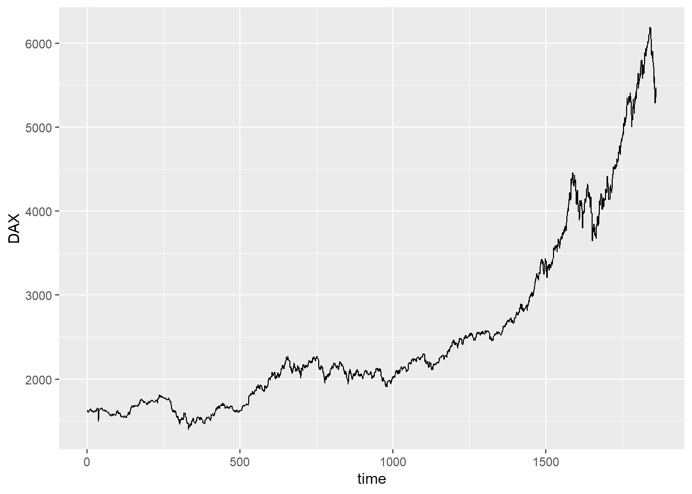
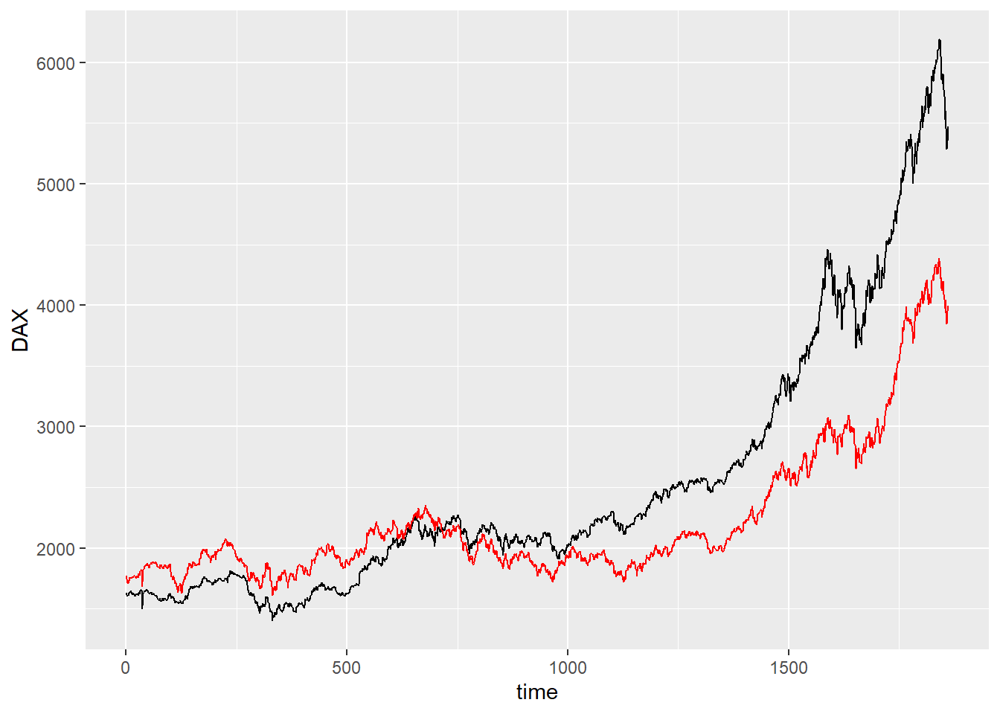
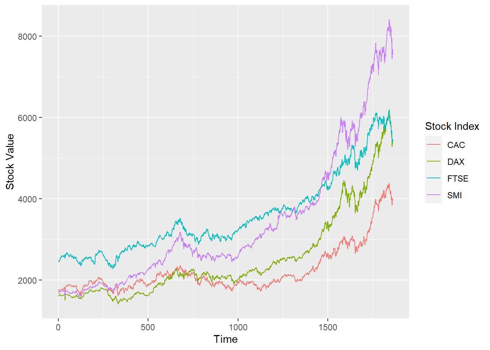
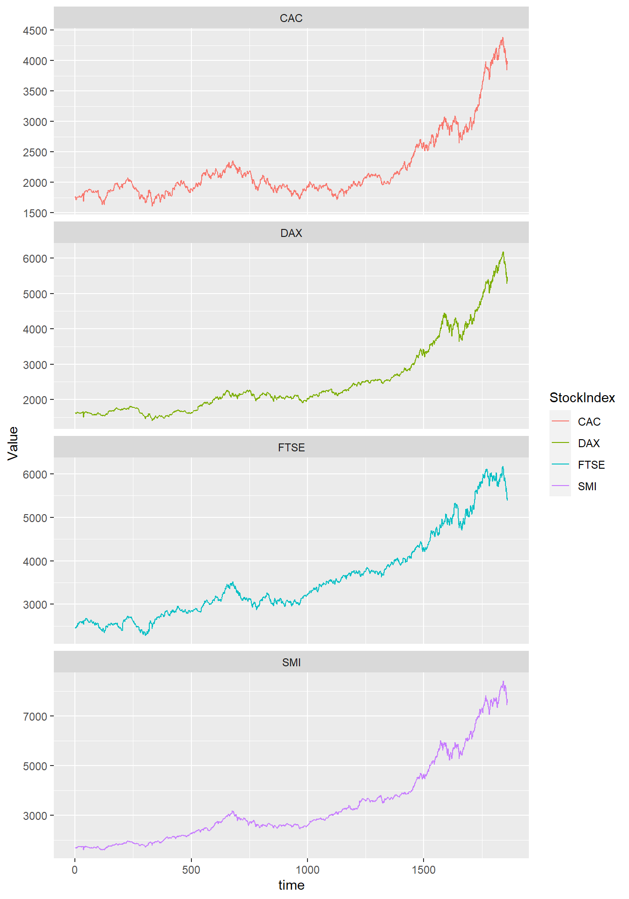

## Tidyr and ggplot


::: {.cell}

```{.r .cell-code}
here::i_am("git-r-101.Rproj")
library(here)
library(ggplot2)
library(dplyr)
library(tidyr)
library(plotly)
```
:::


do not include the rendered doc in the Git for ensuring the compatibility forcing. The rendered version can be for online CV.

### Multiple lines on a single graph


::: {.cell}

```{.r .cell-code}
eustock <- as.data.frame(EuStockMarkets)
n <- nrow(eustock)  # get the number of rows
eustock <- eustock %>% mutate(time = 1:n)  # adding a time variable

ggplot(eustock, aes(y = DAX, x = time)) +
  geom_line()
```

::: {.cell-output-display}
{width=672}
:::
:::

Ploting the evolution of the dacs / the years

#### Wrong solution


::: {.cell}

```{.r .cell-code}
ggplot(eustock, aes(y = DAX, x = time)) +
  geom_line()+
  geom_line(mapping = aes(y=CAC), color='red')
```

::: {.cell-output-display}
{width=672}
:::
:::


The problems:
- the y axis name is wrong
- colors must be specified manually
- we miss an associations between colors and names (legend missing)

#### Tydir solution


::: {.cell}

```{.r .cell-code}
# Convert to long format
eustock_long <- eustock |> pivot_longer(
                                        cols = -time, 
                                        names_to = "StockIndex", 
                                        values_to = "Value")

# Create the plot
ggplot(eustock_long, aes(
                        x = time, 
                        y = Value, 
                        color = StockIndex,
                        group = StockIndex)) +
  geom_line() +
    labs(
        y = "Stock Value", 
        x = "Time", 
        color = "Stock Index")
```

::: {.cell-output-display}
{width=672}
:::
:::

::: {.cell}

```{.r .cell-code}
print(eustock_long)
```

::: {.cell-output .cell-output-stdout}
```
# A tibble: 7,440 × 3
    time StockIndex Value
   <int> <chr>      <dbl>
 1     1 DAX        1629.
 2     1 SMI        1678.
 3     1 CAC        1773.
 4     1 FTSE       2444.
 5     2 DAX        1614.
 6     2 SMI        1688.
 7     2 CAC        1750.
 8     2 FTSE       2460.
 9     3 DAX        1607.
10     3 SMI        1679.
# ℹ 7,430 more rows
```
:::
:::


When in the long format, whe can use other features of ggplot: 

::: {.cell}

```{.r .cell-code}
ggplot(eustock_long, aes(
                        x = time, 
                        y = Value, 
                        color = StockIndex)) +
  geom_line() +
  facet_wrap(~StockIndex, ncol = 1, scales = 'free_y')
```

::: {.cell-output-display}
{width=672}
:::
:::

::: {.cell}

```{.r .cell-code}
# Convert to long format if not already done
eustock_long <- eustock %>% pivot_longer(
  cols = -time, 
  names_to = "StockIndex", 
  values_to = "Value"
)

# Create the ggplot object
p <- ggplot(eustock_long, aes(
                        x = time, 
                        y = Value, 
                        color = StockIndex,
                        group = StockIndex)) +
  geom_line() +
    labs(
        y = "Stock Value", 
        x = "Time", 
        color = "Stock Index")

# Convert to plotly object for interactivity
p <- ggplotly(p)

# Show the plot
p
```

::: {.cell-output-display}

```{=html}
<div class="plotly html-widget html-fill-item-overflow-hidden html-fill-item" id="htmlwidget-d679c8c02c0e7d539bdf" style="width:100%;height:464px;"></div>
<script type="application/json" data-for="htmlwidget-d679c8c02c0e7d539bdf">{"x":{"data":[{"x":[1,2,3,4,5,6,7,8,9,10,11,12,13,14,15,16,17,18,19,20,21,22,23,24,25,26,27,28,29,30,31,32,33,34,35,36,37,38,39,40,41,42,43,44,45,46,47,48,49,50,51,52,53,54,55,56,57,58,59,60,61,62,63,64,65,66,67,68,69,70,71,72,73,74,75,76,77,78,79,80,81,82,83,84,85,86,87,88,89,90,91,92,93,94,95,96,97,98,99,100,101,102,103,104,105,106,107,108,109,110,111,112,113,114,115,116,117,118,119,120,121,122,123,124,125,126,127,128,129,130,131,132,133,134,135,136,137,138,139,140,141,142,143,144,145,146,147,148,149,150,151,152,153,154,155,156,157,158,159,160,161,162,163,164,165,166,167,168,169,170,171,172,173,174,175,176,177,178,179,180,181,182,183,184,185,186,187,188,189,190,191,192,193,194,195,196,197,198,199,200,201,202,203,204,205,206,207,208,209,210,211,212,213,214,215,216,217,218,219,220,221,222,223,224,225,226,227,228,229,230,231,232,233,234,235,236,237,238,239,240,241,242,243,244,245,246,247,248,249,250,251,252,253,254,255,256,257,258,259,260,261,262,263,264,265,266,267,268,269,270,271,272,273,274,275,276,277,278,279,280,281,282,283,284,285,286,287,288,289,290,291,292,293,294,295,296,297,298,299,300,301,302,303,304,305,306,307,308,309,310,311,312,313,314,315,316,317,318,319,320,321,322,323,324,325,326,327,328,329,330,331,332,333,334,335,336,337,338,339,340,341,342,343,344,345,346,347,348,349,350,351,352,353,354,355,356,357,358,359,360,361,362,363,364,365,366,367,368,369,370,371,372,373,374,375,376,377,378,379,380,381,382,383,384,385,386,387,388,389,390,391,392,393,394,395,396,397,398,399,400,401,402,403,404,405,406,407,408,409,410,411,412,413,414,415,416,417,418,419,420,421,422,423,424,425,426,427,428,429,430,431,432,433,434,435,436,437,438,439,440,441,442,443,444,445,446,447,448,449,450,451,452,453,454,455,456,457,458,459,460,461,462,463,464,465,466,467,468,469,470,471,472,473,474,475,476,477,478,479,480,481,482,483,484,485,486,487,488,489,490,491,492,493,494,495,496,497,498,499,500,501,502,503,504,505,506,507,508,509,510,511,512,513,514,515,516,517,518,519,520,521,522,523,524,525,526,527,528,529,530,531,532,533,534,535,536,537,538,539,540,541,542,543,544,545,546,547,548,549,550,551,552,553,554,555,556,557,558,559,560,561,562,563,564,565,566,567,568,569,570,571,572,573,574,575,576,577,578,579,580,581,582,583,584,585,586,587,588,589,590,591,592,593,594,595,596,597,598,599,600,601,602,603,604,605,606,607,608,609,610,611,612,613,614,615,616,617,618,619,620,621,622,623,624,625,626,627,628,629,630,631,632,633,634,635,636,637,638,639,640,641,642,643,644,645,646,647,648,649,650,651,652,653,654,655,656,657,658,659,660,661,662,663,664,665,666,667,668,669,670,671,672,673,674,675,676,677,678,679,680,681,682,683,684,685,686,687,688,689,690,691,692,693,694,695,696,697,698,699,700,701,702,703,704,705,706,707,708,709,710,711,712,713,714,715,716,717,718,719,720,721,722,723,724,725,726,727,728,729,730,731,732,733,734,735,736,737,738,739,740,741,742,743,744,745,746,747,748,749,750,751,752,753,754,755,756,757,758,759,760,761,762,763,764,765,766,767,768,769,770,771,772,773,774,775,776,777,778,779,780,781,782,783,784,785,786,787,788,789,790,791,792,793,794,795,796,797,798,799,800,801,802,803,804,805,806,807,808,809,810,811,812,813,814,815,816,817,818,819,820,821,822,823,824,825,826,827,828,829,830,831,832,833,834,835,836,837,838,839,840,841,842,843,844,845,846,847,848,849,850,851,852,853,854,855,856,857,858,859,860,861,862,863,864,865,866,867,868,869,870,871,872,873,874,875,876,877,878,879,880,881,882,883,884,885,886,887,888,889,890,891,892,893,894,895,896,897,898,899,900,901,902,903,904,905,906,907,908,909,910,911,912,913,914,915,916,917,918,919,920,921,922,923,924,925,926,927,928,929,930,931,932,933,934,935,936,937,938,939,940,941,942,943,944,945,946,947,948,949,950,951,952,953,954,955,956,957,958,959,960,961,962,963,964,965,966,967,968,969,970,971,972,973,974,975,976,977,978,979,980,981,982,983,984,985,986,987,988,989,990,991,992,993,994,995,996,997,998,999,1000,1001,1002,1003,1004,1005,1006,1007,1008,1009,1010,1011,1012,1013,1014,1015,1016,1017,1018,1019,1020,1021,1022,1023,1024,1025,1026,1027,1028,1029,1030,1031,1032,1033,1034,1035,1036,1037,1038,1039,1040,1041,1042,1043,1044,1045,1046,1047,1048,1049,1050,1051,1052,1053,1054,1055,1056,1057,1058,1059,1060,1061,1062,1063,1064,1065,1066,1067,1068,1069,1070,1071,1072,1073,1074,1075,1076,1077,1078,1079,1080,1081,1082,1083,1084,1085,1086,1087,1088,1089,1090,1091,1092,1093,1094,1095,1096,1097,1098,1099,1100,1101,1102,1103,1104,1105,1106,1107,1108,1109,1110,1111,1112,1113,1114,1115,1116,1117,1118,1119,1120,1121,1122,1123,1124,1125,1126,1127,1128,1129,1130,1131,1132,1133,1134,1135,1136,1137,1138,1139,1140,1141,1142,1143,1144,1145,1146,1147,1148,1149,1150,1151,1152,1153,1154,1155,1156,1157,1158,1159,1160,1161,1162,1163,1164,1165,1166,1167,1168,1169,1170,1171,1172,1173,1174,1175,1176,1177,1178,1179,1180,1181,1182,1183,1184,1185,1186,1187,1188,1189,1190,1191,1192,1193,1194,1195,1196,1197,1198,1199,1200,1201,1202,1203,1204,1205,1206,1207,1208,1209,1210,1211,1212,1213,1214,1215,1216,1217,1218,1219,1220,1221,1222,1223,1224,1225,1226,1227,1228,1229,1230,1231,1232,1233,1234,1235,1236,1237,1238,1239,1240,1241,1242,1243,1244,1245,1246,1247,1248,1249,1250,1251,1252,1253,1254,1255,1256,1257,1258,1259,1260,1261,1262,1263,1264,1265,1266,1267,1268,1269,1270,1271,1272,1273,1274,1275,1276,1277,1278,1279,1280,1281,1282,1283,1284,1285,1286,1287,1288,1289,1290,1291,1292,1293,1294,1295,1296,1297,1298,1299,1300,1301,1302,1303,1304,1305,1306,1307,1308,1309,1310,1311,1312,1313,1314,1315,1316,1317,1318,1319,1320,1321,1322,1323,1324,1325,1326,1327,1328,1329,1330,1331,1332,1333,1334,1335,1336,1337,1338,1339,1340,1341,1342,1343,1344,1345,1346,1347,1348,1349,1350,1351,1352,1353,1354,1355,1356,1357,1358,1359,1360,1361,1362,1363,1364,1365,1366,1367,1368,1369,1370,1371,1372,1373,1374,1375,1376,1377,1378,1379,1380,1381,1382,1383,1384,1385,1386,1387,1388,1389,1390,1391,1392,1393,1394,1395,1396,1397,1398,1399,1400,1401,1402,1403,1404,1405,1406,1407,1408,1409,1410,1411,1412,1413,1414,1415,1416,1417,1418,1419,1420,1421,1422,1423,1424,1425,1426,1427,1428,1429,1430,1431,1432,1433,1434,1435,1436,1437,1438,1439,1440,1441,1442,1443,1444,1445,1446,1447,1448,1449,1450,1451,1452,1453,1454,1455,1456,1457,1458,1459,1460,1461,1462,1463,1464,1465,1466,1467,1468,1469,1470,1471,1472,1473,1474,1475,1476,1477,1478,1479,1480,1481,1482,1483,1484,1485,1486,1487,1488,1489,1490,1491,1492,1493,1494,1495,1496,1497,1498,1499,1500,1501,1502,1503,1504,1505,1506,1507,1508,1509,1510,1511,1512,1513,1514,1515,1516,1517,1518,1519,1520,1521,1522,1523,1524,1525,1526,1527,1528,1529,1530,1531,1532,1533,1534,1535,1536,1537,1538,1539,1540,1541,1542,1543,1544,1545,1546,1547,1548,1549,1550,1551,1552,1553,1554,1555,1556,1557,1558,1559,1560,1561,1562,1563,1564,1565,1566,1567,1568,1569,1570,1571,1572,1573,1574,1575,1576,1577,1578,1579,1580,1581,1582,1583,1584,1585,1586,1587,1588,1589,1590,1591,1592,1593,1594,1595,1596,1597,1598,1599,1600,1601,1602,1603,1604,1605,1606,1607,1608,1609,1610,1611,1612,1613,1614,1615,1616,1617,1618,1619,1620,1621,1622,1623,1624,1625,1626,1627,1628,1629,1630,1631,1632,1633,1634,1635,1636,1637,1638,1639,1640,1641,1642,1643,1644,1645,1646,1647,1648,1649,1650,1651,1652,1653,1654,1655,1656,1657,1658,1659,1660,1661,1662,1663,1664,1665,1666,1667,1668,1669,1670,1671,1672,1673,1674,1675,1676,1677,1678,1679,1680,1681,1682,1683,1684,1685,1686,1687,1688,1689,1690,1691,1692,1693,1694,1695,1696,1697,1698,1699,1700,1701,1702,1703,1704,1705,1706,1707,1708,1709,1710,1711,1712,1713,1714,1715,1716,1717,1718,1719,1720,1721,1722,1723,1724,1725,1726,1727,1728,1729,1730,1731,1732,1733,1734,1735,1736,1737,1738,1739,1740,1741,1742,1743,1744,1745,1746,1747,1748,1749,1750,1751,1752,1753,1754,1755,1756,1757,1758,1759,1760,1761,1762,1763,1764,1765,1766,1767,1768,1769,1770,1771,1772,1773,1774,1775,1776,1777,1778,1779,1780,1781,1782,1783,1784,1785,1786,1787,1788,1789,1790,1791,1792,1793,1794,1795,1796,1797,1798,1799,1800,1801,1802,1803,1804,1805,1806,1807,1808,1809,1810,1811,1812,1813,1814,1815,1816,1817,1818,1819,1820,1821,1822,1823,1824,1825,1826,1827,1828,1829,1830,1831,1832,1833,1834,1835,1836,1837,1838,1839,1840,1841,1842,1843,1844,1845,1846,1847,1848,1849,1850,1851,1852,1853,1854,1855,1856,1857,1858,1859,1860],"y":[1772.8,1750.5,1718,1708.0999999999999,1723.0999999999999,1714.3,1734.5,1757.4000000000001,1754,1754.3,1759.8,1755.5,1758.0999999999999,1757.5,1763.5,1762.8,1768.9000000000001,1778.0999999999999,1780.0999999999999,1767.7,1757.9000000000001,1756.5999999999999,1754.7,1766.8,1766.5,1762.2,1759.5,1782.4000000000001,1789.5,1783.5,1780.4000000000001,1808.8,1820.3,1820.3,1820.3,1687.5,1725.5999999999999,1792.9000000000001,1819.0999999999999,1833.5,1853.4000000000001,1849.7,1851.8,1857.7,1864.3,1863.5,1873.2,1860.8,1868.7,1860.4000000000001,1855.9000000000001,1840.5,1842.5999999999999,1861.2,1876.2,1878.3,1878.4000000000001,1869.4000000000001,1880.4000000000001,1885.5,1888.4000000000001,1885.2,1877.9000000000001,1876.5,1883.8,1880.5999999999999,1887.4000000000001,1878.3,1867.0999999999999,1851.9000000000001,1843.5999999999999,1848.0999999999999,1843.4000000000001,1843.5999999999999,1833.8,1833.4000000000001,1856.9000000000001,1863.4000000000001,1855.5,1864.2,1846,1836.8,1830.4000000000001,1831.5999999999999,1834.8,1852.0999999999999,1849.8,1861.8,1856.7,1856.7,1841.5,1846.9000000000001,1836.0999999999999,1838.5999999999999,1857.5999999999999,1857.5999999999999,1858.4000000000001,1846.8,1868.5,1863.2,1808.3,1765.0999999999999,1763.5,1766,1741.3,1743.3,1769,1757.9000000000001,1754.9000000000001,1739.7,1708.8,1722.2,1713.9000000000001,1703.2,1685.7,1663.4000000000001,1636.9000000000001,1645.5999999999999,1671.5999999999999,1688.3,1696.8,1711.7,1706.2,1684.2,1648.5,1633.5999999999999,1699.0999999999999,1699.0999999999999,1722.5,1720.7,1741.9000000000001,1765.7,1765.7,1749.9000000000001,1770.3,1787.5999999999999,1778.7,1785.5999999999999,1833.9000000000001,1837.4000000000001,1824.3,1843.8,1873.5999999999999,1860.2,1860.2,1865.9000000000001,1867.9000000000001,1841.3,1838.7,1849.9000000000001,1869.3,1890.5999999999999,1879.5999999999999,1873.9000000000001,1875.3,1857,1856.5,1865.8,1860.5999999999999,1861.5999999999999,1865.5999999999999,1864.0999999999999,1861.5999999999999,1876.5,1865.0999999999999,1882.0999999999999,1912.2,1915.4000000000001,1951.2,1962.4000000000001,1976.5,1953.5,1981.3,1985.0999999999999,1983.4000000000001,1979.7,1983.8,1988.0999999999999,1973,1966.9000000000001,1976.3,1993.9000000000001,1968,1941.8,1947.0999999999999,1929.2,1943.5999999999999,1928.2,1922,1919.0999999999999,1884.5999999999999,1896.3,1928.3,1934.8,1923.5,1943.8,1942.4000000000001,1928.0999999999999,1942,1942.7,1974.8,1975.4000000000001,1907.5,1943.5999999999999,1974.0999999999999,1963.3,1972.3,1990.7,1978.2,1978.2,1978.2,1980.4000000000001,1983.7,1978.0999999999999,1984.9000000000001,1995.7,2006.5999999999999,2036.7,2031.0999999999999,2031.0999999999999,2041.5999999999999,2046.9000000000001,2047.2,2063.4000000000001,2063.4000000000001,2077.5,2063.5999999999999,2053.1999999999998,2017,2024,2051.5999999999999,2023.0999999999999,2030.8,2016.8,2045.0999999999999,2046.3,2029.5999999999999,2014.0999999999999,2014.0999999999999,2033.3,2017.4000000000001,2024.9000000000001,1992.5999999999999,1994.9000000000001,1981.5999999999999,1981.5999999999999,1962.2,1953.7,1928.8,1928.3,1918.0999999999999,1931.4000000000001,1908.8,1891.8,1913.9000000000001,1885.8,1895.8,1899.5999999999999,1920.3,1915.3,1907.3,1900.5999999999999,1880.9000000000001,1873.5,1883.5999999999999,1868.5,1879.0999999999999,1847.8,1861.8,1859.4000000000001,1859.4000000000001,1859.4000000000001,1853.3,1851.2,1801.8,1767.9000000000001,1762.7,1727.5,1734.5999999999999,1734.5999999999999,1755.4000000000001,1769,1801.5999999999999,1782.5999999999999,1754.7,1784.4000000000001,1787.5999999999999,1798,1793.8,1777.3,1755.2,1737.8,1730.0999999999999,1722.4000000000001,1753.5,1757.3,1736.7,1734.2,1724.2,1744.2,1689.7,1667.7,1667.8,1687.5999999999999,1687.5,1684.9000000000001,1674.2,1711.4000000000001,1780.5,1779,1779.3,1763.7,1756.8,1774.2,1802,1873.5999999999999,1836.2,1859.8,1852.7,1882.9000000000001,1826.0999999999999,1832.8,1828.9000000000001,1829.5,1843.5,1770.3,1731.9000000000001,1736.7,1724,1683.3,1611,1612.5,1654.2,1673.9000000000001,1657.3,1655.0999999999999,1685.0999999999999,1667.9000000000001,1650,1664.2,1679.0999999999999,1731.3,1722.2,1730.7,1766.4000000000001,1770.7,1774.5,1749.9000000000001,1730.9000000000001,1742.4000000000001,1742.4000000000001,1786.9000000000001,1804.0999999999999,1804.7,1793.5999999999999,1786.7,1798.5,1798.5,1821.5,1796.8,1772.7,1764.4000000000001,1759.2,1722.3,1724.2,1674.8,1720.5999999999999,1721,1739.7,1749.7,1771.4000000000001,1792.3,1783.3,1799.4000000000001,1781.7,1788.5999999999999,1765.9000000000001,1791.2,1769.5,1758.7,1738.3,1744.8,1736.7,1735.2,1760.0999999999999,1786.3,1824.4000000000001,1821.0999999999999,1854.5999999999999,1854.5999999999999,1857.5,1870.3,1858.8,1857.8,1857.8,1843.0999999999999,1850.8,1859.5999999999999,1844.5,1852.5999999999999,1814.5999999999999,1796.8,1782.5,1803.5,1827.0999999999999,1837.5,1837.7,1818.8,1812.2,1820.4000000000001,1779.9000000000001,1792.5999999999999,1777.4000000000001,1780.5999999999999,1772.2,1785.9000000000001,1787.3,1824.0999999999999,1854.4000000000001,1908.2,1904.7,1894.0999999999999,1893.3,1905.5999999999999,1912,1899.5,1878.2,1905,1926.5,1937.2,1959.2,1944.0999999999999,1953.4000000000001,1944.5999999999999,1983.7,1998.8,2001.5,1995.2,1986.8,1995.0999999999999,2004.3,2009.7,1992.4000000000001,1988.9000000000001,1965.2,1986,1975.3,1967.3,1963.5,1962.7,1939.3,1952.2,1954.5999999999999,2001.4000000000001,2025.8,2033.9000000000001,2035.9000000000001,2031.4000000000001,2005.9000000000001,1990.8,1974.7,1995.3,1984,1986.9000000000001,1986.9000000000001,1986.9000000000001,2018.0999999999999,2015.4000000000001,1988.5999999999999,1986.7,1968.9000000000001,1949.3,1931.9000000000001,1944.5,1916.5999999999999,1911.5999999999999,1927.4000000000001,1942.5,1920.5999999999999,1939,1937,1923.5999999999999,1926.3,1920.5,1878.5999999999999,1877.2,1854.5,1872.7,1879.9000000000001,1851.7,1835.7,1846.4000000000001,1836.8,1836.8,1836.8,1861.4000000000001,1891.0999999999999,1890.4000000000001,1904.5999999999999,1888.7,1888.7,1872.8,1875.8,1867.9000000000001,1859.7,1887.9000000000001,1893.7,1915.2,1911.2,1920.4000000000001,1916.8,1897.9000000000001,1918.8,1900.3,1910.3,1929.2,1935.3,1942.4000000000001,1963.3,1960.8,1991,1977.5,1971.9000000000001,1960.2,1941.2,1925.4000000000001,1935.0999999999999,1943.7,1980.4000000000001,1985.7,1992.2,1991.2,1991.2,1963.0999999999999,1974.9000000000001,1981.7,1968.4000000000001,1947.5,1965.7,1995,2006.2,1998.0999999999999,1989.5,2036,2085.9000000000001,2129,2110.5999999999999,2101.4000000000001,2115.3000000000002,2149.8000000000002,2138.5,2139.8000000000002,2167.4000000000001,2161.9000000000001,2148,2148,2136.3000000000002,2160.8000000000002,2139.1999999999998,2128.1999999999998,2111.4000000000001,2123.4000000000001,2159.3000000000002,2173.5999999999999,2183.9000000000001,2205.6999999999998,2216.5,2191.9000000000001,2185.0999999999999,2156.0999999999999,2158,2137.3000000000002,2129.4000000000001,2108.8000000000002,2108.4000000000001,2119.0999999999999,2134.0999999999999,2078.5,2075.5999999999999,2099.5,2107.4000000000001,2094.4000000000001,2080,2057.5,2092.5999999999999,2108.5999999999999,2120,2126.8000000000002,2114.5999999999999,2116.6999999999998,2128.6999999999998,2158.8000000000002,2164.5,2147.4000000000001,2156.4000000000001,2138.6999999999998,2126.9000000000001,2127.3000000000002,2113.9000000000001,2139.3000000000002,2145,2147.3000000000002,2149.6999999999998,2199.6999999999998,2231.9000000000001,2227.6999999999998,2210.4000000000001,2192,2196,2182,2182,2169.6999999999998,2171.1999999999998,2136,2081,2084.8000000000002,2112.9000000000001,2087.3000000000002,2087.3000000000002,2096.9000000000001,2117.9000000000001,2115.9000000000001,2148,2149.6999999999998,2145.1999999999998,2082.5999999999999,2071.5,2070.5999999999999,2118.4000000000001,2120.5999999999999,2119.3000000000002,2110.0999999999999,2154,2160.5,2188.4000000000001,2186.6999999999998,2176.0999999999999,2205.3000000000002,2211.4000000000001,2198.0999999999999,2196.3000000000002,2156.5,2162.5999999999999,2160.3000000000002,2196.4000000000001,2223.5,2215.9000000000001,2225.8000000000002,2243,2251.5,2276.5999999999999,2264.5999999999999,2281.9000000000001,2281.1999999999998,2268.1999999999998,2290.5999999999999,2274.3000000000002,2249.5999999999999,2275.0999999999999,2307.5999999999999,2317.3000000000002,2331.3000000000002,2281.9000000000001,2252.1999999999998,2262.3000000000002,2234.8000000000002,2247.4000000000001,2274.6999999999998,2257.8000000000002,2244,2274.5,2278.3000000000002,2282.4000000000001,2281,2313.1999999999998,2334.4000000000001,2331.3000000000002,2355.9000000000001,2322,2329.1999999999998,2287.0999999999999,2299.9000000000001,2302.0999999999999,2296.8000000000002,2275.0999999999999,2281.5999999999999,2258,2258,2281.1999999999998,2251.8000000000002,2215.1999999999998,2226.6999999999998,2252,2208.3000000000002,2199,2238.0999999999999,2183.0999999999999,2144.6999999999998,2144.6999999999998,2178.6999999999998,2219.9000000000001,2216.4000000000001,2199.6999999999998,2184.5999999999999,2175,2215,2258.5,2242.6999999999998,2247.8000000000002,2221.3000000000002,2202.6999999999998,2200.6999999999998,2200.1999999999998,2152.5999999999999,2136.5999999999999,2144.5,2123.4000000000001,2083.9000000000001,2081.9000000000001,2081.9000000000001,2081.9000000000001,2100.3000000000002,2128.1999999999998,2119.5999999999999,2114.8000000000002,2145.3000000000002,2148.5999999999999,2152.4000000000001,2139.0999999999999,2159.5999999999999,2160.0999999999999,2136,2102.6999999999998,2092,2135.1999999999998,2116.3000000000002,2130.9000000000001,2147.3000000000002,2150.3000000000002,2166,2186.1999999999998,2179,2141.5999999999999,2162.5999999999999,2158.1999999999998,2139.4000000000001,2165,2176.6999999999998,2176.6999999999998,2187,2187.8000000000002,2195.1999999999998,2184,2165.4000000000001,2155.4000000000001,2155.4000000000001,2133.3000000000002,2084.4000000000001,2091.9000000000001,2050.6999999999998,2052.5,2029.9000000000001,1979.7,2007.4000000000001,2041.7,2037.2,2023.7,2046.8,2028.4000000000001,2020.7,1977.7,1992,1966.4000000000001,1942.8,1936,1903,1890.8,1917,1939,1907,1911.5999999999999,1925.8,1936.3,1892,1872.9000000000001,1866.2,1878.7,1889,1920.8,1920.8,1949.8,1942.0999999999999,1974.5999999999999,1974.5999999999999,1974.5999999999999,2025.0999999999999,2052.3000000000002,2043.7,2053.8000000000002,2041.4000000000001,2059.8000000000002,2076.8000000000002,2055.6999999999998,2053.4000000000001,2075,2069.5999999999999,2117.1999999999998,2115,2096.5,2107.0999999999999,2106.3000000000002,2074.5,2064.1999999999998,2038.9000000000001,2007,2007,2012.4000000000001,2035,2010.5,2001.3,1972.5999999999999,2000.5999999999999,2006.3,2026.5,2062.6999999999998,2075.3000000000002,2060.4000000000001,2069.0999999999999,2034.9000000000001,2020.4000000000001,1998.2,1961.5,1964.2,1983.4000000000001,1948.8,1966.8,1969.4000000000001,1952.9000000000001,1977.3,1924.5999999999999,1922.9000000000001,1919.3,1897.2,1899.4000000000001,1927.4000000000001,1902.7,1901.3,1905,1876.2,1879.3,1852.8,1876.0999999999999,1833.7,1843.4000000000001,1856.4000000000001,1898.3,1919,1918.0999999999999,1955.5999999999999,1933,1906.4000000000001,1898.5999999999999,1876.3,1867.4000000000001,1842.0999999999999,1841.5999999999999,1824.4000000000001,1831.5,1858.0999999999999,1905.7,1905.7,1905.7,1873.5999999999999,1911.0999999999999,1931.7,1906.0999999999999,1921.5,1943.9000000000001,1948.4000000000001,1948.4000000000001,1941.0999999999999,1954.5,1950.2,1927.5,1926.5,1927.8,1911.4000000000001,1893.0999999999999,1934.7,1945.9000000000001,1952.4000000000001,1940,1975.9000000000001,1964,1982.7,1973.7,1969,1969.8,1954.0999999999999,1937,1919.3,1917.0999999999999,1930.2,1931.0999999999999,1924.2,1928.0999999999999,1924.7,1940.9000000000001,1952.0999999999999,1949.9000000000001,1966.5999999999999,1956,1927.8,1894.2,1881.2,1881.2,1885.9000000000001,1901.8,1871.5,1886.4000000000001,1864.2,1859.2,1849.0999999999999,1844.0999999999999,1854,1872.8,1856.9000000000001,1860.3,1837.0999999999999,1813.3,1772.8,1780.2,1802.5,1826.3,1814.0999999999999,1813.4000000000001,1797.9000000000001,1827.8,1816.0999999999999,1842.4000000000001,1872.0999999999999,1870.4000000000001,1850.9000000000001,1874.4000000000001,1869.4000000000001,1850.0999999999999,1856.0999999999999,1861.9000000000001,1835,1822.5,1802.2,1805.5999999999999,1804.4000000000001,1827,1805.7,1802.2,1776.9000000000001,1808.4000000000001,1807.4000000000001,1795.2,1773.3,1748.5999999999999,1756.8,1727.0999999999999,1743.0999999999999,1721.8,1769,1738.5999999999999,1785.8,1788.8,1811.5999999999999,1813.8,1818,1795.7,1817.3,1836.0999999999999,1837.2,1852.4000000000001,1893,1859.5,1864,1882.8,1872.9000000000001,1890.2,1900.4000000000001,1880.9000000000001,1869.3,1871.9000000000001,1881.0999999999999,1881.0999999999999,1881.0999999999999,1855.7,1874.9000000000001,1882,1928.4000000000001,1918.5,1945.9000000000001,1942.3,1931,1918.5,1918.5,1936.9000000000001,1971.0999999999999,1946.2,1927.4000000000001,1927.4000000000001,1988.7,1996.7,2003.5999999999999,2017.3,1991.5,2001.3,2004.7,1989.8,1965.5,1979.5,1965.3,1960.7,1960.7,1919.0999999999999,1927.8,1927.3,1948,1960.8,1971.3,1971.3,1965.9000000000001,1974.7,1951.2,1897,1907.8,1922.8,1893.7,1920.7,1905,1918.4000000000001,1896.0999999999999,1902.8,1925.2,1895.0999999999999,1902.4000000000001,1877.7,1865.5,1861.9000000000001,1858.8,1879.7,1889.4000000000001,1907.8,1889.5,1950.8,1949.4000000000001,1961.3,1961.7,1948.3,1948.3,1951.5,1929,1931.2,1905.9000000000001,1908.9000000000001,1926.5999999999999,1941.3,1942.5,1947.9000000000001,1932.8,1920,1917.8,1960,1950.8,1957.0999999999999,1950.4000000000001,1954.7,1943.7,1949.2,1946.2,1946.2,1946.2,1970.4000000000001,1967.3,1971.5999999999999,1984.4000000000001,1963.3,1957.4000000000001,1939.2,1937.8,1890.0999999999999,1899.5,1921.4000000000001,1883.4000000000001,1881.7,1900.5,1902.5,1884.8,1861.7,1854.9000000000001,1869.7,1873.5999999999999,1898.2,1892.4000000000001,1880,1871.7,1882.5,1863.8,1853.9000000000001,1790.7,1800.5999999999999,1816.3,1791.8,1767.5999999999999,1788.4000000000001,1780.7,1800.7,1803.9000000000001,1800.3,1809.5999999999999,1785.7,1778,1794.4000000000001,1803.8,1817,1790.5,1779.7,1770.7,1757.3,1740.7,1721.0999999999999,1724.2,1764.0999999999999,1754.0999999999999,1742.4000000000001,1795.3,1814,1814,1828.7,1832.0999999999999,1822.5999999999999,1857.4000000000001,1866.3,1852.5999999999999,1839.8,1838.2,1838.2,1875.2,1905.0999999999999,1890.5,1881.4000000000001,1872.9000000000001,1875.5,1867.0999999999999,1891,1889.8,1870.3,1857.3,1828.3,1820.9000000000001,1774.9000000000001,1814.9000000000001,1834.8,1846.8,1856.3,1849.5999999999999,1848.9000000000001,1833.8,1875,1859.3,1820.5,1810.2,1831.2,1834.4000000000001,1873.4000000000001,1873.4000000000001,1866.7,1877,1879.0999999999999,1872,1872,1908.4000000000001,1943,1931.2,1917.7,1916.5999999999999,1916.3,1910.0999999999999,1897.9000000000001,1907.5999999999999,1924.4000000000001,1952.0999999999999,1966,1960.0999999999999,1964.3,1954.4000000000001,1934.0999999999999,1946,1950.2,1966.7,1980.7,2003.0999999999999,2021,2024.0999999999999,2022.2,1985.5999999999999,1988.5,1983.3,1956.2,1960.7,1967.7,1983.3,1956.4000000000001,1964.2,1952.5,1939.7,1932.4000000000001,1936.9000000000001,1953.3,1976.9000000000001,1960.9000000000001,1974.5,1996.9000000000001,1990.8,2017.2,2015.3,2001.9000000000001,2005.9000000000001,2008,1975.5,1948.9000000000001,1932.0999999999999,1944.3,1962.4000000000001,1950.0999999999999,1965,1967.2,1969.8,1976.9000000000001,1974.4000000000001,2003.8,2008,2030.5,2020,2044.8,2055.5999999999999,2070.4000000000001,2064,2075,2075,2075,2081.6999999999998,2093.9000000000001,2072.5,2074.6999999999998,2080.5999999999999,2097.3000000000002,2075.0999999999999,2086,2092.5,2116.5,2112,2122.0999999999999,2116.4000000000001,2138.4000000000001,2130.8000000000002,2146.8000000000002,2146.8000000000002,2136.8000000000002,2115.4000000000001,2090.4000000000001,2083.6999999999998,2083.6999999999998,2085.4000000000001,2114.8000000000002,2100.9000000000001,2122.0999999999999,2124.5999999999999,2124.5999999999999,2136.9000000000001,2120.5999999999999,2129.6999999999998,2103.5,2114.5,2117.6999999999998,2117.6999999999998,2132.9000000000001,2117.0999999999999,2108.4000000000001,2110.0999999999999,2121.0999999999999,2111,2115.4000000000001,2133.1999999999998,2102,2120.8000000000002,2137.5,2137.3000000000002,2126.1999999999998,2111.8000000000002,2113,2107.9000000000001,2100.6999999999998,2077.0999999999999,2084.1999999999998,2097.5999999999999,2118.4000000000001,2113.3000000000002,2112.9000000000001,2123.6999999999998,2118.8000000000002,2111.8000000000002,2114,2126.8000000000002,2098.8000000000002,2079.0999999999999,2076.5999999999999,2081.9000000000001,2073.4000000000001,2050.5999999999999,2029.5,1989.5,1995.0999999999999,2007.3,1992.8,1960.3,1982.2,1954.0999999999999,1974.7,1962.9000000000001,1961.0999999999999,1968.5,1995.9000000000001,2009.9000000000001,2023.4000000000001,2013.2,1999.3,1996.7,1997.4000000000001,1985.4000000000001,1978.2,1980.5999999999999,1979.5,1979.5,1979.5,1986.2,2019.3,2000.5999999999999,2017.8,2020.8,2020.4000000000001,2018,2002.9000000000001,1977.5999999999999,1970.5999999999999,1977,1971.4000000000001,1984.8,1996.2,2004.8,2020.3,2042.0999999999999,2038.0999999999999,2065.4000000000001,2080.4000000000001,2086.1999999999998,2080.9000000000001,2072.6999999999998,2082.3000000000002,2079.5,2067.0999999999999,2081.5,2103.4000000000001,2104.0999999999999,2107.0999999999999,2132.8000000000002,2123.1999999999998,2141.8000000000002,2136.0999999999999,2152.6999999999998,2151.5999999999999,2161.5,2146.6999999999998,2135.5999999999999,2147.0999999999999,2143.5999999999999,2168.3000000000002,2158.5,2165.3000000000002,2185.1999999999998,2180.1999999999998,2175.5999999999999,2148.9000000000001,2151.5999999999999,2162.4000000000001,2150.4000000000001,2125.6999999999998,2124.8000000000002,2140.5,2140.5,2142.1999999999998,2187.3000000000002,2213.4000000000001,2211.8000000000002,2205.1999999999998,2205.1999999999998,2229.0999999999999,2217.1999999999998,2218.1999999999998,2240.3000000000002,2228.8000000000002,2240.0999999999999,2233.4000000000001,2233.5999999999999,2255.5,2277.0999999999999,2275.0999999999999,2270.8000000000002,2290.3000000000002,2315.6999999999998,2318.5999999999999,2349.0999999999999,2308.6999999999998,2292.5,2240.6999999999998,2255.8000000000002,2251.4000000000001,2213.3000000000002,2212.0999999999999,2203.4000000000001,2222.5999999999999,2193.6999999999998,2218.9000000000001,2248.6999999999998,2278.5,2287.4000000000001,2289.5999999999999,2289.5999999999999,2303.8000000000002,2307,2318.5999999999999,2315.6999999999998,2315.6999999999998,2257,2282.8000000000002,2306.6999999999998,2301.6999999999998,2331.5999999999999,2349.0999999999999,2327.5,2361.3000000000002,2402.0999999999999,2388,2407.8000000000002,2425.0999999999999,2406.0999999999999,2409.9000000000001,2442.5,2461.3000000000002,2430.3000000000002,2435.1999999999998,2482.8000000000002,2465,2503.0999999999999,2516.5999999999999,2508.5999999999999,2503.0999999999999,2541.3000000000002,2558.4000000000001,2597.5,2595.4000000000001,2582.0999999999999,2599.3000000000002,2628.4000000000001,2627.4000000000001,2634.5,2617.5,2594.8000000000002,2575.1999999999998,2562.8000000000002,2567.9000000000001,2607.6999999999998,2602.1999999999998,2629.4000000000001,2607.8000000000002,2600.3000000000002,2651.6999999999998,2666.1999999999998,2698.9000000000001,2708.3000000000002,2709.1999999999998,2686.1999999999998,2641.6999999999998,2632.0999999999999,2645.5999999999999,2588.4000000000001,2574,2596.8000000000002,2553.6999999999998,2587.0999999999999,2579.3000000000002,2624.3000000000002,2648.6999999999998,2656.6999999999998,2656.6999999999998,2656.6999999999998,2581.8000000000002,2530.3000000000002,2514.5,2518,2572.3000000000002,2579,2617.5999999999999,2608,2574.5999999999999,2566.0999999999999,2620.5999999999999,2621,2615.1999999999998,2547.5999999999999,2522.6999999999998,2514.6999999999998,2533.5999999999999,2539.8000000000002,2536.3000000000002,2550.3000000000002,2602.9000000000001,2639.5,2639.5,2655.3000000000002,2672.8000000000002,2651.9000000000001,2643.3000000000002,2643.3000000000002,2633.9000000000001,2693.0999999999999,2719.5999999999999,2774.5999999999999,2776,2784.3000000000002,2784.3000000000002,2751.0999999999999,2786.4000000000001,2741.6999999999998,2762.9000000000001,2654.6999999999998,2680.3000000000002,2583.1999999999998,2579.1999999999998,2583.9000000000001,2601.5,2624.5,2635.4000000000001,2690.9000000000001,2719.3000000000002,2686.1999999999998,2664.1999999999998,2696.1999999999998,2760.3000000000002,2808.5,2795.9000000000001,2762.5999999999999,2751.6999999999998,2739.6999999999998,2757.0999999999999,2762.1999999999998,2784.8000000000002,2867.4000000000001,2893.5999999999999,2891,2858.3000000000002,2944,2909.5,2937,2934.5,2947.6999999999998,2929.8000000000002,2950.5999999999999,2929.0999999999999,2941.5999999999999,2941.5999999999999,2950.6999999999998,2988,2958.5999999999999,2876.6999999999998,2874.0999999999999,2921.0999999999999,3003.5,2973.5,3025.9000000000001,3022.1999999999998,3023.5999999999999,3069.3000000000002,3075.6999999999998,3049.5,2992.4000000000001,2984.0999999999999,3037.0999999999999,3056.3000000000002,2996.3000000000002,2983.4000000000001,2998.5999999999999,2924,2921.8000000000002,2921.8000000000002,2870.0999999999999,2936.1999999999998,2979.3000000000002,2957.1999999999998,2904.1999999999998,2898.5999999999999,2869.3000000000002,2871.6999999999998,2828.4000000000001,2770.5,2805.8000000000002,2921.1999999999998,2918,2927,2924.5,2940.9000000000001,2919.6999999999998,2874.5999999999999,2843.5999999999999,2834.0999999999999,2898.5999999999999,2940.5999999999999,2944,2978.4000000000001,2977.1999999999998,3017.5,2997.1999999999998,3023.6999999999998,3005.4000000000001,2985.5999999999999,2989,3008.3000000000002,3054.9000000000001,3052.0999999999999,3094,3078,3064.4000000000001,3024.0999999999999,2960.6999999999998,2955.0999999999999,3002.9000000000001,3002.5,2992.1999999999998,2992.9000000000001,2958,2946.6999999999998,2989.9000000000001,2958.0999999999999,2856.9000000000001,2849,2769.5999999999999,2651.3000000000002,2818,2739.5,2739.3000000000002,2788,2774.9000000000001,2822.4000000000001,2781.8000000000002,2707.0999999999999,2707.0999999999999,2707.0999999999999,2694.5,2700.6999999999998,2698.9000000000001,2773,2782.5999999999999,2790.5999999999999,2821.1999999999998,2861.6999999999998,2802.5,2786.3000000000002,2811.6999999999998,2829,2854.4000000000001,2918.5,2913.0999999999999,2902.4000000000001,2914.5,2910.0999999999999,2932.5,2959.4000000000001,2932.1999999999998,2828.5,2830.3000000000002,2838.3000000000002,2912.1999999999998,2893.3000000000002,2894.5,2822.9000000000001,2869.6999999999998,2858.0999999999999,2874.0999999999999,2874.0999999999999,2875.0999999999999,2939.5,2975.5,2998.9000000000001,2998.9000000000001,3038.6999999999998,3072.8000000000002,3037.6999999999998,3006.6999999999998,2954.9000000000001,2919.8000000000002,2862.5,2902.9000000000001,2919.8000000000002,2932.8000000000002,2976.0999999999999,2987,3008.3000000000002,2998.0999999999999,2988.5999999999999,2966.1999999999998,3000.5,3052,3088.3000000000002,3133.8000000000002,3172.0999999999999,3187.5,3188.4000000000001,3166.3000000000002,3189.5999999999999,3216.6999999999998,3220.9000000000001,3235.8000000000002,3240,3178.6999999999998,3187.6999999999998,3225.0999999999999,3280.5,3281.6999999999998,3250.5999999999999,3262.5,3273.5,3262.3000000000002,3348.1999999999998,3397,3421.9000000000001,3446.6999999999998,3414.9000000000001,3381.3000000000002,3395.8000000000002,3483.1999999999998,3525.9000000000001,3521.5,3539.4000000000001,3526.5999999999999,3540.1999999999998,3598.3000000000002,3661.3000000000002,3652.5,3688.6999999999998,3688.9000000000001,3680.0999999999999,3738.5,3818.6999999999998,3783.8000000000002,3810.1999999999998,3800.1999999999998,3875.3000000000002,3883.3000000000002,3935.9000000000001,3932,3986.8000000000002,3903.3000000000002,3873.9000000000001,3894.5,3894.5,3894.5,3867.6999999999998,3884.5999999999999,3845.9000000000001,3861.5999999999999,3885.6999999999998,3860.4000000000001,3835.0999999999999,3822.0999999999999,3788.6999999999998,3689.4000000000001,3777.1999999999998,3726.1999999999998,3867.9000000000001,3867.9000000000001,3979.3000000000002,3945.5,3947.5,3912.8000000000002,3912.8000000000002,4007.3000000000002,3986.0999999999999,4018.5,4012,3990.1999999999998,3945.3000000000002,3980.8000000000002,4047.9000000000001,4047.9000000000001,4049.8000000000002,4108.6999999999998,4115.8999999999996,4017.4000000000001,4014.9000000000001,4041.1999999999998,4041.1999999999998,4087,4149.3999999999996,4119,4185.1000000000004,4204.6000000000004,4201.8999999999996,4208.6000000000004,4141.6000000000004,4050.8000000000002,4005.3000000000002,4013.3000000000002,4092.9000000000001,4052.3000000000002,4027.3000000000002,4018.5999999999999,4065,4126.3000000000002,4203.8000000000002,4215.6999999999998,4248.1999999999998,4203.5,4260.6999999999998,4252.1000000000004,4304.3999999999996,4311.1000000000004,4333.1000000000004,4339.8999999999996,4319.1999999999998,4256.3999999999996,4256.3999999999996,4256.3999999999996,4344.3000000000002,4358.1000000000004,4388.5,4368.8999999999996,4322.1000000000004,4220.1000000000004,4235.8999999999996,4205.3999999999996,4139.5,4122.3999999999996,4139.1999999999998,4197.6000000000004,4177.3000000000002,4095,4047.9000000000001,3976.4000000000001,3968.5999999999999,4041.9000000000001,3939.5,3846,3945.6999999999998,3951.6999999999998,3995],"text":["time:    1<br />Value: 1772.80<br />StockIndex: CAC<br />StockIndex: CAC","time:    2<br />Value: 1750.50<br />StockIndex: CAC<br />StockIndex: CAC","time:    3<br />Value: 1718.00<br />StockIndex: CAC<br />StockIndex: CAC","time:    4<br />Value: 1708.10<br />StockIndex: CAC<br />StockIndex: CAC","time:    5<br />Value: 1723.10<br />StockIndex: CAC<br />StockIndex: CAC","time:    6<br />Value: 1714.30<br />StockIndex: CAC<br />StockIndex: CAC","time:    7<br />Value: 1734.50<br />StockIndex: CAC<br />StockIndex: CAC","time:    8<br />Value: 1757.40<br />StockIndex: CAC<br />StockIndex: CAC","time:    9<br />Value: 1754.00<br />StockIndex: CAC<br />StockIndex: CAC","time:   10<br />Value: 1754.30<br />StockIndex: CAC<br />StockIndex: CAC","time:   11<br />Value: 1759.80<br />StockIndex: CAC<br />StockIndex: CAC","time:   12<br />Value: 1755.50<br />StockIndex: CAC<br />StockIndex: CAC","time:   13<br />Value: 1758.10<br />StockIndex: CAC<br />StockIndex: CAC","time:   14<br />Value: 1757.50<br />StockIndex: CAC<br />StockIndex: CAC","time:   15<br />Value: 1763.50<br />StockIndex: CAC<br />StockIndex: CAC","time:   16<br />Value: 1762.80<br />StockIndex: CAC<br />StockIndex: CAC","time:   17<br />Value: 1768.90<br />StockIndex: CAC<br />StockIndex: CAC","time:   18<br />Value: 1778.10<br />StockIndex: CAC<br />StockIndex: CAC","time:   19<br />Value: 1780.10<br />StockIndex: CAC<br />StockIndex: CAC","time:   20<br />Value: 1767.70<br />StockIndex: CAC<br />StockIndex: CAC","time:   21<br />Value: 1757.90<br />StockIndex: CAC<br />StockIndex: CAC","time:   22<br />Value: 1756.60<br />StockIndex: CAC<br />StockIndex: CAC","time:   23<br />Value: 1754.70<br />StockIndex: CAC<br />StockIndex: CAC","time:   24<br />Value: 1766.80<br />StockIndex: CAC<br />StockIndex: CAC","time:   25<br />Value: 1766.50<br />StockIndex: CAC<br />StockIndex: CAC","time:   26<br />Value: 1762.20<br />StockIndex: CAC<br />StockIndex: CAC","time:   27<br />Value: 1759.50<br />StockIndex: CAC<br />StockIndex: CAC","time:   28<br />Value: 1782.40<br />StockIndex: CAC<br />StockIndex: CAC","time:   29<br />Value: 1789.50<br />StockIndex: CAC<br />StockIndex: CAC","time:   30<br />Value: 1783.50<br />StockIndex: CAC<br />StockIndex: CAC","time:   31<br />Value: 1780.40<br />StockIndex: CAC<br />StockIndex: CAC","time:   32<br />Value: 1808.80<br />StockIndex: CAC<br />StockIndex: CAC","time:   33<br />Value: 1820.30<br />StockIndex: CAC<br />StockIndex: CAC","time:   34<br />Value: 1820.30<br />StockIndex: CAC<br />StockIndex: CAC","time:   35<br />Value: 1820.30<br />StockIndex: CAC<br />StockIndex: CAC","time:   36<br />Value: 1687.50<br />StockIndex: CAC<br />StockIndex: CAC","time:   37<br />Value: 1725.60<br />StockIndex: CAC<br />StockIndex: CAC","time:   38<br />Value: 1792.90<br />StockIndex: CAC<br />StockIndex: CAC","time:   39<br />Value: 1819.10<br />StockIndex: CAC<br />StockIndex: CAC","time:   40<br />Value: 1833.50<br />StockIndex: CAC<br />StockIndex: CAC","time:   41<br />Value: 1853.40<br />StockIndex: CAC<br />StockIndex: CAC","time:   42<br />Value: 1849.70<br />StockIndex: CAC<br />StockIndex: CAC","time:   43<br />Value: 1851.80<br />StockIndex: CAC<br />StockIndex: CAC","time:   44<br />Value: 1857.70<br />StockIndex: CAC<br />StockIndex: CAC","time:   45<br />Value: 1864.30<br />StockIndex: CAC<br />StockIndex: CAC","time:   46<br />Value: 1863.50<br />StockIndex: CAC<br />StockIndex: CAC","time:   47<br />Value: 1873.20<br />StockIndex: CAC<br />StockIndex: CAC","time:   48<br />Value: 1860.80<br />StockIndex: CAC<br />StockIndex: CAC","time:   49<br />Value: 1868.70<br />StockIndex: CAC<br />StockIndex: CAC","time:   50<br />Value: 1860.40<br />StockIndex: CAC<br />StockIndex: CAC","time:   51<br />Value: 1855.90<br />StockIndex: CAC<br />StockIndex: CAC","time:   52<br />Value: 1840.50<br />StockIndex: CAC<br />StockIndex: CAC","time:   53<br />Value: 1842.60<br />StockIndex: CAC<br />StockIndex: CAC","time:   54<br />Value: 1861.20<br />StockIndex: CAC<br />StockIndex: CAC","time:   55<br />Value: 1876.20<br />StockIndex: CAC<br />StockIndex: CAC","time:   56<br />Value: 1878.30<br />StockIndex: CAC<br />StockIndex: CAC","time:   57<br />Value: 1878.40<br />StockIndex: CAC<br />StockIndex: CAC","time:   58<br />Value: 1869.40<br />StockIndex: CAC<br />StockIndex: CAC","time:   59<br />Value: 1880.40<br />StockIndex: CAC<br />StockIndex: CAC","time:   60<br />Value: 1885.50<br />StockIndex: CAC<br />StockIndex: CAC","time:   61<br />Value: 1888.40<br />StockIndex: CAC<br />StockIndex: CAC","time:   62<br />Value: 1885.20<br />StockIndex: CAC<br />StockIndex: CAC","time:   63<br />Value: 1877.90<br />StockIndex: CAC<br />StockIndex: CAC","time:   64<br />Value: 1876.50<br />StockIndex: CAC<br />StockIndex: CAC","time:   65<br />Value: 1883.80<br />StockIndex: CAC<br />StockIndex: CAC","time:   66<br />Value: 1880.60<br />StockIndex: CAC<br />StockIndex: CAC","time:   67<br />Value: 1887.40<br />StockIndex: CAC<br />StockIndex: CAC","time:   68<br />Value: 1878.30<br />StockIndex: CAC<br />StockIndex: CAC","time:   69<br />Value: 1867.10<br />StockIndex: CAC<br />StockIndex: CAC","time:   70<br />Value: 1851.90<br />StockIndex: CAC<br />StockIndex: CAC","time:   71<br />Value: 1843.60<br />StockIndex: CAC<br />StockIndex: CAC","time:   72<br />Value: 1848.10<br />StockIndex: CAC<br />StockIndex: CAC","time:   73<br />Value: 1843.40<br />StockIndex: CAC<br />StockIndex: CAC","time:   74<br />Value: 1843.60<br />StockIndex: CAC<br />StockIndex: CAC","time:   75<br />Value: 1833.80<br />StockIndex: CAC<br />StockIndex: CAC","time:   76<br />Value: 1833.40<br />StockIndex: CAC<br />StockIndex: CAC","time:   77<br />Value: 1856.90<br />StockIndex: CAC<br />StockIndex: CAC","time:   78<br />Value: 1863.40<br />StockIndex: CAC<br />StockIndex: CAC","time:   79<br />Value: 1855.50<br />StockIndex: CAC<br />StockIndex: CAC","time:   80<br />Value: 1864.20<br />StockIndex: CAC<br />StockIndex: CAC","time:   81<br />Value: 1846.00<br />StockIndex: CAC<br />StockIndex: CAC","time:   82<br />Value: 1836.80<br />StockIndex: CAC<br />StockIndex: CAC","time:   83<br />Value: 1830.40<br />StockIndex: CAC<br />StockIndex: CAC","time:   84<br />Value: 1831.60<br />StockIndex: CAC<br />StockIndex: CAC","time:   85<br />Value: 1834.80<br />StockIndex: CAC<br />StockIndex: CAC","time:   86<br />Value: 1852.10<br />StockIndex: CAC<br />StockIndex: CAC","time:   87<br />Value: 1849.80<br />StockIndex: CAC<br />StockIndex: CAC","time:   88<br />Value: 1861.80<br />StockIndex: CAC<br />StockIndex: CAC","time:   89<br />Value: 1856.70<br />StockIndex: CAC<br />StockIndex: CAC","time:   90<br />Value: 1856.70<br />StockIndex: CAC<br />StockIndex: CAC","time:   91<br />Value: 1841.50<br />StockIndex: CAC<br />StockIndex: CAC","time:   92<br />Value: 1846.90<br />StockIndex: CAC<br />StockIndex: CAC","time:   93<br />Value: 1836.10<br />StockIndex: CAC<br />StockIndex: CAC","time:   94<br />Value: 1838.60<br />StockIndex: CAC<br />StockIndex: CAC","time:   95<br />Value: 1857.60<br />StockIndex: CAC<br />StockIndex: CAC","time:   96<br />Value: 1857.60<br />StockIndex: CAC<br />StockIndex: CAC","time:   97<br />Value: 1858.40<br />StockIndex: CAC<br />StockIndex: CAC","time:   98<br />Value: 1846.80<br />StockIndex: CAC<br />StockIndex: CAC","time:   99<br />Value: 1868.50<br />StockIndex: CAC<br />StockIndex: CAC","time:  100<br />Value: 1863.20<br />StockIndex: CAC<br />StockIndex: CAC","time:  101<br />Value: 1808.30<br />StockIndex: CAC<br />StockIndex: CAC","time:  102<br />Value: 1765.10<br />StockIndex: CAC<br />StockIndex: CAC","time:  103<br />Value: 1763.50<br />StockIndex: CAC<br />StockIndex: CAC","time:  104<br />Value: 1766.00<br />StockIndex: CAC<br />StockIndex: CAC","time:  105<br />Value: 1741.30<br />StockIndex: CAC<br />StockIndex: CAC","time:  106<br />Value: 1743.30<br />StockIndex: CAC<br />StockIndex: CAC","time:  107<br />Value: 1769.00<br />StockIndex: CAC<br />StockIndex: CAC","time:  108<br />Value: 1757.90<br />StockIndex: CAC<br />StockIndex: CAC","time:  109<br />Value: 1754.90<br />StockIndex: CAC<br />StockIndex: CAC","time:  110<br />Value: 1739.70<br />StockIndex: CAC<br />StockIndex: CAC","time:  111<br />Value: 1708.80<br />StockIndex: CAC<br />StockIndex: CAC","time:  112<br />Value: 1722.20<br />StockIndex: CAC<br />StockIndex: CAC","time:  113<br />Value: 1713.90<br />StockIndex: CAC<br />StockIndex: CAC","time:  114<br />Value: 1703.20<br />StockIndex: CAC<br />StockIndex: CAC","time:  115<br />Value: 1685.70<br />StockIndex: CAC<br />StockIndex: CAC","time:  116<br />Value: 1663.40<br />StockIndex: CAC<br />StockIndex: CAC","time:  117<br />Value: 1636.90<br />StockIndex: CAC<br />StockIndex: CAC","time:  118<br />Value: 1645.60<br />StockIndex: CAC<br />StockIndex: CAC","time:  119<br />Value: 1671.60<br />StockIndex: CAC<br />StockIndex: CAC","time:  120<br />Value: 1688.30<br />StockIndex: CAC<br />StockIndex: CAC","time:  121<br />Value: 1696.80<br />StockIndex: CAC<br />StockIndex: CAC","time:  122<br />Value: 1711.70<br />StockIndex: CAC<br />StockIndex: CAC","time:  123<br />Value: 1706.20<br />StockIndex: CAC<br />StockIndex: CAC","time:  124<br />Value: 1684.20<br />StockIndex: CAC<br />StockIndex: CAC","time:  125<br />Value: 1648.50<br />StockIndex: CAC<br />StockIndex: CAC","time:  126<br />Value: 1633.60<br />StockIndex: CAC<br />StockIndex: CAC","time:  127<br />Value: 1699.10<br />StockIndex: CAC<br />StockIndex: CAC","time:  128<br />Value: 1699.10<br />StockIndex: CAC<br />StockIndex: CAC","time:  129<br />Value: 1722.50<br />StockIndex: CAC<br />StockIndex: CAC","time:  130<br />Value: 1720.70<br />StockIndex: CAC<br />StockIndex: CAC","time:  131<br />Value: 1741.90<br />StockIndex: CAC<br />StockIndex: CAC","time:  132<br />Value: 1765.70<br />StockIndex: CAC<br />StockIndex: CAC","time:  133<br />Value: 1765.70<br />StockIndex: CAC<br />StockIndex: CAC","time:  134<br />Value: 1749.90<br />StockIndex: CAC<br />StockIndex: CAC","time:  135<br />Value: 1770.30<br />StockIndex: CAC<br />StockIndex: CAC","time:  136<br />Value: 1787.60<br />StockIndex: CAC<br />StockIndex: CAC","time:  137<br />Value: 1778.70<br />StockIndex: CAC<br />StockIndex: CAC","time:  138<br />Value: 1785.60<br />StockIndex: CAC<br />StockIndex: CAC","time:  139<br />Value: 1833.90<br />StockIndex: CAC<br />StockIndex: CAC","time:  140<br />Value: 1837.40<br />StockIndex: CAC<br />StockIndex: CAC","time:  141<br />Value: 1824.30<br />StockIndex: CAC<br />StockIndex: CAC","time:  142<br />Value: 1843.80<br />StockIndex: CAC<br />StockIndex: CAC","time:  143<br />Value: 1873.60<br />StockIndex: CAC<br />StockIndex: CAC","time:  144<br />Value: 1860.20<br />StockIndex: CAC<br />StockIndex: CAC","time:  145<br />Value: 1860.20<br />StockIndex: CAC<br />StockIndex: CAC","time:  146<br />Value: 1865.90<br />StockIndex: CAC<br />StockIndex: CAC","time:  147<br />Value: 1867.90<br />StockIndex: CAC<br />StockIndex: CAC","time:  148<br />Value: 1841.30<br />StockIndex: CAC<br />StockIndex: CAC","time:  149<br />Value: 1838.70<br />StockIndex: CAC<br />StockIndex: CAC","time:  150<br />Value: 1849.90<br />StockIndex: CAC<br />StockIndex: CAC","time:  151<br />Value: 1869.30<br />StockIndex: CAC<br />StockIndex: CAC","time:  152<br />Value: 1890.60<br />StockIndex: CAC<br />StockIndex: CAC","time:  153<br />Value: 1879.60<br />StockIndex: CAC<br />StockIndex: CAC","time:  154<br />Value: 1873.90<br />StockIndex: CAC<br />StockIndex: CAC","time:  155<br />Value: 1875.30<br />StockIndex: CAC<br />StockIndex: CAC","time:  156<br />Value: 1857.00<br />StockIndex: CAC<br />StockIndex: CAC","time:  157<br />Value: 1856.50<br />StockIndex: CAC<br />StockIndex: CAC","time:  158<br />Value: 1865.80<br />StockIndex: CAC<br />StockIndex: CAC","time:  159<br />Value: 1860.60<br />StockIndex: CAC<br />StockIndex: CAC","time:  160<br />Value: 1861.60<br />StockIndex: CAC<br />StockIndex: CAC","time:  161<br />Value: 1865.60<br />StockIndex: CAC<br />StockIndex: CAC","time:  162<br />Value: 1864.10<br />StockIndex: CAC<br />StockIndex: CAC","time:  163<br />Value: 1861.60<br />StockIndex: CAC<br />StockIndex: CAC","time:  164<br />Value: 1876.50<br />StockIndex: CAC<br />StockIndex: CAC","time:  165<br />Value: 1865.10<br />StockIndex: CAC<br />StockIndex: CAC","time:  166<br />Value: 1882.10<br />StockIndex: CAC<br />StockIndex: CAC","time:  167<br />Value: 1912.20<br />StockIndex: CAC<br />StockIndex: CAC","time:  168<br />Value: 1915.40<br />StockIndex: CAC<br />StockIndex: CAC","time:  169<br />Value: 1951.20<br />StockIndex: CAC<br />StockIndex: CAC","time:  170<br />Value: 1962.40<br />StockIndex: CAC<br />StockIndex: CAC","time:  171<br />Value: 1976.50<br />StockIndex: CAC<br />StockIndex: CAC","time:  172<br />Value: 1953.50<br />StockIndex: CAC<br />StockIndex: CAC","time:  173<br />Value: 1981.30<br />StockIndex: CAC<br />StockIndex: CAC","time:  174<br />Value: 1985.10<br />StockIndex: CAC<br />StockIndex: CAC","time:  175<br />Value: 1983.40<br />StockIndex: CAC<br />StockIndex: CAC","time:  176<br />Value: 1979.70<br />StockIndex: CAC<br />StockIndex: CAC","time:  177<br />Value: 1983.80<br />StockIndex: CAC<br />StockIndex: CAC","time:  178<br />Value: 1988.10<br />StockIndex: CAC<br />StockIndex: CAC","time:  179<br />Value: 1973.00<br />StockIndex: CAC<br />StockIndex: CAC","time:  180<br />Value: 1966.90<br />StockIndex: CAC<br />StockIndex: CAC","time:  181<br />Value: 1976.30<br />StockIndex: CAC<br />StockIndex: CAC","time:  182<br />Value: 1993.90<br />StockIndex: CAC<br />StockIndex: CAC","time:  183<br />Value: 1968.00<br />StockIndex: CAC<br />StockIndex: CAC","time:  184<br />Value: 1941.80<br />StockIndex: CAC<br />StockIndex: CAC","time:  185<br />Value: 1947.10<br />StockIndex: CAC<br />StockIndex: CAC","time:  186<br />Value: 1929.20<br />StockIndex: CAC<br />StockIndex: CAC","time:  187<br />Value: 1943.60<br />StockIndex: CAC<br />StockIndex: CAC","time:  188<br />Value: 1928.20<br />StockIndex: CAC<br />StockIndex: CAC","time:  189<br />Value: 1922.00<br />StockIndex: CAC<br />StockIndex: CAC","time:  190<br />Value: 1919.10<br />StockIndex: CAC<br />StockIndex: CAC","time:  191<br />Value: 1884.60<br />StockIndex: CAC<br />StockIndex: CAC","time:  192<br />Value: 1896.30<br />StockIndex: CAC<br />StockIndex: CAC","time:  193<br />Value: 1928.30<br />StockIndex: CAC<br />StockIndex: CAC","time:  194<br />Value: 1934.80<br />StockIndex: CAC<br />StockIndex: CAC","time:  195<br />Value: 1923.50<br />StockIndex: CAC<br />StockIndex: CAC","time:  196<br />Value: 1943.80<br />StockIndex: CAC<br />StockIndex: CAC","time:  197<br />Value: 1942.40<br />StockIndex: CAC<br />StockIndex: CAC","time:  198<br />Value: 1928.10<br />StockIndex: CAC<br />StockIndex: CAC","time:  199<br />Value: 1942.00<br />StockIndex: CAC<br />StockIndex: CAC","time:  200<br />Value: 1942.70<br />StockIndex: CAC<br />StockIndex: CAC","time:  201<br />Value: 1974.80<br />StockIndex: CAC<br />StockIndex: CAC","time:  202<br />Value: 1975.40<br />StockIndex: CAC<br />StockIndex: CAC","time:  203<br />Value: 1907.50<br />StockIndex: CAC<br />StockIndex: CAC","time:  204<br />Value: 1943.60<br />StockIndex: CAC<br />StockIndex: CAC","time:  205<br />Value: 1974.10<br />StockIndex: CAC<br />StockIndex: CAC","time:  206<br />Value: 1963.30<br />StockIndex: CAC<br />StockIndex: CAC","time:  207<br />Value: 1972.30<br />StockIndex: CAC<br />StockIndex: CAC","time:  208<br />Value: 1990.70<br />StockIndex: CAC<br />StockIndex: CAC","time:  209<br />Value: 1978.20<br />StockIndex: CAC<br />StockIndex: CAC","time:  210<br />Value: 1978.20<br />StockIndex: CAC<br />StockIndex: CAC","time:  211<br />Value: 1978.20<br />StockIndex: CAC<br />StockIndex: CAC","time:  212<br />Value: 1980.40<br />StockIndex: CAC<br />StockIndex: CAC","time:  213<br />Value: 1983.70<br />StockIndex: CAC<br />StockIndex: CAC","time:  214<br />Value: 1978.10<br />StockIndex: CAC<br />StockIndex: CAC","time:  215<br />Value: 1984.90<br />StockIndex: CAC<br />StockIndex: CAC","time:  216<br />Value: 1995.70<br />StockIndex: CAC<br />StockIndex: CAC","time:  217<br />Value: 2006.60<br />StockIndex: CAC<br />StockIndex: CAC","time:  218<br />Value: 2036.70<br />StockIndex: CAC<br />StockIndex: CAC","time:  219<br />Value: 2031.10<br />StockIndex: CAC<br />StockIndex: CAC","time:  220<br />Value: 2031.10<br />StockIndex: CAC<br />StockIndex: CAC","time:  221<br />Value: 2041.60<br />StockIndex: CAC<br />StockIndex: CAC","time:  222<br />Value: 2046.90<br />StockIndex: CAC<br />StockIndex: CAC","time:  223<br />Value: 2047.20<br />StockIndex: CAC<br />StockIndex: CAC","time:  224<br />Value: 2063.40<br />StockIndex: CAC<br />StockIndex: CAC","time:  225<br />Value: 2063.40<br />StockIndex: CAC<br />StockIndex: CAC","time:  226<br />Value: 2077.50<br />StockIndex: CAC<br />StockIndex: CAC","time:  227<br />Value: 2063.60<br />StockIndex: CAC<br />StockIndex: CAC","time:  228<br />Value: 2053.20<br />StockIndex: CAC<br />StockIndex: CAC","time:  229<br />Value: 2017.00<br />StockIndex: CAC<br />StockIndex: CAC","time:  230<br />Value: 2024.00<br />StockIndex: CAC<br />StockIndex: CAC","time:  231<br />Value: 2051.60<br />StockIndex: CAC<br />StockIndex: CAC","time:  232<br />Value: 2023.10<br />StockIndex: CAC<br />StockIndex: CAC","time:  233<br />Value: 2030.80<br />StockIndex: CAC<br />StockIndex: CAC","time:  234<br />Value: 2016.80<br />StockIndex: CAC<br />StockIndex: CAC","time:  235<br />Value: 2045.10<br />StockIndex: CAC<br />StockIndex: CAC","time:  236<br />Value: 2046.30<br />StockIndex: CAC<br />StockIndex: CAC","time:  237<br />Value: 2029.60<br />StockIndex: CAC<br />StockIndex: CAC","time:  238<br />Value: 2014.10<br />StockIndex: CAC<br />StockIndex: CAC","time:  239<br />Value: 2014.10<br />StockIndex: CAC<br />StockIndex: CAC","time:  240<br />Value: 2033.30<br />StockIndex: CAC<br />StockIndex: CAC","time:  241<br />Value: 2017.40<br />StockIndex: CAC<br />StockIndex: CAC","time:  242<br />Value: 2024.90<br />StockIndex: CAC<br />StockIndex: CAC","time:  243<br />Value: 1992.60<br />StockIndex: CAC<br />StockIndex: CAC","time:  244<br />Value: 1994.90<br />StockIndex: CAC<br />StockIndex: CAC","time:  245<br />Value: 1981.60<br />StockIndex: CAC<br />StockIndex: CAC","time:  246<br />Value: 1981.60<br />StockIndex: CAC<br />StockIndex: CAC","time:  247<br />Value: 1962.20<br />StockIndex: CAC<br />StockIndex: CAC","time:  248<br />Value: 1953.70<br />StockIndex: CAC<br />StockIndex: CAC","time:  249<br />Value: 1928.80<br />StockIndex: CAC<br />StockIndex: CAC","time:  250<br />Value: 1928.30<br />StockIndex: CAC<br />StockIndex: CAC","time:  251<br />Value: 1918.10<br />StockIndex: CAC<br />StockIndex: CAC","time:  252<br />Value: 1931.40<br />StockIndex: CAC<br />StockIndex: CAC","time:  253<br />Value: 1908.80<br />StockIndex: CAC<br />StockIndex: CAC","time:  254<br />Value: 1891.80<br />StockIndex: CAC<br />StockIndex: CAC","time:  255<br />Value: 1913.90<br />StockIndex: CAC<br />StockIndex: CAC","time:  256<br />Value: 1885.80<br />StockIndex: CAC<br />StockIndex: CAC","time:  257<br />Value: 1895.80<br />StockIndex: CAC<br />StockIndex: CAC","time:  258<br />Value: 1899.60<br />StockIndex: CAC<br />StockIndex: CAC","time:  259<br />Value: 1920.30<br />StockIndex: CAC<br />StockIndex: CAC","time:  260<br />Value: 1915.30<br />StockIndex: CAC<br />StockIndex: CAC","time:  261<br />Value: 1907.30<br />StockIndex: CAC<br />StockIndex: CAC","time:  262<br />Value: 1900.60<br />StockIndex: CAC<br />StockIndex: CAC","time:  263<br />Value: 1880.90<br />StockIndex: CAC<br />StockIndex: CAC","time:  264<br />Value: 1873.50<br />StockIndex: CAC<br />StockIndex: CAC","time:  265<br />Value: 1883.60<br />StockIndex: CAC<br />StockIndex: CAC","time:  266<br />Value: 1868.50<br />StockIndex: CAC<br />StockIndex: CAC","time:  267<br />Value: 1879.10<br />StockIndex: CAC<br />StockIndex: CAC","time:  268<br />Value: 1847.80<br />StockIndex: CAC<br />StockIndex: CAC","time:  269<br />Value: 1861.80<br />StockIndex: CAC<br />StockIndex: CAC","time:  270<br />Value: 1859.40<br />StockIndex: CAC<br />StockIndex: CAC","time:  271<br />Value: 1859.40<br />StockIndex: CAC<br />StockIndex: CAC","time:  272<br />Value: 1859.40<br />StockIndex: CAC<br />StockIndex: CAC","time:  273<br />Value: 1853.30<br />StockIndex: CAC<br />StockIndex: CAC","time:  274<br />Value: 1851.20<br />StockIndex: CAC<br />StockIndex: CAC","time:  275<br />Value: 1801.80<br />StockIndex: CAC<br />StockIndex: CAC","time:  276<br />Value: 1767.90<br />StockIndex: CAC<br />StockIndex: CAC","time:  277<br />Value: 1762.70<br />StockIndex: CAC<br />StockIndex: CAC","time:  278<br />Value: 1727.50<br />StockIndex: CAC<br />StockIndex: CAC","time:  279<br />Value: 1734.60<br />StockIndex: CAC<br />StockIndex: CAC","time:  280<br />Value: 1734.60<br />StockIndex: CAC<br />StockIndex: CAC","time:  281<br />Value: 1755.40<br />StockIndex: CAC<br />StockIndex: CAC","time:  282<br />Value: 1769.00<br />StockIndex: CAC<br />StockIndex: CAC","time:  283<br />Value: 1801.60<br />StockIndex: CAC<br />StockIndex: CAC","time:  284<br />Value: 1782.60<br />StockIndex: CAC<br />StockIndex: CAC","time:  285<br />Value: 1754.70<br />StockIndex: CAC<br />StockIndex: CAC","time:  286<br />Value: 1784.40<br />StockIndex: CAC<br />StockIndex: CAC","time:  287<br />Value: 1787.60<br />StockIndex: CAC<br />StockIndex: CAC","time:  288<br />Value: 1798.00<br />StockIndex: CAC<br />StockIndex: CAC","time:  289<br />Value: 1793.80<br />StockIndex: CAC<br />StockIndex: CAC","time:  290<br />Value: 1777.30<br />StockIndex: CAC<br />StockIndex: CAC","time:  291<br />Value: 1755.20<br />StockIndex: CAC<br />StockIndex: CAC","time:  292<br />Value: 1737.80<br />StockIndex: CAC<br />StockIndex: CAC","time:  293<br />Value: 1730.10<br />StockIndex: CAC<br />StockIndex: CAC","time:  294<br />Value: 1722.40<br />StockIndex: CAC<br />StockIndex: CAC","time:  295<br />Value: 1753.50<br />StockIndex: CAC<br />StockIndex: CAC","time:  296<br />Value: 1757.30<br />StockIndex: CAC<br />StockIndex: CAC","time:  297<br />Value: 1736.70<br />StockIndex: CAC<br />StockIndex: CAC","time:  298<br />Value: 1734.20<br />StockIndex: CAC<br />StockIndex: CAC","time:  299<br />Value: 1724.20<br />StockIndex: CAC<br />StockIndex: CAC","time:  300<br />Value: 1744.20<br />StockIndex: CAC<br />StockIndex: CAC","time:  301<br />Value: 1689.70<br />StockIndex: CAC<br />StockIndex: CAC","time:  302<br />Value: 1667.70<br />StockIndex: CAC<br />StockIndex: CAC","time:  303<br />Value: 1667.80<br />StockIndex: CAC<br />StockIndex: CAC","time:  304<br />Value: 1687.60<br />StockIndex: CAC<br />StockIndex: CAC","time:  305<br />Value: 1687.50<br />StockIndex: CAC<br />StockIndex: CAC","time:  306<br />Value: 1684.90<br />StockIndex: CAC<br />StockIndex: CAC","time:  307<br />Value: 1674.20<br />StockIndex: CAC<br />StockIndex: CAC","time:  308<br />Value: 1711.40<br />StockIndex: CAC<br />StockIndex: CAC","time:  309<br />Value: 1780.50<br />StockIndex: CAC<br />StockIndex: CAC","time:  310<br />Value: 1779.00<br />StockIndex: CAC<br />StockIndex: CAC","time:  311<br />Value: 1779.30<br />StockIndex: CAC<br />StockIndex: CAC","time:  312<br />Value: 1763.70<br />StockIndex: CAC<br />StockIndex: CAC","time:  313<br />Value: 1756.80<br />StockIndex: CAC<br />StockIndex: CAC","time:  314<br />Value: 1774.20<br />StockIndex: CAC<br />StockIndex: CAC","time:  315<br />Value: 1802.00<br />StockIndex: CAC<br />StockIndex: CAC","time:  316<br />Value: 1873.60<br />StockIndex: CAC<br />StockIndex: CAC","time:  317<br />Value: 1836.20<br />StockIndex: CAC<br />StockIndex: CAC","time:  318<br />Value: 1859.80<br />StockIndex: CAC<br />StockIndex: CAC","time:  319<br />Value: 1852.70<br />StockIndex: CAC<br />StockIndex: CAC","time:  320<br />Value: 1882.90<br />StockIndex: CAC<br />StockIndex: CAC","time:  321<br />Value: 1826.10<br />StockIndex: CAC<br />StockIndex: CAC","time:  322<br />Value: 1832.80<br />StockIndex: CAC<br />StockIndex: CAC","time:  323<br />Value: 1828.90<br />StockIndex: CAC<br />StockIndex: CAC","time:  324<br />Value: 1829.50<br />StockIndex: CAC<br />StockIndex: CAC","time:  325<br />Value: 1843.50<br />StockIndex: CAC<br />StockIndex: CAC","time:  326<br />Value: 1770.30<br />StockIndex: CAC<br />StockIndex: CAC","time:  327<br />Value: 1731.90<br />StockIndex: CAC<br />StockIndex: CAC","time:  328<br />Value: 1736.70<br />StockIndex: CAC<br />StockIndex: CAC","time:  329<br />Value: 1724.00<br />StockIndex: CAC<br />StockIndex: CAC","time:  330<br />Value: 1683.30<br />StockIndex: CAC<br />StockIndex: CAC","time:  331<br />Value: 1611.00<br />StockIndex: CAC<br />StockIndex: CAC","time:  332<br />Value: 1612.50<br />StockIndex: CAC<br />StockIndex: CAC","time:  333<br />Value: 1654.20<br />StockIndex: CAC<br />StockIndex: CAC","time:  334<br />Value: 1673.90<br />StockIndex: CAC<br />StockIndex: CAC","time:  335<br />Value: 1657.30<br />StockIndex: CAC<br />StockIndex: CAC","time:  336<br />Value: 1655.10<br />StockIndex: CAC<br />StockIndex: CAC","time:  337<br />Value: 1685.10<br />StockIndex: CAC<br />StockIndex: CAC","time:  338<br />Value: 1667.90<br />StockIndex: CAC<br />StockIndex: CAC","time:  339<br />Value: 1650.00<br />StockIndex: CAC<br />StockIndex: CAC","time:  340<br />Value: 1664.20<br />StockIndex: CAC<br />StockIndex: CAC","time:  341<br />Value: 1679.10<br />StockIndex: CAC<br />StockIndex: CAC","time:  342<br />Value: 1731.30<br />StockIndex: CAC<br />StockIndex: CAC","time:  343<br />Value: 1722.20<br />StockIndex: CAC<br />StockIndex: CAC","time:  344<br />Value: 1730.70<br />StockIndex: CAC<br />StockIndex: CAC","time:  345<br />Value: 1766.40<br />StockIndex: CAC<br />StockIndex: CAC","time:  346<br />Value: 1770.70<br />StockIndex: CAC<br />StockIndex: CAC","time:  347<br />Value: 1774.50<br />StockIndex: CAC<br />StockIndex: CAC","time:  348<br />Value: 1749.90<br />StockIndex: CAC<br />StockIndex: CAC","time:  349<br />Value: 1730.90<br />StockIndex: CAC<br />StockIndex: CAC","time:  350<br />Value: 1742.40<br />StockIndex: CAC<br />StockIndex: CAC","time:  351<br />Value: 1742.40<br />StockIndex: CAC<br />StockIndex: CAC","time:  352<br />Value: 1786.90<br />StockIndex: CAC<br />StockIndex: CAC","time:  353<br />Value: 1804.10<br />StockIndex: CAC<br />StockIndex: CAC","time:  354<br />Value: 1804.70<br />StockIndex: CAC<br />StockIndex: CAC","time:  355<br />Value: 1793.60<br />StockIndex: CAC<br />StockIndex: CAC","time:  356<br />Value: 1786.70<br />StockIndex: CAC<br />StockIndex: CAC","time:  357<br />Value: 1798.50<br />StockIndex: CAC<br />StockIndex: CAC","time:  358<br />Value: 1798.50<br />StockIndex: CAC<br />StockIndex: CAC","time:  359<br />Value: 1821.50<br />StockIndex: CAC<br />StockIndex: CAC","time:  360<br />Value: 1796.80<br />StockIndex: CAC<br />StockIndex: CAC","time:  361<br />Value: 1772.70<br />StockIndex: CAC<br />StockIndex: CAC","time:  362<br />Value: 1764.40<br />StockIndex: CAC<br />StockIndex: CAC","time:  363<br />Value: 1759.20<br />StockIndex: CAC<br />StockIndex: CAC","time:  364<br />Value: 1722.30<br />StockIndex: CAC<br />StockIndex: CAC","time:  365<br />Value: 1724.20<br />StockIndex: CAC<br />StockIndex: CAC","time:  366<br />Value: 1674.80<br />StockIndex: CAC<br />StockIndex: CAC","time:  367<br />Value: 1720.60<br />StockIndex: CAC<br />StockIndex: CAC","time:  368<br />Value: 1721.00<br />StockIndex: CAC<br />StockIndex: CAC","time:  369<br />Value: 1739.70<br />StockIndex: CAC<br />StockIndex: CAC","time:  370<br />Value: 1749.70<br />StockIndex: CAC<br />StockIndex: CAC","time:  371<br />Value: 1771.40<br />StockIndex: CAC<br />StockIndex: CAC","time:  372<br />Value: 1792.30<br />StockIndex: CAC<br />StockIndex: CAC","time:  373<br />Value: 1783.30<br />StockIndex: CAC<br />StockIndex: CAC","time:  374<br />Value: 1799.40<br />StockIndex: CAC<br />StockIndex: CAC","time:  375<br />Value: 1781.70<br />StockIndex: CAC<br />StockIndex: CAC","time:  376<br />Value: 1788.60<br />StockIndex: CAC<br />StockIndex: CAC","time:  377<br />Value: 1765.90<br />StockIndex: CAC<br />StockIndex: CAC","time:  378<br />Value: 1791.20<br />StockIndex: CAC<br />StockIndex: CAC","time:  379<br />Value: 1769.50<br />StockIndex: CAC<br />StockIndex: CAC","time:  380<br />Value: 1758.70<br />StockIndex: CAC<br />StockIndex: CAC","time:  381<br />Value: 1738.30<br />StockIndex: CAC<br />StockIndex: CAC","time:  382<br />Value: 1744.80<br />StockIndex: CAC<br />StockIndex: CAC","time:  383<br />Value: 1736.70<br />StockIndex: CAC<br />StockIndex: CAC","time:  384<br />Value: 1735.20<br />StockIndex: CAC<br />StockIndex: CAC","time:  385<br />Value: 1760.10<br />StockIndex: CAC<br />StockIndex: CAC","time:  386<br />Value: 1786.30<br />StockIndex: CAC<br />StockIndex: CAC","time:  387<br />Value: 1824.40<br />StockIndex: CAC<br />StockIndex: CAC","time:  388<br />Value: 1821.10<br />StockIndex: CAC<br />StockIndex: CAC","time:  389<br />Value: 1854.60<br />StockIndex: CAC<br />StockIndex: CAC","time:  390<br />Value: 1854.60<br />StockIndex: CAC<br />StockIndex: CAC","time:  391<br />Value: 1857.50<br />StockIndex: CAC<br />StockIndex: CAC","time:  392<br />Value: 1870.30<br />StockIndex: CAC<br />StockIndex: CAC","time:  393<br />Value: 1858.80<br />StockIndex: CAC<br />StockIndex: CAC","time:  394<br />Value: 1857.80<br />StockIndex: CAC<br />StockIndex: CAC","time:  395<br />Value: 1857.80<br />StockIndex: CAC<br />StockIndex: CAC","time:  396<br />Value: 1843.10<br />StockIndex: CAC<br />StockIndex: CAC","time:  397<br />Value: 1850.80<br />StockIndex: CAC<br />StockIndex: CAC","time:  398<br />Value: 1859.60<br />StockIndex: CAC<br />StockIndex: CAC","time:  399<br />Value: 1844.50<br />StockIndex: CAC<br />StockIndex: CAC","time:  400<br />Value: 1852.60<br />StockIndex: CAC<br />StockIndex: CAC","time:  401<br />Value: 1814.60<br />StockIndex: CAC<br />StockIndex: CAC","time:  402<br />Value: 1796.80<br />StockIndex: CAC<br />StockIndex: CAC","time:  403<br />Value: 1782.50<br />StockIndex: CAC<br />StockIndex: CAC","time:  404<br />Value: 1803.50<br />StockIndex: CAC<br />StockIndex: CAC","time:  405<br />Value: 1827.10<br />StockIndex: CAC<br />StockIndex: CAC","time:  406<br />Value: 1837.50<br />StockIndex: CAC<br />StockIndex: CAC","time:  407<br />Value: 1837.70<br />StockIndex: CAC<br />StockIndex: CAC","time:  408<br />Value: 1818.80<br />StockIndex: CAC<br />StockIndex: CAC","time:  409<br />Value: 1812.20<br />StockIndex: CAC<br />StockIndex: CAC","time:  410<br />Value: 1820.40<br />StockIndex: CAC<br />StockIndex: CAC","time:  411<br />Value: 1779.90<br />StockIndex: CAC<br />StockIndex: CAC","time:  412<br />Value: 1792.60<br />StockIndex: CAC<br />StockIndex: CAC","time:  413<br />Value: 1777.40<br />StockIndex: CAC<br />StockIndex: CAC","time:  414<br />Value: 1780.60<br />StockIndex: CAC<br />StockIndex: CAC","time:  415<br />Value: 1772.20<br />StockIndex: CAC<br />StockIndex: CAC","time:  416<br />Value: 1785.90<br />StockIndex: CAC<br />StockIndex: CAC","time:  417<br />Value: 1787.30<br />StockIndex: CAC<br />StockIndex: CAC","time:  418<br />Value: 1824.10<br />StockIndex: CAC<br />StockIndex: CAC","time:  419<br />Value: 1854.40<br />StockIndex: CAC<br />StockIndex: CAC","time:  420<br />Value: 1908.20<br />StockIndex: CAC<br />StockIndex: CAC","time:  421<br />Value: 1904.70<br />StockIndex: CAC<br />StockIndex: CAC","time:  422<br />Value: 1894.10<br />StockIndex: CAC<br />StockIndex: CAC","time:  423<br />Value: 1893.30<br />StockIndex: CAC<br />StockIndex: CAC","time:  424<br />Value: 1905.60<br />StockIndex: CAC<br />StockIndex: CAC","time:  425<br />Value: 1912.00<br />StockIndex: CAC<br />StockIndex: CAC","time:  426<br />Value: 1899.50<br />StockIndex: CAC<br />StockIndex: CAC","time:  427<br />Value: 1878.20<br />StockIndex: CAC<br />StockIndex: CAC","time:  428<br />Value: 1905.00<br />StockIndex: CAC<br />StockIndex: CAC","time:  429<br />Value: 1926.50<br />StockIndex: CAC<br />StockIndex: CAC","time:  430<br />Value: 1937.20<br />StockIndex: CAC<br />StockIndex: CAC","time:  431<br />Value: 1959.20<br />StockIndex: CAC<br />StockIndex: CAC","time:  432<br />Value: 1944.10<br />StockIndex: CAC<br />StockIndex: CAC","time:  433<br />Value: 1953.40<br />StockIndex: CAC<br />StockIndex: CAC","time:  434<br />Value: 1944.60<br />StockIndex: CAC<br />StockIndex: CAC","time:  435<br />Value: 1983.70<br />StockIndex: CAC<br />StockIndex: CAC","time:  436<br />Value: 1998.80<br />StockIndex: CAC<br />StockIndex: CAC","time:  437<br />Value: 2001.50<br />StockIndex: CAC<br />StockIndex: CAC","time:  438<br />Value: 1995.20<br />StockIndex: CAC<br />StockIndex: CAC","time:  439<br />Value: 1986.80<br />StockIndex: CAC<br />StockIndex: CAC","time:  440<br />Value: 1995.10<br />StockIndex: CAC<br />StockIndex: CAC","time:  441<br />Value: 2004.30<br />StockIndex: CAC<br />StockIndex: CAC","time:  442<br />Value: 2009.70<br />StockIndex: CAC<br />StockIndex: CAC","time:  443<br />Value: 1992.40<br />StockIndex: CAC<br />StockIndex: CAC","time:  444<br />Value: 1988.90<br />StockIndex: CAC<br />StockIndex: CAC","time:  445<br />Value: 1965.20<br />StockIndex: CAC<br />StockIndex: CAC","time:  446<br />Value: 1986.00<br />StockIndex: CAC<br />StockIndex: CAC","time:  447<br />Value: 1975.30<br />StockIndex: CAC<br />StockIndex: CAC","time:  448<br />Value: 1967.30<br />StockIndex: CAC<br />StockIndex: CAC","time:  449<br />Value: 1963.50<br />StockIndex: CAC<br />StockIndex: CAC","time:  450<br />Value: 1962.70<br />StockIndex: CAC<br />StockIndex: CAC","time:  451<br />Value: 1939.30<br />StockIndex: CAC<br />StockIndex: CAC","time:  452<br />Value: 1952.20<br />StockIndex: CAC<br />StockIndex: CAC","time:  453<br />Value: 1954.60<br />StockIndex: CAC<br />StockIndex: CAC","time:  454<br />Value: 2001.40<br />StockIndex: CAC<br />StockIndex: CAC","time:  455<br />Value: 2025.80<br />StockIndex: CAC<br />StockIndex: CAC","time:  456<br />Value: 2033.90<br />StockIndex: CAC<br />StockIndex: CAC","time:  457<br />Value: 2035.90<br />StockIndex: CAC<br />StockIndex: CAC","time:  458<br />Value: 2031.40<br />StockIndex: CAC<br />StockIndex: CAC","time:  459<br />Value: 2005.90<br />StockIndex: CAC<br />StockIndex: CAC","time:  460<br />Value: 1990.80<br />StockIndex: CAC<br />StockIndex: CAC","time:  461<br />Value: 1974.70<br />StockIndex: CAC<br />StockIndex: CAC","time:  462<br />Value: 1995.30<br />StockIndex: CAC<br />StockIndex: CAC","time:  463<br />Value: 1984.00<br />StockIndex: CAC<br />StockIndex: CAC","time:  464<br />Value: 1986.90<br />StockIndex: CAC<br />StockIndex: CAC","time:  465<br />Value: 1986.90<br />StockIndex: CAC<br />StockIndex: CAC","time:  466<br />Value: 1986.90<br />StockIndex: CAC<br />StockIndex: CAC","time:  467<br />Value: 2018.10<br />StockIndex: CAC<br />StockIndex: CAC","time:  468<br />Value: 2015.40<br />StockIndex: CAC<br />StockIndex: CAC","time:  469<br />Value: 1988.60<br />StockIndex: CAC<br />StockIndex: CAC","time:  470<br />Value: 1986.70<br />StockIndex: CAC<br />StockIndex: CAC","time:  471<br />Value: 1968.90<br />StockIndex: CAC<br />StockIndex: CAC","time:  472<br />Value: 1949.30<br />StockIndex: CAC<br />StockIndex: CAC","time:  473<br />Value: 1931.90<br />StockIndex: CAC<br />StockIndex: CAC","time:  474<br />Value: 1944.50<br />StockIndex: CAC<br />StockIndex: CAC","time:  475<br />Value: 1916.60<br />StockIndex: CAC<br />StockIndex: CAC","time:  476<br />Value: 1911.60<br />StockIndex: CAC<br />StockIndex: CAC","time:  477<br />Value: 1927.40<br />StockIndex: CAC<br />StockIndex: CAC","time:  478<br />Value: 1942.50<br />StockIndex: CAC<br />StockIndex: CAC","time:  479<br />Value: 1920.60<br />StockIndex: CAC<br />StockIndex: CAC","time:  480<br />Value: 1939.00<br />StockIndex: CAC<br />StockIndex: CAC","time:  481<br />Value: 1937.00<br />StockIndex: CAC<br />StockIndex: CAC","time:  482<br />Value: 1923.60<br />StockIndex: CAC<br />StockIndex: CAC","time:  483<br />Value: 1926.30<br />StockIndex: CAC<br />StockIndex: CAC","time:  484<br />Value: 1920.50<br />StockIndex: CAC<br />StockIndex: CAC","time:  485<br />Value: 1878.60<br />StockIndex: CAC<br />StockIndex: CAC","time:  486<br />Value: 1877.20<br />StockIndex: CAC<br />StockIndex: CAC","time:  487<br />Value: 1854.50<br />StockIndex: CAC<br />StockIndex: CAC","time:  488<br />Value: 1872.70<br />StockIndex: CAC<br />StockIndex: CAC","time:  489<br />Value: 1879.90<br />StockIndex: CAC<br />StockIndex: CAC","time:  490<br />Value: 1851.70<br />StockIndex: CAC<br />StockIndex: CAC","time:  491<br />Value: 1835.70<br />StockIndex: CAC<br />StockIndex: CAC","time:  492<br />Value: 1846.40<br />StockIndex: CAC<br />StockIndex: CAC","time:  493<br />Value: 1836.80<br />StockIndex: CAC<br />StockIndex: CAC","time:  494<br />Value: 1836.80<br />StockIndex: CAC<br />StockIndex: CAC","time:  495<br />Value: 1836.80<br />StockIndex: CAC<br />StockIndex: CAC","time:  496<br />Value: 1861.40<br />StockIndex: CAC<br />StockIndex: CAC","time:  497<br />Value: 1891.10<br />StockIndex: CAC<br />StockIndex: CAC","time:  498<br />Value: 1890.40<br />StockIndex: CAC<br />StockIndex: CAC","time:  499<br />Value: 1904.60<br />StockIndex: CAC<br />StockIndex: CAC","time:  500<br />Value: 1888.70<br />StockIndex: CAC<br />StockIndex: CAC","time:  501<br />Value: 1888.70<br />StockIndex: CAC<br />StockIndex: CAC","time:  502<br />Value: 1872.80<br />StockIndex: CAC<br />StockIndex: CAC","time:  503<br />Value: 1875.80<br />StockIndex: CAC<br />StockIndex: CAC","time:  504<br />Value: 1867.90<br />StockIndex: CAC<br />StockIndex: CAC","time:  505<br />Value: 1859.70<br />StockIndex: CAC<br />StockIndex: CAC","time:  506<br />Value: 1887.90<br />StockIndex: CAC<br />StockIndex: CAC","time:  507<br />Value: 1893.70<br />StockIndex: CAC<br />StockIndex: CAC","time:  508<br />Value: 1915.20<br />StockIndex: CAC<br />StockIndex: CAC","time:  509<br />Value: 1911.20<br />StockIndex: CAC<br />StockIndex: CAC","time:  510<br />Value: 1920.40<br />StockIndex: CAC<br />StockIndex: CAC","time:  511<br />Value: 1916.80<br />StockIndex: CAC<br />StockIndex: CAC","time:  512<br />Value: 1897.90<br />StockIndex: CAC<br />StockIndex: CAC","time:  513<br />Value: 1918.80<br />StockIndex: CAC<br />StockIndex: CAC","time:  514<br />Value: 1900.30<br />StockIndex: CAC<br />StockIndex: CAC","time:  515<br />Value: 1910.30<br />StockIndex: CAC<br />StockIndex: CAC","time:  516<br />Value: 1929.20<br />StockIndex: CAC<br />StockIndex: CAC","time:  517<br />Value: 1935.30<br />StockIndex: CAC<br />StockIndex: CAC","time:  518<br />Value: 1942.40<br />StockIndex: CAC<br />StockIndex: CAC","time:  519<br />Value: 1963.30<br />StockIndex: CAC<br />StockIndex: CAC","time:  520<br />Value: 1960.80<br />StockIndex: CAC<br />StockIndex: CAC","time:  521<br />Value: 1991.00<br />StockIndex: CAC<br />StockIndex: CAC","time:  522<br />Value: 1977.50<br />StockIndex: CAC<br />StockIndex: CAC","time:  523<br />Value: 1971.90<br />StockIndex: CAC<br />StockIndex: CAC","time:  524<br />Value: 1960.20<br />StockIndex: CAC<br />StockIndex: CAC","time:  525<br />Value: 1941.20<br />StockIndex: CAC<br />StockIndex: CAC","time:  526<br />Value: 1925.40<br />StockIndex: CAC<br />StockIndex: CAC","time:  527<br />Value: 1935.10<br />StockIndex: CAC<br />StockIndex: CAC","time:  528<br />Value: 1943.70<br />StockIndex: CAC<br />StockIndex: CAC","time:  529<br />Value: 1980.40<br />StockIndex: CAC<br />StockIndex: CAC","time:  530<br />Value: 1985.70<br />StockIndex: CAC<br />StockIndex: CAC","time:  531<br />Value: 1992.20<br />StockIndex: CAC<br />StockIndex: CAC","time:  532<br />Value: 1991.20<br />StockIndex: CAC<br />StockIndex: CAC","time:  533<br />Value: 1991.20<br />StockIndex: CAC<br />StockIndex: CAC","time:  534<br />Value: 1963.10<br />StockIndex: CAC<br />StockIndex: CAC","time:  535<br />Value: 1974.90<br />StockIndex: CAC<br />StockIndex: CAC","time:  536<br />Value: 1981.70<br />StockIndex: CAC<br />StockIndex: CAC","time:  537<br />Value: 1968.40<br />StockIndex: CAC<br />StockIndex: CAC","time:  538<br />Value: 1947.50<br />StockIndex: CAC<br />StockIndex: CAC","time:  539<br />Value: 1965.70<br />StockIndex: CAC<br />StockIndex: CAC","time:  540<br />Value: 1995.00<br />StockIndex: CAC<br />StockIndex: CAC","time:  541<br />Value: 2006.20<br />StockIndex: CAC<br />StockIndex: CAC","time:  542<br />Value: 1998.10<br />StockIndex: CAC<br />StockIndex: CAC","time:  543<br />Value: 1989.50<br />StockIndex: CAC<br />StockIndex: CAC","time:  544<br />Value: 2036.00<br />StockIndex: CAC<br />StockIndex: CAC","time:  545<br />Value: 2085.90<br />StockIndex: CAC<br />StockIndex: CAC","time:  546<br />Value: 2129.00<br />StockIndex: CAC<br />StockIndex: CAC","time:  547<br />Value: 2110.60<br />StockIndex: CAC<br />StockIndex: CAC","time:  548<br />Value: 2101.40<br />StockIndex: CAC<br />StockIndex: CAC","time:  549<br />Value: 2115.30<br />StockIndex: CAC<br />StockIndex: CAC","time:  550<br />Value: 2149.80<br />StockIndex: CAC<br />StockIndex: CAC","time:  551<br />Value: 2138.50<br />StockIndex: CAC<br />StockIndex: CAC","time:  552<br />Value: 2139.80<br />StockIndex: CAC<br />StockIndex: CAC","time:  553<br />Value: 2167.40<br />StockIndex: CAC<br />StockIndex: CAC","time:  554<br />Value: 2161.90<br />StockIndex: CAC<br />StockIndex: CAC","time:  555<br />Value: 2148.00<br />StockIndex: CAC<br />StockIndex: CAC","time:  556<br />Value: 2148.00<br />StockIndex: CAC<br />StockIndex: CAC","time:  557<br />Value: 2136.30<br />StockIndex: CAC<br />StockIndex: CAC","time:  558<br />Value: 2160.80<br />StockIndex: CAC<br />StockIndex: CAC","time:  559<br />Value: 2139.20<br />StockIndex: CAC<br />StockIndex: CAC","time:  560<br />Value: 2128.20<br />StockIndex: CAC<br />StockIndex: CAC","time:  561<br />Value: 2111.40<br />StockIndex: CAC<br />StockIndex: CAC","time:  562<br />Value: 2123.40<br />StockIndex: CAC<br />StockIndex: CAC","time:  563<br />Value: 2159.30<br />StockIndex: CAC<br />StockIndex: CAC","time:  564<br />Value: 2173.60<br />StockIndex: CAC<br />StockIndex: CAC","time:  565<br />Value: 2183.90<br />StockIndex: CAC<br />StockIndex: CAC","time:  566<br />Value: 2205.70<br />StockIndex: CAC<br />StockIndex: CAC","time:  567<br />Value: 2216.50<br />StockIndex: CAC<br />StockIndex: CAC","time:  568<br />Value: 2191.90<br />StockIndex: CAC<br />StockIndex: CAC","time:  569<br />Value: 2185.10<br />StockIndex: CAC<br />StockIndex: CAC","time:  570<br />Value: 2156.10<br />StockIndex: CAC<br />StockIndex: CAC","time:  571<br />Value: 2158.00<br />StockIndex: CAC<br />StockIndex: CAC","time:  572<br />Value: 2137.30<br />StockIndex: CAC<br />StockIndex: CAC","time:  573<br />Value: 2129.40<br />StockIndex: CAC<br />StockIndex: CAC","time:  574<br />Value: 2108.80<br />StockIndex: CAC<br />StockIndex: CAC","time:  575<br />Value: 2108.40<br />StockIndex: CAC<br />StockIndex: CAC","time:  576<br />Value: 2119.10<br />StockIndex: CAC<br />StockIndex: CAC","time:  577<br />Value: 2134.10<br />StockIndex: CAC<br />StockIndex: CAC","time:  578<br />Value: 2078.50<br />StockIndex: CAC<br />StockIndex: CAC","time:  579<br />Value: 2075.60<br />StockIndex: CAC<br />StockIndex: CAC","time:  580<br />Value: 2099.50<br />StockIndex: CAC<br />StockIndex: CAC","time:  581<br />Value: 2107.40<br />StockIndex: CAC<br />StockIndex: CAC","time:  582<br />Value: 2094.40<br />StockIndex: CAC<br />StockIndex: CAC","time:  583<br />Value: 2080.00<br />StockIndex: CAC<br />StockIndex: CAC","time:  584<br />Value: 2057.50<br />StockIndex: CAC<br />StockIndex: CAC","time:  585<br />Value: 2092.60<br />StockIndex: CAC<br />StockIndex: CAC","time:  586<br />Value: 2108.60<br />StockIndex: CAC<br />StockIndex: CAC","time:  587<br />Value: 2120.00<br />StockIndex: CAC<br />StockIndex: CAC","time:  588<br />Value: 2126.80<br />StockIndex: CAC<br />StockIndex: CAC","time:  589<br />Value: 2114.60<br />StockIndex: CAC<br />StockIndex: CAC","time:  590<br />Value: 2116.70<br />StockIndex: CAC<br />StockIndex: CAC","time:  591<br />Value: 2128.70<br />StockIndex: CAC<br />StockIndex: CAC","time:  592<br />Value: 2158.80<br />StockIndex: CAC<br />StockIndex: CAC","time:  593<br />Value: 2164.50<br />StockIndex: CAC<br />StockIndex: CAC","time:  594<br />Value: 2147.40<br />StockIndex: CAC<br />StockIndex: CAC","time:  595<br />Value: 2156.40<br />StockIndex: CAC<br />StockIndex: CAC","time:  596<br />Value: 2138.70<br />StockIndex: CAC<br />StockIndex: CAC","time:  597<br />Value: 2126.90<br />StockIndex: CAC<br />StockIndex: CAC","time:  598<br />Value: 2127.30<br />StockIndex: CAC<br />StockIndex: CAC","time:  599<br />Value: 2113.90<br />StockIndex: CAC<br />StockIndex: CAC","time:  600<br />Value: 2139.30<br />StockIndex: CAC<br />StockIndex: CAC","time:  601<br />Value: 2145.00<br />StockIndex: CAC<br />StockIndex: CAC","time:  602<br />Value: 2147.30<br />StockIndex: CAC<br />StockIndex: CAC","time:  603<br />Value: 2149.70<br />StockIndex: CAC<br />StockIndex: CAC","time:  604<br />Value: 2199.70<br />StockIndex: CAC<br />StockIndex: CAC","time:  605<br />Value: 2231.90<br />StockIndex: CAC<br />StockIndex: CAC","time:  606<br />Value: 2227.70<br />StockIndex: CAC<br />StockIndex: CAC","time:  607<br />Value: 2210.40<br />StockIndex: CAC<br />StockIndex: CAC","time:  608<br />Value: 2192.00<br />StockIndex: CAC<br />StockIndex: CAC","time:  609<br />Value: 2196.00<br />StockIndex: CAC<br />StockIndex: CAC","time:  610<br />Value: 2182.00<br />StockIndex: CAC<br />StockIndex: CAC","time:  611<br />Value: 2182.00<br />StockIndex: CAC<br />StockIndex: CAC","time:  612<br />Value: 2169.70<br />StockIndex: CAC<br />StockIndex: CAC","time:  613<br />Value: 2171.20<br />StockIndex: CAC<br />StockIndex: CAC","time:  614<br />Value: 2136.00<br />StockIndex: CAC<br />StockIndex: CAC","time:  615<br />Value: 2081.00<br />StockIndex: CAC<br />StockIndex: CAC","time:  616<br />Value: 2084.80<br />StockIndex: CAC<br />StockIndex: CAC","time:  617<br />Value: 2112.90<br />StockIndex: CAC<br />StockIndex: CAC","time:  618<br />Value: 2087.30<br />StockIndex: CAC<br />StockIndex: CAC","time:  619<br />Value: 2087.30<br />StockIndex: CAC<br />StockIndex: CAC","time:  620<br />Value: 2096.90<br />StockIndex: CAC<br />StockIndex: CAC","time:  621<br />Value: 2117.90<br />StockIndex: CAC<br />StockIndex: CAC","time:  622<br />Value: 2115.90<br />StockIndex: CAC<br />StockIndex: CAC","time:  623<br />Value: 2148.00<br />StockIndex: CAC<br />StockIndex: CAC","time:  624<br />Value: 2149.70<br />StockIndex: CAC<br />StockIndex: CAC","time:  625<br />Value: 2145.20<br />StockIndex: CAC<br />StockIndex: CAC","time:  626<br />Value: 2082.60<br />StockIndex: CAC<br />StockIndex: CAC","time:  627<br />Value: 2071.50<br />StockIndex: CAC<br />StockIndex: CAC","time:  628<br />Value: 2070.60<br />StockIndex: CAC<br />StockIndex: CAC","time:  629<br />Value: 2118.40<br />StockIndex: CAC<br />StockIndex: CAC","time:  630<br />Value: 2120.60<br />StockIndex: CAC<br />StockIndex: CAC","time:  631<br />Value: 2119.30<br />StockIndex: CAC<br />StockIndex: CAC","time:  632<br />Value: 2110.10<br />StockIndex: CAC<br />StockIndex: CAC","time:  633<br />Value: 2154.00<br />StockIndex: CAC<br />StockIndex: CAC","time:  634<br />Value: 2160.50<br />StockIndex: CAC<br />StockIndex: CAC","time:  635<br />Value: 2188.40<br />StockIndex: CAC<br />StockIndex: CAC","time:  636<br />Value: 2186.70<br />StockIndex: CAC<br />StockIndex: CAC","time:  637<br />Value: 2176.10<br />StockIndex: CAC<br />StockIndex: CAC","time:  638<br />Value: 2205.30<br />StockIndex: CAC<br />StockIndex: CAC","time:  639<br />Value: 2211.40<br />StockIndex: CAC<br />StockIndex: CAC","time:  640<br />Value: 2198.10<br />StockIndex: CAC<br />StockIndex: CAC","time:  641<br />Value: 2196.30<br />StockIndex: CAC<br />StockIndex: CAC","time:  642<br />Value: 2156.50<br />StockIndex: CAC<br />StockIndex: CAC","time:  643<br />Value: 2162.60<br />StockIndex: CAC<br />StockIndex: CAC","time:  644<br />Value: 2160.30<br />StockIndex: CAC<br />StockIndex: CAC","time:  645<br />Value: 2196.40<br />StockIndex: CAC<br />StockIndex: CAC","time:  646<br />Value: 2223.50<br />StockIndex: CAC<br />StockIndex: CAC","time:  647<br />Value: 2215.90<br />StockIndex: CAC<br />StockIndex: CAC","time:  648<br />Value: 2225.80<br />StockIndex: CAC<br />StockIndex: CAC","time:  649<br />Value: 2243.00<br />StockIndex: CAC<br />StockIndex: CAC","time:  650<br />Value: 2251.50<br />StockIndex: CAC<br />StockIndex: CAC","time:  651<br />Value: 2276.60<br />StockIndex: CAC<br />StockIndex: CAC","time:  652<br />Value: 2264.60<br />StockIndex: CAC<br />StockIndex: CAC","time:  653<br />Value: 2281.90<br />StockIndex: CAC<br />StockIndex: CAC","time:  654<br />Value: 2281.20<br />StockIndex: CAC<br />StockIndex: CAC","time:  655<br />Value: 2268.20<br />StockIndex: CAC<br />StockIndex: CAC","time:  656<br />Value: 2290.60<br />StockIndex: CAC<br />StockIndex: CAC","time:  657<br />Value: 2274.30<br />StockIndex: CAC<br />StockIndex: CAC","time:  658<br />Value: 2249.60<br />StockIndex: CAC<br />StockIndex: CAC","time:  659<br />Value: 2275.10<br />StockIndex: CAC<br />StockIndex: CAC","time:  660<br />Value: 2307.60<br />StockIndex: CAC<br />StockIndex: CAC","time:  661<br />Value: 2317.30<br />StockIndex: CAC<br />StockIndex: CAC","time:  662<br />Value: 2331.30<br />StockIndex: CAC<br />StockIndex: CAC","time:  663<br />Value: 2281.90<br />StockIndex: CAC<br />StockIndex: CAC","time:  664<br />Value: 2252.20<br />StockIndex: CAC<br />StockIndex: CAC","time:  665<br />Value: 2262.30<br />StockIndex: CAC<br />StockIndex: CAC","time:  666<br />Value: 2234.80<br />StockIndex: CAC<br />StockIndex: CAC","time:  667<br />Value: 2247.40<br />StockIndex: CAC<br />StockIndex: CAC","time:  668<br />Value: 2274.70<br />StockIndex: CAC<br />StockIndex: CAC","time:  669<br />Value: 2257.80<br />StockIndex: CAC<br />StockIndex: CAC","time:  670<br />Value: 2244.00<br />StockIndex: CAC<br />StockIndex: CAC","time:  671<br />Value: 2274.50<br />StockIndex: CAC<br />StockIndex: CAC","time:  672<br />Value: 2278.30<br />StockIndex: CAC<br />StockIndex: CAC","time:  673<br />Value: 2282.40<br />StockIndex: CAC<br />StockIndex: CAC","time:  674<br />Value: 2281.00<br />StockIndex: CAC<br />StockIndex: CAC","time:  675<br />Value: 2313.20<br />StockIndex: CAC<br />StockIndex: CAC","time:  676<br />Value: 2334.40<br />StockIndex: CAC<br />StockIndex: CAC","time:  677<br />Value: 2331.30<br />StockIndex: CAC<br />StockIndex: CAC","time:  678<br />Value: 2355.90<br />StockIndex: CAC<br />StockIndex: CAC","time:  679<br />Value: 2322.00<br />StockIndex: CAC<br />StockIndex: CAC","time:  680<br />Value: 2329.20<br />StockIndex: CAC<br />StockIndex: CAC","time:  681<br />Value: 2287.10<br />StockIndex: CAC<br />StockIndex: CAC","time:  682<br />Value: 2299.90<br />StockIndex: CAC<br />StockIndex: CAC","time:  683<br />Value: 2302.10<br />StockIndex: CAC<br />StockIndex: CAC","time:  684<br />Value: 2296.80<br />StockIndex: CAC<br />StockIndex: CAC","time:  685<br />Value: 2275.10<br />StockIndex: CAC<br />StockIndex: CAC","time:  686<br />Value: 2281.60<br />StockIndex: CAC<br />StockIndex: CAC","time:  687<br />Value: 2258.00<br />StockIndex: CAC<br />StockIndex: CAC","time:  688<br />Value: 2258.00<br />StockIndex: CAC<br />StockIndex: CAC","time:  689<br />Value: 2281.20<br />StockIndex: CAC<br />StockIndex: CAC","time:  690<br />Value: 2251.80<br />StockIndex: CAC<br />StockIndex: CAC","time:  691<br />Value: 2215.20<br />StockIndex: CAC<br />StockIndex: CAC","time:  692<br />Value: 2226.70<br />StockIndex: CAC<br />StockIndex: CAC","time:  693<br />Value: 2252.00<br />StockIndex: CAC<br />StockIndex: CAC","time:  694<br />Value: 2208.30<br />StockIndex: CAC<br />StockIndex: CAC","time:  695<br />Value: 2199.00<br />StockIndex: CAC<br />StockIndex: CAC","time:  696<br />Value: 2238.10<br />StockIndex: CAC<br />StockIndex: CAC","time:  697<br />Value: 2183.10<br />StockIndex: CAC<br />StockIndex: CAC","time:  698<br />Value: 2144.70<br />StockIndex: CAC<br />StockIndex: CAC","time:  699<br />Value: 2144.70<br />StockIndex: CAC<br />StockIndex: CAC","time:  700<br />Value: 2178.70<br />StockIndex: CAC<br />StockIndex: CAC","time:  701<br />Value: 2219.90<br />StockIndex: CAC<br />StockIndex: CAC","time:  702<br />Value: 2216.40<br />StockIndex: CAC<br />StockIndex: CAC","time:  703<br />Value: 2199.70<br />StockIndex: CAC<br />StockIndex: CAC","time:  704<br />Value: 2184.60<br />StockIndex: CAC<br />StockIndex: CAC","time:  705<br />Value: 2175.00<br />StockIndex: CAC<br />StockIndex: CAC","time:  706<br />Value: 2215.00<br />StockIndex: CAC<br />StockIndex: CAC","time:  707<br />Value: 2258.50<br />StockIndex: CAC<br />StockIndex: CAC","time:  708<br />Value: 2242.70<br />StockIndex: CAC<br />StockIndex: CAC","time:  709<br />Value: 2247.80<br />StockIndex: CAC<br />StockIndex: CAC","time:  710<br />Value: 2221.30<br />StockIndex: CAC<br />StockIndex: CAC","time:  711<br />Value: 2202.70<br />StockIndex: CAC<br />StockIndex: CAC","time:  712<br />Value: 2200.70<br />StockIndex: CAC<br />StockIndex: CAC","time:  713<br />Value: 2200.20<br />StockIndex: CAC<br />StockIndex: CAC","time:  714<br />Value: 2152.60<br />StockIndex: CAC<br />StockIndex: CAC","time:  715<br />Value: 2136.60<br />StockIndex: CAC<br />StockIndex: CAC","time:  716<br />Value: 2144.50<br />StockIndex: CAC<br />StockIndex: CAC","time:  717<br />Value: 2123.40<br />StockIndex: CAC<br />StockIndex: CAC","time:  718<br />Value: 2083.90<br />StockIndex: CAC<br />StockIndex: CAC","time:  719<br />Value: 2081.90<br />StockIndex: CAC<br />StockIndex: CAC","time:  720<br />Value: 2081.90<br />StockIndex: CAC<br />StockIndex: CAC","time:  721<br />Value: 2081.90<br />StockIndex: CAC<br />StockIndex: CAC","time:  722<br />Value: 2100.30<br />StockIndex: CAC<br />StockIndex: CAC","time:  723<br />Value: 2128.20<br />StockIndex: CAC<br />StockIndex: CAC","time:  724<br />Value: 2119.60<br />StockIndex: CAC<br />StockIndex: CAC","time:  725<br />Value: 2114.80<br />StockIndex: CAC<br />StockIndex: CAC","time:  726<br />Value: 2145.30<br />StockIndex: CAC<br />StockIndex: CAC","time:  727<br />Value: 2148.60<br />StockIndex: CAC<br />StockIndex: CAC","time:  728<br />Value: 2152.40<br />StockIndex: CAC<br />StockIndex: CAC","time:  729<br />Value: 2139.10<br />StockIndex: CAC<br />StockIndex: CAC","time:  730<br />Value: 2159.60<br />StockIndex: CAC<br />StockIndex: CAC","time:  731<br />Value: 2160.10<br />StockIndex: CAC<br />StockIndex: CAC","time:  732<br />Value: 2136.00<br />StockIndex: CAC<br />StockIndex: CAC","time:  733<br />Value: 2102.70<br />StockIndex: CAC<br />StockIndex: CAC","time:  734<br />Value: 2092.00<br />StockIndex: CAC<br />StockIndex: CAC","time:  735<br />Value: 2135.20<br />StockIndex: CAC<br />StockIndex: CAC","time:  736<br />Value: 2116.30<br />StockIndex: CAC<br />StockIndex: CAC","time:  737<br />Value: 2130.90<br />StockIndex: CAC<br />StockIndex: CAC","time:  738<br />Value: 2147.30<br />StockIndex: CAC<br />StockIndex: CAC","time:  739<br />Value: 2150.30<br />StockIndex: CAC<br />StockIndex: CAC","time:  740<br />Value: 2166.00<br />StockIndex: CAC<br />StockIndex: CAC","time:  741<br />Value: 2186.20<br />StockIndex: CAC<br />StockIndex: CAC","time:  742<br />Value: 2179.00<br />StockIndex: CAC<br />StockIndex: CAC","time:  743<br />Value: 2141.60<br />StockIndex: CAC<br />StockIndex: CAC","time:  744<br />Value: 2162.60<br />StockIndex: CAC<br />StockIndex: CAC","time:  745<br />Value: 2158.20<br />StockIndex: CAC<br />StockIndex: CAC","time:  746<br />Value: 2139.40<br />StockIndex: CAC<br />StockIndex: CAC","time:  747<br />Value: 2165.00<br />StockIndex: CAC<br />StockIndex: CAC","time:  748<br />Value: 2176.70<br />StockIndex: CAC<br />StockIndex: CAC","time:  749<br />Value: 2176.70<br />StockIndex: CAC<br />StockIndex: CAC","time:  750<br />Value: 2187.00<br />StockIndex: CAC<br />StockIndex: CAC","time:  751<br />Value: 2187.80<br />StockIndex: CAC<br />StockIndex: CAC","time:  752<br />Value: 2195.20<br />StockIndex: CAC<br />StockIndex: CAC","time:  753<br />Value: 2184.00<br />StockIndex: CAC<br />StockIndex: CAC","time:  754<br />Value: 2165.40<br />StockIndex: CAC<br />StockIndex: CAC","time:  755<br />Value: 2155.40<br />StockIndex: CAC<br />StockIndex: CAC","time:  756<br />Value: 2155.40<br />StockIndex: CAC<br />StockIndex: CAC","time:  757<br />Value: 2133.30<br />StockIndex: CAC<br />StockIndex: CAC","time:  758<br />Value: 2084.40<br />StockIndex: CAC<br />StockIndex: CAC","time:  759<br />Value: 2091.90<br />StockIndex: CAC<br />StockIndex: CAC","time:  760<br />Value: 2050.70<br />StockIndex: CAC<br />StockIndex: CAC","time:  761<br />Value: 2052.50<br />StockIndex: CAC<br />StockIndex: CAC","time:  762<br />Value: 2029.90<br />StockIndex: CAC<br />StockIndex: CAC","time:  763<br />Value: 1979.70<br />StockIndex: CAC<br />StockIndex: CAC","time:  764<br />Value: 2007.40<br />StockIndex: CAC<br />StockIndex: CAC","time:  765<br />Value: 2041.70<br />StockIndex: CAC<br />StockIndex: CAC","time:  766<br />Value: 2037.20<br />StockIndex: CAC<br />StockIndex: CAC","time:  767<br />Value: 2023.70<br />StockIndex: CAC<br />StockIndex: CAC","time:  768<br />Value: 2046.80<br />StockIndex: CAC<br />StockIndex: CAC","time:  769<br />Value: 2028.40<br />StockIndex: CAC<br />StockIndex: CAC","time:  770<br />Value: 2020.70<br />StockIndex: CAC<br />StockIndex: CAC","time:  771<br />Value: 1977.70<br />StockIndex: CAC<br />StockIndex: CAC","time:  772<br />Value: 1992.00<br />StockIndex: CAC<br />StockIndex: CAC","time:  773<br />Value: 1966.40<br />StockIndex: CAC<br />StockIndex: CAC","time:  774<br />Value: 1942.80<br />StockIndex: CAC<br />StockIndex: CAC","time:  775<br />Value: 1936.00<br />StockIndex: CAC<br />StockIndex: CAC","time:  776<br />Value: 1903.00<br />StockIndex: CAC<br />StockIndex: CAC","time:  777<br />Value: 1890.80<br />StockIndex: CAC<br />StockIndex: CAC","time:  778<br />Value: 1917.00<br />StockIndex: CAC<br />StockIndex: CAC","time:  779<br />Value: 1939.00<br />StockIndex: CAC<br />StockIndex: CAC","time:  780<br />Value: 1907.00<br />StockIndex: CAC<br />StockIndex: CAC","time:  781<br />Value: 1911.60<br />StockIndex: CAC<br />StockIndex: CAC","time:  782<br />Value: 1925.80<br />StockIndex: CAC<br />StockIndex: CAC","time:  783<br />Value: 1936.30<br />StockIndex: CAC<br />StockIndex: CAC","time:  784<br />Value: 1892.00<br />StockIndex: CAC<br />StockIndex: CAC","time:  785<br />Value: 1872.90<br />StockIndex: CAC<br />StockIndex: CAC","time:  786<br />Value: 1866.20<br />StockIndex: CAC<br />StockIndex: CAC","time:  787<br />Value: 1878.70<br />StockIndex: CAC<br />StockIndex: CAC","time:  788<br />Value: 1889.00<br />StockIndex: CAC<br />StockIndex: CAC","time:  789<br />Value: 1920.80<br />StockIndex: CAC<br />StockIndex: CAC","time:  790<br />Value: 1920.80<br />StockIndex: CAC<br />StockIndex: CAC","time:  791<br />Value: 1949.80<br />StockIndex: CAC<br />StockIndex: CAC","time:  792<br />Value: 1942.10<br />StockIndex: CAC<br />StockIndex: CAC","time:  793<br />Value: 1974.60<br />StockIndex: CAC<br />StockIndex: CAC","time:  794<br />Value: 1974.60<br />StockIndex: CAC<br />StockIndex: CAC","time:  795<br />Value: 1974.60<br />StockIndex: CAC<br />StockIndex: CAC","time:  796<br />Value: 2025.10<br />StockIndex: CAC<br />StockIndex: CAC","time:  797<br />Value: 2052.30<br />StockIndex: CAC<br />StockIndex: CAC","time:  798<br />Value: 2043.70<br />StockIndex: CAC<br />StockIndex: CAC","time:  799<br />Value: 2053.80<br />StockIndex: CAC<br />StockIndex: CAC","time:  800<br />Value: 2041.40<br />StockIndex: CAC<br />StockIndex: CAC","time:  801<br />Value: 2059.80<br />StockIndex: CAC<br />StockIndex: CAC","time:  802<br />Value: 2076.80<br />StockIndex: CAC<br />StockIndex: CAC","time:  803<br />Value: 2055.70<br />StockIndex: CAC<br />StockIndex: CAC","time:  804<br />Value: 2053.40<br />StockIndex: CAC<br />StockIndex: CAC","time:  805<br />Value: 2075.00<br />StockIndex: CAC<br />StockIndex: CAC","time:  806<br />Value: 2069.60<br />StockIndex: CAC<br />StockIndex: CAC","time:  807<br />Value: 2117.20<br />StockIndex: CAC<br />StockIndex: CAC","time:  808<br />Value: 2115.00<br />StockIndex: CAC<br />StockIndex: CAC","time:  809<br />Value: 2096.50<br />StockIndex: CAC<br />StockIndex: CAC","time:  810<br />Value: 2107.10<br />StockIndex: CAC<br />StockIndex: CAC","time:  811<br />Value: 2106.30<br />StockIndex: CAC<br />StockIndex: CAC","time:  812<br />Value: 2074.50<br />StockIndex: CAC<br />StockIndex: CAC","time:  813<br />Value: 2064.20<br />StockIndex: CAC<br />StockIndex: CAC","time:  814<br />Value: 2038.90<br />StockIndex: CAC<br />StockIndex: CAC","time:  815<br />Value: 2007.00<br />StockIndex: CAC<br />StockIndex: CAC","time:  816<br />Value: 2007.00<br />StockIndex: CAC<br />StockIndex: CAC","time:  817<br />Value: 2012.40<br />StockIndex: CAC<br />StockIndex: CAC","time:  818<br />Value: 2035.00<br />StockIndex: CAC<br />StockIndex: CAC","time:  819<br />Value: 2010.50<br />StockIndex: CAC<br />StockIndex: CAC","time:  820<br />Value: 2001.30<br />StockIndex: CAC<br />StockIndex: CAC","time:  821<br />Value: 1972.60<br />StockIndex: CAC<br />StockIndex: CAC","time:  822<br />Value: 2000.60<br />StockIndex: CAC<br />StockIndex: CAC","time:  823<br />Value: 2006.30<br />StockIndex: CAC<br />StockIndex: CAC","time:  824<br />Value: 2026.50<br />StockIndex: CAC<br />StockIndex: CAC","time:  825<br />Value: 2062.70<br />StockIndex: CAC<br />StockIndex: CAC","time:  826<br />Value: 2075.30<br />StockIndex: CAC<br />StockIndex: CAC","time:  827<br />Value: 2060.40<br />StockIndex: CAC<br />StockIndex: CAC","time:  828<br />Value: 2069.10<br />StockIndex: CAC<br />StockIndex: CAC","time:  829<br />Value: 2034.90<br />StockIndex: CAC<br />StockIndex: CAC","time:  830<br />Value: 2020.40<br />StockIndex: CAC<br />StockIndex: CAC","time:  831<br />Value: 1998.20<br />StockIndex: CAC<br />StockIndex: CAC","time:  832<br />Value: 1961.50<br />StockIndex: CAC<br />StockIndex: CAC","time:  833<br />Value: 1964.20<br />StockIndex: CAC<br />StockIndex: CAC","time:  834<br />Value: 1983.40<br />StockIndex: CAC<br />StockIndex: CAC","time:  835<br />Value: 1948.80<br />StockIndex: CAC<br />StockIndex: CAC","time:  836<br />Value: 1966.80<br />StockIndex: CAC<br />StockIndex: CAC","time:  837<br />Value: 1969.40<br />StockIndex: CAC<br />StockIndex: CAC","time:  838<br />Value: 1952.90<br />StockIndex: CAC<br />StockIndex: CAC","time:  839<br />Value: 1977.30<br />StockIndex: CAC<br />StockIndex: CAC","time:  840<br />Value: 1924.60<br />StockIndex: CAC<br />StockIndex: CAC","time:  841<br />Value: 1922.90<br />StockIndex: CAC<br />StockIndex: CAC","time:  842<br />Value: 1919.30<br />StockIndex: CAC<br />StockIndex: CAC","time:  843<br />Value: 1897.20<br />StockIndex: CAC<br />StockIndex: CAC","time:  844<br />Value: 1899.40<br />StockIndex: CAC<br />StockIndex: CAC","time:  845<br />Value: 1927.40<br />StockIndex: CAC<br />StockIndex: CAC","time:  846<br />Value: 1902.70<br />StockIndex: CAC<br />StockIndex: CAC","time:  847<br />Value: 1901.30<br />StockIndex: CAC<br />StockIndex: CAC","time:  848<br />Value: 1905.00<br />StockIndex: CAC<br />StockIndex: CAC","time:  849<br />Value: 1876.20<br />StockIndex: CAC<br />StockIndex: CAC","time:  850<br />Value: 1879.30<br />StockIndex: CAC<br />StockIndex: CAC","time:  851<br />Value: 1852.80<br />StockIndex: CAC<br />StockIndex: CAC","time:  852<br />Value: 1876.10<br />StockIndex: CAC<br />StockIndex: CAC","time:  853<br />Value: 1833.70<br />StockIndex: CAC<br />StockIndex: CAC","time:  854<br />Value: 1843.40<br />StockIndex: CAC<br />StockIndex: CAC","time:  855<br />Value: 1856.40<br />StockIndex: CAC<br />StockIndex: CAC","time:  856<br />Value: 1898.30<br />StockIndex: CAC<br />StockIndex: CAC","time:  857<br />Value: 1919.00<br />StockIndex: CAC<br />StockIndex: CAC","time:  858<br />Value: 1918.10<br />StockIndex: CAC<br />StockIndex: CAC","time:  859<br />Value: 1955.60<br />StockIndex: CAC<br />StockIndex: CAC","time:  860<br />Value: 1933.00<br />StockIndex: CAC<br />StockIndex: CAC","time:  861<br />Value: 1906.40<br />StockIndex: CAC<br />StockIndex: CAC","time:  862<br />Value: 1898.60<br />StockIndex: CAC<br />StockIndex: CAC","time:  863<br />Value: 1876.30<br />StockIndex: CAC<br />StockIndex: CAC","time:  864<br />Value: 1867.40<br />StockIndex: CAC<br />StockIndex: CAC","time:  865<br />Value: 1842.10<br />StockIndex: CAC<br />StockIndex: CAC","time:  866<br />Value: 1841.60<br />StockIndex: CAC<br />StockIndex: CAC","time:  867<br />Value: 1824.40<br />StockIndex: CAC<br />StockIndex: CAC","time:  868<br />Value: 1831.50<br />StockIndex: CAC<br />StockIndex: CAC","time:  869<br />Value: 1858.10<br />StockIndex: CAC<br />StockIndex: CAC","time:  870<br />Value: 1905.70<br />StockIndex: CAC<br />StockIndex: CAC","time:  871<br />Value: 1905.70<br />StockIndex: CAC<br />StockIndex: CAC","time:  872<br />Value: 1905.70<br />StockIndex: CAC<br />StockIndex: CAC","time:  873<br />Value: 1873.60<br />StockIndex: CAC<br />StockIndex: CAC","time:  874<br />Value: 1911.10<br />StockIndex: CAC<br />StockIndex: CAC","time:  875<br />Value: 1931.70<br />StockIndex: CAC<br />StockIndex: CAC","time:  876<br />Value: 1906.10<br />StockIndex: CAC<br />StockIndex: CAC","time:  877<br />Value: 1921.50<br />StockIndex: CAC<br />StockIndex: CAC","time:  878<br />Value: 1943.90<br />StockIndex: CAC<br />StockIndex: CAC","time:  879<br />Value: 1948.40<br />StockIndex: CAC<br />StockIndex: CAC","time:  880<br />Value: 1948.40<br />StockIndex: CAC<br />StockIndex: CAC","time:  881<br />Value: 1941.10<br />StockIndex: CAC<br />StockIndex: CAC","time:  882<br />Value: 1954.50<br />StockIndex: CAC<br />StockIndex: CAC","time:  883<br />Value: 1950.20<br />StockIndex: CAC<br />StockIndex: CAC","time:  884<br />Value: 1927.50<br />StockIndex: CAC<br />StockIndex: CAC","time:  885<br />Value: 1926.50<br />StockIndex: CAC<br />StockIndex: CAC","time:  886<br />Value: 1927.80<br />StockIndex: CAC<br />StockIndex: CAC","time:  887<br />Value: 1911.40<br />StockIndex: CAC<br />StockIndex: CAC","time:  888<br />Value: 1893.10<br />StockIndex: CAC<br />StockIndex: CAC","time:  889<br />Value: 1934.70<br />StockIndex: CAC<br />StockIndex: CAC","time:  890<br />Value: 1945.90<br />StockIndex: CAC<br />StockIndex: CAC","time:  891<br />Value: 1952.40<br />StockIndex: CAC<br />StockIndex: CAC","time:  892<br />Value: 1940.00<br />StockIndex: CAC<br />StockIndex: CAC","time:  893<br />Value: 1975.90<br />StockIndex: CAC<br />StockIndex: CAC","time:  894<br />Value: 1964.00<br />StockIndex: CAC<br />StockIndex: CAC","time:  895<br />Value: 1982.70<br />StockIndex: CAC<br />StockIndex: CAC","time:  896<br />Value: 1973.70<br />StockIndex: CAC<br />StockIndex: CAC","time:  897<br />Value: 1969.00<br />StockIndex: CAC<br />StockIndex: CAC","time:  898<br />Value: 1969.80<br />StockIndex: CAC<br />StockIndex: CAC","time:  899<br />Value: 1954.10<br />StockIndex: CAC<br />StockIndex: CAC","time:  900<br />Value: 1937.00<br />StockIndex: CAC<br />StockIndex: CAC","time:  901<br />Value: 1919.30<br />StockIndex: CAC<br />StockIndex: CAC","time:  902<br />Value: 1917.10<br />StockIndex: CAC<br />StockIndex: CAC","time:  903<br />Value: 1930.20<br />StockIndex: CAC<br />StockIndex: CAC","time:  904<br />Value: 1931.10<br />StockIndex: CAC<br />StockIndex: CAC","time:  905<br />Value: 1924.20<br />StockIndex: CAC<br />StockIndex: CAC","time:  906<br />Value: 1928.10<br />StockIndex: CAC<br />StockIndex: CAC","time:  907<br />Value: 1924.70<br />StockIndex: CAC<br />StockIndex: CAC","time:  908<br />Value: 1940.90<br />StockIndex: CAC<br />StockIndex: CAC","time:  909<br />Value: 1952.10<br />StockIndex: CAC<br />StockIndex: CAC","time:  910<br />Value: 1949.90<br />StockIndex: CAC<br />StockIndex: CAC","time:  911<br />Value: 1966.60<br />StockIndex: CAC<br />StockIndex: CAC","time:  912<br />Value: 1956.00<br />StockIndex: CAC<br />StockIndex: CAC","time:  913<br />Value: 1927.80<br />StockIndex: CAC<br />StockIndex: CAC","time:  914<br />Value: 1894.20<br />StockIndex: CAC<br />StockIndex: CAC","time:  915<br />Value: 1881.20<br />StockIndex: CAC<br />StockIndex: CAC","time:  916<br />Value: 1881.20<br />StockIndex: CAC<br />StockIndex: CAC","time:  917<br />Value: 1885.90<br />StockIndex: CAC<br />StockIndex: CAC","time:  918<br />Value: 1901.80<br />StockIndex: CAC<br />StockIndex: CAC","time:  919<br />Value: 1871.50<br />StockIndex: CAC<br />StockIndex: CAC","time:  920<br />Value: 1886.40<br />StockIndex: CAC<br />StockIndex: CAC","time:  921<br />Value: 1864.20<br />StockIndex: CAC<br />StockIndex: CAC","time:  922<br />Value: 1859.20<br />StockIndex: CAC<br />StockIndex: CAC","time:  923<br />Value: 1849.10<br />StockIndex: CAC<br />StockIndex: CAC","time:  924<br />Value: 1844.10<br />StockIndex: CAC<br />StockIndex: CAC","time:  925<br />Value: 1854.00<br />StockIndex: CAC<br />StockIndex: CAC","time:  926<br />Value: 1872.80<br />StockIndex: CAC<br />StockIndex: CAC","time:  927<br />Value: 1856.90<br />StockIndex: CAC<br />StockIndex: CAC","time:  928<br />Value: 1860.30<br />StockIndex: CAC<br />StockIndex: CAC","time:  929<br />Value: 1837.10<br />StockIndex: CAC<br />StockIndex: CAC","time:  930<br />Value: 1813.30<br />StockIndex: CAC<br />StockIndex: CAC","time:  931<br />Value: 1772.80<br />StockIndex: CAC<br />StockIndex: CAC","time:  932<br />Value: 1780.20<br />StockIndex: CAC<br />StockIndex: CAC","time:  933<br />Value: 1802.50<br />StockIndex: CAC<br />StockIndex: CAC","time:  934<br />Value: 1826.30<br />StockIndex: CAC<br />StockIndex: CAC","time:  935<br />Value: 1814.10<br />StockIndex: CAC<br />StockIndex: CAC","time:  936<br />Value: 1813.40<br />StockIndex: CAC<br />StockIndex: CAC","time:  937<br />Value: 1797.90<br />StockIndex: CAC<br />StockIndex: CAC","time:  938<br />Value: 1827.80<br />StockIndex: CAC<br />StockIndex: CAC","time:  939<br />Value: 1816.10<br />StockIndex: CAC<br />StockIndex: CAC","time:  940<br />Value: 1842.40<br />StockIndex: CAC<br />StockIndex: CAC","time:  941<br />Value: 1872.10<br />StockIndex: CAC<br />StockIndex: CAC","time:  942<br />Value: 1870.40<br />StockIndex: CAC<br />StockIndex: CAC","time:  943<br />Value: 1850.90<br />StockIndex: CAC<br />StockIndex: CAC","time:  944<br />Value: 1874.40<br />StockIndex: CAC<br />StockIndex: CAC","time:  945<br />Value: 1869.40<br />StockIndex: CAC<br />StockIndex: CAC","time:  946<br />Value: 1850.10<br />StockIndex: CAC<br />StockIndex: CAC","time:  947<br />Value: 1856.10<br />StockIndex: CAC<br />StockIndex: CAC","time:  948<br />Value: 1861.90<br />StockIndex: CAC<br />StockIndex: CAC","time:  949<br />Value: 1835.00<br />StockIndex: CAC<br />StockIndex: CAC","time:  950<br />Value: 1822.50<br />StockIndex: CAC<br />StockIndex: CAC","time:  951<br />Value: 1802.20<br />StockIndex: CAC<br />StockIndex: CAC","time:  952<br />Value: 1805.60<br />StockIndex: CAC<br />StockIndex: CAC","time:  953<br />Value: 1804.40<br />StockIndex: CAC<br />StockIndex: CAC","time:  954<br />Value: 1827.00<br />StockIndex: CAC<br />StockIndex: CAC","time:  955<br />Value: 1805.70<br />StockIndex: CAC<br />StockIndex: CAC","time:  956<br />Value: 1802.20<br />StockIndex: CAC<br />StockIndex: CAC","time:  957<br />Value: 1776.90<br />StockIndex: CAC<br />StockIndex: CAC","time:  958<br />Value: 1808.40<br />StockIndex: CAC<br />StockIndex: CAC","time:  959<br />Value: 1807.40<br />StockIndex: CAC<br />StockIndex: CAC","time:  960<br />Value: 1795.20<br />StockIndex: CAC<br />StockIndex: CAC","time:  961<br />Value: 1773.30<br />StockIndex: CAC<br />StockIndex: CAC","time:  962<br />Value: 1748.60<br />StockIndex: CAC<br />StockIndex: CAC","time:  963<br />Value: 1756.80<br />StockIndex: CAC<br />StockIndex: CAC","time:  964<br />Value: 1727.10<br />StockIndex: CAC<br />StockIndex: CAC","time:  965<br />Value: 1743.10<br />StockIndex: CAC<br />StockIndex: CAC","time:  966<br />Value: 1721.80<br />StockIndex: CAC<br />StockIndex: CAC","time:  967<br />Value: 1769.00<br />StockIndex: CAC<br />StockIndex: CAC","time:  968<br />Value: 1738.60<br />StockIndex: CAC<br />StockIndex: CAC","time:  969<br />Value: 1785.80<br />StockIndex: CAC<br />StockIndex: CAC","time:  970<br />Value: 1788.80<br />StockIndex: CAC<br />StockIndex: CAC","time:  971<br />Value: 1811.60<br />StockIndex: CAC<br />StockIndex: CAC","time:  972<br />Value: 1813.80<br />StockIndex: CAC<br />StockIndex: CAC","time:  973<br />Value: 1818.00<br />StockIndex: CAC<br />StockIndex: CAC","time:  974<br />Value: 1795.70<br />StockIndex: CAC<br />StockIndex: CAC","time:  975<br />Value: 1817.30<br />StockIndex: CAC<br />StockIndex: CAC","time:  976<br />Value: 1836.10<br />StockIndex: CAC<br />StockIndex: CAC","time:  977<br />Value: 1837.20<br />StockIndex: CAC<br />StockIndex: CAC","time:  978<br />Value: 1852.40<br />StockIndex: CAC<br />StockIndex: CAC","time:  979<br />Value: 1893.00<br />StockIndex: CAC<br />StockIndex: CAC","time:  980<br />Value: 1859.50<br />StockIndex: CAC<br />StockIndex: CAC","time:  981<br />Value: 1864.00<br />StockIndex: CAC<br />StockIndex: CAC","time:  982<br />Value: 1882.80<br />StockIndex: CAC<br />StockIndex: CAC","time:  983<br />Value: 1872.90<br />StockIndex: CAC<br />StockIndex: CAC","time:  984<br />Value: 1890.20<br />StockIndex: CAC<br />StockIndex: CAC","time:  985<br />Value: 1900.40<br />StockIndex: CAC<br />StockIndex: CAC","time:  986<br />Value: 1880.90<br />StockIndex: CAC<br />StockIndex: CAC","time:  987<br />Value: 1869.30<br />StockIndex: CAC<br />StockIndex: CAC","time:  988<br />Value: 1871.90<br />StockIndex: CAC<br />StockIndex: CAC","time:  989<br />Value: 1881.10<br />StockIndex: CAC<br />StockIndex: CAC","time:  990<br />Value: 1881.10<br />StockIndex: CAC<br />StockIndex: CAC","time:  991<br />Value: 1881.10<br />StockIndex: CAC<br />StockIndex: CAC","time:  992<br />Value: 1855.70<br />StockIndex: CAC<br />StockIndex: CAC","time:  993<br />Value: 1874.90<br />StockIndex: CAC<br />StockIndex: CAC","time:  994<br />Value: 1882.00<br />StockIndex: CAC<br />StockIndex: CAC","time:  995<br />Value: 1928.40<br />StockIndex: CAC<br />StockIndex: CAC","time:  996<br />Value: 1918.50<br />StockIndex: CAC<br />StockIndex: CAC","time:  997<br />Value: 1945.90<br />StockIndex: CAC<br />StockIndex: CAC","time:  998<br />Value: 1942.30<br />StockIndex: CAC<br />StockIndex: CAC","time:  999<br />Value: 1931.00<br />StockIndex: CAC<br />StockIndex: CAC","time: 1000<br />Value: 1918.50<br />StockIndex: CAC<br />StockIndex: CAC","time: 1001<br />Value: 1918.50<br />StockIndex: CAC<br />StockIndex: CAC","time: 1002<br />Value: 1936.90<br />StockIndex: CAC<br />StockIndex: CAC","time: 1003<br />Value: 1971.10<br />StockIndex: CAC<br />StockIndex: CAC","time: 1004<br />Value: 1946.20<br />StockIndex: CAC<br />StockIndex: CAC","time: 1005<br />Value: 1927.40<br />StockIndex: CAC<br />StockIndex: CAC","time: 1006<br />Value: 1927.40<br />StockIndex: CAC<br />StockIndex: CAC","time: 1007<br />Value: 1988.70<br />StockIndex: CAC<br />StockIndex: CAC","time: 1008<br />Value: 1996.70<br />StockIndex: CAC<br />StockIndex: CAC","time: 1009<br />Value: 2003.60<br />StockIndex: CAC<br />StockIndex: CAC","time: 1010<br />Value: 2017.30<br />StockIndex: CAC<br />StockIndex: CAC","time: 1011<br />Value: 1991.50<br />StockIndex: CAC<br />StockIndex: CAC","time: 1012<br />Value: 2001.30<br />StockIndex: CAC<br />StockIndex: CAC","time: 1013<br />Value: 2004.70<br />StockIndex: CAC<br />StockIndex: CAC","time: 1014<br />Value: 1989.80<br />StockIndex: CAC<br />StockIndex: CAC","time: 1015<br />Value: 1965.50<br />StockIndex: CAC<br />StockIndex: CAC","time: 1016<br />Value: 1979.50<br />StockIndex: CAC<br />StockIndex: CAC","time: 1017<br />Value: 1965.30<br />StockIndex: CAC<br />StockIndex: CAC","time: 1018<br />Value: 1960.70<br />StockIndex: CAC<br />StockIndex: CAC","time: 1019<br />Value: 1960.70<br />StockIndex: CAC<br />StockIndex: CAC","time: 1020<br />Value: 1919.10<br />StockIndex: CAC<br />StockIndex: CAC","time: 1021<br />Value: 1927.80<br />StockIndex: CAC<br />StockIndex: CAC","time: 1022<br />Value: 1927.30<br />StockIndex: CAC<br />StockIndex: CAC","time: 1023<br />Value: 1948.00<br />StockIndex: CAC<br />StockIndex: CAC","time: 1024<br />Value: 1960.80<br />StockIndex: CAC<br />StockIndex: CAC","time: 1025<br />Value: 1971.30<br />StockIndex: CAC<br />StockIndex: CAC","time: 1026<br />Value: 1971.30<br />StockIndex: CAC<br />StockIndex: CAC","time: 1027<br />Value: 1965.90<br />StockIndex: CAC<br />StockIndex: CAC","time: 1028<br />Value: 1974.70<br />StockIndex: CAC<br />StockIndex: CAC","time: 1029<br />Value: 1951.20<br />StockIndex: CAC<br />StockIndex: CAC","time: 1030<br />Value: 1897.00<br />StockIndex: CAC<br />StockIndex: CAC","time: 1031<br />Value: 1907.80<br />StockIndex: CAC<br />StockIndex: CAC","time: 1032<br />Value: 1922.80<br />StockIndex: CAC<br />StockIndex: CAC","time: 1033<br />Value: 1893.70<br />StockIndex: CAC<br />StockIndex: CAC","time: 1034<br />Value: 1920.70<br />StockIndex: CAC<br />StockIndex: CAC","time: 1035<br />Value: 1905.00<br />StockIndex: CAC<br />StockIndex: CAC","time: 1036<br />Value: 1918.40<br />StockIndex: CAC<br />StockIndex: CAC","time: 1037<br />Value: 1896.10<br />StockIndex: CAC<br />StockIndex: CAC","time: 1038<br />Value: 1902.80<br />StockIndex: CAC<br />StockIndex: CAC","time: 1039<br />Value: 1925.20<br />StockIndex: CAC<br />StockIndex: CAC","time: 1040<br />Value: 1895.10<br />StockIndex: CAC<br />StockIndex: CAC","time: 1041<br />Value: 1902.40<br />StockIndex: CAC<br />StockIndex: CAC","time: 1042<br />Value: 1877.70<br />StockIndex: CAC<br />StockIndex: CAC","time: 1043<br />Value: 1865.50<br />StockIndex: CAC<br />StockIndex: CAC","time: 1044<br />Value: 1861.90<br />StockIndex: CAC<br />StockIndex: CAC","time: 1045<br />Value: 1858.80<br />StockIndex: CAC<br />StockIndex: CAC","time: 1046<br />Value: 1879.70<br />StockIndex: CAC<br />StockIndex: CAC","time: 1047<br />Value: 1889.40<br />StockIndex: CAC<br />StockIndex: CAC","time: 1048<br />Value: 1907.80<br />StockIndex: CAC<br />StockIndex: CAC","time: 1049<br />Value: 1889.50<br />StockIndex: CAC<br />StockIndex: CAC","time: 1050<br />Value: 1950.80<br />StockIndex: CAC<br />StockIndex: CAC","time: 1051<br />Value: 1949.40<br />StockIndex: CAC<br />StockIndex: CAC","time: 1052<br />Value: 1961.30<br />StockIndex: CAC<br />StockIndex: CAC","time: 1053<br />Value: 1961.70<br />StockIndex: CAC<br />StockIndex: CAC","time: 1054<br />Value: 1948.30<br />StockIndex: CAC<br />StockIndex: CAC","time: 1055<br />Value: 1948.30<br />StockIndex: CAC<br />StockIndex: CAC","time: 1056<br />Value: 1951.50<br />StockIndex: CAC<br />StockIndex: CAC","time: 1057<br />Value: 1929.00<br />StockIndex: CAC<br />StockIndex: CAC","time: 1058<br />Value: 1931.20<br />StockIndex: CAC<br />StockIndex: CAC","time: 1059<br />Value: 1905.90<br />StockIndex: CAC<br />StockIndex: CAC","time: 1060<br />Value: 1908.90<br />StockIndex: CAC<br />StockIndex: CAC","time: 1061<br />Value: 1926.60<br />StockIndex: CAC<br />StockIndex: CAC","time: 1062<br />Value: 1941.30<br />StockIndex: CAC<br />StockIndex: CAC","time: 1063<br />Value: 1942.50<br />StockIndex: CAC<br />StockIndex: CAC","time: 1064<br />Value: 1947.90<br />StockIndex: CAC<br />StockIndex: CAC","time: 1065<br />Value: 1932.80<br />StockIndex: CAC<br />StockIndex: CAC","time: 1066<br />Value: 1920.00<br />StockIndex: CAC<br />StockIndex: CAC","time: 1067<br />Value: 1917.80<br />StockIndex: CAC<br />StockIndex: CAC","time: 1068<br />Value: 1960.00<br />StockIndex: CAC<br />StockIndex: CAC","time: 1069<br />Value: 1950.80<br />StockIndex: CAC<br />StockIndex: CAC","time: 1070<br />Value: 1957.10<br />StockIndex: CAC<br />StockIndex: CAC","time: 1071<br />Value: 1950.40<br />StockIndex: CAC<br />StockIndex: CAC","time: 1072<br />Value: 1954.70<br />StockIndex: CAC<br />StockIndex: CAC","time: 1073<br />Value: 1943.70<br />StockIndex: CAC<br />StockIndex: CAC","time: 1074<br />Value: 1949.20<br />StockIndex: CAC<br />StockIndex: CAC","time: 1075<br />Value: 1946.20<br />StockIndex: CAC<br />StockIndex: CAC","time: 1076<br />Value: 1946.20<br />StockIndex: CAC<br />StockIndex: CAC","time: 1077<br />Value: 1946.20<br />StockIndex: CAC<br />StockIndex: CAC","time: 1078<br />Value: 1970.40<br />StockIndex: CAC<br />StockIndex: CAC","time: 1079<br />Value: 1967.30<br />StockIndex: CAC<br />StockIndex: CAC","time: 1080<br />Value: 1971.60<br />StockIndex: CAC<br />StockIndex: CAC","time: 1081<br />Value: 1984.40<br />StockIndex: CAC<br />StockIndex: CAC","time: 1082<br />Value: 1963.30<br />StockIndex: CAC<br />StockIndex: CAC","time: 1083<br />Value: 1957.40<br />StockIndex: CAC<br />StockIndex: CAC","time: 1084<br />Value: 1939.20<br />StockIndex: CAC<br />StockIndex: CAC","time: 1085<br />Value: 1937.80<br />StockIndex: CAC<br />StockIndex: CAC","time: 1086<br />Value: 1890.10<br />StockIndex: CAC<br />StockIndex: CAC","time: 1087<br />Value: 1899.50<br />StockIndex: CAC<br />StockIndex: CAC","time: 1088<br />Value: 1921.40<br />StockIndex: CAC<br />StockIndex: CAC","time: 1089<br />Value: 1883.40<br />StockIndex: CAC<br />StockIndex: CAC","time: 1090<br />Value: 1881.70<br />StockIndex: CAC<br />StockIndex: CAC","time: 1091<br />Value: 1900.50<br />StockIndex: CAC<br />StockIndex: CAC","time: 1092<br />Value: 1902.50<br />StockIndex: CAC<br />StockIndex: CAC","time: 1093<br />Value: 1884.80<br />StockIndex: CAC<br />StockIndex: CAC","time: 1094<br />Value: 1861.70<br />StockIndex: CAC<br />StockIndex: CAC","time: 1095<br />Value: 1854.90<br />StockIndex: CAC<br />StockIndex: CAC","time: 1096<br />Value: 1869.70<br />StockIndex: CAC<br />StockIndex: CAC","time: 1097<br />Value: 1873.60<br />StockIndex: CAC<br />StockIndex: CAC","time: 1098<br />Value: 1898.20<br />StockIndex: CAC<br />StockIndex: CAC","time: 1099<br />Value: 1892.40<br />StockIndex: CAC<br />StockIndex: CAC","time: 1100<br />Value: 1880.00<br />StockIndex: CAC<br />StockIndex: CAC","time: 1101<br />Value: 1871.70<br />StockIndex: CAC<br />StockIndex: CAC","time: 1102<br />Value: 1882.50<br />StockIndex: CAC<br />StockIndex: CAC","time: 1103<br />Value: 1863.80<br />StockIndex: CAC<br />StockIndex: CAC","time: 1104<br />Value: 1853.90<br />StockIndex: CAC<br />StockIndex: CAC","time: 1105<br />Value: 1790.70<br />StockIndex: CAC<br />StockIndex: CAC","time: 1106<br />Value: 1800.60<br />StockIndex: CAC<br />StockIndex: CAC","time: 1107<br />Value: 1816.30<br />StockIndex: CAC<br />StockIndex: CAC","time: 1108<br />Value: 1791.80<br />StockIndex: CAC<br />StockIndex: CAC","time: 1109<br />Value: 1767.60<br />StockIndex: CAC<br />StockIndex: CAC","time: 1110<br />Value: 1788.40<br />StockIndex: CAC<br />StockIndex: CAC","time: 1111<br />Value: 1780.70<br />StockIndex: CAC<br />StockIndex: CAC","time: 1112<br />Value: 1800.70<br />StockIndex: CAC<br />StockIndex: CAC","time: 1113<br />Value: 1803.90<br />StockIndex: CAC<br />StockIndex: CAC","time: 1114<br />Value: 1800.30<br />StockIndex: CAC<br />StockIndex: CAC","time: 1115<br />Value: 1809.60<br />StockIndex: CAC<br />StockIndex: CAC","time: 1116<br />Value: 1785.70<br />StockIndex: CAC<br />StockIndex: CAC","time: 1117<br />Value: 1778.00<br />StockIndex: CAC<br />StockIndex: CAC","time: 1118<br />Value: 1794.40<br />StockIndex: CAC<br />StockIndex: CAC","time: 1119<br />Value: 1803.80<br />StockIndex: CAC<br />StockIndex: CAC","time: 1120<br />Value: 1817.00<br />StockIndex: CAC<br />StockIndex: CAC","time: 1121<br />Value: 1790.50<br />StockIndex: CAC<br />StockIndex: CAC","time: 1122<br />Value: 1779.70<br />StockIndex: CAC<br />StockIndex: CAC","time: 1123<br />Value: 1770.70<br />StockIndex: CAC<br />StockIndex: CAC","time: 1124<br />Value: 1757.30<br />StockIndex: CAC<br />StockIndex: CAC","time: 1125<br />Value: 1740.70<br />StockIndex: CAC<br />StockIndex: CAC","time: 1126<br />Value: 1721.10<br />StockIndex: CAC<br />StockIndex: CAC","time: 1127<br />Value: 1724.20<br />StockIndex: CAC<br />StockIndex: CAC","time: 1128<br />Value: 1764.10<br />StockIndex: CAC<br />StockIndex: CAC","time: 1129<br />Value: 1754.10<br />StockIndex: CAC<br />StockIndex: CAC","time: 1130<br />Value: 1742.40<br />StockIndex: CAC<br />StockIndex: CAC","time: 1131<br />Value: 1795.30<br />StockIndex: CAC<br />StockIndex: CAC","time: 1132<br />Value: 1814.00<br />StockIndex: CAC<br />StockIndex: CAC","time: 1133<br />Value: 1814.00<br />StockIndex: CAC<br />StockIndex: CAC","time: 1134<br />Value: 1828.70<br />StockIndex: CAC<br />StockIndex: CAC","time: 1135<br />Value: 1832.10<br />StockIndex: CAC<br />StockIndex: CAC","time: 1136<br />Value: 1822.60<br />StockIndex: CAC<br />StockIndex: CAC","time: 1137<br />Value: 1857.40<br />StockIndex: CAC<br />StockIndex: CAC","time: 1138<br />Value: 1866.30<br />StockIndex: CAC<br />StockIndex: CAC","time: 1139<br />Value: 1852.60<br />StockIndex: CAC<br />StockIndex: CAC","time: 1140<br />Value: 1839.80<br />StockIndex: CAC<br />StockIndex: CAC","time: 1141<br />Value: 1838.20<br />StockIndex: CAC<br />StockIndex: CAC","time: 1142<br />Value: 1838.20<br />StockIndex: CAC<br />StockIndex: CAC","time: 1143<br />Value: 1875.20<br />StockIndex: CAC<br />StockIndex: CAC","time: 1144<br />Value: 1905.10<br />StockIndex: CAC<br />StockIndex: CAC","time: 1145<br />Value: 1890.50<br />StockIndex: CAC<br />StockIndex: CAC","time: 1146<br />Value: 1881.40<br />StockIndex: CAC<br />StockIndex: CAC","time: 1147<br />Value: 1872.90<br />StockIndex: CAC<br />StockIndex: CAC","time: 1148<br />Value: 1875.50<br />StockIndex: CAC<br />StockIndex: CAC","time: 1149<br />Value: 1867.10<br />StockIndex: CAC<br />StockIndex: CAC","time: 1150<br />Value: 1891.00<br />StockIndex: CAC<br />StockIndex: CAC","time: 1151<br />Value: 1889.80<br />StockIndex: CAC<br />StockIndex: CAC","time: 1152<br />Value: 1870.30<br />StockIndex: CAC<br />StockIndex: CAC","time: 1153<br />Value: 1857.30<br />StockIndex: CAC<br />StockIndex: CAC","time: 1154<br />Value: 1828.30<br />StockIndex: CAC<br />StockIndex: CAC","time: 1155<br />Value: 1820.90<br />StockIndex: CAC<br />StockIndex: CAC","time: 1156<br />Value: 1774.90<br />StockIndex: CAC<br />StockIndex: CAC","time: 1157<br />Value: 1814.90<br />StockIndex: CAC<br />StockIndex: CAC","time: 1158<br />Value: 1834.80<br />StockIndex: CAC<br />StockIndex: CAC","time: 1159<br />Value: 1846.80<br />StockIndex: CAC<br />StockIndex: CAC","time: 1160<br />Value: 1856.30<br />StockIndex: CAC<br />StockIndex: CAC","time: 1161<br />Value: 1849.60<br />StockIndex: CAC<br />StockIndex: CAC","time: 1162<br />Value: 1848.90<br />StockIndex: CAC<br />StockIndex: CAC","time: 1163<br />Value: 1833.80<br />StockIndex: CAC<br />StockIndex: CAC","time: 1164<br />Value: 1875.00<br />StockIndex: CAC<br />StockIndex: CAC","time: 1165<br />Value: 1859.30<br />StockIndex: CAC<br />StockIndex: CAC","time: 1166<br />Value: 1820.50<br />StockIndex: CAC<br />StockIndex: CAC","time: 1167<br />Value: 1810.20<br />StockIndex: CAC<br />StockIndex: CAC","time: 1168<br />Value: 1831.20<br />StockIndex: CAC<br />StockIndex: CAC","time: 1169<br />Value: 1834.40<br />StockIndex: CAC<br />StockIndex: CAC","time: 1170<br />Value: 1873.40<br />StockIndex: CAC<br />StockIndex: CAC","time: 1171<br />Value: 1873.40<br />StockIndex: CAC<br />StockIndex: CAC","time: 1172<br />Value: 1866.70<br />StockIndex: CAC<br />StockIndex: CAC","time: 1173<br />Value: 1877.00<br />StockIndex: CAC<br />StockIndex: CAC","time: 1174<br />Value: 1879.10<br />StockIndex: CAC<br />StockIndex: CAC","time: 1175<br />Value: 1872.00<br />StockIndex: CAC<br />StockIndex: CAC","time: 1176<br />Value: 1872.00<br />StockIndex: CAC<br />StockIndex: CAC","time: 1177<br />Value: 1908.40<br />StockIndex: CAC<br />StockIndex: CAC","time: 1178<br />Value: 1943.00<br />StockIndex: CAC<br />StockIndex: CAC","time: 1179<br />Value: 1931.20<br />StockIndex: CAC<br />StockIndex: CAC","time: 1180<br />Value: 1917.70<br />StockIndex: CAC<br />StockIndex: CAC","time: 1181<br />Value: 1916.60<br />StockIndex: CAC<br />StockIndex: CAC","time: 1182<br />Value: 1916.30<br />StockIndex: CAC<br />StockIndex: CAC","time: 1183<br />Value: 1910.10<br />StockIndex: CAC<br />StockIndex: CAC","time: 1184<br />Value: 1897.90<br />StockIndex: CAC<br />StockIndex: CAC","time: 1185<br />Value: 1907.60<br />StockIndex: CAC<br />StockIndex: CAC","time: 1186<br />Value: 1924.40<br />StockIndex: CAC<br />StockIndex: CAC","time: 1187<br />Value: 1952.10<br />StockIndex: CAC<br />StockIndex: CAC","time: 1188<br />Value: 1966.00<br />StockIndex: CAC<br />StockIndex: CAC","time: 1189<br />Value: 1960.10<br />StockIndex: CAC<br />StockIndex: CAC","time: 1190<br />Value: 1964.30<br />StockIndex: CAC<br />StockIndex: CAC","time: 1191<br />Value: 1954.40<br />StockIndex: CAC<br />StockIndex: CAC","time: 1192<br />Value: 1934.10<br />StockIndex: CAC<br />StockIndex: CAC","time: 1193<br />Value: 1946.00<br />StockIndex: CAC<br />StockIndex: CAC","time: 1194<br />Value: 1950.20<br />StockIndex: CAC<br />StockIndex: CAC","time: 1195<br />Value: 1966.70<br />StockIndex: CAC<br />StockIndex: CAC","time: 1196<br />Value: 1980.70<br />StockIndex: CAC<br />StockIndex: CAC","time: 1197<br />Value: 2003.10<br />StockIndex: CAC<br />StockIndex: CAC","time: 1198<br />Value: 2021.00<br />StockIndex: CAC<br />StockIndex: CAC","time: 1199<br />Value: 2024.10<br />StockIndex: CAC<br />StockIndex: CAC","time: 1200<br />Value: 2022.20<br />StockIndex: CAC<br />StockIndex: CAC","time: 1201<br />Value: 1985.60<br />StockIndex: CAC<br />StockIndex: CAC","time: 1202<br />Value: 1988.50<br />StockIndex: CAC<br />StockIndex: CAC","time: 1203<br />Value: 1983.30<br />StockIndex: CAC<br />StockIndex: CAC","time: 1204<br />Value: 1956.20<br />StockIndex: CAC<br />StockIndex: CAC","time: 1205<br />Value: 1960.70<br />StockIndex: CAC<br />StockIndex: CAC","time: 1206<br />Value: 1967.70<br />StockIndex: CAC<br />StockIndex: CAC","time: 1207<br />Value: 1983.30<br />StockIndex: CAC<br />StockIndex: CAC","time: 1208<br />Value: 1956.40<br />StockIndex: CAC<br />StockIndex: CAC","time: 1209<br />Value: 1964.20<br />StockIndex: CAC<br />StockIndex: CAC","time: 1210<br />Value: 1952.50<br />StockIndex: CAC<br />StockIndex: CAC","time: 1211<br />Value: 1939.70<br />StockIndex: CAC<br />StockIndex: CAC","time: 1212<br />Value: 1932.40<br />StockIndex: CAC<br />StockIndex: CAC","time: 1213<br />Value: 1936.90<br />StockIndex: CAC<br />StockIndex: CAC","time: 1214<br />Value: 1953.30<br />StockIndex: CAC<br />StockIndex: CAC","time: 1215<br />Value: 1976.90<br />StockIndex: CAC<br />StockIndex: CAC","time: 1216<br />Value: 1960.90<br />StockIndex: CAC<br />StockIndex: CAC","time: 1217<br />Value: 1974.50<br />StockIndex: CAC<br />StockIndex: CAC","time: 1218<br />Value: 1996.90<br />StockIndex: CAC<br />StockIndex: CAC","time: 1219<br />Value: 1990.80<br />StockIndex: CAC<br />StockIndex: CAC","time: 1220<br />Value: 2017.20<br />StockIndex: CAC<br />StockIndex: CAC","time: 1221<br />Value: 2015.30<br />StockIndex: CAC<br />StockIndex: CAC","time: 1222<br />Value: 2001.90<br />StockIndex: CAC<br />StockIndex: CAC","time: 1223<br />Value: 2005.90<br />StockIndex: CAC<br />StockIndex: CAC","time: 1224<br />Value: 2008.00<br />StockIndex: CAC<br />StockIndex: CAC","time: 1225<br />Value: 1975.50<br />StockIndex: CAC<br />StockIndex: CAC","time: 1226<br />Value: 1948.90<br />StockIndex: CAC<br />StockIndex: CAC","time: 1227<br />Value: 1932.10<br />StockIndex: CAC<br />StockIndex: CAC","time: 1228<br />Value: 1944.30<br />StockIndex: CAC<br />StockIndex: CAC","time: 1229<br />Value: 1962.40<br />StockIndex: CAC<br />StockIndex: CAC","time: 1230<br />Value: 1950.10<br />StockIndex: CAC<br />StockIndex: CAC","time: 1231<br />Value: 1965.00<br />StockIndex: CAC<br />StockIndex: CAC","time: 1232<br />Value: 1967.20<br />StockIndex: CAC<br />StockIndex: CAC","time: 1233<br />Value: 1969.80<br />StockIndex: CAC<br />StockIndex: CAC","time: 1234<br />Value: 1976.90<br />StockIndex: CAC<br />StockIndex: CAC","time: 1235<br />Value: 1974.40<br />StockIndex: CAC<br />StockIndex: CAC","time: 1236<br />Value: 2003.80<br />StockIndex: CAC<br />StockIndex: CAC","time: 1237<br />Value: 2008.00<br />StockIndex: CAC<br />StockIndex: CAC","time: 1238<br />Value: 2030.50<br />StockIndex: CAC<br />StockIndex: CAC","time: 1239<br />Value: 2020.00<br />StockIndex: CAC<br />StockIndex: CAC","time: 1240<br />Value: 2044.80<br />StockIndex: CAC<br />StockIndex: CAC","time: 1241<br />Value: 2055.60<br />StockIndex: CAC<br />StockIndex: CAC","time: 1242<br />Value: 2070.40<br />StockIndex: CAC<br />StockIndex: CAC","time: 1243<br />Value: 2064.00<br />StockIndex: CAC<br />StockIndex: CAC","time: 1244<br />Value: 2075.00<br />StockIndex: CAC<br />StockIndex: CAC","time: 1245<br />Value: 2075.00<br />StockIndex: CAC<br />StockIndex: CAC","time: 1246<br />Value: 2075.00<br />StockIndex: CAC<br />StockIndex: CAC","time: 1247<br />Value: 2081.70<br />StockIndex: CAC<br />StockIndex: CAC","time: 1248<br />Value: 2093.90<br />StockIndex: CAC<br />StockIndex: CAC","time: 1249<br />Value: 2072.50<br />StockIndex: CAC<br />StockIndex: CAC","time: 1250<br />Value: 2074.70<br />StockIndex: CAC<br />StockIndex: CAC","time: 1251<br />Value: 2080.60<br />StockIndex: CAC<br />StockIndex: CAC","time: 1252<br />Value: 2097.30<br />StockIndex: CAC<br />StockIndex: CAC","time: 1253<br />Value: 2075.10<br />StockIndex: CAC<br />StockIndex: CAC","time: 1254<br />Value: 2086.00<br />StockIndex: CAC<br />StockIndex: CAC","time: 1255<br />Value: 2092.50<br />StockIndex: CAC<br />StockIndex: CAC","time: 1256<br />Value: 2116.50<br />StockIndex: CAC<br />StockIndex: CAC","time: 1257<br />Value: 2112.00<br />StockIndex: CAC<br />StockIndex: CAC","time: 1258<br />Value: 2122.10<br />StockIndex: CAC<br />StockIndex: CAC","time: 1259<br />Value: 2116.40<br />StockIndex: CAC<br />StockIndex: CAC","time: 1260<br />Value: 2138.40<br />StockIndex: CAC<br />StockIndex: CAC","time: 1261<br />Value: 2130.80<br />StockIndex: CAC<br />StockIndex: CAC","time: 1262<br />Value: 2146.80<br />StockIndex: CAC<br />StockIndex: CAC","time: 1263<br />Value: 2146.80<br />StockIndex: CAC<br />StockIndex: CAC","time: 1264<br />Value: 2136.80<br />StockIndex: CAC<br />StockIndex: CAC","time: 1265<br />Value: 2115.40<br />StockIndex: CAC<br />StockIndex: CAC","time: 1266<br />Value: 2090.40<br />StockIndex: CAC<br />StockIndex: CAC","time: 1267<br />Value: 2083.70<br />StockIndex: CAC<br />StockIndex: CAC","time: 1268<br />Value: 2083.70<br />StockIndex: CAC<br />StockIndex: CAC","time: 1269<br />Value: 2085.40<br />StockIndex: CAC<br />StockIndex: CAC","time: 1270<br />Value: 2114.80<br />StockIndex: CAC<br />StockIndex: CAC","time: 1271<br />Value: 2100.90<br />StockIndex: CAC<br />StockIndex: CAC","time: 1272<br />Value: 2122.10<br />StockIndex: CAC<br />StockIndex: CAC","time: 1273<br />Value: 2124.60<br />StockIndex: CAC<br />StockIndex: CAC","time: 1274<br />Value: 2124.60<br />StockIndex: CAC<br />StockIndex: CAC","time: 1275<br />Value: 2136.90<br />StockIndex: CAC<br />StockIndex: CAC","time: 1276<br />Value: 2120.60<br />StockIndex: CAC<br />StockIndex: CAC","time: 1277<br />Value: 2129.70<br />StockIndex: CAC<br />StockIndex: CAC","time: 1278<br />Value: 2103.50<br />StockIndex: CAC<br />StockIndex: CAC","time: 1279<br />Value: 2114.50<br />StockIndex: CAC<br />StockIndex: CAC","time: 1280<br />Value: 2117.70<br />StockIndex: CAC<br />StockIndex: CAC","time: 1281<br />Value: 2117.70<br />StockIndex: CAC<br />StockIndex: CAC","time: 1282<br />Value: 2132.90<br />StockIndex: CAC<br />StockIndex: CAC","time: 1283<br />Value: 2117.10<br />StockIndex: CAC<br />StockIndex: CAC","time: 1284<br />Value: 2108.40<br />StockIndex: CAC<br />StockIndex: CAC","time: 1285<br />Value: 2110.10<br />StockIndex: CAC<br />StockIndex: CAC","time: 1286<br />Value: 2121.10<br />StockIndex: CAC<br />StockIndex: CAC","time: 1287<br />Value: 2111.00<br />StockIndex: CAC<br />StockIndex: CAC","time: 1288<br />Value: 2115.40<br />StockIndex: CAC<br />StockIndex: CAC","time: 1289<br />Value: 2133.20<br />StockIndex: CAC<br />StockIndex: CAC","time: 1290<br />Value: 2102.00<br />StockIndex: CAC<br />StockIndex: CAC","time: 1291<br />Value: 2120.80<br />StockIndex: CAC<br />StockIndex: CAC","time: 1292<br />Value: 2137.50<br />StockIndex: CAC<br />StockIndex: CAC","time: 1293<br />Value: 2137.30<br />StockIndex: CAC<br />StockIndex: CAC","time: 1294<br />Value: 2126.20<br />StockIndex: CAC<br />StockIndex: CAC","time: 1295<br />Value: 2111.80<br />StockIndex: CAC<br />StockIndex: CAC","time: 1296<br />Value: 2113.00<br />StockIndex: CAC<br />StockIndex: CAC","time: 1297<br />Value: 2107.90<br />StockIndex: CAC<br />StockIndex: CAC","time: 1298<br />Value: 2100.70<br />StockIndex: CAC<br />StockIndex: CAC","time: 1299<br />Value: 2077.10<br />StockIndex: CAC<br />StockIndex: CAC","time: 1300<br />Value: 2084.20<br />StockIndex: CAC<br />StockIndex: CAC","time: 1301<br />Value: 2097.60<br />StockIndex: CAC<br />StockIndex: CAC","time: 1302<br />Value: 2118.40<br />StockIndex: CAC<br />StockIndex: CAC","time: 1303<br />Value: 2113.30<br />StockIndex: CAC<br />StockIndex: CAC","time: 1304<br />Value: 2112.90<br />StockIndex: CAC<br />StockIndex: CAC","time: 1305<br />Value: 2123.70<br />StockIndex: CAC<br />StockIndex: CAC","time: 1306<br />Value: 2118.80<br />StockIndex: CAC<br />StockIndex: CAC","time: 1307<br />Value: 2111.80<br />StockIndex: CAC<br />StockIndex: CAC","time: 1308<br />Value: 2114.00<br />StockIndex: CAC<br />StockIndex: CAC","time: 1309<br />Value: 2126.80<br />StockIndex: CAC<br />StockIndex: CAC","time: 1310<br />Value: 2098.80<br />StockIndex: CAC<br />StockIndex: CAC","time: 1311<br />Value: 2079.10<br />StockIndex: CAC<br />StockIndex: CAC","time: 1312<br />Value: 2076.60<br />StockIndex: CAC<br />StockIndex: CAC","time: 1313<br />Value: 2081.90<br />StockIndex: CAC<br />StockIndex: CAC","time: 1314<br />Value: 2073.40<br />StockIndex: CAC<br />StockIndex: CAC","time: 1315<br />Value: 2050.60<br />StockIndex: CAC<br />StockIndex: CAC","time: 1316<br />Value: 2029.50<br />StockIndex: CAC<br />StockIndex: CAC","time: 1317<br />Value: 1989.50<br />StockIndex: CAC<br />StockIndex: CAC","time: 1318<br />Value: 1995.10<br />StockIndex: CAC<br />StockIndex: CAC","time: 1319<br />Value: 2007.30<br />StockIndex: CAC<br />StockIndex: CAC","time: 1320<br />Value: 1992.80<br />StockIndex: CAC<br />StockIndex: CAC","time: 1321<br />Value: 1960.30<br />StockIndex: CAC<br />StockIndex: CAC","time: 1322<br />Value: 1982.20<br />StockIndex: CAC<br />StockIndex: CAC","time: 1323<br />Value: 1954.10<br />StockIndex: CAC<br />StockIndex: CAC","time: 1324<br />Value: 1974.70<br />StockIndex: CAC<br />StockIndex: CAC","time: 1325<br />Value: 1962.90<br />StockIndex: CAC<br />StockIndex: CAC","time: 1326<br />Value: 1961.10<br />StockIndex: CAC<br />StockIndex: CAC","time: 1327<br />Value: 1968.50<br />StockIndex: CAC<br />StockIndex: CAC","time: 1328<br />Value: 1995.90<br />StockIndex: CAC<br />StockIndex: CAC","time: 1329<br />Value: 2009.90<br />StockIndex: CAC<br />StockIndex: CAC","time: 1330<br />Value: 2023.40<br />StockIndex: CAC<br />StockIndex: CAC","time: 1331<br />Value: 2013.20<br />StockIndex: CAC<br />StockIndex: CAC","time: 1332<br />Value: 1999.30<br />StockIndex: CAC<br />StockIndex: CAC","time: 1333<br />Value: 1996.70<br />StockIndex: CAC<br />StockIndex: CAC","time: 1334<br />Value: 1997.40<br />StockIndex: CAC<br />StockIndex: CAC","time: 1335<br />Value: 1985.40<br />StockIndex: CAC<br />StockIndex: CAC","time: 1336<br />Value: 1978.20<br />StockIndex: CAC<br />StockIndex: CAC","time: 1337<br />Value: 1980.60<br />StockIndex: CAC<br />StockIndex: CAC","time: 1338<br />Value: 1979.50<br />StockIndex: CAC<br />StockIndex: CAC","time: 1339<br />Value: 1979.50<br />StockIndex: CAC<br />StockIndex: CAC","time: 1340<br />Value: 1979.50<br />StockIndex: CAC<br />StockIndex: CAC","time: 1341<br />Value: 1986.20<br />StockIndex: CAC<br />StockIndex: CAC","time: 1342<br />Value: 2019.30<br />StockIndex: CAC<br />StockIndex: CAC","time: 1343<br />Value: 2000.60<br />StockIndex: CAC<br />StockIndex: CAC","time: 1344<br />Value: 2017.80<br />StockIndex: CAC<br />StockIndex: CAC","time: 1345<br />Value: 2020.80<br />StockIndex: CAC<br />StockIndex: CAC","time: 1346<br />Value: 2020.40<br />StockIndex: CAC<br />StockIndex: CAC","time: 1347<br />Value: 2018.00<br />StockIndex: CAC<br />StockIndex: CAC","time: 1348<br />Value: 2002.90<br />StockIndex: CAC<br />StockIndex: CAC","time: 1349<br />Value: 1977.60<br />StockIndex: CAC<br />StockIndex: CAC","time: 1350<br />Value: 1970.60<br />StockIndex: CAC<br />StockIndex: CAC","time: 1351<br />Value: 1977.00<br />StockIndex: CAC<br />StockIndex: CAC","time: 1352<br />Value: 1971.40<br />StockIndex: CAC<br />StockIndex: CAC","time: 1353<br />Value: 1984.80<br />StockIndex: CAC<br />StockIndex: CAC","time: 1354<br />Value: 1996.20<br />StockIndex: CAC<br />StockIndex: CAC","time: 1355<br />Value: 2004.80<br />StockIndex: CAC<br />StockIndex: CAC","time: 1356<br />Value: 2020.30<br />StockIndex: CAC<br />StockIndex: CAC","time: 1357<br />Value: 2042.10<br />StockIndex: CAC<br />StockIndex: CAC","time: 1358<br />Value: 2038.10<br />StockIndex: CAC<br />StockIndex: CAC","time: 1359<br />Value: 2065.40<br />StockIndex: CAC<br />StockIndex: CAC","time: 1360<br />Value: 2080.40<br />StockIndex: CAC<br />StockIndex: CAC","time: 1361<br />Value: 2086.20<br />StockIndex: CAC<br />StockIndex: CAC","time: 1362<br />Value: 2080.90<br />StockIndex: CAC<br />StockIndex: CAC","time: 1363<br />Value: 2072.70<br />StockIndex: CAC<br />StockIndex: CAC","time: 1364<br />Value: 2082.30<br />StockIndex: CAC<br />StockIndex: CAC","time: 1365<br />Value: 2079.50<br />StockIndex: CAC<br />StockIndex: CAC","time: 1366<br />Value: 2067.10<br />StockIndex: CAC<br />StockIndex: CAC","time: 1367<br />Value: 2081.50<br />StockIndex: CAC<br />StockIndex: CAC","time: 1368<br />Value: 2103.40<br />StockIndex: CAC<br />StockIndex: CAC","time: 1369<br />Value: 2104.10<br />StockIndex: CAC<br />StockIndex: CAC","time: 1370<br />Value: 2107.10<br />StockIndex: CAC<br />StockIndex: CAC","time: 1371<br />Value: 2132.80<br />StockIndex: CAC<br />StockIndex: CAC","time: 1372<br />Value: 2123.20<br />StockIndex: CAC<br />StockIndex: CAC","time: 1373<br />Value: 2141.80<br />StockIndex: CAC<br />StockIndex: CAC","time: 1374<br />Value: 2136.10<br />StockIndex: CAC<br />StockIndex: CAC","time: 1375<br />Value: 2152.70<br />StockIndex: CAC<br />StockIndex: CAC","time: 1376<br />Value: 2151.60<br />StockIndex: CAC<br />StockIndex: CAC","time: 1377<br />Value: 2161.50<br />StockIndex: CAC<br />StockIndex: CAC","time: 1378<br />Value: 2146.70<br />StockIndex: CAC<br />StockIndex: CAC","time: 1379<br />Value: 2135.60<br />StockIndex: CAC<br />StockIndex: CAC","time: 1380<br />Value: 2147.10<br />StockIndex: CAC<br />StockIndex: CAC","time: 1381<br />Value: 2143.60<br />StockIndex: CAC<br />StockIndex: CAC","time: 1382<br />Value: 2168.30<br />StockIndex: CAC<br />StockIndex: CAC","time: 1383<br />Value: 2158.50<br />StockIndex: CAC<br />StockIndex: CAC","time: 1384<br />Value: 2165.30<br />StockIndex: CAC<br />StockIndex: CAC","time: 1385<br />Value: 2185.20<br />StockIndex: CAC<br />StockIndex: CAC","time: 1386<br />Value: 2180.20<br />StockIndex: CAC<br />StockIndex: CAC","time: 1387<br />Value: 2175.60<br />StockIndex: CAC<br />StockIndex: CAC","time: 1388<br />Value: 2148.90<br />StockIndex: CAC<br />StockIndex: CAC","time: 1389<br />Value: 2151.60<br />StockIndex: CAC<br />StockIndex: CAC","time: 1390<br />Value: 2162.40<br />StockIndex: CAC<br />StockIndex: CAC","time: 1391<br />Value: 2150.40<br />StockIndex: CAC<br />StockIndex: CAC","time: 1392<br />Value: 2125.70<br />StockIndex: CAC<br />StockIndex: CAC","time: 1393<br />Value: 2124.80<br />StockIndex: CAC<br />StockIndex: CAC","time: 1394<br />Value: 2140.50<br />StockIndex: CAC<br />StockIndex: CAC","time: 1395<br />Value: 2140.50<br />StockIndex: CAC<br />StockIndex: CAC","time: 1396<br />Value: 2142.20<br />StockIndex: CAC<br />StockIndex: CAC","time: 1397<br />Value: 2187.30<br />StockIndex: CAC<br />StockIndex: CAC","time: 1398<br />Value: 2213.40<br />StockIndex: CAC<br />StockIndex: CAC","time: 1399<br />Value: 2211.80<br />StockIndex: CAC<br />StockIndex: CAC","time: 1400<br />Value: 2205.20<br />StockIndex: CAC<br />StockIndex: CAC","time: 1401<br />Value: 2205.20<br />StockIndex: CAC<br />StockIndex: CAC","time: 1402<br />Value: 2229.10<br />StockIndex: CAC<br />StockIndex: CAC","time: 1403<br />Value: 2217.20<br />StockIndex: CAC<br />StockIndex: CAC","time: 1404<br />Value: 2218.20<br />StockIndex: CAC<br />StockIndex: CAC","time: 1405<br />Value: 2240.30<br />StockIndex: CAC<br />StockIndex: CAC","time: 1406<br />Value: 2228.80<br />StockIndex: CAC<br />StockIndex: CAC","time: 1407<br />Value: 2240.10<br />StockIndex: CAC<br />StockIndex: CAC","time: 1408<br />Value: 2233.40<br />StockIndex: CAC<br />StockIndex: CAC","time: 1409<br />Value: 2233.60<br />StockIndex: CAC<br />StockIndex: CAC","time: 1410<br />Value: 2255.50<br />StockIndex: CAC<br />StockIndex: CAC","time: 1411<br />Value: 2277.10<br />StockIndex: CAC<br />StockIndex: CAC","time: 1412<br />Value: 2275.10<br />StockIndex: CAC<br />StockIndex: CAC","time: 1413<br />Value: 2270.80<br />StockIndex: CAC<br />StockIndex: CAC","time: 1414<br />Value: 2290.30<br />StockIndex: CAC<br />StockIndex: CAC","time: 1415<br />Value: 2315.70<br />StockIndex: CAC<br />StockIndex: CAC","time: 1416<br />Value: 2318.60<br />StockIndex: CAC<br />StockIndex: CAC","time: 1417<br />Value: 2349.10<br />StockIndex: CAC<br />StockIndex: CAC","time: 1418<br />Value: 2308.70<br />StockIndex: CAC<br />StockIndex: CAC","time: 1419<br />Value: 2292.50<br />StockIndex: CAC<br />StockIndex: CAC","time: 1420<br />Value: 2240.70<br />StockIndex: CAC<br />StockIndex: CAC","time: 1421<br />Value: 2255.80<br />StockIndex: CAC<br />StockIndex: CAC","time: 1422<br />Value: 2251.40<br />StockIndex: CAC<br />StockIndex: CAC","time: 1423<br />Value: 2213.30<br />StockIndex: CAC<br />StockIndex: CAC","time: 1424<br />Value: 2212.10<br />StockIndex: CAC<br />StockIndex: CAC","time: 1425<br />Value: 2203.40<br />StockIndex: CAC<br />StockIndex: CAC","time: 1426<br />Value: 2222.60<br />StockIndex: CAC<br />StockIndex: CAC","time: 1427<br />Value: 2193.70<br />StockIndex: CAC<br />StockIndex: CAC","time: 1428<br />Value: 2218.90<br />StockIndex: CAC<br />StockIndex: CAC","time: 1429<br />Value: 2248.70<br />StockIndex: CAC<br />StockIndex: CAC","time: 1430<br />Value: 2278.50<br />StockIndex: CAC<br />StockIndex: CAC","time: 1431<br />Value: 2287.40<br />StockIndex: CAC<br />StockIndex: CAC","time: 1432<br />Value: 2289.60<br />StockIndex: CAC<br />StockIndex: CAC","time: 1433<br />Value: 2289.60<br />StockIndex: CAC<br />StockIndex: CAC","time: 1434<br />Value: 2303.80<br />StockIndex: CAC<br />StockIndex: CAC","time: 1435<br />Value: 2307.00<br />StockIndex: CAC<br />StockIndex: CAC","time: 1436<br />Value: 2318.60<br />StockIndex: CAC<br />StockIndex: CAC","time: 1437<br />Value: 2315.70<br />StockIndex: CAC<br />StockIndex: CAC","time: 1438<br />Value: 2315.70<br />StockIndex: CAC<br />StockIndex: CAC","time: 1439<br />Value: 2257.00<br />StockIndex: CAC<br />StockIndex: CAC","time: 1440<br />Value: 2282.80<br />StockIndex: CAC<br />StockIndex: CAC","time: 1441<br />Value: 2306.70<br />StockIndex: CAC<br />StockIndex: CAC","time: 1442<br />Value: 2301.70<br />StockIndex: CAC<br />StockIndex: CAC","time: 1443<br />Value: 2331.60<br />StockIndex: CAC<br />StockIndex: CAC","time: 1444<br />Value: 2349.10<br />StockIndex: CAC<br />StockIndex: CAC","time: 1445<br />Value: 2327.50<br />StockIndex: CAC<br />StockIndex: CAC","time: 1446<br />Value: 2361.30<br />StockIndex: CAC<br />StockIndex: CAC","time: 1447<br />Value: 2402.10<br />StockIndex: CAC<br />StockIndex: CAC","time: 1448<br />Value: 2388.00<br />StockIndex: CAC<br />StockIndex: CAC","time: 1449<br />Value: 2407.80<br />StockIndex: CAC<br />StockIndex: CAC","time: 1450<br />Value: 2425.10<br />StockIndex: CAC<br />StockIndex: CAC","time: 1451<br />Value: 2406.10<br />StockIndex: CAC<br />StockIndex: CAC","time: 1452<br />Value: 2409.90<br />StockIndex: CAC<br />StockIndex: CAC","time: 1453<br />Value: 2442.50<br />StockIndex: CAC<br />StockIndex: CAC","time: 1454<br />Value: 2461.30<br />StockIndex: CAC<br />StockIndex: CAC","time: 1455<br />Value: 2430.30<br />StockIndex: CAC<br />StockIndex: CAC","time: 1456<br />Value: 2435.20<br />StockIndex: CAC<br />StockIndex: CAC","time: 1457<br />Value: 2482.80<br />StockIndex: CAC<br />StockIndex: CAC","time: 1458<br />Value: 2465.00<br />StockIndex: CAC<br />StockIndex: CAC","time: 1459<br />Value: 2503.10<br />StockIndex: CAC<br />StockIndex: CAC","time: 1460<br />Value: 2516.60<br />StockIndex: CAC<br />StockIndex: CAC","time: 1461<br />Value: 2508.60<br />StockIndex: CAC<br />StockIndex: CAC","time: 1462<br />Value: 2503.10<br />StockIndex: CAC<br />StockIndex: CAC","time: 1463<br />Value: 2541.30<br />StockIndex: CAC<br />StockIndex: CAC","time: 1464<br />Value: 2558.40<br />StockIndex: CAC<br />StockIndex: CAC","time: 1465<br />Value: 2597.50<br />StockIndex: CAC<br />StockIndex: CAC","time: 1466<br />Value: 2595.40<br />StockIndex: CAC<br />StockIndex: CAC","time: 1467<br />Value: 2582.10<br />StockIndex: CAC<br />StockIndex: CAC","time: 1468<br />Value: 2599.30<br />StockIndex: CAC<br />StockIndex: CAC","time: 1469<br />Value: 2628.40<br />StockIndex: CAC<br />StockIndex: CAC","time: 1470<br />Value: 2627.40<br />StockIndex: CAC<br />StockIndex: CAC","time: 1471<br />Value: 2634.50<br />StockIndex: CAC<br />StockIndex: CAC","time: 1472<br />Value: 2617.50<br />StockIndex: CAC<br />StockIndex: CAC","time: 1473<br />Value: 2594.80<br />StockIndex: CAC<br />StockIndex: CAC","time: 1474<br />Value: 2575.20<br />StockIndex: CAC<br />StockIndex: CAC","time: 1475<br />Value: 2562.80<br />StockIndex: CAC<br />StockIndex: CAC","time: 1476<br />Value: 2567.90<br />StockIndex: CAC<br />StockIndex: CAC","time: 1477<br />Value: 2607.70<br />StockIndex: CAC<br />StockIndex: CAC","time: 1478<br />Value: 2602.20<br />StockIndex: CAC<br />StockIndex: CAC","time: 1479<br />Value: 2629.40<br />StockIndex: CAC<br />StockIndex: CAC","time: 1480<br />Value: 2607.80<br />StockIndex: CAC<br />StockIndex: CAC","time: 1481<br />Value: 2600.30<br />StockIndex: CAC<br />StockIndex: CAC","time: 1482<br />Value: 2651.70<br />StockIndex: CAC<br />StockIndex: CAC","time: 1483<br />Value: 2666.20<br />StockIndex: CAC<br />StockIndex: CAC","time: 1484<br />Value: 2698.90<br />StockIndex: CAC<br />StockIndex: CAC","time: 1485<br />Value: 2708.30<br />StockIndex: CAC<br />StockIndex: CAC","time: 1486<br />Value: 2709.20<br />StockIndex: CAC<br />StockIndex: CAC","time: 1487<br />Value: 2686.20<br />StockIndex: CAC<br />StockIndex: CAC","time: 1488<br />Value: 2641.70<br />StockIndex: CAC<br />StockIndex: CAC","time: 1489<br />Value: 2632.10<br />StockIndex: CAC<br />StockIndex: CAC","time: 1490<br />Value: 2645.60<br />StockIndex: CAC<br />StockIndex: CAC","time: 1491<br />Value: 2588.40<br />StockIndex: CAC<br />StockIndex: CAC","time: 1492<br />Value: 2574.00<br />StockIndex: CAC<br />StockIndex: CAC","time: 1493<br />Value: 2596.80<br />StockIndex: CAC<br />StockIndex: CAC","time: 1494<br />Value: 2553.70<br />StockIndex: CAC<br />StockIndex: CAC","time: 1495<br />Value: 2587.10<br />StockIndex: CAC<br />StockIndex: CAC","time: 1496<br />Value: 2579.30<br />StockIndex: CAC<br />StockIndex: CAC","time: 1497<br />Value: 2624.30<br />StockIndex: CAC<br />StockIndex: CAC","time: 1498<br />Value: 2648.70<br />StockIndex: CAC<br />StockIndex: CAC","time: 1499<br />Value: 2656.70<br />StockIndex: CAC<br />StockIndex: CAC","time: 1500<br />Value: 2656.70<br />StockIndex: CAC<br />StockIndex: CAC","time: 1501<br />Value: 2656.70<br />StockIndex: CAC<br />StockIndex: CAC","time: 1502<br />Value: 2581.80<br />StockIndex: CAC<br />StockIndex: CAC","time: 1503<br />Value: 2530.30<br />StockIndex: CAC<br />StockIndex: CAC","time: 1504<br />Value: 2514.50<br />StockIndex: CAC<br />StockIndex: CAC","time: 1505<br />Value: 2518.00<br />StockIndex: CAC<br />StockIndex: CAC","time: 1506<br />Value: 2572.30<br />StockIndex: CAC<br />StockIndex: CAC","time: 1507<br />Value: 2579.00<br />StockIndex: CAC<br />StockIndex: CAC","time: 1508<br />Value: 2617.60<br />StockIndex: CAC<br />StockIndex: CAC","time: 1509<br />Value: 2608.00<br />StockIndex: CAC<br />StockIndex: CAC","time: 1510<br />Value: 2574.60<br />StockIndex: CAC<br />StockIndex: CAC","time: 1511<br />Value: 2566.10<br />StockIndex: CAC<br />StockIndex: CAC","time: 1512<br />Value: 2620.60<br />StockIndex: CAC<br />StockIndex: CAC","time: 1513<br />Value: 2621.00<br />StockIndex: CAC<br />StockIndex: CAC","time: 1514<br />Value: 2615.20<br />StockIndex: CAC<br />StockIndex: CAC","time: 1515<br />Value: 2547.60<br />StockIndex: CAC<br />StockIndex: CAC","time: 1516<br />Value: 2522.70<br />StockIndex: CAC<br />StockIndex: CAC","time: 1517<br />Value: 2514.70<br />StockIndex: CAC<br />StockIndex: CAC","time: 1518<br />Value: 2533.60<br />StockIndex: CAC<br />StockIndex: CAC","time: 1519<br />Value: 2539.80<br />StockIndex: CAC<br />StockIndex: CAC","time: 1520<br />Value: 2536.30<br />StockIndex: CAC<br />StockIndex: CAC","time: 1521<br />Value: 2550.30<br />StockIndex: CAC<br />StockIndex: CAC","time: 1522<br />Value: 2602.90<br />StockIndex: CAC<br />StockIndex: CAC","time: 1523<br />Value: 2639.50<br />StockIndex: CAC<br />StockIndex: CAC","time: 1524<br />Value: 2639.50<br />StockIndex: CAC<br />StockIndex: CAC","time: 1525<br />Value: 2655.30<br />StockIndex: CAC<br />StockIndex: CAC","time: 1526<br />Value: 2672.80<br />StockIndex: CAC<br />StockIndex: CAC","time: 1527<br />Value: 2651.90<br />StockIndex: CAC<br />StockIndex: CAC","time: 1528<br />Value: 2643.30<br />StockIndex: CAC<br />StockIndex: CAC","time: 1529<br />Value: 2643.30<br />StockIndex: CAC<br />StockIndex: CAC","time: 1530<br />Value: 2633.90<br />StockIndex: CAC<br />StockIndex: CAC","time: 1531<br />Value: 2693.10<br />StockIndex: CAC<br />StockIndex: CAC","time: 1532<br />Value: 2719.60<br />StockIndex: CAC<br />StockIndex: CAC","time: 1533<br />Value: 2774.60<br />StockIndex: CAC<br />StockIndex: CAC","time: 1534<br />Value: 2776.00<br />StockIndex: CAC<br />StockIndex: CAC","time: 1535<br />Value: 2784.30<br />StockIndex: CAC<br />StockIndex: CAC","time: 1536<br />Value: 2784.30<br />StockIndex: CAC<br />StockIndex: CAC","time: 1537<br />Value: 2751.10<br />StockIndex: CAC<br />StockIndex: CAC","time: 1538<br />Value: 2786.40<br />StockIndex: CAC<br />StockIndex: CAC","time: 1539<br />Value: 2741.70<br />StockIndex: CAC<br />StockIndex: CAC","time: 1540<br />Value: 2762.90<br />StockIndex: CAC<br />StockIndex: CAC","time: 1541<br />Value: 2654.70<br />StockIndex: CAC<br />StockIndex: CAC","time: 1542<br />Value: 2680.30<br />StockIndex: CAC<br />StockIndex: CAC","time: 1543<br />Value: 2583.20<br />StockIndex: CAC<br />StockIndex: CAC","time: 1544<br />Value: 2579.20<br />StockIndex: CAC<br />StockIndex: CAC","time: 1545<br />Value: 2583.90<br />StockIndex: CAC<br />StockIndex: CAC","time: 1546<br />Value: 2601.50<br />StockIndex: CAC<br />StockIndex: CAC","time: 1547<br />Value: 2624.50<br />StockIndex: CAC<br />StockIndex: CAC","time: 1548<br />Value: 2635.40<br />StockIndex: CAC<br />StockIndex: CAC","time: 1549<br />Value: 2690.90<br />StockIndex: CAC<br />StockIndex: CAC","time: 1550<br />Value: 2719.30<br />StockIndex: CAC<br />StockIndex: CAC","time: 1551<br />Value: 2686.20<br />StockIndex: CAC<br />StockIndex: CAC","time: 1552<br />Value: 2664.20<br />StockIndex: CAC<br />StockIndex: CAC","time: 1553<br />Value: 2696.20<br />StockIndex: CAC<br />StockIndex: CAC","time: 1554<br />Value: 2760.30<br />StockIndex: CAC<br />StockIndex: CAC","time: 1555<br />Value: 2808.50<br />StockIndex: CAC<br />StockIndex: CAC","time: 1556<br />Value: 2795.90<br />StockIndex: CAC<br />StockIndex: CAC","time: 1557<br />Value: 2762.60<br />StockIndex: CAC<br />StockIndex: CAC","time: 1558<br />Value: 2751.70<br />StockIndex: CAC<br />StockIndex: CAC","time: 1559<br />Value: 2739.70<br />StockIndex: CAC<br />StockIndex: CAC","time: 1560<br />Value: 2757.10<br />StockIndex: CAC<br />StockIndex: CAC","time: 1561<br />Value: 2762.20<br />StockIndex: CAC<br />StockIndex: CAC","time: 1562<br />Value: 2784.80<br />StockIndex: CAC<br />StockIndex: CAC","time: 1563<br />Value: 2867.40<br />StockIndex: CAC<br />StockIndex: CAC","time: 1564<br />Value: 2893.60<br />StockIndex: CAC<br />StockIndex: CAC","time: 1565<br />Value: 2891.00<br />StockIndex: CAC<br />StockIndex: CAC","time: 1566<br />Value: 2858.30<br />StockIndex: CAC<br />StockIndex: CAC","time: 1567<br />Value: 2944.00<br />StockIndex: CAC<br />StockIndex: CAC","time: 1568<br />Value: 2909.50<br />StockIndex: CAC<br />StockIndex: CAC","time: 1569<br />Value: 2937.00<br />StockIndex: CAC<br />StockIndex: CAC","time: 1570<br />Value: 2934.50<br />StockIndex: CAC<br />StockIndex: CAC","time: 1571<br />Value: 2947.70<br />StockIndex: CAC<br />StockIndex: CAC","time: 1572<br />Value: 2929.80<br />StockIndex: CAC<br />StockIndex: CAC","time: 1573<br />Value: 2950.60<br />StockIndex: CAC<br />StockIndex: CAC","time: 1574<br />Value: 2929.10<br />StockIndex: CAC<br />StockIndex: CAC","time: 1575<br />Value: 2941.60<br />StockIndex: CAC<br />StockIndex: CAC","time: 1576<br />Value: 2941.60<br />StockIndex: CAC<br />StockIndex: CAC","time: 1577<br />Value: 2950.70<br />StockIndex: CAC<br />StockIndex: CAC","time: 1578<br />Value: 2988.00<br />StockIndex: CAC<br />StockIndex: CAC","time: 1579<br />Value: 2958.60<br />StockIndex: CAC<br />StockIndex: CAC","time: 1580<br />Value: 2876.70<br />StockIndex: CAC<br />StockIndex: CAC","time: 1581<br />Value: 2874.10<br />StockIndex: CAC<br />StockIndex: CAC","time: 1582<br />Value: 2921.10<br />StockIndex: CAC<br />StockIndex: CAC","time: 1583<br />Value: 3003.50<br />StockIndex: CAC<br />StockIndex: CAC","time: 1584<br />Value: 2973.50<br />StockIndex: CAC<br />StockIndex: CAC","time: 1585<br />Value: 3025.90<br />StockIndex: CAC<br />StockIndex: CAC","time: 1586<br />Value: 3022.20<br />StockIndex: CAC<br />StockIndex: CAC","time: 1587<br />Value: 3023.60<br />StockIndex: CAC<br />StockIndex: CAC","time: 1588<br />Value: 3069.30<br />StockIndex: CAC<br />StockIndex: CAC","time: 1589<br />Value: 3075.70<br />StockIndex: CAC<br />StockIndex: CAC","time: 1590<br />Value: 3049.50<br />StockIndex: CAC<br />StockIndex: CAC","time: 1591<br />Value: 2992.40<br />StockIndex: CAC<br />StockIndex: CAC","time: 1592<br />Value: 2984.10<br />StockIndex: CAC<br />StockIndex: CAC","time: 1593<br />Value: 3037.10<br />StockIndex: CAC<br />StockIndex: CAC","time: 1594<br />Value: 3056.30<br />StockIndex: CAC<br />StockIndex: CAC","time: 1595<br />Value: 2996.30<br />StockIndex: CAC<br />StockIndex: CAC","time: 1596<br />Value: 2983.40<br />StockIndex: CAC<br />StockIndex: CAC","time: 1597<br />Value: 2998.60<br />StockIndex: CAC<br />StockIndex: CAC","time: 1598<br />Value: 2924.00<br />StockIndex: CAC<br />StockIndex: CAC","time: 1599<br />Value: 2921.80<br />StockIndex: CAC<br />StockIndex: CAC","time: 1600<br />Value: 2921.80<br />StockIndex: CAC<br />StockIndex: CAC","time: 1601<br />Value: 2870.10<br />StockIndex: CAC<br />StockIndex: CAC","time: 1602<br />Value: 2936.20<br />StockIndex: CAC<br />StockIndex: CAC","time: 1603<br />Value: 2979.30<br />StockIndex: CAC<br />StockIndex: CAC","time: 1604<br />Value: 2957.20<br />StockIndex: CAC<br />StockIndex: CAC","time: 1605<br />Value: 2904.20<br />StockIndex: CAC<br />StockIndex: CAC","time: 1606<br />Value: 2898.60<br />StockIndex: CAC<br />StockIndex: CAC","time: 1607<br />Value: 2869.30<br />StockIndex: CAC<br />StockIndex: CAC","time: 1608<br />Value: 2871.70<br />StockIndex: CAC<br />StockIndex: CAC","time: 1609<br />Value: 2828.40<br />StockIndex: CAC<br />StockIndex: CAC","time: 1610<br />Value: 2770.50<br />StockIndex: CAC<br />StockIndex: CAC","time: 1611<br />Value: 2805.80<br />StockIndex: CAC<br />StockIndex: CAC","time: 1612<br />Value: 2921.20<br />StockIndex: CAC<br />StockIndex: CAC","time: 1613<br />Value: 2918.00<br />StockIndex: CAC<br />StockIndex: CAC","time: 1614<br />Value: 2927.00<br />StockIndex: CAC<br />StockIndex: CAC","time: 1615<br />Value: 2924.50<br />StockIndex: CAC<br />StockIndex: CAC","time: 1616<br />Value: 2940.90<br />StockIndex: CAC<br />StockIndex: CAC","time: 1617<br />Value: 2919.70<br />StockIndex: CAC<br />StockIndex: CAC","time: 1618<br />Value: 2874.60<br />StockIndex: CAC<br />StockIndex: CAC","time: 1619<br />Value: 2843.60<br />StockIndex: CAC<br />StockIndex: CAC","time: 1620<br />Value: 2834.10<br />StockIndex: CAC<br />StockIndex: CAC","time: 1621<br />Value: 2898.60<br />StockIndex: CAC<br />StockIndex: CAC","time: 1622<br />Value: 2940.60<br />StockIndex: CAC<br />StockIndex: CAC","time: 1623<br />Value: 2944.00<br />StockIndex: CAC<br />StockIndex: CAC","time: 1624<br />Value: 2978.40<br />StockIndex: CAC<br />StockIndex: CAC","time: 1625<br />Value: 2977.20<br />StockIndex: CAC<br />StockIndex: CAC","time: 1626<br />Value: 3017.50<br />StockIndex: CAC<br />StockIndex: CAC","time: 1627<br />Value: 2997.20<br />StockIndex: CAC<br />StockIndex: CAC","time: 1628<br />Value: 3023.70<br />StockIndex: CAC<br />StockIndex: CAC","time: 1629<br />Value: 3005.40<br />StockIndex: CAC<br />StockIndex: CAC","time: 1630<br />Value: 2985.60<br />StockIndex: CAC<br />StockIndex: CAC","time: 1631<br />Value: 2989.00<br />StockIndex: CAC<br />StockIndex: CAC","time: 1632<br />Value: 3008.30<br />StockIndex: CAC<br />StockIndex: CAC","time: 1633<br />Value: 3054.90<br />StockIndex: CAC<br />StockIndex: CAC","time: 1634<br />Value: 3052.10<br />StockIndex: CAC<br />StockIndex: CAC","time: 1635<br />Value: 3094.00<br />StockIndex: CAC<br />StockIndex: CAC","time: 1636<br />Value: 3078.00<br />StockIndex: CAC<br />StockIndex: CAC","time: 1637<br />Value: 3064.40<br />StockIndex: CAC<br />StockIndex: CAC","time: 1638<br />Value: 3024.10<br />StockIndex: CAC<br />StockIndex: CAC","time: 1639<br />Value: 2960.70<br />StockIndex: CAC<br />StockIndex: CAC","time: 1640<br />Value: 2955.10<br />StockIndex: CAC<br />StockIndex: CAC","time: 1641<br />Value: 3002.90<br />StockIndex: CAC<br />StockIndex: CAC","time: 1642<br />Value: 3002.50<br />StockIndex: CAC<br />StockIndex: CAC","time: 1643<br />Value: 2992.20<br />StockIndex: CAC<br />StockIndex: CAC","time: 1644<br />Value: 2992.90<br />StockIndex: CAC<br />StockIndex: CAC","time: 1645<br />Value: 2958.00<br />StockIndex: CAC<br />StockIndex: CAC","time: 1646<br />Value: 2946.70<br />StockIndex: CAC<br />StockIndex: CAC","time: 1647<br />Value: 2989.90<br />StockIndex: CAC<br />StockIndex: CAC","time: 1648<br />Value: 2958.10<br />StockIndex: CAC<br />StockIndex: CAC","time: 1649<br />Value: 2856.90<br />StockIndex: CAC<br />StockIndex: CAC","time: 1650<br />Value: 2849.00<br />StockIndex: CAC<br />StockIndex: CAC","time: 1651<br />Value: 2769.60<br />StockIndex: CAC<br />StockIndex: CAC","time: 1652<br />Value: 2651.30<br />StockIndex: CAC<br />StockIndex: CAC","time: 1653<br />Value: 2818.00<br />StockIndex: CAC<br />StockIndex: CAC","time: 1654<br />Value: 2739.50<br />StockIndex: CAC<br />StockIndex: CAC","time: 1655<br />Value: 2739.30<br />StockIndex: CAC<br />StockIndex: CAC","time: 1656<br />Value: 2788.00<br />StockIndex: CAC<br />StockIndex: CAC","time: 1657<br />Value: 2774.90<br />StockIndex: CAC<br />StockIndex: CAC","time: 1658<br />Value: 2822.40<br />StockIndex: CAC<br />StockIndex: CAC","time: 1659<br />Value: 2781.80<br />StockIndex: CAC<br />StockIndex: CAC","time: 1660<br />Value: 2707.10<br />StockIndex: CAC<br />StockIndex: CAC","time: 1661<br />Value: 2707.10<br />StockIndex: CAC<br />StockIndex: CAC","time: 1662<br />Value: 2707.10<br />StockIndex: CAC<br />StockIndex: CAC","time: 1663<br />Value: 2694.50<br />StockIndex: CAC<br />StockIndex: CAC","time: 1664<br />Value: 2700.70<br />StockIndex: CAC<br />StockIndex: CAC","time: 1665<br />Value: 2698.90<br />StockIndex: CAC<br />StockIndex: CAC","time: 1666<br />Value: 2773.00<br />StockIndex: CAC<br />StockIndex: CAC","time: 1667<br />Value: 2782.60<br />StockIndex: CAC<br />StockIndex: CAC","time: 1668<br />Value: 2790.60<br />StockIndex: CAC<br />StockIndex: CAC","time: 1669<br />Value: 2821.20<br />StockIndex: CAC<br />StockIndex: CAC","time: 1670<br />Value: 2861.70<br />StockIndex: CAC<br />StockIndex: CAC","time: 1671<br />Value: 2802.50<br />StockIndex: CAC<br />StockIndex: CAC","time: 1672<br />Value: 2786.30<br />StockIndex: CAC<br />StockIndex: CAC","time: 1673<br />Value: 2811.70<br />StockIndex: CAC<br />StockIndex: CAC","time: 1674<br />Value: 2829.00<br />StockIndex: CAC<br />StockIndex: CAC","time: 1675<br />Value: 2854.40<br />StockIndex: CAC<br />StockIndex: CAC","time: 1676<br />Value: 2918.50<br />StockIndex: CAC<br />StockIndex: CAC","time: 1677<br />Value: 2913.10<br />StockIndex: CAC<br />StockIndex: CAC","time: 1678<br />Value: 2902.40<br />StockIndex: CAC<br />StockIndex: CAC","time: 1679<br />Value: 2914.50<br />StockIndex: CAC<br />StockIndex: CAC","time: 1680<br />Value: 2910.10<br />StockIndex: CAC<br />StockIndex: CAC","time: 1681<br />Value: 2932.50<br />StockIndex: CAC<br />StockIndex: CAC","time: 1682<br />Value: 2959.40<br />StockIndex: CAC<br />StockIndex: CAC","time: 1683<br />Value: 2932.20<br />StockIndex: CAC<br />StockIndex: CAC","time: 1684<br />Value: 2828.50<br />StockIndex: CAC<br />StockIndex: CAC","time: 1685<br />Value: 2830.30<br />StockIndex: CAC<br />StockIndex: CAC","time: 1686<br />Value: 2838.30<br />StockIndex: CAC<br />StockIndex: CAC","time: 1687<br />Value: 2912.20<br />StockIndex: CAC<br />StockIndex: CAC","time: 1688<br />Value: 2893.30<br />StockIndex: CAC<br />StockIndex: CAC","time: 1689<br />Value: 2894.50<br />StockIndex: CAC<br />StockIndex: CAC","time: 1690<br />Value: 2822.90<br />StockIndex: CAC<br />StockIndex: CAC","time: 1691<br />Value: 2869.70<br />StockIndex: CAC<br />StockIndex: CAC","time: 1692<br />Value: 2858.10<br />StockIndex: CAC<br />StockIndex: CAC","time: 1693<br />Value: 2874.10<br />StockIndex: CAC<br />StockIndex: CAC","time: 1694<br />Value: 2874.10<br />StockIndex: CAC<br />StockIndex: CAC","time: 1695<br />Value: 2875.10<br />StockIndex: CAC<br />StockIndex: CAC","time: 1696<br />Value: 2939.50<br />StockIndex: CAC<br />StockIndex: CAC","time: 1697<br />Value: 2975.50<br />StockIndex: CAC<br />StockIndex: CAC","time: 1698<br />Value: 2998.90<br />StockIndex: CAC<br />StockIndex: CAC","time: 1699<br />Value: 2998.90<br />StockIndex: CAC<br />StockIndex: CAC","time: 1700<br />Value: 3038.70<br />StockIndex: CAC<br />StockIndex: CAC","time: 1701<br />Value: 3072.80<br />StockIndex: CAC<br />StockIndex: CAC","time: 1702<br />Value: 3037.70<br />StockIndex: CAC<br />StockIndex: CAC","time: 1703<br />Value: 3006.70<br />StockIndex: CAC<br />StockIndex: CAC","time: 1704<br />Value: 2954.90<br />StockIndex: CAC<br />StockIndex: CAC","time: 1705<br />Value: 2919.80<br />StockIndex: CAC<br />StockIndex: CAC","time: 1706<br />Value: 2862.50<br />StockIndex: CAC<br />StockIndex: CAC","time: 1707<br />Value: 2902.90<br />StockIndex: CAC<br />StockIndex: CAC","time: 1708<br />Value: 2919.80<br />StockIndex: CAC<br />StockIndex: CAC","time: 1709<br />Value: 2932.80<br />StockIndex: CAC<br />StockIndex: CAC","time: 1710<br />Value: 2976.10<br />StockIndex: CAC<br />StockIndex: CAC","time: 1711<br />Value: 2987.00<br />StockIndex: CAC<br />StockIndex: CAC","time: 1712<br />Value: 3008.30<br />StockIndex: CAC<br />StockIndex: CAC","time: 1713<br />Value: 2998.10<br />StockIndex: CAC<br />StockIndex: CAC","time: 1714<br />Value: 2988.60<br />StockIndex: CAC<br />StockIndex: CAC","time: 1715<br />Value: 2966.20<br />StockIndex: CAC<br />StockIndex: CAC","time: 1716<br />Value: 3000.50<br />StockIndex: CAC<br />StockIndex: CAC","time: 1717<br />Value: 3052.00<br />StockIndex: CAC<br />StockIndex: CAC","time: 1718<br />Value: 3088.30<br />StockIndex: CAC<br />StockIndex: CAC","time: 1719<br />Value: 3133.80<br />StockIndex: CAC<br />StockIndex: CAC","time: 1720<br />Value: 3172.10<br />StockIndex: CAC<br />StockIndex: CAC","time: 1721<br />Value: 3187.50<br />StockIndex: CAC<br />StockIndex: CAC","time: 1722<br />Value: 3188.40<br />StockIndex: CAC<br />StockIndex: CAC","time: 1723<br />Value: 3166.30<br />StockIndex: CAC<br />StockIndex: CAC","time: 1724<br />Value: 3189.60<br />StockIndex: CAC<br />StockIndex: CAC","time: 1725<br />Value: 3216.70<br />StockIndex: CAC<br />StockIndex: CAC","time: 1726<br />Value: 3220.90<br />StockIndex: CAC<br />StockIndex: CAC","time: 1727<br />Value: 3235.80<br />StockIndex: CAC<br />StockIndex: CAC","time: 1728<br />Value: 3240.00<br />StockIndex: CAC<br />StockIndex: CAC","time: 1729<br />Value: 3178.70<br />StockIndex: CAC<br />StockIndex: CAC","time: 1730<br />Value: 3187.70<br />StockIndex: CAC<br />StockIndex: CAC","time: 1731<br />Value: 3225.10<br />StockIndex: CAC<br />StockIndex: CAC","time: 1732<br />Value: 3280.50<br />StockIndex: CAC<br />StockIndex: CAC","time: 1733<br />Value: 3281.70<br />StockIndex: CAC<br />StockIndex: CAC","time: 1734<br />Value: 3250.60<br />StockIndex: CAC<br />StockIndex: CAC","time: 1735<br />Value: 3262.50<br />StockIndex: CAC<br />StockIndex: CAC","time: 1736<br />Value: 3273.50<br />StockIndex: CAC<br />StockIndex: CAC","time: 1737<br />Value: 3262.30<br />StockIndex: CAC<br />StockIndex: CAC","time: 1738<br />Value: 3348.20<br />StockIndex: CAC<br />StockIndex: CAC","time: 1739<br />Value: 3397.00<br />StockIndex: CAC<br />StockIndex: CAC","time: 1740<br />Value: 3421.90<br />StockIndex: CAC<br />StockIndex: CAC","time: 1741<br />Value: 3446.70<br />StockIndex: CAC<br />StockIndex: CAC","time: 1742<br />Value: 3414.90<br />StockIndex: CAC<br />StockIndex: CAC","time: 1743<br />Value: 3381.30<br />StockIndex: CAC<br />StockIndex: CAC","time: 1744<br />Value: 3395.80<br />StockIndex: CAC<br />StockIndex: CAC","time: 1745<br />Value: 3483.20<br />StockIndex: CAC<br />StockIndex: CAC","time: 1746<br />Value: 3525.90<br />StockIndex: CAC<br />StockIndex: CAC","time: 1747<br />Value: 3521.50<br />StockIndex: CAC<br />StockIndex: CAC","time: 1748<br />Value: 3539.40<br />StockIndex: CAC<br />StockIndex: CAC","time: 1749<br />Value: 3526.60<br />StockIndex: CAC<br />StockIndex: CAC","time: 1750<br />Value: 3540.20<br />StockIndex: CAC<br />StockIndex: CAC","time: 1751<br />Value: 3598.30<br />StockIndex: CAC<br />StockIndex: CAC","time: 1752<br />Value: 3661.30<br />StockIndex: CAC<br />StockIndex: CAC","time: 1753<br />Value: 3652.50<br />StockIndex: CAC<br />StockIndex: CAC","time: 1754<br />Value: 3688.70<br />StockIndex: CAC<br />StockIndex: CAC","time: 1755<br />Value: 3688.90<br />StockIndex: CAC<br />StockIndex: CAC","time: 1756<br />Value: 3680.10<br />StockIndex: CAC<br />StockIndex: CAC","time: 1757<br />Value: 3738.50<br />StockIndex: CAC<br />StockIndex: CAC","time: 1758<br />Value: 3818.70<br />StockIndex: CAC<br />StockIndex: CAC","time: 1759<br />Value: 3783.80<br />StockIndex: CAC<br />StockIndex: CAC","time: 1760<br />Value: 3810.20<br />StockIndex: CAC<br />StockIndex: CAC","time: 1761<br />Value: 3800.20<br />StockIndex: CAC<br />StockIndex: CAC","time: 1762<br />Value: 3875.30<br />StockIndex: CAC<br />StockIndex: CAC","time: 1763<br />Value: 3883.30<br />StockIndex: CAC<br />StockIndex: CAC","time: 1764<br />Value: 3935.90<br />StockIndex: CAC<br />StockIndex: CAC","time: 1765<br />Value: 3932.00<br />StockIndex: CAC<br />StockIndex: CAC","time: 1766<br />Value: 3986.80<br />StockIndex: CAC<br />StockIndex: CAC","time: 1767<br />Value: 3903.30<br />StockIndex: CAC<br />StockIndex: CAC","time: 1768<br />Value: 3873.90<br />StockIndex: CAC<br />StockIndex: CAC","time: 1769<br />Value: 3894.50<br />StockIndex: CAC<br />StockIndex: CAC","time: 1770<br />Value: 3894.50<br />StockIndex: CAC<br />StockIndex: CAC","time: 1771<br />Value: 3894.50<br />StockIndex: CAC<br />StockIndex: CAC","time: 1772<br />Value: 3867.70<br />StockIndex: CAC<br />StockIndex: CAC","time: 1773<br />Value: 3884.60<br />StockIndex: CAC<br />StockIndex: CAC","time: 1774<br />Value: 3845.90<br />StockIndex: CAC<br />StockIndex: CAC","time: 1775<br />Value: 3861.60<br />StockIndex: CAC<br />StockIndex: CAC","time: 1776<br />Value: 3885.70<br />StockIndex: CAC<br />StockIndex: CAC","time: 1777<br />Value: 3860.40<br />StockIndex: CAC<br />StockIndex: CAC","time: 1778<br />Value: 3835.10<br />StockIndex: CAC<br />StockIndex: CAC","time: 1779<br />Value: 3822.10<br />StockIndex: CAC<br />StockIndex: CAC","time: 1780<br />Value: 3788.70<br />StockIndex: CAC<br />StockIndex: CAC","time: 1781<br />Value: 3689.40<br />StockIndex: CAC<br />StockIndex: CAC","time: 1782<br />Value: 3777.20<br />StockIndex: CAC<br />StockIndex: CAC","time: 1783<br />Value: 3726.20<br />StockIndex: CAC<br />StockIndex: CAC","time: 1784<br />Value: 3867.90<br />StockIndex: CAC<br />StockIndex: CAC","time: 1785<br />Value: 3867.90<br />StockIndex: CAC<br />StockIndex: CAC","time: 1786<br />Value: 3979.30<br />StockIndex: CAC<br />StockIndex: CAC","time: 1787<br />Value: 3945.50<br />StockIndex: CAC<br />StockIndex: CAC","time: 1788<br />Value: 3947.50<br />StockIndex: CAC<br />StockIndex: CAC","time: 1789<br />Value: 3912.80<br />StockIndex: CAC<br />StockIndex: CAC","time: 1790<br />Value: 3912.80<br />StockIndex: CAC<br />StockIndex: CAC","time: 1791<br />Value: 4007.30<br />StockIndex: CAC<br />StockIndex: CAC","time: 1792<br />Value: 3986.10<br />StockIndex: CAC<br />StockIndex: CAC","time: 1793<br />Value: 4018.50<br />StockIndex: CAC<br />StockIndex: CAC","time: 1794<br />Value: 4012.00<br />StockIndex: CAC<br />StockIndex: CAC","time: 1795<br />Value: 3990.20<br />StockIndex: CAC<br />StockIndex: CAC","time: 1796<br />Value: 3945.30<br />StockIndex: CAC<br />StockIndex: CAC","time: 1797<br />Value: 3980.80<br />StockIndex: CAC<br />StockIndex: CAC","time: 1798<br />Value: 4047.90<br />StockIndex: CAC<br />StockIndex: CAC","time: 1799<br />Value: 4047.90<br />StockIndex: CAC<br />StockIndex: CAC","time: 1800<br />Value: 4049.80<br />StockIndex: CAC<br />StockIndex: CAC","time: 1801<br />Value: 4108.70<br />StockIndex: CAC<br />StockIndex: CAC","time: 1802<br />Value: 4115.90<br />StockIndex: CAC<br />StockIndex: CAC","time: 1803<br />Value: 4017.40<br />StockIndex: CAC<br />StockIndex: CAC","time: 1804<br />Value: 4014.90<br />StockIndex: CAC<br />StockIndex: CAC","time: 1805<br />Value: 4041.20<br />StockIndex: CAC<br />StockIndex: CAC","time: 1806<br />Value: 4041.20<br />StockIndex: CAC<br />StockIndex: CAC","time: 1807<br />Value: 4087.00<br />StockIndex: CAC<br />StockIndex: CAC","time: 1808<br />Value: 4149.40<br />StockIndex: CAC<br />StockIndex: CAC","time: 1809<br />Value: 4119.00<br />StockIndex: CAC<br />StockIndex: CAC","time: 1810<br />Value: 4185.10<br />StockIndex: CAC<br />StockIndex: CAC","time: 1811<br />Value: 4204.60<br />StockIndex: CAC<br />StockIndex: CAC","time: 1812<br />Value: 4201.90<br />StockIndex: CAC<br />StockIndex: CAC","time: 1813<br />Value: 4208.60<br />StockIndex: CAC<br />StockIndex: CAC","time: 1814<br />Value: 4141.60<br />StockIndex: CAC<br />StockIndex: CAC","time: 1815<br />Value: 4050.80<br />StockIndex: CAC<br />StockIndex: CAC","time: 1816<br />Value: 4005.30<br />StockIndex: CAC<br />StockIndex: CAC","time: 1817<br />Value: 4013.30<br />StockIndex: CAC<br />StockIndex: CAC","time: 1818<br />Value: 4092.90<br />StockIndex: CAC<br />StockIndex: CAC","time: 1819<br />Value: 4052.30<br />StockIndex: CAC<br />StockIndex: CAC","time: 1820<br />Value: 4027.30<br />StockIndex: CAC<br />StockIndex: CAC","time: 1821<br />Value: 4018.60<br />StockIndex: CAC<br />StockIndex: CAC","time: 1822<br />Value: 4065.00<br />StockIndex: CAC<br />StockIndex: CAC","time: 1823<br />Value: 4126.30<br />StockIndex: CAC<br />StockIndex: CAC","time: 1824<br />Value: 4203.80<br />StockIndex: CAC<br />StockIndex: CAC","time: 1825<br />Value: 4215.70<br />StockIndex: CAC<br />StockIndex: CAC","time: 1826<br />Value: 4248.20<br />StockIndex: CAC<br />StockIndex: CAC","time: 1827<br />Value: 4203.50<br />StockIndex: CAC<br />StockIndex: CAC","time: 1828<br />Value: 4260.70<br />StockIndex: CAC<br />StockIndex: CAC","time: 1829<br />Value: 4252.10<br />StockIndex: CAC<br />StockIndex: CAC","time: 1830<br />Value: 4304.40<br />StockIndex: CAC<br />StockIndex: CAC","time: 1831<br />Value: 4311.10<br />StockIndex: CAC<br />StockIndex: CAC","time: 1832<br />Value: 4333.10<br />StockIndex: CAC<br />StockIndex: CAC","time: 1833<br />Value: 4339.90<br />StockIndex: CAC<br />StockIndex: CAC","time: 1834<br />Value: 4319.20<br />StockIndex: CAC<br />StockIndex: CAC","time: 1835<br />Value: 4256.40<br />StockIndex: CAC<br />StockIndex: CAC","time: 1836<br />Value: 4256.40<br />StockIndex: CAC<br />StockIndex: CAC","time: 1837<br />Value: 4256.40<br />StockIndex: CAC<br />StockIndex: CAC","time: 1838<br />Value: 4344.30<br />StockIndex: CAC<br />StockIndex: CAC","time: 1839<br />Value: 4358.10<br />StockIndex: CAC<br />StockIndex: CAC","time: 1840<br />Value: 4388.50<br />StockIndex: CAC<br />StockIndex: CAC","time: 1841<br />Value: 4368.90<br />StockIndex: CAC<br />StockIndex: CAC","time: 1842<br />Value: 4322.10<br />StockIndex: CAC<br />StockIndex: CAC","time: 1843<br />Value: 4220.10<br />StockIndex: CAC<br />StockIndex: CAC","time: 1844<br />Value: 4235.90<br />StockIndex: CAC<br />StockIndex: CAC","time: 1845<br />Value: 4205.40<br />StockIndex: CAC<br />StockIndex: CAC","time: 1846<br />Value: 4139.50<br />StockIndex: CAC<br />StockIndex: CAC","time: 1847<br />Value: 4122.40<br />StockIndex: CAC<br />StockIndex: CAC","time: 1848<br />Value: 4139.20<br />StockIndex: CAC<br />StockIndex: CAC","time: 1849<br />Value: 4197.60<br />StockIndex: CAC<br />StockIndex: CAC","time: 1850<br />Value: 4177.30<br />StockIndex: CAC<br />StockIndex: CAC","time: 1851<br />Value: 4095.00<br />StockIndex: CAC<br />StockIndex: CAC","time: 1852<br />Value: 4047.90<br />StockIndex: CAC<br />StockIndex: CAC","time: 1853<br />Value: 3976.40<br />StockIndex: CAC<br />StockIndex: CAC","time: 1854<br />Value: 3968.60<br />StockIndex: CAC<br />StockIndex: CAC","time: 1855<br />Value: 4041.90<br />StockIndex: CAC<br />StockIndex: CAC","time: 1856<br />Value: 3939.50<br />StockIndex: CAC<br />StockIndex: CAC","time: 1857<br />Value: 3846.00<br />StockIndex: CAC<br />StockIndex: CAC","time: 1858<br />Value: 3945.70<br />StockIndex: CAC<br />StockIndex: CAC","time: 1859<br />Value: 3951.70<br />StockIndex: CAC<br />StockIndex: CAC","time: 1860<br />Value: 3995.00<br />StockIndex: CAC<br />StockIndex: CAC"],"type":"scatter","mode":"lines","line":{"width":1.8897637795275593,"color":"rgba(248,118,109,1)","dash":"solid"},"hoveron":"points","name":"CAC","legendgroup":"CAC","showlegend":true,"xaxis":"x","yaxis":"y","hoverinfo":"text","frame":null},{"x":[1,2,3,4,5,6,7,8,9,10,11,12,13,14,15,16,17,18,19,20,21,22,23,24,25,26,27,28,29,30,31,32,33,34,35,36,37,38,39,40,41,42,43,44,45,46,47,48,49,50,51,52,53,54,55,56,57,58,59,60,61,62,63,64,65,66,67,68,69,70,71,72,73,74,75,76,77,78,79,80,81,82,83,84,85,86,87,88,89,90,91,92,93,94,95,96,97,98,99,100,101,102,103,104,105,106,107,108,109,110,111,112,113,114,115,116,117,118,119,120,121,122,123,124,125,126,127,128,129,130,131,132,133,134,135,136,137,138,139,140,141,142,143,144,145,146,147,148,149,150,151,152,153,154,155,156,157,158,159,160,161,162,163,164,165,166,167,168,169,170,171,172,173,174,175,176,177,178,179,180,181,182,183,184,185,186,187,188,189,190,191,192,193,194,195,196,197,198,199,200,201,202,203,204,205,206,207,208,209,210,211,212,213,214,215,216,217,218,219,220,221,222,223,224,225,226,227,228,229,230,231,232,233,234,235,236,237,238,239,240,241,242,243,244,245,246,247,248,249,250,251,252,253,254,255,256,257,258,259,260,261,262,263,264,265,266,267,268,269,270,271,272,273,274,275,276,277,278,279,280,281,282,283,284,285,286,287,288,289,290,291,292,293,294,295,296,297,298,299,300,301,302,303,304,305,306,307,308,309,310,311,312,313,314,315,316,317,318,319,320,321,322,323,324,325,326,327,328,329,330,331,332,333,334,335,336,337,338,339,340,341,342,343,344,345,346,347,348,349,350,351,352,353,354,355,356,357,358,359,360,361,362,363,364,365,366,367,368,369,370,371,372,373,374,375,376,377,378,379,380,381,382,383,384,385,386,387,388,389,390,391,392,393,394,395,396,397,398,399,400,401,402,403,404,405,406,407,408,409,410,411,412,413,414,415,416,417,418,419,420,421,422,423,424,425,426,427,428,429,430,431,432,433,434,435,436,437,438,439,440,441,442,443,444,445,446,447,448,449,450,451,452,453,454,455,456,457,458,459,460,461,462,463,464,465,466,467,468,469,470,471,472,473,474,475,476,477,478,479,480,481,482,483,484,485,486,487,488,489,490,491,492,493,494,495,496,497,498,499,500,501,502,503,504,505,506,507,508,509,510,511,512,513,514,515,516,517,518,519,520,521,522,523,524,525,526,527,528,529,530,531,532,533,534,535,536,537,538,539,540,541,542,543,544,545,546,547,548,549,550,551,552,553,554,555,556,557,558,559,560,561,562,563,564,565,566,567,568,569,570,571,572,573,574,575,576,577,578,579,580,581,582,583,584,585,586,587,588,589,590,591,592,593,594,595,596,597,598,599,600,601,602,603,604,605,606,607,608,609,610,611,612,613,614,615,616,617,618,619,620,621,622,623,624,625,626,627,628,629,630,631,632,633,634,635,636,637,638,639,640,641,642,643,644,645,646,647,648,649,650,651,652,653,654,655,656,657,658,659,660,661,662,663,664,665,666,667,668,669,670,671,672,673,674,675,676,677,678,679,680,681,682,683,684,685,686,687,688,689,690,691,692,693,694,695,696,697,698,699,700,701,702,703,704,705,706,707,708,709,710,711,712,713,714,715,716,717,718,719,720,721,722,723,724,725,726,727,728,729,730,731,732,733,734,735,736,737,738,739,740,741,742,743,744,745,746,747,748,749,750,751,752,753,754,755,756,757,758,759,760,761,762,763,764,765,766,767,768,769,770,771,772,773,774,775,776,777,778,779,780,781,782,783,784,785,786,787,788,789,790,791,792,793,794,795,796,797,798,799,800,801,802,803,804,805,806,807,808,809,810,811,812,813,814,815,816,817,818,819,820,821,822,823,824,825,826,827,828,829,830,831,832,833,834,835,836,837,838,839,840,841,842,843,844,845,846,847,848,849,850,851,852,853,854,855,856,857,858,859,860,861,862,863,864,865,866,867,868,869,870,871,872,873,874,875,876,877,878,879,880,881,882,883,884,885,886,887,888,889,890,891,892,893,894,895,896,897,898,899,900,901,902,903,904,905,906,907,908,909,910,911,912,913,914,915,916,917,918,919,920,921,922,923,924,925,926,927,928,929,930,931,932,933,934,935,936,937,938,939,940,941,942,943,944,945,946,947,948,949,950,951,952,953,954,955,956,957,958,959,960,961,962,963,964,965,966,967,968,969,970,971,972,973,974,975,976,977,978,979,980,981,982,983,984,985,986,987,988,989,990,991,992,993,994,995,996,997,998,999,1000,1001,1002,1003,1004,1005,1006,1007,1008,1009,1010,1011,1012,1013,1014,1015,1016,1017,1018,1019,1020,1021,1022,1023,1024,1025,1026,1027,1028,1029,1030,1031,1032,1033,1034,1035,1036,1037,1038,1039,1040,1041,1042,1043,1044,1045,1046,1047,1048,1049,1050,1051,1052,1053,1054,1055,1056,1057,1058,1059,1060,1061,1062,1063,1064,1065,1066,1067,1068,1069,1070,1071,1072,1073,1074,1075,1076,1077,1078,1079,1080,1081,1082,1083,1084,1085,1086,1087,1088,1089,1090,1091,1092,1093,1094,1095,1096,1097,1098,1099,1100,1101,1102,1103,1104,1105,1106,1107,1108,1109,1110,1111,1112,1113,1114,1115,1116,1117,1118,1119,1120,1121,1122,1123,1124,1125,1126,1127,1128,1129,1130,1131,1132,1133,1134,1135,1136,1137,1138,1139,1140,1141,1142,1143,1144,1145,1146,1147,1148,1149,1150,1151,1152,1153,1154,1155,1156,1157,1158,1159,1160,1161,1162,1163,1164,1165,1166,1167,1168,1169,1170,1171,1172,1173,1174,1175,1176,1177,1178,1179,1180,1181,1182,1183,1184,1185,1186,1187,1188,1189,1190,1191,1192,1193,1194,1195,1196,1197,1198,1199,1200,1201,1202,1203,1204,1205,1206,1207,1208,1209,1210,1211,1212,1213,1214,1215,1216,1217,1218,1219,1220,1221,1222,1223,1224,1225,1226,1227,1228,1229,1230,1231,1232,1233,1234,1235,1236,1237,1238,1239,1240,1241,1242,1243,1244,1245,1246,1247,1248,1249,1250,1251,1252,1253,1254,1255,1256,1257,1258,1259,1260,1261,1262,1263,1264,1265,1266,1267,1268,1269,1270,1271,1272,1273,1274,1275,1276,1277,1278,1279,1280,1281,1282,1283,1284,1285,1286,1287,1288,1289,1290,1291,1292,1293,1294,1295,1296,1297,1298,1299,1300,1301,1302,1303,1304,1305,1306,1307,1308,1309,1310,1311,1312,1313,1314,1315,1316,1317,1318,1319,1320,1321,1322,1323,1324,1325,1326,1327,1328,1329,1330,1331,1332,1333,1334,1335,1336,1337,1338,1339,1340,1341,1342,1343,1344,1345,1346,1347,1348,1349,1350,1351,1352,1353,1354,1355,1356,1357,1358,1359,1360,1361,1362,1363,1364,1365,1366,1367,1368,1369,1370,1371,1372,1373,1374,1375,1376,1377,1378,1379,1380,1381,1382,1383,1384,1385,1386,1387,1388,1389,1390,1391,1392,1393,1394,1395,1396,1397,1398,1399,1400,1401,1402,1403,1404,1405,1406,1407,1408,1409,1410,1411,1412,1413,1414,1415,1416,1417,1418,1419,1420,1421,1422,1423,1424,1425,1426,1427,1428,1429,1430,1431,1432,1433,1434,1435,1436,1437,1438,1439,1440,1441,1442,1443,1444,1445,1446,1447,1448,1449,1450,1451,1452,1453,1454,1455,1456,1457,1458,1459,1460,1461,1462,1463,1464,1465,1466,1467,1468,1469,1470,1471,1472,1473,1474,1475,1476,1477,1478,1479,1480,1481,1482,1483,1484,1485,1486,1487,1488,1489,1490,1491,1492,1493,1494,1495,1496,1497,1498,1499,1500,1501,1502,1503,1504,1505,1506,1507,1508,1509,1510,1511,1512,1513,1514,1515,1516,1517,1518,1519,1520,1521,1522,1523,1524,1525,1526,1527,1528,1529,1530,1531,1532,1533,1534,1535,1536,1537,1538,1539,1540,1541,1542,1543,1544,1545,1546,1547,1548,1549,1550,1551,1552,1553,1554,1555,1556,1557,1558,1559,1560,1561,1562,1563,1564,1565,1566,1567,1568,1569,1570,1571,1572,1573,1574,1575,1576,1577,1578,1579,1580,1581,1582,1583,1584,1585,1586,1587,1588,1589,1590,1591,1592,1593,1594,1595,1596,1597,1598,1599,1600,1601,1602,1603,1604,1605,1606,1607,1608,1609,1610,1611,1612,1613,1614,1615,1616,1617,1618,1619,1620,1621,1622,1623,1624,1625,1626,1627,1628,1629,1630,1631,1632,1633,1634,1635,1636,1637,1638,1639,1640,1641,1642,1643,1644,1645,1646,1647,1648,1649,1650,1651,1652,1653,1654,1655,1656,1657,1658,1659,1660,1661,1662,1663,1664,1665,1666,1667,1668,1669,1670,1671,1672,1673,1674,1675,1676,1677,1678,1679,1680,1681,1682,1683,1684,1685,1686,1687,1688,1689,1690,1691,1692,1693,1694,1695,1696,1697,1698,1699,1700,1701,1702,1703,1704,1705,1706,1707,1708,1709,1710,1711,1712,1713,1714,1715,1716,1717,1718,1719,1720,1721,1722,1723,1724,1725,1726,1727,1728,1729,1730,1731,1732,1733,1734,1735,1736,1737,1738,1739,1740,1741,1742,1743,1744,1745,1746,1747,1748,1749,1750,1751,1752,1753,1754,1755,1756,1757,1758,1759,1760,1761,1762,1763,1764,1765,1766,1767,1768,1769,1770,1771,1772,1773,1774,1775,1776,1777,1778,1779,1780,1781,1782,1783,1784,1785,1786,1787,1788,1789,1790,1791,1792,1793,1794,1795,1796,1797,1798,1799,1800,1801,1802,1803,1804,1805,1806,1807,1808,1809,1810,1811,1812,1813,1814,1815,1816,1817,1818,1819,1820,1821,1822,1823,1824,1825,1826,1827,1828,1829,1830,1831,1832,1833,1834,1835,1836,1837,1838,1839,1840,1841,1842,1843,1844,1845,1846,1847,1848,1849,1850,1851,1852,1853,1854,1855,1856,1857,1858,1859,1860],"y":[1628.75,1613.6300000000001,1606.51,1621.04,1618.1600000000001,1610.6099999999999,1630.75,1640.1700000000001,1635.47,1645.8900000000001,1647.8399999999999,1638.3499999999999,1629.9300000000001,1621.49,1624.74,1627.6300000000001,1631.99,1621.1800000000001,1613.4200000000001,1604.95,1605.75,1616.6700000000001,1619.29,1620.49,1619.6700000000001,1623.0699999999999,1613.98,1631.8699999999999,1630.3699999999999,1633.47,1626.55,1650.4300000000001,1650.0599999999999,1654.1099999999999,1653.5999999999999,1501.8199999999999,1524.28,1603.6500000000001,1622.49,1636.6800000000001,1652.0999999999999,1645.8099999999999,1650.3599999999999,1651.55,1649.8800000000001,1653.52,1657.51,1649.55,1649.0899999999999,1646.4100000000001,1638.6500000000001,1625.8,1628.6400000000001,1632.22,1633.6500000000001,1631.1700000000001,1635.8,1621.27,1624.7,1616.1300000000001,1618.1199999999999,1627.8,1625.79,1614.8,1612.8,1605.47,1609.3199999999999,1607.48,1607.48,1604.8900000000001,1589.1199999999999,1582.27,1567.99,1568.1600000000001,1569.71,1571.74,1585.4100000000001,1570.01,1561.8900000000001,1565.1800000000001,1570.3399999999999,1577,1590.29,1572.72,1572.0699999999999,1579.1900000000001,1588.73,1586.01,1579.77,1572.5799999999999,1568.0899999999999,1578.21,1573.9400000000001,1582.0599999999999,1610.1800000000001,1605.1600000000001,1623.8399999999999,1615.26,1627.0799999999999,1626.97,1605.7,1589.7,1589.7,1603.26,1599.75,1590.8599999999999,1603.5,1589.8599999999999,1587.9200000000001,1571.0599999999999,1549.8099999999999,1549.3599999999999,1554.6500000000001,1557.52,1555.3099999999999,1559.76,1548.4400000000001,1543.99,1550.21,1557.03,1551.78,1562.8900000000001,1570.28,1559.26,1545.8699999999999,1542.77,1542.77,1542.77,1542.77,1564.27,1577.26,1577.26,1577.26,1598.1900000000001,1604.05,1604.6900000000001,1593.6500000000001,1581.6800000000001,1599.1400000000001,1613.8199999999999,1620.45,1629.51,1663.7,1664.0899999999999,1669.29,1685.1400000000001,1687.0699999999999,1680.1300000000001,1671.8399999999999,1669.52,1686.71,1685.51,1671.01,1683.0599999999999,1685.7,1685.6600000000001,1678.77,1685.8499999999999,1683.71,1686.5899999999999,1683.73,1679.1400000000001,1685.03,1680.8099999999999,1676.1700000000001,1688.46,1696.55,1690.24,1711.3499999999999,1711.29,1729.8599999999999,1716.6300000000001,1743.3599999999999,1745.1700000000001,1746.76,1749.29,1763.8599999999999,1762.27,1762.29,1746.77,1753.5,1753.21,1739.8800000000001,1723.9200000000001,1734.4200000000001,1723.1300000000001,1732.9200000000001,1729.8900000000001,1725.74,1730.9000000000001,1714.1700000000001,1716.2,1719.0599999999999,1718.21,1698.8399999999999,1714.76,1718.3499999999999,1706.6900000000001,1723.3699999999999,1716.1800000000001,1738.78,1737.4100000000001,1714.77,1724.24,1733.77,1729.96,1734.46,1744.3499999999999,1746.8800000000001,1746.8800000000001,1746.8800000000001,1747.47,1753.0999999999999,1745.1700000000001,1745.72,1742.9200000000001,1731.6800000000001,1731.1800000000001,1728.0899999999999,1728.0899999999999,1731.29,1733.8199999999999,1745.78,1752.5699999999999,1748.1300000000001,1750.7,1747.9100000000001,1745.79,1735.3399999999999,1719.9200000000001,1763.5899999999999,1766.76,1785.4000000000001,1783.5599999999999,1804.4200000000001,1812.3299999999999,1799.51,1792.8,1792.8,1806.3599999999999,1798.23,1800.6199999999999,1786.1900000000001,1791.3499999999999,1789.05,1789.05,1784.71,1789.45,1779.74,1786.97,1773.25,1781.6199999999999,1773.75,1773.75,1776.3399999999999,1770.72,1772.3900000000001,1762.55,1764.3499999999999,1752.8299999999999,1755.98,1754.95,1759.9000000000001,1759.8399999999999,1776.5,1769.98,1766.98,1752.29,1760.1700000000001,1750.3199999999999,1731.4400000000001,1735.51,1733.8399999999999,1730.78,1699.46,1652.71,1654.0899999999999,1636.8099999999999,1622.8099999999999,1613.3599999999999,1617.78,1617.1800000000001,1637.6199999999999,1622.2,1608.49,1605.1099999999999,1609.6099999999999,1624.9400000000001,1618.0699999999999,1611.96,1578.95,1561.3900000000001,1547.8699999999999,1548.6300000000001,1560.1600000000001,1554.76,1531.8699999999999,1526.1400000000001,1509.03,1530.03,1484.97,1464.03,1475.1099999999999,1516.1199999999999,1519.6900000000001,1529.97,1516.4400000000001,1515.53,1543.8900000000001,1534.72,1538.6600000000001,1536.71,1523.8299999999999,1527.0999999999999,1530.2,1601.5,1580.29,1595.0899999999999,1579.47,1600.5899999999999,1566,1557.01,1542.74,1536.3,1510.6600000000001,1481.03,1483.8299999999999,1470.0899999999999,1484.78,1475.4100000000001,1402.3399999999999,1421.49,1434.6099999999999,1446.3199999999999,1437.6500000000001,1441.5699999999999,1471.6400000000001,1453.95,1453.79,1458.02,1479.5899999999999,1504.8900000000001,1496.54,1511,1528.8599999999999,1534.02,1536.5999999999999,1508.1900000000001,1493.54,1489.6800000000001,1482.4400000000001,1483.3399999999999,1470.5699999999999,1484.8399999999999,1487.71,1508.6300000000001,1515.27,1509.8399999999999,1542.28,1541.79,1542.48,1550.27,1550.27,1543.3699999999999,1547.8399999999999,1523.6199999999999,1526.6800000000001,1513.4200000000001,1523.02,1529.6900000000001,1545.1199999999999,1546.8199999999999,1528.1199999999999,1530.6500000000001,1526.25,1519.48,1506.6500000000001,1504.3,1480.6500000000001,1476.7,1478.0699999999999,1479.6199999999999,1477.55,1472.5899999999999,1495.5999999999999,1517.45,1520.9300000000001,1527.0599999999999,1527.0599999999999,1527.0599999999999,1547.51,1545.8199999999999,1538.4300000000001,1538.4300000000001,1538.4300000000001,1538.04,1554.03,1551.1700000000001,1538.3699999999999,1529.0999999999999,1522.26,1533.79,1510.1800000000001,1526.9100000000001,1555.52,1581.49,1572.6099999999999,1572.6900000000001,1580.6400000000001,1593.3499999999999,1571.28,1575.5899999999999,1561.78,1572.6800000000001,1574.04,1590.3299999999999,1584.1400000000001,1605.9100000000001,1615.98,1643.8299999999999,1646.8499999999999,1639.1199999999999,1642.8,1659.0699999999999,1649.6400000000001,1674.9300000000001,1651.5999999999999,1656.3499999999999,1670.9000000000001,1683.3,1679.4100000000001,1658.0899999999999,1652.9200000000001,1661.96,1680.02,1691.3699999999999,1701.46,1690.48,1685.46,1686.1500000000001,1702.27,1711.9100000000001,1714.48,1708.6500000000001,1688.74,1705.05,1700.28,1689.71,1696.3800000000001,1686.5699999999999,1656.5899999999999,1653.2,1666.72,1663.27,1667.26,1675.1800000000001,1686.6400000000001,1676.8399999999999,1670.04,1657.0599999999999,1658.3599999999999,1667.6400000000001,1654.5999999999999,1658.1300000000001,1658.1300000000001,1658.1300000000001,1671.54,1674.95,1674.6700000000001,1678.6500000000001,1687.1400000000001,1680.0599999999999,1666.49,1680.01,1656.03,1643.53,1636.5899999999999,1630.8800000000001,1618.5999999999999,1626.8299999999999,1632,1619.9200000000001,1628.8800000000001,1617.74,1607.7,1616.45,1613.46,1632.99,1636.02,1632.3499999999999,1630.3699999999999,1619.26,1606.6400000000001,1606.6400000000001,1613.98,1608.5799999999999,1623.05,1617.1800000000001,1633.1800000000001,1627.21,1627.21,1625.5899999999999,1628.53,1630.5599999999999,1638.47,1660.8800000000001,1662.28,1679.6900000000001,1679.6900000000001,1685.8499999999999,1686.4400000000001,1684.5699999999999,1689.9300000000001,1681.47,1687.1400000000001,1697.26,1698.3299999999999,1690.96,1692.1600000000001,1699.52,1712.3299999999999,1703.05,1700.9300000000001,1698.3599999999999,1697.3900000000001,1694.8299999999999,1705.6600000000001,1739.48,1798.6300000000001,1798.3599999999999,1808.74,1806.52,1815.6300000000001,1807.1199999999999,1829.3599999999999,1835.0899999999999,1826.45,1821.28,1828.53,1830.6099999999999,1859.49,1846.02,1832.2,1823.4000000000001,1823.0699999999999,1818.0999999999999,1857.3599999999999,1861.22,1870.8,1878.9400000000001,1870.24,1864.51,1894.5599999999999,1908.6900000000001,1917.6900000000001,1903.4400000000001,1918.75,1930.29,1937.77,1909.53,1893.48,1907.6500000000001,1915.5899999999999,1890.5799999999999,1909.54,1929.5599999999999,1931.8800000000001,1923.6700000000001,1928.6300000000001,1920.4300000000001,1911.1500000000001,1878.77,1870.3199999999999,1870.46,1868.28,1874.3800000000001,1869.25,1852.8099999999999,1862.6199999999999,1884.6700000000001,1922.6900000000001,1922.05,1899.54,1902.1400000000001,1890.1800000000001,1914.4000000000001,1915.6099999999999,1908.97,1910.23,1920.46,1934.99,1973.45,1994.0899999999999,1991.95,2015.71,2009.28,2004.1099999999999,1999.5999999999999,1995.3499999999999,2023.26,2032.25,2036.9300000000001,2029.8699999999999,2048.0500000000002,2083.6199999999999,2061.1799999999998,2048.75,2040.97,2053.6599999999999,2064.98,2068.5100000000002,2086.4000000000001,2086.2199999999998,2057.0999999999999,2013.6500000000001,2007.5,2040.74,2020.1099999999999,2021.8099999999999,2023.0599999999999,2047.2,2070.1700000000001,2070.1700000000001,2075.9899999999998,2072.1300000000001,2020.3599999999999,2027.99,2036.45,2057.8000000000002,2045.25,2052.0900000000001,2052.9200000000001,2089.77,2099.7600000000002,2128.3000000000002,2118.0100000000002,2127.3899999999999,2165.9499999999998,2166.5799999999999,2165.5,2163.8299999999999,2128.0700000000002,2129.52,2144.0300000000002,2154.7600000000002,2188.1799999999998,2183.7800000000002,2209.1700000000001,2227.6300000000001,2227.6300000000001,2266.6999999999998,2236.9099999999999,2229.6199999999999,2255.29,2255.29,2274.6199999999999,2249.8499999999999,2233.6100000000001,2220.6300000000001,2224.9499999999998,2225,2228.0999999999999,2182.0599999999999,2142.3699999999999,2151.0500000000002,2115.5599999999999,2130.3499999999999,2132.52,2098.3600000000001,2073.9400000000001,2107.29,2090.7800000000002,2128.6599999999999,2123.3099999999999,2156.6100000000001,2192.5999999999999,2181.8800000000001,2184.0500000000002,2137.0799999999999,2143.9000000000001,2095.1100000000001,2099.5700000000002,2116.4299999999998,2119.6900000000001,2108.77,2101.9299999999998,2130.71,2135.25,2162.29,2133.8499999999999,2108.0599999999999,2113.6399999999999,2140.25,2082.9000000000001,2075.3299999999999,2103.2399999999998,2057.1999999999998,2018.6900000000001,2044.45,2076.7600000000002,2132.1199999999999,2125.4699999999998,2118.0100000000002,2124.5100000000002,2101.8899999999999,2169.4000000000001,2178.9099999999999,2168.1100000000001,2160.4499999999998,2140.3899999999999,2130.5500000000002,2141.6999999999998,2162.96,2144.3600000000001,2144,2167.7199999999998,2162.8200000000002,2151.8400000000001,2142.8800000000001,2142.8800000000001,2142.8800000000001,2177.0900000000001,2184.8899999999999,2202.5700000000002,2203.1799999999998,2224.8499999999999,2211.1900000000001,2215.1900000000001,2198.2399999999998,2211.9200000000001,2218.3699999999999,2193.8899999999999,2194.0900000000001,2194.4099999999999,2218.1300000000001,2208.6799999999998,2241.3600000000001,2256.98,2237.8200000000002,2252.5100000000002,2266.7199999999998,2261.71,2241.8499999999999,2249.7800000000002,2233.5500000000002,2218.77,2241.3400000000001,2248.02,2248.02,2257.3299999999999,2272.96,2268.1100000000001,2254.21,2245.79,2238.9699999999998,2238.9699999999998,2188.0100000000002,2137.5599999999999,2146,2112.8000000000002,2129.7600000000002,2137.3400000000001,2113.6199999999999,2120.23,2158.8800000000001,2163.5900000000001,2131.8000000000002,2143.9299999999998,2131.1399999999999,2143.5799999999999,2084.4200000000001,2088.4400000000001,2073.21,2047.29,2031.8,1986.4200000000001,1957.0799999999999,2004.9300000000001,2032.52,2005.0699999999999,2000.48,2022.25,2042.45,2020.8499999999999,2040.6900000000001,2061.6999999999998,2034.6400000000001,2031.3299999999999,2049.0999999999999,2047.8299999999999,2069.46,2048.5700000000002,2051.25,2070.71,2103.54,2116.96,2129.8600000000001,2120.9699999999998,2126.75,2148.23,2144.21,2163.3200000000002,2135.9299999999998,2134.1199999999999,2152.1900000000001,2161.5,2193.6300000000001,2190.8299999999999,2176.6599999999999,2188.8099999999999,2182.3200000000002,2160.5599999999999,2166.5100000000002,2156.3099999999999,2133.7399999999998,2134.3400000000001,2152.6500000000001,2166.5599999999999,2151.4400000000001,2143.8400000000001,2113.3699999999999,2121.25,2132.98,2153.48,2190.5799999999999,2215.7199999999998,2205.8200000000002,2207.0900000000001,2185.7800000000002,2197.3800000000001,2173.5999999999999,2158.0700000000002,2167.6799999999998,2178.0999999999999,2155.5799999999999,2155.8099999999999,2157.1500000000001,2118.1700000000001,2129.3600000000001,2097.4499999999998,2100.5500000000002,2059.1500000000001,2067.1700000000001,2072.8099999999999,2097.3299999999999,2057.8299999999999,2056.8899999999999,2070.3600000000001,2016.0799999999999,2002.3,2002.3,1988.6700000000001,1946.49,1965.4100000000001,1977.6700000000001,2048.5599999999999,2087.71,2072.6799999999998,2108.0799999999999,2118.52,2095.5799999999999,2069.5799999999999,2055.9400000000001,2048.1500000000001,2016.5999999999999,2022.6400000000001,1995.8499999999999,2009.45,2026.3699999999999,2064.8600000000001,2061.5799999999999,2066.1799999999998,2039.9100000000001,2061.3699999999999,2069.3899999999999,2043.3,2056.3600000000001,2090.7800000000002,2098.04,2073.6700000000001,2091.04,2112.21,2112.21,2091.9400000000001,2089.48,2097.1999999999998,2073.29,2040.05,2058.79,2056.27,2050.8200000000002,2036.24,2057.0799999999999,2045.54,2042.3800000000001,2067.2600000000002,2046.99,2044.04,2041.8499999999999,2024.1900000000001,2003.6400000000001,2019.1300000000001,2040.9400000000001,2054.23,2069.9000000000001,2066.5900000000001,2080.1599999999999,2095.5,2102.25,2100.98,2100.98,2110.77,2097.3400000000001,2074.6799999999998,2097.5100000000002,2079.1900000000001,2068.9200000000001,2072.9000000000001,2051.46,2058.1999999999998,2053.4099999999999,2062.0799999999999,2061.7600000000002,2059.6799999999998,2064.1399999999999,2088.25,2081.3899999999999,2085.6199999999999,2079.5999999999999,2050.8600000000001,2013.03,2027.6700000000001,2026.97,2040.79,2030.5599999999999,2026.6800000000001,2024.8199999999999,2047.4400000000001,2038.46,2077.9400000000001,2085.0799999999999,2093.0100000000002,2087.7800000000002,2117.8000000000002,2127.5599999999999,2118.96,2128.3299999999999,2135.4899999999998,2112.0599999999999,2119.29,2101.98,2101.8200000000002,2096.2600000000002,2126.4400000000001,2117.5900000000001,2106.0500000000002,2097.8499999999999,2127.21,2116.6399999999999,2094.1599999999999,2069.9499999999998,2041.26,2029.3800000000001,1989.2,2008.8499999999999,1974.1400000000001,2022.5,1995.22,2016.1500000000001,1979.52,1984.99,1984.1500000000001,1978.0699999999999,1935.0799999999999,1935.8699999999999,1928.8199999999999,1911.7,1918.8499999999999,1949.76,1914.6900000000001,1934.96,1965.6800000000001,1972.5899999999999,1976.52,1978.71,1980.8099999999999,1979.26,1991.0799999999999,1982.99,1982.99,1982.99,1954.6199999999999,1943.8800000000001,1955.3299999999999,1987.7,1978.97,2007.5699999999999,2028.52,2024.25,2017.95,2017.95,2036.47,2037.99,2034.1500000000001,2021.22,2030.6500000000001,2050.6599999999999,2064.4099999999999,2086.4099999999999,2102.4000000000001,2092,2109.3600000000001,2088.9899999999998,2083.8000000000002,2064.4200000000001,2096.8699999999999,2083.5500000000002,2105.8800000000001,2105.8800000000001,2065.71,2069.2600000000002,2081.46,2099.9499999999998,2119.2399999999998,2132.7199999999998,2132.7199999999998,2154.1700000000001,2136.7199999999998,2137.21,2107.1599999999999,2127.79,2124.25,2124.8400000000001,2130.7800000000002,2125.0599999999999,2154.1300000000001,2140.3600000000001,2144.8800000000001,2144.8800000000001,2144.8800000000001,2137.3600000000001,2128.9899999999998,2091.3000000000002,2094.6799999999998,2089.04,2099.6799999999998,2110.1300000000001,2117.6300000000001,2111.3499999999999,2163.3699999999999,2184.3899999999999,2194.1500000000001,2200.3200000000002,2193.7199999999998,2191.25,2201.3600000000001,2183.71,2195.3099999999999,2183.52,2196.54,2232.02,2232.23,2237.73,2239.3600000000001,2217.9099999999999,2222.5100000000002,2211.2600000000002,2249.5999999999999,2234.8600000000001,2236.6799999999998,2244.5599999999999,2236.8899999999999,2222.2800000000002,2236.7199999999998,2228.4400000000001,2208.4099999999999,2236.73,2251.6399999999999,2253.9299999999998,2265.8600000000001,2269.5999999999999,2258.9699999999998,2262.6599999999999,2253.9099999999999,2257.3400000000001,2240.3099999999999,2230.27,2251.3000000000002,2234.23,2242.7600000000002,2263.0799999999999,2266.5700000000002,2266.3699999999999,2263.27,2266.77,2268.2600000000002,2266.0700000000002,2300.7199999999998,2300.29,2305.5799999999999,2289.4899999999998,2306.6599999999999,2294.1500000000001,2275.7199999999998,2204.4400000000001,2212.9699999999998,2232.02,2190.9000000000001,2184.2399999999998,2201.27,2197.0100000000002,2197.0100000000002,2211.5999999999999,2191.54,2176.3499999999999,2157.4099999999999,2137.0100000000002,2153.5599999999999,2159.73,2206.1100000000001,2193.8499999999999,2185.52,2197.5700000000002,2176.0900000000001,2148.1199999999999,2116.8600000000001,2114.8800000000001,2140.7399999999998,2142.7399999999998,2112.0100000000002,2149.71,2165.7600000000002,2182.1100000000001,2180.4899999999998,2169.6900000000001,2168.5700000000002,2174.27,2184.0500000000002,2182.4699999999998,2174.7800000000002,2195.1500000000001,2197.3400000000001,2196.6399999999999,2199.29,2196.5900000000001,2204.0100000000002,2201.9000000000001,2194.5300000000002,2197.2600000000002,2210.9200000000001,2247.9699999999998,2242.9099999999999,2249.75,2254.9499999999998,2266.5599999999999,2261.0799999999999,2269.3400000000001,2274.9400000000001,2260.6199999999999,2277.6999999999998,2277.6999999999998,2278.6399999999999,2283.2600000000002,2286.21,2283.8400000000001,2240.2399999999998,2241.4299999999998,2268.0700000000002,2268.3499999999999,2280.8099999999999,2280.8099999999999,2280.8099999999999,2280.4400000000001,2273.9000000000001,2260.6900000000001,2260.6900000000001,2307.6999999999998,2326.1799999999998,2332.8099999999999,2315.6599999999999,2336.7600000000002,2351.4699999999998,2340.3099999999999,2330.98,2353.8899999999999,2361.3800000000001,2379.4299999999998,2375.6300000000001,2389.6199999999999,2400.5799999999999,2391.7399999999998,2393.1199999999999,2436.6799999999998,2437.02,2449.71,2437.6999999999998,2456.0900000000001,2463,2472.5300000000002,2459.8099999999999,2416.8400000000001,2437.98,2442.4299999999998,2411.4899999999998,2435.0700000000002,2428.5900000000001,2436.0900000000001,2427.77,2426.5100000000002,2423.5999999999999,2387.5999999999999,2373.0100000000002,2401.5900000000001,2421.9299999999998,2449.52,2438.73,2449.0900000000001,2486.9499999999998,2485.1799999999998,2488.8499999999999,2486.8299999999999,2472.52,2471.3800000000001,2479.3800000000001,2448.8000000000002,2419.7199999999998,2415.29,2417,2432.46,2458,2472.5500000000002,2484.7399999999998,2491.73,2505.3200000000002,2479.8400000000001,2514.8000000000002,2505.7800000000002,2523.8099999999999,2502.9400000000001,2489.3499999999999,2500.75,2508.1100000000001,2489.52,2498.75,2498.75,2498.75,2510.8099999999999,2525.5900000000001,2508.1199999999999,2526.7399999999998,2540.79,2547.3200000000002,2519.8200000000002,2524.1799999999998,2535.8600000000001,2549.27,2549.1199999999999,2524.8400000000001,2538.6799999999998,2539.8800000000001,2505.9699999999998,2492.6300000000001,2492.6300000000001,2465.4899999999998,2472.4299999999998,2473.52,2476.79,2466.21,2470.5700000000002,2499.02,2496.3299999999999,2528.1999999999998,2534.4000000000001,2534.4000000000001,2552.29,2541.98,2564.1199999999999,2548.79,2546.5500000000002,2549.5300000000002,2549.5300000000002,2559.1500000000001,2548.5300000000002,2535.7800000000002,2523.8099999999999,2543.9899999999998,2550.4200000000001,2551.0300000000002,2559.02,2536.0300000000002,2552.96,2571.0999999999999,2569.9000000000001,2566.1300000000001,2544.9000000000001,2549.71,2554.1199999999999,2546.04,2532.2199999999998,2547.7800000000002,2562.1900000000001,2578.3600000000001,2572.0599999999999,2551.8000000000002,2570.4400000000001,2573.4400000000001,2565.3200000000002,2566.3200000000002,2578.7399999999998,2568.79,2561.5100000000002,2562.2399999999998,2573,2561.9499999999998,2548.9699999999998,2529.5,2475.98,2497.6900000000001,2505.5599999999999,2498.3499999999999,2468.3200000000002,2488.8200000000002,2459.1300000000001,2464.5100000000002,2469.5100000000002,2472.25,2466.8400000000001,2491.5,2504.1599999999999,2520.2600000000002,2520.52,2527.73,2541.4099999999999,2534.6300000000001,2532.96,2529.1399999999999,2545.6500000000001,2544.6100000000001,2542.75,2567.96,2556.25,2562.1199999999999,2534.4400000000001,2559.4200000000001,2562.1199999999999,2554.4200000000001,2563.5900000000001,2556.6399999999999,2548.8400000000001,2534.4899999999998,2538.3400000000001,2528.73,2526.1799999999998,2532.5500000000002,2542.7399999999998,2549.71,2568.77,2568.6999999999998,2588.04,2614.5,2630.2399999999998,2626.4299999999998,2621.1999999999998,2625.46,2641.5,2624.1799999999998,2643.4200000000001,2663.0999999999999,2664.96,2659.8600000000001,2655.4899999999998,2654.3400000000001,2685.29,2685.29,2704.25,2705.21,2702.5999999999999,2685.23,2683.52,2692.6900000000001,2700.8299999999999,2718.73,2705.0599999999999,2717.5,2727.5599999999999,2733.6700000000001,2721.7399999999998,2678.8899999999999,2681.9400000000001,2690.79,2703.3299999999999,2675.5,2664.7199999999998,2671.4000000000001,2670.1900000000001,2678.73,2716.1599999999999,2735.2800000000002,2724.25,2732.29,2730.4400000000001,2764,2770.6100000000001,2784.3899999999999,2800.5999999999999,2768.6799999999998,2781.54,2766.0799999999999,2765.29,2769.4699999999998,2800.52,2808.6199999999999,2793.8600000000001,2829.6799999999998,2848.8400000000001,2853.46,2900.7600000000002,2880.8899999999999,2894.4299999999998,2832.5300000000002,2870.3000000000002,2890.9499999999998,2836.3600000000001,2846.9400000000001,2815.77,2841.1599999999999,2808.5,2814.23,2824.8299999999999,2835.54,2844.0900000000001,2844.0900000000001,2844.0900000000001,2844.0900000000001,2859.2199999999998,2880.0700000000002,2880.0700000000002,2880.0700000000002,2820.8099999999999,2863.2600000000002,2890.1999999999998,2876.3400000000001,2904.0799999999999,2936.6900000000001,2915.8099999999999,2956.7800000000002,2978.8400000000001,2976.5599999999999,2996.1199999999999,3006.8699999999999,2999.1900000000001,3000.6599999999999,3026.6300000000001,3037.2800000000002,2982.6300000000001,2992.5500000000002,3028.27,2997.9499999999998,3018.5799999999999,3037.6999999999998,3064.6999999999998,3067.48,3114.73,3124.7800000000002,3161.3600000000001,3185.7199999999998,3191.4499999999998,3211.0100000000002,3256.8600000000001,3249.1700000000001,3260.3000000000002,3230.8299999999999,3209.04,3197.0900000000001,3203.79,3180.6300000000001,3233.3400000000001,3245.02,3272.5799999999999,3261.04,3258.7399999999998,3345.0900000000001,3375.4499999999998,3396.5500000000002,3419.5100000000002,3426.77,3430.9499999999998,3382.4000000000001,3367.8200000000002,3404.29,3337.1100000000001,3289.5900000000001,3305.7199999999998,3247.0300000000002,3288.52,3302.5700000000002,3374.9299999999998,3439.2199999999998,3407.8299999999999,3407.8299999999999,3407.8299999999999,3281.46,3210.9400000000001,3212.8200000000002,3235.3499999999999,3342.77,3328.1300000000001,3364.7600000000002,3352.5799999999999,3319.2399999999998,3297.52,3369.2600000000002,3347.54,3361.8000000000002,3361.1999999999998,3328.4099999999999,3348.9000000000001,3366.8699999999999,3396.4899999999998,3357.5700000000002,3372.96,3425.8600000000001,3438.0900000000001,3438.0900000000001,3491.0799999999999,3565.6900000000001,3548.52,3537.4499999999998,3537.4499999999998,3533.21,3593.1399999999999,3559.29,3588.5700000000002,3564.8499999999999,3569.2600000000002,3569.2600000000002,3516.1999999999998,3600.4000000000001,3575.4400000000001,3621.7199999999998,3669.3099999999999,3665.4299999999998,3626.5999999999999,3635.3800000000001,3562.73,3596.4000000000001,3655.5900000000001,3651.5900000000001,3684.5999999999999,3700.5300000000002,3668.6100000000001,3671.1599999999999,3671.8699999999999,3737.1599999999999,3752.3699999999999,3750.02,3721.1799999999998,3730.5599999999999,3777.5599999999999,3788.54,3748.79,3761.0700000000002,3819.52,3820.1599999999999,3809.9200000000001,3766.8899999999999,3834.8400000000001,3867.5300000000002,3939.73,3946.73,4003.3499999999999,4030.0999999999999,4026.9699999999998,4000.6500000000001,4074.3000000000002,4142.1899999999996,4139.6800000000003,4223.6899999999996,4203.9099999999999,4131.9399999999996,4139.96,4297.6400000000003,4384.8199999999997,4320.5200000000004,4368.54,4400.3000000000002,4377.6999999999998,4458.6599999999999,4405.5200000000004,4336.9799999999996,4302.5,4325.8599999999997,4364.25,4428.0799999999999,4342.3100000000004,4333.1499999999996,4377.5100000000002,4237.0600000000004,4195.5299999999997,4077.5900000000001,4080.5500000000002,4190.4499999999998,4251.9300000000003,4204.8100000000004,4090.1399999999999,4076.75,3993.6999999999998,3992.0300000000002,3897.4299999999998,3919.79,4001.8099999999999,4127.2799999999997,4062.1300000000001,4093.4299999999998,4073.71,4131.2600000000002,4104.5699999999997,4028,3890.2399999999998,3796.6100000000001,3869.5300000000002,3995.6900000000001,3970.4400000000001,4004.04,3983.0599999999999,4096.8500000000004,4091.77,4150.9499999999998,4104.9300000000003,4135.0900000000001,4116.5200000000004,4154.8900000000003,4262.9799999999996,4266.1700000000001,4266.1700000000001,4326.3500000000004,4311.1300000000001,4267.3999999999996,4179.9200000000001,4164.6199999999999,4225.2700000000004,4215.2299999999996,4168.6199999999999,4149.9200000000001,4049.1599999999999,4069.25,4172.4700000000003,4124.8599999999997,3976.3800000000001,3981.4400000000001,3871.3899999999999,3645.6900000000001,3806.6599999999999,3748.8800000000001,3753.6599999999999,3847.73,3784.8000000000002,3841.3899999999999,3813.8800000000001,3715.3800000000001,3728.3699999999999,3734.79,3697.48,3701.9400000000001,3676.6500000000001,3816.71,3844.1399999999999,3876.9000000000001,3931.8099999999999,3941.9099999999999,3832.0999999999999,3850.1399999999999,3926.9299999999998,3961.9699999999998,3972.0799999999999,4125.9200000000001,4096.3999999999996,4074.5500000000002,4159.7200000000003,4191.8100000000004,4208.1400000000003,4187.1300000000001,4116.6999999999998,4016.6999999999998,4061.9099999999999,4029.0799999999999,4150.3100000000004,4154.5699999999997,4162.9200000000001,4055.3499999999999,4125.54,4132.79,4132.79,4132.79,4132.79,4266.0200000000004,4224.3000000000002,4224.3000000000002,4224.3000000000002,4364.3199999999997,4416.9499999999998,4360.0500000000002,4339.9799999999996,4293.6400000000003,4237.75,4134.6400000000003,4150.0100000000002,4145.4099999999999,4140.2200000000003,4216.2399999999998,4290.0500000000002,4310.8299999999999,4250.4700000000003,4238.7700000000004,4222.1599999999999,4266.3400000000001,4316.0500000000002,4385.29,4444.5299999999997,4442.5299999999997,4529.8800000000001,4529.1800000000003,4509.25,4494.7200000000003,4536.9099999999999,4519.5600000000004,4558.6199999999999,4552.46,4509.3699999999999,4522.4200000000001,4535.5600000000004,4627.4200000000001,4611.6599999999999,4581.0799999999999,4583.0299999999997,4610.6599999999999,4604.5500000000002,4704.5799999999999,4695.7799999999997,4693.8599999999997,4781.6199999999999,4759.6199999999999,4690.5200000000004,4676.4200000000001,4762.71,4828.8900000000003,4852.2200000000003,4862.4099999999999,4838.6700000000001,4872.2399999999998,4905.5900000000001,4945.9099999999999,4908.5500000000002,4949.9099999999999,5045.1599999999999,5014.1300000000001,5064.3500000000004,5114.1300000000001,5029,5066.8999999999996,5069.8900000000003,5097.25,5135.3500000000004,5179.04,5254.3199999999997,5345.8900000000003,5309.6700000000001,5267.3500000000004,5312.25,5312.25,5312.25,5367.9799999999996,5359.2399999999998,5292.9700000000003,5326.6300000000001,5407.9300000000003,5373.8000000000002,5312.2799999999997,5262.5699999999997,5144.4200000000001,5002.71,5110.8800000000001,5083.8000000000002,5241.2299999999996,5241.2299999999996,5337.75,5226.1999999999998,5264.6199999999999,5164.8900000000003,5270.6099999999997,5348.75,5307.8199999999997,5371.9899999999998,5374.1099999999997,5414.3100000000004,5343.6599999999999,5441,5514.5100000000002,5514.5100000000002,5530.1899999999996,5592.46,5639.8900000000003,5466.8800000000001,5507.3599999999997,5556.9899999999998,5556.9899999999998,5583.8299999999999,5640.4200000000001,5605.3800000000001,5724.75,5787.0500000000002,5773.7700000000004,5799.2200000000003,5799.2200000000003,5631.3400000000001,5581.2399999999998,5621.71,5742.8299999999999,5689.8900000000003,5644.2200000000003,5648.1099999999997,5748.3400000000001,5784.3999999999996,5886.7200000000003,5870.4899999999998,5933.7299999999996,5841.8299999999999,5910.5100000000002,5905.1499999999996,5961.4499999999998,5942.0600000000004,5975.8800000000001,6018.8900000000003,6000.8400000000001,6001.2399999999998,6023.3100000000004,6101.8999999999996,6106.1000000000004,6108,6162.8599999999997,6186.0900000000001,6184.1000000000004,6081.1099999999997,6043.8199999999997,6040.5799999999999,5854.3500000000004,5867.5200000000004,5828.7399999999998,5906.3299999999999,5861.1899999999996,5774.3800000000001,5718.6999999999998,5614.7700000000004,5528.1199999999999,5598.3199999999997,5460.4300000000003,5285.7799999999997,5386.9399999999996,5355.0299999999997,5473.7200000000003],"text":["time:    1<br />Value: 1628.75<br />StockIndex: DAX<br />StockIndex: DAX","time:    2<br />Value: 1613.63<br />StockIndex: DAX<br />StockIndex: DAX","time:    3<br />Value: 1606.51<br />StockIndex: DAX<br />StockIndex: DAX","time:    4<br />Value: 1621.04<br />StockIndex: DAX<br />StockIndex: DAX","time:    5<br />Value: 1618.16<br />StockIndex: DAX<br />StockIndex: DAX","time:    6<br />Value: 1610.61<br />StockIndex: DAX<br />StockIndex: DAX","time:    7<br />Value: 1630.75<br />StockIndex: DAX<br />StockIndex: DAX","time:    8<br />Value: 1640.17<br />StockIndex: DAX<br />StockIndex: DAX","time:    9<br />Value: 1635.47<br />StockIndex: DAX<br />StockIndex: DAX","time:   10<br />Value: 1645.89<br />StockIndex: DAX<br />StockIndex: DAX","time:   11<br />Value: 1647.84<br />StockIndex: DAX<br />StockIndex: DAX","time:   12<br />Value: 1638.35<br />StockIndex: DAX<br />StockIndex: DAX","time:   13<br />Value: 1629.93<br />StockIndex: DAX<br />StockIndex: DAX","time:   14<br />Value: 1621.49<br />StockIndex: DAX<br />StockIndex: DAX","time:   15<br />Value: 1624.74<br />StockIndex: DAX<br />StockIndex: DAX","time:   16<br />Value: 1627.63<br />StockIndex: DAX<br />StockIndex: DAX","time:   17<br />Value: 1631.99<br />StockIndex: DAX<br />StockIndex: DAX","time:   18<br />Value: 1621.18<br />StockIndex: DAX<br />StockIndex: DAX","time:   19<br />Value: 1613.42<br />StockIndex: DAX<br />StockIndex: DAX","time:   20<br />Value: 1604.95<br />StockIndex: DAX<br />StockIndex: DAX","time:   21<br />Value: 1605.75<br />StockIndex: DAX<br />StockIndex: DAX","time:   22<br />Value: 1616.67<br />StockIndex: DAX<br />StockIndex: DAX","time:   23<br />Value: 1619.29<br />StockIndex: DAX<br />StockIndex: DAX","time:   24<br />Value: 1620.49<br />StockIndex: DAX<br />StockIndex: DAX","time:   25<br />Value: 1619.67<br />StockIndex: DAX<br />StockIndex: DAX","time:   26<br />Value: 1623.07<br />StockIndex: DAX<br />StockIndex: DAX","time:   27<br />Value: 1613.98<br />StockIndex: DAX<br />StockIndex: DAX","time:   28<br />Value: 1631.87<br />StockIndex: DAX<br />StockIndex: DAX","time:   29<br />Value: 1630.37<br />StockIndex: DAX<br />StockIndex: DAX","time:   30<br />Value: 1633.47<br />StockIndex: DAX<br />StockIndex: DAX","time:   31<br />Value: 1626.55<br />StockIndex: DAX<br />StockIndex: DAX","time:   32<br />Value: 1650.43<br />StockIndex: DAX<br />StockIndex: DAX","time:   33<br />Value: 1650.06<br />StockIndex: DAX<br />StockIndex: DAX","time:   34<br />Value: 1654.11<br />StockIndex: DAX<br />StockIndex: DAX","time:   35<br />Value: 1653.60<br />StockIndex: DAX<br />StockIndex: DAX","time:   36<br />Value: 1501.82<br />StockIndex: DAX<br />StockIndex: DAX","time:   37<br />Value: 1524.28<br />StockIndex: DAX<br />StockIndex: DAX","time:   38<br />Value: 1603.65<br />StockIndex: DAX<br />StockIndex: DAX","time:   39<br />Value: 1622.49<br />StockIndex: DAX<br />StockIndex: DAX","time:   40<br />Value: 1636.68<br />StockIndex: DAX<br />StockIndex: DAX","time:   41<br />Value: 1652.10<br />StockIndex: DAX<br />StockIndex: DAX","time:   42<br />Value: 1645.81<br />StockIndex: DAX<br />StockIndex: DAX","time:   43<br />Value: 1650.36<br />StockIndex: DAX<br />StockIndex: DAX","time:   44<br />Value: 1651.55<br />StockIndex: DAX<br />StockIndex: DAX","time:   45<br />Value: 1649.88<br />StockIndex: DAX<br />StockIndex: DAX","time:   46<br />Value: 1653.52<br />StockIndex: DAX<br />StockIndex: DAX","time:   47<br />Value: 1657.51<br />StockIndex: DAX<br />StockIndex: DAX","time:   48<br />Value: 1649.55<br />StockIndex: DAX<br />StockIndex: DAX","time:   49<br />Value: 1649.09<br />StockIndex: DAX<br />StockIndex: DAX","time:   50<br />Value: 1646.41<br />StockIndex: DAX<br />StockIndex: DAX","time:   51<br />Value: 1638.65<br />StockIndex: DAX<br />StockIndex: DAX","time:   52<br />Value: 1625.80<br />StockIndex: DAX<br />StockIndex: DAX","time:   53<br />Value: 1628.64<br />StockIndex: DAX<br />StockIndex: DAX","time:   54<br />Value: 1632.22<br />StockIndex: DAX<br />StockIndex: DAX","time:   55<br />Value: 1633.65<br />StockIndex: DAX<br />StockIndex: DAX","time:   56<br />Value: 1631.17<br />StockIndex: DAX<br />StockIndex: DAX","time:   57<br />Value: 1635.80<br />StockIndex: DAX<br />StockIndex: DAX","time:   58<br />Value: 1621.27<br />StockIndex: DAX<br />StockIndex: DAX","time:   59<br />Value: 1624.70<br />StockIndex: DAX<br />StockIndex: DAX","time:   60<br />Value: 1616.13<br />StockIndex: DAX<br />StockIndex: DAX","time:   61<br />Value: 1618.12<br />StockIndex: DAX<br />StockIndex: DAX","time:   62<br />Value: 1627.80<br />StockIndex: DAX<br />StockIndex: DAX","time:   63<br />Value: 1625.79<br />StockIndex: DAX<br />StockIndex: DAX","time:   64<br />Value: 1614.80<br />StockIndex: DAX<br />StockIndex: DAX","time:   65<br />Value: 1612.80<br />StockIndex: DAX<br />StockIndex: DAX","time:   66<br />Value: 1605.47<br />StockIndex: DAX<br />StockIndex: DAX","time:   67<br />Value: 1609.32<br />StockIndex: DAX<br />StockIndex: DAX","time:   68<br />Value: 1607.48<br />StockIndex: DAX<br />StockIndex: DAX","time:   69<br />Value: 1607.48<br />StockIndex: DAX<br />StockIndex: DAX","time:   70<br />Value: 1604.89<br />StockIndex: DAX<br />StockIndex: DAX","time:   71<br />Value: 1589.12<br />StockIndex: DAX<br />StockIndex: DAX","time:   72<br />Value: 1582.27<br />StockIndex: DAX<br />StockIndex: DAX","time:   73<br />Value: 1567.99<br />StockIndex: DAX<br />StockIndex: DAX","time:   74<br />Value: 1568.16<br />StockIndex: DAX<br />StockIndex: DAX","time:   75<br />Value: 1569.71<br />StockIndex: DAX<br />StockIndex: DAX","time:   76<br />Value: 1571.74<br />StockIndex: DAX<br />StockIndex: DAX","time:   77<br />Value: 1585.41<br />StockIndex: DAX<br />StockIndex: DAX","time:   78<br />Value: 1570.01<br />StockIndex: DAX<br />StockIndex: DAX","time:   79<br />Value: 1561.89<br />StockIndex: DAX<br />StockIndex: DAX","time:   80<br />Value: 1565.18<br />StockIndex: DAX<br />StockIndex: DAX","time:   81<br />Value: 1570.34<br />StockIndex: DAX<br />StockIndex: DAX","time:   82<br />Value: 1577.00<br />StockIndex: DAX<br />StockIndex: DAX","time:   83<br />Value: 1590.29<br />StockIndex: DAX<br />StockIndex: DAX","time:   84<br />Value: 1572.72<br />StockIndex: DAX<br />StockIndex: DAX","time:   85<br />Value: 1572.07<br />StockIndex: DAX<br />StockIndex: DAX","time:   86<br />Value: 1579.19<br />StockIndex: DAX<br />StockIndex: DAX","time:   87<br />Value: 1588.73<br />StockIndex: DAX<br />StockIndex: DAX","time:   88<br />Value: 1586.01<br />StockIndex: DAX<br />StockIndex: DAX","time:   89<br />Value: 1579.77<br />StockIndex: DAX<br />StockIndex: DAX","time:   90<br />Value: 1572.58<br />StockIndex: DAX<br />StockIndex: DAX","time:   91<br />Value: 1568.09<br />StockIndex: DAX<br />StockIndex: DAX","time:   92<br />Value: 1578.21<br />StockIndex: DAX<br />StockIndex: DAX","time:   93<br />Value: 1573.94<br />StockIndex: DAX<br />StockIndex: DAX","time:   94<br />Value: 1582.06<br />StockIndex: DAX<br />StockIndex: DAX","time:   95<br />Value: 1610.18<br />StockIndex: DAX<br />StockIndex: DAX","time:   96<br />Value: 1605.16<br />StockIndex: DAX<br />StockIndex: DAX","time:   97<br />Value: 1623.84<br />StockIndex: DAX<br />StockIndex: DAX","time:   98<br />Value: 1615.26<br />StockIndex: DAX<br />StockIndex: DAX","time:   99<br />Value: 1627.08<br />StockIndex: DAX<br />StockIndex: DAX","time:  100<br />Value: 1626.97<br />StockIndex: DAX<br />StockIndex: DAX","time:  101<br />Value: 1605.70<br />StockIndex: DAX<br />StockIndex: DAX","time:  102<br />Value: 1589.70<br />StockIndex: DAX<br />StockIndex: DAX","time:  103<br />Value: 1589.70<br />StockIndex: DAX<br />StockIndex: DAX","time:  104<br />Value: 1603.26<br />StockIndex: DAX<br />StockIndex: DAX","time:  105<br />Value: 1599.75<br />StockIndex: DAX<br />StockIndex: DAX","time:  106<br />Value: 1590.86<br />StockIndex: DAX<br />StockIndex: DAX","time:  107<br />Value: 1603.50<br />StockIndex: DAX<br />StockIndex: DAX","time:  108<br />Value: 1589.86<br />StockIndex: DAX<br />StockIndex: DAX","time:  109<br />Value: 1587.92<br />StockIndex: DAX<br />StockIndex: DAX","time:  110<br />Value: 1571.06<br />StockIndex: DAX<br />StockIndex: DAX","time:  111<br />Value: 1549.81<br />StockIndex: DAX<br />StockIndex: DAX","time:  112<br />Value: 1549.36<br />StockIndex: DAX<br />StockIndex: DAX","time:  113<br />Value: 1554.65<br />StockIndex: DAX<br />StockIndex: DAX","time:  114<br />Value: 1557.52<br />StockIndex: DAX<br />StockIndex: DAX","time:  115<br />Value: 1555.31<br />StockIndex: DAX<br />StockIndex: DAX","time:  116<br />Value: 1559.76<br />StockIndex: DAX<br />StockIndex: DAX","time:  117<br />Value: 1548.44<br />StockIndex: DAX<br />StockIndex: DAX","time:  118<br />Value: 1543.99<br />StockIndex: DAX<br />StockIndex: DAX","time:  119<br />Value: 1550.21<br />StockIndex: DAX<br />StockIndex: DAX","time:  120<br />Value: 1557.03<br />StockIndex: DAX<br />StockIndex: DAX","time:  121<br />Value: 1551.78<br />StockIndex: DAX<br />StockIndex: DAX","time:  122<br />Value: 1562.89<br />StockIndex: DAX<br />StockIndex: DAX","time:  123<br />Value: 1570.28<br />StockIndex: DAX<br />StockIndex: DAX","time:  124<br />Value: 1559.26<br />StockIndex: DAX<br />StockIndex: DAX","time:  125<br />Value: 1545.87<br />StockIndex: DAX<br />StockIndex: DAX","time:  126<br />Value: 1542.77<br />StockIndex: DAX<br />StockIndex: DAX","time:  127<br />Value: 1542.77<br />StockIndex: DAX<br />StockIndex: DAX","time:  128<br />Value: 1542.77<br />StockIndex: DAX<br />StockIndex: DAX","time:  129<br />Value: 1542.77<br />StockIndex: DAX<br />StockIndex: DAX","time:  130<br />Value: 1564.27<br />StockIndex: DAX<br />StockIndex: DAX","time:  131<br />Value: 1577.26<br />StockIndex: DAX<br />StockIndex: DAX","time:  132<br />Value: 1577.26<br />StockIndex: DAX<br />StockIndex: DAX","time:  133<br />Value: 1577.26<br />StockIndex: DAX<br />StockIndex: DAX","time:  134<br />Value: 1598.19<br />StockIndex: DAX<br />StockIndex: DAX","time:  135<br />Value: 1604.05<br />StockIndex: DAX<br />StockIndex: DAX","time:  136<br />Value: 1604.69<br />StockIndex: DAX<br />StockIndex: DAX","time:  137<br />Value: 1593.65<br />StockIndex: DAX<br />StockIndex: DAX","time:  138<br />Value: 1581.68<br />StockIndex: DAX<br />StockIndex: DAX","time:  139<br />Value: 1599.14<br />StockIndex: DAX<br />StockIndex: DAX","time:  140<br />Value: 1613.82<br />StockIndex: DAX<br />StockIndex: DAX","time:  141<br />Value: 1620.45<br />StockIndex: DAX<br />StockIndex: DAX","time:  142<br />Value: 1629.51<br />StockIndex: DAX<br />StockIndex: DAX","time:  143<br />Value: 1663.70<br />StockIndex: DAX<br />StockIndex: DAX","time:  144<br />Value: 1664.09<br />StockIndex: DAX<br />StockIndex: DAX","time:  145<br />Value: 1669.29<br />StockIndex: DAX<br />StockIndex: DAX","time:  146<br />Value: 1685.14<br />StockIndex: DAX<br />StockIndex: DAX","time:  147<br />Value: 1687.07<br />StockIndex: DAX<br />StockIndex: DAX","time:  148<br />Value: 1680.13<br />StockIndex: DAX<br />StockIndex: DAX","time:  149<br />Value: 1671.84<br />StockIndex: DAX<br />StockIndex: DAX","time:  150<br />Value: 1669.52<br />StockIndex: DAX<br />StockIndex: DAX","time:  151<br />Value: 1686.71<br />StockIndex: DAX<br />StockIndex: DAX","time:  152<br />Value: 1685.51<br />StockIndex: DAX<br />StockIndex: DAX","time:  153<br />Value: 1671.01<br />StockIndex: DAX<br />StockIndex: DAX","time:  154<br />Value: 1683.06<br />StockIndex: DAX<br />StockIndex: DAX","time:  155<br />Value: 1685.70<br />StockIndex: DAX<br />StockIndex: DAX","time:  156<br />Value: 1685.66<br />StockIndex: DAX<br />StockIndex: DAX","time:  157<br />Value: 1678.77<br />StockIndex: DAX<br />StockIndex: DAX","time:  158<br />Value: 1685.85<br />StockIndex: DAX<br />StockIndex: DAX","time:  159<br />Value: 1683.71<br />StockIndex: DAX<br />StockIndex: DAX","time:  160<br />Value: 1686.59<br />StockIndex: DAX<br />StockIndex: DAX","time:  161<br />Value: 1683.73<br />StockIndex: DAX<br />StockIndex: DAX","time:  162<br />Value: 1679.14<br />StockIndex: DAX<br />StockIndex: DAX","time:  163<br />Value: 1685.03<br />StockIndex: DAX<br />StockIndex: DAX","time:  164<br />Value: 1680.81<br />StockIndex: DAX<br />StockIndex: DAX","time:  165<br />Value: 1676.17<br />StockIndex: DAX<br />StockIndex: DAX","time:  166<br />Value: 1688.46<br />StockIndex: DAX<br />StockIndex: DAX","time:  167<br />Value: 1696.55<br />StockIndex: DAX<br />StockIndex: DAX","time:  168<br />Value: 1690.24<br />StockIndex: DAX<br />StockIndex: DAX","time:  169<br />Value: 1711.35<br />StockIndex: DAX<br />StockIndex: DAX","time:  170<br />Value: 1711.29<br />StockIndex: DAX<br />StockIndex: DAX","time:  171<br />Value: 1729.86<br />StockIndex: DAX<br />StockIndex: DAX","time:  172<br />Value: 1716.63<br />StockIndex: DAX<br />StockIndex: DAX","time:  173<br />Value: 1743.36<br />StockIndex: DAX<br />StockIndex: DAX","time:  174<br />Value: 1745.17<br />StockIndex: DAX<br />StockIndex: DAX","time:  175<br />Value: 1746.76<br />StockIndex: DAX<br />StockIndex: DAX","time:  176<br />Value: 1749.29<br />StockIndex: DAX<br />StockIndex: DAX","time:  177<br />Value: 1763.86<br />StockIndex: DAX<br />StockIndex: DAX","time:  178<br />Value: 1762.27<br />StockIndex: DAX<br />StockIndex: DAX","time:  179<br />Value: 1762.29<br />StockIndex: DAX<br />StockIndex: DAX","time:  180<br />Value: 1746.77<br />StockIndex: DAX<br />StockIndex: DAX","time:  181<br />Value: 1753.50<br />StockIndex: DAX<br />StockIndex: DAX","time:  182<br />Value: 1753.21<br />StockIndex: DAX<br />StockIndex: DAX","time:  183<br />Value: 1739.88<br />StockIndex: DAX<br />StockIndex: DAX","time:  184<br />Value: 1723.92<br />StockIndex: DAX<br />StockIndex: DAX","time:  185<br />Value: 1734.42<br />StockIndex: DAX<br />StockIndex: DAX","time:  186<br />Value: 1723.13<br />StockIndex: DAX<br />StockIndex: DAX","time:  187<br />Value: 1732.92<br />StockIndex: DAX<br />StockIndex: DAX","time:  188<br />Value: 1729.89<br />StockIndex: DAX<br />StockIndex: DAX","time:  189<br />Value: 1725.74<br />StockIndex: DAX<br />StockIndex: DAX","time:  190<br />Value: 1730.90<br />StockIndex: DAX<br />StockIndex: DAX","time:  191<br />Value: 1714.17<br />StockIndex: DAX<br />StockIndex: DAX","time:  192<br />Value: 1716.20<br />StockIndex: DAX<br />StockIndex: DAX","time:  193<br />Value: 1719.06<br />StockIndex: DAX<br />StockIndex: DAX","time:  194<br />Value: 1718.21<br />StockIndex: DAX<br />StockIndex: DAX","time:  195<br />Value: 1698.84<br />StockIndex: DAX<br />StockIndex: DAX","time:  196<br />Value: 1714.76<br />StockIndex: DAX<br />StockIndex: DAX","time:  197<br />Value: 1718.35<br />StockIndex: DAX<br />StockIndex: DAX","time:  198<br />Value: 1706.69<br />StockIndex: DAX<br />StockIndex: DAX","time:  199<br />Value: 1723.37<br />StockIndex: DAX<br />StockIndex: DAX","time:  200<br />Value: 1716.18<br />StockIndex: DAX<br />StockIndex: DAX","time:  201<br />Value: 1738.78<br />StockIndex: DAX<br />StockIndex: DAX","time:  202<br />Value: 1737.41<br />StockIndex: DAX<br />StockIndex: DAX","time:  203<br />Value: 1714.77<br />StockIndex: DAX<br />StockIndex: DAX","time:  204<br />Value: 1724.24<br />StockIndex: DAX<br />StockIndex: DAX","time:  205<br />Value: 1733.77<br />StockIndex: DAX<br />StockIndex: DAX","time:  206<br />Value: 1729.96<br />StockIndex: DAX<br />StockIndex: DAX","time:  207<br />Value: 1734.46<br />StockIndex: DAX<br />StockIndex: DAX","time:  208<br />Value: 1744.35<br />StockIndex: DAX<br />StockIndex: DAX","time:  209<br />Value: 1746.88<br />StockIndex: DAX<br />StockIndex: DAX","time:  210<br />Value: 1746.88<br />StockIndex: DAX<br />StockIndex: DAX","time:  211<br />Value: 1746.88<br />StockIndex: DAX<br />StockIndex: DAX","time:  212<br />Value: 1747.47<br />StockIndex: DAX<br />StockIndex: DAX","time:  213<br />Value: 1753.10<br />StockIndex: DAX<br />StockIndex: DAX","time:  214<br />Value: 1745.17<br />StockIndex: DAX<br />StockIndex: DAX","time:  215<br />Value: 1745.72<br />StockIndex: DAX<br />StockIndex: DAX","time:  216<br />Value: 1742.92<br />StockIndex: DAX<br />StockIndex: DAX","time:  217<br />Value: 1731.68<br />StockIndex: DAX<br />StockIndex: DAX","time:  218<br />Value: 1731.18<br />StockIndex: DAX<br />StockIndex: DAX","time:  219<br />Value: 1728.09<br />StockIndex: DAX<br />StockIndex: DAX","time:  220<br />Value: 1728.09<br />StockIndex: DAX<br />StockIndex: DAX","time:  221<br />Value: 1731.29<br />StockIndex: DAX<br />StockIndex: DAX","time:  222<br />Value: 1733.82<br />StockIndex: DAX<br />StockIndex: DAX","time:  223<br />Value: 1745.78<br />StockIndex: DAX<br />StockIndex: DAX","time:  224<br />Value: 1752.57<br />StockIndex: DAX<br />StockIndex: DAX","time:  225<br />Value: 1748.13<br />StockIndex: DAX<br />StockIndex: DAX","time:  226<br />Value: 1750.70<br />StockIndex: DAX<br />StockIndex: DAX","time:  227<br />Value: 1747.91<br />StockIndex: DAX<br />StockIndex: DAX","time:  228<br />Value: 1745.79<br />StockIndex: DAX<br />StockIndex: DAX","time:  229<br />Value: 1735.34<br />StockIndex: DAX<br />StockIndex: DAX","time:  230<br />Value: 1719.92<br />StockIndex: DAX<br />StockIndex: DAX","time:  231<br />Value: 1763.59<br />StockIndex: DAX<br />StockIndex: DAX","time:  232<br />Value: 1766.76<br />StockIndex: DAX<br />StockIndex: DAX","time:  233<br />Value: 1785.40<br />StockIndex: DAX<br />StockIndex: DAX","time:  234<br />Value: 1783.56<br />StockIndex: DAX<br />StockIndex: DAX","time:  235<br />Value: 1804.42<br />StockIndex: DAX<br />StockIndex: DAX","time:  236<br />Value: 1812.33<br />StockIndex: DAX<br />StockIndex: DAX","time:  237<br />Value: 1799.51<br />StockIndex: DAX<br />StockIndex: DAX","time:  238<br />Value: 1792.80<br />StockIndex: DAX<br />StockIndex: DAX","time:  239<br />Value: 1792.80<br />StockIndex: DAX<br />StockIndex: DAX","time:  240<br />Value: 1806.36<br />StockIndex: DAX<br />StockIndex: DAX","time:  241<br />Value: 1798.23<br />StockIndex: DAX<br />StockIndex: DAX","time:  242<br />Value: 1800.62<br />StockIndex: DAX<br />StockIndex: DAX","time:  243<br />Value: 1786.19<br />StockIndex: DAX<br />StockIndex: DAX","time:  244<br />Value: 1791.35<br />StockIndex: DAX<br />StockIndex: DAX","time:  245<br />Value: 1789.05<br />StockIndex: DAX<br />StockIndex: DAX","time:  246<br />Value: 1789.05<br />StockIndex: DAX<br />StockIndex: DAX","time:  247<br />Value: 1784.71<br />StockIndex: DAX<br />StockIndex: DAX","time:  248<br />Value: 1789.45<br />StockIndex: DAX<br />StockIndex: DAX","time:  249<br />Value: 1779.74<br />StockIndex: DAX<br />StockIndex: DAX","time:  250<br />Value: 1786.97<br />StockIndex: DAX<br />StockIndex: DAX","time:  251<br />Value: 1773.25<br />StockIndex: DAX<br />StockIndex: DAX","time:  252<br />Value: 1781.62<br />StockIndex: DAX<br />StockIndex: DAX","time:  253<br />Value: 1773.75<br />StockIndex: DAX<br />StockIndex: DAX","time:  254<br />Value: 1773.75<br />StockIndex: DAX<br />StockIndex: DAX","time:  255<br />Value: 1776.34<br />StockIndex: DAX<br />StockIndex: DAX","time:  256<br />Value: 1770.72<br />StockIndex: DAX<br />StockIndex: DAX","time:  257<br />Value: 1772.39<br />StockIndex: DAX<br />StockIndex: DAX","time:  258<br />Value: 1762.55<br />StockIndex: DAX<br />StockIndex: DAX","time:  259<br />Value: 1764.35<br />StockIndex: DAX<br />StockIndex: DAX","time:  260<br />Value: 1752.83<br />StockIndex: DAX<br />StockIndex: DAX","time:  261<br />Value: 1755.98<br />StockIndex: DAX<br />StockIndex: DAX","time:  262<br />Value: 1754.95<br />StockIndex: DAX<br />StockIndex: DAX","time:  263<br />Value: 1759.90<br />StockIndex: DAX<br />StockIndex: DAX","time:  264<br />Value: 1759.84<br />StockIndex: DAX<br />StockIndex: DAX","time:  265<br />Value: 1776.50<br />StockIndex: DAX<br />StockIndex: DAX","time:  266<br />Value: 1769.98<br />StockIndex: DAX<br />StockIndex: DAX","time:  267<br />Value: 1766.98<br />StockIndex: DAX<br />StockIndex: DAX","time:  268<br />Value: 1752.29<br />StockIndex: DAX<br />StockIndex: DAX","time:  269<br />Value: 1760.17<br />StockIndex: DAX<br />StockIndex: DAX","time:  270<br />Value: 1750.32<br />StockIndex: DAX<br />StockIndex: DAX","time:  271<br />Value: 1731.44<br />StockIndex: DAX<br />StockIndex: DAX","time:  272<br />Value: 1735.51<br />StockIndex: DAX<br />StockIndex: DAX","time:  273<br />Value: 1733.84<br />StockIndex: DAX<br />StockIndex: DAX","time:  274<br />Value: 1730.78<br />StockIndex: DAX<br />StockIndex: DAX","time:  275<br />Value: 1699.46<br />StockIndex: DAX<br />StockIndex: DAX","time:  276<br />Value: 1652.71<br />StockIndex: DAX<br />StockIndex: DAX","time:  277<br />Value: 1654.09<br />StockIndex: DAX<br />StockIndex: DAX","time:  278<br />Value: 1636.81<br />StockIndex: DAX<br />StockIndex: DAX","time:  279<br />Value: 1622.81<br />StockIndex: DAX<br />StockIndex: DAX","time:  280<br />Value: 1613.36<br />StockIndex: DAX<br />StockIndex: DAX","time:  281<br />Value: 1617.78<br />StockIndex: DAX<br />StockIndex: DAX","time:  282<br />Value: 1617.18<br />StockIndex: DAX<br />StockIndex: DAX","time:  283<br />Value: 1637.62<br />StockIndex: DAX<br />StockIndex: DAX","time:  284<br />Value: 1622.20<br />StockIndex: DAX<br />StockIndex: DAX","time:  285<br />Value: 1608.49<br />StockIndex: DAX<br />StockIndex: DAX","time:  286<br />Value: 1605.11<br />StockIndex: DAX<br />StockIndex: DAX","time:  287<br />Value: 1609.61<br />StockIndex: DAX<br />StockIndex: DAX","time:  288<br />Value: 1624.94<br />StockIndex: DAX<br />StockIndex: DAX","time:  289<br />Value: 1618.07<br />StockIndex: DAX<br />StockIndex: DAX","time:  290<br />Value: 1611.96<br />StockIndex: DAX<br />StockIndex: DAX","time:  291<br />Value: 1578.95<br />StockIndex: DAX<br />StockIndex: DAX","time:  292<br />Value: 1561.39<br />StockIndex: DAX<br />StockIndex: DAX","time:  293<br />Value: 1547.87<br />StockIndex: DAX<br />StockIndex: DAX","time:  294<br />Value: 1548.63<br />StockIndex: DAX<br />StockIndex: DAX","time:  295<br />Value: 1560.16<br />StockIndex: DAX<br />StockIndex: DAX","time:  296<br />Value: 1554.76<br />StockIndex: DAX<br />StockIndex: DAX","time:  297<br />Value: 1531.87<br />StockIndex: DAX<br />StockIndex: DAX","time:  298<br />Value: 1526.14<br />StockIndex: DAX<br />StockIndex: DAX","time:  299<br />Value: 1509.03<br />StockIndex: DAX<br />StockIndex: DAX","time:  300<br />Value: 1530.03<br />StockIndex: DAX<br />StockIndex: DAX","time:  301<br />Value: 1484.97<br />StockIndex: DAX<br />StockIndex: DAX","time:  302<br />Value: 1464.03<br />StockIndex: DAX<br />StockIndex: DAX","time:  303<br />Value: 1475.11<br />StockIndex: DAX<br />StockIndex: DAX","time:  304<br />Value: 1516.12<br />StockIndex: DAX<br />StockIndex: DAX","time:  305<br />Value: 1519.69<br />StockIndex: DAX<br />StockIndex: DAX","time:  306<br />Value: 1529.97<br />StockIndex: DAX<br />StockIndex: DAX","time:  307<br />Value: 1516.44<br />StockIndex: DAX<br />StockIndex: DAX","time:  308<br />Value: 1515.53<br />StockIndex: DAX<br />StockIndex: DAX","time:  309<br />Value: 1543.89<br />StockIndex: DAX<br />StockIndex: DAX","time:  310<br />Value: 1534.72<br />StockIndex: DAX<br />StockIndex: DAX","time:  311<br />Value: 1538.66<br />StockIndex: DAX<br />StockIndex: DAX","time:  312<br />Value: 1536.71<br />StockIndex: DAX<br />StockIndex: DAX","time:  313<br />Value: 1523.83<br />StockIndex: DAX<br />StockIndex: DAX","time:  314<br />Value: 1527.10<br />StockIndex: DAX<br />StockIndex: DAX","time:  315<br />Value: 1530.20<br />StockIndex: DAX<br />StockIndex: DAX","time:  316<br />Value: 1601.50<br />StockIndex: DAX<br />StockIndex: DAX","time:  317<br />Value: 1580.29<br />StockIndex: DAX<br />StockIndex: DAX","time:  318<br />Value: 1595.09<br />StockIndex: DAX<br />StockIndex: DAX","time:  319<br />Value: 1579.47<br />StockIndex: DAX<br />StockIndex: DAX","time:  320<br />Value: 1600.59<br />StockIndex: DAX<br />StockIndex: DAX","time:  321<br />Value: 1566.00<br />StockIndex: DAX<br />StockIndex: DAX","time:  322<br />Value: 1557.01<br />StockIndex: DAX<br />StockIndex: DAX","time:  323<br />Value: 1542.74<br />StockIndex: DAX<br />StockIndex: DAX","time:  324<br />Value: 1536.30<br />StockIndex: DAX<br />StockIndex: DAX","time:  325<br />Value: 1510.66<br />StockIndex: DAX<br />StockIndex: DAX","time:  326<br />Value: 1481.03<br />StockIndex: DAX<br />StockIndex: DAX","time:  327<br />Value: 1483.83<br />StockIndex: DAX<br />StockIndex: DAX","time:  328<br />Value: 1470.09<br />StockIndex: DAX<br />StockIndex: DAX","time:  329<br />Value: 1484.78<br />StockIndex: DAX<br />StockIndex: DAX","time:  330<br />Value: 1475.41<br />StockIndex: DAX<br />StockIndex: DAX","time:  331<br />Value: 1402.34<br />StockIndex: DAX<br />StockIndex: DAX","time:  332<br />Value: 1421.49<br />StockIndex: DAX<br />StockIndex: DAX","time:  333<br />Value: 1434.61<br />StockIndex: DAX<br />StockIndex: DAX","time:  334<br />Value: 1446.32<br />StockIndex: DAX<br />StockIndex: DAX","time:  335<br />Value: 1437.65<br />StockIndex: DAX<br />StockIndex: DAX","time:  336<br />Value: 1441.57<br />StockIndex: DAX<br />StockIndex: DAX","time:  337<br />Value: 1471.64<br />StockIndex: DAX<br />StockIndex: DAX","time:  338<br />Value: 1453.95<br />StockIndex: DAX<br />StockIndex: DAX","time:  339<br />Value: 1453.79<br />StockIndex: DAX<br />StockIndex: DAX","time:  340<br />Value: 1458.02<br />StockIndex: DAX<br />StockIndex: DAX","time:  341<br />Value: 1479.59<br />StockIndex: DAX<br />StockIndex: DAX","time:  342<br />Value: 1504.89<br />StockIndex: DAX<br />StockIndex: DAX","time:  343<br />Value: 1496.54<br />StockIndex: DAX<br />StockIndex: DAX","time:  344<br />Value: 1511.00<br />StockIndex: DAX<br />StockIndex: DAX","time:  345<br />Value: 1528.86<br />StockIndex: DAX<br />StockIndex: DAX","time:  346<br />Value: 1534.02<br />StockIndex: DAX<br />StockIndex: DAX","time:  347<br />Value: 1536.60<br />StockIndex: DAX<br />StockIndex: DAX","time:  348<br />Value: 1508.19<br />StockIndex: DAX<br />StockIndex: DAX","time:  349<br />Value: 1493.54<br />StockIndex: DAX<br />StockIndex: DAX","time:  350<br />Value: 1489.68<br />StockIndex: DAX<br />StockIndex: DAX","time:  351<br />Value: 1482.44<br />StockIndex: DAX<br />StockIndex: DAX","time:  352<br />Value: 1483.34<br />StockIndex: DAX<br />StockIndex: DAX","time:  353<br />Value: 1470.57<br />StockIndex: DAX<br />StockIndex: DAX","time:  354<br />Value: 1484.84<br />StockIndex: DAX<br />StockIndex: DAX","time:  355<br />Value: 1487.71<br />StockIndex: DAX<br />StockIndex: DAX","time:  356<br />Value: 1508.63<br />StockIndex: DAX<br />StockIndex: DAX","time:  357<br />Value: 1515.27<br />StockIndex: DAX<br />StockIndex: DAX","time:  358<br />Value: 1509.84<br />StockIndex: DAX<br />StockIndex: DAX","time:  359<br />Value: 1542.28<br />StockIndex: DAX<br />StockIndex: DAX","time:  360<br />Value: 1541.79<br />StockIndex: DAX<br />StockIndex: DAX","time:  361<br />Value: 1542.48<br />StockIndex: DAX<br />StockIndex: DAX","time:  362<br />Value: 1550.27<br />StockIndex: DAX<br />StockIndex: DAX","time:  363<br />Value: 1550.27<br />StockIndex: DAX<br />StockIndex: DAX","time:  364<br />Value: 1543.37<br />StockIndex: DAX<br />StockIndex: DAX","time:  365<br />Value: 1547.84<br />StockIndex: DAX<br />StockIndex: DAX","time:  366<br />Value: 1523.62<br />StockIndex: DAX<br />StockIndex: DAX","time:  367<br />Value: 1526.68<br />StockIndex: DAX<br />StockIndex: DAX","time:  368<br />Value: 1513.42<br />StockIndex: DAX<br />StockIndex: DAX","time:  369<br />Value: 1523.02<br />StockIndex: DAX<br />StockIndex: DAX","time:  370<br />Value: 1529.69<br />StockIndex: DAX<br />StockIndex: DAX","time:  371<br />Value: 1545.12<br />StockIndex: DAX<br />StockIndex: DAX","time:  372<br />Value: 1546.82<br />StockIndex: DAX<br />StockIndex: DAX","time:  373<br />Value: 1528.12<br />StockIndex: DAX<br />StockIndex: DAX","time:  374<br />Value: 1530.65<br />StockIndex: DAX<br />StockIndex: DAX","time:  375<br />Value: 1526.25<br />StockIndex: DAX<br />StockIndex: DAX","time:  376<br />Value: 1519.48<br />StockIndex: DAX<br />StockIndex: DAX","time:  377<br />Value: 1506.65<br />StockIndex: DAX<br />StockIndex: DAX","time:  378<br />Value: 1504.30<br />StockIndex: DAX<br />StockIndex: DAX","time:  379<br />Value: 1480.65<br />StockIndex: DAX<br />StockIndex: DAX","time:  380<br />Value: 1476.70<br />StockIndex: DAX<br />StockIndex: DAX","time:  381<br />Value: 1478.07<br />StockIndex: DAX<br />StockIndex: DAX","time:  382<br />Value: 1479.62<br />StockIndex: DAX<br />StockIndex: DAX","time:  383<br />Value: 1477.55<br />StockIndex: DAX<br />StockIndex: DAX","time:  384<br />Value: 1472.59<br />StockIndex: DAX<br />StockIndex: DAX","time:  385<br />Value: 1495.60<br />StockIndex: DAX<br />StockIndex: DAX","time:  386<br />Value: 1517.45<br />StockIndex: DAX<br />StockIndex: DAX","time:  387<br />Value: 1520.93<br />StockIndex: DAX<br />StockIndex: DAX","time:  388<br />Value: 1527.06<br />StockIndex: DAX<br />StockIndex: DAX","time:  389<br />Value: 1527.06<br />StockIndex: DAX<br />StockIndex: DAX","time:  390<br />Value: 1527.06<br />StockIndex: DAX<br />StockIndex: DAX","time:  391<br />Value: 1547.51<br />StockIndex: DAX<br />StockIndex: DAX","time:  392<br />Value: 1545.82<br />StockIndex: DAX<br />StockIndex: DAX","time:  393<br />Value: 1538.43<br />StockIndex: DAX<br />StockIndex: DAX","time:  394<br />Value: 1538.43<br />StockIndex: DAX<br />StockIndex: DAX","time:  395<br />Value: 1538.43<br />StockIndex: DAX<br />StockIndex: DAX","time:  396<br />Value: 1538.04<br />StockIndex: DAX<br />StockIndex: DAX","time:  397<br />Value: 1554.03<br />StockIndex: DAX<br />StockIndex: DAX","time:  398<br />Value: 1551.17<br />StockIndex: DAX<br />StockIndex: DAX","time:  399<br />Value: 1538.37<br />StockIndex: DAX<br />StockIndex: DAX","time:  400<br />Value: 1529.10<br />StockIndex: DAX<br />StockIndex: DAX","time:  401<br />Value: 1522.26<br />StockIndex: DAX<br />StockIndex: DAX","time:  402<br />Value: 1533.79<br />StockIndex: DAX<br />StockIndex: DAX","time:  403<br />Value: 1510.18<br />StockIndex: DAX<br />StockIndex: DAX","time:  404<br />Value: 1526.91<br />StockIndex: DAX<br />StockIndex: DAX","time:  405<br />Value: 1555.52<br />StockIndex: DAX<br />StockIndex: DAX","time:  406<br />Value: 1581.49<br />StockIndex: DAX<br />StockIndex: DAX","time:  407<br />Value: 1572.61<br />StockIndex: DAX<br />StockIndex: DAX","time:  408<br />Value: 1572.69<br />StockIndex: DAX<br />StockIndex: DAX","time:  409<br />Value: 1580.64<br />StockIndex: DAX<br />StockIndex: DAX","time:  410<br />Value: 1593.35<br />StockIndex: DAX<br />StockIndex: DAX","time:  411<br />Value: 1571.28<br />StockIndex: DAX<br />StockIndex: DAX","time:  412<br />Value: 1575.59<br />StockIndex: DAX<br />StockIndex: DAX","time:  413<br />Value: 1561.78<br />StockIndex: DAX<br />StockIndex: DAX","time:  414<br />Value: 1572.68<br />StockIndex: DAX<br />StockIndex: DAX","time:  415<br />Value: 1574.04<br />StockIndex: DAX<br />StockIndex: DAX","time:  416<br />Value: 1590.33<br />StockIndex: DAX<br />StockIndex: DAX","time:  417<br />Value: 1584.14<br />StockIndex: DAX<br />StockIndex: DAX","time:  418<br />Value: 1605.91<br />StockIndex: DAX<br />StockIndex: DAX","time:  419<br />Value: 1615.98<br />StockIndex: DAX<br />StockIndex: DAX","time:  420<br />Value: 1643.83<br />StockIndex: DAX<br />StockIndex: DAX","time:  421<br />Value: 1646.85<br />StockIndex: DAX<br />StockIndex: DAX","time:  422<br />Value: 1639.12<br />StockIndex: DAX<br />StockIndex: DAX","time:  423<br />Value: 1642.80<br />StockIndex: DAX<br />StockIndex: DAX","time:  424<br />Value: 1659.07<br />StockIndex: DAX<br />StockIndex: DAX","time:  425<br />Value: 1649.64<br />StockIndex: DAX<br />StockIndex: DAX","time:  426<br />Value: 1674.93<br />StockIndex: DAX<br />StockIndex: DAX","time:  427<br />Value: 1651.60<br />StockIndex: DAX<br />StockIndex: DAX","time:  428<br />Value: 1656.35<br />StockIndex: DAX<br />StockIndex: DAX","time:  429<br />Value: 1670.90<br />StockIndex: DAX<br />StockIndex: DAX","time:  430<br />Value: 1683.30<br />StockIndex: DAX<br />StockIndex: DAX","time:  431<br />Value: 1679.41<br />StockIndex: DAX<br />StockIndex: DAX","time:  432<br />Value: 1658.09<br />StockIndex: DAX<br />StockIndex: DAX","time:  433<br />Value: 1652.92<br />StockIndex: DAX<br />StockIndex: DAX","time:  434<br />Value: 1661.96<br />StockIndex: DAX<br />StockIndex: DAX","time:  435<br />Value: 1680.02<br />StockIndex: DAX<br />StockIndex: DAX","time:  436<br />Value: 1691.37<br />StockIndex: DAX<br />StockIndex: DAX","time:  437<br />Value: 1701.46<br />StockIndex: DAX<br />StockIndex: DAX","time:  438<br />Value: 1690.48<br />StockIndex: DAX<br />StockIndex: DAX","time:  439<br />Value: 1685.46<br />StockIndex: DAX<br />StockIndex: DAX","time:  440<br />Value: 1686.15<br />StockIndex: DAX<br />StockIndex: DAX","time:  441<br />Value: 1702.27<br />StockIndex: DAX<br />StockIndex: DAX","time:  442<br />Value: 1711.91<br />StockIndex: DAX<br />StockIndex: DAX","time:  443<br />Value: 1714.48<br />StockIndex: DAX<br />StockIndex: DAX","time:  444<br />Value: 1708.65<br />StockIndex: DAX<br />StockIndex: DAX","time:  445<br />Value: 1688.74<br />StockIndex: DAX<br />StockIndex: DAX","time:  446<br />Value: 1705.05<br />StockIndex: DAX<br />StockIndex: DAX","time:  447<br />Value: 1700.28<br />StockIndex: DAX<br />StockIndex: DAX","time:  448<br />Value: 1689.71<br />StockIndex: DAX<br />StockIndex: DAX","time:  449<br />Value: 1696.38<br />StockIndex: DAX<br />StockIndex: DAX","time:  450<br />Value: 1686.57<br />StockIndex: DAX<br />StockIndex: DAX","time:  451<br />Value: 1656.59<br />StockIndex: DAX<br />StockIndex: DAX","time:  452<br />Value: 1653.20<br />StockIndex: DAX<br />StockIndex: DAX","time:  453<br />Value: 1666.72<br />StockIndex: DAX<br />StockIndex: DAX","time:  454<br />Value: 1663.27<br />StockIndex: DAX<br />StockIndex: DAX","time:  455<br />Value: 1667.26<br />StockIndex: DAX<br />StockIndex: DAX","time:  456<br />Value: 1675.18<br />StockIndex: DAX<br />StockIndex: DAX","time:  457<br />Value: 1686.64<br />StockIndex: DAX<br />StockIndex: DAX","time:  458<br />Value: 1676.84<br />StockIndex: DAX<br />StockIndex: DAX","time:  459<br />Value: 1670.04<br />StockIndex: DAX<br />StockIndex: DAX","time:  460<br />Value: 1657.06<br />StockIndex: DAX<br />StockIndex: DAX","time:  461<br />Value: 1658.36<br />StockIndex: DAX<br />StockIndex: DAX","time:  462<br />Value: 1667.64<br />StockIndex: DAX<br />StockIndex: DAX","time:  463<br />Value: 1654.60<br />StockIndex: DAX<br />StockIndex: DAX","time:  464<br />Value: 1658.13<br />StockIndex: DAX<br />StockIndex: DAX","time:  465<br />Value: 1658.13<br />StockIndex: DAX<br />StockIndex: DAX","time:  466<br />Value: 1658.13<br />StockIndex: DAX<br />StockIndex: DAX","time:  467<br />Value: 1671.54<br />StockIndex: DAX<br />StockIndex: DAX","time:  468<br />Value: 1674.95<br />StockIndex: DAX<br />StockIndex: DAX","time:  469<br />Value: 1674.67<br />StockIndex: DAX<br />StockIndex: DAX","time:  470<br />Value: 1678.65<br />StockIndex: DAX<br />StockIndex: DAX","time:  471<br />Value: 1687.14<br />StockIndex: DAX<br />StockIndex: DAX","time:  472<br />Value: 1680.06<br />StockIndex: DAX<br />StockIndex: DAX","time:  473<br />Value: 1666.49<br />StockIndex: DAX<br />StockIndex: DAX","time:  474<br />Value: 1680.01<br />StockIndex: DAX<br />StockIndex: DAX","time:  475<br />Value: 1656.03<br />StockIndex: DAX<br />StockIndex: DAX","time:  476<br />Value: 1643.53<br />StockIndex: DAX<br />StockIndex: DAX","time:  477<br />Value: 1636.59<br />StockIndex: DAX<br />StockIndex: DAX","time:  478<br />Value: 1630.88<br />StockIndex: DAX<br />StockIndex: DAX","time:  479<br />Value: 1618.60<br />StockIndex: DAX<br />StockIndex: DAX","time:  480<br />Value: 1626.83<br />StockIndex: DAX<br />StockIndex: DAX","time:  481<br />Value: 1632.00<br />StockIndex: DAX<br />StockIndex: DAX","time:  482<br />Value: 1619.92<br />StockIndex: DAX<br />StockIndex: DAX","time:  483<br />Value: 1628.88<br />StockIndex: DAX<br />StockIndex: DAX","time:  484<br />Value: 1617.74<br />StockIndex: DAX<br />StockIndex: DAX","time:  485<br />Value: 1607.70<br />StockIndex: DAX<br />StockIndex: DAX","time:  486<br />Value: 1616.45<br />StockIndex: DAX<br />StockIndex: DAX","time:  487<br />Value: 1613.46<br />StockIndex: DAX<br />StockIndex: DAX","time:  488<br />Value: 1632.99<br />StockIndex: DAX<br />StockIndex: DAX","time:  489<br />Value: 1636.02<br />StockIndex: DAX<br />StockIndex: DAX","time:  490<br />Value: 1632.35<br />StockIndex: DAX<br />StockIndex: DAX","time:  491<br />Value: 1630.37<br />StockIndex: DAX<br />StockIndex: DAX","time:  492<br />Value: 1619.26<br />StockIndex: DAX<br />StockIndex: DAX","time:  493<br />Value: 1606.64<br />StockIndex: DAX<br />StockIndex: DAX","time:  494<br />Value: 1606.64<br />StockIndex: DAX<br />StockIndex: DAX","time:  495<br />Value: 1613.98<br />StockIndex: DAX<br />StockIndex: DAX","time:  496<br />Value: 1608.58<br />StockIndex: DAX<br />StockIndex: DAX","time:  497<br />Value: 1623.05<br />StockIndex: DAX<br />StockIndex: DAX","time:  498<br />Value: 1617.18<br />StockIndex: DAX<br />StockIndex: DAX","time:  499<br />Value: 1633.18<br />StockIndex: DAX<br />StockIndex: DAX","time:  500<br />Value: 1627.21<br />StockIndex: DAX<br />StockIndex: DAX","time:  501<br />Value: 1627.21<br />StockIndex: DAX<br />StockIndex: DAX","time:  502<br />Value: 1625.59<br />StockIndex: DAX<br />StockIndex: DAX","time:  503<br />Value: 1628.53<br />StockIndex: DAX<br />StockIndex: DAX","time:  504<br />Value: 1630.56<br />StockIndex: DAX<br />StockIndex: DAX","time:  505<br />Value: 1638.47<br />StockIndex: DAX<br />StockIndex: DAX","time:  506<br />Value: 1660.88<br />StockIndex: DAX<br />StockIndex: DAX","time:  507<br />Value: 1662.28<br />StockIndex: DAX<br />StockIndex: DAX","time:  508<br />Value: 1679.69<br />StockIndex: DAX<br />StockIndex: DAX","time:  509<br />Value: 1679.69<br />StockIndex: DAX<br />StockIndex: DAX","time:  510<br />Value: 1685.85<br />StockIndex: DAX<br />StockIndex: DAX","time:  511<br />Value: 1686.44<br />StockIndex: DAX<br />StockIndex: DAX","time:  512<br />Value: 1684.57<br />StockIndex: DAX<br />StockIndex: DAX","time:  513<br />Value: 1689.93<br />StockIndex: DAX<br />StockIndex: DAX","time:  514<br />Value: 1681.47<br />StockIndex: DAX<br />StockIndex: DAX","time:  515<br />Value: 1687.14<br />StockIndex: DAX<br />StockIndex: DAX","time:  516<br />Value: 1697.26<br />StockIndex: DAX<br />StockIndex: DAX","time:  517<br />Value: 1698.33<br />StockIndex: DAX<br />StockIndex: DAX","time:  518<br />Value: 1690.96<br />StockIndex: DAX<br />StockIndex: DAX","time:  519<br />Value: 1692.16<br />StockIndex: DAX<br />StockIndex: DAX","time:  520<br />Value: 1699.52<br />StockIndex: DAX<br />StockIndex: DAX","time:  521<br />Value: 1712.33<br />StockIndex: DAX<br />StockIndex: DAX","time:  522<br />Value: 1703.05<br />StockIndex: DAX<br />StockIndex: DAX","time:  523<br />Value: 1700.93<br />StockIndex: DAX<br />StockIndex: DAX","time:  524<br />Value: 1698.36<br />StockIndex: DAX<br />StockIndex: DAX","time:  525<br />Value: 1697.39<br />StockIndex: DAX<br />StockIndex: DAX","time:  526<br />Value: 1694.83<br />StockIndex: DAX<br />StockIndex: DAX","time:  527<br />Value: 1705.66<br />StockIndex: DAX<br />StockIndex: DAX","time:  528<br />Value: 1739.48<br />StockIndex: DAX<br />StockIndex: DAX","time:  529<br />Value: 1798.63<br />StockIndex: DAX<br />StockIndex: DAX","time:  530<br />Value: 1798.36<br />StockIndex: DAX<br />StockIndex: DAX","time:  531<br />Value: 1808.74<br />StockIndex: DAX<br />StockIndex: DAX","time:  532<br />Value: 1806.52<br />StockIndex: DAX<br />StockIndex: DAX","time:  533<br />Value: 1815.63<br />StockIndex: DAX<br />StockIndex: DAX","time:  534<br />Value: 1807.12<br />StockIndex: DAX<br />StockIndex: DAX","time:  535<br />Value: 1829.36<br />StockIndex: DAX<br />StockIndex: DAX","time:  536<br />Value: 1835.09<br />StockIndex: DAX<br />StockIndex: DAX","time:  537<br />Value: 1826.45<br />StockIndex: DAX<br />StockIndex: DAX","time:  538<br />Value: 1821.28<br />StockIndex: DAX<br />StockIndex: DAX","time:  539<br />Value: 1828.53<br />StockIndex: DAX<br />StockIndex: DAX","time:  540<br />Value: 1830.61<br />StockIndex: DAX<br />StockIndex: DAX","time:  541<br />Value: 1859.49<br />StockIndex: DAX<br />StockIndex: DAX","time:  542<br />Value: 1846.02<br />StockIndex: DAX<br />StockIndex: DAX","time:  543<br />Value: 1832.20<br />StockIndex: DAX<br />StockIndex: DAX","time:  544<br />Value: 1823.40<br />StockIndex: DAX<br />StockIndex: DAX","time:  545<br />Value: 1823.07<br />StockIndex: DAX<br />StockIndex: DAX","time:  546<br />Value: 1818.10<br />StockIndex: DAX<br />StockIndex: DAX","time:  547<br />Value: 1857.36<br />StockIndex: DAX<br />StockIndex: DAX","time:  548<br />Value: 1861.22<br />StockIndex: DAX<br />StockIndex: DAX","time:  549<br />Value: 1870.80<br />StockIndex: DAX<br />StockIndex: DAX","time:  550<br />Value: 1878.94<br />StockIndex: DAX<br />StockIndex: DAX","time:  551<br />Value: 1870.24<br />StockIndex: DAX<br />StockIndex: DAX","time:  552<br />Value: 1864.51<br />StockIndex: DAX<br />StockIndex: DAX","time:  553<br />Value: 1894.56<br />StockIndex: DAX<br />StockIndex: DAX","time:  554<br />Value: 1908.69<br />StockIndex: DAX<br />StockIndex: DAX","time:  555<br />Value: 1917.69<br />StockIndex: DAX<br />StockIndex: DAX","time:  556<br />Value: 1903.44<br />StockIndex: DAX<br />StockIndex: DAX","time:  557<br />Value: 1918.75<br />StockIndex: DAX<br />StockIndex: DAX","time:  558<br />Value: 1930.29<br />StockIndex: DAX<br />StockIndex: DAX","time:  559<br />Value: 1937.77<br />StockIndex: DAX<br />StockIndex: DAX","time:  560<br />Value: 1909.53<br />StockIndex: DAX<br />StockIndex: DAX","time:  561<br />Value: 1893.48<br />StockIndex: DAX<br />StockIndex: DAX","time:  562<br />Value: 1907.65<br />StockIndex: DAX<br />StockIndex: DAX","time:  563<br />Value: 1915.59<br />StockIndex: DAX<br />StockIndex: DAX","time:  564<br />Value: 1890.58<br />StockIndex: DAX<br />StockIndex: DAX","time:  565<br />Value: 1909.54<br />StockIndex: DAX<br />StockIndex: DAX","time:  566<br />Value: 1929.56<br />StockIndex: DAX<br />StockIndex: DAX","time:  567<br />Value: 1931.88<br />StockIndex: DAX<br />StockIndex: DAX","time:  568<br />Value: 1923.67<br />StockIndex: DAX<br />StockIndex: DAX","time:  569<br />Value: 1928.63<br />StockIndex: DAX<br />StockIndex: DAX","time:  570<br />Value: 1920.43<br />StockIndex: DAX<br />StockIndex: DAX","time:  571<br />Value: 1911.15<br />StockIndex: DAX<br />StockIndex: DAX","time:  572<br />Value: 1878.77<br />StockIndex: DAX<br />StockIndex: DAX","time:  573<br />Value: 1870.32<br />StockIndex: DAX<br />StockIndex: DAX","time:  574<br />Value: 1870.46<br />StockIndex: DAX<br />StockIndex: DAX","time:  575<br />Value: 1868.28<br />StockIndex: DAX<br />StockIndex: DAX","time:  576<br />Value: 1874.38<br />StockIndex: DAX<br />StockIndex: DAX","time:  577<br />Value: 1869.25<br />StockIndex: DAX<br />StockIndex: DAX","time:  578<br />Value: 1852.81<br />StockIndex: DAX<br />StockIndex: DAX","time:  579<br />Value: 1862.62<br />StockIndex: DAX<br />StockIndex: DAX","time:  580<br />Value: 1884.67<br />StockIndex: DAX<br />StockIndex: DAX","time:  581<br />Value: 1922.69<br />StockIndex: DAX<br />StockIndex: DAX","time:  582<br />Value: 1922.05<br />StockIndex: DAX<br />StockIndex: DAX","time:  583<br />Value: 1899.54<br />StockIndex: DAX<br />StockIndex: DAX","time:  584<br />Value: 1902.14<br />StockIndex: DAX<br />StockIndex: DAX","time:  585<br />Value: 1890.18<br />StockIndex: DAX<br />StockIndex: DAX","time:  586<br />Value: 1914.40<br />StockIndex: DAX<br />StockIndex: DAX","time:  587<br />Value: 1915.61<br />StockIndex: DAX<br />StockIndex: DAX","time:  588<br />Value: 1908.97<br />StockIndex: DAX<br />StockIndex: DAX","time:  589<br />Value: 1910.23<br />StockIndex: DAX<br />StockIndex: DAX","time:  590<br />Value: 1920.46<br />StockIndex: DAX<br />StockIndex: DAX","time:  591<br />Value: 1934.99<br />StockIndex: DAX<br />StockIndex: DAX","time:  592<br />Value: 1973.45<br />StockIndex: DAX<br />StockIndex: DAX","time:  593<br />Value: 1994.09<br />StockIndex: DAX<br />StockIndex: DAX","time:  594<br />Value: 1991.95<br />StockIndex: DAX<br />StockIndex: DAX","time:  595<br />Value: 2015.71<br />StockIndex: DAX<br />StockIndex: DAX","time:  596<br />Value: 2009.28<br />StockIndex: DAX<br />StockIndex: DAX","time:  597<br />Value: 2004.11<br />StockIndex: DAX<br />StockIndex: DAX","time:  598<br />Value: 1999.60<br />StockIndex: DAX<br />StockIndex: DAX","time:  599<br />Value: 1995.35<br />StockIndex: DAX<br />StockIndex: DAX","time:  600<br />Value: 2023.26<br />StockIndex: DAX<br />StockIndex: DAX","time:  601<br />Value: 2032.25<br />StockIndex: DAX<br />StockIndex: DAX","time:  602<br />Value: 2036.93<br />StockIndex: DAX<br />StockIndex: DAX","time:  603<br />Value: 2029.87<br />StockIndex: DAX<br />StockIndex: DAX","time:  604<br />Value: 2048.05<br />StockIndex: DAX<br />StockIndex: DAX","time:  605<br />Value: 2083.62<br />StockIndex: DAX<br />StockIndex: DAX","time:  606<br />Value: 2061.18<br />StockIndex: DAX<br />StockIndex: DAX","time:  607<br />Value: 2048.75<br />StockIndex: DAX<br />StockIndex: DAX","time:  608<br />Value: 2040.97<br />StockIndex: DAX<br />StockIndex: DAX","time:  609<br />Value: 2053.66<br />StockIndex: DAX<br />StockIndex: DAX","time:  610<br />Value: 2064.98<br />StockIndex: DAX<br />StockIndex: DAX","time:  611<br />Value: 2068.51<br />StockIndex: DAX<br />StockIndex: DAX","time:  612<br />Value: 2086.40<br />StockIndex: DAX<br />StockIndex: DAX","time:  613<br />Value: 2086.22<br />StockIndex: DAX<br />StockIndex: DAX","time:  614<br />Value: 2057.10<br />StockIndex: DAX<br />StockIndex: DAX","time:  615<br />Value: 2013.65<br />StockIndex: DAX<br />StockIndex: DAX","time:  616<br />Value: 2007.50<br />StockIndex: DAX<br />StockIndex: DAX","time:  617<br />Value: 2040.74<br />StockIndex: DAX<br />StockIndex: DAX","time:  618<br />Value: 2020.11<br />StockIndex: DAX<br />StockIndex: DAX","time:  619<br />Value: 2021.81<br />StockIndex: DAX<br />StockIndex: DAX","time:  620<br />Value: 2023.06<br />StockIndex: DAX<br />StockIndex: DAX","time:  621<br />Value: 2047.20<br />StockIndex: DAX<br />StockIndex: DAX","time:  622<br />Value: 2070.17<br />StockIndex: DAX<br />StockIndex: DAX","time:  623<br />Value: 2070.17<br />StockIndex: DAX<br />StockIndex: DAX","time:  624<br />Value: 2075.99<br />StockIndex: DAX<br />StockIndex: DAX","time:  625<br />Value: 2072.13<br />StockIndex: DAX<br />StockIndex: DAX","time:  626<br />Value: 2020.36<br />StockIndex: DAX<br />StockIndex: DAX","time:  627<br />Value: 2027.99<br />StockIndex: DAX<br />StockIndex: DAX","time:  628<br />Value: 2036.45<br />StockIndex: DAX<br />StockIndex: DAX","time:  629<br />Value: 2057.80<br />StockIndex: DAX<br />StockIndex: DAX","time:  630<br />Value: 2045.25<br />StockIndex: DAX<br />StockIndex: DAX","time:  631<br />Value: 2052.09<br />StockIndex: DAX<br />StockIndex: DAX","time:  632<br />Value: 2052.92<br />StockIndex: DAX<br />StockIndex: DAX","time:  633<br />Value: 2089.77<br />StockIndex: DAX<br />StockIndex: DAX","time:  634<br />Value: 2099.76<br />StockIndex: DAX<br />StockIndex: DAX","time:  635<br />Value: 2128.30<br />StockIndex: DAX<br />StockIndex: DAX","time:  636<br />Value: 2118.01<br />StockIndex: DAX<br />StockIndex: DAX","time:  637<br />Value: 2127.39<br />StockIndex: DAX<br />StockIndex: DAX","time:  638<br />Value: 2165.95<br />StockIndex: DAX<br />StockIndex: DAX","time:  639<br />Value: 2166.58<br />StockIndex: DAX<br />StockIndex: DAX","time:  640<br />Value: 2165.50<br />StockIndex: DAX<br />StockIndex: DAX","time:  641<br />Value: 2163.83<br />StockIndex: DAX<br />StockIndex: DAX","time:  642<br />Value: 2128.07<br />StockIndex: DAX<br />StockIndex: DAX","time:  643<br />Value: 2129.52<br />StockIndex: DAX<br />StockIndex: DAX","time:  644<br />Value: 2144.03<br />StockIndex: DAX<br />StockIndex: DAX","time:  645<br />Value: 2154.76<br />StockIndex: DAX<br />StockIndex: DAX","time:  646<br />Value: 2188.18<br />StockIndex: DAX<br />StockIndex: DAX","time:  647<br />Value: 2183.78<br />StockIndex: DAX<br />StockIndex: DAX","time:  648<br />Value: 2209.17<br />StockIndex: DAX<br />StockIndex: DAX","time:  649<br />Value: 2227.63<br />StockIndex: DAX<br />StockIndex: DAX","time:  650<br />Value: 2227.63<br />StockIndex: DAX<br />StockIndex: DAX","time:  651<br />Value: 2266.70<br />StockIndex: DAX<br />StockIndex: DAX","time:  652<br />Value: 2236.91<br />StockIndex: DAX<br />StockIndex: DAX","time:  653<br />Value: 2229.62<br />StockIndex: DAX<br />StockIndex: DAX","time:  654<br />Value: 2255.29<br />StockIndex: DAX<br />StockIndex: DAX","time:  655<br />Value: 2255.29<br />StockIndex: DAX<br />StockIndex: DAX","time:  656<br />Value: 2274.62<br />StockIndex: DAX<br />StockIndex: DAX","time:  657<br />Value: 2249.85<br />StockIndex: DAX<br />StockIndex: DAX","time:  658<br />Value: 2233.61<br />StockIndex: DAX<br />StockIndex: DAX","time:  659<br />Value: 2220.63<br />StockIndex: DAX<br />StockIndex: DAX","time:  660<br />Value: 2224.95<br />StockIndex: DAX<br />StockIndex: DAX","time:  661<br />Value: 2225.00<br />StockIndex: DAX<br />StockIndex: DAX","time:  662<br />Value: 2228.10<br />StockIndex: DAX<br />StockIndex: DAX","time:  663<br />Value: 2182.06<br />StockIndex: DAX<br />StockIndex: DAX","time:  664<br />Value: 2142.37<br />StockIndex: DAX<br />StockIndex: DAX","time:  665<br />Value: 2151.05<br />StockIndex: DAX<br />StockIndex: DAX","time:  666<br />Value: 2115.56<br />StockIndex: DAX<br />StockIndex: DAX","time:  667<br />Value: 2130.35<br />StockIndex: DAX<br />StockIndex: DAX","time:  668<br />Value: 2132.52<br />StockIndex: DAX<br />StockIndex: DAX","time:  669<br />Value: 2098.36<br />StockIndex: DAX<br />StockIndex: DAX","time:  670<br />Value: 2073.94<br />StockIndex: DAX<br />StockIndex: DAX","time:  671<br />Value: 2107.29<br />StockIndex: DAX<br />StockIndex: DAX","time:  672<br />Value: 2090.78<br />StockIndex: DAX<br />StockIndex: DAX","time:  673<br />Value: 2128.66<br />StockIndex: DAX<br />StockIndex: DAX","time:  674<br />Value: 2123.31<br />StockIndex: DAX<br />StockIndex: DAX","time:  675<br />Value: 2156.61<br />StockIndex: DAX<br />StockIndex: DAX","time:  676<br />Value: 2192.60<br />StockIndex: DAX<br />StockIndex: DAX","time:  677<br />Value: 2181.88<br />StockIndex: DAX<br />StockIndex: DAX","time:  678<br />Value: 2184.05<br />StockIndex: DAX<br />StockIndex: DAX","time:  679<br />Value: 2137.08<br />StockIndex: DAX<br />StockIndex: DAX","time:  680<br />Value: 2143.90<br />StockIndex: DAX<br />StockIndex: DAX","time:  681<br />Value: 2095.11<br />StockIndex: DAX<br />StockIndex: DAX","time:  682<br />Value: 2099.57<br />StockIndex: DAX<br />StockIndex: DAX","time:  683<br />Value: 2116.43<br />StockIndex: DAX<br />StockIndex: DAX","time:  684<br />Value: 2119.69<br />StockIndex: DAX<br />StockIndex: DAX","time:  685<br />Value: 2108.77<br />StockIndex: DAX<br />StockIndex: DAX","time:  686<br />Value: 2101.93<br />StockIndex: DAX<br />StockIndex: DAX","time:  687<br />Value: 2130.71<br />StockIndex: DAX<br />StockIndex: DAX","time:  688<br />Value: 2135.25<br />StockIndex: DAX<br />StockIndex: DAX","time:  689<br />Value: 2162.29<br />StockIndex: DAX<br />StockIndex: DAX","time:  690<br />Value: 2133.85<br />StockIndex: DAX<br />StockIndex: DAX","time:  691<br />Value: 2108.06<br />StockIndex: DAX<br />StockIndex: DAX","time:  692<br />Value: 2113.64<br />StockIndex: DAX<br />StockIndex: DAX","time:  693<br />Value: 2140.25<br />StockIndex: DAX<br />StockIndex: DAX","time:  694<br />Value: 2082.90<br />StockIndex: DAX<br />StockIndex: DAX","time:  695<br />Value: 2075.33<br />StockIndex: DAX<br />StockIndex: DAX","time:  696<br />Value: 2103.24<br />StockIndex: DAX<br />StockIndex: DAX","time:  697<br />Value: 2057.20<br />StockIndex: DAX<br />StockIndex: DAX","time:  698<br />Value: 2018.69<br />StockIndex: DAX<br />StockIndex: DAX","time:  699<br />Value: 2044.45<br />StockIndex: DAX<br />StockIndex: DAX","time:  700<br />Value: 2076.76<br />StockIndex: DAX<br />StockIndex: DAX","time:  701<br />Value: 2132.12<br />StockIndex: DAX<br />StockIndex: DAX","time:  702<br />Value: 2125.47<br />StockIndex: DAX<br />StockIndex: DAX","time:  703<br />Value: 2118.01<br />StockIndex: DAX<br />StockIndex: DAX","time:  704<br />Value: 2124.51<br />StockIndex: DAX<br />StockIndex: DAX","time:  705<br />Value: 2101.89<br />StockIndex: DAX<br />StockIndex: DAX","time:  706<br />Value: 2169.40<br />StockIndex: DAX<br />StockIndex: DAX","time:  707<br />Value: 2178.91<br />StockIndex: DAX<br />StockIndex: DAX","time:  708<br />Value: 2168.11<br />StockIndex: DAX<br />StockIndex: DAX","time:  709<br />Value: 2160.45<br />StockIndex: DAX<br />StockIndex: DAX","time:  710<br />Value: 2140.39<br />StockIndex: DAX<br />StockIndex: DAX","time:  711<br />Value: 2130.55<br />StockIndex: DAX<br />StockIndex: DAX","time:  712<br />Value: 2141.70<br />StockIndex: DAX<br />StockIndex: DAX","time:  713<br />Value: 2162.96<br />StockIndex: DAX<br />StockIndex: DAX","time:  714<br />Value: 2144.36<br />StockIndex: DAX<br />StockIndex: DAX","time:  715<br />Value: 2144.00<br />StockIndex: DAX<br />StockIndex: DAX","time:  716<br />Value: 2167.72<br />StockIndex: DAX<br />StockIndex: DAX","time:  717<br />Value: 2162.82<br />StockIndex: DAX<br />StockIndex: DAX","time:  718<br />Value: 2151.84<br />StockIndex: DAX<br />StockIndex: DAX","time:  719<br />Value: 2142.88<br />StockIndex: DAX<br />StockIndex: DAX","time:  720<br />Value: 2142.88<br />StockIndex: DAX<br />StockIndex: DAX","time:  721<br />Value: 2142.88<br />StockIndex: DAX<br />StockIndex: DAX","time:  722<br />Value: 2177.09<br />StockIndex: DAX<br />StockIndex: DAX","time:  723<br />Value: 2184.89<br />StockIndex: DAX<br />StockIndex: DAX","time:  724<br />Value: 2202.57<br />StockIndex: DAX<br />StockIndex: DAX","time:  725<br />Value: 2203.18<br />StockIndex: DAX<br />StockIndex: DAX","time:  726<br />Value: 2224.85<br />StockIndex: DAX<br />StockIndex: DAX","time:  727<br />Value: 2211.19<br />StockIndex: DAX<br />StockIndex: DAX","time:  728<br />Value: 2215.19<br />StockIndex: DAX<br />StockIndex: DAX","time:  729<br />Value: 2198.24<br />StockIndex: DAX<br />StockIndex: DAX","time:  730<br />Value: 2211.92<br />StockIndex: DAX<br />StockIndex: DAX","time:  731<br />Value: 2218.37<br />StockIndex: DAX<br />StockIndex: DAX","time:  732<br />Value: 2193.89<br />StockIndex: DAX<br />StockIndex: DAX","time:  733<br />Value: 2194.09<br />StockIndex: DAX<br />StockIndex: DAX","time:  734<br />Value: 2194.41<br />StockIndex: DAX<br />StockIndex: DAX","time:  735<br />Value: 2218.13<br />StockIndex: DAX<br />StockIndex: DAX","time:  736<br />Value: 2208.68<br />StockIndex: DAX<br />StockIndex: DAX","time:  737<br />Value: 2241.36<br />StockIndex: DAX<br />StockIndex: DAX","time:  738<br />Value: 2256.98<br />StockIndex: DAX<br />StockIndex: DAX","time:  739<br />Value: 2237.82<br />StockIndex: DAX<br />StockIndex: DAX","time:  740<br />Value: 2252.51<br />StockIndex: DAX<br />StockIndex: DAX","time:  741<br />Value: 2266.72<br />StockIndex: DAX<br />StockIndex: DAX","time:  742<br />Value: 2261.71<br />StockIndex: DAX<br />StockIndex: DAX","time:  743<br />Value: 2241.85<br />StockIndex: DAX<br />StockIndex: DAX","time:  744<br />Value: 2249.78<br />StockIndex: DAX<br />StockIndex: DAX","time:  745<br />Value: 2233.55<br />StockIndex: DAX<br />StockIndex: DAX","time:  746<br />Value: 2218.77<br />StockIndex: DAX<br />StockIndex: DAX","time:  747<br />Value: 2241.34<br />StockIndex: DAX<br />StockIndex: DAX","time:  748<br />Value: 2248.02<br />StockIndex: DAX<br />StockIndex: DAX","time:  749<br />Value: 2248.02<br />StockIndex: DAX<br />StockIndex: DAX","time:  750<br />Value: 2257.33<br />StockIndex: DAX<br />StockIndex: DAX","time:  751<br />Value: 2272.96<br />StockIndex: DAX<br />StockIndex: DAX","time:  752<br />Value: 2268.11<br />StockIndex: DAX<br />StockIndex: DAX","time:  753<br />Value: 2254.21<br />StockIndex: DAX<br />StockIndex: DAX","time:  754<br />Value: 2245.79<br />StockIndex: DAX<br />StockIndex: DAX","time:  755<br />Value: 2238.97<br />StockIndex: DAX<br />StockIndex: DAX","time:  756<br />Value: 2238.97<br />StockIndex: DAX<br />StockIndex: DAX","time:  757<br />Value: 2188.01<br />StockIndex: DAX<br />StockIndex: DAX","time:  758<br />Value: 2137.56<br />StockIndex: DAX<br />StockIndex: DAX","time:  759<br />Value: 2146.00<br />StockIndex: DAX<br />StockIndex: DAX","time:  760<br />Value: 2112.80<br />StockIndex: DAX<br />StockIndex: DAX","time:  761<br />Value: 2129.76<br />StockIndex: DAX<br />StockIndex: DAX","time:  762<br />Value: 2137.34<br />StockIndex: DAX<br />StockIndex: DAX","time:  763<br />Value: 2113.62<br />StockIndex: DAX<br />StockIndex: DAX","time:  764<br />Value: 2120.23<br />StockIndex: DAX<br />StockIndex: DAX","time:  765<br />Value: 2158.88<br />StockIndex: DAX<br />StockIndex: DAX","time:  766<br />Value: 2163.59<br />StockIndex: DAX<br />StockIndex: DAX","time:  767<br />Value: 2131.80<br />StockIndex: DAX<br />StockIndex: DAX","time:  768<br />Value: 2143.93<br />StockIndex: DAX<br />StockIndex: DAX","time:  769<br />Value: 2131.14<br />StockIndex: DAX<br />StockIndex: DAX","time:  770<br />Value: 2143.58<br />StockIndex: DAX<br />StockIndex: DAX","time:  771<br />Value: 2084.42<br />StockIndex: DAX<br />StockIndex: DAX","time:  772<br />Value: 2088.44<br />StockIndex: DAX<br />StockIndex: DAX","time:  773<br />Value: 2073.21<br />StockIndex: DAX<br />StockIndex: DAX","time:  774<br />Value: 2047.29<br />StockIndex: DAX<br />StockIndex: DAX","time:  775<br />Value: 2031.80<br />StockIndex: DAX<br />StockIndex: DAX","time:  776<br />Value: 1986.42<br />StockIndex: DAX<br />StockIndex: DAX","time:  777<br />Value: 1957.08<br />StockIndex: DAX<br />StockIndex: DAX","time:  778<br />Value: 2004.93<br />StockIndex: DAX<br />StockIndex: DAX","time:  779<br />Value: 2032.52<br />StockIndex: DAX<br />StockIndex: DAX","time:  780<br />Value: 2005.07<br />StockIndex: DAX<br />StockIndex: DAX","time:  781<br />Value: 2000.48<br />StockIndex: DAX<br />StockIndex: DAX","time:  782<br />Value: 2022.25<br />StockIndex: DAX<br />StockIndex: DAX","time:  783<br />Value: 2042.45<br />StockIndex: DAX<br />StockIndex: DAX","time:  784<br />Value: 2020.85<br />StockIndex: DAX<br />StockIndex: DAX","time:  785<br />Value: 2040.69<br />StockIndex: DAX<br />StockIndex: DAX","time:  786<br />Value: 2061.70<br />StockIndex: DAX<br />StockIndex: DAX","time:  787<br />Value: 2034.64<br />StockIndex: DAX<br />StockIndex: DAX","time:  788<br />Value: 2031.33<br />StockIndex: DAX<br />StockIndex: DAX","time:  789<br />Value: 2049.10<br />StockIndex: DAX<br />StockIndex: DAX","time:  790<br />Value: 2047.83<br />StockIndex: DAX<br />StockIndex: DAX","time:  791<br />Value: 2069.46<br />StockIndex: DAX<br />StockIndex: DAX","time:  792<br />Value: 2048.57<br />StockIndex: DAX<br />StockIndex: DAX","time:  793<br />Value: 2051.25<br />StockIndex: DAX<br />StockIndex: DAX","time:  794<br />Value: 2070.71<br />StockIndex: DAX<br />StockIndex: DAX","time:  795<br />Value: 2103.54<br />StockIndex: DAX<br />StockIndex: DAX","time:  796<br />Value: 2116.96<br />StockIndex: DAX<br />StockIndex: DAX","time:  797<br />Value: 2129.86<br />StockIndex: DAX<br />StockIndex: DAX","time:  798<br />Value: 2120.97<br />StockIndex: DAX<br />StockIndex: DAX","time:  799<br />Value: 2126.75<br />StockIndex: DAX<br />StockIndex: DAX","time:  800<br />Value: 2148.23<br />StockIndex: DAX<br />StockIndex: DAX","time:  801<br />Value: 2144.21<br />StockIndex: DAX<br />StockIndex: DAX","time:  802<br />Value: 2163.32<br />StockIndex: DAX<br />StockIndex: DAX","time:  803<br />Value: 2135.93<br />StockIndex: DAX<br />StockIndex: DAX","time:  804<br />Value: 2134.12<br />StockIndex: DAX<br />StockIndex: DAX","time:  805<br />Value: 2152.19<br />StockIndex: DAX<br />StockIndex: DAX","time:  806<br />Value: 2161.50<br />StockIndex: DAX<br />StockIndex: DAX","time:  807<br />Value: 2193.63<br />StockIndex: DAX<br />StockIndex: DAX","time:  808<br />Value: 2190.83<br />StockIndex: DAX<br />StockIndex: DAX","time:  809<br />Value: 2176.66<br />StockIndex: DAX<br />StockIndex: DAX","time:  810<br />Value: 2188.81<br />StockIndex: DAX<br />StockIndex: DAX","time:  811<br />Value: 2182.32<br />StockIndex: DAX<br />StockIndex: DAX","time:  812<br />Value: 2160.56<br />StockIndex: DAX<br />StockIndex: DAX","time:  813<br />Value: 2166.51<br />StockIndex: DAX<br />StockIndex: DAX","time:  814<br />Value: 2156.31<br />StockIndex: DAX<br />StockIndex: DAX","time:  815<br />Value: 2133.74<br />StockIndex: DAX<br />StockIndex: DAX","time:  816<br />Value: 2134.34<br />StockIndex: DAX<br />StockIndex: DAX","time:  817<br />Value: 2152.65<br />StockIndex: DAX<br />StockIndex: DAX","time:  818<br />Value: 2166.56<br />StockIndex: DAX<br />StockIndex: DAX","time:  819<br />Value: 2151.44<br />StockIndex: DAX<br />StockIndex: DAX","time:  820<br />Value: 2143.84<br />StockIndex: DAX<br />StockIndex: DAX","time:  821<br />Value: 2113.37<br />StockIndex: DAX<br />StockIndex: DAX","time:  822<br />Value: 2121.25<br />StockIndex: DAX<br />StockIndex: DAX","time:  823<br />Value: 2132.98<br />StockIndex: DAX<br />StockIndex: DAX","time:  824<br />Value: 2153.48<br />StockIndex: DAX<br />StockIndex: DAX","time:  825<br />Value: 2190.58<br />StockIndex: DAX<br />StockIndex: DAX","time:  826<br />Value: 2215.72<br />StockIndex: DAX<br />StockIndex: DAX","time:  827<br />Value: 2205.82<br />StockIndex: DAX<br />StockIndex: DAX","time:  828<br />Value: 2207.09<br />StockIndex: DAX<br />StockIndex: DAX","time:  829<br />Value: 2185.78<br />StockIndex: DAX<br />StockIndex: DAX","time:  830<br />Value: 2197.38<br />StockIndex: DAX<br />StockIndex: DAX","time:  831<br />Value: 2173.60<br />StockIndex: DAX<br />StockIndex: DAX","time:  832<br />Value: 2158.07<br />StockIndex: DAX<br />StockIndex: DAX","time:  833<br />Value: 2167.68<br />StockIndex: DAX<br />StockIndex: DAX","time:  834<br />Value: 2178.10<br />StockIndex: DAX<br />StockIndex: DAX","time:  835<br />Value: 2155.58<br />StockIndex: DAX<br />StockIndex: DAX","time:  836<br />Value: 2155.81<br />StockIndex: DAX<br />StockIndex: DAX","time:  837<br />Value: 2157.15<br />StockIndex: DAX<br />StockIndex: DAX","time:  838<br />Value: 2118.17<br />StockIndex: DAX<br />StockIndex: DAX","time:  839<br />Value: 2129.36<br />StockIndex: DAX<br />StockIndex: DAX","time:  840<br />Value: 2097.45<br />StockIndex: DAX<br />StockIndex: DAX","time:  841<br />Value: 2100.55<br />StockIndex: DAX<br />StockIndex: DAX","time:  842<br />Value: 2059.15<br />StockIndex: DAX<br />StockIndex: DAX","time:  843<br />Value: 2067.17<br />StockIndex: DAX<br />StockIndex: DAX","time:  844<br />Value: 2072.81<br />StockIndex: DAX<br />StockIndex: DAX","time:  845<br />Value: 2097.33<br />StockIndex: DAX<br />StockIndex: DAX","time:  846<br />Value: 2057.83<br />StockIndex: DAX<br />StockIndex: DAX","time:  847<br />Value: 2056.89<br />StockIndex: DAX<br />StockIndex: DAX","time:  848<br />Value: 2070.36<br />StockIndex: DAX<br />StockIndex: DAX","time:  849<br />Value: 2016.08<br />StockIndex: DAX<br />StockIndex: DAX","time:  850<br />Value: 2002.30<br />StockIndex: DAX<br />StockIndex: DAX","time:  851<br />Value: 2002.30<br />StockIndex: DAX<br />StockIndex: DAX","time:  852<br />Value: 1988.67<br />StockIndex: DAX<br />StockIndex: DAX","time:  853<br />Value: 1946.49<br />StockIndex: DAX<br />StockIndex: DAX","time:  854<br />Value: 1965.41<br />StockIndex: DAX<br />StockIndex: DAX","time:  855<br />Value: 1977.67<br />StockIndex: DAX<br />StockIndex: DAX","time:  856<br />Value: 2048.56<br />StockIndex: DAX<br />StockIndex: DAX","time:  857<br />Value: 2087.71<br />StockIndex: DAX<br />StockIndex: DAX","time:  858<br />Value: 2072.68<br />StockIndex: DAX<br />StockIndex: DAX","time:  859<br />Value: 2108.08<br />StockIndex: DAX<br />StockIndex: DAX","time:  860<br />Value: 2118.52<br />StockIndex: DAX<br />StockIndex: DAX","time:  861<br />Value: 2095.58<br />StockIndex: DAX<br />StockIndex: DAX","time:  862<br />Value: 2069.58<br />StockIndex: DAX<br />StockIndex: DAX","time:  863<br />Value: 2055.94<br />StockIndex: DAX<br />StockIndex: DAX","time:  864<br />Value: 2048.15<br />StockIndex: DAX<br />StockIndex: DAX","time:  865<br />Value: 2016.60<br />StockIndex: DAX<br />StockIndex: DAX","time:  866<br />Value: 2022.64<br />StockIndex: DAX<br />StockIndex: DAX","time:  867<br />Value: 1995.85<br />StockIndex: DAX<br />StockIndex: DAX","time:  868<br />Value: 2009.45<br />StockIndex: DAX<br />StockIndex: DAX","time:  869<br />Value: 2026.37<br />StockIndex: DAX<br />StockIndex: DAX","time:  870<br />Value: 2064.86<br />StockIndex: DAX<br />StockIndex: DAX","time:  871<br />Value: 2061.58<br />StockIndex: DAX<br />StockIndex: DAX","time:  872<br />Value: 2066.18<br />StockIndex: DAX<br />StockIndex: DAX","time:  873<br />Value: 2039.91<br />StockIndex: DAX<br />StockIndex: DAX","time:  874<br />Value: 2061.37<br />StockIndex: DAX<br />StockIndex: DAX","time:  875<br />Value: 2069.39<br />StockIndex: DAX<br />StockIndex: DAX","time:  876<br />Value: 2043.30<br />StockIndex: DAX<br />StockIndex: DAX","time:  877<br />Value: 2056.36<br />StockIndex: DAX<br />StockIndex: DAX","time:  878<br />Value: 2090.78<br />StockIndex: DAX<br />StockIndex: DAX","time:  879<br />Value: 2098.04<br />StockIndex: DAX<br />StockIndex: DAX","time:  880<br />Value: 2073.67<br />StockIndex: DAX<br />StockIndex: DAX","time:  881<br />Value: 2091.04<br />StockIndex: DAX<br />StockIndex: DAX","time:  882<br />Value: 2112.21<br />StockIndex: DAX<br />StockIndex: DAX","time:  883<br />Value: 2112.21<br />StockIndex: DAX<br />StockIndex: DAX","time:  884<br />Value: 2091.94<br />StockIndex: DAX<br />StockIndex: DAX","time:  885<br />Value: 2089.48<br />StockIndex: DAX<br />StockIndex: DAX","time:  886<br />Value: 2097.20<br />StockIndex: DAX<br />StockIndex: DAX","time:  887<br />Value: 2073.29<br />StockIndex: DAX<br />StockIndex: DAX","time:  888<br />Value: 2040.05<br />StockIndex: DAX<br />StockIndex: DAX","time:  889<br />Value: 2058.79<br />StockIndex: DAX<br />StockIndex: DAX","time:  890<br />Value: 2056.27<br />StockIndex: DAX<br />StockIndex: DAX","time:  891<br />Value: 2050.82<br />StockIndex: DAX<br />StockIndex: DAX","time:  892<br />Value: 2036.24<br />StockIndex: DAX<br />StockIndex: DAX","time:  893<br />Value: 2057.08<br />StockIndex: DAX<br />StockIndex: DAX","time:  894<br />Value: 2045.54<br />StockIndex: DAX<br />StockIndex: DAX","time:  895<br />Value: 2042.38<br />StockIndex: DAX<br />StockIndex: DAX","time:  896<br />Value: 2067.26<br />StockIndex: DAX<br />StockIndex: DAX","time:  897<br />Value: 2046.99<br />StockIndex: DAX<br />StockIndex: DAX","time:  898<br />Value: 2044.04<br />StockIndex: DAX<br />StockIndex: DAX","time:  899<br />Value: 2041.85<br />StockIndex: DAX<br />StockIndex: DAX","time:  900<br />Value: 2024.19<br />StockIndex: DAX<br />StockIndex: DAX","time:  901<br />Value: 2003.64<br />StockIndex: DAX<br />StockIndex: DAX","time:  902<br />Value: 2019.13<br />StockIndex: DAX<br />StockIndex: DAX","time:  903<br />Value: 2040.94<br />StockIndex: DAX<br />StockIndex: DAX","time:  904<br />Value: 2054.23<br />StockIndex: DAX<br />StockIndex: DAX","time:  905<br />Value: 2069.90<br />StockIndex: DAX<br />StockIndex: DAX","time:  906<br />Value: 2066.59<br />StockIndex: DAX<br />StockIndex: DAX","time:  907<br />Value: 2080.16<br />StockIndex: DAX<br />StockIndex: DAX","time:  908<br />Value: 2095.50<br />StockIndex: DAX<br />StockIndex: DAX","time:  909<br />Value: 2102.25<br />StockIndex: DAX<br />StockIndex: DAX","time:  910<br />Value: 2100.98<br />StockIndex: DAX<br />StockIndex: DAX","time:  911<br />Value: 2100.98<br />StockIndex: DAX<br />StockIndex: DAX","time:  912<br />Value: 2110.77<br />StockIndex: DAX<br />StockIndex: DAX","time:  913<br />Value: 2097.34<br />StockIndex: DAX<br />StockIndex: DAX","time:  914<br />Value: 2074.68<br />StockIndex: DAX<br />StockIndex: DAX","time:  915<br />Value: 2097.51<br />StockIndex: DAX<br />StockIndex: DAX","time:  916<br />Value: 2079.19<br />StockIndex: DAX<br />StockIndex: DAX","time:  917<br />Value: 2068.92<br />StockIndex: DAX<br />StockIndex: DAX","time:  918<br />Value: 2072.90<br />StockIndex: DAX<br />StockIndex: DAX","time:  919<br />Value: 2051.46<br />StockIndex: DAX<br />StockIndex: DAX","time:  920<br />Value: 2058.20<br />StockIndex: DAX<br />StockIndex: DAX","time:  921<br />Value: 2053.41<br />StockIndex: DAX<br />StockIndex: DAX","time:  922<br />Value: 2062.08<br />StockIndex: DAX<br />StockIndex: DAX","time:  923<br />Value: 2061.76<br />StockIndex: DAX<br />StockIndex: DAX","time:  924<br />Value: 2059.68<br />StockIndex: DAX<br />StockIndex: DAX","time:  925<br />Value: 2064.14<br />StockIndex: DAX<br />StockIndex: DAX","time:  926<br />Value: 2088.25<br />StockIndex: DAX<br />StockIndex: DAX","time:  927<br />Value: 2081.39<br />StockIndex: DAX<br />StockIndex: DAX","time:  928<br />Value: 2085.62<br />StockIndex: DAX<br />StockIndex: DAX","time:  929<br />Value: 2079.60<br />StockIndex: DAX<br />StockIndex: DAX","time:  930<br />Value: 2050.86<br />StockIndex: DAX<br />StockIndex: DAX","time:  931<br />Value: 2013.03<br />StockIndex: DAX<br />StockIndex: DAX","time:  932<br />Value: 2027.67<br />StockIndex: DAX<br />StockIndex: DAX","time:  933<br />Value: 2026.97<br />StockIndex: DAX<br />StockIndex: DAX","time:  934<br />Value: 2040.79<br />StockIndex: DAX<br />StockIndex: DAX","time:  935<br />Value: 2030.56<br />StockIndex: DAX<br />StockIndex: DAX","time:  936<br />Value: 2026.68<br />StockIndex: DAX<br />StockIndex: DAX","time:  937<br />Value: 2024.82<br />StockIndex: DAX<br />StockIndex: DAX","time:  938<br />Value: 2047.44<br />StockIndex: DAX<br />StockIndex: DAX","time:  939<br />Value: 2038.46<br />StockIndex: DAX<br />StockIndex: DAX","time:  940<br />Value: 2077.94<br />StockIndex: DAX<br />StockIndex: DAX","time:  941<br />Value: 2085.08<br />StockIndex: DAX<br />StockIndex: DAX","time:  942<br />Value: 2093.01<br />StockIndex: DAX<br />StockIndex: DAX","time:  943<br />Value: 2087.78<br />StockIndex: DAX<br />StockIndex: DAX","time:  944<br />Value: 2117.80<br />StockIndex: DAX<br />StockIndex: DAX","time:  945<br />Value: 2127.56<br />StockIndex: DAX<br />StockIndex: DAX","time:  946<br />Value: 2118.96<br />StockIndex: DAX<br />StockIndex: DAX","time:  947<br />Value: 2128.33<br />StockIndex: DAX<br />StockIndex: DAX","time:  948<br />Value: 2135.49<br />StockIndex: DAX<br />StockIndex: DAX","time:  949<br />Value: 2112.06<br />StockIndex: DAX<br />StockIndex: DAX","time:  950<br />Value: 2119.29<br />StockIndex: DAX<br />StockIndex: DAX","time:  951<br />Value: 2101.98<br />StockIndex: DAX<br />StockIndex: DAX","time:  952<br />Value: 2101.82<br />StockIndex: DAX<br />StockIndex: DAX","time:  953<br />Value: 2096.26<br />StockIndex: DAX<br />StockIndex: DAX","time:  954<br />Value: 2126.44<br />StockIndex: DAX<br />StockIndex: DAX","time:  955<br />Value: 2117.59<br />StockIndex: DAX<br />StockIndex: DAX","time:  956<br />Value: 2106.05<br />StockIndex: DAX<br />StockIndex: DAX","time:  957<br />Value: 2097.85<br />StockIndex: DAX<br />StockIndex: DAX","time:  958<br />Value: 2127.21<br />StockIndex: DAX<br />StockIndex: DAX","time:  959<br />Value: 2116.64<br />StockIndex: DAX<br />StockIndex: DAX","time:  960<br />Value: 2094.16<br />StockIndex: DAX<br />StockIndex: DAX","time:  961<br />Value: 2069.95<br />StockIndex: DAX<br />StockIndex: DAX","time:  962<br />Value: 2041.26<br />StockIndex: DAX<br />StockIndex: DAX","time:  963<br />Value: 2029.38<br />StockIndex: DAX<br />StockIndex: DAX","time:  964<br />Value: 1989.20<br />StockIndex: DAX<br />StockIndex: DAX","time:  965<br />Value: 2008.85<br />StockIndex: DAX<br />StockIndex: DAX","time:  966<br />Value: 1974.14<br />StockIndex: DAX<br />StockIndex: DAX","time:  967<br />Value: 2022.50<br />StockIndex: DAX<br />StockIndex: DAX","time:  968<br />Value: 1995.22<br />StockIndex: DAX<br />StockIndex: DAX","time:  969<br />Value: 2016.15<br />StockIndex: DAX<br />StockIndex: DAX","time:  970<br />Value: 1979.52<br />StockIndex: DAX<br />StockIndex: DAX","time:  971<br />Value: 1984.99<br />StockIndex: DAX<br />StockIndex: DAX","time:  972<br />Value: 1984.15<br />StockIndex: DAX<br />StockIndex: DAX","time:  973<br />Value: 1978.07<br />StockIndex: DAX<br />StockIndex: DAX","time:  974<br />Value: 1935.08<br />StockIndex: DAX<br />StockIndex: DAX","time:  975<br />Value: 1935.87<br />StockIndex: DAX<br />StockIndex: DAX","time:  976<br />Value: 1928.82<br />StockIndex: DAX<br />StockIndex: DAX","time:  977<br />Value: 1911.70<br />StockIndex: DAX<br />StockIndex: DAX","time:  978<br />Value: 1918.85<br />StockIndex: DAX<br />StockIndex: DAX","time:  979<br />Value: 1949.76<br />StockIndex: DAX<br />StockIndex: DAX","time:  980<br />Value: 1914.69<br />StockIndex: DAX<br />StockIndex: DAX","time:  981<br />Value: 1934.96<br />StockIndex: DAX<br />StockIndex: DAX","time:  982<br />Value: 1965.68<br />StockIndex: DAX<br />StockIndex: DAX","time:  983<br />Value: 1972.59<br />StockIndex: DAX<br />StockIndex: DAX","time:  984<br />Value: 1976.52<br />StockIndex: DAX<br />StockIndex: DAX","time:  985<br />Value: 1978.71<br />StockIndex: DAX<br />StockIndex: DAX","time:  986<br />Value: 1980.81<br />StockIndex: DAX<br />StockIndex: DAX","time:  987<br />Value: 1979.26<br />StockIndex: DAX<br />StockIndex: DAX","time:  988<br />Value: 1991.08<br />StockIndex: DAX<br />StockIndex: DAX","time:  989<br />Value: 1982.99<br />StockIndex: DAX<br />StockIndex: DAX","time:  990<br />Value: 1982.99<br />StockIndex: DAX<br />StockIndex: DAX","time:  991<br />Value: 1982.99<br />StockIndex: DAX<br />StockIndex: DAX","time:  992<br />Value: 1954.62<br />StockIndex: DAX<br />StockIndex: DAX","time:  993<br />Value: 1943.88<br />StockIndex: DAX<br />StockIndex: DAX","time:  994<br />Value: 1955.33<br />StockIndex: DAX<br />StockIndex: DAX","time:  995<br />Value: 1987.70<br />StockIndex: DAX<br />StockIndex: DAX","time:  996<br />Value: 1978.97<br />StockIndex: DAX<br />StockIndex: DAX","time:  997<br />Value: 2007.57<br />StockIndex: DAX<br />StockIndex: DAX","time:  998<br />Value: 2028.52<br />StockIndex: DAX<br />StockIndex: DAX","time:  999<br />Value: 2024.25<br />StockIndex: DAX<br />StockIndex: DAX","time: 1000<br />Value: 2017.95<br />StockIndex: DAX<br />StockIndex: DAX","time: 1001<br />Value: 2017.95<br />StockIndex: DAX<br />StockIndex: DAX","time: 1002<br />Value: 2036.47<br />StockIndex: DAX<br />StockIndex: DAX","time: 1003<br />Value: 2037.99<br />StockIndex: DAX<br />StockIndex: DAX","time: 1004<br />Value: 2034.15<br />StockIndex: DAX<br />StockIndex: DAX","time: 1005<br />Value: 2021.22<br />StockIndex: DAX<br />StockIndex: DAX","time: 1006<br />Value: 2030.65<br />StockIndex: DAX<br />StockIndex: DAX","time: 1007<br />Value: 2050.66<br />StockIndex: DAX<br />StockIndex: DAX","time: 1008<br />Value: 2064.41<br />StockIndex: DAX<br />StockIndex: DAX","time: 1009<br />Value: 2086.41<br />StockIndex: DAX<br />StockIndex: DAX","time: 1010<br />Value: 2102.40<br />StockIndex: DAX<br />StockIndex: DAX","time: 1011<br />Value: 2092.00<br />StockIndex: DAX<br />StockIndex: DAX","time: 1012<br />Value: 2109.36<br />StockIndex: DAX<br />StockIndex: DAX","time: 1013<br />Value: 2088.99<br />StockIndex: DAX<br />StockIndex: DAX","time: 1014<br />Value: 2083.80<br />StockIndex: DAX<br />StockIndex: DAX","time: 1015<br />Value: 2064.42<br />StockIndex: DAX<br />StockIndex: DAX","time: 1016<br />Value: 2096.87<br />StockIndex: DAX<br />StockIndex: DAX","time: 1017<br />Value: 2083.55<br />StockIndex: DAX<br />StockIndex: DAX","time: 1018<br />Value: 2105.88<br />StockIndex: DAX<br />StockIndex: DAX","time: 1019<br />Value: 2105.88<br />StockIndex: DAX<br />StockIndex: DAX","time: 1020<br />Value: 2065.71<br />StockIndex: DAX<br />StockIndex: DAX","time: 1021<br />Value: 2069.26<br />StockIndex: DAX<br />StockIndex: DAX","time: 1022<br />Value: 2081.46<br />StockIndex: DAX<br />StockIndex: DAX","time: 1023<br />Value: 2099.95<br />StockIndex: DAX<br />StockIndex: DAX","time: 1024<br />Value: 2119.24<br />StockIndex: DAX<br />StockIndex: DAX","time: 1025<br />Value: 2132.72<br />StockIndex: DAX<br />StockIndex: DAX","time: 1026<br />Value: 2132.72<br />StockIndex: DAX<br />StockIndex: DAX","time: 1027<br />Value: 2154.17<br />StockIndex: DAX<br />StockIndex: DAX","time: 1028<br />Value: 2136.72<br />StockIndex: DAX<br />StockIndex: DAX","time: 1029<br />Value: 2137.21<br />StockIndex: DAX<br />StockIndex: DAX","time: 1030<br />Value: 2107.16<br />StockIndex: DAX<br />StockIndex: DAX","time: 1031<br />Value: 2127.79<br />StockIndex: DAX<br />StockIndex: DAX","time: 1032<br />Value: 2124.25<br />StockIndex: DAX<br />StockIndex: DAX","time: 1033<br />Value: 2124.84<br />StockIndex: DAX<br />StockIndex: DAX","time: 1034<br />Value: 2130.78<br />StockIndex: DAX<br />StockIndex: DAX","time: 1035<br />Value: 2125.06<br />StockIndex: DAX<br />StockIndex: DAX","time: 1036<br />Value: 2154.13<br />StockIndex: DAX<br />StockIndex: DAX","time: 1037<br />Value: 2140.36<br />StockIndex: DAX<br />StockIndex: DAX","time: 1038<br />Value: 2144.88<br />StockIndex: DAX<br />StockIndex: DAX","time: 1039<br />Value: 2144.88<br />StockIndex: DAX<br />StockIndex: DAX","time: 1040<br />Value: 2144.88<br />StockIndex: DAX<br />StockIndex: DAX","time: 1041<br />Value: 2137.36<br />StockIndex: DAX<br />StockIndex: DAX","time: 1042<br />Value: 2128.99<br />StockIndex: DAX<br />StockIndex: DAX","time: 1043<br />Value: 2091.30<br />StockIndex: DAX<br />StockIndex: DAX","time: 1044<br />Value: 2094.68<br />StockIndex: DAX<br />StockIndex: DAX","time: 1045<br />Value: 2089.04<br />StockIndex: DAX<br />StockIndex: DAX","time: 1046<br />Value: 2099.68<br />StockIndex: DAX<br />StockIndex: DAX","time: 1047<br />Value: 2110.13<br />StockIndex: DAX<br />StockIndex: DAX","time: 1048<br />Value: 2117.63<br />StockIndex: DAX<br />StockIndex: DAX","time: 1049<br />Value: 2111.35<br />StockIndex: DAX<br />StockIndex: DAX","time: 1050<br />Value: 2163.37<br />StockIndex: DAX<br />StockIndex: DAX","time: 1051<br />Value: 2184.39<br />StockIndex: DAX<br />StockIndex: DAX","time: 1052<br />Value: 2194.15<br />StockIndex: DAX<br />StockIndex: DAX","time: 1053<br />Value: 2200.32<br />StockIndex: DAX<br />StockIndex: DAX","time: 1054<br />Value: 2193.72<br />StockIndex: DAX<br />StockIndex: DAX","time: 1055<br />Value: 2191.25<br />StockIndex: DAX<br />StockIndex: DAX","time: 1056<br />Value: 2201.36<br />StockIndex: DAX<br />StockIndex: DAX","time: 1057<br />Value: 2183.71<br />StockIndex: DAX<br />StockIndex: DAX","time: 1058<br />Value: 2195.31<br />StockIndex: DAX<br />StockIndex: DAX","time: 1059<br />Value: 2183.52<br />StockIndex: DAX<br />StockIndex: DAX","time: 1060<br />Value: 2196.54<br />StockIndex: DAX<br />StockIndex: DAX","time: 1061<br />Value: 2232.02<br />StockIndex: DAX<br />StockIndex: DAX","time: 1062<br />Value: 2232.23<br />StockIndex: DAX<br />StockIndex: DAX","time: 1063<br />Value: 2237.73<br />StockIndex: DAX<br />StockIndex: DAX","time: 1064<br />Value: 2239.36<br />StockIndex: DAX<br />StockIndex: DAX","time: 1065<br />Value: 2217.91<br />StockIndex: DAX<br />StockIndex: DAX","time: 1066<br />Value: 2222.51<br />StockIndex: DAX<br />StockIndex: DAX","time: 1067<br />Value: 2211.26<br />StockIndex: DAX<br />StockIndex: DAX","time: 1068<br />Value: 2249.60<br />StockIndex: DAX<br />StockIndex: DAX","time: 1069<br />Value: 2234.86<br />StockIndex: DAX<br />StockIndex: DAX","time: 1070<br />Value: 2236.68<br />StockIndex: DAX<br />StockIndex: DAX","time: 1071<br />Value: 2244.56<br />StockIndex: DAX<br />StockIndex: DAX","time: 1072<br />Value: 2236.89<br />StockIndex: DAX<br />StockIndex: DAX","time: 1073<br />Value: 2222.28<br />StockIndex: DAX<br />StockIndex: DAX","time: 1074<br />Value: 2236.72<br />StockIndex: DAX<br />StockIndex: DAX","time: 1075<br />Value: 2228.44<br />StockIndex: DAX<br />StockIndex: DAX","time: 1076<br />Value: 2208.41<br />StockIndex: DAX<br />StockIndex: DAX","time: 1077<br />Value: 2236.73<br />StockIndex: DAX<br />StockIndex: DAX","time: 1078<br />Value: 2251.64<br />StockIndex: DAX<br />StockIndex: DAX","time: 1079<br />Value: 2253.93<br />StockIndex: DAX<br />StockIndex: DAX","time: 1080<br />Value: 2265.86<br />StockIndex: DAX<br />StockIndex: DAX","time: 1081<br />Value: 2269.60<br />StockIndex: DAX<br />StockIndex: DAX","time: 1082<br />Value: 2258.97<br />StockIndex: DAX<br />StockIndex: DAX","time: 1083<br />Value: 2262.66<br />StockIndex: DAX<br />StockIndex: DAX","time: 1084<br />Value: 2253.91<br />StockIndex: DAX<br />StockIndex: DAX","time: 1085<br />Value: 2257.34<br />StockIndex: DAX<br />StockIndex: DAX","time: 1086<br />Value: 2240.31<br />StockIndex: DAX<br />StockIndex: DAX","time: 1087<br />Value: 2230.27<br />StockIndex: DAX<br />StockIndex: DAX","time: 1088<br />Value: 2251.30<br />StockIndex: DAX<br />StockIndex: DAX","time: 1089<br />Value: 2234.23<br />StockIndex: DAX<br />StockIndex: DAX","time: 1090<br />Value: 2242.76<br />StockIndex: DAX<br />StockIndex: DAX","time: 1091<br />Value: 2263.08<br />StockIndex: DAX<br />StockIndex: DAX","time: 1092<br />Value: 2266.57<br />StockIndex: DAX<br />StockIndex: DAX","time: 1093<br />Value: 2266.37<br />StockIndex: DAX<br />StockIndex: DAX","time: 1094<br />Value: 2263.27<br />StockIndex: DAX<br />StockIndex: DAX","time: 1095<br />Value: 2266.77<br />StockIndex: DAX<br />StockIndex: DAX","time: 1096<br />Value: 2268.26<br />StockIndex: DAX<br />StockIndex: DAX","time: 1097<br />Value: 2266.07<br />StockIndex: DAX<br />StockIndex: DAX","time: 1098<br />Value: 2300.72<br />StockIndex: DAX<br />StockIndex: DAX","time: 1099<br />Value: 2300.29<br />StockIndex: DAX<br />StockIndex: DAX","time: 1100<br />Value: 2305.58<br />StockIndex: DAX<br />StockIndex: DAX","time: 1101<br />Value: 2289.49<br />StockIndex: DAX<br />StockIndex: DAX","time: 1102<br />Value: 2306.66<br />StockIndex: DAX<br />StockIndex: DAX","time: 1103<br />Value: 2294.15<br />StockIndex: DAX<br />StockIndex: DAX","time: 1104<br />Value: 2275.72<br />StockIndex: DAX<br />StockIndex: DAX","time: 1105<br />Value: 2204.44<br />StockIndex: DAX<br />StockIndex: DAX","time: 1106<br />Value: 2212.97<br />StockIndex: DAX<br />StockIndex: DAX","time: 1107<br />Value: 2232.02<br />StockIndex: DAX<br />StockIndex: DAX","time: 1108<br />Value: 2190.90<br />StockIndex: DAX<br />StockIndex: DAX","time: 1109<br />Value: 2184.24<br />StockIndex: DAX<br />StockIndex: DAX","time: 1110<br />Value: 2201.27<br />StockIndex: DAX<br />StockIndex: DAX","time: 1111<br />Value: 2197.01<br />StockIndex: DAX<br />StockIndex: DAX","time: 1112<br />Value: 2197.01<br />StockIndex: DAX<br />StockIndex: DAX","time: 1113<br />Value: 2211.60<br />StockIndex: DAX<br />StockIndex: DAX","time: 1114<br />Value: 2191.54<br />StockIndex: DAX<br />StockIndex: DAX","time: 1115<br />Value: 2176.35<br />StockIndex: DAX<br />StockIndex: DAX","time: 1116<br />Value: 2157.41<br />StockIndex: DAX<br />StockIndex: DAX","time: 1117<br />Value: 2137.01<br />StockIndex: DAX<br />StockIndex: DAX","time: 1118<br />Value: 2153.56<br />StockIndex: DAX<br />StockIndex: DAX","time: 1119<br />Value: 2159.73<br />StockIndex: DAX<br />StockIndex: DAX","time: 1120<br />Value: 2206.11<br />StockIndex: DAX<br />StockIndex: DAX","time: 1121<br />Value: 2193.85<br />StockIndex: DAX<br />StockIndex: DAX","time: 1122<br />Value: 2185.52<br />StockIndex: DAX<br />StockIndex: DAX","time: 1123<br />Value: 2197.57<br />StockIndex: DAX<br />StockIndex: DAX","time: 1124<br />Value: 2176.09<br />StockIndex: DAX<br />StockIndex: DAX","time: 1125<br />Value: 2148.12<br />StockIndex: DAX<br />StockIndex: DAX","time: 1126<br />Value: 2116.86<br />StockIndex: DAX<br />StockIndex: DAX","time: 1127<br />Value: 2114.88<br />StockIndex: DAX<br />StockIndex: DAX","time: 1128<br />Value: 2140.74<br />StockIndex: DAX<br />StockIndex: DAX","time: 1129<br />Value: 2142.74<br />StockIndex: DAX<br />StockIndex: DAX","time: 1130<br />Value: 2112.01<br />StockIndex: DAX<br />StockIndex: DAX","time: 1131<br />Value: 2149.71<br />StockIndex: DAX<br />StockIndex: DAX","time: 1132<br />Value: 2165.76<br />StockIndex: DAX<br />StockIndex: DAX","time: 1133<br />Value: 2182.11<br />StockIndex: DAX<br />StockIndex: DAX","time: 1134<br />Value: 2180.49<br />StockIndex: DAX<br />StockIndex: DAX","time: 1135<br />Value: 2169.69<br />StockIndex: DAX<br />StockIndex: DAX","time: 1136<br />Value: 2168.57<br />StockIndex: DAX<br />StockIndex: DAX","time: 1137<br />Value: 2174.27<br />StockIndex: DAX<br />StockIndex: DAX","time: 1138<br />Value: 2184.05<br />StockIndex: DAX<br />StockIndex: DAX","time: 1139<br />Value: 2182.47<br />StockIndex: DAX<br />StockIndex: DAX","time: 1140<br />Value: 2174.78<br />StockIndex: DAX<br />StockIndex: DAX","time: 1141<br />Value: 2195.15<br />StockIndex: DAX<br />StockIndex: DAX","time: 1142<br />Value: 2197.34<br />StockIndex: DAX<br />StockIndex: DAX","time: 1143<br />Value: 2196.64<br />StockIndex: DAX<br />StockIndex: DAX","time: 1144<br />Value: 2199.29<br />StockIndex: DAX<br />StockIndex: DAX","time: 1145<br />Value: 2196.59<br />StockIndex: DAX<br />StockIndex: DAX","time: 1146<br />Value: 2204.01<br />StockIndex: DAX<br />StockIndex: DAX","time: 1147<br />Value: 2201.90<br />StockIndex: DAX<br />StockIndex: DAX","time: 1148<br />Value: 2194.53<br />StockIndex: DAX<br />StockIndex: DAX","time: 1149<br />Value: 2197.26<br />StockIndex: DAX<br />StockIndex: DAX","time: 1150<br />Value: 2210.92<br />StockIndex: DAX<br />StockIndex: DAX","time: 1151<br />Value: 2247.97<br />StockIndex: DAX<br />StockIndex: DAX","time: 1152<br />Value: 2242.91<br />StockIndex: DAX<br />StockIndex: DAX","time: 1153<br />Value: 2249.75<br />StockIndex: DAX<br />StockIndex: DAX","time: 1154<br />Value: 2254.95<br />StockIndex: DAX<br />StockIndex: DAX","time: 1155<br />Value: 2266.56<br />StockIndex: DAX<br />StockIndex: DAX","time: 1156<br />Value: 2261.08<br />StockIndex: DAX<br />StockIndex: DAX","time: 1157<br />Value: 2269.34<br />StockIndex: DAX<br />StockIndex: DAX","time: 1158<br />Value: 2274.94<br />StockIndex: DAX<br />StockIndex: DAX","time: 1159<br />Value: 2260.62<br />StockIndex: DAX<br />StockIndex: DAX","time: 1160<br />Value: 2277.70<br />StockIndex: DAX<br />StockIndex: DAX","time: 1161<br />Value: 2277.70<br />StockIndex: DAX<br />StockIndex: DAX","time: 1162<br />Value: 2278.64<br />StockIndex: DAX<br />StockIndex: DAX","time: 1163<br />Value: 2283.26<br />StockIndex: DAX<br />StockIndex: DAX","time: 1164<br />Value: 2286.21<br />StockIndex: DAX<br />StockIndex: DAX","time: 1165<br />Value: 2283.84<br />StockIndex: DAX<br />StockIndex: DAX","time: 1166<br />Value: 2240.24<br />StockIndex: DAX<br />StockIndex: DAX","time: 1167<br />Value: 2241.43<br />StockIndex: DAX<br />StockIndex: DAX","time: 1168<br />Value: 2268.07<br />StockIndex: DAX<br />StockIndex: DAX","time: 1169<br />Value: 2268.35<br />StockIndex: DAX<br />StockIndex: DAX","time: 1170<br />Value: 2280.81<br />StockIndex: DAX<br />StockIndex: DAX","time: 1171<br />Value: 2280.81<br />StockIndex: DAX<br />StockIndex: DAX","time: 1172<br />Value: 2280.81<br />StockIndex: DAX<br />StockIndex: DAX","time: 1173<br />Value: 2280.44<br />StockIndex: DAX<br />StockIndex: DAX","time: 1174<br />Value: 2273.90<br />StockIndex: DAX<br />StockIndex: DAX","time: 1175<br />Value: 2260.69<br />StockIndex: DAX<br />StockIndex: DAX","time: 1176<br />Value: 2260.69<br />StockIndex: DAX<br />StockIndex: DAX","time: 1177<br />Value: 2307.70<br />StockIndex: DAX<br />StockIndex: DAX","time: 1178<br />Value: 2326.18<br />StockIndex: DAX<br />StockIndex: DAX","time: 1179<br />Value: 2332.81<br />StockIndex: DAX<br />StockIndex: DAX","time: 1180<br />Value: 2315.66<br />StockIndex: DAX<br />StockIndex: DAX","time: 1181<br />Value: 2336.76<br />StockIndex: DAX<br />StockIndex: DAX","time: 1182<br />Value: 2351.47<br />StockIndex: DAX<br />StockIndex: DAX","time: 1183<br />Value: 2340.31<br />StockIndex: DAX<br />StockIndex: DAX","time: 1184<br />Value: 2330.98<br />StockIndex: DAX<br />StockIndex: DAX","time: 1185<br />Value: 2353.89<br />StockIndex: DAX<br />StockIndex: DAX","time: 1186<br />Value: 2361.38<br />StockIndex: DAX<br />StockIndex: DAX","time: 1187<br />Value: 2379.43<br />StockIndex: DAX<br />StockIndex: DAX","time: 1188<br />Value: 2375.63<br />StockIndex: DAX<br />StockIndex: DAX","time: 1189<br />Value: 2389.62<br />StockIndex: DAX<br />StockIndex: DAX","time: 1190<br />Value: 2400.58<br />StockIndex: DAX<br />StockIndex: DAX","time: 1191<br />Value: 2391.74<br />StockIndex: DAX<br />StockIndex: DAX","time: 1192<br />Value: 2393.12<br />StockIndex: DAX<br />StockIndex: DAX","time: 1193<br />Value: 2436.68<br />StockIndex: DAX<br />StockIndex: DAX","time: 1194<br />Value: 2437.02<br />StockIndex: DAX<br />StockIndex: DAX","time: 1195<br />Value: 2449.71<br />StockIndex: DAX<br />StockIndex: DAX","time: 1196<br />Value: 2437.70<br />StockIndex: DAX<br />StockIndex: DAX","time: 1197<br />Value: 2456.09<br />StockIndex: DAX<br />StockIndex: DAX","time: 1198<br />Value: 2463.00<br />StockIndex: DAX<br />StockIndex: DAX","time: 1199<br />Value: 2472.53<br />StockIndex: DAX<br />StockIndex: DAX","time: 1200<br />Value: 2459.81<br />StockIndex: DAX<br />StockIndex: DAX","time: 1201<br />Value: 2416.84<br />StockIndex: DAX<br />StockIndex: DAX","time: 1202<br />Value: 2437.98<br />StockIndex: DAX<br />StockIndex: DAX","time: 1203<br />Value: 2442.43<br />StockIndex: DAX<br />StockIndex: DAX","time: 1204<br />Value: 2411.49<br />StockIndex: DAX<br />StockIndex: DAX","time: 1205<br />Value: 2435.07<br />StockIndex: DAX<br />StockIndex: DAX","time: 1206<br />Value: 2428.59<br />StockIndex: DAX<br />StockIndex: DAX","time: 1207<br />Value: 2436.09<br />StockIndex: DAX<br />StockIndex: DAX","time: 1208<br />Value: 2427.77<br />StockIndex: DAX<br />StockIndex: DAX","time: 1209<br />Value: 2426.51<br />StockIndex: DAX<br />StockIndex: DAX","time: 1210<br />Value: 2423.60<br />StockIndex: DAX<br />StockIndex: DAX","time: 1211<br />Value: 2387.60<br />StockIndex: DAX<br />StockIndex: DAX","time: 1212<br />Value: 2373.01<br />StockIndex: DAX<br />StockIndex: DAX","time: 1213<br />Value: 2401.59<br />StockIndex: DAX<br />StockIndex: DAX","time: 1214<br />Value: 2421.93<br />StockIndex: DAX<br />StockIndex: DAX","time: 1215<br />Value: 2449.52<br />StockIndex: DAX<br />StockIndex: DAX","time: 1216<br />Value: 2438.73<br />StockIndex: DAX<br />StockIndex: DAX","time: 1217<br />Value: 2449.09<br />StockIndex: DAX<br />StockIndex: DAX","time: 1218<br />Value: 2486.95<br />StockIndex: DAX<br />StockIndex: DAX","time: 1219<br />Value: 2485.18<br />StockIndex: DAX<br />StockIndex: DAX","time: 1220<br />Value: 2488.85<br />StockIndex: DAX<br />StockIndex: DAX","time: 1221<br />Value: 2486.83<br />StockIndex: DAX<br />StockIndex: DAX","time: 1222<br />Value: 2472.52<br />StockIndex: DAX<br />StockIndex: DAX","time: 1223<br />Value: 2471.38<br />StockIndex: DAX<br />StockIndex: DAX","time: 1224<br />Value: 2479.38<br />StockIndex: DAX<br />StockIndex: DAX","time: 1225<br />Value: 2448.80<br />StockIndex: DAX<br />StockIndex: DAX","time: 1226<br />Value: 2419.72<br />StockIndex: DAX<br />StockIndex: DAX","time: 1227<br />Value: 2415.29<br />StockIndex: DAX<br />StockIndex: DAX","time: 1228<br />Value: 2417.00<br />StockIndex: DAX<br />StockIndex: DAX","time: 1229<br />Value: 2432.46<br />StockIndex: DAX<br />StockIndex: DAX","time: 1230<br />Value: 2458.00<br />StockIndex: DAX<br />StockIndex: DAX","time: 1231<br />Value: 2472.55<br />StockIndex: DAX<br />StockIndex: DAX","time: 1232<br />Value: 2484.74<br />StockIndex: DAX<br />StockIndex: DAX","time: 1233<br />Value: 2491.73<br />StockIndex: DAX<br />StockIndex: DAX","time: 1234<br />Value: 2505.32<br />StockIndex: DAX<br />StockIndex: DAX","time: 1235<br />Value: 2479.84<br />StockIndex: DAX<br />StockIndex: DAX","time: 1236<br />Value: 2514.80<br />StockIndex: DAX<br />StockIndex: DAX","time: 1237<br />Value: 2505.78<br />StockIndex: DAX<br />StockIndex: DAX","time: 1238<br />Value: 2523.81<br />StockIndex: DAX<br />StockIndex: DAX","time: 1239<br />Value: 2502.94<br />StockIndex: DAX<br />StockIndex: DAX","time: 1240<br />Value: 2489.35<br />StockIndex: DAX<br />StockIndex: DAX","time: 1241<br />Value: 2500.75<br />StockIndex: DAX<br />StockIndex: DAX","time: 1242<br />Value: 2508.11<br />StockIndex: DAX<br />StockIndex: DAX","time: 1243<br />Value: 2489.52<br />StockIndex: DAX<br />StockIndex: DAX","time: 1244<br />Value: 2498.75<br />StockIndex: DAX<br />StockIndex: DAX","time: 1245<br />Value: 2498.75<br />StockIndex: DAX<br />StockIndex: DAX","time: 1246<br />Value: 2498.75<br />StockIndex: DAX<br />StockIndex: DAX","time: 1247<br />Value: 2510.81<br />StockIndex: DAX<br />StockIndex: DAX","time: 1248<br />Value: 2525.59<br />StockIndex: DAX<br />StockIndex: DAX","time: 1249<br />Value: 2508.12<br />StockIndex: DAX<br />StockIndex: DAX","time: 1250<br />Value: 2526.74<br />StockIndex: DAX<br />StockIndex: DAX","time: 1251<br />Value: 2540.79<br />StockIndex: DAX<br />StockIndex: DAX","time: 1252<br />Value: 2547.32<br />StockIndex: DAX<br />StockIndex: DAX","time: 1253<br />Value: 2519.82<br />StockIndex: DAX<br />StockIndex: DAX","time: 1254<br />Value: 2524.18<br />StockIndex: DAX<br />StockIndex: DAX","time: 1255<br />Value: 2535.86<br />StockIndex: DAX<br />StockIndex: DAX","time: 1256<br />Value: 2549.27<br />StockIndex: DAX<br />StockIndex: DAX","time: 1257<br />Value: 2549.12<br />StockIndex: DAX<br />StockIndex: DAX","time: 1258<br />Value: 2524.84<br />StockIndex: DAX<br />StockIndex: DAX","time: 1259<br />Value: 2538.68<br />StockIndex: DAX<br />StockIndex: DAX","time: 1260<br />Value: 2539.88<br />StockIndex: DAX<br />StockIndex: DAX","time: 1261<br />Value: 2505.97<br />StockIndex: DAX<br />StockIndex: DAX","time: 1262<br />Value: 2492.63<br />StockIndex: DAX<br />StockIndex: DAX","time: 1263<br />Value: 2492.63<br />StockIndex: DAX<br />StockIndex: DAX","time: 1264<br />Value: 2465.49<br />StockIndex: DAX<br />StockIndex: DAX","time: 1265<br />Value: 2472.43<br />StockIndex: DAX<br />StockIndex: DAX","time: 1266<br />Value: 2473.52<br />StockIndex: DAX<br />StockIndex: DAX","time: 1267<br />Value: 2476.79<br />StockIndex: DAX<br />StockIndex: DAX","time: 1268<br />Value: 2466.21<br />StockIndex: DAX<br />StockIndex: DAX","time: 1269<br />Value: 2470.57<br />StockIndex: DAX<br />StockIndex: DAX","time: 1270<br />Value: 2499.02<br />StockIndex: DAX<br />StockIndex: DAX","time: 1271<br />Value: 2496.33<br />StockIndex: DAX<br />StockIndex: DAX","time: 1272<br />Value: 2528.20<br />StockIndex: DAX<br />StockIndex: DAX","time: 1273<br />Value: 2534.40<br />StockIndex: DAX<br />StockIndex: DAX","time: 1274<br />Value: 2534.40<br />StockIndex: DAX<br />StockIndex: DAX","time: 1275<br />Value: 2552.29<br />StockIndex: DAX<br />StockIndex: DAX","time: 1276<br />Value: 2541.98<br />StockIndex: DAX<br />StockIndex: DAX","time: 1277<br />Value: 2564.12<br />StockIndex: DAX<br />StockIndex: DAX","time: 1278<br />Value: 2548.79<br />StockIndex: DAX<br />StockIndex: DAX","time: 1279<br />Value: 2546.55<br />StockIndex: DAX<br />StockIndex: DAX","time: 1280<br />Value: 2549.53<br />StockIndex: DAX<br />StockIndex: DAX","time: 1281<br />Value: 2549.53<br />StockIndex: DAX<br />StockIndex: DAX","time: 1282<br />Value: 2559.15<br />StockIndex: DAX<br />StockIndex: DAX","time: 1283<br />Value: 2548.53<br />StockIndex: DAX<br />StockIndex: DAX","time: 1284<br />Value: 2535.78<br />StockIndex: DAX<br />StockIndex: DAX","time: 1285<br />Value: 2523.81<br />StockIndex: DAX<br />StockIndex: DAX","time: 1286<br />Value: 2543.99<br />StockIndex: DAX<br />StockIndex: DAX","time: 1287<br />Value: 2550.42<br />StockIndex: DAX<br />StockIndex: DAX","time: 1288<br />Value: 2551.03<br />StockIndex: DAX<br />StockIndex: DAX","time: 1289<br />Value: 2559.02<br />StockIndex: DAX<br />StockIndex: DAX","time: 1290<br />Value: 2536.03<br />StockIndex: DAX<br />StockIndex: DAX","time: 1291<br />Value: 2552.96<br />StockIndex: DAX<br />StockIndex: DAX","time: 1292<br />Value: 2571.10<br />StockIndex: DAX<br />StockIndex: DAX","time: 1293<br />Value: 2569.90<br />StockIndex: DAX<br />StockIndex: DAX","time: 1294<br />Value: 2566.13<br />StockIndex: DAX<br />StockIndex: DAX","time: 1295<br />Value: 2544.90<br />StockIndex: DAX<br />StockIndex: DAX","time: 1296<br />Value: 2549.71<br />StockIndex: DAX<br />StockIndex: DAX","time: 1297<br />Value: 2554.12<br />StockIndex: DAX<br />StockIndex: DAX","time: 1298<br />Value: 2546.04<br />StockIndex: DAX<br />StockIndex: DAX","time: 1299<br />Value: 2532.22<br />StockIndex: DAX<br />StockIndex: DAX","time: 1300<br />Value: 2547.78<br />StockIndex: DAX<br />StockIndex: DAX","time: 1301<br />Value: 2562.19<br />StockIndex: DAX<br />StockIndex: DAX","time: 1302<br />Value: 2578.36<br />StockIndex: DAX<br />StockIndex: DAX","time: 1303<br />Value: 2572.06<br />StockIndex: DAX<br />StockIndex: DAX","time: 1304<br />Value: 2551.80<br />StockIndex: DAX<br />StockIndex: DAX","time: 1305<br />Value: 2570.44<br />StockIndex: DAX<br />StockIndex: DAX","time: 1306<br />Value: 2573.44<br />StockIndex: DAX<br />StockIndex: DAX","time: 1307<br />Value: 2565.32<br />StockIndex: DAX<br />StockIndex: DAX","time: 1308<br />Value: 2566.32<br />StockIndex: DAX<br />StockIndex: DAX","time: 1309<br />Value: 2578.74<br />StockIndex: DAX<br />StockIndex: DAX","time: 1310<br />Value: 2568.79<br />StockIndex: DAX<br />StockIndex: DAX","time: 1311<br />Value: 2561.51<br />StockIndex: DAX<br />StockIndex: DAX","time: 1312<br />Value: 2562.24<br />StockIndex: DAX<br />StockIndex: DAX","time: 1313<br />Value: 2573.00<br />StockIndex: DAX<br />StockIndex: DAX","time: 1314<br />Value: 2561.95<br />StockIndex: DAX<br />StockIndex: DAX","time: 1315<br />Value: 2548.97<br />StockIndex: DAX<br />StockIndex: DAX","time: 1316<br />Value: 2529.50<br />StockIndex: DAX<br />StockIndex: DAX","time: 1317<br />Value: 2475.98<br />StockIndex: DAX<br />StockIndex: DAX","time: 1318<br />Value: 2497.69<br />StockIndex: DAX<br />StockIndex: DAX","time: 1319<br />Value: 2505.56<br />StockIndex: DAX<br />StockIndex: DAX","time: 1320<br />Value: 2498.35<br />StockIndex: DAX<br />StockIndex: DAX","time: 1321<br />Value: 2468.32<br />StockIndex: DAX<br />StockIndex: DAX","time: 1322<br />Value: 2488.82<br />StockIndex: DAX<br />StockIndex: DAX","time: 1323<br />Value: 2459.13<br />StockIndex: DAX<br />StockIndex: DAX","time: 1324<br />Value: 2464.51<br />StockIndex: DAX<br />StockIndex: DAX","time: 1325<br />Value: 2469.51<br />StockIndex: DAX<br />StockIndex: DAX","time: 1326<br />Value: 2472.25<br />StockIndex: DAX<br />StockIndex: DAX","time: 1327<br />Value: 2466.84<br />StockIndex: DAX<br />StockIndex: DAX","time: 1328<br />Value: 2491.50<br />StockIndex: DAX<br />StockIndex: DAX","time: 1329<br />Value: 2504.16<br />StockIndex: DAX<br />StockIndex: DAX","time: 1330<br />Value: 2520.26<br />StockIndex: DAX<br />StockIndex: DAX","time: 1331<br />Value: 2520.52<br />StockIndex: DAX<br />StockIndex: DAX","time: 1332<br />Value: 2527.73<br />StockIndex: DAX<br />StockIndex: DAX","time: 1333<br />Value: 2541.41<br />StockIndex: DAX<br />StockIndex: DAX","time: 1334<br />Value: 2534.63<br />StockIndex: DAX<br />StockIndex: DAX","time: 1335<br />Value: 2532.96<br />StockIndex: DAX<br />StockIndex: DAX","time: 1336<br />Value: 2529.14<br />StockIndex: DAX<br />StockIndex: DAX","time: 1337<br />Value: 2545.65<br />StockIndex: DAX<br />StockIndex: DAX","time: 1338<br />Value: 2544.61<br />StockIndex: DAX<br />StockIndex: DAX","time: 1339<br />Value: 2542.75<br />StockIndex: DAX<br />StockIndex: DAX","time: 1340<br />Value: 2567.96<br />StockIndex: DAX<br />StockIndex: DAX","time: 1341<br />Value: 2556.25<br />StockIndex: DAX<br />StockIndex: DAX","time: 1342<br />Value: 2562.12<br />StockIndex: DAX<br />StockIndex: DAX","time: 1343<br />Value: 2534.44<br />StockIndex: DAX<br />StockIndex: DAX","time: 1344<br />Value: 2559.42<br />StockIndex: DAX<br />StockIndex: DAX","time: 1345<br />Value: 2562.12<br />StockIndex: DAX<br />StockIndex: DAX","time: 1346<br />Value: 2554.42<br />StockIndex: DAX<br />StockIndex: DAX","time: 1347<br />Value: 2563.59<br />StockIndex: DAX<br />StockIndex: DAX","time: 1348<br />Value: 2556.64<br />StockIndex: DAX<br />StockIndex: DAX","time: 1349<br />Value: 2548.84<br />StockIndex: DAX<br />StockIndex: DAX","time: 1350<br />Value: 2534.49<br />StockIndex: DAX<br />StockIndex: DAX","time: 1351<br />Value: 2538.34<br />StockIndex: DAX<br />StockIndex: DAX","time: 1352<br />Value: 2528.73<br />StockIndex: DAX<br />StockIndex: DAX","time: 1353<br />Value: 2526.18<br />StockIndex: DAX<br />StockIndex: DAX","time: 1354<br />Value: 2532.55<br />StockIndex: DAX<br />StockIndex: DAX","time: 1355<br />Value: 2542.74<br />StockIndex: DAX<br />StockIndex: DAX","time: 1356<br />Value: 2549.71<br />StockIndex: DAX<br />StockIndex: DAX","time: 1357<br />Value: 2568.77<br />StockIndex: DAX<br />StockIndex: DAX","time: 1358<br />Value: 2568.70<br />StockIndex: DAX<br />StockIndex: DAX","time: 1359<br />Value: 2588.04<br />StockIndex: DAX<br />StockIndex: DAX","time: 1360<br />Value: 2614.50<br />StockIndex: DAX<br />StockIndex: DAX","time: 1361<br />Value: 2630.24<br />StockIndex: DAX<br />StockIndex: DAX","time: 1362<br />Value: 2626.43<br />StockIndex: DAX<br />StockIndex: DAX","time: 1363<br />Value: 2621.20<br />StockIndex: DAX<br />StockIndex: DAX","time: 1364<br />Value: 2625.46<br />StockIndex: DAX<br />StockIndex: DAX","time: 1365<br />Value: 2641.50<br />StockIndex: DAX<br />StockIndex: DAX","time: 1366<br />Value: 2624.18<br />StockIndex: DAX<br />StockIndex: DAX","time: 1367<br />Value: 2643.42<br />StockIndex: DAX<br />StockIndex: DAX","time: 1368<br />Value: 2663.10<br />StockIndex: DAX<br />StockIndex: DAX","time: 1369<br />Value: 2664.96<br />StockIndex: DAX<br />StockIndex: DAX","time: 1370<br />Value: 2659.86<br />StockIndex: DAX<br />StockIndex: DAX","time: 1371<br />Value: 2655.49<br />StockIndex: DAX<br />StockIndex: DAX","time: 1372<br />Value: 2654.34<br />StockIndex: DAX<br />StockIndex: DAX","time: 1373<br />Value: 2685.29<br />StockIndex: DAX<br />StockIndex: DAX","time: 1374<br />Value: 2685.29<br />StockIndex: DAX<br />StockIndex: DAX","time: 1375<br />Value: 2704.25<br />StockIndex: DAX<br />StockIndex: DAX","time: 1376<br />Value: 2705.21<br />StockIndex: DAX<br />StockIndex: DAX","time: 1377<br />Value: 2702.60<br />StockIndex: DAX<br />StockIndex: DAX","time: 1378<br />Value: 2685.23<br />StockIndex: DAX<br />StockIndex: DAX","time: 1379<br />Value: 2683.52<br />StockIndex: DAX<br />StockIndex: DAX","time: 1380<br />Value: 2692.69<br />StockIndex: DAX<br />StockIndex: DAX","time: 1381<br />Value: 2700.83<br />StockIndex: DAX<br />StockIndex: DAX","time: 1382<br />Value: 2718.73<br />StockIndex: DAX<br />StockIndex: DAX","time: 1383<br />Value: 2705.06<br />StockIndex: DAX<br />StockIndex: DAX","time: 1384<br />Value: 2717.50<br />StockIndex: DAX<br />StockIndex: DAX","time: 1385<br />Value: 2727.56<br />StockIndex: DAX<br />StockIndex: DAX","time: 1386<br />Value: 2733.67<br />StockIndex: DAX<br />StockIndex: DAX","time: 1387<br />Value: 2721.74<br />StockIndex: DAX<br />StockIndex: DAX","time: 1388<br />Value: 2678.89<br />StockIndex: DAX<br />StockIndex: DAX","time: 1389<br />Value: 2681.94<br />StockIndex: DAX<br />StockIndex: DAX","time: 1390<br />Value: 2690.79<br />StockIndex: DAX<br />StockIndex: DAX","time: 1391<br />Value: 2703.33<br />StockIndex: DAX<br />StockIndex: DAX","time: 1392<br />Value: 2675.50<br />StockIndex: DAX<br />StockIndex: DAX","time: 1393<br />Value: 2664.72<br />StockIndex: DAX<br />StockIndex: DAX","time: 1394<br />Value: 2671.40<br />StockIndex: DAX<br />StockIndex: DAX","time: 1395<br />Value: 2670.19<br />StockIndex: DAX<br />StockIndex: DAX","time: 1396<br />Value: 2678.73<br />StockIndex: DAX<br />StockIndex: DAX","time: 1397<br />Value: 2716.16<br />StockIndex: DAX<br />StockIndex: DAX","time: 1398<br />Value: 2735.28<br />StockIndex: DAX<br />StockIndex: DAX","time: 1399<br />Value: 2724.25<br />StockIndex: DAX<br />StockIndex: DAX","time: 1400<br />Value: 2732.29<br />StockIndex: DAX<br />StockIndex: DAX","time: 1401<br />Value: 2730.44<br />StockIndex: DAX<br />StockIndex: DAX","time: 1402<br />Value: 2764.00<br />StockIndex: DAX<br />StockIndex: DAX","time: 1403<br />Value: 2770.61<br />StockIndex: DAX<br />StockIndex: DAX","time: 1404<br />Value: 2784.39<br />StockIndex: DAX<br />StockIndex: DAX","time: 1405<br />Value: 2800.60<br />StockIndex: DAX<br />StockIndex: DAX","time: 1406<br />Value: 2768.68<br />StockIndex: DAX<br />StockIndex: DAX","time: 1407<br />Value: 2781.54<br />StockIndex: DAX<br />StockIndex: DAX","time: 1408<br />Value: 2766.08<br />StockIndex: DAX<br />StockIndex: DAX","time: 1409<br />Value: 2765.29<br />StockIndex: DAX<br />StockIndex: DAX","time: 1410<br />Value: 2769.47<br />StockIndex: DAX<br />StockIndex: DAX","time: 1411<br />Value: 2800.52<br />StockIndex: DAX<br />StockIndex: DAX","time: 1412<br />Value: 2808.62<br />StockIndex: DAX<br />StockIndex: DAX","time: 1413<br />Value: 2793.86<br />StockIndex: DAX<br />StockIndex: DAX","time: 1414<br />Value: 2829.68<br />StockIndex: DAX<br />StockIndex: DAX","time: 1415<br />Value: 2848.84<br />StockIndex: DAX<br />StockIndex: DAX","time: 1416<br />Value: 2853.46<br />StockIndex: DAX<br />StockIndex: DAX","time: 1417<br />Value: 2900.76<br />StockIndex: DAX<br />StockIndex: DAX","time: 1418<br />Value: 2880.89<br />StockIndex: DAX<br />StockIndex: DAX","time: 1419<br />Value: 2894.43<br />StockIndex: DAX<br />StockIndex: DAX","time: 1420<br />Value: 2832.53<br />StockIndex: DAX<br />StockIndex: DAX","time: 1421<br />Value: 2870.30<br />StockIndex: DAX<br />StockIndex: DAX","time: 1422<br />Value: 2890.95<br />StockIndex: DAX<br />StockIndex: DAX","time: 1423<br />Value: 2836.36<br />StockIndex: DAX<br />StockIndex: DAX","time: 1424<br />Value: 2846.94<br />StockIndex: DAX<br />StockIndex: DAX","time: 1425<br />Value: 2815.77<br />StockIndex: DAX<br />StockIndex: DAX","time: 1426<br />Value: 2841.16<br />StockIndex: DAX<br />StockIndex: DAX","time: 1427<br />Value: 2808.50<br />StockIndex: DAX<br />StockIndex: DAX","time: 1428<br />Value: 2814.23<br />StockIndex: DAX<br />StockIndex: DAX","time: 1429<br />Value: 2824.83<br />StockIndex: DAX<br />StockIndex: DAX","time: 1430<br />Value: 2835.54<br />StockIndex: DAX<br />StockIndex: DAX","time: 1431<br />Value: 2844.09<br />StockIndex: DAX<br />StockIndex: DAX","time: 1432<br />Value: 2844.09<br />StockIndex: DAX<br />StockIndex: DAX","time: 1433<br />Value: 2844.09<br />StockIndex: DAX<br />StockIndex: DAX","time: 1434<br />Value: 2844.09<br />StockIndex: DAX<br />StockIndex: DAX","time: 1435<br />Value: 2859.22<br />StockIndex: DAX<br />StockIndex: DAX","time: 1436<br />Value: 2880.07<br />StockIndex: DAX<br />StockIndex: DAX","time: 1437<br />Value: 2880.07<br />StockIndex: DAX<br />StockIndex: DAX","time: 1438<br />Value: 2880.07<br />StockIndex: DAX<br />StockIndex: DAX","time: 1439<br />Value: 2820.81<br />StockIndex: DAX<br />StockIndex: DAX","time: 1440<br />Value: 2863.26<br />StockIndex: DAX<br />StockIndex: DAX","time: 1441<br />Value: 2890.20<br />StockIndex: DAX<br />StockIndex: DAX","time: 1442<br />Value: 2876.34<br />StockIndex: DAX<br />StockIndex: DAX","time: 1443<br />Value: 2904.08<br />StockIndex: DAX<br />StockIndex: DAX","time: 1444<br />Value: 2936.69<br />StockIndex: DAX<br />StockIndex: DAX","time: 1445<br />Value: 2915.81<br />StockIndex: DAX<br />StockIndex: DAX","time: 1446<br />Value: 2956.78<br />StockIndex: DAX<br />StockIndex: DAX","time: 1447<br />Value: 2978.84<br />StockIndex: DAX<br />StockIndex: DAX","time: 1448<br />Value: 2976.56<br />StockIndex: DAX<br />StockIndex: DAX","time: 1449<br />Value: 2996.12<br />StockIndex: DAX<br />StockIndex: DAX","time: 1450<br />Value: 3006.87<br />StockIndex: DAX<br />StockIndex: DAX","time: 1451<br />Value: 2999.19<br />StockIndex: DAX<br />StockIndex: DAX","time: 1452<br />Value: 3000.66<br />StockIndex: DAX<br />StockIndex: DAX","time: 1453<br />Value: 3026.63<br />StockIndex: DAX<br />StockIndex: DAX","time: 1454<br />Value: 3037.28<br />StockIndex: DAX<br />StockIndex: DAX","time: 1455<br />Value: 2982.63<br />StockIndex: DAX<br />StockIndex: DAX","time: 1456<br />Value: 2992.55<br />StockIndex: DAX<br />StockIndex: DAX","time: 1457<br />Value: 3028.27<br />StockIndex: DAX<br />StockIndex: DAX","time: 1458<br />Value: 2997.95<br />StockIndex: DAX<br />StockIndex: DAX","time: 1459<br />Value: 3018.58<br />StockIndex: DAX<br />StockIndex: DAX","time: 1460<br />Value: 3037.70<br />StockIndex: DAX<br />StockIndex: DAX","time: 1461<br />Value: 3064.70<br />StockIndex: DAX<br />StockIndex: DAX","time: 1462<br />Value: 3067.48<br />StockIndex: DAX<br />StockIndex: DAX","time: 1463<br />Value: 3114.73<br />StockIndex: DAX<br />StockIndex: DAX","time: 1464<br />Value: 3124.78<br />StockIndex: DAX<br />StockIndex: DAX","time: 1465<br />Value: 3161.36<br />StockIndex: DAX<br />StockIndex: DAX","time: 1466<br />Value: 3185.72<br />StockIndex: DAX<br />StockIndex: DAX","time: 1467<br />Value: 3191.45<br />StockIndex: DAX<br />StockIndex: DAX","time: 1468<br />Value: 3211.01<br />StockIndex: DAX<br />StockIndex: DAX","time: 1469<br />Value: 3256.86<br />StockIndex: DAX<br />StockIndex: DAX","time: 1470<br />Value: 3249.17<br />StockIndex: DAX<br />StockIndex: DAX","time: 1471<br />Value: 3260.30<br />StockIndex: DAX<br />StockIndex: DAX","time: 1472<br />Value: 3230.83<br />StockIndex: DAX<br />StockIndex: DAX","time: 1473<br />Value: 3209.04<br />StockIndex: DAX<br />StockIndex: DAX","time: 1474<br />Value: 3197.09<br />StockIndex: DAX<br />StockIndex: DAX","time: 1475<br />Value: 3203.79<br />StockIndex: DAX<br />StockIndex: DAX","time: 1476<br />Value: 3180.63<br />StockIndex: DAX<br />StockIndex: DAX","time: 1477<br />Value: 3233.34<br />StockIndex: DAX<br />StockIndex: DAX","time: 1478<br />Value: 3245.02<br />StockIndex: DAX<br />StockIndex: DAX","time: 1479<br />Value: 3272.58<br />StockIndex: DAX<br />StockIndex: DAX","time: 1480<br />Value: 3261.04<br />StockIndex: DAX<br />StockIndex: DAX","time: 1481<br />Value: 3258.74<br />StockIndex: DAX<br />StockIndex: DAX","time: 1482<br />Value: 3345.09<br />StockIndex: DAX<br />StockIndex: DAX","time: 1483<br />Value: 3375.45<br />StockIndex: DAX<br />StockIndex: DAX","time: 1484<br />Value: 3396.55<br />StockIndex: DAX<br />StockIndex: DAX","time: 1485<br />Value: 3419.51<br />StockIndex: DAX<br />StockIndex: DAX","time: 1486<br />Value: 3426.77<br />StockIndex: DAX<br />StockIndex: DAX","time: 1487<br />Value: 3430.95<br />StockIndex: DAX<br />StockIndex: DAX","time: 1488<br />Value: 3382.40<br />StockIndex: DAX<br />StockIndex: DAX","time: 1489<br />Value: 3367.82<br />StockIndex: DAX<br />StockIndex: DAX","time: 1490<br />Value: 3404.29<br />StockIndex: DAX<br />StockIndex: DAX","time: 1491<br />Value: 3337.11<br />StockIndex: DAX<br />StockIndex: DAX","time: 1492<br />Value: 3289.59<br />StockIndex: DAX<br />StockIndex: DAX","time: 1493<br />Value: 3305.72<br />StockIndex: DAX<br />StockIndex: DAX","time: 1494<br />Value: 3247.03<br />StockIndex: DAX<br />StockIndex: DAX","time: 1495<br />Value: 3288.52<br />StockIndex: DAX<br />StockIndex: DAX","time: 1496<br />Value: 3302.57<br />StockIndex: DAX<br />StockIndex: DAX","time: 1497<br />Value: 3374.93<br />StockIndex: DAX<br />StockIndex: DAX","time: 1498<br />Value: 3439.22<br />StockIndex: DAX<br />StockIndex: DAX","time: 1499<br />Value: 3407.83<br />StockIndex: DAX<br />StockIndex: DAX","time: 1500<br />Value: 3407.83<br />StockIndex: DAX<br />StockIndex: DAX","time: 1501<br />Value: 3407.83<br />StockIndex: DAX<br />StockIndex: DAX","time: 1502<br />Value: 3281.46<br />StockIndex: DAX<br />StockIndex: DAX","time: 1503<br />Value: 3210.94<br />StockIndex: DAX<br />StockIndex: DAX","time: 1504<br />Value: 3212.82<br />StockIndex: DAX<br />StockIndex: DAX","time: 1505<br />Value: 3235.35<br />StockIndex: DAX<br />StockIndex: DAX","time: 1506<br />Value: 3342.77<br />StockIndex: DAX<br />StockIndex: DAX","time: 1507<br />Value: 3328.13<br />StockIndex: DAX<br />StockIndex: DAX","time: 1508<br />Value: 3364.76<br />StockIndex: DAX<br />StockIndex: DAX","time: 1509<br />Value: 3352.58<br />StockIndex: DAX<br />StockIndex: DAX","time: 1510<br />Value: 3319.24<br />StockIndex: DAX<br />StockIndex: DAX","time: 1511<br />Value: 3297.52<br />StockIndex: DAX<br />StockIndex: DAX","time: 1512<br />Value: 3369.26<br />StockIndex: DAX<br />StockIndex: DAX","time: 1513<br />Value: 3347.54<br />StockIndex: DAX<br />StockIndex: DAX","time: 1514<br />Value: 3361.80<br />StockIndex: DAX<br />StockIndex: DAX","time: 1515<br />Value: 3361.20<br />StockIndex: DAX<br />StockIndex: DAX","time: 1516<br />Value: 3328.41<br />StockIndex: DAX<br />StockIndex: DAX","time: 1517<br />Value: 3348.90<br />StockIndex: DAX<br />StockIndex: DAX","time: 1518<br />Value: 3366.87<br />StockIndex: DAX<br />StockIndex: DAX","time: 1519<br />Value: 3396.49<br />StockIndex: DAX<br />StockIndex: DAX","time: 1520<br />Value: 3357.57<br />StockIndex: DAX<br />StockIndex: DAX","time: 1521<br />Value: 3372.96<br />StockIndex: DAX<br />StockIndex: DAX","time: 1522<br />Value: 3425.86<br />StockIndex: DAX<br />StockIndex: DAX","time: 1523<br />Value: 3438.09<br />StockIndex: DAX<br />StockIndex: DAX","time: 1524<br />Value: 3438.09<br />StockIndex: DAX<br />StockIndex: DAX","time: 1525<br />Value: 3491.08<br />StockIndex: DAX<br />StockIndex: DAX","time: 1526<br />Value: 3565.69<br />StockIndex: DAX<br />StockIndex: DAX","time: 1527<br />Value: 3548.52<br />StockIndex: DAX<br />StockIndex: DAX","time: 1528<br />Value: 3537.45<br />StockIndex: DAX<br />StockIndex: DAX","time: 1529<br />Value: 3537.45<br />StockIndex: DAX<br />StockIndex: DAX","time: 1530<br />Value: 3533.21<br />StockIndex: DAX<br />StockIndex: DAX","time: 1531<br />Value: 3593.14<br />StockIndex: DAX<br />StockIndex: DAX","time: 1532<br />Value: 3559.29<br />StockIndex: DAX<br />StockIndex: DAX","time: 1533<br />Value: 3588.57<br />StockIndex: DAX<br />StockIndex: DAX","time: 1534<br />Value: 3564.85<br />StockIndex: DAX<br />StockIndex: DAX","time: 1535<br />Value: 3569.26<br />StockIndex: DAX<br />StockIndex: DAX","time: 1536<br />Value: 3569.26<br />StockIndex: DAX<br />StockIndex: DAX","time: 1537<br />Value: 3516.20<br />StockIndex: DAX<br />StockIndex: DAX","time: 1538<br />Value: 3600.40<br />StockIndex: DAX<br />StockIndex: DAX","time: 1539<br />Value: 3575.44<br />StockIndex: DAX<br />StockIndex: DAX","time: 1540<br />Value: 3621.72<br />StockIndex: DAX<br />StockIndex: DAX","time: 1541<br />Value: 3669.31<br />StockIndex: DAX<br />StockIndex: DAX","time: 1542<br />Value: 3665.43<br />StockIndex: DAX<br />StockIndex: DAX","time: 1543<br />Value: 3626.60<br />StockIndex: DAX<br />StockIndex: DAX","time: 1544<br />Value: 3635.38<br />StockIndex: DAX<br />StockIndex: DAX","time: 1545<br />Value: 3562.73<br />StockIndex: DAX<br />StockIndex: DAX","time: 1546<br />Value: 3596.40<br />StockIndex: DAX<br />StockIndex: DAX","time: 1547<br />Value: 3655.59<br />StockIndex: DAX<br />StockIndex: DAX","time: 1548<br />Value: 3651.59<br />StockIndex: DAX<br />StockIndex: DAX","time: 1549<br />Value: 3684.60<br />StockIndex: DAX<br />StockIndex: DAX","time: 1550<br />Value: 3700.53<br />StockIndex: DAX<br />StockIndex: DAX","time: 1551<br />Value: 3668.61<br />StockIndex: DAX<br />StockIndex: DAX","time: 1552<br />Value: 3671.16<br />StockIndex: DAX<br />StockIndex: DAX","time: 1553<br />Value: 3671.87<br />StockIndex: DAX<br />StockIndex: DAX","time: 1554<br />Value: 3737.16<br />StockIndex: DAX<br />StockIndex: DAX","time: 1555<br />Value: 3752.37<br />StockIndex: DAX<br />StockIndex: DAX","time: 1556<br />Value: 3750.02<br />StockIndex: DAX<br />StockIndex: DAX","time: 1557<br />Value: 3721.18<br />StockIndex: DAX<br />StockIndex: DAX","time: 1558<br />Value: 3730.56<br />StockIndex: DAX<br />StockIndex: DAX","time: 1559<br />Value: 3777.56<br />StockIndex: DAX<br />StockIndex: DAX","time: 1560<br />Value: 3788.54<br />StockIndex: DAX<br />StockIndex: DAX","time: 1561<br />Value: 3748.79<br />StockIndex: DAX<br />StockIndex: DAX","time: 1562<br />Value: 3761.07<br />StockIndex: DAX<br />StockIndex: DAX","time: 1563<br />Value: 3819.52<br />StockIndex: DAX<br />StockIndex: DAX","time: 1564<br />Value: 3820.16<br />StockIndex: DAX<br />StockIndex: DAX","time: 1565<br />Value: 3809.92<br />StockIndex: DAX<br />StockIndex: DAX","time: 1566<br />Value: 3766.89<br />StockIndex: DAX<br />StockIndex: DAX","time: 1567<br />Value: 3834.84<br />StockIndex: DAX<br />StockIndex: DAX","time: 1568<br />Value: 3867.53<br />StockIndex: DAX<br />StockIndex: DAX","time: 1569<br />Value: 3939.73<br />StockIndex: DAX<br />StockIndex: DAX","time: 1570<br />Value: 3946.73<br />StockIndex: DAX<br />StockIndex: DAX","time: 1571<br />Value: 4003.35<br />StockIndex: DAX<br />StockIndex: DAX","time: 1572<br />Value: 4030.10<br />StockIndex: DAX<br />StockIndex: DAX","time: 1573<br />Value: 4026.97<br />StockIndex: DAX<br />StockIndex: DAX","time: 1574<br />Value: 4000.65<br />StockIndex: DAX<br />StockIndex: DAX","time: 1575<br />Value: 4074.30<br />StockIndex: DAX<br />StockIndex: DAX","time: 1576<br />Value: 4142.19<br />StockIndex: DAX<br />StockIndex: DAX","time: 1577<br />Value: 4139.68<br />StockIndex: DAX<br />StockIndex: DAX","time: 1578<br />Value: 4223.69<br />StockIndex: DAX<br />StockIndex: DAX","time: 1579<br />Value: 4203.91<br />StockIndex: DAX<br />StockIndex: DAX","time: 1580<br />Value: 4131.94<br />StockIndex: DAX<br />StockIndex: DAX","time: 1581<br />Value: 4139.96<br />StockIndex: DAX<br />StockIndex: DAX","time: 1582<br />Value: 4297.64<br />StockIndex: DAX<br />StockIndex: DAX","time: 1583<br />Value: 4384.82<br />StockIndex: DAX<br />StockIndex: DAX","time: 1584<br />Value: 4320.52<br />StockIndex: DAX<br />StockIndex: DAX","time: 1585<br />Value: 4368.54<br />StockIndex: DAX<br />StockIndex: DAX","time: 1586<br />Value: 4400.30<br />StockIndex: DAX<br />StockIndex: DAX","time: 1587<br />Value: 4377.70<br />StockIndex: DAX<br />StockIndex: DAX","time: 1588<br />Value: 4458.66<br />StockIndex: DAX<br />StockIndex: DAX","time: 1589<br />Value: 4405.52<br />StockIndex: DAX<br />StockIndex: DAX","time: 1590<br />Value: 4336.98<br />StockIndex: DAX<br />StockIndex: DAX","time: 1591<br />Value: 4302.50<br />StockIndex: DAX<br />StockIndex: DAX","time: 1592<br />Value: 4325.86<br />StockIndex: DAX<br />StockIndex: DAX","time: 1593<br />Value: 4364.25<br />StockIndex: DAX<br />StockIndex: DAX","time: 1594<br />Value: 4428.08<br />StockIndex: DAX<br />StockIndex: DAX","time: 1595<br />Value: 4342.31<br />StockIndex: DAX<br />StockIndex: DAX","time: 1596<br />Value: 4333.15<br />StockIndex: DAX<br />StockIndex: DAX","time: 1597<br />Value: 4377.51<br />StockIndex: DAX<br />StockIndex: DAX","time: 1598<br />Value: 4237.06<br />StockIndex: DAX<br />StockIndex: DAX","time: 1599<br />Value: 4195.53<br />StockIndex: DAX<br />StockIndex: DAX","time: 1600<br />Value: 4077.59<br />StockIndex: DAX<br />StockIndex: DAX","time: 1601<br />Value: 4080.55<br />StockIndex: DAX<br />StockIndex: DAX","time: 1602<br />Value: 4190.45<br />StockIndex: DAX<br />StockIndex: DAX","time: 1603<br />Value: 4251.93<br />StockIndex: DAX<br />StockIndex: DAX","time: 1604<br />Value: 4204.81<br />StockIndex: DAX<br />StockIndex: DAX","time: 1605<br />Value: 4090.14<br />StockIndex: DAX<br />StockIndex: DAX","time: 1606<br />Value: 4076.75<br />StockIndex: DAX<br />StockIndex: DAX","time: 1607<br />Value: 3993.70<br />StockIndex: DAX<br />StockIndex: DAX","time: 1608<br />Value: 3992.03<br />StockIndex: DAX<br />StockIndex: DAX","time: 1609<br />Value: 3897.43<br />StockIndex: DAX<br />StockIndex: DAX","time: 1610<br />Value: 3919.79<br />StockIndex: DAX<br />StockIndex: DAX","time: 1611<br />Value: 4001.81<br />StockIndex: DAX<br />StockIndex: DAX","time: 1612<br />Value: 4127.28<br />StockIndex: DAX<br />StockIndex: DAX","time: 1613<br />Value: 4062.13<br />StockIndex: DAX<br />StockIndex: DAX","time: 1614<br />Value: 4093.43<br />StockIndex: DAX<br />StockIndex: DAX","time: 1615<br />Value: 4073.71<br />StockIndex: DAX<br />StockIndex: DAX","time: 1616<br />Value: 4131.26<br />StockIndex: DAX<br />StockIndex: DAX","time: 1617<br />Value: 4104.57<br />StockIndex: DAX<br />StockIndex: DAX","time: 1618<br />Value: 4028.00<br />StockIndex: DAX<br />StockIndex: DAX","time: 1619<br />Value: 3890.24<br />StockIndex: DAX<br />StockIndex: DAX","time: 1620<br />Value: 3796.61<br />StockIndex: DAX<br />StockIndex: DAX","time: 1621<br />Value: 3869.53<br />StockIndex: DAX<br />StockIndex: DAX","time: 1622<br />Value: 3995.69<br />StockIndex: DAX<br />StockIndex: DAX","time: 1623<br />Value: 3970.44<br />StockIndex: DAX<br />StockIndex: DAX","time: 1624<br />Value: 4004.04<br />StockIndex: DAX<br />StockIndex: DAX","time: 1625<br />Value: 3983.06<br />StockIndex: DAX<br />StockIndex: DAX","time: 1626<br />Value: 4096.85<br />StockIndex: DAX<br />StockIndex: DAX","time: 1627<br />Value: 4091.77<br />StockIndex: DAX<br />StockIndex: DAX","time: 1628<br />Value: 4150.95<br />StockIndex: DAX<br />StockIndex: DAX","time: 1629<br />Value: 4104.93<br />StockIndex: DAX<br />StockIndex: DAX","time: 1630<br />Value: 4135.09<br />StockIndex: DAX<br />StockIndex: DAX","time: 1631<br />Value: 4116.52<br />StockIndex: DAX<br />StockIndex: DAX","time: 1632<br />Value: 4154.89<br />StockIndex: DAX<br />StockIndex: DAX","time: 1633<br />Value: 4262.98<br />StockIndex: DAX<br />StockIndex: DAX","time: 1634<br />Value: 4266.17<br />StockIndex: DAX<br />StockIndex: DAX","time: 1635<br />Value: 4266.17<br />StockIndex: DAX<br />StockIndex: DAX","time: 1636<br />Value: 4326.35<br />StockIndex: DAX<br />StockIndex: DAX","time: 1637<br />Value: 4311.13<br />StockIndex: DAX<br />StockIndex: DAX","time: 1638<br />Value: 4267.40<br />StockIndex: DAX<br />StockIndex: DAX","time: 1639<br />Value: 4179.92<br />StockIndex: DAX<br />StockIndex: DAX","time: 1640<br />Value: 4164.62<br />StockIndex: DAX<br />StockIndex: DAX","time: 1641<br />Value: 4225.27<br />StockIndex: DAX<br />StockIndex: DAX","time: 1642<br />Value: 4215.23<br />StockIndex: DAX<br />StockIndex: DAX","time: 1643<br />Value: 4168.62<br />StockIndex: DAX<br />StockIndex: DAX","time: 1644<br />Value: 4149.92<br />StockIndex: DAX<br />StockIndex: DAX","time: 1645<br />Value: 4049.16<br />StockIndex: DAX<br />StockIndex: DAX","time: 1646<br />Value: 4069.25<br />StockIndex: DAX<br />StockIndex: DAX","time: 1647<br />Value: 4172.47<br />StockIndex: DAX<br />StockIndex: DAX","time: 1648<br />Value: 4124.86<br />StockIndex: DAX<br />StockIndex: DAX","time: 1649<br />Value: 3976.38<br />StockIndex: DAX<br />StockIndex: DAX","time: 1650<br />Value: 3981.44<br />StockIndex: DAX<br />StockIndex: DAX","time: 1651<br />Value: 3871.39<br />StockIndex: DAX<br />StockIndex: DAX","time: 1652<br />Value: 3645.69<br />StockIndex: DAX<br />StockIndex: DAX","time: 1653<br />Value: 3806.66<br />StockIndex: DAX<br />StockIndex: DAX","time: 1654<br />Value: 3748.88<br />StockIndex: DAX<br />StockIndex: DAX","time: 1655<br />Value: 3753.66<br />StockIndex: DAX<br />StockIndex: DAX","time: 1656<br />Value: 3847.73<br />StockIndex: DAX<br />StockIndex: DAX","time: 1657<br />Value: 3784.80<br />StockIndex: DAX<br />StockIndex: DAX","time: 1658<br />Value: 3841.39<br />StockIndex: DAX<br />StockIndex: DAX","time: 1659<br />Value: 3813.88<br />StockIndex: DAX<br />StockIndex: DAX","time: 1660<br />Value: 3715.38<br />StockIndex: DAX<br />StockIndex: DAX","time: 1661<br />Value: 3728.37<br />StockIndex: DAX<br />StockIndex: DAX","time: 1662<br />Value: 3734.79<br />StockIndex: DAX<br />StockIndex: DAX","time: 1663<br />Value: 3697.48<br />StockIndex: DAX<br />StockIndex: DAX","time: 1664<br />Value: 3701.94<br />StockIndex: DAX<br />StockIndex: DAX","time: 1665<br />Value: 3676.65<br />StockIndex: DAX<br />StockIndex: DAX","time: 1666<br />Value: 3816.71<br />StockIndex: DAX<br />StockIndex: DAX","time: 1667<br />Value: 3844.14<br />StockIndex: DAX<br />StockIndex: DAX","time: 1668<br />Value: 3876.90<br />StockIndex: DAX<br />StockIndex: DAX","time: 1669<br />Value: 3931.81<br />StockIndex: DAX<br />StockIndex: DAX","time: 1670<br />Value: 3941.91<br />StockIndex: DAX<br />StockIndex: DAX","time: 1671<br />Value: 3832.10<br />StockIndex: DAX<br />StockIndex: DAX","time: 1672<br />Value: 3850.14<br />StockIndex: DAX<br />StockIndex: DAX","time: 1673<br />Value: 3926.93<br />StockIndex: DAX<br />StockIndex: DAX","time: 1674<br />Value: 3961.97<br />StockIndex: DAX<br />StockIndex: DAX","time: 1675<br />Value: 3972.08<br />StockIndex: DAX<br />StockIndex: DAX","time: 1676<br />Value: 4125.92<br />StockIndex: DAX<br />StockIndex: DAX","time: 1677<br />Value: 4096.40<br />StockIndex: DAX<br />StockIndex: DAX","time: 1678<br />Value: 4074.55<br />StockIndex: DAX<br />StockIndex: DAX","time: 1679<br />Value: 4159.72<br />StockIndex: DAX<br />StockIndex: DAX","time: 1680<br />Value: 4191.81<br />StockIndex: DAX<br />StockIndex: DAX","time: 1681<br />Value: 4208.14<br />StockIndex: DAX<br />StockIndex: DAX","time: 1682<br />Value: 4187.13<br />StockIndex: DAX<br />StockIndex: DAX","time: 1683<br />Value: 4116.70<br />StockIndex: DAX<br />StockIndex: DAX","time: 1684<br />Value: 4016.70<br />StockIndex: DAX<br />StockIndex: DAX","time: 1685<br />Value: 4061.91<br />StockIndex: DAX<br />StockIndex: DAX","time: 1686<br />Value: 4029.08<br />StockIndex: DAX<br />StockIndex: DAX","time: 1687<br />Value: 4150.31<br />StockIndex: DAX<br />StockIndex: DAX","time: 1688<br />Value: 4154.57<br />StockIndex: DAX<br />StockIndex: DAX","time: 1689<br />Value: 4162.92<br />StockIndex: DAX<br />StockIndex: DAX","time: 1690<br />Value: 4055.35<br />StockIndex: DAX<br />StockIndex: DAX","time: 1691<br />Value: 4125.54<br />StockIndex: DAX<br />StockIndex: DAX","time: 1692<br />Value: 4132.79<br />StockIndex: DAX<br />StockIndex: DAX","time: 1693<br />Value: 4132.79<br />StockIndex: DAX<br />StockIndex: DAX","time: 1694<br />Value: 4132.79<br />StockIndex: DAX<br />StockIndex: DAX","time: 1695<br />Value: 4132.79<br />StockIndex: DAX<br />StockIndex: DAX","time: 1696<br />Value: 4266.02<br />StockIndex: DAX<br />StockIndex: DAX","time: 1697<br />Value: 4224.30<br />StockIndex: DAX<br />StockIndex: DAX","time: 1698<br />Value: 4224.30<br />StockIndex: DAX<br />StockIndex: DAX","time: 1699<br />Value: 4224.30<br />StockIndex: DAX<br />StockIndex: DAX","time: 1700<br />Value: 4364.32<br />StockIndex: DAX<br />StockIndex: DAX","time: 1701<br />Value: 4416.95<br />StockIndex: DAX<br />StockIndex: DAX","time: 1702<br />Value: 4360.05<br />StockIndex: DAX<br />StockIndex: DAX","time: 1703<br />Value: 4339.98<br />StockIndex: DAX<br />StockIndex: DAX","time: 1704<br />Value: 4293.64<br />StockIndex: DAX<br />StockIndex: DAX","time: 1705<br />Value: 4237.75<br />StockIndex: DAX<br />StockIndex: DAX","time: 1706<br />Value: 4134.64<br />StockIndex: DAX<br />StockIndex: DAX","time: 1707<br />Value: 4150.01<br />StockIndex: DAX<br />StockIndex: DAX","time: 1708<br />Value: 4145.41<br />StockIndex: DAX<br />StockIndex: DAX","time: 1709<br />Value: 4140.22<br />StockIndex: DAX<br />StockIndex: DAX","time: 1710<br />Value: 4216.24<br />StockIndex: DAX<br />StockIndex: DAX","time: 1711<br />Value: 4290.05<br />StockIndex: DAX<br />StockIndex: DAX","time: 1712<br />Value: 4310.83<br />StockIndex: DAX<br />StockIndex: DAX","time: 1713<br />Value: 4250.47<br />StockIndex: DAX<br />StockIndex: DAX","time: 1714<br />Value: 4238.77<br />StockIndex: DAX<br />StockIndex: DAX","time: 1715<br />Value: 4222.16<br />StockIndex: DAX<br />StockIndex: DAX","time: 1716<br />Value: 4266.34<br />StockIndex: DAX<br />StockIndex: DAX","time: 1717<br />Value: 4316.05<br />StockIndex: DAX<br />StockIndex: DAX","time: 1718<br />Value: 4385.29<br />StockIndex: DAX<br />StockIndex: DAX","time: 1719<br />Value: 4444.53<br />StockIndex: DAX<br />StockIndex: DAX","time: 1720<br />Value: 4442.53<br />StockIndex: DAX<br />StockIndex: DAX","time: 1721<br />Value: 4529.88<br />StockIndex: DAX<br />StockIndex: DAX","time: 1722<br />Value: 4529.18<br />StockIndex: DAX<br />StockIndex: DAX","time: 1723<br />Value: 4509.25<br />StockIndex: DAX<br />StockIndex: DAX","time: 1724<br />Value: 4494.72<br />StockIndex: DAX<br />StockIndex: DAX","time: 1725<br />Value: 4536.91<br />StockIndex: DAX<br />StockIndex: DAX","time: 1726<br />Value: 4519.56<br />StockIndex: DAX<br />StockIndex: DAX","time: 1727<br />Value: 4558.62<br />StockIndex: DAX<br />StockIndex: DAX","time: 1728<br />Value: 4552.46<br />StockIndex: DAX<br />StockIndex: DAX","time: 1729<br />Value: 4509.37<br />StockIndex: DAX<br />StockIndex: DAX","time: 1730<br />Value: 4522.42<br />StockIndex: DAX<br />StockIndex: DAX","time: 1731<br />Value: 4535.56<br />StockIndex: DAX<br />StockIndex: DAX","time: 1732<br />Value: 4627.42<br />StockIndex: DAX<br />StockIndex: DAX","time: 1733<br />Value: 4611.66<br />StockIndex: DAX<br />StockIndex: DAX","time: 1734<br />Value: 4581.08<br />StockIndex: DAX<br />StockIndex: DAX","time: 1735<br />Value: 4583.03<br />StockIndex: DAX<br />StockIndex: DAX","time: 1736<br />Value: 4610.66<br />StockIndex: DAX<br />StockIndex: DAX","time: 1737<br />Value: 4604.55<br />StockIndex: DAX<br />StockIndex: DAX","time: 1738<br />Value: 4704.58<br />StockIndex: DAX<br />StockIndex: DAX","time: 1739<br />Value: 4695.78<br />StockIndex: DAX<br />StockIndex: DAX","time: 1740<br />Value: 4693.86<br />StockIndex: DAX<br />StockIndex: DAX","time: 1741<br />Value: 4781.62<br />StockIndex: DAX<br />StockIndex: DAX","time: 1742<br />Value: 4759.62<br />StockIndex: DAX<br />StockIndex: DAX","time: 1743<br />Value: 4690.52<br />StockIndex: DAX<br />StockIndex: DAX","time: 1744<br />Value: 4676.42<br />StockIndex: DAX<br />StockIndex: DAX","time: 1745<br />Value: 4762.71<br />StockIndex: DAX<br />StockIndex: DAX","time: 1746<br />Value: 4828.89<br />StockIndex: DAX<br />StockIndex: DAX","time: 1747<br />Value: 4852.22<br />StockIndex: DAX<br />StockIndex: DAX","time: 1748<br />Value: 4862.41<br />StockIndex: DAX<br />StockIndex: DAX","time: 1749<br />Value: 4838.67<br />StockIndex: DAX<br />StockIndex: DAX","time: 1750<br />Value: 4872.24<br />StockIndex: DAX<br />StockIndex: DAX","time: 1751<br />Value: 4905.59<br />StockIndex: DAX<br />StockIndex: DAX","time: 1752<br />Value: 4945.91<br />StockIndex: DAX<br />StockIndex: DAX","time: 1753<br />Value: 4908.55<br />StockIndex: DAX<br />StockIndex: DAX","time: 1754<br />Value: 4949.91<br />StockIndex: DAX<br />StockIndex: DAX","time: 1755<br />Value: 5045.16<br />StockIndex: DAX<br />StockIndex: DAX","time: 1756<br />Value: 5014.13<br />StockIndex: DAX<br />StockIndex: DAX","time: 1757<br />Value: 5064.35<br />StockIndex: DAX<br />StockIndex: DAX","time: 1758<br />Value: 5114.13<br />StockIndex: DAX<br />StockIndex: DAX","time: 1759<br />Value: 5029.00<br />StockIndex: DAX<br />StockIndex: DAX","time: 1760<br />Value: 5066.90<br />StockIndex: DAX<br />StockIndex: DAX","time: 1761<br />Value: 5069.89<br />StockIndex: DAX<br />StockIndex: DAX","time: 1762<br />Value: 5097.25<br />StockIndex: DAX<br />StockIndex: DAX","time: 1763<br />Value: 5135.35<br />StockIndex: DAX<br />StockIndex: DAX","time: 1764<br />Value: 5179.04<br />StockIndex: DAX<br />StockIndex: DAX","time: 1765<br />Value: 5254.32<br />StockIndex: DAX<br />StockIndex: DAX","time: 1766<br />Value: 5345.89<br />StockIndex: DAX<br />StockIndex: DAX","time: 1767<br />Value: 5309.67<br />StockIndex: DAX<br />StockIndex: DAX","time: 1768<br />Value: 5267.35<br />StockIndex: DAX<br />StockIndex: DAX","time: 1769<br />Value: 5312.25<br />StockIndex: DAX<br />StockIndex: DAX","time: 1770<br />Value: 5312.25<br />StockIndex: DAX<br />StockIndex: DAX","time: 1771<br />Value: 5312.25<br />StockIndex: DAX<br />StockIndex: DAX","time: 1772<br />Value: 5367.98<br />StockIndex: DAX<br />StockIndex: DAX","time: 1773<br />Value: 5359.24<br />StockIndex: DAX<br />StockIndex: DAX","time: 1774<br />Value: 5292.97<br />StockIndex: DAX<br />StockIndex: DAX","time: 1775<br />Value: 5326.63<br />StockIndex: DAX<br />StockIndex: DAX","time: 1776<br />Value: 5407.93<br />StockIndex: DAX<br />StockIndex: DAX","time: 1777<br />Value: 5373.80<br />StockIndex: DAX<br />StockIndex: DAX","time: 1778<br />Value: 5312.28<br />StockIndex: DAX<br />StockIndex: DAX","time: 1779<br />Value: 5262.57<br />StockIndex: DAX<br />StockIndex: DAX","time: 1780<br />Value: 5144.42<br />StockIndex: DAX<br />StockIndex: DAX","time: 1781<br />Value: 5002.71<br />StockIndex: DAX<br />StockIndex: DAX","time: 1782<br />Value: 5110.88<br />StockIndex: DAX<br />StockIndex: DAX","time: 1783<br />Value: 5083.80<br />StockIndex: DAX<br />StockIndex: DAX","time: 1784<br />Value: 5241.23<br />StockIndex: DAX<br />StockIndex: DAX","time: 1785<br />Value: 5241.23<br />StockIndex: DAX<br />StockIndex: DAX","time: 1786<br />Value: 5337.75<br />StockIndex: DAX<br />StockIndex: DAX","time: 1787<br />Value: 5226.20<br />StockIndex: DAX<br />StockIndex: DAX","time: 1788<br />Value: 5264.62<br />StockIndex: DAX<br />StockIndex: DAX","time: 1789<br />Value: 5164.89<br />StockIndex: DAX<br />StockIndex: DAX","time: 1790<br />Value: 5270.61<br />StockIndex: DAX<br />StockIndex: DAX","time: 1791<br />Value: 5348.75<br />StockIndex: DAX<br />StockIndex: DAX","time: 1792<br />Value: 5307.82<br />StockIndex: DAX<br />StockIndex: DAX","time: 1793<br />Value: 5371.99<br />StockIndex: DAX<br />StockIndex: DAX","time: 1794<br />Value: 5374.11<br />StockIndex: DAX<br />StockIndex: DAX","time: 1795<br />Value: 5414.31<br />StockIndex: DAX<br />StockIndex: DAX","time: 1796<br />Value: 5343.66<br />StockIndex: DAX<br />StockIndex: DAX","time: 1797<br />Value: 5441.00<br />StockIndex: DAX<br />StockIndex: DAX","time: 1798<br />Value: 5514.51<br />StockIndex: DAX<br />StockIndex: DAX","time: 1799<br />Value: 5514.51<br />StockIndex: DAX<br />StockIndex: DAX","time: 1800<br />Value: 5530.19<br />StockIndex: DAX<br />StockIndex: DAX","time: 1801<br />Value: 5592.46<br />StockIndex: DAX<br />StockIndex: DAX","time: 1802<br />Value: 5639.89<br />StockIndex: DAX<br />StockIndex: DAX","time: 1803<br />Value: 5466.88<br />StockIndex: DAX<br />StockIndex: DAX","time: 1804<br />Value: 5507.36<br />StockIndex: DAX<br />StockIndex: DAX","time: 1805<br />Value: 5556.99<br />StockIndex: DAX<br />StockIndex: DAX","time: 1806<br />Value: 5556.99<br />StockIndex: DAX<br />StockIndex: DAX","time: 1807<br />Value: 5583.83<br />StockIndex: DAX<br />StockIndex: DAX","time: 1808<br />Value: 5640.42<br />StockIndex: DAX<br />StockIndex: DAX","time: 1809<br />Value: 5605.38<br />StockIndex: DAX<br />StockIndex: DAX","time: 1810<br />Value: 5724.75<br />StockIndex: DAX<br />StockIndex: DAX","time: 1811<br />Value: 5787.05<br />StockIndex: DAX<br />StockIndex: DAX","time: 1812<br />Value: 5773.77<br />StockIndex: DAX<br />StockIndex: DAX","time: 1813<br />Value: 5799.22<br />StockIndex: DAX<br />StockIndex: DAX","time: 1814<br />Value: 5799.22<br />StockIndex: DAX<br />StockIndex: DAX","time: 1815<br />Value: 5631.34<br />StockIndex: DAX<br />StockIndex: DAX","time: 1816<br />Value: 5581.24<br />StockIndex: DAX<br />StockIndex: DAX","time: 1817<br />Value: 5621.71<br />StockIndex: DAX<br />StockIndex: DAX","time: 1818<br />Value: 5742.83<br />StockIndex: DAX<br />StockIndex: DAX","time: 1819<br />Value: 5689.89<br />StockIndex: DAX<br />StockIndex: DAX","time: 1820<br />Value: 5644.22<br />StockIndex: DAX<br />StockIndex: DAX","time: 1821<br />Value: 5648.11<br />StockIndex: DAX<br />StockIndex: DAX","time: 1822<br />Value: 5748.34<br />StockIndex: DAX<br />StockIndex: DAX","time: 1823<br />Value: 5784.40<br />StockIndex: DAX<br />StockIndex: DAX","time: 1824<br />Value: 5886.72<br />StockIndex: DAX<br />StockIndex: DAX","time: 1825<br />Value: 5870.49<br />StockIndex: DAX<br />StockIndex: DAX","time: 1826<br />Value: 5933.73<br />StockIndex: DAX<br />StockIndex: DAX","time: 1827<br />Value: 5841.83<br />StockIndex: DAX<br />StockIndex: DAX","time: 1828<br />Value: 5910.51<br />StockIndex: DAX<br />StockIndex: DAX","time: 1829<br />Value: 5905.15<br />StockIndex: DAX<br />StockIndex: DAX","time: 1830<br />Value: 5961.45<br />StockIndex: DAX<br />StockIndex: DAX","time: 1831<br />Value: 5942.06<br />StockIndex: DAX<br />StockIndex: DAX","time: 1832<br />Value: 5975.88<br />StockIndex: DAX<br />StockIndex: DAX","time: 1833<br />Value: 6018.89<br />StockIndex: DAX<br />StockIndex: DAX","time: 1834<br />Value: 6000.84<br />StockIndex: DAX<br />StockIndex: DAX","time: 1835<br />Value: 6001.24<br />StockIndex: DAX<br />StockIndex: DAX","time: 1836<br />Value: 6023.31<br />StockIndex: DAX<br />StockIndex: DAX","time: 1837<br />Value: 6101.90<br />StockIndex: DAX<br />StockIndex: DAX","time: 1838<br />Value: 6106.10<br />StockIndex: DAX<br />StockIndex: DAX","time: 1839<br />Value: 6108.00<br />StockIndex: DAX<br />StockIndex: DAX","time: 1840<br />Value: 6162.86<br />StockIndex: DAX<br />StockIndex: DAX","time: 1841<br />Value: 6186.09<br />StockIndex: DAX<br />StockIndex: DAX","time: 1842<br />Value: 6184.10<br />StockIndex: DAX<br />StockIndex: DAX","time: 1843<br />Value: 6081.11<br />StockIndex: DAX<br />StockIndex: DAX","time: 1844<br />Value: 6043.82<br />StockIndex: DAX<br />StockIndex: DAX","time: 1845<br />Value: 6040.58<br />StockIndex: DAX<br />StockIndex: DAX","time: 1846<br />Value: 5854.35<br />StockIndex: DAX<br />StockIndex: DAX","time: 1847<br />Value: 5867.52<br />StockIndex: DAX<br />StockIndex: DAX","time: 1848<br />Value: 5828.74<br />StockIndex: DAX<br />StockIndex: DAX","time: 1849<br />Value: 5906.33<br />StockIndex: DAX<br />StockIndex: DAX","time: 1850<br />Value: 5861.19<br />StockIndex: DAX<br />StockIndex: DAX","time: 1851<br />Value: 5774.38<br />StockIndex: DAX<br />StockIndex: DAX","time: 1852<br />Value: 5718.70<br />StockIndex: DAX<br />StockIndex: DAX","time: 1853<br />Value: 5614.77<br />StockIndex: DAX<br />StockIndex: DAX","time: 1854<br />Value: 5528.12<br />StockIndex: DAX<br />StockIndex: DAX","time: 1855<br />Value: 5598.32<br />StockIndex: DAX<br />StockIndex: DAX","time: 1856<br />Value: 5460.43<br />StockIndex: DAX<br />StockIndex: DAX","time: 1857<br />Value: 5285.78<br />StockIndex: DAX<br />StockIndex: DAX","time: 1858<br />Value: 5386.94<br />StockIndex: DAX<br />StockIndex: DAX","time: 1859<br />Value: 5355.03<br />StockIndex: DAX<br />StockIndex: DAX","time: 1860<br />Value: 5473.72<br />StockIndex: DAX<br />StockIndex: DAX"],"type":"scatter","mode":"lines","line":{"width":1.8897637795275593,"color":"rgba(124,174,0,1)","dash":"solid"},"hoveron":"points","name":"DAX","legendgroup":"DAX","showlegend":true,"xaxis":"x","yaxis":"y","hoverinfo":"text","frame":null},{"x":[1,2,3,4,5,6,7,8,9,10,11,12,13,14,15,16,17,18,19,20,21,22,23,24,25,26,27,28,29,30,31,32,33,34,35,36,37,38,39,40,41,42,43,44,45,46,47,48,49,50,51,52,53,54,55,56,57,58,59,60,61,62,63,64,65,66,67,68,69,70,71,72,73,74,75,76,77,78,79,80,81,82,83,84,85,86,87,88,89,90,91,92,93,94,95,96,97,98,99,100,101,102,103,104,105,106,107,108,109,110,111,112,113,114,115,116,117,118,119,120,121,122,123,124,125,126,127,128,129,130,131,132,133,134,135,136,137,138,139,140,141,142,143,144,145,146,147,148,149,150,151,152,153,154,155,156,157,158,159,160,161,162,163,164,165,166,167,168,169,170,171,172,173,174,175,176,177,178,179,180,181,182,183,184,185,186,187,188,189,190,191,192,193,194,195,196,197,198,199,200,201,202,203,204,205,206,207,208,209,210,211,212,213,214,215,216,217,218,219,220,221,222,223,224,225,226,227,228,229,230,231,232,233,234,235,236,237,238,239,240,241,242,243,244,245,246,247,248,249,250,251,252,253,254,255,256,257,258,259,260,261,262,263,264,265,266,267,268,269,270,271,272,273,274,275,276,277,278,279,280,281,282,283,284,285,286,287,288,289,290,291,292,293,294,295,296,297,298,299,300,301,302,303,304,305,306,307,308,309,310,311,312,313,314,315,316,317,318,319,320,321,322,323,324,325,326,327,328,329,330,331,332,333,334,335,336,337,338,339,340,341,342,343,344,345,346,347,348,349,350,351,352,353,354,355,356,357,358,359,360,361,362,363,364,365,366,367,368,369,370,371,372,373,374,375,376,377,378,379,380,381,382,383,384,385,386,387,388,389,390,391,392,393,394,395,396,397,398,399,400,401,402,403,404,405,406,407,408,409,410,411,412,413,414,415,416,417,418,419,420,421,422,423,424,425,426,427,428,429,430,431,432,433,434,435,436,437,438,439,440,441,442,443,444,445,446,447,448,449,450,451,452,453,454,455,456,457,458,459,460,461,462,463,464,465,466,467,468,469,470,471,472,473,474,475,476,477,478,479,480,481,482,483,484,485,486,487,488,489,490,491,492,493,494,495,496,497,498,499,500,501,502,503,504,505,506,507,508,509,510,511,512,513,514,515,516,517,518,519,520,521,522,523,524,525,526,527,528,529,530,531,532,533,534,535,536,537,538,539,540,541,542,543,544,545,546,547,548,549,550,551,552,553,554,555,556,557,558,559,560,561,562,563,564,565,566,567,568,569,570,571,572,573,574,575,576,577,578,579,580,581,582,583,584,585,586,587,588,589,590,591,592,593,594,595,596,597,598,599,600,601,602,603,604,605,606,607,608,609,610,611,612,613,614,615,616,617,618,619,620,621,622,623,624,625,626,627,628,629,630,631,632,633,634,635,636,637,638,639,640,641,642,643,644,645,646,647,648,649,650,651,652,653,654,655,656,657,658,659,660,661,662,663,664,665,666,667,668,669,670,671,672,673,674,675,676,677,678,679,680,681,682,683,684,685,686,687,688,689,690,691,692,693,694,695,696,697,698,699,700,701,702,703,704,705,706,707,708,709,710,711,712,713,714,715,716,717,718,719,720,721,722,723,724,725,726,727,728,729,730,731,732,733,734,735,736,737,738,739,740,741,742,743,744,745,746,747,748,749,750,751,752,753,754,755,756,757,758,759,760,761,762,763,764,765,766,767,768,769,770,771,772,773,774,775,776,777,778,779,780,781,782,783,784,785,786,787,788,789,790,791,792,793,794,795,796,797,798,799,800,801,802,803,804,805,806,807,808,809,810,811,812,813,814,815,816,817,818,819,820,821,822,823,824,825,826,827,828,829,830,831,832,833,834,835,836,837,838,839,840,841,842,843,844,845,846,847,848,849,850,851,852,853,854,855,856,857,858,859,860,861,862,863,864,865,866,867,868,869,870,871,872,873,874,875,876,877,878,879,880,881,882,883,884,885,886,887,888,889,890,891,892,893,894,895,896,897,898,899,900,901,902,903,904,905,906,907,908,909,910,911,912,913,914,915,916,917,918,919,920,921,922,923,924,925,926,927,928,929,930,931,932,933,934,935,936,937,938,939,940,941,942,943,944,945,946,947,948,949,950,951,952,953,954,955,956,957,958,959,960,961,962,963,964,965,966,967,968,969,970,971,972,973,974,975,976,977,978,979,980,981,982,983,984,985,986,987,988,989,990,991,992,993,994,995,996,997,998,999,1000,1001,1002,1003,1004,1005,1006,1007,1008,1009,1010,1011,1012,1013,1014,1015,1016,1017,1018,1019,1020,1021,1022,1023,1024,1025,1026,1027,1028,1029,1030,1031,1032,1033,1034,1035,1036,1037,1038,1039,1040,1041,1042,1043,1044,1045,1046,1047,1048,1049,1050,1051,1052,1053,1054,1055,1056,1057,1058,1059,1060,1061,1062,1063,1064,1065,1066,1067,1068,1069,1070,1071,1072,1073,1074,1075,1076,1077,1078,1079,1080,1081,1082,1083,1084,1085,1086,1087,1088,1089,1090,1091,1092,1093,1094,1095,1096,1097,1098,1099,1100,1101,1102,1103,1104,1105,1106,1107,1108,1109,1110,1111,1112,1113,1114,1115,1116,1117,1118,1119,1120,1121,1122,1123,1124,1125,1126,1127,1128,1129,1130,1131,1132,1133,1134,1135,1136,1137,1138,1139,1140,1141,1142,1143,1144,1145,1146,1147,1148,1149,1150,1151,1152,1153,1154,1155,1156,1157,1158,1159,1160,1161,1162,1163,1164,1165,1166,1167,1168,1169,1170,1171,1172,1173,1174,1175,1176,1177,1178,1179,1180,1181,1182,1183,1184,1185,1186,1187,1188,1189,1190,1191,1192,1193,1194,1195,1196,1197,1198,1199,1200,1201,1202,1203,1204,1205,1206,1207,1208,1209,1210,1211,1212,1213,1214,1215,1216,1217,1218,1219,1220,1221,1222,1223,1224,1225,1226,1227,1228,1229,1230,1231,1232,1233,1234,1235,1236,1237,1238,1239,1240,1241,1242,1243,1244,1245,1246,1247,1248,1249,1250,1251,1252,1253,1254,1255,1256,1257,1258,1259,1260,1261,1262,1263,1264,1265,1266,1267,1268,1269,1270,1271,1272,1273,1274,1275,1276,1277,1278,1279,1280,1281,1282,1283,1284,1285,1286,1287,1288,1289,1290,1291,1292,1293,1294,1295,1296,1297,1298,1299,1300,1301,1302,1303,1304,1305,1306,1307,1308,1309,1310,1311,1312,1313,1314,1315,1316,1317,1318,1319,1320,1321,1322,1323,1324,1325,1326,1327,1328,1329,1330,1331,1332,1333,1334,1335,1336,1337,1338,1339,1340,1341,1342,1343,1344,1345,1346,1347,1348,1349,1350,1351,1352,1353,1354,1355,1356,1357,1358,1359,1360,1361,1362,1363,1364,1365,1366,1367,1368,1369,1370,1371,1372,1373,1374,1375,1376,1377,1378,1379,1380,1381,1382,1383,1384,1385,1386,1387,1388,1389,1390,1391,1392,1393,1394,1395,1396,1397,1398,1399,1400,1401,1402,1403,1404,1405,1406,1407,1408,1409,1410,1411,1412,1413,1414,1415,1416,1417,1418,1419,1420,1421,1422,1423,1424,1425,1426,1427,1428,1429,1430,1431,1432,1433,1434,1435,1436,1437,1438,1439,1440,1441,1442,1443,1444,1445,1446,1447,1448,1449,1450,1451,1452,1453,1454,1455,1456,1457,1458,1459,1460,1461,1462,1463,1464,1465,1466,1467,1468,1469,1470,1471,1472,1473,1474,1475,1476,1477,1478,1479,1480,1481,1482,1483,1484,1485,1486,1487,1488,1489,1490,1491,1492,1493,1494,1495,1496,1497,1498,1499,1500,1501,1502,1503,1504,1505,1506,1507,1508,1509,1510,1511,1512,1513,1514,1515,1516,1517,1518,1519,1520,1521,1522,1523,1524,1525,1526,1527,1528,1529,1530,1531,1532,1533,1534,1535,1536,1537,1538,1539,1540,1541,1542,1543,1544,1545,1546,1547,1548,1549,1550,1551,1552,1553,1554,1555,1556,1557,1558,1559,1560,1561,1562,1563,1564,1565,1566,1567,1568,1569,1570,1571,1572,1573,1574,1575,1576,1577,1578,1579,1580,1581,1582,1583,1584,1585,1586,1587,1588,1589,1590,1591,1592,1593,1594,1595,1596,1597,1598,1599,1600,1601,1602,1603,1604,1605,1606,1607,1608,1609,1610,1611,1612,1613,1614,1615,1616,1617,1618,1619,1620,1621,1622,1623,1624,1625,1626,1627,1628,1629,1630,1631,1632,1633,1634,1635,1636,1637,1638,1639,1640,1641,1642,1643,1644,1645,1646,1647,1648,1649,1650,1651,1652,1653,1654,1655,1656,1657,1658,1659,1660,1661,1662,1663,1664,1665,1666,1667,1668,1669,1670,1671,1672,1673,1674,1675,1676,1677,1678,1679,1680,1681,1682,1683,1684,1685,1686,1687,1688,1689,1690,1691,1692,1693,1694,1695,1696,1697,1698,1699,1700,1701,1702,1703,1704,1705,1706,1707,1708,1709,1710,1711,1712,1713,1714,1715,1716,1717,1718,1719,1720,1721,1722,1723,1724,1725,1726,1727,1728,1729,1730,1731,1732,1733,1734,1735,1736,1737,1738,1739,1740,1741,1742,1743,1744,1745,1746,1747,1748,1749,1750,1751,1752,1753,1754,1755,1756,1757,1758,1759,1760,1761,1762,1763,1764,1765,1766,1767,1768,1769,1770,1771,1772,1773,1774,1775,1776,1777,1778,1779,1780,1781,1782,1783,1784,1785,1786,1787,1788,1789,1790,1791,1792,1793,1794,1795,1796,1797,1798,1799,1800,1801,1802,1803,1804,1805,1806,1807,1808,1809,1810,1811,1812,1813,1814,1815,1816,1817,1818,1819,1820,1821,1822,1823,1824,1825,1826,1827,1828,1829,1830,1831,1832,1833,1834,1835,1836,1837,1838,1839,1840,1841,1842,1843,1844,1845,1846,1847,1848,1849,1850,1851,1852,1853,1854,1855,1856,1857,1858,1859,1860],"y":[2443.5999999999999,2460.1999999999998,2448.1999999999998,2470.4000000000001,2484.6999999999998,2466.8000000000002,2487.9000000000001,2508.4000000000001,2510.5,2497.4000000000001,2532.5,2556.8000000000002,2561,2547.3000000000002,2541.5,2558.5,2587.9000000000001,2580.5,2579.5999999999999,2589.3000000000002,2595,2595.5999999999999,2588.8000000000002,2591.6999999999998,2601.6999999999998,2585.4000000000001,2573.3000000000002,2597.4000000000001,2600.5999999999999,2570.5999999999999,2569.4000000000001,2584.9000000000001,2608.8000000000002,2617.1999999999998,2621,2540.5,2554.5,2601.9000000000001,2623,2640.6999999999998,2640.6999999999998,2619.8000000000002,2624.1999999999998,2638.1999999999998,2645.6999999999998,2679.5999999999999,2669,2664.5999999999999,2663.3000000000002,2667.4000000000001,2653.1999999999998,2630.8000000000002,2626.5999999999999,2641.9000000000001,2625.8000000000002,2606,2594.4000000000001,2583.5999999999999,2588.6999999999998,2600.3000000000002,2579.5,2576.5999999999999,2597.8000000000002,2595.5999999999999,2599,2621.6999999999998,2645.5999999999999,2644.1999999999998,2625.5999999999999,2624.5999999999999,2596.1999999999998,2599.5,2584.0999999999999,2570.8000000000002,2555,2574.5,2576.6999999999998,2579,2588.6999999999998,2601.0999999999999,2575.6999999999998,2559.5,2561.0999999999999,2528.3000000000002,2514.6999999999998,2558.5,2553.3000000000002,2577.0999999999999,2566,2549.5,2527.8000000000002,2540.9000000000001,2534.1999999999998,2538,2559,2554.9000000000001,2575.5,2546.5,2561.5999999999999,2546.5999999999999,2502.9000000000001,2463.0999999999999,2472.5999999999999,2463.5,2446.3000000000002,2456.1999999999998,2471.5,2447.5,2428.5999999999999,2420.1999999999998,2414.9000000000001,2420.1999999999998,2423.8000000000002,2407,2388.6999999999998,2409.5999999999999,2392,2380.1999999999998,2423.3000000000002,2451.5999999999999,2440.8000000000002,2432.9000000000001,2413.5999999999999,2391.5999999999999,2358.0999999999999,2345.4000000000001,2384.4000000000001,2384.4000000000001,2384.4000000000001,2418.6999999999998,2420,2493.0999999999999,2493.0999999999999,2492.8000000000002,2504.0999999999999,2493.1999999999998,2482.9000000000001,2467.0999999999999,2497.9000000000001,2477.9000000000001,2490.0999999999999,2516.3000000000002,2537.0999999999999,2541.5999999999999,2536.6999999999998,2544.9000000000001,2543.4000000000001,2522,2525.3000000000002,2510.4000000000001,2539.9000000000001,2552,2546.5,2550.8000000000002,2571.1999999999998,2560.1999999999998,2556.8000000000002,2547.0999999999999,2534.3000000000002,2517.1999999999998,2538.4000000000001,2537.0999999999999,2523.6999999999998,2522.5999999999999,2513.9000000000001,2541,2555.9000000000001,2536.6999999999998,2543.4000000000001,2542.3000000000002,2559.6999999999998,2546.8000000000002,2565,2562,2562.0999999999999,2554.3000000000002,2565.4000000000001,2558.4000000000001,2538.3000000000002,2533.0999999999999,2550.6999999999998,2574.8000000000002,2522.4000000000001,2493.3000000000002,2476,2470.6999999999998,2491.1999999999998,2464.6999999999998,2467.5999999999999,2456.5999999999999,2441,2458.6999999999998,2464.9000000000001,2472.1999999999998,2447.9000000000001,2452.9000000000001,2440.0999999999999,2408.5999999999999,2405.4000000000001,2382.6999999999998,2400.9000000000001,2404.1999999999998,2393.1999999999998,2436.4000000000001,2572.5999999999999,2591,2600.5,2640.1999999999998,2638.5999999999999,2638.5999999999999,2638.5999999999999,2625.8000000000002,2607.8000000000002,2609.8000000000002,2643,2658.1999999999998,2651,2664.9000000000001,2654.0999999999999,2659.8000000000002,2659.8000000000002,2662.1999999999998,2698.6999999999998,2701.9000000000001,2725.6999999999998,2737.8000000000002,2722.4000000000001,2720.5,2694.6999999999998,2682.5999999999999,2703.5999999999999,2700.5999999999999,2711.9000000000001,2702,2715,2715,2704.5999999999999,2698.5999999999999,2694.1999999999998,2707.5999999999999,2697.5999999999999,2705.9000000000001,2680.9000000000001,2681.9000000000001,2668.5,2645.8000000000002,2635.4000000000001,2636.0999999999999,2614.0999999999999,2603.6999999999998,2593.5999999999999,2616.3000000000002,2598.4000000000001,2562.6999999999998,2584.8000000000002,2550.3000000000002,2560.5999999999999,2532.5999999999999,2557.3000000000002,2534.0999999999999,2515.8000000000002,2521.1999999999998,2493.9000000000001,2476.0999999999999,2497.0999999999999,2469,2493.6999999999998,2472.5999999999999,2497.9000000000001,2490.8000000000002,2478.3000000000002,2484,2486.4000000000001,2483.4000000000001,2431.9000000000001,2403.6999999999998,2415.5999999999999,2387.9000000000001,2399.5,2377.1999999999998,2348,2373.4000000000001,2423.1999999999998,2411.5999999999999,2399.5999999999999,2420.1999999999998,2407.5,2392.8000000000002,2377.5999999999999,2350.0999999999999,2325.6999999999998,2309.5999999999999,2303.0999999999999,2318,2356.8000000000002,2376.0999999999999,2354.6999999999998,2363.5,2359.4000000000001,2365.6999999999998,2311.0999999999999,2281,2285,2311.5999999999999,2312.5999999999999,2312.5999999999999,2298.4000000000001,2313,2381.9000000000001,2362.1999999999998,2372.1999999999998,2337.6999999999998,2327.5,2340.5999999999999,2370.9000000000001,2422.0999999999999,2370,2378.3000000000002,2483.9000000000001,2567,2560.0999999999999,2586,2580.5,2621.1999999999998,2601,2560,2565.5,2553,2572.3000000000002,2549.6999999999998,2446.3000000000002,2488.4000000000001,2517.0999999999999,2538.8000000000002,2541.1999999999998,2557.1999999999998,2584.6999999999998,2574.6999999999998,2546.5999999999999,2563.9000000000001,2562.1999999999998,2617,2645.6999999999998,2658.0999999999999,2669.6999999999998,2661.5999999999999,2669.8000000000002,2650.4000000000001,2642.3000000000002,2658.3000000000002,2687.8000000000002,2705.5999999999999,2691.6999999999998,2711.0999999999999,2702.6999999999998,2695.4000000000001,2714.5999999999999,2696.8000000000002,2726.4000000000001,2697.5,2679.5999999999999,2679.1999999999998,2704,2706.1999999999998,2732.4000000000001,2722.9000000000001,2727.0999999999999,2709.5999999999999,2741.8000000000002,2760.0999999999999,2778.8000000000002,2792,2764.0999999999999,2771,2759.4000000000001,2754.5,2769.8000000000002,2750.6999999999998,2726.5,2716.1999999999998,2721.8000000000002,2717.9000000000001,2732.8000000000002,2740.3000000000002,2789.6999999999998,2807.6999999999998,2842,2827.4000000000001,2827.5,2827.5,2827.5,2847.8000000000002,2832.5,2846.5,2846.5,2861.5,2833.5999999999999,2826,2816.5,2799.1999999999998,2773.4000000000001,2757.9000000000001,2745.3000000000002,2759.1999999999998,2765.0999999999999,2763.0999999999999,2737.5999999999999,2748.6999999999998,2773.3000000000002,2781.1999999999998,2771.9000000000001,2835.6999999999998,2832.5,2816.9000000000001,2807.1999999999998,2851.5999999999999,2834.4000000000001,2873.8000000000002,2865.9000000000001,2862.9000000000001,2870,2831.3000000000002,2816.4000000000001,2834.3000000000002,2843,2845.9000000000001,2812.1999999999998,2814,2837.6999999999998,2840,2838.3000000000002,2818,2817,2828.6999999999998,2868,2882.5999999999999,2882.3000000000002,2918.5999999999999,2904.8000000000002,2916.5999999999999,2957.3000000000002,2949.9000000000001,2956.6999999999998,2953.4000000000001,2915.9000000000001,2922.4000000000001,2919.3000000000002,2889.9000000000001,2883.3000000000002,2900.0999999999999,2863.9000000000001,2861.0999999999999,2860.5999999999999,2852.8000000000002,2852.9000000000001,2846.5,2861,2878.6999999999998,2878.4000000000001,2869.9000000000001,2838.8000000000002,2832.1999999999998,2822.0999999999999,2821.8000000000002,2821.8000000000002,2821.8000000000002,2846.8000000000002,2842.0999999999999,2839.6999999999998,2824.4000000000001,2830,2856.0999999999999,2869.5999999999999,2881.0999999999999,2843.8000000000002,2822.3000000000002,2832.6999999999998,2797.3000000000002,2786.8000000000002,2813.0999999999999,2813.0999999999999,2812.5999999999999,2796.5,2786.3000000000002,2793.6999999999998,2829.6999999999998,2836.0999999999999,2860.8000000000002,2849.3000000000002,2847,2858.0999999999999,2847.3000000000002,2819.6999999999998,2816.8000000000002,2812.1999999999998,2825.5999999999999,2837.6999999999998,2846.9000000000001,2855.3000000000002,2840.6999999999998,2840.6999999999998,2849.1999999999998,2863,2852.8000000000002,2829.9000000000001,2844.8000000000002,2844.4000000000001,2866.9000000000001,2860,2861.8000000000002,2885.5,2870,2883,2875.6999999999998,2879.4000000000001,2903.4000000000001,2907.5999999999999,2900.6999999999998,2894.6999999999998,2887.5,2897,2886,2900,2888.8000000000002,2857.6999999999998,2838.5,2848.0999999999999,2848.3000000000002,2845.9000000000001,2843.1999999999998,2830.9000000000001,2837.0999999999999,2832.3000000000002,2831.6999999999998,2833,2842.9000000000001,2823.9000000000001,2814.0999999999999,2820.0999999999999,2827.6999999999998,2844.1999999999998,2879.4000000000001,2884.1999999999998,2917.5999999999999,2926.5,2941.6999999999998,2945,2941.3000000000002,2943.4000000000001,2969.8000000000002,2986.4000000000001,2971.5999999999999,3006.0999999999999,3009.0999999999999,3010.0999999999999,3008.3000000000002,3025,3073.5999999999999,3065.5,3057.5999999999999,3042,3049.3000000000002,3079.1999999999998,3079.1999999999998,3100.5999999999999,3100.5999999999999,3100,3085.0999999999999,3072.5999999999999,3057.3000000000002,3055.4000000000001,3038.5999999999999,3035.4000000000001,3031.1999999999998,3037,3024.8000000000002,3028,2989.4000000000001,3003.9000000000001,3005.5,3004.5,3001.5999999999999,3007.5,3001.3000000000002,3005.1999999999998,3026.3000000000002,3036.9000000000001,3030.0999999999999,3037.5,3039.3000000000002,3067.6999999999998,3085.1999999999998,3100.8000000000002,3092.4000000000001,3108.5999999999999,3102.1999999999998,3094.6999999999998,3080.9000000000001,3086.3000000000002,3120.8000000000002,3137.5999999999999,3129.5999999999999,3156.3000000000002,3188.3000000000002,3199,3184.8000000000002,3165.3000000000002,3154.3000000000002,3163,3171,3164.4000000000001,3164.0999999999999,3162.3000000000002,3149,3085.5999999999999,3077.5999999999999,3096,3098.5,3099.6999999999998,3099.0999999999999,3093.3000000000002,3097.5,3120,3125.5,3108,3070.5999999999999,3069.3000000000002,3067.1999999999998,3093.0999999999999,3111.4000000000001,3135.8000000000002,3166.9000000000001,3233.1999999999998,3223.9000000000001,3234.1999999999998,3237.3000000000002,3237.3000000000002,3277.4000000000001,3271.5999999999999,3261.3000000000002,3254.5999999999999,3248.4000000000001,3278.8000000000002,3311.1999999999998,3337.0999999999999,3364.9000000000001,3342.4000000000001,3355.6999999999998,3396.5,3412.3000000000002,3412.3000000000002,3412.3000000000002,3462,3428.8000000000002,3418.4000000000001,3418.4000000000001,3408.5,3379.1999999999998,3403,3446,3440.5999999999999,3413.8000000000002,3372,3360,3400.5999999999999,3407.8000000000002,3437,3475.0999999999999,3470,3484.1999999999998,3481.4000000000001,3444,3436.0999999999999,3427.3000000000002,3447.4000000000001,3491.8000000000002,3481.5,3520.3000000000002,3491.5,3475.4000000000001,3419.0999999999999,3440.1999999999998,3429.0999999999999,3407,3378.9000000000001,3363.5,3393.1999999999998,3417.6999999999998,3425.3000000000002,3382.5999999999999,3350.3000000000002,3333.6999999999998,3341.9000000000001,3267.5,3281.1999999999998,3328.0999999999999,3270.5999999999999,3248.0999999999999,3246.5,3278,3305.9000000000001,3264.4000000000001,3246.6999999999998,3233.9000000000001,3191.9000000000001,3233.4000000000001,3267.4000000000001,3242.9000000000001,3255.6999999999998,3218.0999999999999,3198,3201.5,3155.3000000000002,3121.6999999999998,3129,3129.5,3123.4000000000001,3092.4000000000001,3086.4000000000001,3086.4000000000001,3086.4000000000001,3116.1999999999998,3131.5,3129,3120.8000000000002,3149.4000000000001,3159.0999999999999,3145.8000000000002,3131.6999999999998,3168.3000000000002,3138.1999999999998,3128,3098.3000000000002,3101.1999999999998,3133.6999999999998,3106.0999999999999,3125.3000000000002,3150,3129.9000000000001,3125.3000000000002,3125.3000000000002,3100,3070.5,3106,3106,3097.8000000000002,3136.3000000000002,3130.5,3137.8000000000002,3119.1999999999998,3115.5999999999999,3123.5,3116.5,3122.8000000000002,3127.3000000000002,3108.4000000000001,3089.0999999999999,3020.6999999999998,3019.6999999999998,2966.4000000000001,2966.4000000000001,2970.5,2931.9000000000001,2980.8000000000002,2997.8000000000002,3009.4000000000001,3004.8000000000002,3038.1999999999998,3028.9000000000001,3055.9000000000001,3016.3000000000002,3039.5999999999999,3045.8000000000002,3030.0999999999999,3022.9000000000001,2971.0999999999999,2940.1999999999998,2960.4000000000001,2942.4000000000001,2876.5999999999999,2899.9000000000001,2909,2946.3000000000002,2919.1999999999998,2936.4000000000001,2970.4000000000001,2965,2946.6999999999998,2964.4000000000001,2962.4000000000001,2983.8000000000002,2963.9000000000001,3005.3000000000002,3050.4000000000001,3074.8000000000002,3082,3091.3000000000002,3077.1999999999998,3095.0999999999999,3114.6999999999998,3106.0999999999999,3117.1999999999998,3082.3000000000002,3095.9000000000001,3082.5999999999999,3097.4000000000001,3157.5,3160.4000000000001,3150.5,3167.5,3171.9000000000001,3168.5999999999999,3167,3138.1999999999998,3142.3000000000002,3142.1999999999998,3147.3000000000002,3190.3000000000002,3182.5999999999999,3191.4000000000001,3171.3000000000002,3175.0999999999999,3205.1999999999998,3234.1999999999998,3265.0999999999999,3265.0999999999999,3249.5999999999999,3251.3000000000002,3216.5,3222.6999999999998,3241.5,3205.4000000000001,3203.9000000000001,3180,3139.3000000000002,3128.8000000000002,3121.4000000000001,3079.8000000000002,3112.6999999999998,3065.0999999999999,3079.0999999999999,3037.3000000000002,3014.8000000000002,3021.1999999999998,3028.1999999999998,2999.8000000000002,3008.5,3038.6999999999998,2992.5,3026.3000000000002,2983.5,3001.8000000000002,2956.3000000000002,2984.4000000000001,2998.6999999999998,3032.3000000000002,3073,3100.5,3141.9000000000001,3106.6999999999998,3120.1999999999998,3085.3000000000002,3060.8000000000002,3063.1999999999998,3032.8000000000002,3029.0999999999999,3000.9000000000001,2999.9000000000001,3029.5999999999999,3083.8000000000002,3097.4000000000001,3096.3000000000002,3081.3000000000002,3104.4000000000001,3097.5999999999999,3065.8000000000002,3063.8000000000002,3099.5999999999999,3103.5,3075.9000000000001,3095.3000000000002,3135.4000000000001,3146.5,3127.5,3131,3121,3078.6999999999998,3027.5,3036.5999999999999,3033.5,3047.0999999999999,3061.0999999999999,3081.4000000000001,3039.5999999999999,3017.3000000000002,3033.5,3016.0999999999999,3012.5,3013.8000000000002,2977.3000000000002,2943.4000000000001,2946.4000000000001,2980.5999999999999,2973.4000000000001,3013.5999999999999,3034.4000000000001,3058.0999999999999,3070.4000000000001,3091.6999999999998,3083.4000000000001,3083.4000000000001,3083.4000000000001,3095.8000000000002,3065.5999999999999,3065.5,3065.5,3065.6999999999998,3051.5999999999999,3032.3000000000002,3065,3055.8000000000002,3060.4000000000001,3049.4000000000001,3033.1999999999998,3048.3000000000002,3076.6999999999998,3054,3054.9000000000001,3028.5999999999999,2995.9000000000001,2954.1999999999998,2969,2982.1999999999998,3007.3000000000002,3022.1999999999998,2995.9000000000001,2991.5999999999999,3017.3000000000002,3034.6999999999998,3059.6999999999998,3062,3072.6999999999998,3072.5,3099,3109.9000000000001,3081.0999999999999,3071.3000000000002,3074.9000000000001,3051.0999999999999,3044.1999999999998,3018.5999999999999,3023.4000000000001,3019.5,3049.3000000000002,3037.6999999999998,3025.3000000000002,3009.3000000000002,3041.1999999999998,3038.1999999999998,3025.0999999999999,3001.9000000000001,2977,2992.0999999999999,2986.9000000000001,3021.0999999999999,3011.8000000000002,3050.5999999999999,3047,3094.0999999999999,3089.3000000000002,3124.1999999999998,3135,3139.6999999999998,3136.4000000000001,3153.4000000000001,3149.8000000000002,3128.3000000000002,3142.3000000000002,3176.1999999999998,3137.9000000000001,3143.0999999999999,3188.0999999999999,3190.1999999999998,3200.9000000000001,3210.9000000000001,3204.1999999999998,3190.9000000000001,3209.8000000000002,3208.8000000000002,3208.8000000000002,3208.8000000000002,3194.5,3170.0999999999999,3174.6999999999998,3199.9000000000001,3209.3000000000002,3214.9000000000001,3226.1999999999998,3217.5999999999999,3216.6999999999998,3220.4000000000001,3248.1999999999998,3262.5999999999999,3264.3000000000002,3251.6999999999998,3251.6999999999998,3261.1999999999998,3290.0999999999999,3317.9000000000001,3310.3000000000002,3310.6999999999998,3300.8000000000002,3297.4000000000001,3285.8000000000002,3261,3284.5,3291.8000000000002,3327.3000000000002,3328.1999999999998,3311.0999999999999,3311.0999999999999,3309.9000000000001,3319.4000000000001,3340.5999999999999,3345,3376.5999999999999,3380,3370.8000000000002,3380.8000000000002,3337.6999999999998,3344.5999999999999,3348,3339.8000000000002,3370.4000000000001,3366.0999999999999,3381.3000000000002,3377.1999999999998,3378.3000000000002,3403.8000000000002,3379.4000000000001,3309.1999999999998,3313.1999999999998,3282.6999999999998,3294,3314.5999999999999,3323.6999999999998,3349.1999999999998,3394.9000000000001,3388.3000000000002,3462.9000000000001,3455,3464,3450.5999999999999,3447.1999999999998,3429.1999999999998,3442.5999999999999,3420.6999999999998,3405.3000000000002,3400.4000000000001,3413.0999999999999,3431.5999999999999,3432.9000000000001,3454.3000000000002,3458.3000000000002,3468.9000000000001,3463.3000000000002,3449.9000000000001,3499.9000000000001,3475.5999999999999,3482.4000000000001,3483.5,3468.8000000000002,3468.3000000000002,3474.6999999999998,3467.5,3441.4000000000001,3444.4000000000001,3465.0999999999999,3470.5999999999999,3509.8000000000002,3535.6999999999998,3530.1999999999998,3515.9000000000001,3520,3524.9000000000001,3524.9000000000001,3502.5999999999999,3504,3477.8000000000002,3509.4000000000001,3522.6999999999998,3532.4000000000001,3557.6999999999998,3545.5999999999999,3554.5,3549.3000000000002,3535.9000000000001,3570.8000000000002,3565.4000000000001,3564.5999999999999,3533.3000000000002,3541.4000000000001,3561.5,3557.9000000000001,3514.8000000000002,3507,3523.3000000000002,3485,3479,3508.1999999999998,3520.1999999999998,3524.1999999999998,3544.0999999999999,3544.4000000000001,3526.5,3510.3000000000002,3460.0999999999999,3474.3000000000002,3523.8000000000002,3568,3557.3000000000002,3562.1999999999998,3593,3578.5999999999999,3551.4000000000001,3531.5,3535.3000000000002,3537.8000000000002,3519.5999999999999,3497.9000000000001,3510,3529.0999999999999,3518.6999999999998,3523,3500.4000000000001,3514.8000000000002,3522.4000000000001,3537.0999999999999,3541.5999999999999,3523.4000000000001,3536.8000000000002,3547.9000000000001,3571.4000000000001,3610.8000000000002,3609.1999999999998,3628.8000000000002,3604.0999999999999,3632.4000000000001,3602.5,3624,3649,3648.8000000000002,3655.5,3664.3000000000002,3664.3000000000002,3669.6999999999998,3664.1999999999998,3662.8000000000002,3639.5,3630,3652.0999999999999,3654.9000000000001,3662.4000000000001,3671.5999999999999,3642.5999999999999,3596.0999999999999,3576.9000000000001,3613.6999999999998,3633.3000000000002,3658.3000000000002,3658.3000000000002,3658.3000000000002,3676.4000000000001,3676.6999999999998,3689.3000000000002,3689.3000000000002,3687.9000000000001,3715.5999999999999,3714.0999999999999,3704.5,3720.5999999999999,3720.5999999999999,3671.5,3654.9000000000001,3657.3000000000002,3662.6999999999998,3710.5999999999999,3704.1999999999998,3748.6999999999998,3748.4000000000001,3754.1999999999998,3735,3758.1999999999998,3734.1999999999998,3734.6999999999998,3734.5999999999999,3735.3000000000002,3759.3000000000002,3752.8000000000002,3781.3000000000002,3746.5999999999999,3747.5,3726.0999999999999,3708.4000000000001,3716.3000000000002,3726.5999999999999,3747.5999999999999,3745,3779.8000000000002,3770.9000000000001,3744.3000000000002,3714.5999999999999,3725.5999999999999,3740,3740.3000000000002,3704.1999999999998,3715.9000000000001,3738.1999999999998,3727.5999999999999,3752.6999999999998,3768.5999999999999,3777.0999999999999,3758.9000000000001,3758.1999999999998,3710.3000000000002,3674.5,3639.5,3640.3000000000002,3681.8000000000002,3644.8000000000002,3669.5999999999999,3693,3685.4000000000001,3698.3000000000002,3707,3681.9000000000001,3660.9000000000001,3672.4000000000001,3672.5999999999999,3699.6999999999998,3718.4000000000001,3728.5,3725.0999999999999,3755.5999999999999,3755.5999999999999,3755.5999999999999,3758.5999999999999,3767.4000000000001,3744.1999999999998,3766.8000000000002,3790.5,3825.3000000000002,3805.5999999999999,3820.6999999999998,3857.0999999999999,3852.6999999999998,3833,3817.5999999999999,3819.3000000000002,3832.8000000000002,3809.1999999999998,3817.9000000000001,3806,3776.4000000000001,3751.5999999999999,3751.5999999999999,3723,3707.3000000000002,3728.3000000000002,3754.4000000000001,3739.1999999999998,3759.6999999999998,3776.1999999999998,3753.5999999999999,3789.5999999999999,3778.1999999999998,3789.4000000000001,3764.1999999999998,3747,3752.0999999999999,3752.0999999999999,3760.1999999999998,3775.6999999999998,3746.6999999999998,3747.8000000000002,3739.1999999999998,3755.1999999999998,3753.4000000000001,3760.3000000000002,3706.8000000000002,3728.8000000000002,3755.6999999999998,3769.1999999999998,3761.6999999999998,3753.5999999999999,3761.5,3756.4000000000001,3753.1999999999998,3727.5,3722.3000000000002,3710.8000000000002,3679.5,3695.5,3678.8000000000002,3711,3725.5999999999999,3725.6999999999998,3714.0999999999999,3760.5999999999999,3743.1999999999998,3741.5,3752.3000000000002,3765.8000000000002,3749,3728.3000000000002,3698.3000000000002,3632.3000000000002,3658.1999999999998,3693.4000000000001,3710.5,3681.3000000000002,3708.4000000000001,3668.8000000000002,3684.6999999999998,3673.3000000000002,3678.8000000000002,3668.5,3703.1999999999998,3734.4000000000001,3770.5999999999999,3788.3000000000002,3788.4000000000001,3811.0999999999999,3811.4000000000001,3810.6999999999998,3803.3000000000002,3823.4000000000001,3830.3000000000002,3837.4000000000001,3872.9000000000001,3863.6999999999998,3883.1999999999998,3872.0999999999999,3891.0999999999999,3907.5,3907.5,3905.6999999999998,3918.6999999999998,3885,3867.5999999999999,3884.4000000000001,3855.9000000000001,3872.6999999999998,3887.1999999999998,3893,3910.8000000000002,3916.0999999999999,3905.5999999999999,3932.5999999999999,3967.9000000000001,3977.1999999999998,3972.3000000000002,3955.6999999999998,3974.3000000000002,3964.0999999999999,3919.6999999999998,3910.5,3935.6999999999998,3933.1999999999998,3946.4000000000001,3953.6999999999998,3992.1999999999998,4015.0999999999999,4000,4024.8000000000002,4031.5,4035.5999999999999,4009.3000000000002,3994.6999999999998,4028.0999999999999,4038.6999999999998,4050.8000000000002,4024.4000000000001,4042.0999999999999,4053.0999999999999,4073.0999999999999,4057.1999999999998,4028.4000000000001,3999.4000000000001,4022.4000000000001,4025.3000000000002,3993.5,3963.9000000000001,3979.0999999999999,3948.5,3928.0999999999999,3921.0999999999999,3935.6999999999998,3900.4000000000001,3910.8000000000002,3914.4000000000001,3934.3000000000002,3926.9000000000001,3926.0999999999999,3958.1999999999998,3962.0999999999999,3978.0999999999999,3962.8000000000002,3953.8000000000002,4018.6999999999998,4054.5999999999999,4068.4000000000001,4049.1999999999998,4050.1999999999998,4058,4038.5,4061.5,4045.1999999999998,4051.1999999999998,3963,4011.5999999999999,4035.6999999999998,3982.5,3990.6999999999998,3972.4000000000001,3993.8000000000002,3979.5999999999999,4018.1999999999998,4051.3000000000002,4077.5999999999999,4087.1999999999998,4092.5,4092.5,4092.5,4091,4115.6999999999998,4118.5,4118.5,4057.4000000000001,4089.5,4106.5,4078.8000000000002,4087.5,4087,4056.5999999999999,4107.3000000000002,4168.1999999999998,4158.8999999999996,4197.5,4207.6999999999998,4194,4195.5,4219.1000000000004,4219.1000000000004,4218.8000000000002,4212,4237.3999999999996,4207.5,4228.3999999999996,4275.8000000000002,4257.8000000000002,4260.8999999999996,4281.5,4265.8999999999996,4307.8000000000002,4307.6999999999998,4304.3000000000002,4304.3000000000002,4327.1000000000004,4341,4337.8000000000002,4332.3000000000002,4357.3999999999996,4356.1000000000004,4336.8000000000002,4331.1000000000004,4344.6999999999998,4329.3000000000002,4339.1999999999998,4308.3000000000002,4307.1000000000004,4357.6999999999998,4360.1000000000004,4399.3000000000002,4420.3000000000002,4437.3999999999996,4444.3000000000002,4422.5,4397.6999999999998,4424.3000000000002,4373.3000000000002,4356.8000000000002,4332.1999999999998,4258.1000000000004,4254.8000000000002,4214.8000000000002,4270.6999999999998,4301.5,4312.8999999999996,4312.8999999999996,4312.8999999999996,4248.1000000000004,4236.6000000000004,4214.6000000000004,4236.6000000000004,4271.6999999999998,4269.3000000000002,4292.3000000000002,4313.1999999999998,4270.6999999999998,4251.6999999999998,4286.8000000000002,4294.6000000000004,4298.8999999999996,4310.5,4328.6999999999998,4346.1000000000004,4387.6999999999998,4388.5,4369.6999999999998,4389.6999999999998,4433.1999999999998,4436,4445,4455.6000000000004,4455.6000000000004,4519.3000000000002,4537.5,4580.3999999999996,4630.8999999999996,4669.6000000000004,4691,4686.8999999999996,4681.1999999999998,4693.8999999999996,4645.1999999999998,4607.5,4642,4651.8000000000002,4661.8000000000002,4661.8000000000002,4681.6000000000004,4677.5,4672.3000000000002,4621.3000000000002,4562.8000000000002,4557.8000000000002,4557.1000000000004,4576.1999999999998,4645,4686.6999999999998,4739.6000000000004,4724.8000000000002,4757.3999999999996,4783.1000000000004,4745.1000000000004,4682.1999999999998,4657,4653.6999999999998,4593.8999999999996,4575.8000000000002,4596.3000000000002,4640,4657.8999999999996,4640.3000000000002,4604.6000000000004,4728.3000000000002,4751.3999999999996,4831.6999999999998,4812.8000000000002,4810.6999999999998,4758.5,4762.3999999999996,4767.8000000000002,4799.5,4857.3999999999996,4899.3000000000002,4964.1999999999998,4949,4877.1999999999998,4805.6999999999998,4846.6999999999998,4874.5,4862.8999999999996,4851.5,4862.6000000000004,4876.6000000000004,4927.3000000000002,4907.5,4899.3000000000002,4895.6999999999998,4960.6000000000004,5026.1999999999998,5086.8000000000002,5031.3000000000002,5031.8999999999996,5075.8000000000002,5003.6000000000004,4991.3000000000002,4865.8000000000002,4835,4914.1999999999998,4958.3999999999996,4978,4901.1000000000004,4901.1000000000004,4886.3000000000002,4906.8999999999996,4845.3999999999996,4817.5,4870.1999999999998,4952.1999999999998,4976.8999999999996,4991.3000000000002,4994.1999999999998,4985.1999999999998,4950.5,4905.1999999999998,4854.8000000000002,4848.1999999999998,4902.8999999999996,4976.3999999999996,5013.1000000000004,5046.1999999999998,5023.8000000000002,5075.6999999999998,5027.5,5077.1999999999998,5065.5,5226.3000000000002,5220.3000000000002,5244.1999999999998,5317.1000000000004,5296.1000000000004,5330.8000000000002,5300,5305.6000000000004,5262.1000000000004,5217.8000000000002,5227.3000000000002,5300.1000000000004,5298.8999999999996,5263.6999999999998,5287.8999999999996,5271.1000000000004,5211,5225.8999999999996,5148.8000000000002,4991.5,4970.1999999999998,4840.6999999999998,4755.3999999999996,4871.8000000000002,4801.8999999999996,4842.3000000000002,4906.3999999999996,4897.3999999999996,4908.3000000000002,4863.8000000000002,4764.3000000000002,4806.8000000000002,4793.6999999999998,4720.3999999999996,4711,4741.8000000000002,4867,4845.3999999999996,4830.1000000000004,4908.3999999999996,4985.8000000000002,4898.6000000000004,4863.5,4891.1999999999998,4889,4831.8000000000002,4921.8000000000002,4977.6000000000004,4970.6999999999998,5082.3000000000002,5142.8999999999996,5187.3999999999996,5177.1000000000004,5130.6999999999998,5035.8999999999996,5045.1999999999998,5121.8000000000002,5203.3999999999996,5190.8000000000002,5168.3000000000002,5020.1999999999998,5018.1999999999998,5049.8000000000002,5013.8999999999996,5013.8999999999996,5013.8999999999996,5112.3999999999996,5132.3000000000002,5135.5,5135.5,5193.5,5262.5,5264.3999999999996,5224.1000000000004,5237.1000000000004,5138.3000000000002,5068.8000000000002,5083.8999999999996,5106.8999999999996,5165.8000000000002,5263.1000000000004,5273.6000000000004,5278.1999999999998,5272.3000000000002,5253.1000000000004,5181.3999999999996,5237.1999999999998,5326.3000000000002,5372.6000000000004,5422.3999999999996,5458.5,5599,5612.8000000000002,5595.8000000000002,5606.3999999999996,5629.6999999999998,5600.8999999999996,5613.3000000000002,5607.8999999999996,5552.5,5582.3000000000002,5619.8999999999996,5709.5,5723.3999999999996,5718.5,5718.5,5702.8000000000002,5651,5745.1000000000004,5764.8000000000002,5767.3000000000002,5820.6000000000004,5807.6999999999998,5733.1000000000004,5695.6000000000004,5782.8999999999996,5818.8999999999996,5828.5,5829.8000000000002,5794.8000000000002,5782.3000000000002,5785.1000000000004,5834.8999999999996,5903.6000000000004,5997.8999999999996,5956.3000000000002,5947,5983.6999999999998,5967.8000000000002,5905.6000000000004,5939.3000000000002,5911.8999999999996,5932.1999999999998,6017.6000000000004,6052.8000000000002,6064.1999999999998,6105.8000000000002,6094,6055.1999999999998,6105.5,6105.5,6105.5,6104.1000000000004,6074.1000000000004,6002,5922.1999999999998,5954.1000000000004,5955,5931.1000000000004,5898.1000000000004,5863.8999999999996,5722.3999999999996,5806.6000000000004,5833.1000000000004,5928.3000000000002,6011.3000000000002,6011.3000000000002,5986.5,5992.3999999999996,5938,5969.8000000000002,6028.3000000000002,5956.6999999999998,5972.8999999999996,5948.5,5917.8000000000002,5826.1999999999998,5877.8000000000002,5907.3999999999996,5935.6000000000004,5955.6000000000004,5955.6000000000004,5970.6999999999998,5870.1999999999998,5862.3000000000002,5870.6999999999998,5837.8999999999996,5842.3000000000002,5898.3999999999996,5860.8000000000002,5947.3000000000002,6037.8000000000002,6019.8000000000002,5987.3999999999996,5852.5,5769.8000000000002,5715.6999999999998,5729.6999999999998,5832.6999999999998,5812.1000000000004,5748.1000000000004,5712.3999999999996,5772,5804.8999999999996,5858.8999999999996,5877.3999999999996,5884.5,5832.5,5919.8999999999996,5960.1999999999998,5988.3999999999996,5990.3000000000002,6003.3999999999996,6009.6000000000004,5969.6999999999998,5927.8999999999996,5958.1999999999998,6100.1999999999998,6151.5,6116.8000000000002,6174,6179,6132.6999999999998,5989.6000000000004,5976.1999999999998,5892.3000000000002,5836.1000000000004,5835.8000000000002,5844.1000000000004,5910.6999999999998,5837,5809.6999999999998,5736.1000000000004,5632.5,5594.1000000000004,5680.3999999999996,5587.6000000000004,5432.8000000000002,5462.1999999999998,5399.5,5455],"text":["time:    1<br />Value: 2443.60<br />StockIndex: FTSE<br />StockIndex: FTSE","time:    2<br />Value: 2460.20<br />StockIndex: FTSE<br />StockIndex: FTSE","time:    3<br />Value: 2448.20<br />StockIndex: FTSE<br />StockIndex: FTSE","time:    4<br />Value: 2470.40<br />StockIndex: FTSE<br />StockIndex: FTSE","time:    5<br />Value: 2484.70<br />StockIndex: FTSE<br />StockIndex: FTSE","time:    6<br />Value: 2466.80<br />StockIndex: FTSE<br />StockIndex: FTSE","time:    7<br />Value: 2487.90<br />StockIndex: FTSE<br />StockIndex: FTSE","time:    8<br />Value: 2508.40<br />StockIndex: FTSE<br />StockIndex: FTSE","time:    9<br />Value: 2510.50<br />StockIndex: FTSE<br />StockIndex: FTSE","time:   10<br />Value: 2497.40<br />StockIndex: FTSE<br />StockIndex: FTSE","time:   11<br />Value: 2532.50<br />StockIndex: FTSE<br />StockIndex: FTSE","time:   12<br />Value: 2556.80<br />StockIndex: FTSE<br />StockIndex: FTSE","time:   13<br />Value: 2561.00<br />StockIndex: FTSE<br />StockIndex: FTSE","time:   14<br />Value: 2547.30<br />StockIndex: FTSE<br />StockIndex: FTSE","time:   15<br />Value: 2541.50<br />StockIndex: FTSE<br />StockIndex: FTSE","time:   16<br />Value: 2558.50<br />StockIndex: FTSE<br />StockIndex: FTSE","time:   17<br />Value: 2587.90<br />StockIndex: FTSE<br />StockIndex: FTSE","time:   18<br />Value: 2580.50<br />StockIndex: FTSE<br />StockIndex: FTSE","time:   19<br />Value: 2579.60<br />StockIndex: FTSE<br />StockIndex: FTSE","time:   20<br />Value: 2589.30<br />StockIndex: FTSE<br />StockIndex: FTSE","time:   21<br />Value: 2595.00<br />StockIndex: FTSE<br />StockIndex: FTSE","time:   22<br />Value: 2595.60<br />StockIndex: FTSE<br />StockIndex: FTSE","time:   23<br />Value: 2588.80<br />StockIndex: FTSE<br />StockIndex: FTSE","time:   24<br />Value: 2591.70<br />StockIndex: FTSE<br />StockIndex: FTSE","time:   25<br />Value: 2601.70<br />StockIndex: FTSE<br />StockIndex: FTSE","time:   26<br />Value: 2585.40<br />StockIndex: FTSE<br />StockIndex: FTSE","time:   27<br />Value: 2573.30<br />StockIndex: FTSE<br />StockIndex: FTSE","time:   28<br />Value: 2597.40<br />StockIndex: FTSE<br />StockIndex: FTSE","time:   29<br />Value: 2600.60<br />StockIndex: FTSE<br />StockIndex: FTSE","time:   30<br />Value: 2570.60<br />StockIndex: FTSE<br />StockIndex: FTSE","time:   31<br />Value: 2569.40<br />StockIndex: FTSE<br />StockIndex: FTSE","time:   32<br />Value: 2584.90<br />StockIndex: FTSE<br />StockIndex: FTSE","time:   33<br />Value: 2608.80<br />StockIndex: FTSE<br />StockIndex: FTSE","time:   34<br />Value: 2617.20<br />StockIndex: FTSE<br />StockIndex: FTSE","time:   35<br />Value: 2621.00<br />StockIndex: FTSE<br />StockIndex: FTSE","time:   36<br />Value: 2540.50<br />StockIndex: FTSE<br />StockIndex: FTSE","time:   37<br />Value: 2554.50<br />StockIndex: FTSE<br />StockIndex: FTSE","time:   38<br />Value: 2601.90<br />StockIndex: FTSE<br />StockIndex: FTSE","time:   39<br />Value: 2623.00<br />StockIndex: FTSE<br />StockIndex: FTSE","time:   40<br />Value: 2640.70<br />StockIndex: FTSE<br />StockIndex: FTSE","time:   41<br />Value: 2640.70<br />StockIndex: FTSE<br />StockIndex: FTSE","time:   42<br />Value: 2619.80<br />StockIndex: FTSE<br />StockIndex: FTSE","time:   43<br />Value: 2624.20<br />StockIndex: FTSE<br />StockIndex: FTSE","time:   44<br />Value: 2638.20<br />StockIndex: FTSE<br />StockIndex: FTSE","time:   45<br />Value: 2645.70<br />StockIndex: FTSE<br />StockIndex: FTSE","time:   46<br />Value: 2679.60<br />StockIndex: FTSE<br />StockIndex: FTSE","time:   47<br />Value: 2669.00<br />StockIndex: FTSE<br />StockIndex: FTSE","time:   48<br />Value: 2664.60<br />StockIndex: FTSE<br />StockIndex: FTSE","time:   49<br />Value: 2663.30<br />StockIndex: FTSE<br />StockIndex: FTSE","time:   50<br />Value: 2667.40<br />StockIndex: FTSE<br />StockIndex: FTSE","time:   51<br />Value: 2653.20<br />StockIndex: FTSE<br />StockIndex: FTSE","time:   52<br />Value: 2630.80<br />StockIndex: FTSE<br />StockIndex: FTSE","time:   53<br />Value: 2626.60<br />StockIndex: FTSE<br />StockIndex: FTSE","time:   54<br />Value: 2641.90<br />StockIndex: FTSE<br />StockIndex: FTSE","time:   55<br />Value: 2625.80<br />StockIndex: FTSE<br />StockIndex: FTSE","time:   56<br />Value: 2606.00<br />StockIndex: FTSE<br />StockIndex: FTSE","time:   57<br />Value: 2594.40<br />StockIndex: FTSE<br />StockIndex: FTSE","time:   58<br />Value: 2583.60<br />StockIndex: FTSE<br />StockIndex: FTSE","time:   59<br />Value: 2588.70<br />StockIndex: FTSE<br />StockIndex: FTSE","time:   60<br />Value: 2600.30<br />StockIndex: FTSE<br />StockIndex: FTSE","time:   61<br />Value: 2579.50<br />StockIndex: FTSE<br />StockIndex: FTSE","time:   62<br />Value: 2576.60<br />StockIndex: FTSE<br />StockIndex: FTSE","time:   63<br />Value: 2597.80<br />StockIndex: FTSE<br />StockIndex: FTSE","time:   64<br />Value: 2595.60<br />StockIndex: FTSE<br />StockIndex: FTSE","time:   65<br />Value: 2599.00<br />StockIndex: FTSE<br />StockIndex: FTSE","time:   66<br />Value: 2621.70<br />StockIndex: FTSE<br />StockIndex: FTSE","time:   67<br />Value: 2645.60<br />StockIndex: FTSE<br />StockIndex: FTSE","time:   68<br />Value: 2644.20<br />StockIndex: FTSE<br />StockIndex: FTSE","time:   69<br />Value: 2625.60<br />StockIndex: FTSE<br />StockIndex: FTSE","time:   70<br />Value: 2624.60<br />StockIndex: FTSE<br />StockIndex: FTSE","time:   71<br />Value: 2596.20<br />StockIndex: FTSE<br />StockIndex: FTSE","time:   72<br />Value: 2599.50<br />StockIndex: FTSE<br />StockIndex: FTSE","time:   73<br />Value: 2584.10<br />StockIndex: FTSE<br />StockIndex: FTSE","time:   74<br />Value: 2570.80<br />StockIndex: FTSE<br />StockIndex: FTSE","time:   75<br />Value: 2555.00<br />StockIndex: FTSE<br />StockIndex: FTSE","time:   76<br />Value: 2574.50<br />StockIndex: FTSE<br />StockIndex: FTSE","time:   77<br />Value: 2576.70<br />StockIndex: FTSE<br />StockIndex: FTSE","time:   78<br />Value: 2579.00<br />StockIndex: FTSE<br />StockIndex: FTSE","time:   79<br />Value: 2588.70<br />StockIndex: FTSE<br />StockIndex: FTSE","time:   80<br />Value: 2601.10<br />StockIndex: FTSE<br />StockIndex: FTSE","time:   81<br />Value: 2575.70<br />StockIndex: FTSE<br />StockIndex: FTSE","time:   82<br />Value: 2559.50<br />StockIndex: FTSE<br />StockIndex: FTSE","time:   83<br />Value: 2561.10<br />StockIndex: FTSE<br />StockIndex: FTSE","time:   84<br />Value: 2528.30<br />StockIndex: FTSE<br />StockIndex: FTSE","time:   85<br />Value: 2514.70<br />StockIndex: FTSE<br />StockIndex: FTSE","time:   86<br />Value: 2558.50<br />StockIndex: FTSE<br />StockIndex: FTSE","time:   87<br />Value: 2553.30<br />StockIndex: FTSE<br />StockIndex: FTSE","time:   88<br />Value: 2577.10<br />StockIndex: FTSE<br />StockIndex: FTSE","time:   89<br />Value: 2566.00<br />StockIndex: FTSE<br />StockIndex: FTSE","time:   90<br />Value: 2549.50<br />StockIndex: FTSE<br />StockIndex: FTSE","time:   91<br />Value: 2527.80<br />StockIndex: FTSE<br />StockIndex: FTSE","time:   92<br />Value: 2540.90<br />StockIndex: FTSE<br />StockIndex: FTSE","time:   93<br />Value: 2534.20<br />StockIndex: FTSE<br />StockIndex: FTSE","time:   94<br />Value: 2538.00<br />StockIndex: FTSE<br />StockIndex: FTSE","time:   95<br />Value: 2559.00<br />StockIndex: FTSE<br />StockIndex: FTSE","time:   96<br />Value: 2554.90<br />StockIndex: FTSE<br />StockIndex: FTSE","time:   97<br />Value: 2575.50<br />StockIndex: FTSE<br />StockIndex: FTSE","time:   98<br />Value: 2546.50<br />StockIndex: FTSE<br />StockIndex: FTSE","time:   99<br />Value: 2561.60<br />StockIndex: FTSE<br />StockIndex: FTSE","time:  100<br />Value: 2546.60<br />StockIndex: FTSE<br />StockIndex: FTSE","time:  101<br />Value: 2502.90<br />StockIndex: FTSE<br />StockIndex: FTSE","time:  102<br />Value: 2463.10<br />StockIndex: FTSE<br />StockIndex: FTSE","time:  103<br />Value: 2472.60<br />StockIndex: FTSE<br />StockIndex: FTSE","time:  104<br />Value: 2463.50<br />StockIndex: FTSE<br />StockIndex: FTSE","time:  105<br />Value: 2446.30<br />StockIndex: FTSE<br />StockIndex: FTSE","time:  106<br />Value: 2456.20<br />StockIndex: FTSE<br />StockIndex: FTSE","time:  107<br />Value: 2471.50<br />StockIndex: FTSE<br />StockIndex: FTSE","time:  108<br />Value: 2447.50<br />StockIndex: FTSE<br />StockIndex: FTSE","time:  109<br />Value: 2428.60<br />StockIndex: FTSE<br />StockIndex: FTSE","time:  110<br />Value: 2420.20<br />StockIndex: FTSE<br />StockIndex: FTSE","time:  111<br />Value: 2414.90<br />StockIndex: FTSE<br />StockIndex: FTSE","time:  112<br />Value: 2420.20<br />StockIndex: FTSE<br />StockIndex: FTSE","time:  113<br />Value: 2423.80<br />StockIndex: FTSE<br />StockIndex: FTSE","time:  114<br />Value: 2407.00<br />StockIndex: FTSE<br />StockIndex: FTSE","time:  115<br />Value: 2388.70<br />StockIndex: FTSE<br />StockIndex: FTSE","time:  116<br />Value: 2409.60<br />StockIndex: FTSE<br />StockIndex: FTSE","time:  117<br />Value: 2392.00<br />StockIndex: FTSE<br />StockIndex: FTSE","time:  118<br />Value: 2380.20<br />StockIndex: FTSE<br />StockIndex: FTSE","time:  119<br />Value: 2423.30<br />StockIndex: FTSE<br />StockIndex: FTSE","time:  120<br />Value: 2451.60<br />StockIndex: FTSE<br />StockIndex: FTSE","time:  121<br />Value: 2440.80<br />StockIndex: FTSE<br />StockIndex: FTSE","time:  122<br />Value: 2432.90<br />StockIndex: FTSE<br />StockIndex: FTSE","time:  123<br />Value: 2413.60<br />StockIndex: FTSE<br />StockIndex: FTSE","time:  124<br />Value: 2391.60<br />StockIndex: FTSE<br />StockIndex: FTSE","time:  125<br />Value: 2358.10<br />StockIndex: FTSE<br />StockIndex: FTSE","time:  126<br />Value: 2345.40<br />StockIndex: FTSE<br />StockIndex: FTSE","time:  127<br />Value: 2384.40<br />StockIndex: FTSE<br />StockIndex: FTSE","time:  128<br />Value: 2384.40<br />StockIndex: FTSE<br />StockIndex: FTSE","time:  129<br />Value: 2384.40<br />StockIndex: FTSE<br />StockIndex: FTSE","time:  130<br />Value: 2418.70<br />StockIndex: FTSE<br />StockIndex: FTSE","time:  131<br />Value: 2420.00<br />StockIndex: FTSE<br />StockIndex: FTSE","time:  132<br />Value: 2493.10<br />StockIndex: FTSE<br />StockIndex: FTSE","time:  133<br />Value: 2493.10<br />StockIndex: FTSE<br />StockIndex: FTSE","time:  134<br />Value: 2492.80<br />StockIndex: FTSE<br />StockIndex: FTSE","time:  135<br />Value: 2504.10<br />StockIndex: FTSE<br />StockIndex: FTSE","time:  136<br />Value: 2493.20<br />StockIndex: FTSE<br />StockIndex: FTSE","time:  137<br />Value: 2482.90<br />StockIndex: FTSE<br />StockIndex: FTSE","time:  138<br />Value: 2467.10<br />StockIndex: FTSE<br />StockIndex: FTSE","time:  139<br />Value: 2497.90<br />StockIndex: FTSE<br />StockIndex: FTSE","time:  140<br />Value: 2477.90<br />StockIndex: FTSE<br />StockIndex: FTSE","time:  141<br />Value: 2490.10<br />StockIndex: FTSE<br />StockIndex: FTSE","time:  142<br />Value: 2516.30<br />StockIndex: FTSE<br />StockIndex: FTSE","time:  143<br />Value: 2537.10<br />StockIndex: FTSE<br />StockIndex: FTSE","time:  144<br />Value: 2541.60<br />StockIndex: FTSE<br />StockIndex: FTSE","time:  145<br />Value: 2536.70<br />StockIndex: FTSE<br />StockIndex: FTSE","time:  146<br />Value: 2544.90<br />StockIndex: FTSE<br />StockIndex: FTSE","time:  147<br />Value: 2543.40<br />StockIndex: FTSE<br />StockIndex: FTSE","time:  148<br />Value: 2522.00<br />StockIndex: FTSE<br />StockIndex: FTSE","time:  149<br />Value: 2525.30<br />StockIndex: FTSE<br />StockIndex: FTSE","time:  150<br />Value: 2510.40<br />StockIndex: FTSE<br />StockIndex: FTSE","time:  151<br />Value: 2539.90<br />StockIndex: FTSE<br />StockIndex: FTSE","time:  152<br />Value: 2552.00<br />StockIndex: FTSE<br />StockIndex: FTSE","time:  153<br />Value: 2546.50<br />StockIndex: FTSE<br />StockIndex: FTSE","time:  154<br />Value: 2550.80<br />StockIndex: FTSE<br />StockIndex: FTSE","time:  155<br />Value: 2571.20<br />StockIndex: FTSE<br />StockIndex: FTSE","time:  156<br />Value: 2560.20<br />StockIndex: FTSE<br />StockIndex: FTSE","time:  157<br />Value: 2556.80<br />StockIndex: FTSE<br />StockIndex: FTSE","time:  158<br />Value: 2547.10<br />StockIndex: FTSE<br />StockIndex: FTSE","time:  159<br />Value: 2534.30<br />StockIndex: FTSE<br />StockIndex: FTSE","time:  160<br />Value: 2517.20<br />StockIndex: FTSE<br />StockIndex: FTSE","time:  161<br />Value: 2538.40<br />StockIndex: FTSE<br />StockIndex: FTSE","time:  162<br />Value: 2537.10<br />StockIndex: FTSE<br />StockIndex: FTSE","time:  163<br />Value: 2523.70<br />StockIndex: FTSE<br />StockIndex: FTSE","time:  164<br />Value: 2522.60<br />StockIndex: FTSE<br />StockIndex: FTSE","time:  165<br />Value: 2513.90<br />StockIndex: FTSE<br />StockIndex: FTSE","time:  166<br />Value: 2541.00<br />StockIndex: FTSE<br />StockIndex: FTSE","time:  167<br />Value: 2555.90<br />StockIndex: FTSE<br />StockIndex: FTSE","time:  168<br />Value: 2536.70<br />StockIndex: FTSE<br />StockIndex: FTSE","time:  169<br />Value: 2543.40<br />StockIndex: FTSE<br />StockIndex: FTSE","time:  170<br />Value: 2542.30<br />StockIndex: FTSE<br />StockIndex: FTSE","time:  171<br />Value: 2559.70<br />StockIndex: FTSE<br />StockIndex: FTSE","time:  172<br />Value: 2546.80<br />StockIndex: FTSE<br />StockIndex: FTSE","time:  173<br />Value: 2565.00<br />StockIndex: FTSE<br />StockIndex: FTSE","time:  174<br />Value: 2562.00<br />StockIndex: FTSE<br />StockIndex: FTSE","time:  175<br />Value: 2562.10<br />StockIndex: FTSE<br />StockIndex: FTSE","time:  176<br />Value: 2554.30<br />StockIndex: FTSE<br />StockIndex: FTSE","time:  177<br />Value: 2565.40<br />StockIndex: FTSE<br />StockIndex: FTSE","time:  178<br />Value: 2558.40<br />StockIndex: FTSE<br />StockIndex: FTSE","time:  179<br />Value: 2538.30<br />StockIndex: FTSE<br />StockIndex: FTSE","time:  180<br />Value: 2533.10<br />StockIndex: FTSE<br />StockIndex: FTSE","time:  181<br />Value: 2550.70<br />StockIndex: FTSE<br />StockIndex: FTSE","time:  182<br />Value: 2574.80<br />StockIndex: FTSE<br />StockIndex: FTSE","time:  183<br />Value: 2522.40<br />StockIndex: FTSE<br />StockIndex: FTSE","time:  184<br />Value: 2493.30<br />StockIndex: FTSE<br />StockIndex: FTSE","time:  185<br />Value: 2476.00<br />StockIndex: FTSE<br />StockIndex: FTSE","time:  186<br />Value: 2470.70<br />StockIndex: FTSE<br />StockIndex: FTSE","time:  187<br />Value: 2491.20<br />StockIndex: FTSE<br />StockIndex: FTSE","time:  188<br />Value: 2464.70<br />StockIndex: FTSE<br />StockIndex: FTSE","time:  189<br />Value: 2467.60<br />StockIndex: FTSE<br />StockIndex: FTSE","time:  190<br />Value: 2456.60<br />StockIndex: FTSE<br />StockIndex: FTSE","time:  191<br />Value: 2441.00<br />StockIndex: FTSE<br />StockIndex: FTSE","time:  192<br />Value: 2458.70<br />StockIndex: FTSE<br />StockIndex: FTSE","time:  193<br />Value: 2464.90<br />StockIndex: FTSE<br />StockIndex: FTSE","time:  194<br />Value: 2472.20<br />StockIndex: FTSE<br />StockIndex: FTSE","time:  195<br />Value: 2447.90<br />StockIndex: FTSE<br />StockIndex: FTSE","time:  196<br />Value: 2452.90<br />StockIndex: FTSE<br />StockIndex: FTSE","time:  197<br />Value: 2440.10<br />StockIndex: FTSE<br />StockIndex: FTSE","time:  198<br />Value: 2408.60<br />StockIndex: FTSE<br />StockIndex: FTSE","time:  199<br />Value: 2405.40<br />StockIndex: FTSE<br />StockIndex: FTSE","time:  200<br />Value: 2382.70<br />StockIndex: FTSE<br />StockIndex: FTSE","time:  201<br />Value: 2400.90<br />StockIndex: FTSE<br />StockIndex: FTSE","time:  202<br />Value: 2404.20<br />StockIndex: FTSE<br />StockIndex: FTSE","time:  203<br />Value: 2393.20<br />StockIndex: FTSE<br />StockIndex: FTSE","time:  204<br />Value: 2436.40<br />StockIndex: FTSE<br />StockIndex: FTSE","time:  205<br />Value: 2572.60<br />StockIndex: FTSE<br />StockIndex: FTSE","time:  206<br />Value: 2591.00<br />StockIndex: FTSE<br />StockIndex: FTSE","time:  207<br />Value: 2600.50<br />StockIndex: FTSE<br />StockIndex: FTSE","time:  208<br />Value: 2640.20<br />StockIndex: FTSE<br />StockIndex: FTSE","time:  209<br />Value: 2638.60<br />StockIndex: FTSE<br />StockIndex: FTSE","time:  210<br />Value: 2638.60<br />StockIndex: FTSE<br />StockIndex: FTSE","time:  211<br />Value: 2638.60<br />StockIndex: FTSE<br />StockIndex: FTSE","time:  212<br />Value: 2625.80<br />StockIndex: FTSE<br />StockIndex: FTSE","time:  213<br />Value: 2607.80<br />StockIndex: FTSE<br />StockIndex: FTSE","time:  214<br />Value: 2609.80<br />StockIndex: FTSE<br />StockIndex: FTSE","time:  215<br />Value: 2643.00<br />StockIndex: FTSE<br />StockIndex: FTSE","time:  216<br />Value: 2658.20<br />StockIndex: FTSE<br />StockIndex: FTSE","time:  217<br />Value: 2651.00<br />StockIndex: FTSE<br />StockIndex: FTSE","time:  218<br />Value: 2664.90<br />StockIndex: FTSE<br />StockIndex: FTSE","time:  219<br />Value: 2654.10<br />StockIndex: FTSE<br />StockIndex: FTSE","time:  220<br />Value: 2659.80<br />StockIndex: FTSE<br />StockIndex: FTSE","time:  221<br />Value: 2659.80<br />StockIndex: FTSE<br />StockIndex: FTSE","time:  222<br />Value: 2662.20<br />StockIndex: FTSE<br />StockIndex: FTSE","time:  223<br />Value: 2698.70<br />StockIndex: FTSE<br />StockIndex: FTSE","time:  224<br />Value: 2701.90<br />StockIndex: FTSE<br />StockIndex: FTSE","time:  225<br />Value: 2725.70<br />StockIndex: FTSE<br />StockIndex: FTSE","time:  226<br />Value: 2737.80<br />StockIndex: FTSE<br />StockIndex: FTSE","time:  227<br />Value: 2722.40<br />StockIndex: FTSE<br />StockIndex: FTSE","time:  228<br />Value: 2720.50<br />StockIndex: FTSE<br />StockIndex: FTSE","time:  229<br />Value: 2694.70<br />StockIndex: FTSE<br />StockIndex: FTSE","time:  230<br />Value: 2682.60<br />StockIndex: FTSE<br />StockIndex: FTSE","time:  231<br />Value: 2703.60<br />StockIndex: FTSE<br />StockIndex: FTSE","time:  232<br />Value: 2700.60<br />StockIndex: FTSE<br />StockIndex: FTSE","time:  233<br />Value: 2711.90<br />StockIndex: FTSE<br />StockIndex: FTSE","time:  234<br />Value: 2702.00<br />StockIndex: FTSE<br />StockIndex: FTSE","time:  235<br />Value: 2715.00<br />StockIndex: FTSE<br />StockIndex: FTSE","time:  236<br />Value: 2715.00<br />StockIndex: FTSE<br />StockIndex: FTSE","time:  237<br />Value: 2704.60<br />StockIndex: FTSE<br />StockIndex: FTSE","time:  238<br />Value: 2698.60<br />StockIndex: FTSE<br />StockIndex: FTSE","time:  239<br />Value: 2694.20<br />StockIndex: FTSE<br />StockIndex: FTSE","time:  240<br />Value: 2707.60<br />StockIndex: FTSE<br />StockIndex: FTSE","time:  241<br />Value: 2697.60<br />StockIndex: FTSE<br />StockIndex: FTSE","time:  242<br />Value: 2705.90<br />StockIndex: FTSE<br />StockIndex: FTSE","time:  243<br />Value: 2680.90<br />StockIndex: FTSE<br />StockIndex: FTSE","time:  244<br />Value: 2681.90<br />StockIndex: FTSE<br />StockIndex: FTSE","time:  245<br />Value: 2668.50<br />StockIndex: FTSE<br />StockIndex: FTSE","time:  246<br />Value: 2645.80<br />StockIndex: FTSE<br />StockIndex: FTSE","time:  247<br />Value: 2635.40<br />StockIndex: FTSE<br />StockIndex: FTSE","time:  248<br />Value: 2636.10<br />StockIndex: FTSE<br />StockIndex: FTSE","time:  249<br />Value: 2614.10<br />StockIndex: FTSE<br />StockIndex: FTSE","time:  250<br />Value: 2603.70<br />StockIndex: FTSE<br />StockIndex: FTSE","time:  251<br />Value: 2593.60<br />StockIndex: FTSE<br />StockIndex: FTSE","time:  252<br />Value: 2616.30<br />StockIndex: FTSE<br />StockIndex: FTSE","time:  253<br />Value: 2598.40<br />StockIndex: FTSE<br />StockIndex: FTSE","time:  254<br />Value: 2562.70<br />StockIndex: FTSE<br />StockIndex: FTSE","time:  255<br />Value: 2584.80<br />StockIndex: FTSE<br />StockIndex: FTSE","time:  256<br />Value: 2550.30<br />StockIndex: FTSE<br />StockIndex: FTSE","time:  257<br />Value: 2560.60<br />StockIndex: FTSE<br />StockIndex: FTSE","time:  258<br />Value: 2532.60<br />StockIndex: FTSE<br />StockIndex: FTSE","time:  259<br />Value: 2557.30<br />StockIndex: FTSE<br />StockIndex: FTSE","time:  260<br />Value: 2534.10<br />StockIndex: FTSE<br />StockIndex: FTSE","time:  261<br />Value: 2515.80<br />StockIndex: FTSE<br />StockIndex: FTSE","time:  262<br />Value: 2521.20<br />StockIndex: FTSE<br />StockIndex: FTSE","time:  263<br />Value: 2493.90<br />StockIndex: FTSE<br />StockIndex: FTSE","time:  264<br />Value: 2476.10<br />StockIndex: FTSE<br />StockIndex: FTSE","time:  265<br />Value: 2497.10<br />StockIndex: FTSE<br />StockIndex: FTSE","time:  266<br />Value: 2469.00<br />StockIndex: FTSE<br />StockIndex: FTSE","time:  267<br />Value: 2493.70<br />StockIndex: FTSE<br />StockIndex: FTSE","time:  268<br />Value: 2472.60<br />StockIndex: FTSE<br />StockIndex: FTSE","time:  269<br />Value: 2497.90<br />StockIndex: FTSE<br />StockIndex: FTSE","time:  270<br />Value: 2490.80<br />StockIndex: FTSE<br />StockIndex: FTSE","time:  271<br />Value: 2478.30<br />StockIndex: FTSE<br />StockIndex: FTSE","time:  272<br />Value: 2484.00<br />StockIndex: FTSE<br />StockIndex: FTSE","time:  273<br />Value: 2486.40<br />StockIndex: FTSE<br />StockIndex: FTSE","time:  274<br />Value: 2483.40<br />StockIndex: FTSE<br />StockIndex: FTSE","time:  275<br />Value: 2431.90<br />StockIndex: FTSE<br />StockIndex: FTSE","time:  276<br />Value: 2403.70<br />StockIndex: FTSE<br />StockIndex: FTSE","time:  277<br />Value: 2415.60<br />StockIndex: FTSE<br />StockIndex: FTSE","time:  278<br />Value: 2387.90<br />StockIndex: FTSE<br />StockIndex: FTSE","time:  279<br />Value: 2399.50<br />StockIndex: FTSE<br />StockIndex: FTSE","time:  280<br />Value: 2377.20<br />StockIndex: FTSE<br />StockIndex: FTSE","time:  281<br />Value: 2348.00<br />StockIndex: FTSE<br />StockIndex: FTSE","time:  282<br />Value: 2373.40<br />StockIndex: FTSE<br />StockIndex: FTSE","time:  283<br />Value: 2423.20<br />StockIndex: FTSE<br />StockIndex: FTSE","time:  284<br />Value: 2411.60<br />StockIndex: FTSE<br />StockIndex: FTSE","time:  285<br />Value: 2399.60<br />StockIndex: FTSE<br />StockIndex: FTSE","time:  286<br />Value: 2420.20<br />StockIndex: FTSE<br />StockIndex: FTSE","time:  287<br />Value: 2407.50<br />StockIndex: FTSE<br />StockIndex: FTSE","time:  288<br />Value: 2392.80<br />StockIndex: FTSE<br />StockIndex: FTSE","time:  289<br />Value: 2377.60<br />StockIndex: FTSE<br />StockIndex: FTSE","time:  290<br />Value: 2350.10<br />StockIndex: FTSE<br />StockIndex: FTSE","time:  291<br />Value: 2325.70<br />StockIndex: FTSE<br />StockIndex: FTSE","time:  292<br />Value: 2309.60<br />StockIndex: FTSE<br />StockIndex: FTSE","time:  293<br />Value: 2303.10<br />StockIndex: FTSE<br />StockIndex: FTSE","time:  294<br />Value: 2318.00<br />StockIndex: FTSE<br />StockIndex: FTSE","time:  295<br />Value: 2356.80<br />StockIndex: FTSE<br />StockIndex: FTSE","time:  296<br />Value: 2376.10<br />StockIndex: FTSE<br />StockIndex: FTSE","time:  297<br />Value: 2354.70<br />StockIndex: FTSE<br />StockIndex: FTSE","time:  298<br />Value: 2363.50<br />StockIndex: FTSE<br />StockIndex: FTSE","time:  299<br />Value: 2359.40<br />StockIndex: FTSE<br />StockIndex: FTSE","time:  300<br />Value: 2365.70<br />StockIndex: FTSE<br />StockIndex: FTSE","time:  301<br />Value: 2311.10<br />StockIndex: FTSE<br />StockIndex: FTSE","time:  302<br />Value: 2281.00<br />StockIndex: FTSE<br />StockIndex: FTSE","time:  303<br />Value: 2285.00<br />StockIndex: FTSE<br />StockIndex: FTSE","time:  304<br />Value: 2311.60<br />StockIndex: FTSE<br />StockIndex: FTSE","time:  305<br />Value: 2312.60<br />StockIndex: FTSE<br />StockIndex: FTSE","time:  306<br />Value: 2312.60<br />StockIndex: FTSE<br />StockIndex: FTSE","time:  307<br />Value: 2298.40<br />StockIndex: FTSE<br />StockIndex: FTSE","time:  308<br />Value: 2313.00<br />StockIndex: FTSE<br />StockIndex: FTSE","time:  309<br />Value: 2381.90<br />StockIndex: FTSE<br />StockIndex: FTSE","time:  310<br />Value: 2362.20<br />StockIndex: FTSE<br />StockIndex: FTSE","time:  311<br />Value: 2372.20<br />StockIndex: FTSE<br />StockIndex: FTSE","time:  312<br />Value: 2337.70<br />StockIndex: FTSE<br />StockIndex: FTSE","time:  313<br />Value: 2327.50<br />StockIndex: FTSE<br />StockIndex: FTSE","time:  314<br />Value: 2340.60<br />StockIndex: FTSE<br />StockIndex: FTSE","time:  315<br />Value: 2370.90<br />StockIndex: FTSE<br />StockIndex: FTSE","time:  316<br />Value: 2422.10<br />StockIndex: FTSE<br />StockIndex: FTSE","time:  317<br />Value: 2370.00<br />StockIndex: FTSE<br />StockIndex: FTSE","time:  318<br />Value: 2378.30<br />StockIndex: FTSE<br />StockIndex: FTSE","time:  319<br />Value: 2483.90<br />StockIndex: FTSE<br />StockIndex: FTSE","time:  320<br />Value: 2567.00<br />StockIndex: FTSE<br />StockIndex: FTSE","time:  321<br />Value: 2560.10<br />StockIndex: FTSE<br />StockIndex: FTSE","time:  322<br />Value: 2586.00<br />StockIndex: FTSE<br />StockIndex: FTSE","time:  323<br />Value: 2580.50<br />StockIndex: FTSE<br />StockIndex: FTSE","time:  324<br />Value: 2621.20<br />StockIndex: FTSE<br />StockIndex: FTSE","time:  325<br />Value: 2601.00<br />StockIndex: FTSE<br />StockIndex: FTSE","time:  326<br />Value: 2560.00<br />StockIndex: FTSE<br />StockIndex: FTSE","time:  327<br />Value: 2565.50<br />StockIndex: FTSE<br />StockIndex: FTSE","time:  328<br />Value: 2553.00<br />StockIndex: FTSE<br />StockIndex: FTSE","time:  329<br />Value: 2572.30<br />StockIndex: FTSE<br />StockIndex: FTSE","time:  330<br />Value: 2549.70<br />StockIndex: FTSE<br />StockIndex: FTSE","time:  331<br />Value: 2446.30<br />StockIndex: FTSE<br />StockIndex: FTSE","time:  332<br />Value: 2488.40<br />StockIndex: FTSE<br />StockIndex: FTSE","time:  333<br />Value: 2517.10<br />StockIndex: FTSE<br />StockIndex: FTSE","time:  334<br />Value: 2538.80<br />StockIndex: FTSE<br />StockIndex: FTSE","time:  335<br />Value: 2541.20<br />StockIndex: FTSE<br />StockIndex: FTSE","time:  336<br />Value: 2557.20<br />StockIndex: FTSE<br />StockIndex: FTSE","time:  337<br />Value: 2584.70<br />StockIndex: FTSE<br />StockIndex: FTSE","time:  338<br />Value: 2574.70<br />StockIndex: FTSE<br />StockIndex: FTSE","time:  339<br />Value: 2546.60<br />StockIndex: FTSE<br />StockIndex: FTSE","time:  340<br />Value: 2563.90<br />StockIndex: FTSE<br />StockIndex: FTSE","time:  341<br />Value: 2562.20<br />StockIndex: FTSE<br />StockIndex: FTSE","time:  342<br />Value: 2617.00<br />StockIndex: FTSE<br />StockIndex: FTSE","time:  343<br />Value: 2645.70<br />StockIndex: FTSE<br />StockIndex: FTSE","time:  344<br />Value: 2658.10<br />StockIndex: FTSE<br />StockIndex: FTSE","time:  345<br />Value: 2669.70<br />StockIndex: FTSE<br />StockIndex: FTSE","time:  346<br />Value: 2661.60<br />StockIndex: FTSE<br />StockIndex: FTSE","time:  347<br />Value: 2669.80<br />StockIndex: FTSE<br />StockIndex: FTSE","time:  348<br />Value: 2650.40<br />StockIndex: FTSE<br />StockIndex: FTSE","time:  349<br />Value: 2642.30<br />StockIndex: FTSE<br />StockIndex: FTSE","time:  350<br />Value: 2658.30<br />StockIndex: FTSE<br />StockIndex: FTSE","time:  351<br />Value: 2687.80<br />StockIndex: FTSE<br />StockIndex: FTSE","time:  352<br />Value: 2705.60<br />StockIndex: FTSE<br />StockIndex: FTSE","time:  353<br />Value: 2691.70<br />StockIndex: FTSE<br />StockIndex: FTSE","time:  354<br />Value: 2711.10<br />StockIndex: FTSE<br />StockIndex: FTSE","time:  355<br />Value: 2702.70<br />StockIndex: FTSE<br />StockIndex: FTSE","time:  356<br />Value: 2695.40<br />StockIndex: FTSE<br />StockIndex: FTSE","time:  357<br />Value: 2714.60<br />StockIndex: FTSE<br />StockIndex: FTSE","time:  358<br />Value: 2696.80<br />StockIndex: FTSE<br />StockIndex: FTSE","time:  359<br />Value: 2726.40<br />StockIndex: FTSE<br />StockIndex: FTSE","time:  360<br />Value: 2697.50<br />StockIndex: FTSE<br />StockIndex: FTSE","time:  361<br />Value: 2679.60<br />StockIndex: FTSE<br />StockIndex: FTSE","time:  362<br />Value: 2679.20<br />StockIndex: FTSE<br />StockIndex: FTSE","time:  363<br />Value: 2704.00<br />StockIndex: FTSE<br />StockIndex: FTSE","time:  364<br />Value: 2706.20<br />StockIndex: FTSE<br />StockIndex: FTSE","time:  365<br />Value: 2732.40<br />StockIndex: FTSE<br />StockIndex: FTSE","time:  366<br />Value: 2722.90<br />StockIndex: FTSE<br />StockIndex: FTSE","time:  367<br />Value: 2727.10<br />StockIndex: FTSE<br />StockIndex: FTSE","time:  368<br />Value: 2709.60<br />StockIndex: FTSE<br />StockIndex: FTSE","time:  369<br />Value: 2741.80<br />StockIndex: FTSE<br />StockIndex: FTSE","time:  370<br />Value: 2760.10<br />StockIndex: FTSE<br />StockIndex: FTSE","time:  371<br />Value: 2778.80<br />StockIndex: FTSE<br />StockIndex: FTSE","time:  372<br />Value: 2792.00<br />StockIndex: FTSE<br />StockIndex: FTSE","time:  373<br />Value: 2764.10<br />StockIndex: FTSE<br />StockIndex: FTSE","time:  374<br />Value: 2771.00<br />StockIndex: FTSE<br />StockIndex: FTSE","time:  375<br />Value: 2759.40<br />StockIndex: FTSE<br />StockIndex: FTSE","time:  376<br />Value: 2754.50<br />StockIndex: FTSE<br />StockIndex: FTSE","time:  377<br />Value: 2769.80<br />StockIndex: FTSE<br />StockIndex: FTSE","time:  378<br />Value: 2750.70<br />StockIndex: FTSE<br />StockIndex: FTSE","time:  379<br />Value: 2726.50<br />StockIndex: FTSE<br />StockIndex: FTSE","time:  380<br />Value: 2716.20<br />StockIndex: FTSE<br />StockIndex: FTSE","time:  381<br />Value: 2721.80<br />StockIndex: FTSE<br />StockIndex: FTSE","time:  382<br />Value: 2717.90<br />StockIndex: FTSE<br />StockIndex: FTSE","time:  383<br />Value: 2732.80<br />StockIndex: FTSE<br />StockIndex: FTSE","time:  384<br />Value: 2740.30<br />StockIndex: FTSE<br />StockIndex: FTSE","time:  385<br />Value: 2789.70<br />StockIndex: FTSE<br />StockIndex: FTSE","time:  386<br />Value: 2807.70<br />StockIndex: FTSE<br />StockIndex: FTSE","time:  387<br />Value: 2842.00<br />StockIndex: FTSE<br />StockIndex: FTSE","time:  388<br />Value: 2827.40<br />StockIndex: FTSE<br />StockIndex: FTSE","time:  389<br />Value: 2827.50<br />StockIndex: FTSE<br />StockIndex: FTSE","time:  390<br />Value: 2827.50<br />StockIndex: FTSE<br />StockIndex: FTSE","time:  391<br />Value: 2827.50<br />StockIndex: FTSE<br />StockIndex: FTSE","time:  392<br />Value: 2847.80<br />StockIndex: FTSE<br />StockIndex: FTSE","time:  393<br />Value: 2832.50<br />StockIndex: FTSE<br />StockIndex: FTSE","time:  394<br />Value: 2846.50<br />StockIndex: FTSE<br />StockIndex: FTSE","time:  395<br />Value: 2846.50<br />StockIndex: FTSE<br />StockIndex: FTSE","time:  396<br />Value: 2861.50<br />StockIndex: FTSE<br />StockIndex: FTSE","time:  397<br />Value: 2833.60<br />StockIndex: FTSE<br />StockIndex: FTSE","time:  398<br />Value: 2826.00<br />StockIndex: FTSE<br />StockIndex: FTSE","time:  399<br />Value: 2816.50<br />StockIndex: FTSE<br />StockIndex: FTSE","time:  400<br />Value: 2799.20<br />StockIndex: FTSE<br />StockIndex: FTSE","time:  401<br />Value: 2773.40<br />StockIndex: FTSE<br />StockIndex: FTSE","time:  402<br />Value: 2757.90<br />StockIndex: FTSE<br />StockIndex: FTSE","time:  403<br />Value: 2745.30<br />StockIndex: FTSE<br />StockIndex: FTSE","time:  404<br />Value: 2759.20<br />StockIndex: FTSE<br />StockIndex: FTSE","time:  405<br />Value: 2765.10<br />StockIndex: FTSE<br />StockIndex: FTSE","time:  406<br />Value: 2763.10<br />StockIndex: FTSE<br />StockIndex: FTSE","time:  407<br />Value: 2737.60<br />StockIndex: FTSE<br />StockIndex: FTSE","time:  408<br />Value: 2748.70<br />StockIndex: FTSE<br />StockIndex: FTSE","time:  409<br />Value: 2773.30<br />StockIndex: FTSE<br />StockIndex: FTSE","time:  410<br />Value: 2781.20<br />StockIndex: FTSE<br />StockIndex: FTSE","time:  411<br />Value: 2771.90<br />StockIndex: FTSE<br />StockIndex: FTSE","time:  412<br />Value: 2835.70<br />StockIndex: FTSE<br />StockIndex: FTSE","time:  413<br />Value: 2832.50<br />StockIndex: FTSE<br />StockIndex: FTSE","time:  414<br />Value: 2816.90<br />StockIndex: FTSE<br />StockIndex: FTSE","time:  415<br />Value: 2807.20<br />StockIndex: FTSE<br />StockIndex: FTSE","time:  416<br />Value: 2851.60<br />StockIndex: FTSE<br />StockIndex: FTSE","time:  417<br />Value: 2834.40<br />StockIndex: FTSE<br />StockIndex: FTSE","time:  418<br />Value: 2873.80<br />StockIndex: FTSE<br />StockIndex: FTSE","time:  419<br />Value: 2865.90<br />StockIndex: FTSE<br />StockIndex: FTSE","time:  420<br />Value: 2862.90<br />StockIndex: FTSE<br />StockIndex: FTSE","time:  421<br />Value: 2870.00<br />StockIndex: FTSE<br />StockIndex: FTSE","time:  422<br />Value: 2831.30<br />StockIndex: FTSE<br />StockIndex: FTSE","time:  423<br />Value: 2816.40<br />StockIndex: FTSE<br />StockIndex: FTSE","time:  424<br />Value: 2834.30<br />StockIndex: FTSE<br />StockIndex: FTSE","time:  425<br />Value: 2843.00<br />StockIndex: FTSE<br />StockIndex: FTSE","time:  426<br />Value: 2845.90<br />StockIndex: FTSE<br />StockIndex: FTSE","time:  427<br />Value: 2812.20<br />StockIndex: FTSE<br />StockIndex: FTSE","time:  428<br />Value: 2814.00<br />StockIndex: FTSE<br />StockIndex: FTSE","time:  429<br />Value: 2837.70<br />StockIndex: FTSE<br />StockIndex: FTSE","time:  430<br />Value: 2840.00<br />StockIndex: FTSE<br />StockIndex: FTSE","time:  431<br />Value: 2838.30<br />StockIndex: FTSE<br />StockIndex: FTSE","time:  432<br />Value: 2818.00<br />StockIndex: FTSE<br />StockIndex: FTSE","time:  433<br />Value: 2817.00<br />StockIndex: FTSE<br />StockIndex: FTSE","time:  434<br />Value: 2828.70<br />StockIndex: FTSE<br />StockIndex: FTSE","time:  435<br />Value: 2868.00<br />StockIndex: FTSE<br />StockIndex: FTSE","time:  436<br />Value: 2882.60<br />StockIndex: FTSE<br />StockIndex: FTSE","time:  437<br />Value: 2882.30<br />StockIndex: FTSE<br />StockIndex: FTSE","time:  438<br />Value: 2918.60<br />StockIndex: FTSE<br />StockIndex: FTSE","time:  439<br />Value: 2904.80<br />StockIndex: FTSE<br />StockIndex: FTSE","time:  440<br />Value: 2916.60<br />StockIndex: FTSE<br />StockIndex: FTSE","time:  441<br />Value: 2957.30<br />StockIndex: FTSE<br />StockIndex: FTSE","time:  442<br />Value: 2949.90<br />StockIndex: FTSE<br />StockIndex: FTSE","time:  443<br />Value: 2956.70<br />StockIndex: FTSE<br />StockIndex: FTSE","time:  444<br />Value: 2953.40<br />StockIndex: FTSE<br />StockIndex: FTSE","time:  445<br />Value: 2915.90<br />StockIndex: FTSE<br />StockIndex: FTSE","time:  446<br />Value: 2922.40<br />StockIndex: FTSE<br />StockIndex: FTSE","time:  447<br />Value: 2919.30<br />StockIndex: FTSE<br />StockIndex: FTSE","time:  448<br />Value: 2889.90<br />StockIndex: FTSE<br />StockIndex: FTSE","time:  449<br />Value: 2883.30<br />StockIndex: FTSE<br />StockIndex: FTSE","time:  450<br />Value: 2900.10<br />StockIndex: FTSE<br />StockIndex: FTSE","time:  451<br />Value: 2863.90<br />StockIndex: FTSE<br />StockIndex: FTSE","time:  452<br />Value: 2861.10<br />StockIndex: FTSE<br />StockIndex: FTSE","time:  453<br />Value: 2860.60<br />StockIndex: FTSE<br />StockIndex: FTSE","time:  454<br />Value: 2852.80<br />StockIndex: FTSE<br />StockIndex: FTSE","time:  455<br />Value: 2852.90<br />StockIndex: FTSE<br />StockIndex: FTSE","time:  456<br />Value: 2846.50<br />StockIndex: FTSE<br />StockIndex: FTSE","time:  457<br />Value: 2861.00<br />StockIndex: FTSE<br />StockIndex: FTSE","time:  458<br />Value: 2878.70<br />StockIndex: FTSE<br />StockIndex: FTSE","time:  459<br />Value: 2878.40<br />StockIndex: FTSE<br />StockIndex: FTSE","time:  460<br />Value: 2869.90<br />StockIndex: FTSE<br />StockIndex: FTSE","time:  461<br />Value: 2838.80<br />StockIndex: FTSE<br />StockIndex: FTSE","time:  462<br />Value: 2832.20<br />StockIndex: FTSE<br />StockIndex: FTSE","time:  463<br />Value: 2822.10<br />StockIndex: FTSE<br />StockIndex: FTSE","time:  464<br />Value: 2821.80<br />StockIndex: FTSE<br />StockIndex: FTSE","time:  465<br />Value: 2821.80<br />StockIndex: FTSE<br />StockIndex: FTSE","time:  466<br />Value: 2821.80<br />StockIndex: FTSE<br />StockIndex: FTSE","time:  467<br />Value: 2846.80<br />StockIndex: FTSE<br />StockIndex: FTSE","time:  468<br />Value: 2842.10<br />StockIndex: FTSE<br />StockIndex: FTSE","time:  469<br />Value: 2839.70<br />StockIndex: FTSE<br />StockIndex: FTSE","time:  470<br />Value: 2824.40<br />StockIndex: FTSE<br />StockIndex: FTSE","time:  471<br />Value: 2830.00<br />StockIndex: FTSE<br />StockIndex: FTSE","time:  472<br />Value: 2856.10<br />StockIndex: FTSE<br />StockIndex: FTSE","time:  473<br />Value: 2869.60<br />StockIndex: FTSE<br />StockIndex: FTSE","time:  474<br />Value: 2881.10<br />StockIndex: FTSE<br />StockIndex: FTSE","time:  475<br />Value: 2843.80<br />StockIndex: FTSE<br />StockIndex: FTSE","time:  476<br />Value: 2822.30<br />StockIndex: FTSE<br />StockIndex: FTSE","time:  477<br />Value: 2832.70<br />StockIndex: FTSE<br />StockIndex: FTSE","time:  478<br />Value: 2797.30<br />StockIndex: FTSE<br />StockIndex: FTSE","time:  479<br />Value: 2786.80<br />StockIndex: FTSE<br />StockIndex: FTSE","time:  480<br />Value: 2813.10<br />StockIndex: FTSE<br />StockIndex: FTSE","time:  481<br />Value: 2813.10<br />StockIndex: FTSE<br />StockIndex: FTSE","time:  482<br />Value: 2812.60<br />StockIndex: FTSE<br />StockIndex: FTSE","time:  483<br />Value: 2796.50<br />StockIndex: FTSE<br />StockIndex: FTSE","time:  484<br />Value: 2786.30<br />StockIndex: FTSE<br />StockIndex: FTSE","time:  485<br />Value: 2793.70<br />StockIndex: FTSE<br />StockIndex: FTSE","time:  486<br />Value: 2829.70<br />StockIndex: FTSE<br />StockIndex: FTSE","time:  487<br />Value: 2836.10<br />StockIndex: FTSE<br />StockIndex: FTSE","time:  488<br />Value: 2860.80<br />StockIndex: FTSE<br />StockIndex: FTSE","time:  489<br />Value: 2849.30<br />StockIndex: FTSE<br />StockIndex: FTSE","time:  490<br />Value: 2847.00<br />StockIndex: FTSE<br />StockIndex: FTSE","time:  491<br />Value: 2858.10<br />StockIndex: FTSE<br />StockIndex: FTSE","time:  492<br />Value: 2847.30<br />StockIndex: FTSE<br />StockIndex: FTSE","time:  493<br />Value: 2819.70<br />StockIndex: FTSE<br />StockIndex: FTSE","time:  494<br />Value: 2816.80<br />StockIndex: FTSE<br />StockIndex: FTSE","time:  495<br />Value: 2812.20<br />StockIndex: FTSE<br />StockIndex: FTSE","time:  496<br />Value: 2825.60<br />StockIndex: FTSE<br />StockIndex: FTSE","time:  497<br />Value: 2837.70<br />StockIndex: FTSE<br />StockIndex: FTSE","time:  498<br />Value: 2846.90<br />StockIndex: FTSE<br />StockIndex: FTSE","time:  499<br />Value: 2855.30<br />StockIndex: FTSE<br />StockIndex: FTSE","time:  500<br />Value: 2840.70<br />StockIndex: FTSE<br />StockIndex: FTSE","time:  501<br />Value: 2840.70<br />StockIndex: FTSE<br />StockIndex: FTSE","time:  502<br />Value: 2849.20<br />StockIndex: FTSE<br />StockIndex: FTSE","time:  503<br />Value: 2863.00<br />StockIndex: FTSE<br />StockIndex: FTSE","time:  504<br />Value: 2852.80<br />StockIndex: FTSE<br />StockIndex: FTSE","time:  505<br />Value: 2829.90<br />StockIndex: FTSE<br />StockIndex: FTSE","time:  506<br />Value: 2844.80<br />StockIndex: FTSE<br />StockIndex: FTSE","time:  507<br />Value: 2844.40<br />StockIndex: FTSE<br />StockIndex: FTSE","time:  508<br />Value: 2866.90<br />StockIndex: FTSE<br />StockIndex: FTSE","time:  509<br />Value: 2860.00<br />StockIndex: FTSE<br />StockIndex: FTSE","time:  510<br />Value: 2861.80<br />StockIndex: FTSE<br />StockIndex: FTSE","time:  511<br />Value: 2885.50<br />StockIndex: FTSE<br />StockIndex: FTSE","time:  512<br />Value: 2870.00<br />StockIndex: FTSE<br />StockIndex: FTSE","time:  513<br />Value: 2883.00<br />StockIndex: FTSE<br />StockIndex: FTSE","time:  514<br />Value: 2875.70<br />StockIndex: FTSE<br />StockIndex: FTSE","time:  515<br />Value: 2879.40<br />StockIndex: FTSE<br />StockIndex: FTSE","time:  516<br />Value: 2903.40<br />StockIndex: FTSE<br />StockIndex: FTSE","time:  517<br />Value: 2907.60<br />StockIndex: FTSE<br />StockIndex: FTSE","time:  518<br />Value: 2900.70<br />StockIndex: FTSE<br />StockIndex: FTSE","time:  519<br />Value: 2894.70<br />StockIndex: FTSE<br />StockIndex: FTSE","time:  520<br />Value: 2887.50<br />StockIndex: FTSE<br />StockIndex: FTSE","time:  521<br />Value: 2897.00<br />StockIndex: FTSE<br />StockIndex: FTSE","time:  522<br />Value: 2886.00<br />StockIndex: FTSE<br />StockIndex: FTSE","time:  523<br />Value: 2900.00<br />StockIndex: FTSE<br />StockIndex: FTSE","time:  524<br />Value: 2888.80<br />StockIndex: FTSE<br />StockIndex: FTSE","time:  525<br />Value: 2857.70<br />StockIndex: FTSE<br />StockIndex: FTSE","time:  526<br />Value: 2838.50<br />StockIndex: FTSE<br />StockIndex: FTSE","time:  527<br />Value: 2848.10<br />StockIndex: FTSE<br />StockIndex: FTSE","time:  528<br />Value: 2848.30<br />StockIndex: FTSE<br />StockIndex: FTSE","time:  529<br />Value: 2845.90<br />StockIndex: FTSE<br />StockIndex: FTSE","time:  530<br />Value: 2843.20<br />StockIndex: FTSE<br />StockIndex: FTSE","time:  531<br />Value: 2830.90<br />StockIndex: FTSE<br />StockIndex: FTSE","time:  532<br />Value: 2837.10<br />StockIndex: FTSE<br />StockIndex: FTSE","time:  533<br />Value: 2832.30<br />StockIndex: FTSE<br />StockIndex: FTSE","time:  534<br />Value: 2831.70<br />StockIndex: FTSE<br />StockIndex: FTSE","time:  535<br />Value: 2833.00<br />StockIndex: FTSE<br />StockIndex: FTSE","time:  536<br />Value: 2842.90<br />StockIndex: FTSE<br />StockIndex: FTSE","time:  537<br />Value: 2823.90<br />StockIndex: FTSE<br />StockIndex: FTSE","time:  538<br />Value: 2814.10<br />StockIndex: FTSE<br />StockIndex: FTSE","time:  539<br />Value: 2820.10<br />StockIndex: FTSE<br />StockIndex: FTSE","time:  540<br />Value: 2827.70<br />StockIndex: FTSE<br />StockIndex: FTSE","time:  541<br />Value: 2844.20<br />StockIndex: FTSE<br />StockIndex: FTSE","time:  542<br />Value: 2879.40<br />StockIndex: FTSE<br />StockIndex: FTSE","time:  543<br />Value: 2884.20<br />StockIndex: FTSE<br />StockIndex: FTSE","time:  544<br />Value: 2917.60<br />StockIndex: FTSE<br />StockIndex: FTSE","time:  545<br />Value: 2926.50<br />StockIndex: FTSE<br />StockIndex: FTSE","time:  546<br />Value: 2941.70<br />StockIndex: FTSE<br />StockIndex: FTSE","time:  547<br />Value: 2945.00<br />StockIndex: FTSE<br />StockIndex: FTSE","time:  548<br />Value: 2941.30<br />StockIndex: FTSE<br />StockIndex: FTSE","time:  549<br />Value: 2943.40<br />StockIndex: FTSE<br />StockIndex: FTSE","time:  550<br />Value: 2969.80<br />StockIndex: FTSE<br />StockIndex: FTSE","time:  551<br />Value: 2986.40<br />StockIndex: FTSE<br />StockIndex: FTSE","time:  552<br />Value: 2971.60<br />StockIndex: FTSE<br />StockIndex: FTSE","time:  553<br />Value: 3006.10<br />StockIndex: FTSE<br />StockIndex: FTSE","time:  554<br />Value: 3009.10<br />StockIndex: FTSE<br />StockIndex: FTSE","time:  555<br />Value: 3010.10<br />StockIndex: FTSE<br />StockIndex: FTSE","time:  556<br />Value: 3008.30<br />StockIndex: FTSE<br />StockIndex: FTSE","time:  557<br />Value: 3025.00<br />StockIndex: FTSE<br />StockIndex: FTSE","time:  558<br />Value: 3073.60<br />StockIndex: FTSE<br />StockIndex: FTSE","time:  559<br />Value: 3065.50<br />StockIndex: FTSE<br />StockIndex: FTSE","time:  560<br />Value: 3057.60<br />StockIndex: FTSE<br />StockIndex: FTSE","time:  561<br />Value: 3042.00<br />StockIndex: FTSE<br />StockIndex: FTSE","time:  562<br />Value: 3049.30<br />StockIndex: FTSE<br />StockIndex: FTSE","time:  563<br />Value: 3079.20<br />StockIndex: FTSE<br />StockIndex: FTSE","time:  564<br />Value: 3079.20<br />StockIndex: FTSE<br />StockIndex: FTSE","time:  565<br />Value: 3100.60<br />StockIndex: FTSE<br />StockIndex: FTSE","time:  566<br />Value: 3100.60<br />StockIndex: FTSE<br />StockIndex: FTSE","time:  567<br />Value: 3100.00<br />StockIndex: FTSE<br />StockIndex: FTSE","time:  568<br />Value: 3085.10<br />StockIndex: FTSE<br />StockIndex: FTSE","time:  569<br />Value: 3072.60<br />StockIndex: FTSE<br />StockIndex: FTSE","time:  570<br />Value: 3057.30<br />StockIndex: FTSE<br />StockIndex: FTSE","time:  571<br />Value: 3055.40<br />StockIndex: FTSE<br />StockIndex: FTSE","time:  572<br />Value: 3038.60<br />StockIndex: FTSE<br />StockIndex: FTSE","time:  573<br />Value: 3035.40<br />StockIndex: FTSE<br />StockIndex: FTSE","time:  574<br />Value: 3031.20<br />StockIndex: FTSE<br />StockIndex: FTSE","time:  575<br />Value: 3037.00<br />StockIndex: FTSE<br />StockIndex: FTSE","time:  576<br />Value: 3024.80<br />StockIndex: FTSE<br />StockIndex: FTSE","time:  577<br />Value: 3028.00<br />StockIndex: FTSE<br />StockIndex: FTSE","time:  578<br />Value: 2989.40<br />StockIndex: FTSE<br />StockIndex: FTSE","time:  579<br />Value: 3003.90<br />StockIndex: FTSE<br />StockIndex: FTSE","time:  580<br />Value: 3005.50<br />StockIndex: FTSE<br />StockIndex: FTSE","time:  581<br />Value: 3004.50<br />StockIndex: FTSE<br />StockIndex: FTSE","time:  582<br />Value: 3001.60<br />StockIndex: FTSE<br />StockIndex: FTSE","time:  583<br />Value: 3007.50<br />StockIndex: FTSE<br />StockIndex: FTSE","time:  584<br />Value: 3001.30<br />StockIndex: FTSE<br />StockIndex: FTSE","time:  585<br />Value: 3005.20<br />StockIndex: FTSE<br />StockIndex: FTSE","time:  586<br />Value: 3026.30<br />StockIndex: FTSE<br />StockIndex: FTSE","time:  587<br />Value: 3036.90<br />StockIndex: FTSE<br />StockIndex: FTSE","time:  588<br />Value: 3030.10<br />StockIndex: FTSE<br />StockIndex: FTSE","time:  589<br />Value: 3037.50<br />StockIndex: FTSE<br />StockIndex: FTSE","time:  590<br />Value: 3039.30<br />StockIndex: FTSE<br />StockIndex: FTSE","time:  591<br />Value: 3067.70<br />StockIndex: FTSE<br />StockIndex: FTSE","time:  592<br />Value: 3085.20<br />StockIndex: FTSE<br />StockIndex: FTSE","time:  593<br />Value: 3100.80<br />StockIndex: FTSE<br />StockIndex: FTSE","time:  594<br />Value: 3092.40<br />StockIndex: FTSE<br />StockIndex: FTSE","time:  595<br />Value: 3108.60<br />StockIndex: FTSE<br />StockIndex: FTSE","time:  596<br />Value: 3102.20<br />StockIndex: FTSE<br />StockIndex: FTSE","time:  597<br />Value: 3094.70<br />StockIndex: FTSE<br />StockIndex: FTSE","time:  598<br />Value: 3080.90<br />StockIndex: FTSE<br />StockIndex: FTSE","time:  599<br />Value: 3086.30<br />StockIndex: FTSE<br />StockIndex: FTSE","time:  600<br />Value: 3120.80<br />StockIndex: FTSE<br />StockIndex: FTSE","time:  601<br />Value: 3137.60<br />StockIndex: FTSE<br />StockIndex: FTSE","time:  602<br />Value: 3129.60<br />StockIndex: FTSE<br />StockIndex: FTSE","time:  603<br />Value: 3156.30<br />StockIndex: FTSE<br />StockIndex: FTSE","time:  604<br />Value: 3188.30<br />StockIndex: FTSE<br />StockIndex: FTSE","time:  605<br />Value: 3199.00<br />StockIndex: FTSE<br />StockIndex: FTSE","time:  606<br />Value: 3184.80<br />StockIndex: FTSE<br />StockIndex: FTSE","time:  607<br />Value: 3165.30<br />StockIndex: FTSE<br />StockIndex: FTSE","time:  608<br />Value: 3154.30<br />StockIndex: FTSE<br />StockIndex: FTSE","time:  609<br />Value: 3163.00<br />StockIndex: FTSE<br />StockIndex: FTSE","time:  610<br />Value: 3171.00<br />StockIndex: FTSE<br />StockIndex: FTSE","time:  611<br />Value: 3164.40<br />StockIndex: FTSE<br />StockIndex: FTSE","time:  612<br />Value: 3164.10<br />StockIndex: FTSE<br />StockIndex: FTSE","time:  613<br />Value: 3162.30<br />StockIndex: FTSE<br />StockIndex: FTSE","time:  614<br />Value: 3149.00<br />StockIndex: FTSE<br />StockIndex: FTSE","time:  615<br />Value: 3085.60<br />StockIndex: FTSE<br />StockIndex: FTSE","time:  616<br />Value: 3077.60<br />StockIndex: FTSE<br />StockIndex: FTSE","time:  617<br />Value: 3096.00<br />StockIndex: FTSE<br />StockIndex: FTSE","time:  618<br />Value: 3098.50<br />StockIndex: FTSE<br />StockIndex: FTSE","time:  619<br />Value: 3099.70<br />StockIndex: FTSE<br />StockIndex: FTSE","time:  620<br />Value: 3099.10<br />StockIndex: FTSE<br />StockIndex: FTSE","time:  621<br />Value: 3093.30<br />StockIndex: FTSE<br />StockIndex: FTSE","time:  622<br />Value: 3097.50<br />StockIndex: FTSE<br />StockIndex: FTSE","time:  623<br />Value: 3120.00<br />StockIndex: FTSE<br />StockIndex: FTSE","time:  624<br />Value: 3125.50<br />StockIndex: FTSE<br />StockIndex: FTSE","time:  625<br />Value: 3108.00<br />StockIndex: FTSE<br />StockIndex: FTSE","time:  626<br />Value: 3070.60<br />StockIndex: FTSE<br />StockIndex: FTSE","time:  627<br />Value: 3069.30<br />StockIndex: FTSE<br />StockIndex: FTSE","time:  628<br />Value: 3067.20<br />StockIndex: FTSE<br />StockIndex: FTSE","time:  629<br />Value: 3093.10<br />StockIndex: FTSE<br />StockIndex: FTSE","time:  630<br />Value: 3111.40<br />StockIndex: FTSE<br />StockIndex: FTSE","time:  631<br />Value: 3135.80<br />StockIndex: FTSE<br />StockIndex: FTSE","time:  632<br />Value: 3166.90<br />StockIndex: FTSE<br />StockIndex: FTSE","time:  633<br />Value: 3233.20<br />StockIndex: FTSE<br />StockIndex: FTSE","time:  634<br />Value: 3223.90<br />StockIndex: FTSE<br />StockIndex: FTSE","time:  635<br />Value: 3234.20<br />StockIndex: FTSE<br />StockIndex: FTSE","time:  636<br />Value: 3237.30<br />StockIndex: FTSE<br />StockIndex: FTSE","time:  637<br />Value: 3237.30<br />StockIndex: FTSE<br />StockIndex: FTSE","time:  638<br />Value: 3277.40<br />StockIndex: FTSE<br />StockIndex: FTSE","time:  639<br />Value: 3271.60<br />StockIndex: FTSE<br />StockIndex: FTSE","time:  640<br />Value: 3261.30<br />StockIndex: FTSE<br />StockIndex: FTSE","time:  641<br />Value: 3254.60<br />StockIndex: FTSE<br />StockIndex: FTSE","time:  642<br />Value: 3248.40<br />StockIndex: FTSE<br />StockIndex: FTSE","time:  643<br />Value: 3278.80<br />StockIndex: FTSE<br />StockIndex: FTSE","time:  644<br />Value: 3311.20<br />StockIndex: FTSE<br />StockIndex: FTSE","time:  645<br />Value: 3337.10<br />StockIndex: FTSE<br />StockIndex: FTSE","time:  646<br />Value: 3364.90<br />StockIndex: FTSE<br />StockIndex: FTSE","time:  647<br />Value: 3342.40<br />StockIndex: FTSE<br />StockIndex: FTSE","time:  648<br />Value: 3355.70<br />StockIndex: FTSE<br />StockIndex: FTSE","time:  649<br />Value: 3396.50<br />StockIndex: FTSE<br />StockIndex: FTSE","time:  650<br />Value: 3412.30<br />StockIndex: FTSE<br />StockIndex: FTSE","time:  651<br />Value: 3412.30<br />StockIndex: FTSE<br />StockIndex: FTSE","time:  652<br />Value: 3412.30<br />StockIndex: FTSE<br />StockIndex: FTSE","time:  653<br />Value: 3462.00<br />StockIndex: FTSE<br />StockIndex: FTSE","time:  654<br />Value: 3428.80<br />StockIndex: FTSE<br />StockIndex: FTSE","time:  655<br />Value: 3418.40<br />StockIndex: FTSE<br />StockIndex: FTSE","time:  656<br />Value: 3418.40<br />StockIndex: FTSE<br />StockIndex: FTSE","time:  657<br />Value: 3408.50<br />StockIndex: FTSE<br />StockIndex: FTSE","time:  658<br />Value: 3379.20<br />StockIndex: FTSE<br />StockIndex: FTSE","time:  659<br />Value: 3403.00<br />StockIndex: FTSE<br />StockIndex: FTSE","time:  660<br />Value: 3446.00<br />StockIndex: FTSE<br />StockIndex: FTSE","time:  661<br />Value: 3440.60<br />StockIndex: FTSE<br />StockIndex: FTSE","time:  662<br />Value: 3413.80<br />StockIndex: FTSE<br />StockIndex: FTSE","time:  663<br />Value: 3372.00<br />StockIndex: FTSE<br />StockIndex: FTSE","time:  664<br />Value: 3360.00<br />StockIndex: FTSE<br />StockIndex: FTSE","time:  665<br />Value: 3400.60<br />StockIndex: FTSE<br />StockIndex: FTSE","time:  666<br />Value: 3407.80<br />StockIndex: FTSE<br />StockIndex: FTSE","time:  667<br />Value: 3437.00<br />StockIndex: FTSE<br />StockIndex: FTSE","time:  668<br />Value: 3475.10<br />StockIndex: FTSE<br />StockIndex: FTSE","time:  669<br />Value: 3470.00<br />StockIndex: FTSE<br />StockIndex: FTSE","time:  670<br />Value: 3484.20<br />StockIndex: FTSE<br />StockIndex: FTSE","time:  671<br />Value: 3481.40<br />StockIndex: FTSE<br />StockIndex: FTSE","time:  672<br />Value: 3444.00<br />StockIndex: FTSE<br />StockIndex: FTSE","time:  673<br />Value: 3436.10<br />StockIndex: FTSE<br />StockIndex: FTSE","time:  674<br />Value: 3427.30<br />StockIndex: FTSE<br />StockIndex: FTSE","time:  675<br />Value: 3447.40<br />StockIndex: FTSE<br />StockIndex: FTSE","time:  676<br />Value: 3491.80<br />StockIndex: FTSE<br />StockIndex: FTSE","time:  677<br />Value: 3481.50<br />StockIndex: FTSE<br />StockIndex: FTSE","time:  678<br />Value: 3520.30<br />StockIndex: FTSE<br />StockIndex: FTSE","time:  679<br />Value: 3491.50<br />StockIndex: FTSE<br />StockIndex: FTSE","time:  680<br />Value: 3475.40<br />StockIndex: FTSE<br />StockIndex: FTSE","time:  681<br />Value: 3419.10<br />StockIndex: FTSE<br />StockIndex: FTSE","time:  682<br />Value: 3440.20<br />StockIndex: FTSE<br />StockIndex: FTSE","time:  683<br />Value: 3429.10<br />StockIndex: FTSE<br />StockIndex: FTSE","time:  684<br />Value: 3407.00<br />StockIndex: FTSE<br />StockIndex: FTSE","time:  685<br />Value: 3378.90<br />StockIndex: FTSE<br />StockIndex: FTSE","time:  686<br />Value: 3363.50<br />StockIndex: FTSE<br />StockIndex: FTSE","time:  687<br />Value: 3393.20<br />StockIndex: FTSE<br />StockIndex: FTSE","time:  688<br />Value: 3417.70<br />StockIndex: FTSE<br />StockIndex: FTSE","time:  689<br />Value: 3425.30<br />StockIndex: FTSE<br />StockIndex: FTSE","time:  690<br />Value: 3382.60<br />StockIndex: FTSE<br />StockIndex: FTSE","time:  691<br />Value: 3350.30<br />StockIndex: FTSE<br />StockIndex: FTSE","time:  692<br />Value: 3333.70<br />StockIndex: FTSE<br />StockIndex: FTSE","time:  693<br />Value: 3341.90<br />StockIndex: FTSE<br />StockIndex: FTSE","time:  694<br />Value: 3267.50<br />StockIndex: FTSE<br />StockIndex: FTSE","time:  695<br />Value: 3281.20<br />StockIndex: FTSE<br />StockIndex: FTSE","time:  696<br />Value: 3328.10<br />StockIndex: FTSE<br />StockIndex: FTSE","time:  697<br />Value: 3270.60<br />StockIndex: FTSE<br />StockIndex: FTSE","time:  698<br />Value: 3248.10<br />StockIndex: FTSE<br />StockIndex: FTSE","time:  699<br />Value: 3246.50<br />StockIndex: FTSE<br />StockIndex: FTSE","time:  700<br />Value: 3278.00<br />StockIndex: FTSE<br />StockIndex: FTSE","time:  701<br />Value: 3305.90<br />StockIndex: FTSE<br />StockIndex: FTSE","time:  702<br />Value: 3264.40<br />StockIndex: FTSE<br />StockIndex: FTSE","time:  703<br />Value: 3246.70<br />StockIndex: FTSE<br />StockIndex: FTSE","time:  704<br />Value: 3233.90<br />StockIndex: FTSE<br />StockIndex: FTSE","time:  705<br />Value: 3191.90<br />StockIndex: FTSE<br />StockIndex: FTSE","time:  706<br />Value: 3233.40<br />StockIndex: FTSE<br />StockIndex: FTSE","time:  707<br />Value: 3267.40<br />StockIndex: FTSE<br />StockIndex: FTSE","time:  708<br />Value: 3242.90<br />StockIndex: FTSE<br />StockIndex: FTSE","time:  709<br />Value: 3255.70<br />StockIndex: FTSE<br />StockIndex: FTSE","time:  710<br />Value: 3218.10<br />StockIndex: FTSE<br />StockIndex: FTSE","time:  711<br />Value: 3198.00<br />StockIndex: FTSE<br />StockIndex: FTSE","time:  712<br />Value: 3201.50<br />StockIndex: FTSE<br />StockIndex: FTSE","time:  713<br />Value: 3155.30<br />StockIndex: FTSE<br />StockIndex: FTSE","time:  714<br />Value: 3121.70<br />StockIndex: FTSE<br />StockIndex: FTSE","time:  715<br />Value: 3129.00<br />StockIndex: FTSE<br />StockIndex: FTSE","time:  716<br />Value: 3129.50<br />StockIndex: FTSE<br />StockIndex: FTSE","time:  717<br />Value: 3123.40<br />StockIndex: FTSE<br />StockIndex: FTSE","time:  718<br />Value: 3092.40<br />StockIndex: FTSE<br />StockIndex: FTSE","time:  719<br />Value: 3086.40<br />StockIndex: FTSE<br />StockIndex: FTSE","time:  720<br />Value: 3086.40<br />StockIndex: FTSE<br />StockIndex: FTSE","time:  721<br />Value: 3086.40<br />StockIndex: FTSE<br />StockIndex: FTSE","time:  722<br />Value: 3116.20<br />StockIndex: FTSE<br />StockIndex: FTSE","time:  723<br />Value: 3131.50<br />StockIndex: FTSE<br />StockIndex: FTSE","time:  724<br />Value: 3129.00<br />StockIndex: FTSE<br />StockIndex: FTSE","time:  725<br />Value: 3120.80<br />StockIndex: FTSE<br />StockIndex: FTSE","time:  726<br />Value: 3149.40<br />StockIndex: FTSE<br />StockIndex: FTSE","time:  727<br />Value: 3159.10<br />StockIndex: FTSE<br />StockIndex: FTSE","time:  728<br />Value: 3145.80<br />StockIndex: FTSE<br />StockIndex: FTSE","time:  729<br />Value: 3131.70<br />StockIndex: FTSE<br />StockIndex: FTSE","time:  730<br />Value: 3168.30<br />StockIndex: FTSE<br />StockIndex: FTSE","time:  731<br />Value: 3138.20<br />StockIndex: FTSE<br />StockIndex: FTSE","time:  732<br />Value: 3128.00<br />StockIndex: FTSE<br />StockIndex: FTSE","time:  733<br />Value: 3098.30<br />StockIndex: FTSE<br />StockIndex: FTSE","time:  734<br />Value: 3101.20<br />StockIndex: FTSE<br />StockIndex: FTSE","time:  735<br />Value: 3133.70<br />StockIndex: FTSE<br />StockIndex: FTSE","time:  736<br />Value: 3106.10<br />StockIndex: FTSE<br />StockIndex: FTSE","time:  737<br />Value: 3125.30<br />StockIndex: FTSE<br />StockIndex: FTSE","time:  738<br />Value: 3150.00<br />StockIndex: FTSE<br />StockIndex: FTSE","time:  739<br />Value: 3129.90<br />StockIndex: FTSE<br />StockIndex: FTSE","time:  740<br />Value: 3125.30<br />StockIndex: FTSE<br />StockIndex: FTSE","time:  741<br />Value: 3125.30<br />StockIndex: FTSE<br />StockIndex: FTSE","time:  742<br />Value: 3100.00<br />StockIndex: FTSE<br />StockIndex: FTSE","time:  743<br />Value: 3070.50<br />StockIndex: FTSE<br />StockIndex: FTSE","time:  744<br />Value: 3106.00<br />StockIndex: FTSE<br />StockIndex: FTSE","time:  745<br />Value: 3106.00<br />StockIndex: FTSE<br />StockIndex: FTSE","time:  746<br />Value: 3097.80<br />StockIndex: FTSE<br />StockIndex: FTSE","time:  747<br />Value: 3136.30<br />StockIndex: FTSE<br />StockIndex: FTSE","time:  748<br />Value: 3130.50<br />StockIndex: FTSE<br />StockIndex: FTSE","time:  749<br />Value: 3137.80<br />StockIndex: FTSE<br />StockIndex: FTSE","time:  750<br />Value: 3119.20<br />StockIndex: FTSE<br />StockIndex: FTSE","time:  751<br />Value: 3115.60<br />StockIndex: FTSE<br />StockIndex: FTSE","time:  752<br />Value: 3123.50<br />StockIndex: FTSE<br />StockIndex: FTSE","time:  753<br />Value: 3116.50<br />StockIndex: FTSE<br />StockIndex: FTSE","time:  754<br />Value: 3122.80<br />StockIndex: FTSE<br />StockIndex: FTSE","time:  755<br />Value: 3127.30<br />StockIndex: FTSE<br />StockIndex: FTSE","time:  756<br />Value: 3108.40<br />StockIndex: FTSE<br />StockIndex: FTSE","time:  757<br />Value: 3089.10<br />StockIndex: FTSE<br />StockIndex: FTSE","time:  758<br />Value: 3020.70<br />StockIndex: FTSE<br />StockIndex: FTSE","time:  759<br />Value: 3019.70<br />StockIndex: FTSE<br />StockIndex: FTSE","time:  760<br />Value: 2966.40<br />StockIndex: FTSE<br />StockIndex: FTSE","time:  761<br />Value: 2966.40<br />StockIndex: FTSE<br />StockIndex: FTSE","time:  762<br />Value: 2970.50<br />StockIndex: FTSE<br />StockIndex: FTSE","time:  763<br />Value: 2931.90<br />StockIndex: FTSE<br />StockIndex: FTSE","time:  764<br />Value: 2980.80<br />StockIndex: FTSE<br />StockIndex: FTSE","time:  765<br />Value: 2997.80<br />StockIndex: FTSE<br />StockIndex: FTSE","time:  766<br />Value: 3009.40<br />StockIndex: FTSE<br />StockIndex: FTSE","time:  767<br />Value: 3004.80<br />StockIndex: FTSE<br />StockIndex: FTSE","time:  768<br />Value: 3038.20<br />StockIndex: FTSE<br />StockIndex: FTSE","time:  769<br />Value: 3028.90<br />StockIndex: FTSE<br />StockIndex: FTSE","time:  770<br />Value: 3055.90<br />StockIndex: FTSE<br />StockIndex: FTSE","time:  771<br />Value: 3016.30<br />StockIndex: FTSE<br />StockIndex: FTSE","time:  772<br />Value: 3039.60<br />StockIndex: FTSE<br />StockIndex: FTSE","time:  773<br />Value: 3045.80<br />StockIndex: FTSE<br />StockIndex: FTSE","time:  774<br />Value: 3030.10<br />StockIndex: FTSE<br />StockIndex: FTSE","time:  775<br />Value: 3022.90<br />StockIndex: FTSE<br />StockIndex: FTSE","time:  776<br />Value: 2971.10<br />StockIndex: FTSE<br />StockIndex: FTSE","time:  777<br />Value: 2940.20<br />StockIndex: FTSE<br />StockIndex: FTSE","time:  778<br />Value: 2960.40<br />StockIndex: FTSE<br />StockIndex: FTSE","time:  779<br />Value: 2942.40<br />StockIndex: FTSE<br />StockIndex: FTSE","time:  780<br />Value: 2876.60<br />StockIndex: FTSE<br />StockIndex: FTSE","time:  781<br />Value: 2899.90<br />StockIndex: FTSE<br />StockIndex: FTSE","time:  782<br />Value: 2909.00<br />StockIndex: FTSE<br />StockIndex: FTSE","time:  783<br />Value: 2946.30<br />StockIndex: FTSE<br />StockIndex: FTSE","time:  784<br />Value: 2919.20<br />StockIndex: FTSE<br />StockIndex: FTSE","time:  785<br />Value: 2936.40<br />StockIndex: FTSE<br />StockIndex: FTSE","time:  786<br />Value: 2970.40<br />StockIndex: FTSE<br />StockIndex: FTSE","time:  787<br />Value: 2965.00<br />StockIndex: FTSE<br />StockIndex: FTSE","time:  788<br />Value: 2946.70<br />StockIndex: FTSE<br />StockIndex: FTSE","time:  789<br />Value: 2964.40<br />StockIndex: FTSE<br />StockIndex: FTSE","time:  790<br />Value: 2962.40<br />StockIndex: FTSE<br />StockIndex: FTSE","time:  791<br />Value: 2983.80<br />StockIndex: FTSE<br />StockIndex: FTSE","time:  792<br />Value: 2963.90<br />StockIndex: FTSE<br />StockIndex: FTSE","time:  793<br />Value: 3005.30<br />StockIndex: FTSE<br />StockIndex: FTSE","time:  794<br />Value: 3050.40<br />StockIndex: FTSE<br />StockIndex: FTSE","time:  795<br />Value: 3074.80<br />StockIndex: FTSE<br />StockIndex: FTSE","time:  796<br />Value: 3082.00<br />StockIndex: FTSE<br />StockIndex: FTSE","time:  797<br />Value: 3091.30<br />StockIndex: FTSE<br />StockIndex: FTSE","time:  798<br />Value: 3077.20<br />StockIndex: FTSE<br />StockIndex: FTSE","time:  799<br />Value: 3095.10<br />StockIndex: FTSE<br />StockIndex: FTSE","time:  800<br />Value: 3114.70<br />StockIndex: FTSE<br />StockIndex: FTSE","time:  801<br />Value: 3106.10<br />StockIndex: FTSE<br />StockIndex: FTSE","time:  802<br />Value: 3117.20<br />StockIndex: FTSE<br />StockIndex: FTSE","time:  803<br />Value: 3082.30<br />StockIndex: FTSE<br />StockIndex: FTSE","time:  804<br />Value: 3095.90<br />StockIndex: FTSE<br />StockIndex: FTSE","time:  805<br />Value: 3082.60<br />StockIndex: FTSE<br />StockIndex: FTSE","time:  806<br />Value: 3097.40<br />StockIndex: FTSE<br />StockIndex: FTSE","time:  807<br />Value: 3157.50<br />StockIndex: FTSE<br />StockIndex: FTSE","time:  808<br />Value: 3160.40<br />StockIndex: FTSE<br />StockIndex: FTSE","time:  809<br />Value: 3150.50<br />StockIndex: FTSE<br />StockIndex: FTSE","time:  810<br />Value: 3167.50<br />StockIndex: FTSE<br />StockIndex: FTSE","time:  811<br />Value: 3171.90<br />StockIndex: FTSE<br />StockIndex: FTSE","time:  812<br />Value: 3168.60<br />StockIndex: FTSE<br />StockIndex: FTSE","time:  813<br />Value: 3167.00<br />StockIndex: FTSE<br />StockIndex: FTSE","time:  814<br />Value: 3138.20<br />StockIndex: FTSE<br />StockIndex: FTSE","time:  815<br />Value: 3142.30<br />StockIndex: FTSE<br />StockIndex: FTSE","time:  816<br />Value: 3142.20<br />StockIndex: FTSE<br />StockIndex: FTSE","time:  817<br />Value: 3147.30<br />StockIndex: FTSE<br />StockIndex: FTSE","time:  818<br />Value: 3190.30<br />StockIndex: FTSE<br />StockIndex: FTSE","time:  819<br />Value: 3182.60<br />StockIndex: FTSE<br />StockIndex: FTSE","time:  820<br />Value: 3191.40<br />StockIndex: FTSE<br />StockIndex: FTSE","time:  821<br />Value: 3171.30<br />StockIndex: FTSE<br />StockIndex: FTSE","time:  822<br />Value: 3175.10<br />StockIndex: FTSE<br />StockIndex: FTSE","time:  823<br />Value: 3205.20<br />StockIndex: FTSE<br />StockIndex: FTSE","time:  824<br />Value: 3234.20<br />StockIndex: FTSE<br />StockIndex: FTSE","time:  825<br />Value: 3265.10<br />StockIndex: FTSE<br />StockIndex: FTSE","time:  826<br />Value: 3265.10<br />StockIndex: FTSE<br />StockIndex: FTSE","time:  827<br />Value: 3249.60<br />StockIndex: FTSE<br />StockIndex: FTSE","time:  828<br />Value: 3251.30<br />StockIndex: FTSE<br />StockIndex: FTSE","time:  829<br />Value: 3216.50<br />StockIndex: FTSE<br />StockIndex: FTSE","time:  830<br />Value: 3222.70<br />StockIndex: FTSE<br />StockIndex: FTSE","time:  831<br />Value: 3241.50<br />StockIndex: FTSE<br />StockIndex: FTSE","time:  832<br />Value: 3205.40<br />StockIndex: FTSE<br />StockIndex: FTSE","time:  833<br />Value: 3203.90<br />StockIndex: FTSE<br />StockIndex: FTSE","time:  834<br />Value: 3180.00<br />StockIndex: FTSE<br />StockIndex: FTSE","time:  835<br />Value: 3139.30<br />StockIndex: FTSE<br />StockIndex: FTSE","time:  836<br />Value: 3128.80<br />StockIndex: FTSE<br />StockIndex: FTSE","time:  837<br />Value: 3121.40<br />StockIndex: FTSE<br />StockIndex: FTSE","time:  838<br />Value: 3079.80<br />StockIndex: FTSE<br />StockIndex: FTSE","time:  839<br />Value: 3112.70<br />StockIndex: FTSE<br />StockIndex: FTSE","time:  840<br />Value: 3065.10<br />StockIndex: FTSE<br />StockIndex: FTSE","time:  841<br />Value: 3079.10<br />StockIndex: FTSE<br />StockIndex: FTSE","time:  842<br />Value: 3037.30<br />StockIndex: FTSE<br />StockIndex: FTSE","time:  843<br />Value: 3014.80<br />StockIndex: FTSE<br />StockIndex: FTSE","time:  844<br />Value: 3021.20<br />StockIndex: FTSE<br />StockIndex: FTSE","time:  845<br />Value: 3028.20<br />StockIndex: FTSE<br />StockIndex: FTSE","time:  846<br />Value: 2999.80<br />StockIndex: FTSE<br />StockIndex: FTSE","time:  847<br />Value: 3008.50<br />StockIndex: FTSE<br />StockIndex: FTSE","time:  848<br />Value: 3038.70<br />StockIndex: FTSE<br />StockIndex: FTSE","time:  849<br />Value: 2992.50<br />StockIndex: FTSE<br />StockIndex: FTSE","time:  850<br />Value: 3026.30<br />StockIndex: FTSE<br />StockIndex: FTSE","time:  851<br />Value: 2983.50<br />StockIndex: FTSE<br />StockIndex: FTSE","time:  852<br />Value: 3001.80<br />StockIndex: FTSE<br />StockIndex: FTSE","time:  853<br />Value: 2956.30<br />StockIndex: FTSE<br />StockIndex: FTSE","time:  854<br />Value: 2984.40<br />StockIndex: FTSE<br />StockIndex: FTSE","time:  855<br />Value: 2998.70<br />StockIndex: FTSE<br />StockIndex: FTSE","time:  856<br />Value: 3032.30<br />StockIndex: FTSE<br />StockIndex: FTSE","time:  857<br />Value: 3073.00<br />StockIndex: FTSE<br />StockIndex: FTSE","time:  858<br />Value: 3100.50<br />StockIndex: FTSE<br />StockIndex: FTSE","time:  859<br />Value: 3141.90<br />StockIndex: FTSE<br />StockIndex: FTSE","time:  860<br />Value: 3106.70<br />StockIndex: FTSE<br />StockIndex: FTSE","time:  861<br />Value: 3120.20<br />StockIndex: FTSE<br />StockIndex: FTSE","time:  862<br />Value: 3085.30<br />StockIndex: FTSE<br />StockIndex: FTSE","time:  863<br />Value: 3060.80<br />StockIndex: FTSE<br />StockIndex: FTSE","time:  864<br />Value: 3063.20<br />StockIndex: FTSE<br />StockIndex: FTSE","time:  865<br />Value: 3032.80<br />StockIndex: FTSE<br />StockIndex: FTSE","time:  866<br />Value: 3029.10<br />StockIndex: FTSE<br />StockIndex: FTSE","time:  867<br />Value: 3000.90<br />StockIndex: FTSE<br />StockIndex: FTSE","time:  868<br />Value: 2999.90<br />StockIndex: FTSE<br />StockIndex: FTSE","time:  869<br />Value: 3029.60<br />StockIndex: FTSE<br />StockIndex: FTSE","time:  870<br />Value: 3083.80<br />StockIndex: FTSE<br />StockIndex: FTSE","time:  871<br />Value: 3097.40<br />StockIndex: FTSE<br />StockIndex: FTSE","time:  872<br />Value: 3096.30<br />StockIndex: FTSE<br />StockIndex: FTSE","time:  873<br />Value: 3081.30<br />StockIndex: FTSE<br />StockIndex: FTSE","time:  874<br />Value: 3104.40<br />StockIndex: FTSE<br />StockIndex: FTSE","time:  875<br />Value: 3097.60<br />StockIndex: FTSE<br />StockIndex: FTSE","time:  876<br />Value: 3065.80<br />StockIndex: FTSE<br />StockIndex: FTSE","time:  877<br />Value: 3063.80<br />StockIndex: FTSE<br />StockIndex: FTSE","time:  878<br />Value: 3099.60<br />StockIndex: FTSE<br />StockIndex: FTSE","time:  879<br />Value: 3103.50<br />StockIndex: FTSE<br />StockIndex: FTSE","time:  880<br />Value: 3075.90<br />StockIndex: FTSE<br />StockIndex: FTSE","time:  881<br />Value: 3095.30<br />StockIndex: FTSE<br />StockIndex: FTSE","time:  882<br />Value: 3135.40<br />StockIndex: FTSE<br />StockIndex: FTSE","time:  883<br />Value: 3146.50<br />StockIndex: FTSE<br />StockIndex: FTSE","time:  884<br />Value: 3127.50<br />StockIndex: FTSE<br />StockIndex: FTSE","time:  885<br />Value: 3131.00<br />StockIndex: FTSE<br />StockIndex: FTSE","time:  886<br />Value: 3121.00<br />StockIndex: FTSE<br />StockIndex: FTSE","time:  887<br />Value: 3078.70<br />StockIndex: FTSE<br />StockIndex: FTSE","time:  888<br />Value: 3027.50<br />StockIndex: FTSE<br />StockIndex: FTSE","time:  889<br />Value: 3036.60<br />StockIndex: FTSE<br />StockIndex: FTSE","time:  890<br />Value: 3033.50<br />StockIndex: FTSE<br />StockIndex: FTSE","time:  891<br />Value: 3047.10<br />StockIndex: FTSE<br />StockIndex: FTSE","time:  892<br />Value: 3061.10<br />StockIndex: FTSE<br />StockIndex: FTSE","time:  893<br />Value: 3081.40<br />StockIndex: FTSE<br />StockIndex: FTSE","time:  894<br />Value: 3039.60<br />StockIndex: FTSE<br />StockIndex: FTSE","time:  895<br />Value: 3017.30<br />StockIndex: FTSE<br />StockIndex: FTSE","time:  896<br />Value: 3033.50<br />StockIndex: FTSE<br />StockIndex: FTSE","time:  897<br />Value: 3016.10<br />StockIndex: FTSE<br />StockIndex: FTSE","time:  898<br />Value: 3012.50<br />StockIndex: FTSE<br />StockIndex: FTSE","time:  899<br />Value: 3013.80<br />StockIndex: FTSE<br />StockIndex: FTSE","time:  900<br />Value: 2977.30<br />StockIndex: FTSE<br />StockIndex: FTSE","time:  901<br />Value: 2943.40<br />StockIndex: FTSE<br />StockIndex: FTSE","time:  902<br />Value: 2946.40<br />StockIndex: FTSE<br />StockIndex: FTSE","time:  903<br />Value: 2980.60<br />StockIndex: FTSE<br />StockIndex: FTSE","time:  904<br />Value: 2973.40<br />StockIndex: FTSE<br />StockIndex: FTSE","time:  905<br />Value: 3013.60<br />StockIndex: FTSE<br />StockIndex: FTSE","time:  906<br />Value: 3034.40<br />StockIndex: FTSE<br />StockIndex: FTSE","time:  907<br />Value: 3058.10<br />StockIndex: FTSE<br />StockIndex: FTSE","time:  908<br />Value: 3070.40<br />StockIndex: FTSE<br />StockIndex: FTSE","time:  909<br />Value: 3091.70<br />StockIndex: FTSE<br />StockIndex: FTSE","time:  910<br />Value: 3083.40<br />StockIndex: FTSE<br />StockIndex: FTSE","time:  911<br />Value: 3083.40<br />StockIndex: FTSE<br />StockIndex: FTSE","time:  912<br />Value: 3083.40<br />StockIndex: FTSE<br />StockIndex: FTSE","time:  913<br />Value: 3095.80<br />StockIndex: FTSE<br />StockIndex: FTSE","time:  914<br />Value: 3065.60<br />StockIndex: FTSE<br />StockIndex: FTSE","time:  915<br />Value: 3065.50<br />StockIndex: FTSE<br />StockIndex: FTSE","time:  916<br />Value: 3065.50<br />StockIndex: FTSE<br />StockIndex: FTSE","time:  917<br />Value: 3065.70<br />StockIndex: FTSE<br />StockIndex: FTSE","time:  918<br />Value: 3051.60<br />StockIndex: FTSE<br />StockIndex: FTSE","time:  919<br />Value: 3032.30<br />StockIndex: FTSE<br />StockIndex: FTSE","time:  920<br />Value: 3065.00<br />StockIndex: FTSE<br />StockIndex: FTSE","time:  921<br />Value: 3055.80<br />StockIndex: FTSE<br />StockIndex: FTSE","time:  922<br />Value: 3060.40<br />StockIndex: FTSE<br />StockIndex: FTSE","time:  923<br />Value: 3049.40<br />StockIndex: FTSE<br />StockIndex: FTSE","time:  924<br />Value: 3033.20<br />StockIndex: FTSE<br />StockIndex: FTSE","time:  925<br />Value: 3048.30<br />StockIndex: FTSE<br />StockIndex: FTSE","time:  926<br />Value: 3076.70<br />StockIndex: FTSE<br />StockIndex: FTSE","time:  927<br />Value: 3054.00<br />StockIndex: FTSE<br />StockIndex: FTSE","time:  928<br />Value: 3054.90<br />StockIndex: FTSE<br />StockIndex: FTSE","time:  929<br />Value: 3028.60<br />StockIndex: FTSE<br />StockIndex: FTSE","time:  930<br />Value: 2995.90<br />StockIndex: FTSE<br />StockIndex: FTSE","time:  931<br />Value: 2954.20<br />StockIndex: FTSE<br />StockIndex: FTSE","time:  932<br />Value: 2969.00<br />StockIndex: FTSE<br />StockIndex: FTSE","time:  933<br />Value: 2982.20<br />StockIndex: FTSE<br />StockIndex: FTSE","time:  934<br />Value: 3007.30<br />StockIndex: FTSE<br />StockIndex: FTSE","time:  935<br />Value: 3022.20<br />StockIndex: FTSE<br />StockIndex: FTSE","time:  936<br />Value: 2995.90<br />StockIndex: FTSE<br />StockIndex: FTSE","time:  937<br />Value: 2991.60<br />StockIndex: FTSE<br />StockIndex: FTSE","time:  938<br />Value: 3017.30<br />StockIndex: FTSE<br />StockIndex: FTSE","time:  939<br />Value: 3034.70<br />StockIndex: FTSE<br />StockIndex: FTSE","time:  940<br />Value: 3059.70<br />StockIndex: FTSE<br />StockIndex: FTSE","time:  941<br />Value: 3062.00<br />StockIndex: FTSE<br />StockIndex: FTSE","time:  942<br />Value: 3072.70<br />StockIndex: FTSE<br />StockIndex: FTSE","time:  943<br />Value: 3072.50<br />StockIndex: FTSE<br />StockIndex: FTSE","time:  944<br />Value: 3099.00<br />StockIndex: FTSE<br />StockIndex: FTSE","time:  945<br />Value: 3109.90<br />StockIndex: FTSE<br />StockIndex: FTSE","time:  946<br />Value: 3081.10<br />StockIndex: FTSE<br />StockIndex: FTSE","time:  947<br />Value: 3071.30<br />StockIndex: FTSE<br />StockIndex: FTSE","time:  948<br />Value: 3074.90<br />StockIndex: FTSE<br />StockIndex: FTSE","time:  949<br />Value: 3051.10<br />StockIndex: FTSE<br />StockIndex: FTSE","time:  950<br />Value: 3044.20<br />StockIndex: FTSE<br />StockIndex: FTSE","time:  951<br />Value: 3018.60<br />StockIndex: FTSE<br />StockIndex: FTSE","time:  952<br />Value: 3023.40<br />StockIndex: FTSE<br />StockIndex: FTSE","time:  953<br />Value: 3019.50<br />StockIndex: FTSE<br />StockIndex: FTSE","time:  954<br />Value: 3049.30<br />StockIndex: FTSE<br />StockIndex: FTSE","time:  955<br />Value: 3037.70<br />StockIndex: FTSE<br />StockIndex: FTSE","time:  956<br />Value: 3025.30<br />StockIndex: FTSE<br />StockIndex: FTSE","time:  957<br />Value: 3009.30<br />StockIndex: FTSE<br />StockIndex: FTSE","time:  958<br />Value: 3041.20<br />StockIndex: FTSE<br />StockIndex: FTSE","time:  959<br />Value: 3038.20<br />StockIndex: FTSE<br />StockIndex: FTSE","time:  960<br />Value: 3025.10<br />StockIndex: FTSE<br />StockIndex: FTSE","time:  961<br />Value: 3001.90<br />StockIndex: FTSE<br />StockIndex: FTSE","time:  962<br />Value: 2977.00<br />StockIndex: FTSE<br />StockIndex: FTSE","time:  963<br />Value: 2992.10<br />StockIndex: FTSE<br />StockIndex: FTSE","time:  964<br />Value: 2986.90<br />StockIndex: FTSE<br />StockIndex: FTSE","time:  965<br />Value: 3021.10<br />StockIndex: FTSE<br />StockIndex: FTSE","time:  966<br />Value: 3011.80<br />StockIndex: FTSE<br />StockIndex: FTSE","time:  967<br />Value: 3050.60<br />StockIndex: FTSE<br />StockIndex: FTSE","time:  968<br />Value: 3047.00<br />StockIndex: FTSE<br />StockIndex: FTSE","time:  969<br />Value: 3094.10<br />StockIndex: FTSE<br />StockIndex: FTSE","time:  970<br />Value: 3089.30<br />StockIndex: FTSE<br />StockIndex: FTSE","time:  971<br />Value: 3124.20<br />StockIndex: FTSE<br />StockIndex: FTSE","time:  972<br />Value: 3135.00<br />StockIndex: FTSE<br />StockIndex: FTSE","time:  973<br />Value: 3139.70<br />StockIndex: FTSE<br />StockIndex: FTSE","time:  974<br />Value: 3136.40<br />StockIndex: FTSE<br />StockIndex: FTSE","time:  975<br />Value: 3153.40<br />StockIndex: FTSE<br />StockIndex: FTSE","time:  976<br />Value: 3149.80<br />StockIndex: FTSE<br />StockIndex: FTSE","time:  977<br />Value: 3128.30<br />StockIndex: FTSE<br />StockIndex: FTSE","time:  978<br />Value: 3142.30<br />StockIndex: FTSE<br />StockIndex: FTSE","time:  979<br />Value: 3176.20<br />StockIndex: FTSE<br />StockIndex: FTSE","time:  980<br />Value: 3137.90<br />StockIndex: FTSE<br />StockIndex: FTSE","time:  981<br />Value: 3143.10<br />StockIndex: FTSE<br />StockIndex: FTSE","time:  982<br />Value: 3188.10<br />StockIndex: FTSE<br />StockIndex: FTSE","time:  983<br />Value: 3190.20<br />StockIndex: FTSE<br />StockIndex: FTSE","time:  984<br />Value: 3200.90<br />StockIndex: FTSE<br />StockIndex: FTSE","time:  985<br />Value: 3210.90<br />StockIndex: FTSE<br />StockIndex: FTSE","time:  986<br />Value: 3204.20<br />StockIndex: FTSE<br />StockIndex: FTSE","time:  987<br />Value: 3190.90<br />StockIndex: FTSE<br />StockIndex: FTSE","time:  988<br />Value: 3209.80<br />StockIndex: FTSE<br />StockIndex: FTSE","time:  989<br />Value: 3208.80<br />StockIndex: FTSE<br />StockIndex: FTSE","time:  990<br />Value: 3208.80<br />StockIndex: FTSE<br />StockIndex: FTSE","time:  991<br />Value: 3208.80<br />StockIndex: FTSE<br />StockIndex: FTSE","time:  992<br />Value: 3194.50<br />StockIndex: FTSE<br />StockIndex: FTSE","time:  993<br />Value: 3170.10<br />StockIndex: FTSE<br />StockIndex: FTSE","time:  994<br />Value: 3174.70<br />StockIndex: FTSE<br />StockIndex: FTSE","time:  995<br />Value: 3199.90<br />StockIndex: FTSE<br />StockIndex: FTSE","time:  996<br />Value: 3209.30<br />StockIndex: FTSE<br />StockIndex: FTSE","time:  997<br />Value: 3214.90<br />StockIndex: FTSE<br />StockIndex: FTSE","time:  998<br />Value: 3226.20<br />StockIndex: FTSE<br />StockIndex: FTSE","time:  999<br />Value: 3217.60<br />StockIndex: FTSE<br />StockIndex: FTSE","time: 1000<br />Value: 3216.70<br />StockIndex: FTSE<br />StockIndex: FTSE","time: 1001<br />Value: 3220.40<br />StockIndex: FTSE<br />StockIndex: FTSE","time: 1002<br />Value: 3248.20<br />StockIndex: FTSE<br />StockIndex: FTSE","time: 1003<br />Value: 3262.60<br />StockIndex: FTSE<br />StockIndex: FTSE","time: 1004<br />Value: 3264.30<br />StockIndex: FTSE<br />StockIndex: FTSE","time: 1005<br />Value: 3251.70<br />StockIndex: FTSE<br />StockIndex: FTSE","time: 1006<br />Value: 3251.70<br />StockIndex: FTSE<br />StockIndex: FTSE","time: 1007<br />Value: 3261.20<br />StockIndex: FTSE<br />StockIndex: FTSE","time: 1008<br />Value: 3290.10<br />StockIndex: FTSE<br />StockIndex: FTSE","time: 1009<br />Value: 3317.90<br />StockIndex: FTSE<br />StockIndex: FTSE","time: 1010<br />Value: 3310.30<br />StockIndex: FTSE<br />StockIndex: FTSE","time: 1011<br />Value: 3310.70<br />StockIndex: FTSE<br />StockIndex: FTSE","time: 1012<br />Value: 3300.80<br />StockIndex: FTSE<br />StockIndex: FTSE","time: 1013<br />Value: 3297.40<br />StockIndex: FTSE<br />StockIndex: FTSE","time: 1014<br />Value: 3285.80<br />StockIndex: FTSE<br />StockIndex: FTSE","time: 1015<br />Value: 3261.00<br />StockIndex: FTSE<br />StockIndex: FTSE","time: 1016<br />Value: 3284.50<br />StockIndex: FTSE<br />StockIndex: FTSE","time: 1017<br />Value: 3291.80<br />StockIndex: FTSE<br />StockIndex: FTSE","time: 1018<br />Value: 3327.30<br />StockIndex: FTSE<br />StockIndex: FTSE","time: 1019<br />Value: 3328.20<br />StockIndex: FTSE<br />StockIndex: FTSE","time: 1020<br />Value: 3311.10<br />StockIndex: FTSE<br />StockIndex: FTSE","time: 1021<br />Value: 3311.10<br />StockIndex: FTSE<br />StockIndex: FTSE","time: 1022<br />Value: 3309.90<br />StockIndex: FTSE<br />StockIndex: FTSE","time: 1023<br />Value: 3319.40<br />StockIndex: FTSE<br />StockIndex: FTSE","time: 1024<br />Value: 3340.60<br />StockIndex: FTSE<br />StockIndex: FTSE","time: 1025<br />Value: 3345.00<br />StockIndex: FTSE<br />StockIndex: FTSE","time: 1026<br />Value: 3376.60<br />StockIndex: FTSE<br />StockIndex: FTSE","time: 1027<br />Value: 3380.00<br />StockIndex: FTSE<br />StockIndex: FTSE","time: 1028<br />Value: 3370.80<br />StockIndex: FTSE<br />StockIndex: FTSE","time: 1029<br />Value: 3380.80<br />StockIndex: FTSE<br />StockIndex: FTSE","time: 1030<br />Value: 3337.70<br />StockIndex: FTSE<br />StockIndex: FTSE","time: 1031<br />Value: 3344.60<br />StockIndex: FTSE<br />StockIndex: FTSE","time: 1032<br />Value: 3348.00<br />StockIndex: FTSE<br />StockIndex: FTSE","time: 1033<br />Value: 3339.80<br />StockIndex: FTSE<br />StockIndex: FTSE","time: 1034<br />Value: 3370.40<br />StockIndex: FTSE<br />StockIndex: FTSE","time: 1035<br />Value: 3366.10<br />StockIndex: FTSE<br />StockIndex: FTSE","time: 1036<br />Value: 3381.30<br />StockIndex: FTSE<br />StockIndex: FTSE","time: 1037<br />Value: 3377.20<br />StockIndex: FTSE<br />StockIndex: FTSE","time: 1038<br />Value: 3378.30<br />StockIndex: FTSE<br />StockIndex: FTSE","time: 1039<br />Value: 3403.80<br />StockIndex: FTSE<br />StockIndex: FTSE","time: 1040<br />Value: 3379.40<br />StockIndex: FTSE<br />StockIndex: FTSE","time: 1041<br />Value: 3309.20<br />StockIndex: FTSE<br />StockIndex: FTSE","time: 1042<br />Value: 3313.20<br />StockIndex: FTSE<br />StockIndex: FTSE","time: 1043<br />Value: 3282.70<br />StockIndex: FTSE<br />StockIndex: FTSE","time: 1044<br />Value: 3294.00<br />StockIndex: FTSE<br />StockIndex: FTSE","time: 1045<br />Value: 3314.60<br />StockIndex: FTSE<br />StockIndex: FTSE","time: 1046<br />Value: 3323.70<br />StockIndex: FTSE<br />StockIndex: FTSE","time: 1047<br />Value: 3349.20<br />StockIndex: FTSE<br />StockIndex: FTSE","time: 1048<br />Value: 3394.90<br />StockIndex: FTSE<br />StockIndex: FTSE","time: 1049<br />Value: 3388.30<br />StockIndex: FTSE<br />StockIndex: FTSE","time: 1050<br />Value: 3462.90<br />StockIndex: FTSE<br />StockIndex: FTSE","time: 1051<br />Value: 3455.00<br />StockIndex: FTSE<br />StockIndex: FTSE","time: 1052<br />Value: 3464.00<br />StockIndex: FTSE<br />StockIndex: FTSE","time: 1053<br />Value: 3450.60<br />StockIndex: FTSE<br />StockIndex: FTSE","time: 1054<br />Value: 3447.20<br />StockIndex: FTSE<br />StockIndex: FTSE","time: 1055<br />Value: 3429.20<br />StockIndex: FTSE<br />StockIndex: FTSE","time: 1056<br />Value: 3442.60<br />StockIndex: FTSE<br />StockIndex: FTSE","time: 1057<br />Value: 3420.70<br />StockIndex: FTSE<br />StockIndex: FTSE","time: 1058<br />Value: 3405.30<br />StockIndex: FTSE<br />StockIndex: FTSE","time: 1059<br />Value: 3400.40<br />StockIndex: FTSE<br />StockIndex: FTSE","time: 1060<br />Value: 3413.10<br />StockIndex: FTSE<br />StockIndex: FTSE","time: 1061<br />Value: 3431.60<br />StockIndex: FTSE<br />StockIndex: FTSE","time: 1062<br />Value: 3432.90<br />StockIndex: FTSE<br />StockIndex: FTSE","time: 1063<br />Value: 3454.30<br />StockIndex: FTSE<br />StockIndex: FTSE","time: 1064<br />Value: 3458.30<br />StockIndex: FTSE<br />StockIndex: FTSE","time: 1065<br />Value: 3468.90<br />StockIndex: FTSE<br />StockIndex: FTSE","time: 1066<br />Value: 3463.30<br />StockIndex: FTSE<br />StockIndex: FTSE","time: 1067<br />Value: 3449.90<br />StockIndex: FTSE<br />StockIndex: FTSE","time: 1068<br />Value: 3499.90<br />StockIndex: FTSE<br />StockIndex: FTSE","time: 1069<br />Value: 3475.60<br />StockIndex: FTSE<br />StockIndex: FTSE","time: 1070<br />Value: 3482.40<br />StockIndex: FTSE<br />StockIndex: FTSE","time: 1071<br />Value: 3483.50<br />StockIndex: FTSE<br />StockIndex: FTSE","time: 1072<br />Value: 3468.80<br />StockIndex: FTSE<br />StockIndex: FTSE","time: 1073<br />Value: 3468.30<br />StockIndex: FTSE<br />StockIndex: FTSE","time: 1074<br />Value: 3474.70<br />StockIndex: FTSE<br />StockIndex: FTSE","time: 1075<br />Value: 3467.50<br />StockIndex: FTSE<br />StockIndex: FTSE","time: 1076<br />Value: 3441.40<br />StockIndex: FTSE<br />StockIndex: FTSE","time: 1077<br />Value: 3444.40<br />StockIndex: FTSE<br />StockIndex: FTSE","time: 1078<br />Value: 3465.10<br />StockIndex: FTSE<br />StockIndex: FTSE","time: 1079<br />Value: 3470.60<br />StockIndex: FTSE<br />StockIndex: FTSE","time: 1080<br />Value: 3509.80<br />StockIndex: FTSE<br />StockIndex: FTSE","time: 1081<br />Value: 3535.70<br />StockIndex: FTSE<br />StockIndex: FTSE","time: 1082<br />Value: 3530.20<br />StockIndex: FTSE<br />StockIndex: FTSE","time: 1083<br />Value: 3515.90<br />StockIndex: FTSE<br />StockIndex: FTSE","time: 1084<br />Value: 3520.00<br />StockIndex: FTSE<br />StockIndex: FTSE","time: 1085<br />Value: 3524.90<br />StockIndex: FTSE<br />StockIndex: FTSE","time: 1086<br />Value: 3524.90<br />StockIndex: FTSE<br />StockIndex: FTSE","time: 1087<br />Value: 3502.60<br />StockIndex: FTSE<br />StockIndex: FTSE","time: 1088<br />Value: 3504.00<br />StockIndex: FTSE<br />StockIndex: FTSE","time: 1089<br />Value: 3477.80<br />StockIndex: FTSE<br />StockIndex: FTSE","time: 1090<br />Value: 3509.40<br />StockIndex: FTSE<br />StockIndex: FTSE","time: 1091<br />Value: 3522.70<br />StockIndex: FTSE<br />StockIndex: FTSE","time: 1092<br />Value: 3532.40<br />StockIndex: FTSE<br />StockIndex: FTSE","time: 1093<br />Value: 3557.70<br />StockIndex: FTSE<br />StockIndex: FTSE","time: 1094<br />Value: 3545.60<br />StockIndex: FTSE<br />StockIndex: FTSE","time: 1095<br />Value: 3554.50<br />StockIndex: FTSE<br />StockIndex: FTSE","time: 1096<br />Value: 3549.30<br />StockIndex: FTSE<br />StockIndex: FTSE","time: 1097<br />Value: 3535.90<br />StockIndex: FTSE<br />StockIndex: FTSE","time: 1098<br />Value: 3570.80<br />StockIndex: FTSE<br />StockIndex: FTSE","time: 1099<br />Value: 3565.40<br />StockIndex: FTSE<br />StockIndex: FTSE","time: 1100<br />Value: 3564.60<br />StockIndex: FTSE<br />StockIndex: FTSE","time: 1101<br />Value: 3533.30<br />StockIndex: FTSE<br />StockIndex: FTSE","time: 1102<br />Value: 3541.40<br />StockIndex: FTSE<br />StockIndex: FTSE","time: 1103<br />Value: 3561.50<br />StockIndex: FTSE<br />StockIndex: FTSE","time: 1104<br />Value: 3557.90<br />StockIndex: FTSE<br />StockIndex: FTSE","time: 1105<br />Value: 3514.80<br />StockIndex: FTSE<br />StockIndex: FTSE","time: 1106<br />Value: 3507.00<br />StockIndex: FTSE<br />StockIndex: FTSE","time: 1107<br />Value: 3523.30<br />StockIndex: FTSE<br />StockIndex: FTSE","time: 1108<br />Value: 3485.00<br />StockIndex: FTSE<br />StockIndex: FTSE","time: 1109<br />Value: 3479.00<br />StockIndex: FTSE<br />StockIndex: FTSE","time: 1110<br />Value: 3508.20<br />StockIndex: FTSE<br />StockIndex: FTSE","time: 1111<br />Value: 3520.20<br />StockIndex: FTSE<br />StockIndex: FTSE","time: 1112<br />Value: 3524.20<br />StockIndex: FTSE<br />StockIndex: FTSE","time: 1113<br />Value: 3544.10<br />StockIndex: FTSE<br />StockIndex: FTSE","time: 1114<br />Value: 3544.40<br />StockIndex: FTSE<br />StockIndex: FTSE","time: 1115<br />Value: 3526.50<br />StockIndex: FTSE<br />StockIndex: FTSE","time: 1116<br />Value: 3510.30<br />StockIndex: FTSE<br />StockIndex: FTSE","time: 1117<br />Value: 3460.10<br />StockIndex: FTSE<br />StockIndex: FTSE","time: 1118<br />Value: 3474.30<br />StockIndex: FTSE<br />StockIndex: FTSE","time: 1119<br />Value: 3523.80<br />StockIndex: FTSE<br />StockIndex: FTSE","time: 1120<br />Value: 3568.00<br />StockIndex: FTSE<br />StockIndex: FTSE","time: 1121<br />Value: 3557.30<br />StockIndex: FTSE<br />StockIndex: FTSE","time: 1122<br />Value: 3562.20<br />StockIndex: FTSE<br />StockIndex: FTSE","time: 1123<br />Value: 3593.00<br />StockIndex: FTSE<br />StockIndex: FTSE","time: 1124<br />Value: 3578.60<br />StockIndex: FTSE<br />StockIndex: FTSE","time: 1125<br />Value: 3551.40<br />StockIndex: FTSE<br />StockIndex: FTSE","time: 1126<br />Value: 3531.50<br />StockIndex: FTSE<br />StockIndex: FTSE","time: 1127<br />Value: 3535.30<br />StockIndex: FTSE<br />StockIndex: FTSE","time: 1128<br />Value: 3537.80<br />StockIndex: FTSE<br />StockIndex: FTSE","time: 1129<br />Value: 3519.60<br />StockIndex: FTSE<br />StockIndex: FTSE","time: 1130<br />Value: 3497.90<br />StockIndex: FTSE<br />StockIndex: FTSE","time: 1131<br />Value: 3510.00<br />StockIndex: FTSE<br />StockIndex: FTSE","time: 1132<br />Value: 3529.10<br />StockIndex: FTSE<br />StockIndex: FTSE","time: 1133<br />Value: 3518.70<br />StockIndex: FTSE<br />StockIndex: FTSE","time: 1134<br />Value: 3523.00<br />StockIndex: FTSE<br />StockIndex: FTSE","time: 1135<br />Value: 3500.40<br />StockIndex: FTSE<br />StockIndex: FTSE","time: 1136<br />Value: 3514.80<br />StockIndex: FTSE<br />StockIndex: FTSE","time: 1137<br />Value: 3522.40<br />StockIndex: FTSE<br />StockIndex: FTSE","time: 1138<br />Value: 3537.10<br />StockIndex: FTSE<br />StockIndex: FTSE","time: 1139<br />Value: 3541.60<br />StockIndex: FTSE<br />StockIndex: FTSE","time: 1140<br />Value: 3523.40<br />StockIndex: FTSE<br />StockIndex: FTSE","time: 1141<br />Value: 3536.80<br />StockIndex: FTSE<br />StockIndex: FTSE","time: 1142<br />Value: 3547.90<br />StockIndex: FTSE<br />StockIndex: FTSE","time: 1143<br />Value: 3571.40<br />StockIndex: FTSE<br />StockIndex: FTSE","time: 1144<br />Value: 3610.80<br />StockIndex: FTSE<br />StockIndex: FTSE","time: 1145<br />Value: 3609.20<br />StockIndex: FTSE<br />StockIndex: FTSE","time: 1146<br />Value: 3628.80<br />StockIndex: FTSE<br />StockIndex: FTSE","time: 1147<br />Value: 3604.10<br />StockIndex: FTSE<br />StockIndex: FTSE","time: 1148<br />Value: 3632.40<br />StockIndex: FTSE<br />StockIndex: FTSE","time: 1149<br />Value: 3602.50<br />StockIndex: FTSE<br />StockIndex: FTSE","time: 1150<br />Value: 3624.00<br />StockIndex: FTSE<br />StockIndex: FTSE","time: 1151<br />Value: 3649.00<br />StockIndex: FTSE<br />StockIndex: FTSE","time: 1152<br />Value: 3648.80<br />StockIndex: FTSE<br />StockIndex: FTSE","time: 1153<br />Value: 3655.50<br />StockIndex: FTSE<br />StockIndex: FTSE","time: 1154<br />Value: 3664.30<br />StockIndex: FTSE<br />StockIndex: FTSE","time: 1155<br />Value: 3664.30<br />StockIndex: FTSE<br />StockIndex: FTSE","time: 1156<br />Value: 3669.70<br />StockIndex: FTSE<br />StockIndex: FTSE","time: 1157<br />Value: 3664.20<br />StockIndex: FTSE<br />StockIndex: FTSE","time: 1158<br />Value: 3662.80<br />StockIndex: FTSE<br />StockIndex: FTSE","time: 1159<br />Value: 3639.50<br />StockIndex: FTSE<br />StockIndex: FTSE","time: 1160<br />Value: 3630.00<br />StockIndex: FTSE<br />StockIndex: FTSE","time: 1161<br />Value: 3652.10<br />StockIndex: FTSE<br />StockIndex: FTSE","time: 1162<br />Value: 3654.90<br />StockIndex: FTSE<br />StockIndex: FTSE","time: 1163<br />Value: 3662.40<br />StockIndex: FTSE<br />StockIndex: FTSE","time: 1164<br />Value: 3671.60<br />StockIndex: FTSE<br />StockIndex: FTSE","time: 1165<br />Value: 3642.60<br />StockIndex: FTSE<br />StockIndex: FTSE","time: 1166<br />Value: 3596.10<br />StockIndex: FTSE<br />StockIndex: FTSE","time: 1167<br />Value: 3576.90<br />StockIndex: FTSE<br />StockIndex: FTSE","time: 1168<br />Value: 3613.70<br />StockIndex: FTSE<br />StockIndex: FTSE","time: 1169<br />Value: 3633.30<br />StockIndex: FTSE<br />StockIndex: FTSE","time: 1170<br />Value: 3658.30<br />StockIndex: FTSE<br />StockIndex: FTSE","time: 1171<br />Value: 3658.30<br />StockIndex: FTSE<br />StockIndex: FTSE","time: 1172<br />Value: 3658.30<br />StockIndex: FTSE<br />StockIndex: FTSE","time: 1173<br />Value: 3676.40<br />StockIndex: FTSE<br />StockIndex: FTSE","time: 1174<br />Value: 3676.70<br />StockIndex: FTSE<br />StockIndex: FTSE","time: 1175<br />Value: 3689.30<br />StockIndex: FTSE<br />StockIndex: FTSE","time: 1176<br />Value: 3689.30<br />StockIndex: FTSE<br />StockIndex: FTSE","time: 1177<br />Value: 3687.90<br />StockIndex: FTSE<br />StockIndex: FTSE","time: 1178<br />Value: 3715.60<br />StockIndex: FTSE<br />StockIndex: FTSE","time: 1179<br />Value: 3714.10<br />StockIndex: FTSE<br />StockIndex: FTSE","time: 1180<br />Value: 3704.50<br />StockIndex: FTSE<br />StockIndex: FTSE","time: 1181<br />Value: 3720.60<br />StockIndex: FTSE<br />StockIndex: FTSE","time: 1182<br />Value: 3720.60<br />StockIndex: FTSE<br />StockIndex: FTSE","time: 1183<br />Value: 3671.50<br />StockIndex: FTSE<br />StockIndex: FTSE","time: 1184<br />Value: 3654.90<br />StockIndex: FTSE<br />StockIndex: FTSE","time: 1185<br />Value: 3657.30<br />StockIndex: FTSE<br />StockIndex: FTSE","time: 1186<br />Value: 3662.70<br />StockIndex: FTSE<br />StockIndex: FTSE","time: 1187<br />Value: 3710.60<br />StockIndex: FTSE<br />StockIndex: FTSE","time: 1188<br />Value: 3704.20<br />StockIndex: FTSE<br />StockIndex: FTSE","time: 1189<br />Value: 3748.70<br />StockIndex: FTSE<br />StockIndex: FTSE","time: 1190<br />Value: 3748.40<br />StockIndex: FTSE<br />StockIndex: FTSE","time: 1191<br />Value: 3754.20<br />StockIndex: FTSE<br />StockIndex: FTSE","time: 1192<br />Value: 3735.00<br />StockIndex: FTSE<br />StockIndex: FTSE","time: 1193<br />Value: 3758.20<br />StockIndex: FTSE<br />StockIndex: FTSE","time: 1194<br />Value: 3734.20<br />StockIndex: FTSE<br />StockIndex: FTSE","time: 1195<br />Value: 3734.70<br />StockIndex: FTSE<br />StockIndex: FTSE","time: 1196<br />Value: 3734.60<br />StockIndex: FTSE<br />StockIndex: FTSE","time: 1197<br />Value: 3735.30<br />StockIndex: FTSE<br />StockIndex: FTSE","time: 1198<br />Value: 3759.30<br />StockIndex: FTSE<br />StockIndex: FTSE","time: 1199<br />Value: 3752.80<br />StockIndex: FTSE<br />StockIndex: FTSE","time: 1200<br />Value: 3781.30<br />StockIndex: FTSE<br />StockIndex: FTSE","time: 1201<br />Value: 3746.60<br />StockIndex: FTSE<br />StockIndex: FTSE","time: 1202<br />Value: 3747.50<br />StockIndex: FTSE<br />StockIndex: FTSE","time: 1203<br />Value: 3726.10<br />StockIndex: FTSE<br />StockIndex: FTSE","time: 1204<br />Value: 3708.40<br />StockIndex: FTSE<br />StockIndex: FTSE","time: 1205<br />Value: 3716.30<br />StockIndex: FTSE<br />StockIndex: FTSE","time: 1206<br />Value: 3726.60<br />StockIndex: FTSE<br />StockIndex: FTSE","time: 1207<br />Value: 3747.60<br />StockIndex: FTSE<br />StockIndex: FTSE","time: 1208<br />Value: 3745.00<br />StockIndex: FTSE<br />StockIndex: FTSE","time: 1209<br />Value: 3779.80<br />StockIndex: FTSE<br />StockIndex: FTSE","time: 1210<br />Value: 3770.90<br />StockIndex: FTSE<br />StockIndex: FTSE","time: 1211<br />Value: 3744.30<br />StockIndex: FTSE<br />StockIndex: FTSE","time: 1212<br />Value: 3714.60<br />StockIndex: FTSE<br />StockIndex: FTSE","time: 1213<br />Value: 3725.60<br />StockIndex: FTSE<br />StockIndex: FTSE","time: 1214<br />Value: 3740.00<br />StockIndex: FTSE<br />StockIndex: FTSE","time: 1215<br />Value: 3740.30<br />StockIndex: FTSE<br />StockIndex: FTSE","time: 1216<br />Value: 3704.20<br />StockIndex: FTSE<br />StockIndex: FTSE","time: 1217<br />Value: 3715.90<br />StockIndex: FTSE<br />StockIndex: FTSE","time: 1218<br />Value: 3738.20<br />StockIndex: FTSE<br />StockIndex: FTSE","time: 1219<br />Value: 3727.60<br />StockIndex: FTSE<br />StockIndex: FTSE","time: 1220<br />Value: 3752.70<br />StockIndex: FTSE<br />StockIndex: FTSE","time: 1221<br />Value: 3768.60<br />StockIndex: FTSE<br />StockIndex: FTSE","time: 1222<br />Value: 3777.10<br />StockIndex: FTSE<br />StockIndex: FTSE","time: 1223<br />Value: 3758.90<br />StockIndex: FTSE<br />StockIndex: FTSE","time: 1224<br />Value: 3758.20<br />StockIndex: FTSE<br />StockIndex: FTSE","time: 1225<br />Value: 3710.30<br />StockIndex: FTSE<br />StockIndex: FTSE","time: 1226<br />Value: 3674.50<br />StockIndex: FTSE<br />StockIndex: FTSE","time: 1227<br />Value: 3639.50<br />StockIndex: FTSE<br />StockIndex: FTSE","time: 1228<br />Value: 3640.30<br />StockIndex: FTSE<br />StockIndex: FTSE","time: 1229<br />Value: 3681.80<br />StockIndex: FTSE<br />StockIndex: FTSE","time: 1230<br />Value: 3644.80<br />StockIndex: FTSE<br />StockIndex: FTSE","time: 1231<br />Value: 3669.60<br />StockIndex: FTSE<br />StockIndex: FTSE","time: 1232<br />Value: 3693.00<br />StockIndex: FTSE<br />StockIndex: FTSE","time: 1233<br />Value: 3685.40<br />StockIndex: FTSE<br />StockIndex: FTSE","time: 1234<br />Value: 3698.30<br />StockIndex: FTSE<br />StockIndex: FTSE","time: 1235<br />Value: 3707.00<br />StockIndex: FTSE<br />StockIndex: FTSE","time: 1236<br />Value: 3681.90<br />StockIndex: FTSE<br />StockIndex: FTSE","time: 1237<br />Value: 3660.90<br />StockIndex: FTSE<br />StockIndex: FTSE","time: 1238<br />Value: 3672.40<br />StockIndex: FTSE<br />StockIndex: FTSE","time: 1239<br />Value: 3672.60<br />StockIndex: FTSE<br />StockIndex: FTSE","time: 1240<br />Value: 3699.70<br />StockIndex: FTSE<br />StockIndex: FTSE","time: 1241<br />Value: 3718.40<br />StockIndex: FTSE<br />StockIndex: FTSE","time: 1242<br />Value: 3728.50<br />StockIndex: FTSE<br />StockIndex: FTSE","time: 1243<br />Value: 3725.10<br />StockIndex: FTSE<br />StockIndex: FTSE","time: 1244<br />Value: 3755.60<br />StockIndex: FTSE<br />StockIndex: FTSE","time: 1245<br />Value: 3755.60<br />StockIndex: FTSE<br />StockIndex: FTSE","time: 1246<br />Value: 3755.60<br />StockIndex: FTSE<br />StockIndex: FTSE","time: 1247<br />Value: 3758.60<br />StockIndex: FTSE<br />StockIndex: FTSE","time: 1248<br />Value: 3767.40<br />StockIndex: FTSE<br />StockIndex: FTSE","time: 1249<br />Value: 3744.20<br />StockIndex: FTSE<br />StockIndex: FTSE","time: 1250<br />Value: 3766.80<br />StockIndex: FTSE<br />StockIndex: FTSE","time: 1251<br />Value: 3790.50<br />StockIndex: FTSE<br />StockIndex: FTSE","time: 1252<br />Value: 3825.30<br />StockIndex: FTSE<br />StockIndex: FTSE","time: 1253<br />Value: 3805.60<br />StockIndex: FTSE<br />StockIndex: FTSE","time: 1254<br />Value: 3820.70<br />StockIndex: FTSE<br />StockIndex: FTSE","time: 1255<br />Value: 3857.10<br />StockIndex: FTSE<br />StockIndex: FTSE","time: 1256<br />Value: 3852.70<br />StockIndex: FTSE<br />StockIndex: FTSE","time: 1257<br />Value: 3833.00<br />StockIndex: FTSE<br />StockIndex: FTSE","time: 1258<br />Value: 3817.60<br />StockIndex: FTSE<br />StockIndex: FTSE","time: 1259<br />Value: 3819.30<br />StockIndex: FTSE<br />StockIndex: FTSE","time: 1260<br />Value: 3832.80<br />StockIndex: FTSE<br />StockIndex: FTSE","time: 1261<br />Value: 3809.20<br />StockIndex: FTSE<br />StockIndex: FTSE","time: 1262<br />Value: 3817.90<br />StockIndex: FTSE<br />StockIndex: FTSE","time: 1263<br />Value: 3806.00<br />StockIndex: FTSE<br />StockIndex: FTSE","time: 1264<br />Value: 3776.40<br />StockIndex: FTSE<br />StockIndex: FTSE","time: 1265<br />Value: 3751.60<br />StockIndex: FTSE<br />StockIndex: FTSE","time: 1266<br />Value: 3751.60<br />StockIndex: FTSE<br />StockIndex: FTSE","time: 1267<br />Value: 3723.00<br />StockIndex: FTSE<br />StockIndex: FTSE","time: 1268<br />Value: 3707.30<br />StockIndex: FTSE<br />StockIndex: FTSE","time: 1269<br />Value: 3728.30<br />StockIndex: FTSE<br />StockIndex: FTSE","time: 1270<br />Value: 3754.40<br />StockIndex: FTSE<br />StockIndex: FTSE","time: 1271<br />Value: 3739.20<br />StockIndex: FTSE<br />StockIndex: FTSE","time: 1272<br />Value: 3759.70<br />StockIndex: FTSE<br />StockIndex: FTSE","time: 1273<br />Value: 3776.20<br />StockIndex: FTSE<br />StockIndex: FTSE","time: 1274<br />Value: 3753.60<br />StockIndex: FTSE<br />StockIndex: FTSE","time: 1275<br />Value: 3789.60<br />StockIndex: FTSE<br />StockIndex: FTSE","time: 1276<br />Value: 3778.20<br />StockIndex: FTSE<br />StockIndex: FTSE","time: 1277<br />Value: 3789.40<br />StockIndex: FTSE<br />StockIndex: FTSE","time: 1278<br />Value: 3764.20<br />StockIndex: FTSE<br />StockIndex: FTSE","time: 1279<br />Value: 3747.00<br />StockIndex: FTSE<br />StockIndex: FTSE","time: 1280<br />Value: 3752.10<br />StockIndex: FTSE<br />StockIndex: FTSE","time: 1281<br />Value: 3752.10<br />StockIndex: FTSE<br />StockIndex: FTSE","time: 1282<br />Value: 3760.20<br />StockIndex: FTSE<br />StockIndex: FTSE","time: 1283<br />Value: 3775.70<br />StockIndex: FTSE<br />StockIndex: FTSE","time: 1284<br />Value: 3746.70<br />StockIndex: FTSE<br />StockIndex: FTSE","time: 1285<br />Value: 3747.80<br />StockIndex: FTSE<br />StockIndex: FTSE","time: 1286<br />Value: 3739.20<br />StockIndex: FTSE<br />StockIndex: FTSE","time: 1287<br />Value: 3755.20<br />StockIndex: FTSE<br />StockIndex: FTSE","time: 1288<br />Value: 3753.40<br />StockIndex: FTSE<br />StockIndex: FTSE","time: 1289<br />Value: 3760.30<br />StockIndex: FTSE<br />StockIndex: FTSE","time: 1290<br />Value: 3706.80<br />StockIndex: FTSE<br />StockIndex: FTSE","time: 1291<br />Value: 3728.80<br />StockIndex: FTSE<br />StockIndex: FTSE","time: 1292<br />Value: 3755.70<br />StockIndex: FTSE<br />StockIndex: FTSE","time: 1293<br />Value: 3769.20<br />StockIndex: FTSE<br />StockIndex: FTSE","time: 1294<br />Value: 3761.70<br />StockIndex: FTSE<br />StockIndex: FTSE","time: 1295<br />Value: 3753.60<br />StockIndex: FTSE<br />StockIndex: FTSE","time: 1296<br />Value: 3761.50<br />StockIndex: FTSE<br />StockIndex: FTSE","time: 1297<br />Value: 3756.40<br />StockIndex: FTSE<br />StockIndex: FTSE","time: 1298<br />Value: 3753.20<br />StockIndex: FTSE<br />StockIndex: FTSE","time: 1299<br />Value: 3727.50<br />StockIndex: FTSE<br />StockIndex: FTSE","time: 1300<br />Value: 3722.30<br />StockIndex: FTSE<br />StockIndex: FTSE","time: 1301<br />Value: 3710.80<br />StockIndex: FTSE<br />StockIndex: FTSE","time: 1302<br />Value: 3679.50<br />StockIndex: FTSE<br />StockIndex: FTSE","time: 1303<br />Value: 3695.50<br />StockIndex: FTSE<br />StockIndex: FTSE","time: 1304<br />Value: 3678.80<br />StockIndex: FTSE<br />StockIndex: FTSE","time: 1305<br />Value: 3711.00<br />StockIndex: FTSE<br />StockIndex: FTSE","time: 1306<br />Value: 3725.60<br />StockIndex: FTSE<br />StockIndex: FTSE","time: 1307<br />Value: 3725.70<br />StockIndex: FTSE<br />StockIndex: FTSE","time: 1308<br />Value: 3714.10<br />StockIndex: FTSE<br />StockIndex: FTSE","time: 1309<br />Value: 3760.60<br />StockIndex: FTSE<br />StockIndex: FTSE","time: 1310<br />Value: 3743.20<br />StockIndex: FTSE<br />StockIndex: FTSE","time: 1311<br />Value: 3741.50<br />StockIndex: FTSE<br />StockIndex: FTSE","time: 1312<br />Value: 3752.30<br />StockIndex: FTSE<br />StockIndex: FTSE","time: 1313<br />Value: 3765.80<br />StockIndex: FTSE<br />StockIndex: FTSE","time: 1314<br />Value: 3749.00<br />StockIndex: FTSE<br />StockIndex: FTSE","time: 1315<br />Value: 3728.30<br />StockIndex: FTSE<br />StockIndex: FTSE","time: 1316<br />Value: 3698.30<br />StockIndex: FTSE<br />StockIndex: FTSE","time: 1317<br />Value: 3632.30<br />StockIndex: FTSE<br />StockIndex: FTSE","time: 1318<br />Value: 3658.20<br />StockIndex: FTSE<br />StockIndex: FTSE","time: 1319<br />Value: 3693.40<br />StockIndex: FTSE<br />StockIndex: FTSE","time: 1320<br />Value: 3710.50<br />StockIndex: FTSE<br />StockIndex: FTSE","time: 1321<br />Value: 3681.30<br />StockIndex: FTSE<br />StockIndex: FTSE","time: 1322<br />Value: 3708.40<br />StockIndex: FTSE<br />StockIndex: FTSE","time: 1323<br />Value: 3668.80<br />StockIndex: FTSE<br />StockIndex: FTSE","time: 1324<br />Value: 3684.70<br />StockIndex: FTSE<br />StockIndex: FTSE","time: 1325<br />Value: 3673.30<br />StockIndex: FTSE<br />StockIndex: FTSE","time: 1326<br />Value: 3678.80<br />StockIndex: FTSE<br />StockIndex: FTSE","time: 1327<br />Value: 3668.50<br />StockIndex: FTSE<br />StockIndex: FTSE","time: 1328<br />Value: 3703.20<br />StockIndex: FTSE<br />StockIndex: FTSE","time: 1329<br />Value: 3734.40<br />StockIndex: FTSE<br />StockIndex: FTSE","time: 1330<br />Value: 3770.60<br />StockIndex: FTSE<br />StockIndex: FTSE","time: 1331<br />Value: 3788.30<br />StockIndex: FTSE<br />StockIndex: FTSE","time: 1332<br />Value: 3788.40<br />StockIndex: FTSE<br />StockIndex: FTSE","time: 1333<br />Value: 3811.10<br />StockIndex: FTSE<br />StockIndex: FTSE","time: 1334<br />Value: 3811.40<br />StockIndex: FTSE<br />StockIndex: FTSE","time: 1335<br />Value: 3810.70<br />StockIndex: FTSE<br />StockIndex: FTSE","time: 1336<br />Value: 3803.30<br />StockIndex: FTSE<br />StockIndex: FTSE","time: 1337<br />Value: 3823.40<br />StockIndex: FTSE<br />StockIndex: FTSE","time: 1338<br />Value: 3830.30<br />StockIndex: FTSE<br />StockIndex: FTSE","time: 1339<br />Value: 3837.40<br />StockIndex: FTSE<br />StockIndex: FTSE","time: 1340<br />Value: 3872.90<br />StockIndex: FTSE<br />StockIndex: FTSE","time: 1341<br />Value: 3863.70<br />StockIndex: FTSE<br />StockIndex: FTSE","time: 1342<br />Value: 3883.20<br />StockIndex: FTSE<br />StockIndex: FTSE","time: 1343<br />Value: 3872.10<br />StockIndex: FTSE<br />StockIndex: FTSE","time: 1344<br />Value: 3891.10<br />StockIndex: FTSE<br />StockIndex: FTSE","time: 1345<br />Value: 3907.50<br />StockIndex: FTSE<br />StockIndex: FTSE","time: 1346<br />Value: 3907.50<br />StockIndex: FTSE<br />StockIndex: FTSE","time: 1347<br />Value: 3905.70<br />StockIndex: FTSE<br />StockIndex: FTSE","time: 1348<br />Value: 3918.70<br />StockIndex: FTSE<br />StockIndex: FTSE","time: 1349<br />Value: 3885.00<br />StockIndex: FTSE<br />StockIndex: FTSE","time: 1350<br />Value: 3867.60<br />StockIndex: FTSE<br />StockIndex: FTSE","time: 1351<br />Value: 3884.40<br />StockIndex: FTSE<br />StockIndex: FTSE","time: 1352<br />Value: 3855.90<br />StockIndex: FTSE<br />StockIndex: FTSE","time: 1353<br />Value: 3872.70<br />StockIndex: FTSE<br />StockIndex: FTSE","time: 1354<br />Value: 3887.20<br />StockIndex: FTSE<br />StockIndex: FTSE","time: 1355<br />Value: 3893.00<br />StockIndex: FTSE<br />StockIndex: FTSE","time: 1356<br />Value: 3910.80<br />StockIndex: FTSE<br />StockIndex: FTSE","time: 1357<br />Value: 3916.10<br />StockIndex: FTSE<br />StockIndex: FTSE","time: 1358<br />Value: 3905.60<br />StockIndex: FTSE<br />StockIndex: FTSE","time: 1359<br />Value: 3932.60<br />StockIndex: FTSE<br />StockIndex: FTSE","time: 1360<br />Value: 3967.90<br />StockIndex: FTSE<br />StockIndex: FTSE","time: 1361<br />Value: 3977.20<br />StockIndex: FTSE<br />StockIndex: FTSE","time: 1362<br />Value: 3972.30<br />StockIndex: FTSE<br />StockIndex: FTSE","time: 1363<br />Value: 3955.70<br />StockIndex: FTSE<br />StockIndex: FTSE","time: 1364<br />Value: 3974.30<br />StockIndex: FTSE<br />StockIndex: FTSE","time: 1365<br />Value: 3964.10<br />StockIndex: FTSE<br />StockIndex: FTSE","time: 1366<br />Value: 3919.70<br />StockIndex: FTSE<br />StockIndex: FTSE","time: 1367<br />Value: 3910.50<br />StockIndex: FTSE<br />StockIndex: FTSE","time: 1368<br />Value: 3935.70<br />StockIndex: FTSE<br />StockIndex: FTSE","time: 1369<br />Value: 3933.20<br />StockIndex: FTSE<br />StockIndex: FTSE","time: 1370<br />Value: 3946.40<br />StockIndex: FTSE<br />StockIndex: FTSE","time: 1371<br />Value: 3953.70<br />StockIndex: FTSE<br />StockIndex: FTSE","time: 1372<br />Value: 3992.20<br />StockIndex: FTSE<br />StockIndex: FTSE","time: 1373<br />Value: 4015.10<br />StockIndex: FTSE<br />StockIndex: FTSE","time: 1374<br />Value: 4000.00<br />StockIndex: FTSE<br />StockIndex: FTSE","time: 1375<br />Value: 4024.80<br />StockIndex: FTSE<br />StockIndex: FTSE","time: 1376<br />Value: 4031.50<br />StockIndex: FTSE<br />StockIndex: FTSE","time: 1377<br />Value: 4035.60<br />StockIndex: FTSE<br />StockIndex: FTSE","time: 1378<br />Value: 4009.30<br />StockIndex: FTSE<br />StockIndex: FTSE","time: 1379<br />Value: 3994.70<br />StockIndex: FTSE<br />StockIndex: FTSE","time: 1380<br />Value: 4028.10<br />StockIndex: FTSE<br />StockIndex: FTSE","time: 1381<br />Value: 4038.70<br />StockIndex: FTSE<br />StockIndex: FTSE","time: 1382<br />Value: 4050.80<br />StockIndex: FTSE<br />StockIndex: FTSE","time: 1383<br />Value: 4024.40<br />StockIndex: FTSE<br />StockIndex: FTSE","time: 1384<br />Value: 4042.10<br />StockIndex: FTSE<br />StockIndex: FTSE","time: 1385<br />Value: 4053.10<br />StockIndex: FTSE<br />StockIndex: FTSE","time: 1386<br />Value: 4073.10<br />StockIndex: FTSE<br />StockIndex: FTSE","time: 1387<br />Value: 4057.20<br />StockIndex: FTSE<br />StockIndex: FTSE","time: 1388<br />Value: 4028.40<br />StockIndex: FTSE<br />StockIndex: FTSE","time: 1389<br />Value: 3999.40<br />StockIndex: FTSE<br />StockIndex: FTSE","time: 1390<br />Value: 4022.40<br />StockIndex: FTSE<br />StockIndex: FTSE","time: 1391<br />Value: 4025.30<br />StockIndex: FTSE<br />StockIndex: FTSE","time: 1392<br />Value: 3993.50<br />StockIndex: FTSE<br />StockIndex: FTSE","time: 1393<br />Value: 3963.90<br />StockIndex: FTSE<br />StockIndex: FTSE","time: 1394<br />Value: 3979.10<br />StockIndex: FTSE<br />StockIndex: FTSE","time: 1395<br />Value: 3948.50<br />StockIndex: FTSE<br />StockIndex: FTSE","time: 1396<br />Value: 3928.10<br />StockIndex: FTSE<br />StockIndex: FTSE","time: 1397<br />Value: 3921.10<br />StockIndex: FTSE<br />StockIndex: FTSE","time: 1398<br />Value: 3935.70<br />StockIndex: FTSE<br />StockIndex: FTSE","time: 1399<br />Value: 3900.40<br />StockIndex: FTSE<br />StockIndex: FTSE","time: 1400<br />Value: 3910.80<br />StockIndex: FTSE<br />StockIndex: FTSE","time: 1401<br />Value: 3914.40<br />StockIndex: FTSE<br />StockIndex: FTSE","time: 1402<br />Value: 3934.30<br />StockIndex: FTSE<br />StockIndex: FTSE","time: 1403<br />Value: 3926.90<br />StockIndex: FTSE<br />StockIndex: FTSE","time: 1404<br />Value: 3926.10<br />StockIndex: FTSE<br />StockIndex: FTSE","time: 1405<br />Value: 3958.20<br />StockIndex: FTSE<br />StockIndex: FTSE","time: 1406<br />Value: 3962.10<br />StockIndex: FTSE<br />StockIndex: FTSE","time: 1407<br />Value: 3978.10<br />StockIndex: FTSE<br />StockIndex: FTSE","time: 1408<br />Value: 3962.80<br />StockIndex: FTSE<br />StockIndex: FTSE","time: 1409<br />Value: 3953.80<br />StockIndex: FTSE<br />StockIndex: FTSE","time: 1410<br />Value: 4018.70<br />StockIndex: FTSE<br />StockIndex: FTSE","time: 1411<br />Value: 4054.60<br />StockIndex: FTSE<br />StockIndex: FTSE","time: 1412<br />Value: 4068.40<br />StockIndex: FTSE<br />StockIndex: FTSE","time: 1413<br />Value: 4049.20<br />StockIndex: FTSE<br />StockIndex: FTSE","time: 1414<br />Value: 4050.20<br />StockIndex: FTSE<br />StockIndex: FTSE","time: 1415<br />Value: 4058.00<br />StockIndex: FTSE<br />StockIndex: FTSE","time: 1416<br />Value: 4038.50<br />StockIndex: FTSE<br />StockIndex: FTSE","time: 1417<br />Value: 4061.50<br />StockIndex: FTSE<br />StockIndex: FTSE","time: 1418<br />Value: 4045.20<br />StockIndex: FTSE<br />StockIndex: FTSE","time: 1419<br />Value: 4051.20<br />StockIndex: FTSE<br />StockIndex: FTSE","time: 1420<br />Value: 3963.00<br />StockIndex: FTSE<br />StockIndex: FTSE","time: 1421<br />Value: 4011.60<br />StockIndex: FTSE<br />StockIndex: FTSE","time: 1422<br />Value: 4035.70<br />StockIndex: FTSE<br />StockIndex: FTSE","time: 1423<br />Value: 3982.50<br />StockIndex: FTSE<br />StockIndex: FTSE","time: 1424<br />Value: 3990.70<br />StockIndex: FTSE<br />StockIndex: FTSE","time: 1425<br />Value: 3972.40<br />StockIndex: FTSE<br />StockIndex: FTSE","time: 1426<br />Value: 3993.80<br />StockIndex: FTSE<br />StockIndex: FTSE","time: 1427<br />Value: 3979.60<br />StockIndex: FTSE<br />StockIndex: FTSE","time: 1428<br />Value: 4018.20<br />StockIndex: FTSE<br />StockIndex: FTSE","time: 1429<br />Value: 4051.30<br />StockIndex: FTSE<br />StockIndex: FTSE","time: 1430<br />Value: 4077.60<br />StockIndex: FTSE<br />StockIndex: FTSE","time: 1431<br />Value: 4087.20<br />StockIndex: FTSE<br />StockIndex: FTSE","time: 1432<br />Value: 4092.50<br />StockIndex: FTSE<br />StockIndex: FTSE","time: 1433<br />Value: 4092.50<br />StockIndex: FTSE<br />StockIndex: FTSE","time: 1434<br />Value: 4092.50<br />StockIndex: FTSE<br />StockIndex: FTSE","time: 1435<br />Value: 4091.00<br />StockIndex: FTSE<br />StockIndex: FTSE","time: 1436<br />Value: 4115.70<br />StockIndex: FTSE<br />StockIndex: FTSE","time: 1437<br />Value: 4118.50<br />StockIndex: FTSE<br />StockIndex: FTSE","time: 1438<br />Value: 4118.50<br />StockIndex: FTSE<br />StockIndex: FTSE","time: 1439<br />Value: 4057.40<br />StockIndex: FTSE<br />StockIndex: FTSE","time: 1440<br />Value: 4089.50<br />StockIndex: FTSE<br />StockIndex: FTSE","time: 1441<br />Value: 4106.50<br />StockIndex: FTSE<br />StockIndex: FTSE","time: 1442<br />Value: 4078.80<br />StockIndex: FTSE<br />StockIndex: FTSE","time: 1443<br />Value: 4087.50<br />StockIndex: FTSE<br />StockIndex: FTSE","time: 1444<br />Value: 4087.00<br />StockIndex: FTSE<br />StockIndex: FTSE","time: 1445<br />Value: 4056.60<br />StockIndex: FTSE<br />StockIndex: FTSE","time: 1446<br />Value: 4107.30<br />StockIndex: FTSE<br />StockIndex: FTSE","time: 1447<br />Value: 4168.20<br />StockIndex: FTSE<br />StockIndex: FTSE","time: 1448<br />Value: 4158.90<br />StockIndex: FTSE<br />StockIndex: FTSE","time: 1449<br />Value: 4197.50<br />StockIndex: FTSE<br />StockIndex: FTSE","time: 1450<br />Value: 4207.70<br />StockIndex: FTSE<br />StockIndex: FTSE","time: 1451<br />Value: 4194.00<br />StockIndex: FTSE<br />StockIndex: FTSE","time: 1452<br />Value: 4195.50<br />StockIndex: FTSE<br />StockIndex: FTSE","time: 1453<br />Value: 4219.10<br />StockIndex: FTSE<br />StockIndex: FTSE","time: 1454<br />Value: 4219.10<br />StockIndex: FTSE<br />StockIndex: FTSE","time: 1455<br />Value: 4218.80<br />StockIndex: FTSE<br />StockIndex: FTSE","time: 1456<br />Value: 4212.00<br />StockIndex: FTSE<br />StockIndex: FTSE","time: 1457<br />Value: 4237.40<br />StockIndex: FTSE<br />StockIndex: FTSE","time: 1458<br />Value: 4207.50<br />StockIndex: FTSE<br />StockIndex: FTSE","time: 1459<br />Value: 4228.40<br />StockIndex: FTSE<br />StockIndex: FTSE","time: 1460<br />Value: 4275.80<br />StockIndex: FTSE<br />StockIndex: FTSE","time: 1461<br />Value: 4257.80<br />StockIndex: FTSE<br />StockIndex: FTSE","time: 1462<br />Value: 4260.90<br />StockIndex: FTSE<br />StockIndex: FTSE","time: 1463<br />Value: 4281.50<br />StockIndex: FTSE<br />StockIndex: FTSE","time: 1464<br />Value: 4265.90<br />StockIndex: FTSE<br />StockIndex: FTSE","time: 1465<br />Value: 4307.80<br />StockIndex: FTSE<br />StockIndex: FTSE","time: 1466<br />Value: 4307.70<br />StockIndex: FTSE<br />StockIndex: FTSE","time: 1467<br />Value: 4304.30<br />StockIndex: FTSE<br />StockIndex: FTSE","time: 1468<br />Value: 4304.30<br />StockIndex: FTSE<br />StockIndex: FTSE","time: 1469<br />Value: 4327.10<br />StockIndex: FTSE<br />StockIndex: FTSE","time: 1470<br />Value: 4341.00<br />StockIndex: FTSE<br />StockIndex: FTSE","time: 1471<br />Value: 4337.80<br />StockIndex: FTSE<br />StockIndex: FTSE","time: 1472<br />Value: 4332.30<br />StockIndex: FTSE<br />StockIndex: FTSE","time: 1473<br />Value: 4357.40<br />StockIndex: FTSE<br />StockIndex: FTSE","time: 1474<br />Value: 4356.10<br />StockIndex: FTSE<br />StockIndex: FTSE","time: 1475<br />Value: 4336.80<br />StockIndex: FTSE<br />StockIndex: FTSE","time: 1476<br />Value: 4331.10<br />StockIndex: FTSE<br />StockIndex: FTSE","time: 1477<br />Value: 4344.70<br />StockIndex: FTSE<br />StockIndex: FTSE","time: 1478<br />Value: 4329.30<br />StockIndex: FTSE<br />StockIndex: FTSE","time: 1479<br />Value: 4339.20<br />StockIndex: FTSE<br />StockIndex: FTSE","time: 1480<br />Value: 4308.30<br />StockIndex: FTSE<br />StockIndex: FTSE","time: 1481<br />Value: 4307.10<br />StockIndex: FTSE<br />StockIndex: FTSE","time: 1482<br />Value: 4357.70<br />StockIndex: FTSE<br />StockIndex: FTSE","time: 1483<br />Value: 4360.10<br />StockIndex: FTSE<br />StockIndex: FTSE","time: 1484<br />Value: 4399.30<br />StockIndex: FTSE<br />StockIndex: FTSE","time: 1485<br />Value: 4420.30<br />StockIndex: FTSE<br />StockIndex: FTSE","time: 1486<br />Value: 4437.40<br />StockIndex: FTSE<br />StockIndex: FTSE","time: 1487<br />Value: 4444.30<br />StockIndex: FTSE<br />StockIndex: FTSE","time: 1488<br />Value: 4422.50<br />StockIndex: FTSE<br />StockIndex: FTSE","time: 1489<br />Value: 4397.70<br />StockIndex: FTSE<br />StockIndex: FTSE","time: 1490<br />Value: 4424.30<br />StockIndex: FTSE<br />StockIndex: FTSE","time: 1491<br />Value: 4373.30<br />StockIndex: FTSE<br />StockIndex: FTSE","time: 1492<br />Value: 4356.80<br />StockIndex: FTSE<br />StockIndex: FTSE","time: 1493<br />Value: 4332.20<br />StockIndex: FTSE<br />StockIndex: FTSE","time: 1494<br />Value: 4258.10<br />StockIndex: FTSE<br />StockIndex: FTSE","time: 1495<br />Value: 4254.80<br />StockIndex: FTSE<br />StockIndex: FTSE","time: 1496<br />Value: 4214.80<br />StockIndex: FTSE<br />StockIndex: FTSE","time: 1497<br />Value: 4270.70<br />StockIndex: FTSE<br />StockIndex: FTSE","time: 1498<br />Value: 4301.50<br />StockIndex: FTSE<br />StockIndex: FTSE","time: 1499<br />Value: 4312.90<br />StockIndex: FTSE<br />StockIndex: FTSE","time: 1500<br />Value: 4312.90<br />StockIndex: FTSE<br />StockIndex: FTSE","time: 1501<br />Value: 4312.90<br />StockIndex: FTSE<br />StockIndex: FTSE","time: 1502<br />Value: 4248.10<br />StockIndex: FTSE<br />StockIndex: FTSE","time: 1503<br />Value: 4236.60<br />StockIndex: FTSE<br />StockIndex: FTSE","time: 1504<br />Value: 4214.60<br />StockIndex: FTSE<br />StockIndex: FTSE","time: 1505<br />Value: 4236.60<br />StockIndex: FTSE<br />StockIndex: FTSE","time: 1506<br />Value: 4271.70<br />StockIndex: FTSE<br />StockIndex: FTSE","time: 1507<br />Value: 4269.30<br />StockIndex: FTSE<br />StockIndex: FTSE","time: 1508<br />Value: 4292.30<br />StockIndex: FTSE<br />StockIndex: FTSE","time: 1509<br />Value: 4313.20<br />StockIndex: FTSE<br />StockIndex: FTSE","time: 1510<br />Value: 4270.70<br />StockIndex: FTSE<br />StockIndex: FTSE","time: 1511<br />Value: 4251.70<br />StockIndex: FTSE<br />StockIndex: FTSE","time: 1512<br />Value: 4286.80<br />StockIndex: FTSE<br />StockIndex: FTSE","time: 1513<br />Value: 4294.60<br />StockIndex: FTSE<br />StockIndex: FTSE","time: 1514<br />Value: 4298.90<br />StockIndex: FTSE<br />StockIndex: FTSE","time: 1515<br />Value: 4310.50<br />StockIndex: FTSE<br />StockIndex: FTSE","time: 1516<br />Value: 4328.70<br />StockIndex: FTSE<br />StockIndex: FTSE","time: 1517<br />Value: 4346.10<br />StockIndex: FTSE<br />StockIndex: FTSE","time: 1518<br />Value: 4387.70<br />StockIndex: FTSE<br />StockIndex: FTSE","time: 1519<br />Value: 4388.50<br />StockIndex: FTSE<br />StockIndex: FTSE","time: 1520<br />Value: 4369.70<br />StockIndex: FTSE<br />StockIndex: FTSE","time: 1521<br />Value: 4389.70<br />StockIndex: FTSE<br />StockIndex: FTSE","time: 1522<br />Value: 4433.20<br />StockIndex: FTSE<br />StockIndex: FTSE","time: 1523<br />Value: 4436.00<br />StockIndex: FTSE<br />StockIndex: FTSE","time: 1524<br />Value: 4445.00<br />StockIndex: FTSE<br />StockIndex: FTSE","time: 1525<br />Value: 4455.60<br />StockIndex: FTSE<br />StockIndex: FTSE","time: 1526<br />Value: 4455.60<br />StockIndex: FTSE<br />StockIndex: FTSE","time: 1527<br />Value: 4519.30<br />StockIndex: FTSE<br />StockIndex: FTSE","time: 1528<br />Value: 4537.50<br />StockIndex: FTSE<br />StockIndex: FTSE","time: 1529<br />Value: 4580.40<br />StockIndex: FTSE<br />StockIndex: FTSE","time: 1530<br />Value: 4630.90<br />StockIndex: FTSE<br />StockIndex: FTSE","time: 1531<br />Value: 4669.60<br />StockIndex: FTSE<br />StockIndex: FTSE","time: 1532<br />Value: 4691.00<br />StockIndex: FTSE<br />StockIndex: FTSE","time: 1533<br />Value: 4686.90<br />StockIndex: FTSE<br />StockIndex: FTSE","time: 1534<br />Value: 4681.20<br />StockIndex: FTSE<br />StockIndex: FTSE","time: 1535<br />Value: 4693.90<br />StockIndex: FTSE<br />StockIndex: FTSE","time: 1536<br />Value: 4645.20<br />StockIndex: FTSE<br />StockIndex: FTSE","time: 1537<br />Value: 4607.50<br />StockIndex: FTSE<br />StockIndex: FTSE","time: 1538<br />Value: 4642.00<br />StockIndex: FTSE<br />StockIndex: FTSE","time: 1539<br />Value: 4651.80<br />StockIndex: FTSE<br />StockIndex: FTSE","time: 1540<br />Value: 4661.80<br />StockIndex: FTSE<br />StockIndex: FTSE","time: 1541<br />Value: 4661.80<br />StockIndex: FTSE<br />StockIndex: FTSE","time: 1542<br />Value: 4681.60<br />StockIndex: FTSE<br />StockIndex: FTSE","time: 1543<br />Value: 4677.50<br />StockIndex: FTSE<br />StockIndex: FTSE","time: 1544<br />Value: 4672.30<br />StockIndex: FTSE<br />StockIndex: FTSE","time: 1545<br />Value: 4621.30<br />StockIndex: FTSE<br />StockIndex: FTSE","time: 1546<br />Value: 4562.80<br />StockIndex: FTSE<br />StockIndex: FTSE","time: 1547<br />Value: 4557.80<br />StockIndex: FTSE<br />StockIndex: FTSE","time: 1548<br />Value: 4557.10<br />StockIndex: FTSE<br />StockIndex: FTSE","time: 1549<br />Value: 4576.20<br />StockIndex: FTSE<br />StockIndex: FTSE","time: 1550<br />Value: 4645.00<br />StockIndex: FTSE<br />StockIndex: FTSE","time: 1551<br />Value: 4686.70<br />StockIndex: FTSE<br />StockIndex: FTSE","time: 1552<br />Value: 4739.60<br />StockIndex: FTSE<br />StockIndex: FTSE","time: 1553<br />Value: 4724.80<br />StockIndex: FTSE<br />StockIndex: FTSE","time: 1554<br />Value: 4757.40<br />StockIndex: FTSE<br />StockIndex: FTSE","time: 1555<br />Value: 4783.10<br />StockIndex: FTSE<br />StockIndex: FTSE","time: 1556<br />Value: 4745.10<br />StockIndex: FTSE<br />StockIndex: FTSE","time: 1557<br />Value: 4682.20<br />StockIndex: FTSE<br />StockIndex: FTSE","time: 1558<br />Value: 4657.00<br />StockIndex: FTSE<br />StockIndex: FTSE","time: 1559<br />Value: 4653.70<br />StockIndex: FTSE<br />StockIndex: FTSE","time: 1560<br />Value: 4593.90<br />StockIndex: FTSE<br />StockIndex: FTSE","time: 1561<br />Value: 4575.80<br />StockIndex: FTSE<br />StockIndex: FTSE","time: 1562<br />Value: 4596.30<br />StockIndex: FTSE<br />StockIndex: FTSE","time: 1563<br />Value: 4640.00<br />StockIndex: FTSE<br />StockIndex: FTSE","time: 1564<br />Value: 4657.90<br />StockIndex: FTSE<br />StockIndex: FTSE","time: 1565<br />Value: 4640.30<br />StockIndex: FTSE<br />StockIndex: FTSE","time: 1566<br />Value: 4604.60<br />StockIndex: FTSE<br />StockIndex: FTSE","time: 1567<br />Value: 4728.30<br />StockIndex: FTSE<br />StockIndex: FTSE","time: 1568<br />Value: 4751.40<br />StockIndex: FTSE<br />StockIndex: FTSE","time: 1569<br />Value: 4831.70<br />StockIndex: FTSE<br />StockIndex: FTSE","time: 1570<br />Value: 4812.80<br />StockIndex: FTSE<br />StockIndex: FTSE","time: 1571<br />Value: 4810.70<br />StockIndex: FTSE<br />StockIndex: FTSE","time: 1572<br />Value: 4758.50<br />StockIndex: FTSE<br />StockIndex: FTSE","time: 1573<br />Value: 4762.40<br />StockIndex: FTSE<br />StockIndex: FTSE","time: 1574<br />Value: 4767.80<br />StockIndex: FTSE<br />StockIndex: FTSE","time: 1575<br />Value: 4799.50<br />StockIndex: FTSE<br />StockIndex: FTSE","time: 1576<br />Value: 4857.40<br />StockIndex: FTSE<br />StockIndex: FTSE","time: 1577<br />Value: 4899.30<br />StockIndex: FTSE<br />StockIndex: FTSE","time: 1578<br />Value: 4964.20<br />StockIndex: FTSE<br />StockIndex: FTSE","time: 1579<br />Value: 4949.00<br />StockIndex: FTSE<br />StockIndex: FTSE","time: 1580<br />Value: 4877.20<br />StockIndex: FTSE<br />StockIndex: FTSE","time: 1581<br />Value: 4805.70<br />StockIndex: FTSE<br />StockIndex: FTSE","time: 1582<br />Value: 4846.70<br />StockIndex: FTSE<br />StockIndex: FTSE","time: 1583<br />Value: 4874.50<br />StockIndex: FTSE<br />StockIndex: FTSE","time: 1584<br />Value: 4862.90<br />StockIndex: FTSE<br />StockIndex: FTSE","time: 1585<br />Value: 4851.50<br />StockIndex: FTSE<br />StockIndex: FTSE","time: 1586<br />Value: 4862.60<br />StockIndex: FTSE<br />StockIndex: FTSE","time: 1587<br />Value: 4876.60<br />StockIndex: FTSE<br />StockIndex: FTSE","time: 1588<br />Value: 4927.30<br />StockIndex: FTSE<br />StockIndex: FTSE","time: 1589<br />Value: 4907.50<br />StockIndex: FTSE<br />StockIndex: FTSE","time: 1590<br />Value: 4899.30<br />StockIndex: FTSE<br />StockIndex: FTSE","time: 1591<br />Value: 4895.70<br />StockIndex: FTSE<br />StockIndex: FTSE","time: 1592<br />Value: 4960.60<br />StockIndex: FTSE<br />StockIndex: FTSE","time: 1593<br />Value: 5026.20<br />StockIndex: FTSE<br />StockIndex: FTSE","time: 1594<br />Value: 5086.80<br />StockIndex: FTSE<br />StockIndex: FTSE","time: 1595<br />Value: 5031.30<br />StockIndex: FTSE<br />StockIndex: FTSE","time: 1596<br />Value: 5031.90<br />StockIndex: FTSE<br />StockIndex: FTSE","time: 1597<br />Value: 5075.80<br />StockIndex: FTSE<br />StockIndex: FTSE","time: 1598<br />Value: 5003.60<br />StockIndex: FTSE<br />StockIndex: FTSE","time: 1599<br />Value: 4991.30<br />StockIndex: FTSE<br />StockIndex: FTSE","time: 1600<br />Value: 4865.80<br />StockIndex: FTSE<br />StockIndex: FTSE","time: 1601<br />Value: 4835.00<br />StockIndex: FTSE<br />StockIndex: FTSE","time: 1602<br />Value: 4914.20<br />StockIndex: FTSE<br />StockIndex: FTSE","time: 1603<br />Value: 4958.40<br />StockIndex: FTSE<br />StockIndex: FTSE","time: 1604<br />Value: 4978.00<br />StockIndex: FTSE<br />StockIndex: FTSE","time: 1605<br />Value: 4901.10<br />StockIndex: FTSE<br />StockIndex: FTSE","time: 1606<br />Value: 4901.10<br />StockIndex: FTSE<br />StockIndex: FTSE","time: 1607<br />Value: 4886.30<br />StockIndex: FTSE<br />StockIndex: FTSE","time: 1608<br />Value: 4906.90<br />StockIndex: FTSE<br />StockIndex: FTSE","time: 1609<br />Value: 4845.40<br />StockIndex: FTSE<br />StockIndex: FTSE","time: 1610<br />Value: 4817.50<br />StockIndex: FTSE<br />StockIndex: FTSE","time: 1611<br />Value: 4870.20<br />StockIndex: FTSE<br />StockIndex: FTSE","time: 1612<br />Value: 4952.20<br />StockIndex: FTSE<br />StockIndex: FTSE","time: 1613<br />Value: 4976.90<br />StockIndex: FTSE<br />StockIndex: FTSE","time: 1614<br />Value: 4991.30<br />StockIndex: FTSE<br />StockIndex: FTSE","time: 1615<br />Value: 4994.20<br />StockIndex: FTSE<br />StockIndex: FTSE","time: 1616<br />Value: 4985.20<br />StockIndex: FTSE<br />StockIndex: FTSE","time: 1617<br />Value: 4950.50<br />StockIndex: FTSE<br />StockIndex: FTSE","time: 1618<br />Value: 4905.20<br />StockIndex: FTSE<br />StockIndex: FTSE","time: 1619<br />Value: 4854.80<br />StockIndex: FTSE<br />StockIndex: FTSE","time: 1620<br />Value: 4848.20<br />StockIndex: FTSE<br />StockIndex: FTSE","time: 1621<br />Value: 4902.90<br />StockIndex: FTSE<br />StockIndex: FTSE","time: 1622<br />Value: 4976.40<br />StockIndex: FTSE<br />StockIndex: FTSE","time: 1623<br />Value: 5013.10<br />StockIndex: FTSE<br />StockIndex: FTSE","time: 1624<br />Value: 5046.20<br />StockIndex: FTSE<br />StockIndex: FTSE","time: 1625<br />Value: 5023.80<br />StockIndex: FTSE<br />StockIndex: FTSE","time: 1626<br />Value: 5075.70<br />StockIndex: FTSE<br />StockIndex: FTSE","time: 1627<br />Value: 5027.50<br />StockIndex: FTSE<br />StockIndex: FTSE","time: 1628<br />Value: 5077.20<br />StockIndex: FTSE<br />StockIndex: FTSE","time: 1629<br />Value: 5065.50<br />StockIndex: FTSE<br />StockIndex: FTSE","time: 1630<br />Value: 5226.30<br />StockIndex: FTSE<br />StockIndex: FTSE","time: 1631<br />Value: 5220.30<br />StockIndex: FTSE<br />StockIndex: FTSE","time: 1632<br />Value: 5244.20<br />StockIndex: FTSE<br />StockIndex: FTSE","time: 1633<br />Value: 5317.10<br />StockIndex: FTSE<br />StockIndex: FTSE","time: 1634<br />Value: 5296.10<br />StockIndex: FTSE<br />StockIndex: FTSE","time: 1635<br />Value: 5330.80<br />StockIndex: FTSE<br />StockIndex: FTSE","time: 1636<br />Value: 5300.00<br />StockIndex: FTSE<br />StockIndex: FTSE","time: 1637<br />Value: 5305.60<br />StockIndex: FTSE<br />StockIndex: FTSE","time: 1638<br />Value: 5262.10<br />StockIndex: FTSE<br />StockIndex: FTSE","time: 1639<br />Value: 5217.80<br />StockIndex: FTSE<br />StockIndex: FTSE","time: 1640<br />Value: 5227.30<br />StockIndex: FTSE<br />StockIndex: FTSE","time: 1641<br />Value: 5300.10<br />StockIndex: FTSE<br />StockIndex: FTSE","time: 1642<br />Value: 5298.90<br />StockIndex: FTSE<br />StockIndex: FTSE","time: 1643<br />Value: 5263.70<br />StockIndex: FTSE<br />StockIndex: FTSE","time: 1644<br />Value: 5287.90<br />StockIndex: FTSE<br />StockIndex: FTSE","time: 1645<br />Value: 5271.10<br />StockIndex: FTSE<br />StockIndex: FTSE","time: 1646<br />Value: 5211.00<br />StockIndex: FTSE<br />StockIndex: FTSE","time: 1647<br />Value: 5225.90<br />StockIndex: FTSE<br />StockIndex: FTSE","time: 1648<br />Value: 5148.80<br />StockIndex: FTSE<br />StockIndex: FTSE","time: 1649<br />Value: 4991.50<br />StockIndex: FTSE<br />StockIndex: FTSE","time: 1650<br />Value: 4970.20<br />StockIndex: FTSE<br />StockIndex: FTSE","time: 1651<br />Value: 4840.70<br />StockIndex: FTSE<br />StockIndex: FTSE","time: 1652<br />Value: 4755.40<br />StockIndex: FTSE<br />StockIndex: FTSE","time: 1653<br />Value: 4871.80<br />StockIndex: FTSE<br />StockIndex: FTSE","time: 1654<br />Value: 4801.90<br />StockIndex: FTSE<br />StockIndex: FTSE","time: 1655<br />Value: 4842.30<br />StockIndex: FTSE<br />StockIndex: FTSE","time: 1656<br />Value: 4906.40<br />StockIndex: FTSE<br />StockIndex: FTSE","time: 1657<br />Value: 4897.40<br />StockIndex: FTSE<br />StockIndex: FTSE","time: 1658<br />Value: 4908.30<br />StockIndex: FTSE<br />StockIndex: FTSE","time: 1659<br />Value: 4863.80<br />StockIndex: FTSE<br />StockIndex: FTSE","time: 1660<br />Value: 4764.30<br />StockIndex: FTSE<br />StockIndex: FTSE","time: 1661<br />Value: 4806.80<br />StockIndex: FTSE<br />StockIndex: FTSE","time: 1662<br />Value: 4793.70<br />StockIndex: FTSE<br />StockIndex: FTSE","time: 1663<br />Value: 4720.40<br />StockIndex: FTSE<br />StockIndex: FTSE","time: 1664<br />Value: 4711.00<br />StockIndex: FTSE<br />StockIndex: FTSE","time: 1665<br />Value: 4741.80<br />StockIndex: FTSE<br />StockIndex: FTSE","time: 1666<br />Value: 4867.00<br />StockIndex: FTSE<br />StockIndex: FTSE","time: 1667<br />Value: 4845.40<br />StockIndex: FTSE<br />StockIndex: FTSE","time: 1668<br />Value: 4830.10<br />StockIndex: FTSE<br />StockIndex: FTSE","time: 1669<br />Value: 4908.40<br />StockIndex: FTSE<br />StockIndex: FTSE","time: 1670<br />Value: 4985.80<br />StockIndex: FTSE<br />StockIndex: FTSE","time: 1671<br />Value: 4898.60<br />StockIndex: FTSE<br />StockIndex: FTSE","time: 1672<br />Value: 4863.50<br />StockIndex: FTSE<br />StockIndex: FTSE","time: 1673<br />Value: 4891.20<br />StockIndex: FTSE<br />StockIndex: FTSE","time: 1674<br />Value: 4889.00<br />StockIndex: FTSE<br />StockIndex: FTSE","time: 1675<br />Value: 4831.80<br />StockIndex: FTSE<br />StockIndex: FTSE","time: 1676<br />Value: 4921.80<br />StockIndex: FTSE<br />StockIndex: FTSE","time: 1677<br />Value: 4977.60<br />StockIndex: FTSE<br />StockIndex: FTSE","time: 1678<br />Value: 4970.70<br />StockIndex: FTSE<br />StockIndex: FTSE","time: 1679<br />Value: 5082.30<br />StockIndex: FTSE<br />StockIndex: FTSE","time: 1680<br />Value: 5142.90<br />StockIndex: FTSE<br />StockIndex: FTSE","time: 1681<br />Value: 5187.40<br />StockIndex: FTSE<br />StockIndex: FTSE","time: 1682<br />Value: 5177.10<br />StockIndex: FTSE<br />StockIndex: FTSE","time: 1683<br />Value: 5130.70<br />StockIndex: FTSE<br />StockIndex: FTSE","time: 1684<br />Value: 5035.90<br />StockIndex: FTSE<br />StockIndex: FTSE","time: 1685<br />Value: 5045.20<br />StockIndex: FTSE<br />StockIndex: FTSE","time: 1686<br />Value: 5121.80<br />StockIndex: FTSE<br />StockIndex: FTSE","time: 1687<br />Value: 5203.40<br />StockIndex: FTSE<br />StockIndex: FTSE","time: 1688<br />Value: 5190.80<br />StockIndex: FTSE<br />StockIndex: FTSE","time: 1689<br />Value: 5168.30<br />StockIndex: FTSE<br />StockIndex: FTSE","time: 1690<br />Value: 5020.20<br />StockIndex: FTSE<br />StockIndex: FTSE","time: 1691<br />Value: 5018.20<br />StockIndex: FTSE<br />StockIndex: FTSE","time: 1692<br />Value: 5049.80<br />StockIndex: FTSE<br />StockIndex: FTSE","time: 1693<br />Value: 5013.90<br />StockIndex: FTSE<br />StockIndex: FTSE","time: 1694<br />Value: 5013.90<br />StockIndex: FTSE<br />StockIndex: FTSE","time: 1695<br />Value: 5013.90<br />StockIndex: FTSE<br />StockIndex: FTSE","time: 1696<br />Value: 5112.40<br />StockIndex: FTSE<br />StockIndex: FTSE","time: 1697<br />Value: 5132.30<br />StockIndex: FTSE<br />StockIndex: FTSE","time: 1698<br />Value: 5135.50<br />StockIndex: FTSE<br />StockIndex: FTSE","time: 1699<br />Value: 5135.50<br />StockIndex: FTSE<br />StockIndex: FTSE","time: 1700<br />Value: 5193.50<br />StockIndex: FTSE<br />StockIndex: FTSE","time: 1701<br />Value: 5262.50<br />StockIndex: FTSE<br />StockIndex: FTSE","time: 1702<br />Value: 5264.40<br />StockIndex: FTSE<br />StockIndex: FTSE","time: 1703<br />Value: 5224.10<br />StockIndex: FTSE<br />StockIndex: FTSE","time: 1704<br />Value: 5237.10<br />StockIndex: FTSE<br />StockIndex: FTSE","time: 1705<br />Value: 5138.30<br />StockIndex: FTSE<br />StockIndex: FTSE","time: 1706<br />Value: 5068.80<br />StockIndex: FTSE<br />StockIndex: FTSE","time: 1707<br />Value: 5083.90<br />StockIndex: FTSE<br />StockIndex: FTSE","time: 1708<br />Value: 5106.90<br />StockIndex: FTSE<br />StockIndex: FTSE","time: 1709<br />Value: 5165.80<br />StockIndex: FTSE<br />StockIndex: FTSE","time: 1710<br />Value: 5263.10<br />StockIndex: FTSE<br />StockIndex: FTSE","time: 1711<br />Value: 5273.60<br />StockIndex: FTSE<br />StockIndex: FTSE","time: 1712<br />Value: 5278.20<br />StockIndex: FTSE<br />StockIndex: FTSE","time: 1713<br />Value: 5272.30<br />StockIndex: FTSE<br />StockIndex: FTSE","time: 1714<br />Value: 5253.10<br />StockIndex: FTSE<br />StockIndex: FTSE","time: 1715<br />Value: 5181.40<br />StockIndex: FTSE<br />StockIndex: FTSE","time: 1716<br />Value: 5237.20<br />StockIndex: FTSE<br />StockIndex: FTSE","time: 1717<br />Value: 5326.30<br />StockIndex: FTSE<br />StockIndex: FTSE","time: 1718<br />Value: 5372.60<br />StockIndex: FTSE<br />StockIndex: FTSE","time: 1719<br />Value: 5422.40<br />StockIndex: FTSE<br />StockIndex: FTSE","time: 1720<br />Value: 5458.50<br />StockIndex: FTSE<br />StockIndex: FTSE","time: 1721<br />Value: 5599.00<br />StockIndex: FTSE<br />StockIndex: FTSE","time: 1722<br />Value: 5612.80<br />StockIndex: FTSE<br />StockIndex: FTSE","time: 1723<br />Value: 5595.80<br />StockIndex: FTSE<br />StockIndex: FTSE","time: 1724<br />Value: 5606.40<br />StockIndex: FTSE<br />StockIndex: FTSE","time: 1725<br />Value: 5629.70<br />StockIndex: FTSE<br />StockIndex: FTSE","time: 1726<br />Value: 5600.90<br />StockIndex: FTSE<br />StockIndex: FTSE","time: 1727<br />Value: 5613.30<br />StockIndex: FTSE<br />StockIndex: FTSE","time: 1728<br />Value: 5607.90<br />StockIndex: FTSE<br />StockIndex: FTSE","time: 1729<br />Value: 5552.50<br />StockIndex: FTSE<br />StockIndex: FTSE","time: 1730<br />Value: 5582.30<br />StockIndex: FTSE<br />StockIndex: FTSE","time: 1731<br />Value: 5619.90<br />StockIndex: FTSE<br />StockIndex: FTSE","time: 1732<br />Value: 5709.50<br />StockIndex: FTSE<br />StockIndex: FTSE","time: 1733<br />Value: 5723.40<br />StockIndex: FTSE<br />StockIndex: FTSE","time: 1734<br />Value: 5718.50<br />StockIndex: FTSE<br />StockIndex: FTSE","time: 1735<br />Value: 5718.50<br />StockIndex: FTSE<br />StockIndex: FTSE","time: 1736<br />Value: 5702.80<br />StockIndex: FTSE<br />StockIndex: FTSE","time: 1737<br />Value: 5651.00<br />StockIndex: FTSE<br />StockIndex: FTSE","time: 1738<br />Value: 5745.10<br />StockIndex: FTSE<br />StockIndex: FTSE","time: 1739<br />Value: 5764.80<br />StockIndex: FTSE<br />StockIndex: FTSE","time: 1740<br />Value: 5767.30<br />StockIndex: FTSE<br />StockIndex: FTSE","time: 1741<br />Value: 5820.60<br />StockIndex: FTSE<br />StockIndex: FTSE","time: 1742<br />Value: 5807.70<br />StockIndex: FTSE<br />StockIndex: FTSE","time: 1743<br />Value: 5733.10<br />StockIndex: FTSE<br />StockIndex: FTSE","time: 1744<br />Value: 5695.60<br />StockIndex: FTSE<br />StockIndex: FTSE","time: 1745<br />Value: 5782.90<br />StockIndex: FTSE<br />StockIndex: FTSE","time: 1746<br />Value: 5818.90<br />StockIndex: FTSE<br />StockIndex: FTSE","time: 1747<br />Value: 5828.50<br />StockIndex: FTSE<br />StockIndex: FTSE","time: 1748<br />Value: 5829.80<br />StockIndex: FTSE<br />StockIndex: FTSE","time: 1749<br />Value: 5794.80<br />StockIndex: FTSE<br />StockIndex: FTSE","time: 1750<br />Value: 5782.30<br />StockIndex: FTSE<br />StockIndex: FTSE","time: 1751<br />Value: 5785.10<br />StockIndex: FTSE<br />StockIndex: FTSE","time: 1752<br />Value: 5834.90<br />StockIndex: FTSE<br />StockIndex: FTSE","time: 1753<br />Value: 5903.60<br />StockIndex: FTSE<br />StockIndex: FTSE","time: 1754<br />Value: 5997.90<br />StockIndex: FTSE<br />StockIndex: FTSE","time: 1755<br />Value: 5956.30<br />StockIndex: FTSE<br />StockIndex: FTSE","time: 1756<br />Value: 5947.00<br />StockIndex: FTSE<br />StockIndex: FTSE","time: 1757<br />Value: 5983.70<br />StockIndex: FTSE<br />StockIndex: FTSE","time: 1758<br />Value: 5967.80<br />StockIndex: FTSE<br />StockIndex: FTSE","time: 1759<br />Value: 5905.60<br />StockIndex: FTSE<br />StockIndex: FTSE","time: 1760<br />Value: 5939.30<br />StockIndex: FTSE<br />StockIndex: FTSE","time: 1761<br />Value: 5911.90<br />StockIndex: FTSE<br />StockIndex: FTSE","time: 1762<br />Value: 5932.20<br />StockIndex: FTSE<br />StockIndex: FTSE","time: 1763<br />Value: 6017.60<br />StockIndex: FTSE<br />StockIndex: FTSE","time: 1764<br />Value: 6052.80<br />StockIndex: FTSE<br />StockIndex: FTSE","time: 1765<br />Value: 6064.20<br />StockIndex: FTSE<br />StockIndex: FTSE","time: 1766<br />Value: 6105.80<br />StockIndex: FTSE<br />StockIndex: FTSE","time: 1767<br />Value: 6094.00<br />StockIndex: FTSE<br />StockIndex: FTSE","time: 1768<br />Value: 6055.20<br />StockIndex: FTSE<br />StockIndex: FTSE","time: 1769<br />Value: 6105.50<br />StockIndex: FTSE<br />StockIndex: FTSE","time: 1770<br />Value: 6105.50<br />StockIndex: FTSE<br />StockIndex: FTSE","time: 1771<br />Value: 6105.50<br />StockIndex: FTSE<br />StockIndex: FTSE","time: 1772<br />Value: 6104.10<br />StockIndex: FTSE<br />StockIndex: FTSE","time: 1773<br />Value: 6074.10<br />StockIndex: FTSE<br />StockIndex: FTSE","time: 1774<br />Value: 6002.00<br />StockIndex: FTSE<br />StockIndex: FTSE","time: 1775<br />Value: 5922.20<br />StockIndex: FTSE<br />StockIndex: FTSE","time: 1776<br />Value: 5954.10<br />StockIndex: FTSE<br />StockIndex: FTSE","time: 1777<br />Value: 5955.00<br />StockIndex: FTSE<br />StockIndex: FTSE","time: 1778<br />Value: 5931.10<br />StockIndex: FTSE<br />StockIndex: FTSE","time: 1779<br />Value: 5898.10<br />StockIndex: FTSE<br />StockIndex: FTSE","time: 1780<br />Value: 5863.90<br />StockIndex: FTSE<br />StockIndex: FTSE","time: 1781<br />Value: 5722.40<br />StockIndex: FTSE<br />StockIndex: FTSE","time: 1782<br />Value: 5806.60<br />StockIndex: FTSE<br />StockIndex: FTSE","time: 1783<br />Value: 5833.10<br />StockIndex: FTSE<br />StockIndex: FTSE","time: 1784<br />Value: 5928.30<br />StockIndex: FTSE<br />StockIndex: FTSE","time: 1785<br />Value: 6011.30<br />StockIndex: FTSE<br />StockIndex: FTSE","time: 1786<br />Value: 6011.30<br />StockIndex: FTSE<br />StockIndex: FTSE","time: 1787<br />Value: 5986.50<br />StockIndex: FTSE<br />StockIndex: FTSE","time: 1788<br />Value: 5992.40<br />StockIndex: FTSE<br />StockIndex: FTSE","time: 1789<br />Value: 5938.00<br />StockIndex: FTSE<br />StockIndex: FTSE","time: 1790<br />Value: 5969.80<br />StockIndex: FTSE<br />StockIndex: FTSE","time: 1791<br />Value: 6028.30<br />StockIndex: FTSE<br />StockIndex: FTSE","time: 1792<br />Value: 5956.70<br />StockIndex: FTSE<br />StockIndex: FTSE","time: 1793<br />Value: 5972.90<br />StockIndex: FTSE<br />StockIndex: FTSE","time: 1794<br />Value: 5948.50<br />StockIndex: FTSE<br />StockIndex: FTSE","time: 1795<br />Value: 5917.80<br />StockIndex: FTSE<br />StockIndex: FTSE","time: 1796<br />Value: 5826.20<br />StockIndex: FTSE<br />StockIndex: FTSE","time: 1797<br />Value: 5877.80<br />StockIndex: FTSE<br />StockIndex: FTSE","time: 1798<br />Value: 5907.40<br />StockIndex: FTSE<br />StockIndex: FTSE","time: 1799<br />Value: 5935.60<br />StockIndex: FTSE<br />StockIndex: FTSE","time: 1800<br />Value: 5955.60<br />StockIndex: FTSE<br />StockIndex: FTSE","time: 1801<br />Value: 5955.60<br />StockIndex: FTSE<br />StockIndex: FTSE","time: 1802<br />Value: 5970.70<br />StockIndex: FTSE<br />StockIndex: FTSE","time: 1803<br />Value: 5870.20<br />StockIndex: FTSE<br />StockIndex: FTSE","time: 1804<br />Value: 5862.30<br />StockIndex: FTSE<br />StockIndex: FTSE","time: 1805<br />Value: 5870.70<br />StockIndex: FTSE<br />StockIndex: FTSE","time: 1806<br />Value: 5837.90<br />StockIndex: FTSE<br />StockIndex: FTSE","time: 1807<br />Value: 5842.30<br />StockIndex: FTSE<br />StockIndex: FTSE","time: 1808<br />Value: 5898.40<br />StockIndex: FTSE<br />StockIndex: FTSE","time: 1809<br />Value: 5860.80<br />StockIndex: FTSE<br />StockIndex: FTSE","time: 1810<br />Value: 5947.30<br />StockIndex: FTSE<br />StockIndex: FTSE","time: 1811<br />Value: 6037.80<br />StockIndex: FTSE<br />StockIndex: FTSE","time: 1812<br />Value: 6019.80<br />StockIndex: FTSE<br />StockIndex: FTSE","time: 1813<br />Value: 5987.40<br />StockIndex: FTSE<br />StockIndex: FTSE","time: 1814<br />Value: 5852.50<br />StockIndex: FTSE<br />StockIndex: FTSE","time: 1815<br />Value: 5769.80<br />StockIndex: FTSE<br />StockIndex: FTSE","time: 1816<br />Value: 5715.70<br />StockIndex: FTSE<br />StockIndex: FTSE","time: 1817<br />Value: 5729.70<br />StockIndex: FTSE<br />StockIndex: FTSE","time: 1818<br />Value: 5832.70<br />StockIndex: FTSE<br />StockIndex: FTSE","time: 1819<br />Value: 5812.10<br />StockIndex: FTSE<br />StockIndex: FTSE","time: 1820<br />Value: 5748.10<br />StockIndex: FTSE<br />StockIndex: FTSE","time: 1821<br />Value: 5712.40<br />StockIndex: FTSE<br />StockIndex: FTSE","time: 1822<br />Value: 5772.00<br />StockIndex: FTSE<br />StockIndex: FTSE","time: 1823<br />Value: 5804.90<br />StockIndex: FTSE<br />StockIndex: FTSE","time: 1824<br />Value: 5858.90<br />StockIndex: FTSE<br />StockIndex: FTSE","time: 1825<br />Value: 5877.40<br />StockIndex: FTSE<br />StockIndex: FTSE","time: 1826<br />Value: 5884.50<br />StockIndex: FTSE<br />StockIndex: FTSE","time: 1827<br />Value: 5832.50<br />StockIndex: FTSE<br />StockIndex: FTSE","time: 1828<br />Value: 5919.90<br />StockIndex: FTSE<br />StockIndex: FTSE","time: 1829<br />Value: 5960.20<br />StockIndex: FTSE<br />StockIndex: FTSE","time: 1830<br />Value: 5988.40<br />StockIndex: FTSE<br />StockIndex: FTSE","time: 1831<br />Value: 5990.30<br />StockIndex: FTSE<br />StockIndex: FTSE","time: 1832<br />Value: 6003.40<br />StockIndex: FTSE<br />StockIndex: FTSE","time: 1833<br />Value: 6009.60<br />StockIndex: FTSE<br />StockIndex: FTSE","time: 1834<br />Value: 5969.70<br />StockIndex: FTSE<br />StockIndex: FTSE","time: 1835<br />Value: 5927.90<br />StockIndex: FTSE<br />StockIndex: FTSE","time: 1836<br />Value: 5958.20<br />StockIndex: FTSE<br />StockIndex: FTSE","time: 1837<br />Value: 6100.20<br />StockIndex: FTSE<br />StockIndex: FTSE","time: 1838<br />Value: 6151.50<br />StockIndex: FTSE<br />StockIndex: FTSE","time: 1839<br />Value: 6116.80<br />StockIndex: FTSE<br />StockIndex: FTSE","time: 1840<br />Value: 6174.00<br />StockIndex: FTSE<br />StockIndex: FTSE","time: 1841<br />Value: 6179.00<br />StockIndex: FTSE<br />StockIndex: FTSE","time: 1842<br />Value: 6132.70<br />StockIndex: FTSE<br />StockIndex: FTSE","time: 1843<br />Value: 5989.60<br />StockIndex: FTSE<br />StockIndex: FTSE","time: 1844<br />Value: 5976.20<br />StockIndex: FTSE<br />StockIndex: FTSE","time: 1845<br />Value: 5892.30<br />StockIndex: FTSE<br />StockIndex: FTSE","time: 1846<br />Value: 5836.10<br />StockIndex: FTSE<br />StockIndex: FTSE","time: 1847<br />Value: 5835.80<br />StockIndex: FTSE<br />StockIndex: FTSE","time: 1848<br />Value: 5844.10<br />StockIndex: FTSE<br />StockIndex: FTSE","time: 1849<br />Value: 5910.70<br />StockIndex: FTSE<br />StockIndex: FTSE","time: 1850<br />Value: 5837.00<br />StockIndex: FTSE<br />StockIndex: FTSE","time: 1851<br />Value: 5809.70<br />StockIndex: FTSE<br />StockIndex: FTSE","time: 1852<br />Value: 5736.10<br />StockIndex: FTSE<br />StockIndex: FTSE","time: 1853<br />Value: 5632.50<br />StockIndex: FTSE<br />StockIndex: FTSE","time: 1854<br />Value: 5594.10<br />StockIndex: FTSE<br />StockIndex: FTSE","time: 1855<br />Value: 5680.40<br />StockIndex: FTSE<br />StockIndex: FTSE","time: 1856<br />Value: 5587.60<br />StockIndex: FTSE<br />StockIndex: FTSE","time: 1857<br />Value: 5432.80<br />StockIndex: FTSE<br />StockIndex: FTSE","time: 1858<br />Value: 5462.20<br />StockIndex: FTSE<br />StockIndex: FTSE","time: 1859<br />Value: 5399.50<br />StockIndex: FTSE<br />StockIndex: FTSE","time: 1860<br />Value: 5455.00<br />StockIndex: FTSE<br />StockIndex: FTSE"],"type":"scatter","mode":"lines","line":{"width":1.8897637795275593,"color":"rgba(0,191,196,1)","dash":"solid"},"hoveron":"points","name":"FTSE","legendgroup":"FTSE","showlegend":true,"xaxis":"x","yaxis":"y","hoverinfo":"text","frame":null},{"x":[1,2,3,4,5,6,7,8,9,10,11,12,13,14,15,16,17,18,19,20,21,22,23,24,25,26,27,28,29,30,31,32,33,34,35,36,37,38,39,40,41,42,43,44,45,46,47,48,49,50,51,52,53,54,55,56,57,58,59,60,61,62,63,64,65,66,67,68,69,70,71,72,73,74,75,76,77,78,79,80,81,82,83,84,85,86,87,88,89,90,91,92,93,94,95,96,97,98,99,100,101,102,103,104,105,106,107,108,109,110,111,112,113,114,115,116,117,118,119,120,121,122,123,124,125,126,127,128,129,130,131,132,133,134,135,136,137,138,139,140,141,142,143,144,145,146,147,148,149,150,151,152,153,154,155,156,157,158,159,160,161,162,163,164,165,166,167,168,169,170,171,172,173,174,175,176,177,178,179,180,181,182,183,184,185,186,187,188,189,190,191,192,193,194,195,196,197,198,199,200,201,202,203,204,205,206,207,208,209,210,211,212,213,214,215,216,217,218,219,220,221,222,223,224,225,226,227,228,229,230,231,232,233,234,235,236,237,238,239,240,241,242,243,244,245,246,247,248,249,250,251,252,253,254,255,256,257,258,259,260,261,262,263,264,265,266,267,268,269,270,271,272,273,274,275,276,277,278,279,280,281,282,283,284,285,286,287,288,289,290,291,292,293,294,295,296,297,298,299,300,301,302,303,304,305,306,307,308,309,310,311,312,313,314,315,316,317,318,319,320,321,322,323,324,325,326,327,328,329,330,331,332,333,334,335,336,337,338,339,340,341,342,343,344,345,346,347,348,349,350,351,352,353,354,355,356,357,358,359,360,361,362,363,364,365,366,367,368,369,370,371,372,373,374,375,376,377,378,379,380,381,382,383,384,385,386,387,388,389,390,391,392,393,394,395,396,397,398,399,400,401,402,403,404,405,406,407,408,409,410,411,412,413,414,415,416,417,418,419,420,421,422,423,424,425,426,427,428,429,430,431,432,433,434,435,436,437,438,439,440,441,442,443,444,445,446,447,448,449,450,451,452,453,454,455,456,457,458,459,460,461,462,463,464,465,466,467,468,469,470,471,472,473,474,475,476,477,478,479,480,481,482,483,484,485,486,487,488,489,490,491,492,493,494,495,496,497,498,499,500,501,502,503,504,505,506,507,508,509,510,511,512,513,514,515,516,517,518,519,520,521,522,523,524,525,526,527,528,529,530,531,532,533,534,535,536,537,538,539,540,541,542,543,544,545,546,547,548,549,550,551,552,553,554,555,556,557,558,559,560,561,562,563,564,565,566,567,568,569,570,571,572,573,574,575,576,577,578,579,580,581,582,583,584,585,586,587,588,589,590,591,592,593,594,595,596,597,598,599,600,601,602,603,604,605,606,607,608,609,610,611,612,613,614,615,616,617,618,619,620,621,622,623,624,625,626,627,628,629,630,631,632,633,634,635,636,637,638,639,640,641,642,643,644,645,646,647,648,649,650,651,652,653,654,655,656,657,658,659,660,661,662,663,664,665,666,667,668,669,670,671,672,673,674,675,676,677,678,679,680,681,682,683,684,685,686,687,688,689,690,691,692,693,694,695,696,697,698,699,700,701,702,703,704,705,706,707,708,709,710,711,712,713,714,715,716,717,718,719,720,721,722,723,724,725,726,727,728,729,730,731,732,733,734,735,736,737,738,739,740,741,742,743,744,745,746,747,748,749,750,751,752,753,754,755,756,757,758,759,760,761,762,763,764,765,766,767,768,769,770,771,772,773,774,775,776,777,778,779,780,781,782,783,784,785,786,787,788,789,790,791,792,793,794,795,796,797,798,799,800,801,802,803,804,805,806,807,808,809,810,811,812,813,814,815,816,817,818,819,820,821,822,823,824,825,826,827,828,829,830,831,832,833,834,835,836,837,838,839,840,841,842,843,844,845,846,847,848,849,850,851,852,853,854,855,856,857,858,859,860,861,862,863,864,865,866,867,868,869,870,871,872,873,874,875,876,877,878,879,880,881,882,883,884,885,886,887,888,889,890,891,892,893,894,895,896,897,898,899,900,901,902,903,904,905,906,907,908,909,910,911,912,913,914,915,916,917,918,919,920,921,922,923,924,925,926,927,928,929,930,931,932,933,934,935,936,937,938,939,940,941,942,943,944,945,946,947,948,949,950,951,952,953,954,955,956,957,958,959,960,961,962,963,964,965,966,967,968,969,970,971,972,973,974,975,976,977,978,979,980,981,982,983,984,985,986,987,988,989,990,991,992,993,994,995,996,997,998,999,1000,1001,1002,1003,1004,1005,1006,1007,1008,1009,1010,1011,1012,1013,1014,1015,1016,1017,1018,1019,1020,1021,1022,1023,1024,1025,1026,1027,1028,1029,1030,1031,1032,1033,1034,1035,1036,1037,1038,1039,1040,1041,1042,1043,1044,1045,1046,1047,1048,1049,1050,1051,1052,1053,1054,1055,1056,1057,1058,1059,1060,1061,1062,1063,1064,1065,1066,1067,1068,1069,1070,1071,1072,1073,1074,1075,1076,1077,1078,1079,1080,1081,1082,1083,1084,1085,1086,1087,1088,1089,1090,1091,1092,1093,1094,1095,1096,1097,1098,1099,1100,1101,1102,1103,1104,1105,1106,1107,1108,1109,1110,1111,1112,1113,1114,1115,1116,1117,1118,1119,1120,1121,1122,1123,1124,1125,1126,1127,1128,1129,1130,1131,1132,1133,1134,1135,1136,1137,1138,1139,1140,1141,1142,1143,1144,1145,1146,1147,1148,1149,1150,1151,1152,1153,1154,1155,1156,1157,1158,1159,1160,1161,1162,1163,1164,1165,1166,1167,1168,1169,1170,1171,1172,1173,1174,1175,1176,1177,1178,1179,1180,1181,1182,1183,1184,1185,1186,1187,1188,1189,1190,1191,1192,1193,1194,1195,1196,1197,1198,1199,1200,1201,1202,1203,1204,1205,1206,1207,1208,1209,1210,1211,1212,1213,1214,1215,1216,1217,1218,1219,1220,1221,1222,1223,1224,1225,1226,1227,1228,1229,1230,1231,1232,1233,1234,1235,1236,1237,1238,1239,1240,1241,1242,1243,1244,1245,1246,1247,1248,1249,1250,1251,1252,1253,1254,1255,1256,1257,1258,1259,1260,1261,1262,1263,1264,1265,1266,1267,1268,1269,1270,1271,1272,1273,1274,1275,1276,1277,1278,1279,1280,1281,1282,1283,1284,1285,1286,1287,1288,1289,1290,1291,1292,1293,1294,1295,1296,1297,1298,1299,1300,1301,1302,1303,1304,1305,1306,1307,1308,1309,1310,1311,1312,1313,1314,1315,1316,1317,1318,1319,1320,1321,1322,1323,1324,1325,1326,1327,1328,1329,1330,1331,1332,1333,1334,1335,1336,1337,1338,1339,1340,1341,1342,1343,1344,1345,1346,1347,1348,1349,1350,1351,1352,1353,1354,1355,1356,1357,1358,1359,1360,1361,1362,1363,1364,1365,1366,1367,1368,1369,1370,1371,1372,1373,1374,1375,1376,1377,1378,1379,1380,1381,1382,1383,1384,1385,1386,1387,1388,1389,1390,1391,1392,1393,1394,1395,1396,1397,1398,1399,1400,1401,1402,1403,1404,1405,1406,1407,1408,1409,1410,1411,1412,1413,1414,1415,1416,1417,1418,1419,1420,1421,1422,1423,1424,1425,1426,1427,1428,1429,1430,1431,1432,1433,1434,1435,1436,1437,1438,1439,1440,1441,1442,1443,1444,1445,1446,1447,1448,1449,1450,1451,1452,1453,1454,1455,1456,1457,1458,1459,1460,1461,1462,1463,1464,1465,1466,1467,1468,1469,1470,1471,1472,1473,1474,1475,1476,1477,1478,1479,1480,1481,1482,1483,1484,1485,1486,1487,1488,1489,1490,1491,1492,1493,1494,1495,1496,1497,1498,1499,1500,1501,1502,1503,1504,1505,1506,1507,1508,1509,1510,1511,1512,1513,1514,1515,1516,1517,1518,1519,1520,1521,1522,1523,1524,1525,1526,1527,1528,1529,1530,1531,1532,1533,1534,1535,1536,1537,1538,1539,1540,1541,1542,1543,1544,1545,1546,1547,1548,1549,1550,1551,1552,1553,1554,1555,1556,1557,1558,1559,1560,1561,1562,1563,1564,1565,1566,1567,1568,1569,1570,1571,1572,1573,1574,1575,1576,1577,1578,1579,1580,1581,1582,1583,1584,1585,1586,1587,1588,1589,1590,1591,1592,1593,1594,1595,1596,1597,1598,1599,1600,1601,1602,1603,1604,1605,1606,1607,1608,1609,1610,1611,1612,1613,1614,1615,1616,1617,1618,1619,1620,1621,1622,1623,1624,1625,1626,1627,1628,1629,1630,1631,1632,1633,1634,1635,1636,1637,1638,1639,1640,1641,1642,1643,1644,1645,1646,1647,1648,1649,1650,1651,1652,1653,1654,1655,1656,1657,1658,1659,1660,1661,1662,1663,1664,1665,1666,1667,1668,1669,1670,1671,1672,1673,1674,1675,1676,1677,1678,1679,1680,1681,1682,1683,1684,1685,1686,1687,1688,1689,1690,1691,1692,1693,1694,1695,1696,1697,1698,1699,1700,1701,1702,1703,1704,1705,1706,1707,1708,1709,1710,1711,1712,1713,1714,1715,1716,1717,1718,1719,1720,1721,1722,1723,1724,1725,1726,1727,1728,1729,1730,1731,1732,1733,1734,1735,1736,1737,1738,1739,1740,1741,1742,1743,1744,1745,1746,1747,1748,1749,1750,1751,1752,1753,1754,1755,1756,1757,1758,1759,1760,1761,1762,1763,1764,1765,1766,1767,1768,1769,1770,1771,1772,1773,1774,1775,1776,1777,1778,1779,1780,1781,1782,1783,1784,1785,1786,1787,1788,1789,1790,1791,1792,1793,1794,1795,1796,1797,1798,1799,1800,1801,1802,1803,1804,1805,1806,1807,1808,1809,1810,1811,1812,1813,1814,1815,1816,1817,1818,1819,1820,1821,1822,1823,1824,1825,1826,1827,1828,1829,1830,1831,1832,1833,1834,1835,1836,1837,1838,1839,1840,1841,1842,1843,1844,1845,1846,1847,1848,1849,1850,1851,1852,1853,1854,1855,1856,1857,1858,1859,1860],"y":[1678.0999999999999,1688.5,1678.5999999999999,1684.0999999999999,1686.5999999999999,1671.5999999999999,1682.9000000000001,1703.5999999999999,1697.5,1716.3,1723.8,1730.5,1727.4000000000001,1733.3,1734,1728.3,1737.0999999999999,1723.0999999999999,1723.5999999999999,1719,1721.2,1725.3,1727.2,1727.2,1731.5999999999999,1724.0999999999999,1716.9000000000001,1723.4000000000001,1723,1728.4000000000001,1722.0999999999999,1724.5,1733.5999999999999,1739,1726.2,1587.4000000000001,1630.5999999999999,1685.5,1701.3,1718,1726.2,1716.5999999999999,1725.8,1737.4000000000001,1736.5999999999999,1732.4000000000001,1731.2,1726.9000000000001,1727.8,1720.2,1715.4000000000001,1708.7,1713,1713.5,1718,1701.7,1701.7,1684.9000000000001,1687.2,1690.5999999999999,1684.3,1679.9000000000001,1672.9000000000001,1663.0999999999999,1669.3,1664.7,1672.3,1687.7,1686.8,1686.5999999999999,1675.8,1677.4000000000001,1673.2,1665,1671.3,1672.4000000000001,1676.2,1692.5999999999999,1696.5,1716.0999999999999,1713.3,1705.0999999999999,1711.3,1709.8,1688.5999999999999,1698.9000000000001,1700,1693,1683.9000000000001,1679.2,1673.9000000000001,1683.9000000000001,1688.4000000000001,1693.9000000000001,1720.9000000000001,1717.9000000000001,1733.5999999999999,1729.7,1735.5999999999999,1734.0999999999999,1699.3,1678.5999999999999,1675.5,1670.0999999999999,1652.2,1635,1654.9000000000001,1642,1638.7,1622.5999999999999,1596.0999999999999,1612.4000000000001,1625,1610.5,1606.5999999999999,1610.7,1603.0999999999999,1591.5,1605.2,1621.4000000000001,1622.5,1626.5999999999999,1627.4000000000001,1614.9000000000001,1602.3,1598.3,1627,1627,1627,1655.7,1670.0999999999999,1670.0999999999999,1670.0999999999999,1670.0999999999999,1704,1711.8,1700.5,1690.3,1715.4000000000001,1723.5,1719.4000000000001,1734.4000000000001,1772.8,1760.3,1747.2,1750.2,1755.3,1754.5999999999999,1751.2,1752.5,1769.4000000000001,1767.5999999999999,1750,1747.0999999999999,1753.5,1752.8,1752.9000000000001,1764.7,1776.8,1779.3,1785.0999999999999,1798.2,1794.0999999999999,1795.2,1780.4000000000001,1789.5,1794.2,1784.4000000000001,1800.0999999999999,1804,1816.2,1810.5,1821.9000000000001,1828.2,1840.5999999999999,1841.0999999999999,1846.3,1850,1839,1820.2,1815.2,1820.5999999999999,1807.0999999999999,1791.4000000000001,1806.2,1798.7,1818.2,1820.5,1833.3,1837.0999999999999,1818.2,1824.0999999999999,1830.0999999999999,1835.5999999999999,1828.7,1839.2,1837.2,1826.7,1838,1829.0999999999999,1843.0999999999999,1850.5,1827.0999999999999,1829.0999999999999,1848,1840.5,1853.8,1874.0999999999999,1871.3,1871.3,1871.3,1860.5,1874.7,1880.0999999999999,1874.7,1875.5999999999999,1859.5,1874.2,1880.0999999999999,1880.0999999999999,1907.7,1920.5,1937.3,1936.8,1949.0999999999999,1963.7,1950.8,1953.5,1945,1921.0999999999999,1939.0999999999999,1928,1933.4000000000001,1925.7,1931.7,1928.7,1924.5,1914.2,1914.2,1920.5999999999999,1923.3,1930.4000000000001,1915.2,1916.9000000000001,1913.8,1913.8,1899.7,1888,1868.8,1879.9000000000001,1865.7,1881.3,1873.0999999999999,1862.5,1869.3,1846.9000000000001,1847.0999999999999,1838.3,1845.8,1835.5,1846.5999999999999,1854.8,1845.3,1854.5,1870.5,1862.5999999999999,1856.5999999999999,1837.5999999999999,1846.7,1856.5,1841.8,1835,1844.4000000000001,1838.9000000000001,1805.5999999999999,1756.5999999999999,1786.0999999999999,1757.0999999999999,1762.8,1756.8,1761.9000000000001,1778.5,1812.7,1806.0999999999999,1798.0999999999999,1794.9000000000001,1805.4000000000001,1820.3,1819.5999999999999,1809.5999999999999,1799.9000000000001,1800.3,1793.3,1784.8,1791.7,1800.2,1788.5999999999999,1775.7,1753.5,1768.2,1727.9000000000001,1709.5999999999999,1704.5999999999999,1740.5999999999999,1745.7,1751.7,1747.3,1757.8,1774.2,1774.4000000000001,1788.3,1788,1779.0999999999999,1792.8,1812,1872.0999999999999,1851.4000000000001,1873.4000000000001,1889.5999999999999,1897.5,1888.8,1900.4000000000001,1913.4000000000001,1909.9000000000001,1910.8,1879.2,1880.2,1878.3,1885.2,1867.5999999999999,1788,1820.5,1858.2,1870.3,1878.4000000000001,1881.5,1893.2,1889.3,1877.3,1884,1904.7,1922.7,1908.5,1911.4000000000001,1921.0999999999999,1930.8,1927.8,1908.3,1905.9000000000001,1911.0999999999999,1921.5999999999999,1933.5999999999999,1942,1951.5,1955.7,1957.4000000000001,1962.3,1946.0999999999999,1950.2,1929.7,1913.4000000000001,1889.5,1882.8,1895.4000000000001,1897.9000000000001,1891.5,1880.0999999999999,1887,1891.4000000000001,1914.5999999999999,1931.2,1929.2,1924.3,1927,1935,1955.4000000000001,1962.2,1980.7,1987.7,1993.7,2015.7,2005,2023.9000000000001,2028.5,2044.9000000000001,2045.8,2057.3000000000002,2061.6999999999998,2061.6999999999998,2061.6999999999998,2092.3000000000002,2090.0999999999999,2105.4000000000001,2105.4000000000001,2105.4000000000001,2117.6999999999998,2128.1999999999998,2124.6999999999998,2079.9000000000001,2074.9000000000001,2046.4000000000001,2079.8000000000002,2076.6999999999998,2104.5,2101.3000000000002,2084,2063.9000000000001,2062.6999999999998,2089.9000000000001,2102.9000000000001,2086,2085.9000000000001,2064.0999999999999,2072.6999999999998,2091,2120.1999999999998,2120.4000000000001,2117.5999999999999,2123.6999999999998,2132.1999999999998,2137,2134.8000000000002,2121.4000000000001,2127.5,2135.5,2144.8000000000002,2131,2112.9000000000001,2131.3000000000002,2117.8000000000002,2096.0999999999999,2051.5,2065.6999999999998,2061,2100.5999999999999,2120.5,2130.9000000000001,2142.4000000000001,2139.5,2134.5999999999999,2132.1999999999998,2150.0999999999999,2157,2165,2127.1999999999998,2157.1999999999998,2150.8000000000002,2139.0999999999999,2154.6999999999998,2182.4000000000001,2161.3000000000002,2166.3000000000002,2146.8000000000002,2135.6999999999998,2160.9000000000001,2175.6999999999998,2188.9000000000001,2190.3000000000002,2188.4000000000001,2190.3000000000002,2184,2196,2184.9000000000001,2188.3000000000002,2188.3000000000002,2188.3000000000002,2181.6999999999998,2165.6999999999998,2160.5,2162.9000000000001,2166.3000000000002,2170.8000000000002,2178.0999999999999,2177.3000000000002,2162.3000000000002,2140.4000000000001,2124.6999999999998,2138.1999999999998,2123.1999999999998,2129.6999999999998,2152.8000000000002,2160,2165.8000000000002,2165.4000000000001,2162.5999999999999,2179.0999999999999,2191.0999999999999,2191.5,2183.3000000000002,2186.3000000000002,2205.1999999999998,2227.1999999999998,2227,2227,2232.9000000000001,2237.4000000000001,2243.5,2247.5,2267.0999999999999,2271.5999999999999,2271.5999999999999,2253.8000000000002,2259.8000000000002,2269,2284.1999999999998,2309.6999999999998,2294.5,2312.5,2309.1999999999998,2308.5999999999999,2293.8000000000002,2274,2294.5999999999999,2323.4000000000001,2318,2329.5,2335,2323.9000000000001,2335.8000000000002,2347.3000000000002,2369.8000000000002,2371.9000000000001,2376.1999999999998,2375.5,2368.8000000000002,2364.4000000000001,2390.9000000000001,2372,2397.0999999999999,2403,2408.6999999999998,2418.0999999999999,2410.5,2399.9000000000001,2396.4000000000001,2381.8000000000002,2324.5,2313.6999999999998,2340.1999999999998,2350.5,2388.6999999999998,2398,2408.6999999999998,2401.5,2400.9000000000001,2400.6999999999998,2429.8000000000002,2431.5,2424.9000000000001,2423.3000000000002,2420.5,2384.5,2411.0999999999999,2449.5,2461,2478.6999999999998,2464.9000000000001,2488,2480.5999999999999,2474.5,2467.3000000000002,2472.4000000000001,2499.6999999999998,2475.1999999999998,2478.5999999999999,2481,2488.5,2470.4000000000001,2463.8000000000002,2438.8000000000002,2392.5,2403.4000000000001,2397.9000000000001,2382.0999999999999,2363.5999999999999,2365.5999999999999,2388.3000000000002,2361.8000000000002,2374.4000000000001,2385.1999999999998,2418.4000000000001,2431.8000000000002,2414.5999999999999,2425.8000000000002,2445.9000000000001,2482.4000000000001,2478.3000000000002,2485.4000000000001,2473.0999999999999,2481.5999999999999,2490.3000000000002,2521.3000000000002,2534.8000000000002,2528,2533.5999999999999,2548.5,2552.5,2571,2586.4000000000001,2612.5999999999999,2663.5999999999999,2660.6999999999998,2668.4000000000001,2690.0999999999999,2701.4000000000001,2685,2700.1999999999998,2715.9000000000001,2720.9000000000001,2723.1999999999998,2727.0999999999999,2742.9000000000001,2749.9000000000001,2706.5999999999999,2654.1999999999998,2675.3000000000002,2727.0999999999999,2742.0999999999999,2720.0999999999999,2721.0999999999999,2717.4000000000001,2712.3000000000002,2711.0999999999999,2727.0999999999999,2733.9000000000001,2696.5,2702.0999999999999,2717.8000000000002,2726.8000000000002,2741.9000000000001,2738.1999999999998,2738.5,2774.3000000000002,2787.1999999999998,2819,2836.4000000000001,2834.8000000000002,2843.8000000000002,2858.4000000000001,2861.1999999999998,2876.9000000000001,2867.8000000000002,2850.5999999999999,2867.6999999999998,2889.5,2909,2918,2942.4000000000001,2967.4000000000001,2967.4000000000001,2972.5999999999999,2930.9000000000001,2934.1999999999998,2957.5999999999999,2957.5999999999999,2996.1999999999998,2999.1999999999998,3009.4000000000001,3021.9000000000001,3042.9000000000001,3015.9000000000001,3026.5999999999999,2999,2949.9000000000001,2990.5999999999999,3011.0999999999999,3037.5,3049.4000000000001,3045.9000000000001,3039.3000000000002,3041.3000000000002,3066.5,3091.3000000000002,3095.1999999999998,3140.6999999999998,3178.4000000000001,3148.6999999999998,3169.0999999999999,3151.9000000000001,3166.5999999999999,3089.8000000000002,3097.1999999999998,3054.1999999999998,3012.1999999999998,3012.1999999999998,2947.0999999999999,2947.0999999999999,2947.0999999999999,3033.4000000000001,3025.9000000000001,2997.5999999999999,2982.8000000000002,3027.5,2958.4000000000001,2929.3000000000002,2888.1999999999998,2847.4000000000001,2768.5,2803.4000000000001,2865.1999999999998,2918.6999999999998,2902.4000000000001,2858.5,2861.1999999999998,2831.5999999999999,2870.5,2906.9000000000001,2887.0999999999999,2887.6999999999998,2843.5,2804.3000000000002,2824.6999999999998,2857,2850.8000000000002,2831.8000000000002,2862.4000000000001,2827.4000000000001,2814.5,2794.8000000000002,2794.8000000000002,2794.8000000000002,2807.3000000000002,2830.1999999999998,2860.9000000000001,2873.4000000000001,2884,2887.8000000000002,2877.6999999999998,2843.6999999999998,2872.9000000000001,2869.0999999999999,2837.0999999999999,2818.6999999999998,2781.5999999999999,2787.9000000000001,2763.5,2776.1999999999998,2791.3000000000002,2768.9000000000001,2736.3000000000002,2765.1999999999998,2755.9000000000001,2705.5999999999999,2682.1999999999998,2641.4000000000001,2569.5,2629,2633,2633,2678.6999999999998,2709,2727.0999999999999,2740.5999999999999,2725.8000000000002,2732.6999999999998,2732.6999999999998,2692,2673.0999999999999,2689.1999999999998,2711.9000000000001,2742.9000000000001,2722.9000000000001,2731.5,2725.9000000000001,2728.4000000000001,2781.4000000000001,2778.0999999999999,2801.0999999999999,2777.1999999999998,2763.8000000000002,2744.1999999999998,2740,2701.8000000000002,2666.5999999999999,2627.5999999999999,2545,2544.1999999999998,2595.6999999999998,2626.6999999999998,2577.1999999999998,2561.4000000000001,2604.4000000000001,2631.1999999999998,2608.8000000000002,2588.9000000000001,2636.4000000000001,2609.6999999999998,2598.9000000000001,2590.5,2560.3000000000002,2562.5,2508,2474.5,2528.3000000000002,2514.9000000000001,2494.6999999999998,2521.5999999999999,2562.3000000000002,2579.4000000000001,2599.1999999999998,2601.1999999999998,2604.4000000000001,2544.9000000000001,2559.3000000000002,2579.5,2579.5,2629.6999999999998,2620.6999999999998,2615.3000000000002,2600.8000000000002,2617.5,2585.5,2591.4000000000001,2588.8000000000002,2580.5,2570.5999999999999,2588.6999999999998,2599.3000000000002,2582.6999999999998,2557,2532.4000000000001,2530.9000000000001,2541.0999999999999,2551.0999999999999,2581.3000000000002,2635.1999999999998,2635.6999999999998,2645.5999999999999,2628.4000000000001,2672,2674.5,2652.4000000000001,2662.5,2664.0999999999999,2642.0999999999999,2643,2658.8000000000002,2637.6999999999998,2628.5999999999999,2603.3000000000002,2614.6999999999998,2593,2594,2602.9000000000001,2609.0999999999999,2586.0999999999999,2581,2590,2558,2534.4000000000001,2499.5,2522.5,2480.4000000000001,2484.8000000000002,2496.9000000000001,2553.4000000000001,2570.1999999999998,2562.6999999999998,2593.3000000000002,2585.3000000000002,2575.5999999999999,2542.5,2529.8000000000002,2530.9000000000001,2508.5999999999999,2525.1999999999998,2494.6999999999998,2477.1999999999998,2458.5999999999999,2490.5,2506.5,2503.9000000000001,2500,2534.8000000000002,2541,2557.9000000000001,2543.9000000000001,2590.4000000000001,2602.6999999999998,2597.8000000000002,2590.9000000000001,2591.9000000000001,2609.4000000000001,2600.9000000000001,2606.5,2607,2571.8000000000002,2546.0999999999999,2568.5999999999999,2572.5,2579.4000000000001,2584.6999999999998,2594.9000000000001,2576,2577.5,2611,2589.0999999999999,2584.3000000000002,2589.3000000000002,2576,2562.8000000000002,2566,2581.4000000000001,2598,2604.6999999999998,2600.6999999999998,2614.6999999999998,2636.0999999999999,2649.8000000000002,2651,2651,2673.5,2656.1999999999998,2628.8000000000002,2628.8000000000002,2628.8000000000002,2612.3000000000002,2632.4000000000001,2613.0999999999999,2622.3000000000002,2617.3000000000002,2600.4000000000001,2597,2600.5,2600.1999999999998,2591.5999999999999,2582.8000000000002,2593.5999999999999,2595.5,2574.5999999999999,2525.3000000000002,2534.8000000000002,2525.5,2554.6999999999998,2552.4000000000001,2540.1999999999998,2536.9000000000001,2560.8000000000002,2563.6999999999998,2589.4000000000001,2621.4000000000001,2628,2617.4000000000001,2636.9000000000001,2635.4000000000001,2636,2642.4000000000001,2636,2621,2601,2597.1999999999998,2609.5999999999999,2610,2632.0999999999999,2623.3000000000002,2607.5,2600.4000000000001,2619.1999999999998,2617.1999999999998,2586.5,2553.1999999999998,2543.0999999999999,2515.8000000000002,2461.5,2467.6999999999998,2450.3000000000002,2463.3000000000002,2475,2491.6999999999998,2497.5,2516,2505.5,2501.9000000000001,2480.6999999999998,2526.5999999999999,2518.0999999999999,2495.5999999999999,2495,2533.0999999999999,2508.9000000000001,2511.0999999999999,2536.1999999999998,2536.3000000000002,2556.0999999999999,2559.3000000000002,2561.1999999999998,2563.0999999999999,2562.4000000000001,2560.3000000000002,2560.3000000000002,2560.3000000000002,2547.0999999999999,2516.8000000000002,2544.1999999999998,2560.8000000000002,2554.8000000000002,2561.0999999999999,2574.4000000000001,2567,2597.1999999999998,2597.1999999999998,2621.4000000000001,2618.5999999999999,2641.6999999999998,2650.5,2658.8000000000002,2655.5999999999999,2661.4000000000001,2701,2728.1999999999998,2739,2746.5999999999999,2739.8000000000002,2727.6999999999998,2701,2751.1999999999998,2750.4000000000001,2778.5,2778.5,2751.6999999999998,2762.5,2779.4000000000001,2786.4000000000001,2807.8000000000002,2805.3000000000002,2805.3000000000002,2809.6999999999998,2819.5999999999999,2806.8000000000002,2795.3000000000002,2802.3000000000002,2800.9000000000001,2798.0999999999999,2800.1999999999998,2775.4000000000001,2803,2805.5999999999999,2816.8000000000002,2843.3000000000002,2837.6999999999998,2830.3000000000002,2845.0999999999999,2836.8000000000002,2845.5999999999999,2825.3000000000002,2827.5,2847.5,2843.6999999999998,2833.6999999999998,2848.4000000000001,2842.9000000000001,2847.3000000000002,2867.9000000000001,2869.6999999999998,2863.4000000000001,2892.3000000000002,2875.0999999999999,2856.1999999999998,2822.1999999999998,2830.1999999999998,2836.5999999999999,2833.1999999999998,2827.0999999999999,2824.6999999999998,2833.0999999999999,2826.8000000000002,2826.8000000000002,2852.3000000000002,2814.3000000000002,2807.0999999999999,2800.5999999999999,2797.4000000000001,2781.3000000000002,2802.5999999999999,2820.0999999999999,2807.1999999999998,2838.4000000000001,2880.5999999999999,2880,2889.5,2886.6999999999998,2900.8000000000002,2896.8000000000002,2887.0999999999999,2893.8000000000002,2883.3000000000002,2887.3000000000002,2915.6999999999998,2908.8000000000002,2918.3000000000002,2952.6999999999998,2971.0999999999999,2999.5999999999999,2989.0999999999999,2989.1999999999998,2986.3000000000002,2990.5,3016.8000000000002,3011.5999999999999,3025.4000000000001,3008.0999999999999,3033.5,3029,3039.0999999999999,2994.6999999999998,3015.3000000000002,3045.5,3009.8000000000002,3000.5999999999999,3014.8000000000002,3039,3049,3036.5,3036.5999999999999,3054,3064,3050,3073,3083.6999999999998,3109.1999999999998,3116.3000000000002,3112.3000000000002,3135.4000000000001,3124.5,3120.4000000000001,3041.6999999999998,3062.3000000000002,3078.9000000000001,3080,3026.5999999999999,3057.9000000000001,3108.1999999999998,3128.5,3123.4000000000001,3137.5999999999999,3123.1999999999998,3133.8000000000002,3132.5999999999999,3150.0999999999999,3130.4000000000001,3121.4000000000001,3133,3124.8000000000002,3148.4000000000001,3152.5,3182.1999999999998,3183.9000000000001,3201,3209.1999999999998,3220.0999999999999,3251,3229.5,3245.9000000000001,3251.5999999999999,3261.1999999999998,3278.4000000000001,3278.5,3281.5,3245.6999999999998,3246.5999999999999,3261.5999999999999,3280.9000000000001,3273.4000000000001,3272.1999999999998,3289.8000000000002,3251.5999999999999,3217.6999999999998,3254.3000000000002,3255,3277.9000000000001,3277.9000000000001,3277.9000000000001,3317.0999999999999,3297.6999999999998,3297.6999999999998,3297.6999999999998,3297.6999999999998,3384.5,3395.8000000000002,3376.0999999999999,3368.0999999999999,3361.5,3314.8000000000002,3284.0999999999999,3292.9000000000001,3233.9000000000001,3254.8000000000002,3219.3000000000002,3257.8000000000002,3253.0999999999999,3249.9000000000001,3219,3221.3000000000002,3211.1999999999998,3191.4000000000001,3198.1999999999998,3236.8000000000002,3248.6999999999998,3279.9000000000001,3270,3221.6999999999998,3253.8000000000002,3262.6999999999998,3245.5999999999999,3242.6999999999998,3253.0999999999999,3260.0999999999999,3266.0999999999999,3272.1999999999998,3280.3000000000002,3270.5999999999999,3243.5,3253,3264.4000000000001,3296.1999999999998,3298.5999999999999,3309.9000000000001,3360.5,3354.8000000000002,3385.5,3400.5999999999999,3383.4000000000001,3408.3000000000002,3581.9000000000001,3549.6999999999998,3506.1999999999998,3540.5,3558.3000000000002,3578.4000000000001,3561.0999999999999,3583.5999999999999,3605.0999999999999,3611.0999999999999,3629.3000000000002,3647.6999999999998,3677,3658.0999999999999,3671,3640.3000000000002,3646.5,3654.3000000000002,3648.3000000000002,3606.6999999999998,3611.0999999999999,3611.0999999999999,3611.0999999999999,3594.4000000000001,3601.5,3566.9000000000001,3575.5,3589.5999999999999,3607.5,3603.9000000000001,3601.1999999999998,3628.0999999999999,3673.1999999999998,3647.3000000000002,3668.4000000000001,3668.0999999999999,3696,3658.1999999999998,3651,3651,3635.8000000000002,3611.1999999999998,3591.5999999999999,3583.5999999999999,3534.0999999999999,3521.5999999999999,3556.9000000000001,3557.8000000000002,3582.4000000000001,3572.5,3572.5,3593,3584,3587.3000000000002,3550,3547.4000000000001,3572.1999999999998,3572.1999999999998,3583.8000000000002,3558.1999999999998,3537.6999999999998,3556.0999999999999,3544.5999999999999,3568.0999999999999,3572,3585.5,3547.9000000000001,3575.8000000000002,3575.5999999999999,3600.9000000000001,3607.4000000000001,3593.9000000000001,3600.0999999999999,3628.3000000000002,3643.5999999999999,3655.4000000000001,3687.3000000000002,3701.5,3699.5999999999999,3723.5,3703,3732.9000000000001,3728.1999999999998,3750.8000000000002,3757,3771.3000000000002,3731.1999999999998,3732.8000000000002,3773.4000000000001,3788,3810,3785.8000000000002,3755.4000000000001,3678.0999999999999,3656.1999999999998,3649.1999999999998,3661.5,3566.0999999999999,3585.1999999999998,3482.5999999999999,3537.4000000000001,3537.8000000000002,3549.5,3518.1999999999998,3494.4000000000001,3494.4000000000001,3604.5999999999999,3623.3000000000002,3629,3662.5999999999999,3653.4000000000001,3643.1999999999998,3623.0999999999999,3630.1999999999998,3650.6999999999998,3646.3000000000002,3670.5,3664.4000000000001,3698.1999999999998,3683.8000000000002,3713,3725.4000000000001,3714.5999999999999,3722.4000000000001,3692.5999999999999,3682.5999999999999,3646.3000000000002,3654.6999999999998,3623.9000000000001,3634.1999999999998,3627.0999999999999,3637.8000000000002,3684.4000000000001,3694.1999999999998,3678.9000000000001,3687.1999999999998,3716.8000000000002,3722.6999999999998,3690,3690.0999999999999,3694.9000000000001,3694.9000000000001,3635.5,3661.1999999999998,3697.6999999999998,3699.5,3696.5999999999999,3736.4000000000001,3737.5,3760.1999999999998,3771.5999999999999,3771.5999999999999,3813.6999999999998,3818.0999999999999,3807.9000000000001,3797.3000000000002,3805.1999999999998,3813.6999999999998,3822.1999999999998,3790.1999999999998,3793.1999999999998,3803.3000000000002,3788.1999999999998,3775.3000000000002,3742.9000000000001,3753.5999999999999,3758.6999999999998,3763.5,3732,3723.0999999999999,3725.3000000000002,3736.0999999999999,3749.1999999999998,3784.8000000000002,3815.4000000000001,3811.5,3812,3827.5999999999999,3829.8000000000002,3825.6999999999998,3856.4000000000001,3897.9000000000001,3888.3000000000002,3892.5999999999999,3883.3000000000002,3861.5,3882.8000000000002,3891.6999999999998,3878.1999999999998,3845.3000000000002,3884.0999999999999,3902.5,3874,3924.5,3910.5999999999999,3913.8000000000002,3835.5,3874,3885.4000000000001,3857.5999999999999,3860,3839.3000000000002,3869.1999999999998,3850.4000000000001,3874,3880.8000000000002,3890.0999999999999,3875.5,3869.8000000000002,3869.8000000000002,3869.8000000000002,3922.1999999999998,3948.3000000000002,3942.1999999999998,3942.1999999999998,3942.1999999999998,3940.0999999999999,3923.8000000000002,3922.9000000000001,3944.9000000000001,3966.1999999999998,3947.4000000000001,3975.5,3983.5999999999999,3979.5999999999999,4007.0999999999999,4019.9000000000001,4009.5,4023.0999999999999,4115.3999999999996,4161,4125.5,4127.3000000000002,4182.3000000000002,4169.6999999999998,4209.1000000000004,4272.1999999999998,4282.8000000000002,4296.5,4305.5,4309.8000000000002,4357.8999999999996,4384.3000000000002,4408.3999999999996,4444.1000000000004,4436.3000000000002,4464.1999999999998,4514.6000000000004,4490.6999999999998,4525.5,4530.8000000000002,4522.5,4463.1999999999998,4503.8999999999996,4539,4519.6999999999998,4487.6000000000004,4460.1000000000004,4513.6999999999998,4547.1000000000004,4605.1999999999998,4638.8999999999996,4684.3999999999996,4677.1000000000004,4676.1999999999998,4609.8999999999996,4636.1999999999998,4556.5,4519.8999999999996,4535.1000000000004,4442.8999999999996,4491.3000000000002,4497.3000000000002,4558.6000000000004,4620.5,4659.1999999999998,4659.1999999999998,4659.1999999999998,4501.6999999999998,4488.6999999999998,4463.8999999999996,4471.5,4588,4582.6000000000004,4634.8999999999996,4626.6000000000004,4604.1999999999998,4586.3000000000002,4643.3999999999996,4625.6000000000004,4665.6999999999998,4699.1000000000004,4740.1000000000004,4752.3000000000002,4781.1000000000004,4836.1000000000004,4772.3000000000002,4793.3000000000002,4855.1000000000004,4897.6000000000004,4897.6000000000004,4953.5,5029.6000000000004,4988.3999999999996,5016,5016,5004.6999999999998,5042.5,5084.1999999999998,5134.3000000000002,5141.6999999999998,5157.5,5157.5,5081,5178.6000000000004,5176.3999999999996,5181,5196.6999999999998,5190,5133.1000000000004,5132.1000000000004,5041.6000000000004,5150,5207.1999999999998,5238.5,5251.1999999999998,5320,5368.8000000000002,5361.8999999999996,5308.6000000000004,5364.1999999999998,5384.6000000000004,5362,5345.8999999999996,5405,5510.3000000000002,5561.8000000000002,5587.8000000000002,5576.1000000000004,5662.3999999999996,5669.8999999999996,5700.3000000000002,5620.6000000000004,5654.8000000000002,5674.3000000000002,5804.8999999999996,5846.5,5947,6012.6000000000004,5977.1000000000004,5885.3999999999996,5801.5,5845.8000000000002,5844.6999999999998,5927.5,5868.3000000000002,5737.1000000000004,5620.5,5677.1000000000004,5869.8999999999996,5849.1999999999998,5847,5888,5842.1000000000004,5929.5,5898.1999999999998,5898.1999999999998,5771,5765.1999999999998,5812.1000000000004,5922.1000000000004,5864.8000000000002,5825.6000000000004,5808.3999999999996,5682.1000000000004,5579.5,5498.5,5405.6000000000004,5580.1000000000004,5690.1000000000004,5668.8000000000002,5475.8000000000002,5473.8999999999996,5363.3000000000002,5409.6000000000004,5217.3000000000002,5216.6999999999998,5271.5,5447.5,5478.6000000000004,5478.1000000000004,5532.8999999999996,5505.3000000000002,5445.1000000000004,5356.6999999999998,5280.8000000000002,5281.8999999999996,5321.6999999999998,5417.8000000000002,5550.3999999999996,5629,5611,5705.1000000000004,5730.3999999999996,5732.5,5667.1000000000004,5716.6000000000004,5691.8000000000002,5673.6000000000004,5754.6999999999998,5825,5929,5897.3999999999996,5846.8999999999996,5822.3000000000002,5732.1999999999998,5699.5,5792.8000000000002,5836.3000000000002,5815.8999999999996,5806.8000000000002,5751.6000000000004,5777.1999999999998,5862.8999999999996,5803.1999999999998,5651.8000000000002,5689.5,5533.5,5279.6999999999998,5479,5370.8999999999996,5467.1999999999998,5581.6000000000004,5538.1999999999998,5601.6000000000004,5557.3999999999996,5438.6000000000004,5459.6999999999998,5483.8999999999996,5434,5418.1999999999998,5437,5565,5574.1999999999998,5571.6999999999998,5650.3999999999996,5725.5,5645.6999999999998,5666.3000000000002,5738.3000000000002,5772.3999999999996,5775.8999999999996,5875.1000000000004,5919.8999999999996,5922.6999999999998,5969.5,6009,6095.3000000000002,6103.1999999999998,6056.6000000000004,6021.8000000000002,6018.6999999999998,5986.6000000000004,6092.6999999999998,6122.1000000000004,6115.1000000000004,5989.8999999999996,6049.3000000000002,6044.6999999999998,6046.6999999999998,6046.6999999999998,6046.6999999999998,6190.3999999999996,6267.6000000000004,6265.5,6265.5,6265.5,6397,6375.6999999999998,6390,6330.1999999999998,6251.8000000000002,6062.1000000000004,6169.3000000000002,6149.8000000000002,6148.5,6274,6340.3999999999996,6397.5,6391.3999999999996,6356.1000000000004,6391,6411,6424,6508.6999999999998,6530.3999999999996,6582.6000000000004,6688,6720.6999999999998,6708.8999999999996,6772,6857.1000000000004,6828.3999999999996,6860.8000000000002,6931.6000000000004,6856,6898.8999999999996,6905.3000000000002,6990.5,6966.1999999999998,6953.1999999999998,6986.6999999999998,6986.1000000000004,6945,7065.3999999999996,7118.6000000000004,7153.1000000000004,7273,7259.5,7130.5,7077.3000000000002,7197.1999999999998,7187.5,7246.5,7276.6999999999998,7267.8999999999996,7328,7261.1999999999998,7236.5,7132.3999999999996,7143.8000000000002,7300.5,7341,7407.3999999999996,7472.1000000000004,7415.8999999999996,7530.3000000000002,7536.3000000000002,7585.5,7615.5,7638.8000000000002,7725.8999999999996,7827.6999999999998,7744.3000000000002,7588.1000000000004,7624.1000000000004,7624.1000000000004,7624.1000000000004,7662.8999999999996,7616.3000000000002,7500.1000000000004,7453.6999999999998,7500.1000000000004,7369.1000000000004,7308.8999999999996,7265.5,7232.3000000000002,7053.5,7180.1000000000004,7241.8000000000002,7401.3999999999996,7401.3999999999996,7640.8000000000002,7596.1999999999998,7610.8000000000002,7536,7587.1000000000004,7677.5,7627.3000000000002,7582.8000000000002,7550.6000000000004,7519.3999999999996,7371.3999999999996,7483.1999999999998,7495.8000000000002,7495.8000000000002,7542.6999999999998,7657.1000000000004,7731.8999999999996,7633.5,7605,7656.1000000000004,7656.1000000000004,7657.5,7676.3000000000002,7592.8999999999996,7699.5,7743.3999999999996,7716.8000000000002,7652.6000000000004,7498.3999999999996,7417.3999999999996,7342.6999999999998,7388.6999999999998,7562.6999999999998,7488,7518.6000000000004,7511.8000000000002,7624.8000000000002,7667.8999999999996,7794.6999999999998,7816.8999999999996,7881.8999999999996,7882,8038.1999999999998,8047.3000000000002,8099,8166,8160,8227.2000000000007,8205,8192.3999999999996,8141.8999999999996,8180.5,8158.1000000000004,8126.5,8288.2000000000007,8400.7999999999993,8412,8340.7000000000007,8229.2000000000007,8205.7000000000007,7998.6999999999998,8093,8102.6999999999998,8205.5,8239.5,8139.1999999999998,8170.1999999999998,7943.1999999999998,7846.1999999999998,7952.8999999999996,7721.3000000000002,7447.8999999999996,7607.5,7552.6000000000004,7676.3000000000002],"text":["time:    1<br />Value: 1678.10<br />StockIndex: SMI<br />StockIndex: SMI","time:    2<br />Value: 1688.50<br />StockIndex: SMI<br />StockIndex: SMI","time:    3<br />Value: 1678.60<br />StockIndex: SMI<br />StockIndex: SMI","time:    4<br />Value: 1684.10<br />StockIndex: SMI<br />StockIndex: SMI","time:    5<br />Value: 1686.60<br />StockIndex: SMI<br />StockIndex: SMI","time:    6<br />Value: 1671.60<br />StockIndex: SMI<br />StockIndex: SMI","time:    7<br />Value: 1682.90<br />StockIndex: SMI<br />StockIndex: SMI","time:    8<br />Value: 1703.60<br />StockIndex: SMI<br />StockIndex: SMI","time:    9<br />Value: 1697.50<br />StockIndex: SMI<br />StockIndex: SMI","time:   10<br />Value: 1716.30<br />StockIndex: SMI<br />StockIndex: SMI","time:   11<br />Value: 1723.80<br />StockIndex: SMI<br />StockIndex: SMI","time:   12<br />Value: 1730.50<br />StockIndex: SMI<br />StockIndex: SMI","time:   13<br />Value: 1727.40<br />StockIndex: SMI<br />StockIndex: SMI","time:   14<br />Value: 1733.30<br />StockIndex: SMI<br />StockIndex: SMI","time:   15<br />Value: 1734.00<br />StockIndex: SMI<br />StockIndex: SMI","time:   16<br />Value: 1728.30<br />StockIndex: SMI<br />StockIndex: SMI","time:   17<br />Value: 1737.10<br />StockIndex: SMI<br />StockIndex: SMI","time:   18<br />Value: 1723.10<br />StockIndex: SMI<br />StockIndex: SMI","time:   19<br />Value: 1723.60<br />StockIndex: SMI<br />StockIndex: SMI","time:   20<br />Value: 1719.00<br />StockIndex: SMI<br />StockIndex: SMI","time:   21<br />Value: 1721.20<br />StockIndex: SMI<br />StockIndex: SMI","time:   22<br />Value: 1725.30<br />StockIndex: SMI<br />StockIndex: SMI","time:   23<br />Value: 1727.20<br />StockIndex: SMI<br />StockIndex: SMI","time:   24<br />Value: 1727.20<br />StockIndex: SMI<br />StockIndex: SMI","time:   25<br />Value: 1731.60<br />StockIndex: SMI<br />StockIndex: SMI","time:   26<br />Value: 1724.10<br />StockIndex: SMI<br />StockIndex: SMI","time:   27<br />Value: 1716.90<br />StockIndex: SMI<br />StockIndex: SMI","time:   28<br />Value: 1723.40<br />StockIndex: SMI<br />StockIndex: SMI","time:   29<br />Value: 1723.00<br />StockIndex: SMI<br />StockIndex: SMI","time:   30<br />Value: 1728.40<br />StockIndex: SMI<br />StockIndex: SMI","time:   31<br />Value: 1722.10<br />StockIndex: SMI<br />StockIndex: SMI","time:   32<br />Value: 1724.50<br />StockIndex: SMI<br />StockIndex: SMI","time:   33<br />Value: 1733.60<br />StockIndex: SMI<br />StockIndex: SMI","time:   34<br />Value: 1739.00<br />StockIndex: SMI<br />StockIndex: SMI","time:   35<br />Value: 1726.20<br />StockIndex: SMI<br />StockIndex: SMI","time:   36<br />Value: 1587.40<br />StockIndex: SMI<br />StockIndex: SMI","time:   37<br />Value: 1630.60<br />StockIndex: SMI<br />StockIndex: SMI","time:   38<br />Value: 1685.50<br />StockIndex: SMI<br />StockIndex: SMI","time:   39<br />Value: 1701.30<br />StockIndex: SMI<br />StockIndex: SMI","time:   40<br />Value: 1718.00<br />StockIndex: SMI<br />StockIndex: SMI","time:   41<br />Value: 1726.20<br />StockIndex: SMI<br />StockIndex: SMI","time:   42<br />Value: 1716.60<br />StockIndex: SMI<br />StockIndex: SMI","time:   43<br />Value: 1725.80<br />StockIndex: SMI<br />StockIndex: SMI","time:   44<br />Value: 1737.40<br />StockIndex: SMI<br />StockIndex: SMI","time:   45<br />Value: 1736.60<br />StockIndex: SMI<br />StockIndex: SMI","time:   46<br />Value: 1732.40<br />StockIndex: SMI<br />StockIndex: SMI","time:   47<br />Value: 1731.20<br />StockIndex: SMI<br />StockIndex: SMI","time:   48<br />Value: 1726.90<br />StockIndex: SMI<br />StockIndex: SMI","time:   49<br />Value: 1727.80<br />StockIndex: SMI<br />StockIndex: SMI","time:   50<br />Value: 1720.20<br />StockIndex: SMI<br />StockIndex: SMI","time:   51<br />Value: 1715.40<br />StockIndex: SMI<br />StockIndex: SMI","time:   52<br />Value: 1708.70<br />StockIndex: SMI<br />StockIndex: SMI","time:   53<br />Value: 1713.00<br />StockIndex: SMI<br />StockIndex: SMI","time:   54<br />Value: 1713.50<br />StockIndex: SMI<br />StockIndex: SMI","time:   55<br />Value: 1718.00<br />StockIndex: SMI<br />StockIndex: SMI","time:   56<br />Value: 1701.70<br />StockIndex: SMI<br />StockIndex: SMI","time:   57<br />Value: 1701.70<br />StockIndex: SMI<br />StockIndex: SMI","time:   58<br />Value: 1684.90<br />StockIndex: SMI<br />StockIndex: SMI","time:   59<br />Value: 1687.20<br />StockIndex: SMI<br />StockIndex: SMI","time:   60<br />Value: 1690.60<br />StockIndex: SMI<br />StockIndex: SMI","time:   61<br />Value: 1684.30<br />StockIndex: SMI<br />StockIndex: SMI","time:   62<br />Value: 1679.90<br />StockIndex: SMI<br />StockIndex: SMI","time:   63<br />Value: 1672.90<br />StockIndex: SMI<br />StockIndex: SMI","time:   64<br />Value: 1663.10<br />StockIndex: SMI<br />StockIndex: SMI","time:   65<br />Value: 1669.30<br />StockIndex: SMI<br />StockIndex: SMI","time:   66<br />Value: 1664.70<br />StockIndex: SMI<br />StockIndex: SMI","time:   67<br />Value: 1672.30<br />StockIndex: SMI<br />StockIndex: SMI","time:   68<br />Value: 1687.70<br />StockIndex: SMI<br />StockIndex: SMI","time:   69<br />Value: 1686.80<br />StockIndex: SMI<br />StockIndex: SMI","time:   70<br />Value: 1686.60<br />StockIndex: SMI<br />StockIndex: SMI","time:   71<br />Value: 1675.80<br />StockIndex: SMI<br />StockIndex: SMI","time:   72<br />Value: 1677.40<br />StockIndex: SMI<br />StockIndex: SMI","time:   73<br />Value: 1673.20<br />StockIndex: SMI<br />StockIndex: SMI","time:   74<br />Value: 1665.00<br />StockIndex: SMI<br />StockIndex: SMI","time:   75<br />Value: 1671.30<br />StockIndex: SMI<br />StockIndex: SMI","time:   76<br />Value: 1672.40<br />StockIndex: SMI<br />StockIndex: SMI","time:   77<br />Value: 1676.20<br />StockIndex: SMI<br />StockIndex: SMI","time:   78<br />Value: 1692.60<br />StockIndex: SMI<br />StockIndex: SMI","time:   79<br />Value: 1696.50<br />StockIndex: SMI<br />StockIndex: SMI","time:   80<br />Value: 1716.10<br />StockIndex: SMI<br />StockIndex: SMI","time:   81<br />Value: 1713.30<br />StockIndex: SMI<br />StockIndex: SMI","time:   82<br />Value: 1705.10<br />StockIndex: SMI<br />StockIndex: SMI","time:   83<br />Value: 1711.30<br />StockIndex: SMI<br />StockIndex: SMI","time:   84<br />Value: 1709.80<br />StockIndex: SMI<br />StockIndex: SMI","time:   85<br />Value: 1688.60<br />StockIndex: SMI<br />StockIndex: SMI","time:   86<br />Value: 1698.90<br />StockIndex: SMI<br />StockIndex: SMI","time:   87<br />Value: 1700.00<br />StockIndex: SMI<br />StockIndex: SMI","time:   88<br />Value: 1693.00<br />StockIndex: SMI<br />StockIndex: SMI","time:   89<br />Value: 1683.90<br />StockIndex: SMI<br />StockIndex: SMI","time:   90<br />Value: 1679.20<br />StockIndex: SMI<br />StockIndex: SMI","time:   91<br />Value: 1673.90<br />StockIndex: SMI<br />StockIndex: SMI","time:   92<br />Value: 1683.90<br />StockIndex: SMI<br />StockIndex: SMI","time:   93<br />Value: 1688.40<br />StockIndex: SMI<br />StockIndex: SMI","time:   94<br />Value: 1693.90<br />StockIndex: SMI<br />StockIndex: SMI","time:   95<br />Value: 1720.90<br />StockIndex: SMI<br />StockIndex: SMI","time:   96<br />Value: 1717.90<br />StockIndex: SMI<br />StockIndex: SMI","time:   97<br />Value: 1733.60<br />StockIndex: SMI<br />StockIndex: SMI","time:   98<br />Value: 1729.70<br />StockIndex: SMI<br />StockIndex: SMI","time:   99<br />Value: 1735.60<br />StockIndex: SMI<br />StockIndex: SMI","time:  100<br />Value: 1734.10<br />StockIndex: SMI<br />StockIndex: SMI","time:  101<br />Value: 1699.30<br />StockIndex: SMI<br />StockIndex: SMI","time:  102<br />Value: 1678.60<br />StockIndex: SMI<br />StockIndex: SMI","time:  103<br />Value: 1675.50<br />StockIndex: SMI<br />StockIndex: SMI","time:  104<br />Value: 1670.10<br />StockIndex: SMI<br />StockIndex: SMI","time:  105<br />Value: 1652.20<br />StockIndex: SMI<br />StockIndex: SMI","time:  106<br />Value: 1635.00<br />StockIndex: SMI<br />StockIndex: SMI","time:  107<br />Value: 1654.90<br />StockIndex: SMI<br />StockIndex: SMI","time:  108<br />Value: 1642.00<br />StockIndex: SMI<br />StockIndex: SMI","time:  109<br />Value: 1638.70<br />StockIndex: SMI<br />StockIndex: SMI","time:  110<br />Value: 1622.60<br />StockIndex: SMI<br />StockIndex: SMI","time:  111<br />Value: 1596.10<br />StockIndex: SMI<br />StockIndex: SMI","time:  112<br />Value: 1612.40<br />StockIndex: SMI<br />StockIndex: SMI","time:  113<br />Value: 1625.00<br />StockIndex: SMI<br />StockIndex: SMI","time:  114<br />Value: 1610.50<br />StockIndex: SMI<br />StockIndex: SMI","time:  115<br />Value: 1606.60<br />StockIndex: SMI<br />StockIndex: SMI","time:  116<br />Value: 1610.70<br />StockIndex: SMI<br />StockIndex: SMI","time:  117<br />Value: 1603.10<br />StockIndex: SMI<br />StockIndex: SMI","time:  118<br />Value: 1591.50<br />StockIndex: SMI<br />StockIndex: SMI","time:  119<br />Value: 1605.20<br />StockIndex: SMI<br />StockIndex: SMI","time:  120<br />Value: 1621.40<br />StockIndex: SMI<br />StockIndex: SMI","time:  121<br />Value: 1622.50<br />StockIndex: SMI<br />StockIndex: SMI","time:  122<br />Value: 1626.60<br />StockIndex: SMI<br />StockIndex: SMI","time:  123<br />Value: 1627.40<br />StockIndex: SMI<br />StockIndex: SMI","time:  124<br />Value: 1614.90<br />StockIndex: SMI<br />StockIndex: SMI","time:  125<br />Value: 1602.30<br />StockIndex: SMI<br />StockIndex: SMI","time:  126<br />Value: 1598.30<br />StockIndex: SMI<br />StockIndex: SMI","time:  127<br />Value: 1627.00<br />StockIndex: SMI<br />StockIndex: SMI","time:  128<br />Value: 1627.00<br />StockIndex: SMI<br />StockIndex: SMI","time:  129<br />Value: 1627.00<br />StockIndex: SMI<br />StockIndex: SMI","time:  130<br />Value: 1655.70<br />StockIndex: SMI<br />StockIndex: SMI","time:  131<br />Value: 1670.10<br />StockIndex: SMI<br />StockIndex: SMI","time:  132<br />Value: 1670.10<br />StockIndex: SMI<br />StockIndex: SMI","time:  133<br />Value: 1670.10<br />StockIndex: SMI<br />StockIndex: SMI","time:  134<br />Value: 1670.10<br />StockIndex: SMI<br />StockIndex: SMI","time:  135<br />Value: 1704.00<br />StockIndex: SMI<br />StockIndex: SMI","time:  136<br />Value: 1711.80<br />StockIndex: SMI<br />StockIndex: SMI","time:  137<br />Value: 1700.50<br />StockIndex: SMI<br />StockIndex: SMI","time:  138<br />Value: 1690.30<br />StockIndex: SMI<br />StockIndex: SMI","time:  139<br />Value: 1715.40<br />StockIndex: SMI<br />StockIndex: SMI","time:  140<br />Value: 1723.50<br />StockIndex: SMI<br />StockIndex: SMI","time:  141<br />Value: 1719.40<br />StockIndex: SMI<br />StockIndex: SMI","time:  142<br />Value: 1734.40<br />StockIndex: SMI<br />StockIndex: SMI","time:  143<br />Value: 1772.80<br />StockIndex: SMI<br />StockIndex: SMI","time:  144<br />Value: 1760.30<br />StockIndex: SMI<br />StockIndex: SMI","time:  145<br />Value: 1747.20<br />StockIndex: SMI<br />StockIndex: SMI","time:  146<br />Value: 1750.20<br />StockIndex: SMI<br />StockIndex: SMI","time:  147<br />Value: 1755.30<br />StockIndex: SMI<br />StockIndex: SMI","time:  148<br />Value: 1754.60<br />StockIndex: SMI<br />StockIndex: SMI","time:  149<br />Value: 1751.20<br />StockIndex: SMI<br />StockIndex: SMI","time:  150<br />Value: 1752.50<br />StockIndex: SMI<br />StockIndex: SMI","time:  151<br />Value: 1769.40<br />StockIndex: SMI<br />StockIndex: SMI","time:  152<br />Value: 1767.60<br />StockIndex: SMI<br />StockIndex: SMI","time:  153<br />Value: 1750.00<br />StockIndex: SMI<br />StockIndex: SMI","time:  154<br />Value: 1747.10<br />StockIndex: SMI<br />StockIndex: SMI","time:  155<br />Value: 1753.50<br />StockIndex: SMI<br />StockIndex: SMI","time:  156<br />Value: 1752.80<br />StockIndex: SMI<br />StockIndex: SMI","time:  157<br />Value: 1752.90<br />StockIndex: SMI<br />StockIndex: SMI","time:  158<br />Value: 1764.70<br />StockIndex: SMI<br />StockIndex: SMI","time:  159<br />Value: 1776.80<br />StockIndex: SMI<br />StockIndex: SMI","time:  160<br />Value: 1779.30<br />StockIndex: SMI<br />StockIndex: SMI","time:  161<br />Value: 1785.10<br />StockIndex: SMI<br />StockIndex: SMI","time:  162<br />Value: 1798.20<br />StockIndex: SMI<br />StockIndex: SMI","time:  163<br />Value: 1794.10<br />StockIndex: SMI<br />StockIndex: SMI","time:  164<br />Value: 1795.20<br />StockIndex: SMI<br />StockIndex: SMI","time:  165<br />Value: 1780.40<br />StockIndex: SMI<br />StockIndex: SMI","time:  166<br />Value: 1789.50<br />StockIndex: SMI<br />StockIndex: SMI","time:  167<br />Value: 1794.20<br />StockIndex: SMI<br />StockIndex: SMI","time:  168<br />Value: 1784.40<br />StockIndex: SMI<br />StockIndex: SMI","time:  169<br />Value: 1800.10<br />StockIndex: SMI<br />StockIndex: SMI","time:  170<br />Value: 1804.00<br />StockIndex: SMI<br />StockIndex: SMI","time:  171<br />Value: 1816.20<br />StockIndex: SMI<br />StockIndex: SMI","time:  172<br />Value: 1810.50<br />StockIndex: SMI<br />StockIndex: SMI","time:  173<br />Value: 1821.90<br />StockIndex: SMI<br />StockIndex: SMI","time:  174<br />Value: 1828.20<br />StockIndex: SMI<br />StockIndex: SMI","time:  175<br />Value: 1840.60<br />StockIndex: SMI<br />StockIndex: SMI","time:  176<br />Value: 1841.10<br />StockIndex: SMI<br />StockIndex: SMI","time:  177<br />Value: 1846.30<br />StockIndex: SMI<br />StockIndex: SMI","time:  178<br />Value: 1850.00<br />StockIndex: SMI<br />StockIndex: SMI","time:  179<br />Value: 1839.00<br />StockIndex: SMI<br />StockIndex: SMI","time:  180<br />Value: 1820.20<br />StockIndex: SMI<br />StockIndex: SMI","time:  181<br />Value: 1815.20<br />StockIndex: SMI<br />StockIndex: SMI","time:  182<br />Value: 1820.60<br />StockIndex: SMI<br />StockIndex: SMI","time:  183<br />Value: 1807.10<br />StockIndex: SMI<br />StockIndex: SMI","time:  184<br />Value: 1791.40<br />StockIndex: SMI<br />StockIndex: SMI","time:  185<br />Value: 1806.20<br />StockIndex: SMI<br />StockIndex: SMI","time:  186<br />Value: 1798.70<br />StockIndex: SMI<br />StockIndex: SMI","time:  187<br />Value: 1818.20<br />StockIndex: SMI<br />StockIndex: SMI","time:  188<br />Value: 1820.50<br />StockIndex: SMI<br />StockIndex: SMI","time:  189<br />Value: 1833.30<br />StockIndex: SMI<br />StockIndex: SMI","time:  190<br />Value: 1837.10<br />StockIndex: SMI<br />StockIndex: SMI","time:  191<br />Value: 1818.20<br />StockIndex: SMI<br />StockIndex: SMI","time:  192<br />Value: 1824.10<br />StockIndex: SMI<br />StockIndex: SMI","time:  193<br />Value: 1830.10<br />StockIndex: SMI<br />StockIndex: SMI","time:  194<br />Value: 1835.60<br />StockIndex: SMI<br />StockIndex: SMI","time:  195<br />Value: 1828.70<br />StockIndex: SMI<br />StockIndex: SMI","time:  196<br />Value: 1839.20<br />StockIndex: SMI<br />StockIndex: SMI","time:  197<br />Value: 1837.20<br />StockIndex: SMI<br />StockIndex: SMI","time:  198<br />Value: 1826.70<br />StockIndex: SMI<br />StockIndex: SMI","time:  199<br />Value: 1838.00<br />StockIndex: SMI<br />StockIndex: SMI","time:  200<br />Value: 1829.10<br />StockIndex: SMI<br />StockIndex: SMI","time:  201<br />Value: 1843.10<br />StockIndex: SMI<br />StockIndex: SMI","time:  202<br />Value: 1850.50<br />StockIndex: SMI<br />StockIndex: SMI","time:  203<br />Value: 1827.10<br />StockIndex: SMI<br />StockIndex: SMI","time:  204<br />Value: 1829.10<br />StockIndex: SMI<br />StockIndex: SMI","time:  205<br />Value: 1848.00<br />StockIndex: SMI<br />StockIndex: SMI","time:  206<br />Value: 1840.50<br />StockIndex: SMI<br />StockIndex: SMI","time:  207<br />Value: 1853.80<br />StockIndex: SMI<br />StockIndex: SMI","time:  208<br />Value: 1874.10<br />StockIndex: SMI<br />StockIndex: SMI","time:  209<br />Value: 1871.30<br />StockIndex: SMI<br />StockIndex: SMI","time:  210<br />Value: 1871.30<br />StockIndex: SMI<br />StockIndex: SMI","time:  211<br />Value: 1871.30<br />StockIndex: SMI<br />StockIndex: SMI","time:  212<br />Value: 1860.50<br />StockIndex: SMI<br />StockIndex: SMI","time:  213<br />Value: 1874.70<br />StockIndex: SMI<br />StockIndex: SMI","time:  214<br />Value: 1880.10<br />StockIndex: SMI<br />StockIndex: SMI","time:  215<br />Value: 1874.70<br />StockIndex: SMI<br />StockIndex: SMI","time:  216<br />Value: 1875.60<br />StockIndex: SMI<br />StockIndex: SMI","time:  217<br />Value: 1859.50<br />StockIndex: SMI<br />StockIndex: SMI","time:  218<br />Value: 1874.20<br />StockIndex: SMI<br />StockIndex: SMI","time:  219<br />Value: 1880.10<br />StockIndex: SMI<br />StockIndex: SMI","time:  220<br />Value: 1880.10<br />StockIndex: SMI<br />StockIndex: SMI","time:  221<br />Value: 1907.70<br />StockIndex: SMI<br />StockIndex: SMI","time:  222<br />Value: 1920.50<br />StockIndex: SMI<br />StockIndex: SMI","time:  223<br />Value: 1937.30<br />StockIndex: SMI<br />StockIndex: SMI","time:  224<br />Value: 1936.80<br />StockIndex: SMI<br />StockIndex: SMI","time:  225<br />Value: 1949.10<br />StockIndex: SMI<br />StockIndex: SMI","time:  226<br />Value: 1963.70<br />StockIndex: SMI<br />StockIndex: SMI","time:  227<br />Value: 1950.80<br />StockIndex: SMI<br />StockIndex: SMI","time:  228<br />Value: 1953.50<br />StockIndex: SMI<br />StockIndex: SMI","time:  229<br />Value: 1945.00<br />StockIndex: SMI<br />StockIndex: SMI","time:  230<br />Value: 1921.10<br />StockIndex: SMI<br />StockIndex: SMI","time:  231<br />Value: 1939.10<br />StockIndex: SMI<br />StockIndex: SMI","time:  232<br />Value: 1928.00<br />StockIndex: SMI<br />StockIndex: SMI","time:  233<br />Value: 1933.40<br />StockIndex: SMI<br />StockIndex: SMI","time:  234<br />Value: 1925.70<br />StockIndex: SMI<br />StockIndex: SMI","time:  235<br />Value: 1931.70<br />StockIndex: SMI<br />StockIndex: SMI","time:  236<br />Value: 1928.70<br />StockIndex: SMI<br />StockIndex: SMI","time:  237<br />Value: 1924.50<br />StockIndex: SMI<br />StockIndex: SMI","time:  238<br />Value: 1914.20<br />StockIndex: SMI<br />StockIndex: SMI","time:  239<br />Value: 1914.20<br />StockIndex: SMI<br />StockIndex: SMI","time:  240<br />Value: 1920.60<br />StockIndex: SMI<br />StockIndex: SMI","time:  241<br />Value: 1923.30<br />StockIndex: SMI<br />StockIndex: SMI","time:  242<br />Value: 1930.40<br />StockIndex: SMI<br />StockIndex: SMI","time:  243<br />Value: 1915.20<br />StockIndex: SMI<br />StockIndex: SMI","time:  244<br />Value: 1916.90<br />StockIndex: SMI<br />StockIndex: SMI","time:  245<br />Value: 1913.80<br />StockIndex: SMI<br />StockIndex: SMI","time:  246<br />Value: 1913.80<br />StockIndex: SMI<br />StockIndex: SMI","time:  247<br />Value: 1899.70<br />StockIndex: SMI<br />StockIndex: SMI","time:  248<br />Value: 1888.00<br />StockIndex: SMI<br />StockIndex: SMI","time:  249<br />Value: 1868.80<br />StockIndex: SMI<br />StockIndex: SMI","time:  250<br />Value: 1879.90<br />StockIndex: SMI<br />StockIndex: SMI","time:  251<br />Value: 1865.70<br />StockIndex: SMI<br />StockIndex: SMI","time:  252<br />Value: 1881.30<br />StockIndex: SMI<br />StockIndex: SMI","time:  253<br />Value: 1873.10<br />StockIndex: SMI<br />StockIndex: SMI","time:  254<br />Value: 1862.50<br />StockIndex: SMI<br />StockIndex: SMI","time:  255<br />Value: 1869.30<br />StockIndex: SMI<br />StockIndex: SMI","time:  256<br />Value: 1846.90<br />StockIndex: SMI<br />StockIndex: SMI","time:  257<br />Value: 1847.10<br />StockIndex: SMI<br />StockIndex: SMI","time:  258<br />Value: 1838.30<br />StockIndex: SMI<br />StockIndex: SMI","time:  259<br />Value: 1845.80<br />StockIndex: SMI<br />StockIndex: SMI","time:  260<br />Value: 1835.50<br />StockIndex: SMI<br />StockIndex: SMI","time:  261<br />Value: 1846.60<br />StockIndex: SMI<br />StockIndex: SMI","time:  262<br />Value: 1854.80<br />StockIndex: SMI<br />StockIndex: SMI","time:  263<br />Value: 1845.30<br />StockIndex: SMI<br />StockIndex: SMI","time:  264<br />Value: 1854.50<br />StockIndex: SMI<br />StockIndex: SMI","time:  265<br />Value: 1870.50<br />StockIndex: SMI<br />StockIndex: SMI","time:  266<br />Value: 1862.60<br />StockIndex: SMI<br />StockIndex: SMI","time:  267<br />Value: 1856.60<br />StockIndex: SMI<br />StockIndex: SMI","time:  268<br />Value: 1837.60<br />StockIndex: SMI<br />StockIndex: SMI","time:  269<br />Value: 1846.70<br />StockIndex: SMI<br />StockIndex: SMI","time:  270<br />Value: 1856.50<br />StockIndex: SMI<br />StockIndex: SMI","time:  271<br />Value: 1841.80<br />StockIndex: SMI<br />StockIndex: SMI","time:  272<br />Value: 1835.00<br />StockIndex: SMI<br />StockIndex: SMI","time:  273<br />Value: 1844.40<br />StockIndex: SMI<br />StockIndex: SMI","time:  274<br />Value: 1838.90<br />StockIndex: SMI<br />StockIndex: SMI","time:  275<br />Value: 1805.60<br />StockIndex: SMI<br />StockIndex: SMI","time:  276<br />Value: 1756.60<br />StockIndex: SMI<br />StockIndex: SMI","time:  277<br />Value: 1786.10<br />StockIndex: SMI<br />StockIndex: SMI","time:  278<br />Value: 1757.10<br />StockIndex: SMI<br />StockIndex: SMI","time:  279<br />Value: 1762.80<br />StockIndex: SMI<br />StockIndex: SMI","time:  280<br />Value: 1756.80<br />StockIndex: SMI<br />StockIndex: SMI","time:  281<br />Value: 1761.90<br />StockIndex: SMI<br />StockIndex: SMI","time:  282<br />Value: 1778.50<br />StockIndex: SMI<br />StockIndex: SMI","time:  283<br />Value: 1812.70<br />StockIndex: SMI<br />StockIndex: SMI","time:  284<br />Value: 1806.10<br />StockIndex: SMI<br />StockIndex: SMI","time:  285<br />Value: 1798.10<br />StockIndex: SMI<br />StockIndex: SMI","time:  286<br />Value: 1794.90<br />StockIndex: SMI<br />StockIndex: SMI","time:  287<br />Value: 1805.40<br />StockIndex: SMI<br />StockIndex: SMI","time:  288<br />Value: 1820.30<br />StockIndex: SMI<br />StockIndex: SMI","time:  289<br />Value: 1819.60<br />StockIndex: SMI<br />StockIndex: SMI","time:  290<br />Value: 1809.60<br />StockIndex: SMI<br />StockIndex: SMI","time:  291<br />Value: 1799.90<br />StockIndex: SMI<br />StockIndex: SMI","time:  292<br />Value: 1800.30<br />StockIndex: SMI<br />StockIndex: SMI","time:  293<br />Value: 1793.30<br />StockIndex: SMI<br />StockIndex: SMI","time:  294<br />Value: 1784.80<br />StockIndex: SMI<br />StockIndex: SMI","time:  295<br />Value: 1791.70<br />StockIndex: SMI<br />StockIndex: SMI","time:  296<br />Value: 1800.20<br />StockIndex: SMI<br />StockIndex: SMI","time:  297<br />Value: 1788.60<br />StockIndex: SMI<br />StockIndex: SMI","time:  298<br />Value: 1775.70<br />StockIndex: SMI<br />StockIndex: SMI","time:  299<br />Value: 1753.50<br />StockIndex: SMI<br />StockIndex: SMI","time:  300<br />Value: 1768.20<br />StockIndex: SMI<br />StockIndex: SMI","time:  301<br />Value: 1727.90<br />StockIndex: SMI<br />StockIndex: SMI","time:  302<br />Value: 1709.60<br />StockIndex: SMI<br />StockIndex: SMI","time:  303<br />Value: 1704.60<br />StockIndex: SMI<br />StockIndex: SMI","time:  304<br />Value: 1740.60<br />StockIndex: SMI<br />StockIndex: SMI","time:  305<br />Value: 1745.70<br />StockIndex: SMI<br />StockIndex: SMI","time:  306<br />Value: 1751.70<br />StockIndex: SMI<br />StockIndex: SMI","time:  307<br />Value: 1747.30<br />StockIndex: SMI<br />StockIndex: SMI","time:  308<br />Value: 1757.80<br />StockIndex: SMI<br />StockIndex: SMI","time:  309<br />Value: 1774.20<br />StockIndex: SMI<br />StockIndex: SMI","time:  310<br />Value: 1774.40<br />StockIndex: SMI<br />StockIndex: SMI","time:  311<br />Value: 1788.30<br />StockIndex: SMI<br />StockIndex: SMI","time:  312<br />Value: 1788.00<br />StockIndex: SMI<br />StockIndex: SMI","time:  313<br />Value: 1779.10<br />StockIndex: SMI<br />StockIndex: SMI","time:  314<br />Value: 1792.80<br />StockIndex: SMI<br />StockIndex: SMI","time:  315<br />Value: 1812.00<br />StockIndex: SMI<br />StockIndex: SMI","time:  316<br />Value: 1872.10<br />StockIndex: SMI<br />StockIndex: SMI","time:  317<br />Value: 1851.40<br />StockIndex: SMI<br />StockIndex: SMI","time:  318<br />Value: 1873.40<br />StockIndex: SMI<br />StockIndex: SMI","time:  319<br />Value: 1889.60<br />StockIndex: SMI<br />StockIndex: SMI","time:  320<br />Value: 1897.50<br />StockIndex: SMI<br />StockIndex: SMI","time:  321<br />Value: 1888.80<br />StockIndex: SMI<br />StockIndex: SMI","time:  322<br />Value: 1900.40<br />StockIndex: SMI<br />StockIndex: SMI","time:  323<br />Value: 1913.40<br />StockIndex: SMI<br />StockIndex: SMI","time:  324<br />Value: 1909.90<br />StockIndex: SMI<br />StockIndex: SMI","time:  325<br />Value: 1910.80<br />StockIndex: SMI<br />StockIndex: SMI","time:  326<br />Value: 1879.20<br />StockIndex: SMI<br />StockIndex: SMI","time:  327<br />Value: 1880.20<br />StockIndex: SMI<br />StockIndex: SMI","time:  328<br />Value: 1878.30<br />StockIndex: SMI<br />StockIndex: SMI","time:  329<br />Value: 1885.20<br />StockIndex: SMI<br />StockIndex: SMI","time:  330<br />Value: 1867.60<br />StockIndex: SMI<br />StockIndex: SMI","time:  331<br />Value: 1788.00<br />StockIndex: SMI<br />StockIndex: SMI","time:  332<br />Value: 1820.50<br />StockIndex: SMI<br />StockIndex: SMI","time:  333<br />Value: 1858.20<br />StockIndex: SMI<br />StockIndex: SMI","time:  334<br />Value: 1870.30<br />StockIndex: SMI<br />StockIndex: SMI","time:  335<br />Value: 1878.40<br />StockIndex: SMI<br />StockIndex: SMI","time:  336<br />Value: 1881.50<br />StockIndex: SMI<br />StockIndex: SMI","time:  337<br />Value: 1893.20<br />StockIndex: SMI<br />StockIndex: SMI","time:  338<br />Value: 1889.30<br />StockIndex: SMI<br />StockIndex: SMI","time:  339<br />Value: 1877.30<br />StockIndex: SMI<br />StockIndex: SMI","time:  340<br />Value: 1884.00<br />StockIndex: SMI<br />StockIndex: SMI","time:  341<br />Value: 1904.70<br />StockIndex: SMI<br />StockIndex: SMI","time:  342<br />Value: 1922.70<br />StockIndex: SMI<br />StockIndex: SMI","time:  343<br />Value: 1908.50<br />StockIndex: SMI<br />StockIndex: SMI","time:  344<br />Value: 1911.40<br />StockIndex: SMI<br />StockIndex: SMI","time:  345<br />Value: 1921.10<br />StockIndex: SMI<br />StockIndex: SMI","time:  346<br />Value: 1930.80<br />StockIndex: SMI<br />StockIndex: SMI","time:  347<br />Value: 1927.80<br />StockIndex: SMI<br />StockIndex: SMI","time:  348<br />Value: 1908.30<br />StockIndex: SMI<br />StockIndex: SMI","time:  349<br />Value: 1905.90<br />StockIndex: SMI<br />StockIndex: SMI","time:  350<br />Value: 1911.10<br />StockIndex: SMI<br />StockIndex: SMI","time:  351<br />Value: 1921.60<br />StockIndex: SMI<br />StockIndex: SMI","time:  352<br />Value: 1933.60<br />StockIndex: SMI<br />StockIndex: SMI","time:  353<br />Value: 1942.00<br />StockIndex: SMI<br />StockIndex: SMI","time:  354<br />Value: 1951.50<br />StockIndex: SMI<br />StockIndex: SMI","time:  355<br />Value: 1955.70<br />StockIndex: SMI<br />StockIndex: SMI","time:  356<br />Value: 1957.40<br />StockIndex: SMI<br />StockIndex: SMI","time:  357<br />Value: 1962.30<br />StockIndex: SMI<br />StockIndex: SMI","time:  358<br />Value: 1946.10<br />StockIndex: SMI<br />StockIndex: SMI","time:  359<br />Value: 1950.20<br />StockIndex: SMI<br />StockIndex: SMI","time:  360<br />Value: 1929.70<br />StockIndex: SMI<br />StockIndex: SMI","time:  361<br />Value: 1913.40<br />StockIndex: SMI<br />StockIndex: SMI","time:  362<br />Value: 1889.50<br />StockIndex: SMI<br />StockIndex: SMI","time:  363<br />Value: 1882.80<br />StockIndex: SMI<br />StockIndex: SMI","time:  364<br />Value: 1895.40<br />StockIndex: SMI<br />StockIndex: SMI","time:  365<br />Value: 1897.90<br />StockIndex: SMI<br />StockIndex: SMI","time:  366<br />Value: 1891.50<br />StockIndex: SMI<br />StockIndex: SMI","time:  367<br />Value: 1880.10<br />StockIndex: SMI<br />StockIndex: SMI","time:  368<br />Value: 1887.00<br />StockIndex: SMI<br />StockIndex: SMI","time:  369<br />Value: 1891.40<br />StockIndex: SMI<br />StockIndex: SMI","time:  370<br />Value: 1914.60<br />StockIndex: SMI<br />StockIndex: SMI","time:  371<br />Value: 1931.20<br />StockIndex: SMI<br />StockIndex: SMI","time:  372<br />Value: 1929.20<br />StockIndex: SMI<br />StockIndex: SMI","time:  373<br />Value: 1924.30<br />StockIndex: SMI<br />StockIndex: SMI","time:  374<br />Value: 1927.00<br />StockIndex: SMI<br />StockIndex: SMI","time:  375<br />Value: 1935.00<br />StockIndex: SMI<br />StockIndex: SMI","time:  376<br />Value: 1955.40<br />StockIndex: SMI<br />StockIndex: SMI","time:  377<br />Value: 1962.20<br />StockIndex: SMI<br />StockIndex: SMI","time:  378<br />Value: 1980.70<br />StockIndex: SMI<br />StockIndex: SMI","time:  379<br />Value: 1987.70<br />StockIndex: SMI<br />StockIndex: SMI","time:  380<br />Value: 1993.70<br />StockIndex: SMI<br />StockIndex: SMI","time:  381<br />Value: 2015.70<br />StockIndex: SMI<br />StockIndex: SMI","time:  382<br />Value: 2005.00<br />StockIndex: SMI<br />StockIndex: SMI","time:  383<br />Value: 2023.90<br />StockIndex: SMI<br />StockIndex: SMI","time:  384<br />Value: 2028.50<br />StockIndex: SMI<br />StockIndex: SMI","time:  385<br />Value: 2044.90<br />StockIndex: SMI<br />StockIndex: SMI","time:  386<br />Value: 2045.80<br />StockIndex: SMI<br />StockIndex: SMI","time:  387<br />Value: 2057.30<br />StockIndex: SMI<br />StockIndex: SMI","time:  388<br />Value: 2061.70<br />StockIndex: SMI<br />StockIndex: SMI","time:  389<br />Value: 2061.70<br />StockIndex: SMI<br />StockIndex: SMI","time:  390<br />Value: 2061.70<br />StockIndex: SMI<br />StockIndex: SMI","time:  391<br />Value: 2092.30<br />StockIndex: SMI<br />StockIndex: SMI","time:  392<br />Value: 2090.10<br />StockIndex: SMI<br />StockIndex: SMI","time:  393<br />Value: 2105.40<br />StockIndex: SMI<br />StockIndex: SMI","time:  394<br />Value: 2105.40<br />StockIndex: SMI<br />StockIndex: SMI","time:  395<br />Value: 2105.40<br />StockIndex: SMI<br />StockIndex: SMI","time:  396<br />Value: 2117.70<br />StockIndex: SMI<br />StockIndex: SMI","time:  397<br />Value: 2128.20<br />StockIndex: SMI<br />StockIndex: SMI","time:  398<br />Value: 2124.70<br />StockIndex: SMI<br />StockIndex: SMI","time:  399<br />Value: 2079.90<br />StockIndex: SMI<br />StockIndex: SMI","time:  400<br />Value: 2074.90<br />StockIndex: SMI<br />StockIndex: SMI","time:  401<br />Value: 2046.40<br />StockIndex: SMI<br />StockIndex: SMI","time:  402<br />Value: 2079.80<br />StockIndex: SMI<br />StockIndex: SMI","time:  403<br />Value: 2076.70<br />StockIndex: SMI<br />StockIndex: SMI","time:  404<br />Value: 2104.50<br />StockIndex: SMI<br />StockIndex: SMI","time:  405<br />Value: 2101.30<br />StockIndex: SMI<br />StockIndex: SMI","time:  406<br />Value: 2084.00<br />StockIndex: SMI<br />StockIndex: SMI","time:  407<br />Value: 2063.90<br />StockIndex: SMI<br />StockIndex: SMI","time:  408<br />Value: 2062.70<br />StockIndex: SMI<br />StockIndex: SMI","time:  409<br />Value: 2089.90<br />StockIndex: SMI<br />StockIndex: SMI","time:  410<br />Value: 2102.90<br />StockIndex: SMI<br />StockIndex: SMI","time:  411<br />Value: 2086.00<br />StockIndex: SMI<br />StockIndex: SMI","time:  412<br />Value: 2085.90<br />StockIndex: SMI<br />StockIndex: SMI","time:  413<br />Value: 2064.10<br />StockIndex: SMI<br />StockIndex: SMI","time:  414<br />Value: 2072.70<br />StockIndex: SMI<br />StockIndex: SMI","time:  415<br />Value: 2091.00<br />StockIndex: SMI<br />StockIndex: SMI","time:  416<br />Value: 2120.20<br />StockIndex: SMI<br />StockIndex: SMI","time:  417<br />Value: 2120.40<br />StockIndex: SMI<br />StockIndex: SMI","time:  418<br />Value: 2117.60<br />StockIndex: SMI<br />StockIndex: SMI","time:  419<br />Value: 2123.70<br />StockIndex: SMI<br />StockIndex: SMI","time:  420<br />Value: 2132.20<br />StockIndex: SMI<br />StockIndex: SMI","time:  421<br />Value: 2137.00<br />StockIndex: SMI<br />StockIndex: SMI","time:  422<br />Value: 2134.80<br />StockIndex: SMI<br />StockIndex: SMI","time:  423<br />Value: 2121.40<br />StockIndex: SMI<br />StockIndex: SMI","time:  424<br />Value: 2127.50<br />StockIndex: SMI<br />StockIndex: SMI","time:  425<br />Value: 2135.50<br />StockIndex: SMI<br />StockIndex: SMI","time:  426<br />Value: 2144.80<br />StockIndex: SMI<br />StockIndex: SMI","time:  427<br />Value: 2131.00<br />StockIndex: SMI<br />StockIndex: SMI","time:  428<br />Value: 2112.90<br />StockIndex: SMI<br />StockIndex: SMI","time:  429<br />Value: 2131.30<br />StockIndex: SMI<br />StockIndex: SMI","time:  430<br />Value: 2117.80<br />StockIndex: SMI<br />StockIndex: SMI","time:  431<br />Value: 2096.10<br />StockIndex: SMI<br />StockIndex: SMI","time:  432<br />Value: 2051.50<br />StockIndex: SMI<br />StockIndex: SMI","time:  433<br />Value: 2065.70<br />StockIndex: SMI<br />StockIndex: SMI","time:  434<br />Value: 2061.00<br />StockIndex: SMI<br />StockIndex: SMI","time:  435<br />Value: 2100.60<br />StockIndex: SMI<br />StockIndex: SMI","time:  436<br />Value: 2120.50<br />StockIndex: SMI<br />StockIndex: SMI","time:  437<br />Value: 2130.90<br />StockIndex: SMI<br />StockIndex: SMI","time:  438<br />Value: 2142.40<br />StockIndex: SMI<br />StockIndex: SMI","time:  439<br />Value: 2139.50<br />StockIndex: SMI<br />StockIndex: SMI","time:  440<br />Value: 2134.60<br />StockIndex: SMI<br />StockIndex: SMI","time:  441<br />Value: 2132.20<br />StockIndex: SMI<br />StockIndex: SMI","time:  442<br />Value: 2150.10<br />StockIndex: SMI<br />StockIndex: SMI","time:  443<br />Value: 2157.00<br />StockIndex: SMI<br />StockIndex: SMI","time:  444<br />Value: 2165.00<br />StockIndex: SMI<br />StockIndex: SMI","time:  445<br />Value: 2127.20<br />StockIndex: SMI<br />StockIndex: SMI","time:  446<br />Value: 2157.20<br />StockIndex: SMI<br />StockIndex: SMI","time:  447<br />Value: 2150.80<br />StockIndex: SMI<br />StockIndex: SMI","time:  448<br />Value: 2139.10<br />StockIndex: SMI<br />StockIndex: SMI","time:  449<br />Value: 2154.70<br />StockIndex: SMI<br />StockIndex: SMI","time:  450<br />Value: 2182.40<br />StockIndex: SMI<br />StockIndex: SMI","time:  451<br />Value: 2161.30<br />StockIndex: SMI<br />StockIndex: SMI","time:  452<br />Value: 2166.30<br />StockIndex: SMI<br />StockIndex: SMI","time:  453<br />Value: 2146.80<br />StockIndex: SMI<br />StockIndex: SMI","time:  454<br />Value: 2135.70<br />StockIndex: SMI<br />StockIndex: SMI","time:  455<br />Value: 2160.90<br />StockIndex: SMI<br />StockIndex: SMI","time:  456<br />Value: 2175.70<br />StockIndex: SMI<br />StockIndex: SMI","time:  457<br />Value: 2188.90<br />StockIndex: SMI<br />StockIndex: SMI","time:  458<br />Value: 2190.30<br />StockIndex: SMI<br />StockIndex: SMI","time:  459<br />Value: 2188.40<br />StockIndex: SMI<br />StockIndex: SMI","time:  460<br />Value: 2190.30<br />StockIndex: SMI<br />StockIndex: SMI","time:  461<br />Value: 2184.00<br />StockIndex: SMI<br />StockIndex: SMI","time:  462<br />Value: 2196.00<br />StockIndex: SMI<br />StockIndex: SMI","time:  463<br />Value: 2184.90<br />StockIndex: SMI<br />StockIndex: SMI","time:  464<br />Value: 2188.30<br />StockIndex: SMI<br />StockIndex: SMI","time:  465<br />Value: 2188.30<br />StockIndex: SMI<br />StockIndex: SMI","time:  466<br />Value: 2188.30<br />StockIndex: SMI<br />StockIndex: SMI","time:  467<br />Value: 2181.70<br />StockIndex: SMI<br />StockIndex: SMI","time:  468<br />Value: 2165.70<br />StockIndex: SMI<br />StockIndex: SMI","time:  469<br />Value: 2160.50<br />StockIndex: SMI<br />StockIndex: SMI","time:  470<br />Value: 2162.90<br />StockIndex: SMI<br />StockIndex: SMI","time:  471<br />Value: 2166.30<br />StockIndex: SMI<br />StockIndex: SMI","time:  472<br />Value: 2170.80<br />StockIndex: SMI<br />StockIndex: SMI","time:  473<br />Value: 2178.10<br />StockIndex: SMI<br />StockIndex: SMI","time:  474<br />Value: 2177.30<br />StockIndex: SMI<br />StockIndex: SMI","time:  475<br />Value: 2162.30<br />StockIndex: SMI<br />StockIndex: SMI","time:  476<br />Value: 2140.40<br />StockIndex: SMI<br />StockIndex: SMI","time:  477<br />Value: 2124.70<br />StockIndex: SMI<br />StockIndex: SMI","time:  478<br />Value: 2138.20<br />StockIndex: SMI<br />StockIndex: SMI","time:  479<br />Value: 2123.20<br />StockIndex: SMI<br />StockIndex: SMI","time:  480<br />Value: 2129.70<br />StockIndex: SMI<br />StockIndex: SMI","time:  481<br />Value: 2152.80<br />StockIndex: SMI<br />StockIndex: SMI","time:  482<br />Value: 2160.00<br />StockIndex: SMI<br />StockIndex: SMI","time:  483<br />Value: 2165.80<br />StockIndex: SMI<br />StockIndex: SMI","time:  484<br />Value: 2165.40<br />StockIndex: SMI<br />StockIndex: SMI","time:  485<br />Value: 2162.60<br />StockIndex: SMI<br />StockIndex: SMI","time:  486<br />Value: 2179.10<br />StockIndex: SMI<br />StockIndex: SMI","time:  487<br />Value: 2191.10<br />StockIndex: SMI<br />StockIndex: SMI","time:  488<br />Value: 2191.50<br />StockIndex: SMI<br />StockIndex: SMI","time:  489<br />Value: 2183.30<br />StockIndex: SMI<br />StockIndex: SMI","time:  490<br />Value: 2186.30<br />StockIndex: SMI<br />StockIndex: SMI","time:  491<br />Value: 2205.20<br />StockIndex: SMI<br />StockIndex: SMI","time:  492<br />Value: 2227.20<br />StockIndex: SMI<br />StockIndex: SMI","time:  493<br />Value: 2227.00<br />StockIndex: SMI<br />StockIndex: SMI","time:  494<br />Value: 2227.00<br />StockIndex: SMI<br />StockIndex: SMI","time:  495<br />Value: 2232.90<br />StockIndex: SMI<br />StockIndex: SMI","time:  496<br />Value: 2237.40<br />StockIndex: SMI<br />StockIndex: SMI","time:  497<br />Value: 2243.50<br />StockIndex: SMI<br />StockIndex: SMI","time:  498<br />Value: 2247.50<br />StockIndex: SMI<br />StockIndex: SMI","time:  499<br />Value: 2267.10<br />StockIndex: SMI<br />StockIndex: SMI","time:  500<br />Value: 2271.60<br />StockIndex: SMI<br />StockIndex: SMI","time:  501<br />Value: 2271.60<br />StockIndex: SMI<br />StockIndex: SMI","time:  502<br />Value: 2253.80<br />StockIndex: SMI<br />StockIndex: SMI","time:  503<br />Value: 2259.80<br />StockIndex: SMI<br />StockIndex: SMI","time:  504<br />Value: 2269.00<br />StockIndex: SMI<br />StockIndex: SMI","time:  505<br />Value: 2284.20<br />StockIndex: SMI<br />StockIndex: SMI","time:  506<br />Value: 2309.70<br />StockIndex: SMI<br />StockIndex: SMI","time:  507<br />Value: 2294.50<br />StockIndex: SMI<br />StockIndex: SMI","time:  508<br />Value: 2312.50<br />StockIndex: SMI<br />StockIndex: SMI","time:  509<br />Value: 2309.20<br />StockIndex: SMI<br />StockIndex: SMI","time:  510<br />Value: 2308.60<br />StockIndex: SMI<br />StockIndex: SMI","time:  511<br />Value: 2293.80<br />StockIndex: SMI<br />StockIndex: SMI","time:  512<br />Value: 2274.00<br />StockIndex: SMI<br />StockIndex: SMI","time:  513<br />Value: 2294.60<br />StockIndex: SMI<br />StockIndex: SMI","time:  514<br />Value: 2323.40<br />StockIndex: SMI<br />StockIndex: SMI","time:  515<br />Value: 2318.00<br />StockIndex: SMI<br />StockIndex: SMI","time:  516<br />Value: 2329.50<br />StockIndex: SMI<br />StockIndex: SMI","time:  517<br />Value: 2335.00<br />StockIndex: SMI<br />StockIndex: SMI","time:  518<br />Value: 2323.90<br />StockIndex: SMI<br />StockIndex: SMI","time:  519<br />Value: 2335.80<br />StockIndex: SMI<br />StockIndex: SMI","time:  520<br />Value: 2347.30<br />StockIndex: SMI<br />StockIndex: SMI","time:  521<br />Value: 2369.80<br />StockIndex: SMI<br />StockIndex: SMI","time:  522<br />Value: 2371.90<br />StockIndex: SMI<br />StockIndex: SMI","time:  523<br />Value: 2376.20<br />StockIndex: SMI<br />StockIndex: SMI","time:  524<br />Value: 2375.50<br />StockIndex: SMI<br />StockIndex: SMI","time:  525<br />Value: 2368.80<br />StockIndex: SMI<br />StockIndex: SMI","time:  526<br />Value: 2364.40<br />StockIndex: SMI<br />StockIndex: SMI","time:  527<br />Value: 2390.90<br />StockIndex: SMI<br />StockIndex: SMI","time:  528<br />Value: 2372.00<br />StockIndex: SMI<br />StockIndex: SMI","time:  529<br />Value: 2397.10<br />StockIndex: SMI<br />StockIndex: SMI","time:  530<br />Value: 2403.00<br />StockIndex: SMI<br />StockIndex: SMI","time:  531<br />Value: 2408.70<br />StockIndex: SMI<br />StockIndex: SMI","time:  532<br />Value: 2418.10<br />StockIndex: SMI<br />StockIndex: SMI","time:  533<br />Value: 2410.50<br />StockIndex: SMI<br />StockIndex: SMI","time:  534<br />Value: 2399.90<br />StockIndex: SMI<br />StockIndex: SMI","time:  535<br />Value: 2396.40<br />StockIndex: SMI<br />StockIndex: SMI","time:  536<br />Value: 2381.80<br />StockIndex: SMI<br />StockIndex: SMI","time:  537<br />Value: 2324.50<br />StockIndex: SMI<br />StockIndex: SMI","time:  538<br />Value: 2313.70<br />StockIndex: SMI<br />StockIndex: SMI","time:  539<br />Value: 2340.20<br />StockIndex: SMI<br />StockIndex: SMI","time:  540<br />Value: 2350.50<br />StockIndex: SMI<br />StockIndex: SMI","time:  541<br />Value: 2388.70<br />StockIndex: SMI<br />StockIndex: SMI","time:  542<br />Value: 2398.00<br />StockIndex: SMI<br />StockIndex: SMI","time:  543<br />Value: 2408.70<br />StockIndex: SMI<br />StockIndex: SMI","time:  544<br />Value: 2401.50<br />StockIndex: SMI<br />StockIndex: SMI","time:  545<br />Value: 2400.90<br />StockIndex: SMI<br />StockIndex: SMI","time:  546<br />Value: 2400.70<br />StockIndex: SMI<br />StockIndex: SMI","time:  547<br />Value: 2429.80<br />StockIndex: SMI<br />StockIndex: SMI","time:  548<br />Value: 2431.50<br />StockIndex: SMI<br />StockIndex: SMI","time:  549<br />Value: 2424.90<br />StockIndex: SMI<br />StockIndex: SMI","time:  550<br />Value: 2423.30<br />StockIndex: SMI<br />StockIndex: SMI","time:  551<br />Value: 2420.50<br />StockIndex: SMI<br />StockIndex: SMI","time:  552<br />Value: 2384.50<br />StockIndex: SMI<br />StockIndex: SMI","time:  553<br />Value: 2411.10<br />StockIndex: SMI<br />StockIndex: SMI","time:  554<br />Value: 2449.50<br />StockIndex: SMI<br />StockIndex: SMI","time:  555<br />Value: 2461.00<br />StockIndex: SMI<br />StockIndex: SMI","time:  556<br />Value: 2478.70<br />StockIndex: SMI<br />StockIndex: SMI","time:  557<br />Value: 2464.90<br />StockIndex: SMI<br />StockIndex: SMI","time:  558<br />Value: 2488.00<br />StockIndex: SMI<br />StockIndex: SMI","time:  559<br />Value: 2480.60<br />StockIndex: SMI<br />StockIndex: SMI","time:  560<br />Value: 2474.50<br />StockIndex: SMI<br />StockIndex: SMI","time:  561<br />Value: 2467.30<br />StockIndex: SMI<br />StockIndex: SMI","time:  562<br />Value: 2472.40<br />StockIndex: SMI<br />StockIndex: SMI","time:  563<br />Value: 2499.70<br />StockIndex: SMI<br />StockIndex: SMI","time:  564<br />Value: 2475.20<br />StockIndex: SMI<br />StockIndex: SMI","time:  565<br />Value: 2478.60<br />StockIndex: SMI<br />StockIndex: SMI","time:  566<br />Value: 2481.00<br />StockIndex: SMI<br />StockIndex: SMI","time:  567<br />Value: 2488.50<br />StockIndex: SMI<br />StockIndex: SMI","time:  568<br />Value: 2470.40<br />StockIndex: SMI<br />StockIndex: SMI","time:  569<br />Value: 2463.80<br />StockIndex: SMI<br />StockIndex: SMI","time:  570<br />Value: 2438.80<br />StockIndex: SMI<br />StockIndex: SMI","time:  571<br />Value: 2392.50<br />StockIndex: SMI<br />StockIndex: SMI","time:  572<br />Value: 2403.40<br />StockIndex: SMI<br />StockIndex: SMI","time:  573<br />Value: 2397.90<br />StockIndex: SMI<br />StockIndex: SMI","time:  574<br />Value: 2382.10<br />StockIndex: SMI<br />StockIndex: SMI","time:  575<br />Value: 2363.60<br />StockIndex: SMI<br />StockIndex: SMI","time:  576<br />Value: 2365.60<br />StockIndex: SMI<br />StockIndex: SMI","time:  577<br />Value: 2388.30<br />StockIndex: SMI<br />StockIndex: SMI","time:  578<br />Value: 2361.80<br />StockIndex: SMI<br />StockIndex: SMI","time:  579<br />Value: 2374.40<br />StockIndex: SMI<br />StockIndex: SMI","time:  580<br />Value: 2385.20<br />StockIndex: SMI<br />StockIndex: SMI","time:  581<br />Value: 2418.40<br />StockIndex: SMI<br />StockIndex: SMI","time:  582<br />Value: 2431.80<br />StockIndex: SMI<br />StockIndex: SMI","time:  583<br />Value: 2414.60<br />StockIndex: SMI<br />StockIndex: SMI","time:  584<br />Value: 2425.80<br />StockIndex: SMI<br />StockIndex: SMI","time:  585<br />Value: 2445.90<br />StockIndex: SMI<br />StockIndex: SMI","time:  586<br />Value: 2482.40<br />StockIndex: SMI<br />StockIndex: SMI","time:  587<br />Value: 2478.30<br />StockIndex: SMI<br />StockIndex: SMI","time:  588<br />Value: 2485.40<br />StockIndex: SMI<br />StockIndex: SMI","time:  589<br />Value: 2473.10<br />StockIndex: SMI<br />StockIndex: SMI","time:  590<br />Value: 2481.60<br />StockIndex: SMI<br />StockIndex: SMI","time:  591<br />Value: 2490.30<br />StockIndex: SMI<br />StockIndex: SMI","time:  592<br />Value: 2521.30<br />StockIndex: SMI<br />StockIndex: SMI","time:  593<br />Value: 2534.80<br />StockIndex: SMI<br />StockIndex: SMI","time:  594<br />Value: 2528.00<br />StockIndex: SMI<br />StockIndex: SMI","time:  595<br />Value: 2533.60<br />StockIndex: SMI<br />StockIndex: SMI","time:  596<br />Value: 2548.50<br />StockIndex: SMI<br />StockIndex: SMI","time:  597<br />Value: 2552.50<br />StockIndex: SMI<br />StockIndex: SMI","time:  598<br />Value: 2571.00<br />StockIndex: SMI<br />StockIndex: SMI","time:  599<br />Value: 2586.40<br />StockIndex: SMI<br />StockIndex: SMI","time:  600<br />Value: 2612.60<br />StockIndex: SMI<br />StockIndex: SMI","time:  601<br />Value: 2663.60<br />StockIndex: SMI<br />StockIndex: SMI","time:  602<br />Value: 2660.70<br />StockIndex: SMI<br />StockIndex: SMI","time:  603<br />Value: 2668.40<br />StockIndex: SMI<br />StockIndex: SMI","time:  604<br />Value: 2690.10<br />StockIndex: SMI<br />StockIndex: SMI","time:  605<br />Value: 2701.40<br />StockIndex: SMI<br />StockIndex: SMI","time:  606<br />Value: 2685.00<br />StockIndex: SMI<br />StockIndex: SMI","time:  607<br />Value: 2700.20<br />StockIndex: SMI<br />StockIndex: SMI","time:  608<br />Value: 2715.90<br />StockIndex: SMI<br />StockIndex: SMI","time:  609<br />Value: 2720.90<br />StockIndex: SMI<br />StockIndex: SMI","time:  610<br />Value: 2723.20<br />StockIndex: SMI<br />StockIndex: SMI","time:  611<br />Value: 2727.10<br />StockIndex: SMI<br />StockIndex: SMI","time:  612<br />Value: 2742.90<br />StockIndex: SMI<br />StockIndex: SMI","time:  613<br />Value: 2749.90<br />StockIndex: SMI<br />StockIndex: SMI","time:  614<br />Value: 2706.60<br />StockIndex: SMI<br />StockIndex: SMI","time:  615<br />Value: 2654.20<br />StockIndex: SMI<br />StockIndex: SMI","time:  616<br />Value: 2675.30<br />StockIndex: SMI<br />StockIndex: SMI","time:  617<br />Value: 2727.10<br />StockIndex: SMI<br />StockIndex: SMI","time:  618<br />Value: 2742.10<br />StockIndex: SMI<br />StockIndex: SMI","time:  619<br />Value: 2720.10<br />StockIndex: SMI<br />StockIndex: SMI","time:  620<br />Value: 2721.10<br />StockIndex: SMI<br />StockIndex: SMI","time:  621<br />Value: 2717.40<br />StockIndex: SMI<br />StockIndex: SMI","time:  622<br />Value: 2712.30<br />StockIndex: SMI<br />StockIndex: SMI","time:  623<br />Value: 2711.10<br />StockIndex: SMI<br />StockIndex: SMI","time:  624<br />Value: 2727.10<br />StockIndex: SMI<br />StockIndex: SMI","time:  625<br />Value: 2733.90<br />StockIndex: SMI<br />StockIndex: SMI","time:  626<br />Value: 2696.50<br />StockIndex: SMI<br />StockIndex: SMI","time:  627<br />Value: 2702.10<br />StockIndex: SMI<br />StockIndex: SMI","time:  628<br />Value: 2717.80<br />StockIndex: SMI<br />StockIndex: SMI","time:  629<br />Value: 2726.80<br />StockIndex: SMI<br />StockIndex: SMI","time:  630<br />Value: 2741.90<br />StockIndex: SMI<br />StockIndex: SMI","time:  631<br />Value: 2738.20<br />StockIndex: SMI<br />StockIndex: SMI","time:  632<br />Value: 2738.50<br />StockIndex: SMI<br />StockIndex: SMI","time:  633<br />Value: 2774.30<br />StockIndex: SMI<br />StockIndex: SMI","time:  634<br />Value: 2787.20<br />StockIndex: SMI<br />StockIndex: SMI","time:  635<br />Value: 2819.00<br />StockIndex: SMI<br />StockIndex: SMI","time:  636<br />Value: 2836.40<br />StockIndex: SMI<br />StockIndex: SMI","time:  637<br />Value: 2834.80<br />StockIndex: SMI<br />StockIndex: SMI","time:  638<br />Value: 2843.80<br />StockIndex: SMI<br />StockIndex: SMI","time:  639<br />Value: 2858.40<br />StockIndex: SMI<br />StockIndex: SMI","time:  640<br />Value: 2861.20<br />StockIndex: SMI<br />StockIndex: SMI","time:  641<br />Value: 2876.90<br />StockIndex: SMI<br />StockIndex: SMI","time:  642<br />Value: 2867.80<br />StockIndex: SMI<br />StockIndex: SMI","time:  643<br />Value: 2850.60<br />StockIndex: SMI<br />StockIndex: SMI","time:  644<br />Value: 2867.70<br />StockIndex: SMI<br />StockIndex: SMI","time:  645<br />Value: 2889.50<br />StockIndex: SMI<br />StockIndex: SMI","time:  646<br />Value: 2909.00<br />StockIndex: SMI<br />StockIndex: SMI","time:  647<br />Value: 2918.00<br />StockIndex: SMI<br />StockIndex: SMI","time:  648<br />Value: 2942.40<br />StockIndex: SMI<br />StockIndex: SMI","time:  649<br />Value: 2967.40<br />StockIndex: SMI<br />StockIndex: SMI","time:  650<br />Value: 2967.40<br />StockIndex: SMI<br />StockIndex: SMI","time:  651<br />Value: 2972.60<br />StockIndex: SMI<br />StockIndex: SMI","time:  652<br />Value: 2930.90<br />StockIndex: SMI<br />StockIndex: SMI","time:  653<br />Value: 2934.20<br />StockIndex: SMI<br />StockIndex: SMI","time:  654<br />Value: 2957.60<br />StockIndex: SMI<br />StockIndex: SMI","time:  655<br />Value: 2957.60<br />StockIndex: SMI<br />StockIndex: SMI","time:  656<br />Value: 2996.20<br />StockIndex: SMI<br />StockIndex: SMI","time:  657<br />Value: 2999.20<br />StockIndex: SMI<br />StockIndex: SMI","time:  658<br />Value: 3009.40<br />StockIndex: SMI<br />StockIndex: SMI","time:  659<br />Value: 3021.90<br />StockIndex: SMI<br />StockIndex: SMI","time:  660<br />Value: 3042.90<br />StockIndex: SMI<br />StockIndex: SMI","time:  661<br />Value: 3015.90<br />StockIndex: SMI<br />StockIndex: SMI","time:  662<br />Value: 3026.60<br />StockIndex: SMI<br />StockIndex: SMI","time:  663<br />Value: 2999.00<br />StockIndex: SMI<br />StockIndex: SMI","time:  664<br />Value: 2949.90<br />StockIndex: SMI<br />StockIndex: SMI","time:  665<br />Value: 2990.60<br />StockIndex: SMI<br />StockIndex: SMI","time:  666<br />Value: 3011.10<br />StockIndex: SMI<br />StockIndex: SMI","time:  667<br />Value: 3037.50<br />StockIndex: SMI<br />StockIndex: SMI","time:  668<br />Value: 3049.40<br />StockIndex: SMI<br />StockIndex: SMI","time:  669<br />Value: 3045.90<br />StockIndex: SMI<br />StockIndex: SMI","time:  670<br />Value: 3039.30<br />StockIndex: SMI<br />StockIndex: SMI","time:  671<br />Value: 3041.30<br />StockIndex: SMI<br />StockIndex: SMI","time:  672<br />Value: 3066.50<br />StockIndex: SMI<br />StockIndex: SMI","time:  673<br />Value: 3091.30<br />StockIndex: SMI<br />StockIndex: SMI","time:  674<br />Value: 3095.20<br />StockIndex: SMI<br />StockIndex: SMI","time:  675<br />Value: 3140.70<br />StockIndex: SMI<br />StockIndex: SMI","time:  676<br />Value: 3178.40<br />StockIndex: SMI<br />StockIndex: SMI","time:  677<br />Value: 3148.70<br />StockIndex: SMI<br />StockIndex: SMI","time:  678<br />Value: 3169.10<br />StockIndex: SMI<br />StockIndex: SMI","time:  679<br />Value: 3151.90<br />StockIndex: SMI<br />StockIndex: SMI","time:  680<br />Value: 3166.60<br />StockIndex: SMI<br />StockIndex: SMI","time:  681<br />Value: 3089.80<br />StockIndex: SMI<br />StockIndex: SMI","time:  682<br />Value: 3097.20<br />StockIndex: SMI<br />StockIndex: SMI","time:  683<br />Value: 3054.20<br />StockIndex: SMI<br />StockIndex: SMI","time:  684<br />Value: 3012.20<br />StockIndex: SMI<br />StockIndex: SMI","time:  685<br />Value: 3012.20<br />StockIndex: SMI<br />StockIndex: SMI","time:  686<br />Value: 2947.10<br />StockIndex: SMI<br />StockIndex: SMI","time:  687<br />Value: 2947.10<br />StockIndex: SMI<br />StockIndex: SMI","time:  688<br />Value: 2947.10<br />StockIndex: SMI<br />StockIndex: SMI","time:  689<br />Value: 3033.40<br />StockIndex: SMI<br />StockIndex: SMI","time:  690<br />Value: 3025.90<br />StockIndex: SMI<br />StockIndex: SMI","time:  691<br />Value: 2997.60<br />StockIndex: SMI<br />StockIndex: SMI","time:  692<br />Value: 2982.80<br />StockIndex: SMI<br />StockIndex: SMI","time:  693<br />Value: 3027.50<br />StockIndex: SMI<br />StockIndex: SMI","time:  694<br />Value: 2958.40<br />StockIndex: SMI<br />StockIndex: SMI","time:  695<br />Value: 2929.30<br />StockIndex: SMI<br />StockIndex: SMI","time:  696<br />Value: 2888.20<br />StockIndex: SMI<br />StockIndex: SMI","time:  697<br />Value: 2847.40<br />StockIndex: SMI<br />StockIndex: SMI","time:  698<br />Value: 2768.50<br />StockIndex: SMI<br />StockIndex: SMI","time:  699<br />Value: 2803.40<br />StockIndex: SMI<br />StockIndex: SMI","time:  700<br />Value: 2865.20<br />StockIndex: SMI<br />StockIndex: SMI","time:  701<br />Value: 2918.70<br />StockIndex: SMI<br />StockIndex: SMI","time:  702<br />Value: 2902.40<br />StockIndex: SMI<br />StockIndex: SMI","time:  703<br />Value: 2858.50<br />StockIndex: SMI<br />StockIndex: SMI","time:  704<br />Value: 2861.20<br />StockIndex: SMI<br />StockIndex: SMI","time:  705<br />Value: 2831.60<br />StockIndex: SMI<br />StockIndex: SMI","time:  706<br />Value: 2870.50<br />StockIndex: SMI<br />StockIndex: SMI","time:  707<br />Value: 2906.90<br />StockIndex: SMI<br />StockIndex: SMI","time:  708<br />Value: 2887.10<br />StockIndex: SMI<br />StockIndex: SMI","time:  709<br />Value: 2887.70<br />StockIndex: SMI<br />StockIndex: SMI","time:  710<br />Value: 2843.50<br />StockIndex: SMI<br />StockIndex: SMI","time:  711<br />Value: 2804.30<br />StockIndex: SMI<br />StockIndex: SMI","time:  712<br />Value: 2824.70<br />StockIndex: SMI<br />StockIndex: SMI","time:  713<br />Value: 2857.00<br />StockIndex: SMI<br />StockIndex: SMI","time:  714<br />Value: 2850.80<br />StockIndex: SMI<br />StockIndex: SMI","time:  715<br />Value: 2831.80<br />StockIndex: SMI<br />StockIndex: SMI","time:  716<br />Value: 2862.40<br />StockIndex: SMI<br />StockIndex: SMI","time:  717<br />Value: 2827.40<br />StockIndex: SMI<br />StockIndex: SMI","time:  718<br />Value: 2814.50<br />StockIndex: SMI<br />StockIndex: SMI","time:  719<br />Value: 2794.80<br />StockIndex: SMI<br />StockIndex: SMI","time:  720<br />Value: 2794.80<br />StockIndex: SMI<br />StockIndex: SMI","time:  721<br />Value: 2794.80<br />StockIndex: SMI<br />StockIndex: SMI","time:  722<br />Value: 2807.30<br />StockIndex: SMI<br />StockIndex: SMI","time:  723<br />Value: 2830.20<br />StockIndex: SMI<br />StockIndex: SMI","time:  724<br />Value: 2860.90<br />StockIndex: SMI<br />StockIndex: SMI","time:  725<br />Value: 2873.40<br />StockIndex: SMI<br />StockIndex: SMI","time:  726<br />Value: 2884.00<br />StockIndex: SMI<br />StockIndex: SMI","time:  727<br />Value: 2887.80<br />StockIndex: SMI<br />StockIndex: SMI","time:  728<br />Value: 2877.70<br />StockIndex: SMI<br />StockIndex: SMI","time:  729<br />Value: 2843.70<br />StockIndex: SMI<br />StockIndex: SMI","time:  730<br />Value: 2872.90<br />StockIndex: SMI<br />StockIndex: SMI","time:  731<br />Value: 2869.10<br />StockIndex: SMI<br />StockIndex: SMI","time:  732<br />Value: 2837.10<br />StockIndex: SMI<br />StockIndex: SMI","time:  733<br />Value: 2818.70<br />StockIndex: SMI<br />StockIndex: SMI","time:  734<br />Value: 2781.60<br />StockIndex: SMI<br />StockIndex: SMI","time:  735<br />Value: 2787.90<br />StockIndex: SMI<br />StockIndex: SMI","time:  736<br />Value: 2763.50<br />StockIndex: SMI<br />StockIndex: SMI","time:  737<br />Value: 2776.20<br />StockIndex: SMI<br />StockIndex: SMI","time:  738<br />Value: 2791.30<br />StockIndex: SMI<br />StockIndex: SMI","time:  739<br />Value: 2768.90<br />StockIndex: SMI<br />StockIndex: SMI","time:  740<br />Value: 2736.30<br />StockIndex: SMI<br />StockIndex: SMI","time:  741<br />Value: 2765.20<br />StockIndex: SMI<br />StockIndex: SMI","time:  742<br />Value: 2755.90<br />StockIndex: SMI<br />StockIndex: SMI","time:  743<br />Value: 2705.60<br />StockIndex: SMI<br />StockIndex: SMI","time:  744<br />Value: 2682.20<br />StockIndex: SMI<br />StockIndex: SMI","time:  745<br />Value: 2641.40<br />StockIndex: SMI<br />StockIndex: SMI","time:  746<br />Value: 2569.50<br />StockIndex: SMI<br />StockIndex: SMI","time:  747<br />Value: 2629.00<br />StockIndex: SMI<br />StockIndex: SMI","time:  748<br />Value: 2633.00<br />StockIndex: SMI<br />StockIndex: SMI","time:  749<br />Value: 2633.00<br />StockIndex: SMI<br />StockIndex: SMI","time:  750<br />Value: 2678.70<br />StockIndex: SMI<br />StockIndex: SMI","time:  751<br />Value: 2709.00<br />StockIndex: SMI<br />StockIndex: SMI","time:  752<br />Value: 2727.10<br />StockIndex: SMI<br />StockIndex: SMI","time:  753<br />Value: 2740.60<br />StockIndex: SMI<br />StockIndex: SMI","time:  754<br />Value: 2725.80<br />StockIndex: SMI<br />StockIndex: SMI","time:  755<br />Value: 2732.70<br />StockIndex: SMI<br />StockIndex: SMI","time:  756<br />Value: 2732.70<br />StockIndex: SMI<br />StockIndex: SMI","time:  757<br />Value: 2692.00<br />StockIndex: SMI<br />StockIndex: SMI","time:  758<br />Value: 2673.10<br />StockIndex: SMI<br />StockIndex: SMI","time:  759<br />Value: 2689.20<br />StockIndex: SMI<br />StockIndex: SMI","time:  760<br />Value: 2711.90<br />StockIndex: SMI<br />StockIndex: SMI","time:  761<br />Value: 2742.90<br />StockIndex: SMI<br />StockIndex: SMI","time:  762<br />Value: 2722.90<br />StockIndex: SMI<br />StockIndex: SMI","time:  763<br />Value: 2731.50<br />StockIndex: SMI<br />StockIndex: SMI","time:  764<br />Value: 2725.90<br />StockIndex: SMI<br />StockIndex: SMI","time:  765<br />Value: 2728.40<br />StockIndex: SMI<br />StockIndex: SMI","time:  766<br />Value: 2781.40<br />StockIndex: SMI<br />StockIndex: SMI","time:  767<br />Value: 2778.10<br />StockIndex: SMI<br />StockIndex: SMI","time:  768<br />Value: 2801.10<br />StockIndex: SMI<br />StockIndex: SMI","time:  769<br />Value: 2777.20<br />StockIndex: SMI<br />StockIndex: SMI","time:  770<br />Value: 2763.80<br />StockIndex: SMI<br />StockIndex: SMI","time:  771<br />Value: 2744.20<br />StockIndex: SMI<br />StockIndex: SMI","time:  772<br />Value: 2740.00<br />StockIndex: SMI<br />StockIndex: SMI","time:  773<br />Value: 2701.80<br />StockIndex: SMI<br />StockIndex: SMI","time:  774<br />Value: 2666.60<br />StockIndex: SMI<br />StockIndex: SMI","time:  775<br />Value: 2627.60<br />StockIndex: SMI<br />StockIndex: SMI","time:  776<br />Value: 2545.00<br />StockIndex: SMI<br />StockIndex: SMI","time:  777<br />Value: 2544.20<br />StockIndex: SMI<br />StockIndex: SMI","time:  778<br />Value: 2595.70<br />StockIndex: SMI<br />StockIndex: SMI","time:  779<br />Value: 2626.70<br />StockIndex: SMI<br />StockIndex: SMI","time:  780<br />Value: 2577.20<br />StockIndex: SMI<br />StockIndex: SMI","time:  781<br />Value: 2561.40<br />StockIndex: SMI<br />StockIndex: SMI","time:  782<br />Value: 2604.40<br />StockIndex: SMI<br />StockIndex: SMI","time:  783<br />Value: 2631.20<br />StockIndex: SMI<br />StockIndex: SMI","time:  784<br />Value: 2608.80<br />StockIndex: SMI<br />StockIndex: SMI","time:  785<br />Value: 2588.90<br />StockIndex: SMI<br />StockIndex: SMI","time:  786<br />Value: 2636.40<br />StockIndex: SMI<br />StockIndex: SMI","time:  787<br />Value: 2609.70<br />StockIndex: SMI<br />StockIndex: SMI","time:  788<br />Value: 2598.90<br />StockIndex: SMI<br />StockIndex: SMI","time:  789<br />Value: 2590.50<br />StockIndex: SMI<br />StockIndex: SMI","time:  790<br />Value: 2560.30<br />StockIndex: SMI<br />StockIndex: SMI","time:  791<br />Value: 2562.50<br />StockIndex: SMI<br />StockIndex: SMI","time:  792<br />Value: 2508.00<br />StockIndex: SMI<br />StockIndex: SMI","time:  793<br />Value: 2474.50<br />StockIndex: SMI<br />StockIndex: SMI","time:  794<br />Value: 2528.30<br />StockIndex: SMI<br />StockIndex: SMI","time:  795<br />Value: 2514.90<br />StockIndex: SMI<br />StockIndex: SMI","time:  796<br />Value: 2494.70<br />StockIndex: SMI<br />StockIndex: SMI","time:  797<br />Value: 2521.60<br />StockIndex: SMI<br />StockIndex: SMI","time:  798<br />Value: 2562.30<br />StockIndex: SMI<br />StockIndex: SMI","time:  799<br />Value: 2579.40<br />StockIndex: SMI<br />StockIndex: SMI","time:  800<br />Value: 2599.20<br />StockIndex: SMI<br />StockIndex: SMI","time:  801<br />Value: 2601.20<br />StockIndex: SMI<br />StockIndex: SMI","time:  802<br />Value: 2604.40<br />StockIndex: SMI<br />StockIndex: SMI","time:  803<br />Value: 2544.90<br />StockIndex: SMI<br />StockIndex: SMI","time:  804<br />Value: 2559.30<br />StockIndex: SMI<br />StockIndex: SMI","time:  805<br />Value: 2579.50<br />StockIndex: SMI<br />StockIndex: SMI","time:  806<br />Value: 2579.50<br />StockIndex: SMI<br />StockIndex: SMI","time:  807<br />Value: 2629.70<br />StockIndex: SMI<br />StockIndex: SMI","time:  808<br />Value: 2620.70<br />StockIndex: SMI<br />StockIndex: SMI","time:  809<br />Value: 2615.30<br />StockIndex: SMI<br />StockIndex: SMI","time:  810<br />Value: 2600.80<br />StockIndex: SMI<br />StockIndex: SMI","time:  811<br />Value: 2617.50<br />StockIndex: SMI<br />StockIndex: SMI","time:  812<br />Value: 2585.50<br />StockIndex: SMI<br />StockIndex: SMI","time:  813<br />Value: 2591.40<br />StockIndex: SMI<br />StockIndex: SMI","time:  814<br />Value: 2588.80<br />StockIndex: SMI<br />StockIndex: SMI","time:  815<br />Value: 2580.50<br />StockIndex: SMI<br />StockIndex: SMI","time:  816<br />Value: 2570.60<br />StockIndex: SMI<br />StockIndex: SMI","time:  817<br />Value: 2588.70<br />StockIndex: SMI<br />StockIndex: SMI","time:  818<br />Value: 2599.30<br />StockIndex: SMI<br />StockIndex: SMI","time:  819<br />Value: 2582.70<br />StockIndex: SMI<br />StockIndex: SMI","time:  820<br />Value: 2557.00<br />StockIndex: SMI<br />StockIndex: SMI","time:  821<br />Value: 2532.40<br />StockIndex: SMI<br />StockIndex: SMI","time:  822<br />Value: 2530.90<br />StockIndex: SMI<br />StockIndex: SMI","time:  823<br />Value: 2541.10<br />StockIndex: SMI<br />StockIndex: SMI","time:  824<br />Value: 2551.10<br />StockIndex: SMI<br />StockIndex: SMI","time:  825<br />Value: 2581.30<br />StockIndex: SMI<br />StockIndex: SMI","time:  826<br />Value: 2635.20<br />StockIndex: SMI<br />StockIndex: SMI","time:  827<br />Value: 2635.70<br />StockIndex: SMI<br />StockIndex: SMI","time:  828<br />Value: 2645.60<br />StockIndex: SMI<br />StockIndex: SMI","time:  829<br />Value: 2628.40<br />StockIndex: SMI<br />StockIndex: SMI","time:  830<br />Value: 2672.00<br />StockIndex: SMI<br />StockIndex: SMI","time:  831<br />Value: 2674.50<br />StockIndex: SMI<br />StockIndex: SMI","time:  832<br />Value: 2652.40<br />StockIndex: SMI<br />StockIndex: SMI","time:  833<br />Value: 2662.50<br />StockIndex: SMI<br />StockIndex: SMI","time:  834<br />Value: 2664.10<br />StockIndex: SMI<br />StockIndex: SMI","time:  835<br />Value: 2642.10<br />StockIndex: SMI<br />StockIndex: SMI","time:  836<br />Value: 2643.00<br />StockIndex: SMI<br />StockIndex: SMI","time:  837<br />Value: 2658.80<br />StockIndex: SMI<br />StockIndex: SMI","time:  838<br />Value: 2637.70<br />StockIndex: SMI<br />StockIndex: SMI","time:  839<br />Value: 2628.60<br />StockIndex: SMI<br />StockIndex: SMI","time:  840<br />Value: 2603.30<br />StockIndex: SMI<br />StockIndex: SMI","time:  841<br />Value: 2614.70<br />StockIndex: SMI<br />StockIndex: SMI","time:  842<br />Value: 2593.00<br />StockIndex: SMI<br />StockIndex: SMI","time:  843<br />Value: 2594.00<br />StockIndex: SMI<br />StockIndex: SMI","time:  844<br />Value: 2602.90<br />StockIndex: SMI<br />StockIndex: SMI","time:  845<br />Value: 2609.10<br />StockIndex: SMI<br />StockIndex: SMI","time:  846<br />Value: 2586.10<br />StockIndex: SMI<br />StockIndex: SMI","time:  847<br />Value: 2581.00<br />StockIndex: SMI<br />StockIndex: SMI","time:  848<br />Value: 2590.00<br />StockIndex: SMI<br />StockIndex: SMI","time:  849<br />Value: 2558.00<br />StockIndex: SMI<br />StockIndex: SMI","time:  850<br />Value: 2534.40<br />StockIndex: SMI<br />StockIndex: SMI","time:  851<br />Value: 2499.50<br />StockIndex: SMI<br />StockIndex: SMI","time:  852<br />Value: 2522.50<br />StockIndex: SMI<br />StockIndex: SMI","time:  853<br />Value: 2480.40<br />StockIndex: SMI<br />StockIndex: SMI","time:  854<br />Value: 2484.80<br />StockIndex: SMI<br />StockIndex: SMI","time:  855<br />Value: 2496.90<br />StockIndex: SMI<br />StockIndex: SMI","time:  856<br />Value: 2553.40<br />StockIndex: SMI<br />StockIndex: SMI","time:  857<br />Value: 2570.20<br />StockIndex: SMI<br />StockIndex: SMI","time:  858<br />Value: 2562.70<br />StockIndex: SMI<br />StockIndex: SMI","time:  859<br />Value: 2593.30<br />StockIndex: SMI<br />StockIndex: SMI","time:  860<br />Value: 2585.30<br />StockIndex: SMI<br />StockIndex: SMI","time:  861<br />Value: 2575.60<br />StockIndex: SMI<br />StockIndex: SMI","time:  862<br />Value: 2542.50<br />StockIndex: SMI<br />StockIndex: SMI","time:  863<br />Value: 2529.80<br />StockIndex: SMI<br />StockIndex: SMI","time:  864<br />Value: 2530.90<br />StockIndex: SMI<br />StockIndex: SMI","time:  865<br />Value: 2508.60<br />StockIndex: SMI<br />StockIndex: SMI","time:  866<br />Value: 2525.20<br />StockIndex: SMI<br />StockIndex: SMI","time:  867<br />Value: 2494.70<br />StockIndex: SMI<br />StockIndex: SMI","time:  868<br />Value: 2477.20<br />StockIndex: SMI<br />StockIndex: SMI","time:  869<br />Value: 2458.60<br />StockIndex: SMI<br />StockIndex: SMI","time:  870<br />Value: 2490.50<br />StockIndex: SMI<br />StockIndex: SMI","time:  871<br />Value: 2506.50<br />StockIndex: SMI<br />StockIndex: SMI","time:  872<br />Value: 2503.90<br />StockIndex: SMI<br />StockIndex: SMI","time:  873<br />Value: 2500.00<br />StockIndex: SMI<br />StockIndex: SMI","time:  874<br />Value: 2534.80<br />StockIndex: SMI<br />StockIndex: SMI","time:  875<br />Value: 2541.00<br />StockIndex: SMI<br />StockIndex: SMI","time:  876<br />Value: 2557.90<br />StockIndex: SMI<br />StockIndex: SMI","time:  877<br />Value: 2543.90<br />StockIndex: SMI<br />StockIndex: SMI","time:  878<br />Value: 2590.40<br />StockIndex: SMI<br />StockIndex: SMI","time:  879<br />Value: 2602.70<br />StockIndex: SMI<br />StockIndex: SMI","time:  880<br />Value: 2597.80<br />StockIndex: SMI<br />StockIndex: SMI","time:  881<br />Value: 2590.90<br />StockIndex: SMI<br />StockIndex: SMI","time:  882<br />Value: 2591.90<br />StockIndex: SMI<br />StockIndex: SMI","time:  883<br />Value: 2609.40<br />StockIndex: SMI<br />StockIndex: SMI","time:  884<br />Value: 2600.90<br />StockIndex: SMI<br />StockIndex: SMI","time:  885<br />Value: 2606.50<br />StockIndex: SMI<br />StockIndex: SMI","time:  886<br />Value: 2607.00<br />StockIndex: SMI<br />StockIndex: SMI","time:  887<br />Value: 2571.80<br />StockIndex: SMI<br />StockIndex: SMI","time:  888<br />Value: 2546.10<br />StockIndex: SMI<br />StockIndex: SMI","time:  889<br />Value: 2568.60<br />StockIndex: SMI<br />StockIndex: SMI","time:  890<br />Value: 2572.50<br />StockIndex: SMI<br />StockIndex: SMI","time:  891<br />Value: 2579.40<br />StockIndex: SMI<br />StockIndex: SMI","time:  892<br />Value: 2584.70<br />StockIndex: SMI<br />StockIndex: SMI","time:  893<br />Value: 2594.90<br />StockIndex: SMI<br />StockIndex: SMI","time:  894<br />Value: 2576.00<br />StockIndex: SMI<br />StockIndex: SMI","time:  895<br />Value: 2577.50<br />StockIndex: SMI<br />StockIndex: SMI","time:  896<br />Value: 2611.00<br />StockIndex: SMI<br />StockIndex: SMI","time:  897<br />Value: 2589.10<br />StockIndex: SMI<br />StockIndex: SMI","time:  898<br />Value: 2584.30<br />StockIndex: SMI<br />StockIndex: SMI","time:  899<br />Value: 2589.30<br />StockIndex: SMI<br />StockIndex: SMI","time:  900<br />Value: 2576.00<br />StockIndex: SMI<br />StockIndex: SMI","time:  901<br />Value: 2562.80<br />StockIndex: SMI<br />StockIndex: SMI","time:  902<br />Value: 2566.00<br />StockIndex: SMI<br />StockIndex: SMI","time:  903<br />Value: 2581.40<br />StockIndex: SMI<br />StockIndex: SMI","time:  904<br />Value: 2598.00<br />StockIndex: SMI<br />StockIndex: SMI","time:  905<br />Value: 2604.70<br />StockIndex: SMI<br />StockIndex: SMI","time:  906<br />Value: 2600.70<br />StockIndex: SMI<br />StockIndex: SMI","time:  907<br />Value: 2614.70<br />StockIndex: SMI<br />StockIndex: SMI","time:  908<br />Value: 2636.10<br />StockIndex: SMI<br />StockIndex: SMI","time:  909<br />Value: 2649.80<br />StockIndex: SMI<br />StockIndex: SMI","time:  910<br />Value: 2651.00<br />StockIndex: SMI<br />StockIndex: SMI","time:  911<br />Value: 2651.00<br />StockIndex: SMI<br />StockIndex: SMI","time:  912<br />Value: 2673.50<br />StockIndex: SMI<br />StockIndex: SMI","time:  913<br />Value: 2656.20<br />StockIndex: SMI<br />StockIndex: SMI","time:  914<br />Value: 2628.80<br />StockIndex: SMI<br />StockIndex: SMI","time:  915<br />Value: 2628.80<br />StockIndex: SMI<br />StockIndex: SMI","time:  916<br />Value: 2628.80<br />StockIndex: SMI<br />StockIndex: SMI","time:  917<br />Value: 2612.30<br />StockIndex: SMI<br />StockIndex: SMI","time:  918<br />Value: 2632.40<br />StockIndex: SMI<br />StockIndex: SMI","time:  919<br />Value: 2613.10<br />StockIndex: SMI<br />StockIndex: SMI","time:  920<br />Value: 2622.30<br />StockIndex: SMI<br />StockIndex: SMI","time:  921<br />Value: 2617.30<br />StockIndex: SMI<br />StockIndex: SMI","time:  922<br />Value: 2600.40<br />StockIndex: SMI<br />StockIndex: SMI","time:  923<br />Value: 2597.00<br />StockIndex: SMI<br />StockIndex: SMI","time:  924<br />Value: 2600.50<br />StockIndex: SMI<br />StockIndex: SMI","time:  925<br />Value: 2600.20<br />StockIndex: SMI<br />StockIndex: SMI","time:  926<br />Value: 2591.60<br />StockIndex: SMI<br />StockIndex: SMI","time:  927<br />Value: 2582.80<br />StockIndex: SMI<br />StockIndex: SMI","time:  928<br />Value: 2593.60<br />StockIndex: SMI<br />StockIndex: SMI","time:  929<br />Value: 2595.50<br />StockIndex: SMI<br />StockIndex: SMI","time:  930<br />Value: 2574.60<br />StockIndex: SMI<br />StockIndex: SMI","time:  931<br />Value: 2525.30<br />StockIndex: SMI<br />StockIndex: SMI","time:  932<br />Value: 2534.80<br />StockIndex: SMI<br />StockIndex: SMI","time:  933<br />Value: 2525.50<br />StockIndex: SMI<br />StockIndex: SMI","time:  934<br />Value: 2554.70<br />StockIndex: SMI<br />StockIndex: SMI","time:  935<br />Value: 2552.40<br />StockIndex: SMI<br />StockIndex: SMI","time:  936<br />Value: 2540.20<br />StockIndex: SMI<br />StockIndex: SMI","time:  937<br />Value: 2536.90<br />StockIndex: SMI<br />StockIndex: SMI","time:  938<br />Value: 2560.80<br />StockIndex: SMI<br />StockIndex: SMI","time:  939<br />Value: 2563.70<br />StockIndex: SMI<br />StockIndex: SMI","time:  940<br />Value: 2589.40<br />StockIndex: SMI<br />StockIndex: SMI","time:  941<br />Value: 2621.40<br />StockIndex: SMI<br />StockIndex: SMI","time:  942<br />Value: 2628.00<br />StockIndex: SMI<br />StockIndex: SMI","time:  943<br />Value: 2617.40<br />StockIndex: SMI<br />StockIndex: SMI","time:  944<br />Value: 2636.90<br />StockIndex: SMI<br />StockIndex: SMI","time:  945<br />Value: 2635.40<br />StockIndex: SMI<br />StockIndex: SMI","time:  946<br />Value: 2636.00<br />StockIndex: SMI<br />StockIndex: SMI","time:  947<br />Value: 2642.40<br />StockIndex: SMI<br />StockIndex: SMI","time:  948<br />Value: 2636.00<br />StockIndex: SMI<br />StockIndex: SMI","time:  949<br />Value: 2621.00<br />StockIndex: SMI<br />StockIndex: SMI","time:  950<br />Value: 2601.00<br />StockIndex: SMI<br />StockIndex: SMI","time:  951<br />Value: 2597.20<br />StockIndex: SMI<br />StockIndex: SMI","time:  952<br />Value: 2609.60<br />StockIndex: SMI<br />StockIndex: SMI","time:  953<br />Value: 2610.00<br />StockIndex: SMI<br />StockIndex: SMI","time:  954<br />Value: 2632.10<br />StockIndex: SMI<br />StockIndex: SMI","time:  955<br />Value: 2623.30<br />StockIndex: SMI<br />StockIndex: SMI","time:  956<br />Value: 2607.50<br />StockIndex: SMI<br />StockIndex: SMI","time:  957<br />Value: 2600.40<br />StockIndex: SMI<br />StockIndex: SMI","time:  958<br />Value: 2619.20<br />StockIndex: SMI<br />StockIndex: SMI","time:  959<br />Value: 2617.20<br />StockIndex: SMI<br />StockIndex: SMI","time:  960<br />Value: 2586.50<br />StockIndex: SMI<br />StockIndex: SMI","time:  961<br />Value: 2553.20<br />StockIndex: SMI<br />StockIndex: SMI","time:  962<br />Value: 2543.10<br />StockIndex: SMI<br />StockIndex: SMI","time:  963<br />Value: 2515.80<br />StockIndex: SMI<br />StockIndex: SMI","time:  964<br />Value: 2461.50<br />StockIndex: SMI<br />StockIndex: SMI","time:  965<br />Value: 2467.70<br />StockIndex: SMI<br />StockIndex: SMI","time:  966<br />Value: 2450.30<br />StockIndex: SMI<br />StockIndex: SMI","time:  967<br />Value: 2463.30<br />StockIndex: SMI<br />StockIndex: SMI","time:  968<br />Value: 2475.00<br />StockIndex: SMI<br />StockIndex: SMI","time:  969<br />Value: 2491.70<br />StockIndex: SMI<br />StockIndex: SMI","time:  970<br />Value: 2497.50<br />StockIndex: SMI<br />StockIndex: SMI","time:  971<br />Value: 2516.00<br />StockIndex: SMI<br />StockIndex: SMI","time:  972<br />Value: 2505.50<br />StockIndex: SMI<br />StockIndex: SMI","time:  973<br />Value: 2501.90<br />StockIndex: SMI<br />StockIndex: SMI","time:  974<br />Value: 2480.70<br />StockIndex: SMI<br />StockIndex: SMI","time:  975<br />Value: 2526.60<br />StockIndex: SMI<br />StockIndex: SMI","time:  976<br />Value: 2518.10<br />StockIndex: SMI<br />StockIndex: SMI","time:  977<br />Value: 2495.60<br />StockIndex: SMI<br />StockIndex: SMI","time:  978<br />Value: 2495.00<br />StockIndex: SMI<br />StockIndex: SMI","time:  979<br />Value: 2533.10<br />StockIndex: SMI<br />StockIndex: SMI","time:  980<br />Value: 2508.90<br />StockIndex: SMI<br />StockIndex: SMI","time:  981<br />Value: 2511.10<br />StockIndex: SMI<br />StockIndex: SMI","time:  982<br />Value: 2536.20<br />StockIndex: SMI<br />StockIndex: SMI","time:  983<br />Value: 2536.30<br />StockIndex: SMI<br />StockIndex: SMI","time:  984<br />Value: 2556.10<br />StockIndex: SMI<br />StockIndex: SMI","time:  985<br />Value: 2559.30<br />StockIndex: SMI<br />StockIndex: SMI","time:  986<br />Value: 2561.20<br />StockIndex: SMI<br />StockIndex: SMI","time:  987<br />Value: 2563.10<br />StockIndex: SMI<br />StockIndex: SMI","time:  988<br />Value: 2562.40<br />StockIndex: SMI<br />StockIndex: SMI","time:  989<br />Value: 2560.30<br />StockIndex: SMI<br />StockIndex: SMI","time:  990<br />Value: 2560.30<br />StockIndex: SMI<br />StockIndex: SMI","time:  991<br />Value: 2560.30<br />StockIndex: SMI<br />StockIndex: SMI","time:  992<br />Value: 2547.10<br />StockIndex: SMI<br />StockIndex: SMI","time:  993<br />Value: 2516.80<br />StockIndex: SMI<br />StockIndex: SMI","time:  994<br />Value: 2544.20<br />StockIndex: SMI<br />StockIndex: SMI","time:  995<br />Value: 2560.80<br />StockIndex: SMI<br />StockIndex: SMI","time:  996<br />Value: 2554.80<br />StockIndex: SMI<br />StockIndex: SMI","time:  997<br />Value: 2561.10<br />StockIndex: SMI<br />StockIndex: SMI","time:  998<br />Value: 2574.40<br />StockIndex: SMI<br />StockIndex: SMI","time:  999<br />Value: 2567.00<br />StockIndex: SMI<br />StockIndex: SMI","time: 1000<br />Value: 2597.20<br />StockIndex: SMI<br />StockIndex: SMI","time: 1001<br />Value: 2597.20<br />StockIndex: SMI<br />StockIndex: SMI","time: 1002<br />Value: 2621.40<br />StockIndex: SMI<br />StockIndex: SMI","time: 1003<br />Value: 2618.60<br />StockIndex: SMI<br />StockIndex: SMI","time: 1004<br />Value: 2641.70<br />StockIndex: SMI<br />StockIndex: SMI","time: 1005<br />Value: 2650.50<br />StockIndex: SMI<br />StockIndex: SMI","time: 1006<br />Value: 2658.80<br />StockIndex: SMI<br />StockIndex: SMI","time: 1007<br />Value: 2655.60<br />StockIndex: SMI<br />StockIndex: SMI","time: 1008<br />Value: 2661.40<br />StockIndex: SMI<br />StockIndex: SMI","time: 1009<br />Value: 2701.00<br />StockIndex: SMI<br />StockIndex: SMI","time: 1010<br />Value: 2728.20<br />StockIndex: SMI<br />StockIndex: SMI","time: 1011<br />Value: 2739.00<br />StockIndex: SMI<br />StockIndex: SMI","time: 1012<br />Value: 2746.60<br />StockIndex: SMI<br />StockIndex: SMI","time: 1013<br />Value: 2739.80<br />StockIndex: SMI<br />StockIndex: SMI","time: 1014<br />Value: 2727.70<br />StockIndex: SMI<br />StockIndex: SMI","time: 1015<br />Value: 2701.00<br />StockIndex: SMI<br />StockIndex: SMI","time: 1016<br />Value: 2751.20<br />StockIndex: SMI<br />StockIndex: SMI","time: 1017<br />Value: 2750.40<br />StockIndex: SMI<br />StockIndex: SMI","time: 1018<br />Value: 2778.50<br />StockIndex: SMI<br />StockIndex: SMI","time: 1019<br />Value: 2778.50<br />StockIndex: SMI<br />StockIndex: SMI","time: 1020<br />Value: 2751.70<br />StockIndex: SMI<br />StockIndex: SMI","time: 1021<br />Value: 2762.50<br />StockIndex: SMI<br />StockIndex: SMI","time: 1022<br />Value: 2779.40<br />StockIndex: SMI<br />StockIndex: SMI","time: 1023<br />Value: 2786.40<br />StockIndex: SMI<br />StockIndex: SMI","time: 1024<br />Value: 2807.80<br />StockIndex: SMI<br />StockIndex: SMI","time: 1025<br />Value: 2805.30<br />StockIndex: SMI<br />StockIndex: SMI","time: 1026<br />Value: 2805.30<br />StockIndex: SMI<br />StockIndex: SMI","time: 1027<br />Value: 2809.70<br />StockIndex: SMI<br />StockIndex: SMI","time: 1028<br />Value: 2819.60<br />StockIndex: SMI<br />StockIndex: SMI","time: 1029<br />Value: 2806.80<br />StockIndex: SMI<br />StockIndex: SMI","time: 1030<br />Value: 2795.30<br />StockIndex: SMI<br />StockIndex: SMI","time: 1031<br />Value: 2802.30<br />StockIndex: SMI<br />StockIndex: SMI","time: 1032<br />Value: 2800.90<br />StockIndex: SMI<br />StockIndex: SMI","time: 1033<br />Value: 2798.10<br />StockIndex: SMI<br />StockIndex: SMI","time: 1034<br />Value: 2800.20<br />StockIndex: SMI<br />StockIndex: SMI","time: 1035<br />Value: 2775.40<br />StockIndex: SMI<br />StockIndex: SMI","time: 1036<br />Value: 2803.00<br />StockIndex: SMI<br />StockIndex: SMI","time: 1037<br />Value: 2805.60<br />StockIndex: SMI<br />StockIndex: SMI","time: 1038<br />Value: 2816.80<br />StockIndex: SMI<br />StockIndex: SMI","time: 1039<br />Value: 2843.30<br />StockIndex: SMI<br />StockIndex: SMI","time: 1040<br />Value: 2837.70<br />StockIndex: SMI<br />StockIndex: SMI","time: 1041<br />Value: 2830.30<br />StockIndex: SMI<br />StockIndex: SMI","time: 1042<br />Value: 2845.10<br />StockIndex: SMI<br />StockIndex: SMI","time: 1043<br />Value: 2836.80<br />StockIndex: SMI<br />StockIndex: SMI","time: 1044<br />Value: 2845.60<br />StockIndex: SMI<br />StockIndex: SMI","time: 1045<br />Value: 2825.30<br />StockIndex: SMI<br />StockIndex: SMI","time: 1046<br />Value: 2827.50<br />StockIndex: SMI<br />StockIndex: SMI","time: 1047<br />Value: 2847.50<br />StockIndex: SMI<br />StockIndex: SMI","time: 1048<br />Value: 2843.70<br />StockIndex: SMI<br />StockIndex: SMI","time: 1049<br />Value: 2833.70<br />StockIndex: SMI<br />StockIndex: SMI","time: 1050<br />Value: 2848.40<br />StockIndex: SMI<br />StockIndex: SMI","time: 1051<br />Value: 2842.90<br />StockIndex: SMI<br />StockIndex: SMI","time: 1052<br />Value: 2847.30<br />StockIndex: SMI<br />StockIndex: SMI","time: 1053<br />Value: 2867.90<br />StockIndex: SMI<br />StockIndex: SMI","time: 1054<br />Value: 2869.70<br />StockIndex: SMI<br />StockIndex: SMI","time: 1055<br />Value: 2863.40<br />StockIndex: SMI<br />StockIndex: SMI","time: 1056<br />Value: 2892.30<br />StockIndex: SMI<br />StockIndex: SMI","time: 1057<br />Value: 2875.10<br />StockIndex: SMI<br />StockIndex: SMI","time: 1058<br />Value: 2856.20<br />StockIndex: SMI<br />StockIndex: SMI","time: 1059<br />Value: 2822.20<br />StockIndex: SMI<br />StockIndex: SMI","time: 1060<br />Value: 2830.20<br />StockIndex: SMI<br />StockIndex: SMI","time: 1061<br />Value: 2836.60<br />StockIndex: SMI<br />StockIndex: SMI","time: 1062<br />Value: 2833.20<br />StockIndex: SMI<br />StockIndex: SMI","time: 1063<br />Value: 2827.10<br />StockIndex: SMI<br />StockIndex: SMI","time: 1064<br />Value: 2824.70<br />StockIndex: SMI<br />StockIndex: SMI","time: 1065<br />Value: 2833.10<br />StockIndex: SMI<br />StockIndex: SMI","time: 1066<br />Value: 2826.80<br />StockIndex: SMI<br />StockIndex: SMI","time: 1067<br />Value: 2826.80<br />StockIndex: SMI<br />StockIndex: SMI","time: 1068<br />Value: 2852.30<br />StockIndex: SMI<br />StockIndex: SMI","time: 1069<br />Value: 2814.30<br />StockIndex: SMI<br />StockIndex: SMI","time: 1070<br />Value: 2807.10<br />StockIndex: SMI<br />StockIndex: SMI","time: 1071<br />Value: 2800.60<br />StockIndex: SMI<br />StockIndex: SMI","time: 1072<br />Value: 2797.40<br />StockIndex: SMI<br />StockIndex: SMI","time: 1073<br />Value: 2781.30<br />StockIndex: SMI<br />StockIndex: SMI","time: 1074<br />Value: 2802.60<br />StockIndex: SMI<br />StockIndex: SMI","time: 1075<br />Value: 2820.10<br />StockIndex: SMI<br />StockIndex: SMI","time: 1076<br />Value: 2807.20<br />StockIndex: SMI<br />StockIndex: SMI","time: 1077<br />Value: 2838.40<br />StockIndex: SMI<br />StockIndex: SMI","time: 1078<br />Value: 2880.60<br />StockIndex: SMI<br />StockIndex: SMI","time: 1079<br />Value: 2880.00<br />StockIndex: SMI<br />StockIndex: SMI","time: 1080<br />Value: 2889.50<br />StockIndex: SMI<br />StockIndex: SMI","time: 1081<br />Value: 2886.70<br />StockIndex: SMI<br />StockIndex: SMI","time: 1082<br />Value: 2900.80<br />StockIndex: SMI<br />StockIndex: SMI","time: 1083<br />Value: 2896.80<br />StockIndex: SMI<br />StockIndex: SMI","time: 1084<br />Value: 2887.10<br />StockIndex: SMI<br />StockIndex: SMI","time: 1085<br />Value: 2893.80<br />StockIndex: SMI<br />StockIndex: SMI","time: 1086<br />Value: 2883.30<br />StockIndex: SMI<br />StockIndex: SMI","time: 1087<br />Value: 2887.30<br />StockIndex: SMI<br />StockIndex: SMI","time: 1088<br />Value: 2915.70<br />StockIndex: SMI<br />StockIndex: SMI","time: 1089<br />Value: 2908.80<br />StockIndex: SMI<br />StockIndex: SMI","time: 1090<br />Value: 2918.30<br />StockIndex: SMI<br />StockIndex: SMI","time: 1091<br />Value: 2952.70<br />StockIndex: SMI<br />StockIndex: SMI","time: 1092<br />Value: 2971.10<br />StockIndex: SMI<br />StockIndex: SMI","time: 1093<br />Value: 2999.60<br />StockIndex: SMI<br />StockIndex: SMI","time: 1094<br />Value: 2989.10<br />StockIndex: SMI<br />StockIndex: SMI","time: 1095<br />Value: 2989.20<br />StockIndex: SMI<br />StockIndex: SMI","time: 1096<br />Value: 2986.30<br />StockIndex: SMI<br />StockIndex: SMI","time: 1097<br />Value: 2990.50<br />StockIndex: SMI<br />StockIndex: SMI","time: 1098<br />Value: 3016.80<br />StockIndex: SMI<br />StockIndex: SMI","time: 1099<br />Value: 3011.60<br />StockIndex: SMI<br />StockIndex: SMI","time: 1100<br />Value: 3025.40<br />StockIndex: SMI<br />StockIndex: SMI","time: 1101<br />Value: 3008.10<br />StockIndex: SMI<br />StockIndex: SMI","time: 1102<br />Value: 3033.50<br />StockIndex: SMI<br />StockIndex: SMI","time: 1103<br />Value: 3029.00<br />StockIndex: SMI<br />StockIndex: SMI","time: 1104<br />Value: 3039.10<br />StockIndex: SMI<br />StockIndex: SMI","time: 1105<br />Value: 2994.70<br />StockIndex: SMI<br />StockIndex: SMI","time: 1106<br />Value: 3015.30<br />StockIndex: SMI<br />StockIndex: SMI","time: 1107<br />Value: 3045.50<br />StockIndex: SMI<br />StockIndex: SMI","time: 1108<br />Value: 3009.80<br />StockIndex: SMI<br />StockIndex: SMI","time: 1109<br />Value: 3000.60<br />StockIndex: SMI<br />StockIndex: SMI","time: 1110<br />Value: 3014.80<br />StockIndex: SMI<br />StockIndex: SMI","time: 1111<br />Value: 3039.00<br />StockIndex: SMI<br />StockIndex: SMI","time: 1112<br />Value: 3049.00<br />StockIndex: SMI<br />StockIndex: SMI","time: 1113<br />Value: 3036.50<br />StockIndex: SMI<br />StockIndex: SMI","time: 1114<br />Value: 3036.60<br />StockIndex: SMI<br />StockIndex: SMI","time: 1115<br />Value: 3054.00<br />StockIndex: SMI<br />StockIndex: SMI","time: 1116<br />Value: 3064.00<br />StockIndex: SMI<br />StockIndex: SMI","time: 1117<br />Value: 3050.00<br />StockIndex: SMI<br />StockIndex: SMI","time: 1118<br />Value: 3073.00<br />StockIndex: SMI<br />StockIndex: SMI","time: 1119<br />Value: 3083.70<br />StockIndex: SMI<br />StockIndex: SMI","time: 1120<br />Value: 3109.20<br />StockIndex: SMI<br />StockIndex: SMI","time: 1121<br />Value: 3116.30<br />StockIndex: SMI<br />StockIndex: SMI","time: 1122<br />Value: 3112.30<br />StockIndex: SMI<br />StockIndex: SMI","time: 1123<br />Value: 3135.40<br />StockIndex: SMI<br />StockIndex: SMI","time: 1124<br />Value: 3124.50<br />StockIndex: SMI<br />StockIndex: SMI","time: 1125<br />Value: 3120.40<br />StockIndex: SMI<br />StockIndex: SMI","time: 1126<br />Value: 3041.70<br />StockIndex: SMI<br />StockIndex: SMI","time: 1127<br />Value: 3062.30<br />StockIndex: SMI<br />StockIndex: SMI","time: 1128<br />Value: 3078.90<br />StockIndex: SMI<br />StockIndex: SMI","time: 1129<br />Value: 3080.00<br />StockIndex: SMI<br />StockIndex: SMI","time: 1130<br />Value: 3026.60<br />StockIndex: SMI<br />StockIndex: SMI","time: 1131<br />Value: 3057.90<br />StockIndex: SMI<br />StockIndex: SMI","time: 1132<br />Value: 3108.20<br />StockIndex: SMI<br />StockIndex: SMI","time: 1133<br />Value: 3128.50<br />StockIndex: SMI<br />StockIndex: SMI","time: 1134<br />Value: 3123.40<br />StockIndex: SMI<br />StockIndex: SMI","time: 1135<br />Value: 3137.60<br />StockIndex: SMI<br />StockIndex: SMI","time: 1136<br />Value: 3123.20<br />StockIndex: SMI<br />StockIndex: SMI","time: 1137<br />Value: 3133.80<br />StockIndex: SMI<br />StockIndex: SMI","time: 1138<br />Value: 3132.60<br />StockIndex: SMI<br />StockIndex: SMI","time: 1139<br />Value: 3150.10<br />StockIndex: SMI<br />StockIndex: SMI","time: 1140<br />Value: 3130.40<br />StockIndex: SMI<br />StockIndex: SMI","time: 1141<br />Value: 3121.40<br />StockIndex: SMI<br />StockIndex: SMI","time: 1142<br />Value: 3133.00<br />StockIndex: SMI<br />StockIndex: SMI","time: 1143<br />Value: 3124.80<br />StockIndex: SMI<br />StockIndex: SMI","time: 1144<br />Value: 3148.40<br />StockIndex: SMI<br />StockIndex: SMI","time: 1145<br />Value: 3152.50<br />StockIndex: SMI<br />StockIndex: SMI","time: 1146<br />Value: 3182.20<br />StockIndex: SMI<br />StockIndex: SMI","time: 1147<br />Value: 3183.90<br />StockIndex: SMI<br />StockIndex: SMI","time: 1148<br />Value: 3201.00<br />StockIndex: SMI<br />StockIndex: SMI","time: 1149<br />Value: 3209.20<br />StockIndex: SMI<br />StockIndex: SMI","time: 1150<br />Value: 3220.10<br />StockIndex: SMI<br />StockIndex: SMI","time: 1151<br />Value: 3251.00<br />StockIndex: SMI<br />StockIndex: SMI","time: 1152<br />Value: 3229.50<br />StockIndex: SMI<br />StockIndex: SMI","time: 1153<br />Value: 3245.90<br />StockIndex: SMI<br />StockIndex: SMI","time: 1154<br />Value: 3251.60<br />StockIndex: SMI<br />StockIndex: SMI","time: 1155<br />Value: 3261.20<br />StockIndex: SMI<br />StockIndex: SMI","time: 1156<br />Value: 3278.40<br />StockIndex: SMI<br />StockIndex: SMI","time: 1157<br />Value: 3278.50<br />StockIndex: SMI<br />StockIndex: SMI","time: 1158<br />Value: 3281.50<br />StockIndex: SMI<br />StockIndex: SMI","time: 1159<br />Value: 3245.70<br />StockIndex: SMI<br />StockIndex: SMI","time: 1160<br />Value: 3246.60<br />StockIndex: SMI<br />StockIndex: SMI","time: 1161<br />Value: 3261.60<br />StockIndex: SMI<br />StockIndex: SMI","time: 1162<br />Value: 3280.90<br />StockIndex: SMI<br />StockIndex: SMI","time: 1163<br />Value: 3273.40<br />StockIndex: SMI<br />StockIndex: SMI","time: 1164<br />Value: 3272.20<br />StockIndex: SMI<br />StockIndex: SMI","time: 1165<br />Value: 3289.80<br />StockIndex: SMI<br />StockIndex: SMI","time: 1166<br />Value: 3251.60<br />StockIndex: SMI<br />StockIndex: SMI","time: 1167<br />Value: 3217.70<br />StockIndex: SMI<br />StockIndex: SMI","time: 1168<br />Value: 3254.30<br />StockIndex: SMI<br />StockIndex: SMI","time: 1169<br />Value: 3255.00<br />StockIndex: SMI<br />StockIndex: SMI","time: 1170<br />Value: 3277.90<br />StockIndex: SMI<br />StockIndex: SMI","time: 1171<br />Value: 3277.90<br />StockIndex: SMI<br />StockIndex: SMI","time: 1172<br />Value: 3277.90<br />StockIndex: SMI<br />StockIndex: SMI","time: 1173<br />Value: 3317.10<br />StockIndex: SMI<br />StockIndex: SMI","time: 1174<br />Value: 3297.70<br />StockIndex: SMI<br />StockIndex: SMI","time: 1175<br />Value: 3297.70<br />StockIndex: SMI<br />StockIndex: SMI","time: 1176<br />Value: 3297.70<br />StockIndex: SMI<br />StockIndex: SMI","time: 1177<br />Value: 3297.70<br />StockIndex: SMI<br />StockIndex: SMI","time: 1178<br />Value: 3384.50<br />StockIndex: SMI<br />StockIndex: SMI","time: 1179<br />Value: 3395.80<br />StockIndex: SMI<br />StockIndex: SMI","time: 1180<br />Value: 3376.10<br />StockIndex: SMI<br />StockIndex: SMI","time: 1181<br />Value: 3368.10<br />StockIndex: SMI<br />StockIndex: SMI","time: 1182<br />Value: 3361.50<br />StockIndex: SMI<br />StockIndex: SMI","time: 1183<br />Value: 3314.80<br />StockIndex: SMI<br />StockIndex: SMI","time: 1184<br />Value: 3284.10<br />StockIndex: SMI<br />StockIndex: SMI","time: 1185<br />Value: 3292.90<br />StockIndex: SMI<br />StockIndex: SMI","time: 1186<br />Value: 3233.90<br />StockIndex: SMI<br />StockIndex: SMI","time: 1187<br />Value: 3254.80<br />StockIndex: SMI<br />StockIndex: SMI","time: 1188<br />Value: 3219.30<br />StockIndex: SMI<br />StockIndex: SMI","time: 1189<br />Value: 3257.80<br />StockIndex: SMI<br />StockIndex: SMI","time: 1190<br />Value: 3253.10<br />StockIndex: SMI<br />StockIndex: SMI","time: 1191<br />Value: 3249.90<br />StockIndex: SMI<br />StockIndex: SMI","time: 1192<br />Value: 3219.00<br />StockIndex: SMI<br />StockIndex: SMI","time: 1193<br />Value: 3221.30<br />StockIndex: SMI<br />StockIndex: SMI","time: 1194<br />Value: 3211.20<br />StockIndex: SMI<br />StockIndex: SMI","time: 1195<br />Value: 3191.40<br />StockIndex: SMI<br />StockIndex: SMI","time: 1196<br />Value: 3198.20<br />StockIndex: SMI<br />StockIndex: SMI","time: 1197<br />Value: 3236.80<br />StockIndex: SMI<br />StockIndex: SMI","time: 1198<br />Value: 3248.70<br />StockIndex: SMI<br />StockIndex: SMI","time: 1199<br />Value: 3279.90<br />StockIndex: SMI<br />StockIndex: SMI","time: 1200<br />Value: 3270.00<br />StockIndex: SMI<br />StockIndex: SMI","time: 1201<br />Value: 3221.70<br />StockIndex: SMI<br />StockIndex: SMI","time: 1202<br />Value: 3253.80<br />StockIndex: SMI<br />StockIndex: SMI","time: 1203<br />Value: 3262.70<br />StockIndex: SMI<br />StockIndex: SMI","time: 1204<br />Value: 3245.60<br />StockIndex: SMI<br />StockIndex: SMI","time: 1205<br />Value: 3242.70<br />StockIndex: SMI<br />StockIndex: SMI","time: 1206<br />Value: 3253.10<br />StockIndex: SMI<br />StockIndex: SMI","time: 1207<br />Value: 3260.10<br />StockIndex: SMI<br />StockIndex: SMI","time: 1208<br />Value: 3266.10<br />StockIndex: SMI<br />StockIndex: SMI","time: 1209<br />Value: 3272.20<br />StockIndex: SMI<br />StockIndex: SMI","time: 1210<br />Value: 3280.30<br />StockIndex: SMI<br />StockIndex: SMI","time: 1211<br />Value: 3270.60<br />StockIndex: SMI<br />StockIndex: SMI","time: 1212<br />Value: 3243.50<br />StockIndex: SMI<br />StockIndex: SMI","time: 1213<br />Value: 3253.00<br />StockIndex: SMI<br />StockIndex: SMI","time: 1214<br />Value: 3264.40<br />StockIndex: SMI<br />StockIndex: SMI","time: 1215<br />Value: 3296.20<br />StockIndex: SMI<br />StockIndex: SMI","time: 1216<br />Value: 3298.60<br />StockIndex: SMI<br />StockIndex: SMI","time: 1217<br />Value: 3309.90<br />StockIndex: SMI<br />StockIndex: SMI","time: 1218<br />Value: 3360.50<br />StockIndex: SMI<br />StockIndex: SMI","time: 1219<br />Value: 3354.80<br />StockIndex: SMI<br />StockIndex: SMI","time: 1220<br />Value: 3385.50<br />StockIndex: SMI<br />StockIndex: SMI","time: 1221<br />Value: 3400.60<br />StockIndex: SMI<br />StockIndex: SMI","time: 1222<br />Value: 3383.40<br />StockIndex: SMI<br />StockIndex: SMI","time: 1223<br />Value: 3408.30<br />StockIndex: SMI<br />StockIndex: SMI","time: 1224<br />Value: 3581.90<br />StockIndex: SMI<br />StockIndex: SMI","time: 1225<br />Value: 3549.70<br />StockIndex: SMI<br />StockIndex: SMI","time: 1226<br />Value: 3506.20<br />StockIndex: SMI<br />StockIndex: SMI","time: 1227<br />Value: 3540.50<br />StockIndex: SMI<br />StockIndex: SMI","time: 1228<br />Value: 3558.30<br />StockIndex: SMI<br />StockIndex: SMI","time: 1229<br />Value: 3578.40<br />StockIndex: SMI<br />StockIndex: SMI","time: 1230<br />Value: 3561.10<br />StockIndex: SMI<br />StockIndex: SMI","time: 1231<br />Value: 3583.60<br />StockIndex: SMI<br />StockIndex: SMI","time: 1232<br />Value: 3605.10<br />StockIndex: SMI<br />StockIndex: SMI","time: 1233<br />Value: 3611.10<br />StockIndex: SMI<br />StockIndex: SMI","time: 1234<br />Value: 3629.30<br />StockIndex: SMI<br />StockIndex: SMI","time: 1235<br />Value: 3647.70<br />StockIndex: SMI<br />StockIndex: SMI","time: 1236<br />Value: 3677.00<br />StockIndex: SMI<br />StockIndex: SMI","time: 1237<br />Value: 3658.10<br />StockIndex: SMI<br />StockIndex: SMI","time: 1238<br />Value: 3671.00<br />StockIndex: SMI<br />StockIndex: SMI","time: 1239<br />Value: 3640.30<br />StockIndex: SMI<br />StockIndex: SMI","time: 1240<br />Value: 3646.50<br />StockIndex: SMI<br />StockIndex: SMI","time: 1241<br />Value: 3654.30<br />StockIndex: SMI<br />StockIndex: SMI","time: 1242<br />Value: 3648.30<br />StockIndex: SMI<br />StockIndex: SMI","time: 1243<br />Value: 3606.70<br />StockIndex: SMI<br />StockIndex: SMI","time: 1244<br />Value: 3611.10<br />StockIndex: SMI<br />StockIndex: SMI","time: 1245<br />Value: 3611.10<br />StockIndex: SMI<br />StockIndex: SMI","time: 1246<br />Value: 3611.10<br />StockIndex: SMI<br />StockIndex: SMI","time: 1247<br />Value: 3594.40<br />StockIndex: SMI<br />StockIndex: SMI","time: 1248<br />Value: 3601.50<br />StockIndex: SMI<br />StockIndex: SMI","time: 1249<br />Value: 3566.90<br />StockIndex: SMI<br />StockIndex: SMI","time: 1250<br />Value: 3575.50<br />StockIndex: SMI<br />StockIndex: SMI","time: 1251<br />Value: 3589.60<br />StockIndex: SMI<br />StockIndex: SMI","time: 1252<br />Value: 3607.50<br />StockIndex: SMI<br />StockIndex: SMI","time: 1253<br />Value: 3603.90<br />StockIndex: SMI<br />StockIndex: SMI","time: 1254<br />Value: 3601.20<br />StockIndex: SMI<br />StockIndex: SMI","time: 1255<br />Value: 3628.10<br />StockIndex: SMI<br />StockIndex: SMI","time: 1256<br />Value: 3673.20<br />StockIndex: SMI<br />StockIndex: SMI","time: 1257<br />Value: 3647.30<br />StockIndex: SMI<br />StockIndex: SMI","time: 1258<br />Value: 3668.40<br />StockIndex: SMI<br />StockIndex: SMI","time: 1259<br />Value: 3668.10<br />StockIndex: SMI<br />StockIndex: SMI","time: 1260<br />Value: 3696.00<br />StockIndex: SMI<br />StockIndex: SMI","time: 1261<br />Value: 3658.20<br />StockIndex: SMI<br />StockIndex: SMI","time: 1262<br />Value: 3651.00<br />StockIndex: SMI<br />StockIndex: SMI","time: 1263<br />Value: 3651.00<br />StockIndex: SMI<br />StockIndex: SMI","time: 1264<br />Value: 3635.80<br />StockIndex: SMI<br />StockIndex: SMI","time: 1265<br />Value: 3611.20<br />StockIndex: SMI<br />StockIndex: SMI","time: 1266<br />Value: 3591.60<br />StockIndex: SMI<br />StockIndex: SMI","time: 1267<br />Value: 3583.60<br />StockIndex: SMI<br />StockIndex: SMI","time: 1268<br />Value: 3534.10<br />StockIndex: SMI<br />StockIndex: SMI","time: 1269<br />Value: 3521.60<br />StockIndex: SMI<br />StockIndex: SMI","time: 1270<br />Value: 3556.90<br />StockIndex: SMI<br />StockIndex: SMI","time: 1271<br />Value: 3557.80<br />StockIndex: SMI<br />StockIndex: SMI","time: 1272<br />Value: 3582.40<br />StockIndex: SMI<br />StockIndex: SMI","time: 1273<br />Value: 3572.50<br />StockIndex: SMI<br />StockIndex: SMI","time: 1274<br />Value: 3572.50<br />StockIndex: SMI<br />StockIndex: SMI","time: 1275<br />Value: 3593.00<br />StockIndex: SMI<br />StockIndex: SMI","time: 1276<br />Value: 3584.00<br />StockIndex: SMI<br />StockIndex: SMI","time: 1277<br />Value: 3587.30<br />StockIndex: SMI<br />StockIndex: SMI","time: 1278<br />Value: 3550.00<br />StockIndex: SMI<br />StockIndex: SMI","time: 1279<br />Value: 3547.40<br />StockIndex: SMI<br />StockIndex: SMI","time: 1280<br />Value: 3572.20<br />StockIndex: SMI<br />StockIndex: SMI","time: 1281<br />Value: 3572.20<br />StockIndex: SMI<br />StockIndex: SMI","time: 1282<br />Value: 3583.80<br />StockIndex: SMI<br />StockIndex: SMI","time: 1283<br />Value: 3558.20<br />StockIndex: SMI<br />StockIndex: SMI","time: 1284<br />Value: 3537.70<br />StockIndex: SMI<br />StockIndex: SMI","time: 1285<br />Value: 3556.10<br />StockIndex: SMI<br />StockIndex: SMI","time: 1286<br />Value: 3544.60<br />StockIndex: SMI<br />StockIndex: SMI","time: 1287<br />Value: 3568.10<br />StockIndex: SMI<br />StockIndex: SMI","time: 1288<br />Value: 3572.00<br />StockIndex: SMI<br />StockIndex: SMI","time: 1289<br />Value: 3585.50<br />StockIndex: SMI<br />StockIndex: SMI","time: 1290<br />Value: 3547.90<br />StockIndex: SMI<br />StockIndex: SMI","time: 1291<br />Value: 3575.80<br />StockIndex: SMI<br />StockIndex: SMI","time: 1292<br />Value: 3575.60<br />StockIndex: SMI<br />StockIndex: SMI","time: 1293<br />Value: 3600.90<br />StockIndex: SMI<br />StockIndex: SMI","time: 1294<br />Value: 3607.40<br />StockIndex: SMI<br />StockIndex: SMI","time: 1295<br />Value: 3593.90<br />StockIndex: SMI<br />StockIndex: SMI","time: 1296<br />Value: 3600.10<br />StockIndex: SMI<br />StockIndex: SMI","time: 1297<br />Value: 3628.30<br />StockIndex: SMI<br />StockIndex: SMI","time: 1298<br />Value: 3643.60<br />StockIndex: SMI<br />StockIndex: SMI","time: 1299<br />Value: 3655.40<br />StockIndex: SMI<br />StockIndex: SMI","time: 1300<br />Value: 3687.30<br />StockIndex: SMI<br />StockIndex: SMI","time: 1301<br />Value: 3701.50<br />StockIndex: SMI<br />StockIndex: SMI","time: 1302<br />Value: 3699.60<br />StockIndex: SMI<br />StockIndex: SMI","time: 1303<br />Value: 3723.50<br />StockIndex: SMI<br />StockIndex: SMI","time: 1304<br />Value: 3703.00<br />StockIndex: SMI<br />StockIndex: SMI","time: 1305<br />Value: 3732.90<br />StockIndex: SMI<br />StockIndex: SMI","time: 1306<br />Value: 3728.20<br />StockIndex: SMI<br />StockIndex: SMI","time: 1307<br />Value: 3750.80<br />StockIndex: SMI<br />StockIndex: SMI","time: 1308<br />Value: 3757.00<br />StockIndex: SMI<br />StockIndex: SMI","time: 1309<br />Value: 3771.30<br />StockIndex: SMI<br />StockIndex: SMI","time: 1310<br />Value: 3731.20<br />StockIndex: SMI<br />StockIndex: SMI","time: 1311<br />Value: 3732.80<br />StockIndex: SMI<br />StockIndex: SMI","time: 1312<br />Value: 3773.40<br />StockIndex: SMI<br />StockIndex: SMI","time: 1313<br />Value: 3788.00<br />StockIndex: SMI<br />StockIndex: SMI","time: 1314<br />Value: 3810.00<br />StockIndex: SMI<br />StockIndex: SMI","time: 1315<br />Value: 3785.80<br />StockIndex: SMI<br />StockIndex: SMI","time: 1316<br />Value: 3755.40<br />StockIndex: SMI<br />StockIndex: SMI","time: 1317<br />Value: 3678.10<br />StockIndex: SMI<br />StockIndex: SMI","time: 1318<br />Value: 3656.20<br />StockIndex: SMI<br />StockIndex: SMI","time: 1319<br />Value: 3649.20<br />StockIndex: SMI<br />StockIndex: SMI","time: 1320<br />Value: 3661.50<br />StockIndex: SMI<br />StockIndex: SMI","time: 1321<br />Value: 3566.10<br />StockIndex: SMI<br />StockIndex: SMI","time: 1322<br />Value: 3585.20<br />StockIndex: SMI<br />StockIndex: SMI","time: 1323<br />Value: 3482.60<br />StockIndex: SMI<br />StockIndex: SMI","time: 1324<br />Value: 3537.40<br />StockIndex: SMI<br />StockIndex: SMI","time: 1325<br />Value: 3537.80<br />StockIndex: SMI<br />StockIndex: SMI","time: 1326<br />Value: 3549.50<br />StockIndex: SMI<br />StockIndex: SMI","time: 1327<br />Value: 3518.20<br />StockIndex: SMI<br />StockIndex: SMI","time: 1328<br />Value: 3494.40<br />StockIndex: SMI<br />StockIndex: SMI","time: 1329<br />Value: 3494.40<br />StockIndex: SMI<br />StockIndex: SMI","time: 1330<br />Value: 3604.60<br />StockIndex: SMI<br />StockIndex: SMI","time: 1331<br />Value: 3623.30<br />StockIndex: SMI<br />StockIndex: SMI","time: 1332<br />Value: 3629.00<br />StockIndex: SMI<br />StockIndex: SMI","time: 1333<br />Value: 3662.60<br />StockIndex: SMI<br />StockIndex: SMI","time: 1334<br />Value: 3653.40<br />StockIndex: SMI<br />StockIndex: SMI","time: 1335<br />Value: 3643.20<br />StockIndex: SMI<br />StockIndex: SMI","time: 1336<br />Value: 3623.10<br />StockIndex: SMI<br />StockIndex: SMI","time: 1337<br />Value: 3630.20<br />StockIndex: SMI<br />StockIndex: SMI","time: 1338<br />Value: 3650.70<br />StockIndex: SMI<br />StockIndex: SMI","time: 1339<br />Value: 3646.30<br />StockIndex: SMI<br />StockIndex: SMI","time: 1340<br />Value: 3670.50<br />StockIndex: SMI<br />StockIndex: SMI","time: 1341<br />Value: 3664.40<br />StockIndex: SMI<br />StockIndex: SMI","time: 1342<br />Value: 3698.20<br />StockIndex: SMI<br />StockIndex: SMI","time: 1343<br />Value: 3683.80<br />StockIndex: SMI<br />StockIndex: SMI","time: 1344<br />Value: 3713.00<br />StockIndex: SMI<br />StockIndex: SMI","time: 1345<br />Value: 3725.40<br />StockIndex: SMI<br />StockIndex: SMI","time: 1346<br />Value: 3714.60<br />StockIndex: SMI<br />StockIndex: SMI","time: 1347<br />Value: 3722.40<br />StockIndex: SMI<br />StockIndex: SMI","time: 1348<br />Value: 3692.60<br />StockIndex: SMI<br />StockIndex: SMI","time: 1349<br />Value: 3682.60<br />StockIndex: SMI<br />StockIndex: SMI","time: 1350<br />Value: 3646.30<br />StockIndex: SMI<br />StockIndex: SMI","time: 1351<br />Value: 3654.70<br />StockIndex: SMI<br />StockIndex: SMI","time: 1352<br />Value: 3623.90<br />StockIndex: SMI<br />StockIndex: SMI","time: 1353<br />Value: 3634.20<br />StockIndex: SMI<br />StockIndex: SMI","time: 1354<br />Value: 3627.10<br />StockIndex: SMI<br />StockIndex: SMI","time: 1355<br />Value: 3637.80<br />StockIndex: SMI<br />StockIndex: SMI","time: 1356<br />Value: 3684.40<br />StockIndex: SMI<br />StockIndex: SMI","time: 1357<br />Value: 3694.20<br />StockIndex: SMI<br />StockIndex: SMI","time: 1358<br />Value: 3678.90<br />StockIndex: SMI<br />StockIndex: SMI","time: 1359<br />Value: 3687.20<br />StockIndex: SMI<br />StockIndex: SMI","time: 1360<br />Value: 3716.80<br />StockIndex: SMI<br />StockIndex: SMI","time: 1361<br />Value: 3722.70<br />StockIndex: SMI<br />StockIndex: SMI","time: 1362<br />Value: 3690.00<br />StockIndex: SMI<br />StockIndex: SMI","time: 1363<br />Value: 3690.10<br />StockIndex: SMI<br />StockIndex: SMI","time: 1364<br />Value: 3694.90<br />StockIndex: SMI<br />StockIndex: SMI","time: 1365<br />Value: 3694.90<br />StockIndex: SMI<br />StockIndex: SMI","time: 1366<br />Value: 3635.50<br />StockIndex: SMI<br />StockIndex: SMI","time: 1367<br />Value: 3661.20<br />StockIndex: SMI<br />StockIndex: SMI","time: 1368<br />Value: 3697.70<br />StockIndex: SMI<br />StockIndex: SMI","time: 1369<br />Value: 3699.50<br />StockIndex: SMI<br />StockIndex: SMI","time: 1370<br />Value: 3696.60<br />StockIndex: SMI<br />StockIndex: SMI","time: 1371<br />Value: 3736.40<br />StockIndex: SMI<br />StockIndex: SMI","time: 1372<br />Value: 3737.50<br />StockIndex: SMI<br />StockIndex: SMI","time: 1373<br />Value: 3760.20<br />StockIndex: SMI<br />StockIndex: SMI","time: 1374<br />Value: 3771.60<br />StockIndex: SMI<br />StockIndex: SMI","time: 1375<br />Value: 3771.60<br />StockIndex: SMI<br />StockIndex: SMI","time: 1376<br />Value: 3813.70<br />StockIndex: SMI<br />StockIndex: SMI","time: 1377<br />Value: 3818.10<br />StockIndex: SMI<br />StockIndex: SMI","time: 1378<br />Value: 3807.90<br />StockIndex: SMI<br />StockIndex: SMI","time: 1379<br />Value: 3797.30<br />StockIndex: SMI<br />StockIndex: SMI","time: 1380<br />Value: 3805.20<br />StockIndex: SMI<br />StockIndex: SMI","time: 1381<br />Value: 3813.70<br />StockIndex: SMI<br />StockIndex: SMI","time: 1382<br />Value: 3822.20<br />StockIndex: SMI<br />StockIndex: SMI","time: 1383<br />Value: 3790.20<br />StockIndex: SMI<br />StockIndex: SMI","time: 1384<br />Value: 3793.20<br />StockIndex: SMI<br />StockIndex: SMI","time: 1385<br />Value: 3803.30<br />StockIndex: SMI<br />StockIndex: SMI","time: 1386<br />Value: 3788.20<br />StockIndex: SMI<br />StockIndex: SMI","time: 1387<br />Value: 3775.30<br />StockIndex: SMI<br />StockIndex: SMI","time: 1388<br />Value: 3742.90<br />StockIndex: SMI<br />StockIndex: SMI","time: 1389<br />Value: 3753.60<br />StockIndex: SMI<br />StockIndex: SMI","time: 1390<br />Value: 3758.70<br />StockIndex: SMI<br />StockIndex: SMI","time: 1391<br />Value: 3763.50<br />StockIndex: SMI<br />StockIndex: SMI","time: 1392<br />Value: 3732.00<br />StockIndex: SMI<br />StockIndex: SMI","time: 1393<br />Value: 3723.10<br />StockIndex: SMI<br />StockIndex: SMI","time: 1394<br />Value: 3725.30<br />StockIndex: SMI<br />StockIndex: SMI","time: 1395<br />Value: 3736.10<br />StockIndex: SMI<br />StockIndex: SMI","time: 1396<br />Value: 3749.20<br />StockIndex: SMI<br />StockIndex: SMI","time: 1397<br />Value: 3784.80<br />StockIndex: SMI<br />StockIndex: SMI","time: 1398<br />Value: 3815.40<br />StockIndex: SMI<br />StockIndex: SMI","time: 1399<br />Value: 3811.50<br />StockIndex: SMI<br />StockIndex: SMI","time: 1400<br />Value: 3812.00<br />StockIndex: SMI<br />StockIndex: SMI","time: 1401<br />Value: 3827.60<br />StockIndex: SMI<br />StockIndex: SMI","time: 1402<br />Value: 3829.80<br />StockIndex: SMI<br />StockIndex: SMI","time: 1403<br />Value: 3825.70<br />StockIndex: SMI<br />StockIndex: SMI","time: 1404<br />Value: 3856.40<br />StockIndex: SMI<br />StockIndex: SMI","time: 1405<br />Value: 3897.90<br />StockIndex: SMI<br />StockIndex: SMI","time: 1406<br />Value: 3888.30<br />StockIndex: SMI<br />StockIndex: SMI","time: 1407<br />Value: 3892.60<br />StockIndex: SMI<br />StockIndex: SMI","time: 1408<br />Value: 3883.30<br />StockIndex: SMI<br />StockIndex: SMI","time: 1409<br />Value: 3861.50<br />StockIndex: SMI<br />StockIndex: SMI","time: 1410<br />Value: 3882.80<br />StockIndex: SMI<br />StockIndex: SMI","time: 1411<br />Value: 3891.70<br />StockIndex: SMI<br />StockIndex: SMI","time: 1412<br />Value: 3878.20<br />StockIndex: SMI<br />StockIndex: SMI","time: 1413<br />Value: 3845.30<br />StockIndex: SMI<br />StockIndex: SMI","time: 1414<br />Value: 3884.10<br />StockIndex: SMI<br />StockIndex: SMI","time: 1415<br />Value: 3902.50<br />StockIndex: SMI<br />StockIndex: SMI","time: 1416<br />Value: 3874.00<br />StockIndex: SMI<br />StockIndex: SMI","time: 1417<br />Value: 3924.50<br />StockIndex: SMI<br />StockIndex: SMI","time: 1418<br />Value: 3910.60<br />StockIndex: SMI<br />StockIndex: SMI","time: 1419<br />Value: 3913.80<br />StockIndex: SMI<br />StockIndex: SMI","time: 1420<br />Value: 3835.50<br />StockIndex: SMI<br />StockIndex: SMI","time: 1421<br />Value: 3874.00<br />StockIndex: SMI<br />StockIndex: SMI","time: 1422<br />Value: 3885.40<br />StockIndex: SMI<br />StockIndex: SMI","time: 1423<br />Value: 3857.60<br />StockIndex: SMI<br />StockIndex: SMI","time: 1424<br />Value: 3860.00<br />StockIndex: SMI<br />StockIndex: SMI","time: 1425<br />Value: 3839.30<br />StockIndex: SMI<br />StockIndex: SMI","time: 1426<br />Value: 3869.20<br />StockIndex: SMI<br />StockIndex: SMI","time: 1427<br />Value: 3850.40<br />StockIndex: SMI<br />StockIndex: SMI","time: 1428<br />Value: 3874.00<br />StockIndex: SMI<br />StockIndex: SMI","time: 1429<br />Value: 3880.80<br />StockIndex: SMI<br />StockIndex: SMI","time: 1430<br />Value: 3890.10<br />StockIndex: SMI<br />StockIndex: SMI","time: 1431<br />Value: 3875.50<br />StockIndex: SMI<br />StockIndex: SMI","time: 1432<br />Value: 3869.80<br />StockIndex: SMI<br />StockIndex: SMI","time: 1433<br />Value: 3869.80<br />StockIndex: SMI<br />StockIndex: SMI","time: 1434<br />Value: 3869.80<br />StockIndex: SMI<br />StockIndex: SMI","time: 1435<br />Value: 3922.20<br />StockIndex: SMI<br />StockIndex: SMI","time: 1436<br />Value: 3948.30<br />StockIndex: SMI<br />StockIndex: SMI","time: 1437<br />Value: 3942.20<br />StockIndex: SMI<br />StockIndex: SMI","time: 1438<br />Value: 3942.20<br />StockIndex: SMI<br />StockIndex: SMI","time: 1439<br />Value: 3942.20<br />StockIndex: SMI<br />StockIndex: SMI","time: 1440<br />Value: 3940.10<br />StockIndex: SMI<br />StockIndex: SMI","time: 1441<br />Value: 3923.80<br />StockIndex: SMI<br />StockIndex: SMI","time: 1442<br />Value: 3922.90<br />StockIndex: SMI<br />StockIndex: SMI","time: 1443<br />Value: 3944.90<br />StockIndex: SMI<br />StockIndex: SMI","time: 1444<br />Value: 3966.20<br />StockIndex: SMI<br />StockIndex: SMI","time: 1445<br />Value: 3947.40<br />StockIndex: SMI<br />StockIndex: SMI","time: 1446<br />Value: 3975.50<br />StockIndex: SMI<br />StockIndex: SMI","time: 1447<br />Value: 3983.60<br />StockIndex: SMI<br />StockIndex: SMI","time: 1448<br />Value: 3979.60<br />StockIndex: SMI<br />StockIndex: SMI","time: 1449<br />Value: 4007.10<br />StockIndex: SMI<br />StockIndex: SMI","time: 1450<br />Value: 4019.90<br />StockIndex: SMI<br />StockIndex: SMI","time: 1451<br />Value: 4009.50<br />StockIndex: SMI<br />StockIndex: SMI","time: 1452<br />Value: 4023.10<br />StockIndex: SMI<br />StockIndex: SMI","time: 1453<br />Value: 4115.40<br />StockIndex: SMI<br />StockIndex: SMI","time: 1454<br />Value: 4161.00<br />StockIndex: SMI<br />StockIndex: SMI","time: 1455<br />Value: 4125.50<br />StockIndex: SMI<br />StockIndex: SMI","time: 1456<br />Value: 4127.30<br />StockIndex: SMI<br />StockIndex: SMI","time: 1457<br />Value: 4182.30<br />StockIndex: SMI<br />StockIndex: SMI","time: 1458<br />Value: 4169.70<br />StockIndex: SMI<br />StockIndex: SMI","time: 1459<br />Value: 4209.10<br />StockIndex: SMI<br />StockIndex: SMI","time: 1460<br />Value: 4272.20<br />StockIndex: SMI<br />StockIndex: SMI","time: 1461<br />Value: 4282.80<br />StockIndex: SMI<br />StockIndex: SMI","time: 1462<br />Value: 4296.50<br />StockIndex: SMI<br />StockIndex: SMI","time: 1463<br />Value: 4305.50<br />StockIndex: SMI<br />StockIndex: SMI","time: 1464<br />Value: 4309.80<br />StockIndex: SMI<br />StockIndex: SMI","time: 1465<br />Value: 4357.90<br />StockIndex: SMI<br />StockIndex: SMI","time: 1466<br />Value: 4384.30<br />StockIndex: SMI<br />StockIndex: SMI","time: 1467<br />Value: 4408.40<br />StockIndex: SMI<br />StockIndex: SMI","time: 1468<br />Value: 4444.10<br />StockIndex: SMI<br />StockIndex: SMI","time: 1469<br />Value: 4436.30<br />StockIndex: SMI<br />StockIndex: SMI","time: 1470<br />Value: 4464.20<br />StockIndex: SMI<br />StockIndex: SMI","time: 1471<br />Value: 4514.60<br />StockIndex: SMI<br />StockIndex: SMI","time: 1472<br />Value: 4490.70<br />StockIndex: SMI<br />StockIndex: SMI","time: 1473<br />Value: 4525.50<br />StockIndex: SMI<br />StockIndex: SMI","time: 1474<br />Value: 4530.80<br />StockIndex: SMI<br />StockIndex: SMI","time: 1475<br />Value: 4522.50<br />StockIndex: SMI<br />StockIndex: SMI","time: 1476<br />Value: 4463.20<br />StockIndex: SMI<br />StockIndex: SMI","time: 1477<br />Value: 4503.90<br />StockIndex: SMI<br />StockIndex: SMI","time: 1478<br />Value: 4539.00<br />StockIndex: SMI<br />StockIndex: SMI","time: 1479<br />Value: 4519.70<br />StockIndex: SMI<br />StockIndex: SMI","time: 1480<br />Value: 4487.60<br />StockIndex: SMI<br />StockIndex: SMI","time: 1481<br />Value: 4460.10<br />StockIndex: SMI<br />StockIndex: SMI","time: 1482<br />Value: 4513.70<br />StockIndex: SMI<br />StockIndex: SMI","time: 1483<br />Value: 4547.10<br />StockIndex: SMI<br />StockIndex: SMI","time: 1484<br />Value: 4605.20<br />StockIndex: SMI<br />StockIndex: SMI","time: 1485<br />Value: 4638.90<br />StockIndex: SMI<br />StockIndex: SMI","time: 1486<br />Value: 4684.40<br />StockIndex: SMI<br />StockIndex: SMI","time: 1487<br />Value: 4677.10<br />StockIndex: SMI<br />StockIndex: SMI","time: 1488<br />Value: 4676.20<br />StockIndex: SMI<br />StockIndex: SMI","time: 1489<br />Value: 4609.90<br />StockIndex: SMI<br />StockIndex: SMI","time: 1490<br />Value: 4636.20<br />StockIndex: SMI<br />StockIndex: SMI","time: 1491<br />Value: 4556.50<br />StockIndex: SMI<br />StockIndex: SMI","time: 1492<br />Value: 4519.90<br />StockIndex: SMI<br />StockIndex: SMI","time: 1493<br />Value: 4535.10<br />StockIndex: SMI<br />StockIndex: SMI","time: 1494<br />Value: 4442.90<br />StockIndex: SMI<br />StockIndex: SMI","time: 1495<br />Value: 4491.30<br />StockIndex: SMI<br />StockIndex: SMI","time: 1496<br />Value: 4497.30<br />StockIndex: SMI<br />StockIndex: SMI","time: 1497<br />Value: 4558.60<br />StockIndex: SMI<br />StockIndex: SMI","time: 1498<br />Value: 4620.50<br />StockIndex: SMI<br />StockIndex: SMI","time: 1499<br />Value: 4659.20<br />StockIndex: SMI<br />StockIndex: SMI","time: 1500<br />Value: 4659.20<br />StockIndex: SMI<br />StockIndex: SMI","time: 1501<br />Value: 4659.20<br />StockIndex: SMI<br />StockIndex: SMI","time: 1502<br />Value: 4501.70<br />StockIndex: SMI<br />StockIndex: SMI","time: 1503<br />Value: 4488.70<br />StockIndex: SMI<br />StockIndex: SMI","time: 1504<br />Value: 4463.90<br />StockIndex: SMI<br />StockIndex: SMI","time: 1505<br />Value: 4471.50<br />StockIndex: SMI<br />StockIndex: SMI","time: 1506<br />Value: 4588.00<br />StockIndex: SMI<br />StockIndex: SMI","time: 1507<br />Value: 4582.60<br />StockIndex: SMI<br />StockIndex: SMI","time: 1508<br />Value: 4634.90<br />StockIndex: SMI<br />StockIndex: SMI","time: 1509<br />Value: 4626.60<br />StockIndex: SMI<br />StockIndex: SMI","time: 1510<br />Value: 4604.20<br />StockIndex: SMI<br />StockIndex: SMI","time: 1511<br />Value: 4586.30<br />StockIndex: SMI<br />StockIndex: SMI","time: 1512<br />Value: 4643.40<br />StockIndex: SMI<br />StockIndex: SMI","time: 1513<br />Value: 4625.60<br />StockIndex: SMI<br />StockIndex: SMI","time: 1514<br />Value: 4665.70<br />StockIndex: SMI<br />StockIndex: SMI","time: 1515<br />Value: 4699.10<br />StockIndex: SMI<br />StockIndex: SMI","time: 1516<br />Value: 4740.10<br />StockIndex: SMI<br />StockIndex: SMI","time: 1517<br />Value: 4752.30<br />StockIndex: SMI<br />StockIndex: SMI","time: 1518<br />Value: 4781.10<br />StockIndex: SMI<br />StockIndex: SMI","time: 1519<br />Value: 4836.10<br />StockIndex: SMI<br />StockIndex: SMI","time: 1520<br />Value: 4772.30<br />StockIndex: SMI<br />StockIndex: SMI","time: 1521<br />Value: 4793.30<br />StockIndex: SMI<br />StockIndex: SMI","time: 1522<br />Value: 4855.10<br />StockIndex: SMI<br />StockIndex: SMI","time: 1523<br />Value: 4897.60<br />StockIndex: SMI<br />StockIndex: SMI","time: 1524<br />Value: 4897.60<br />StockIndex: SMI<br />StockIndex: SMI","time: 1525<br />Value: 4953.50<br />StockIndex: SMI<br />StockIndex: SMI","time: 1526<br />Value: 5029.60<br />StockIndex: SMI<br />StockIndex: SMI","time: 1527<br />Value: 4988.40<br />StockIndex: SMI<br />StockIndex: SMI","time: 1528<br />Value: 5016.00<br />StockIndex: SMI<br />StockIndex: SMI","time: 1529<br />Value: 5016.00<br />StockIndex: SMI<br />StockIndex: SMI","time: 1530<br />Value: 5004.70<br />StockIndex: SMI<br />StockIndex: SMI","time: 1531<br />Value: 5042.50<br />StockIndex: SMI<br />StockIndex: SMI","time: 1532<br />Value: 5084.20<br />StockIndex: SMI<br />StockIndex: SMI","time: 1533<br />Value: 5134.30<br />StockIndex: SMI<br />StockIndex: SMI","time: 1534<br />Value: 5141.70<br />StockIndex: SMI<br />StockIndex: SMI","time: 1535<br />Value: 5157.50<br />StockIndex: SMI<br />StockIndex: SMI","time: 1536<br />Value: 5157.50<br />StockIndex: SMI<br />StockIndex: SMI","time: 1537<br />Value: 5081.00<br />StockIndex: SMI<br />StockIndex: SMI","time: 1538<br />Value: 5178.60<br />StockIndex: SMI<br />StockIndex: SMI","time: 1539<br />Value: 5176.40<br />StockIndex: SMI<br />StockIndex: SMI","time: 1540<br />Value: 5181.00<br />StockIndex: SMI<br />StockIndex: SMI","time: 1541<br />Value: 5196.70<br />StockIndex: SMI<br />StockIndex: SMI","time: 1542<br />Value: 5190.00<br />StockIndex: SMI<br />StockIndex: SMI","time: 1543<br />Value: 5133.10<br />StockIndex: SMI<br />StockIndex: SMI","time: 1544<br />Value: 5132.10<br />StockIndex: SMI<br />StockIndex: SMI","time: 1545<br />Value: 5041.60<br />StockIndex: SMI<br />StockIndex: SMI","time: 1546<br />Value: 5150.00<br />StockIndex: SMI<br />StockIndex: SMI","time: 1547<br />Value: 5207.20<br />StockIndex: SMI<br />StockIndex: SMI","time: 1548<br />Value: 5238.50<br />StockIndex: SMI<br />StockIndex: SMI","time: 1549<br />Value: 5251.20<br />StockIndex: SMI<br />StockIndex: SMI","time: 1550<br />Value: 5320.00<br />StockIndex: SMI<br />StockIndex: SMI","time: 1551<br />Value: 5368.80<br />StockIndex: SMI<br />StockIndex: SMI","time: 1552<br />Value: 5361.90<br />StockIndex: SMI<br />StockIndex: SMI","time: 1553<br />Value: 5308.60<br />StockIndex: SMI<br />StockIndex: SMI","time: 1554<br />Value: 5364.20<br />StockIndex: SMI<br />StockIndex: SMI","time: 1555<br />Value: 5384.60<br />StockIndex: SMI<br />StockIndex: SMI","time: 1556<br />Value: 5362.00<br />StockIndex: SMI<br />StockIndex: SMI","time: 1557<br />Value: 5345.90<br />StockIndex: SMI<br />StockIndex: SMI","time: 1558<br />Value: 5405.00<br />StockIndex: SMI<br />StockIndex: SMI","time: 1559<br />Value: 5510.30<br />StockIndex: SMI<br />StockIndex: SMI","time: 1560<br />Value: 5561.80<br />StockIndex: SMI<br />StockIndex: SMI","time: 1561<br />Value: 5587.80<br />StockIndex: SMI<br />StockIndex: SMI","time: 1562<br />Value: 5576.10<br />StockIndex: SMI<br />StockIndex: SMI","time: 1563<br />Value: 5662.40<br />StockIndex: SMI<br />StockIndex: SMI","time: 1564<br />Value: 5669.90<br />StockIndex: SMI<br />StockIndex: SMI","time: 1565<br />Value: 5700.30<br />StockIndex: SMI<br />StockIndex: SMI","time: 1566<br />Value: 5620.60<br />StockIndex: SMI<br />StockIndex: SMI","time: 1567<br />Value: 5654.80<br />StockIndex: SMI<br />StockIndex: SMI","time: 1568<br />Value: 5674.30<br />StockIndex: SMI<br />StockIndex: SMI","time: 1569<br />Value: 5804.90<br />StockIndex: SMI<br />StockIndex: SMI","time: 1570<br />Value: 5846.50<br />StockIndex: SMI<br />StockIndex: SMI","time: 1571<br />Value: 5947.00<br />StockIndex: SMI<br />StockIndex: SMI","time: 1572<br />Value: 6012.60<br />StockIndex: SMI<br />StockIndex: SMI","time: 1573<br />Value: 5977.10<br />StockIndex: SMI<br />StockIndex: SMI","time: 1574<br />Value: 5885.40<br />StockIndex: SMI<br />StockIndex: SMI","time: 1575<br />Value: 5801.50<br />StockIndex: SMI<br />StockIndex: SMI","time: 1576<br />Value: 5845.80<br />StockIndex: SMI<br />StockIndex: SMI","time: 1577<br />Value: 5844.70<br />StockIndex: SMI<br />StockIndex: SMI","time: 1578<br />Value: 5927.50<br />StockIndex: SMI<br />StockIndex: SMI","time: 1579<br />Value: 5868.30<br />StockIndex: SMI<br />StockIndex: SMI","time: 1580<br />Value: 5737.10<br />StockIndex: SMI<br />StockIndex: SMI","time: 1581<br />Value: 5620.50<br />StockIndex: SMI<br />StockIndex: SMI","time: 1582<br />Value: 5677.10<br />StockIndex: SMI<br />StockIndex: SMI","time: 1583<br />Value: 5869.90<br />StockIndex: SMI<br />StockIndex: SMI","time: 1584<br />Value: 5849.20<br />StockIndex: SMI<br />StockIndex: SMI","time: 1585<br />Value: 5847.00<br />StockIndex: SMI<br />StockIndex: SMI","time: 1586<br />Value: 5888.00<br />StockIndex: SMI<br />StockIndex: SMI","time: 1587<br />Value: 5842.10<br />StockIndex: SMI<br />StockIndex: SMI","time: 1588<br />Value: 5929.50<br />StockIndex: SMI<br />StockIndex: SMI","time: 1589<br />Value: 5898.20<br />StockIndex: SMI<br />StockIndex: SMI","time: 1590<br />Value: 5898.20<br />StockIndex: SMI<br />StockIndex: SMI","time: 1591<br />Value: 5771.00<br />StockIndex: SMI<br />StockIndex: SMI","time: 1592<br />Value: 5765.20<br />StockIndex: SMI<br />StockIndex: SMI","time: 1593<br />Value: 5812.10<br />StockIndex: SMI<br />StockIndex: SMI","time: 1594<br />Value: 5922.10<br />StockIndex: SMI<br />StockIndex: SMI","time: 1595<br />Value: 5864.80<br />StockIndex: SMI<br />StockIndex: SMI","time: 1596<br />Value: 5825.60<br />StockIndex: SMI<br />StockIndex: SMI","time: 1597<br />Value: 5808.40<br />StockIndex: SMI<br />StockIndex: SMI","time: 1598<br />Value: 5682.10<br />StockIndex: SMI<br />StockIndex: SMI","time: 1599<br />Value: 5579.50<br />StockIndex: SMI<br />StockIndex: SMI","time: 1600<br />Value: 5498.50<br />StockIndex: SMI<br />StockIndex: SMI","time: 1601<br />Value: 5405.60<br />StockIndex: SMI<br />StockIndex: SMI","time: 1602<br />Value: 5580.10<br />StockIndex: SMI<br />StockIndex: SMI","time: 1603<br />Value: 5690.10<br />StockIndex: SMI<br />StockIndex: SMI","time: 1604<br />Value: 5668.80<br />StockIndex: SMI<br />StockIndex: SMI","time: 1605<br />Value: 5475.80<br />StockIndex: SMI<br />StockIndex: SMI","time: 1606<br />Value: 5473.90<br />StockIndex: SMI<br />StockIndex: SMI","time: 1607<br />Value: 5363.30<br />StockIndex: SMI<br />StockIndex: SMI","time: 1608<br />Value: 5409.60<br />StockIndex: SMI<br />StockIndex: SMI","time: 1609<br />Value: 5217.30<br />StockIndex: SMI<br />StockIndex: SMI","time: 1610<br />Value: 5216.70<br />StockIndex: SMI<br />StockIndex: SMI","time: 1611<br />Value: 5271.50<br />StockIndex: SMI<br />StockIndex: SMI","time: 1612<br />Value: 5447.50<br />StockIndex: SMI<br />StockIndex: SMI","time: 1613<br />Value: 5478.60<br />StockIndex: SMI<br />StockIndex: SMI","time: 1614<br />Value: 5478.10<br />StockIndex: SMI<br />StockIndex: SMI","time: 1615<br />Value: 5532.90<br />StockIndex: SMI<br />StockIndex: SMI","time: 1616<br />Value: 5505.30<br />StockIndex: SMI<br />StockIndex: SMI","time: 1617<br />Value: 5445.10<br />StockIndex: SMI<br />StockIndex: SMI","time: 1618<br />Value: 5356.70<br />StockIndex: SMI<br />StockIndex: SMI","time: 1619<br />Value: 5280.80<br />StockIndex: SMI<br />StockIndex: SMI","time: 1620<br />Value: 5281.90<br />StockIndex: SMI<br />StockIndex: SMI","time: 1621<br />Value: 5321.70<br />StockIndex: SMI<br />StockIndex: SMI","time: 1622<br />Value: 5417.80<br />StockIndex: SMI<br />StockIndex: SMI","time: 1623<br />Value: 5550.40<br />StockIndex: SMI<br />StockIndex: SMI","time: 1624<br />Value: 5629.00<br />StockIndex: SMI<br />StockIndex: SMI","time: 1625<br />Value: 5611.00<br />StockIndex: SMI<br />StockIndex: SMI","time: 1626<br />Value: 5705.10<br />StockIndex: SMI<br />StockIndex: SMI","time: 1627<br />Value: 5730.40<br />StockIndex: SMI<br />StockIndex: SMI","time: 1628<br />Value: 5732.50<br />StockIndex: SMI<br />StockIndex: SMI","time: 1629<br />Value: 5667.10<br />StockIndex: SMI<br />StockIndex: SMI","time: 1630<br />Value: 5716.60<br />StockIndex: SMI<br />StockIndex: SMI","time: 1631<br />Value: 5691.80<br />StockIndex: SMI<br />StockIndex: SMI","time: 1632<br />Value: 5673.60<br />StockIndex: SMI<br />StockIndex: SMI","time: 1633<br />Value: 5754.70<br />StockIndex: SMI<br />StockIndex: SMI","time: 1634<br />Value: 5825.00<br />StockIndex: SMI<br />StockIndex: SMI","time: 1635<br />Value: 5929.00<br />StockIndex: SMI<br />StockIndex: SMI","time: 1636<br />Value: 5897.40<br />StockIndex: SMI<br />StockIndex: SMI","time: 1637<br />Value: 5846.90<br />StockIndex: SMI<br />StockIndex: SMI","time: 1638<br />Value: 5822.30<br />StockIndex: SMI<br />StockIndex: SMI","time: 1639<br />Value: 5732.20<br />StockIndex: SMI<br />StockIndex: SMI","time: 1640<br />Value: 5699.50<br />StockIndex: SMI<br />StockIndex: SMI","time: 1641<br />Value: 5792.80<br />StockIndex: SMI<br />StockIndex: SMI","time: 1642<br />Value: 5836.30<br />StockIndex: SMI<br />StockIndex: SMI","time: 1643<br />Value: 5815.90<br />StockIndex: SMI<br />StockIndex: SMI","time: 1644<br />Value: 5806.80<br />StockIndex: SMI<br />StockIndex: SMI","time: 1645<br />Value: 5751.60<br />StockIndex: SMI<br />StockIndex: SMI","time: 1646<br />Value: 5777.20<br />StockIndex: SMI<br />StockIndex: SMI","time: 1647<br />Value: 5862.90<br />StockIndex: SMI<br />StockIndex: SMI","time: 1648<br />Value: 5803.20<br />StockIndex: SMI<br />StockIndex: SMI","time: 1649<br />Value: 5651.80<br />StockIndex: SMI<br />StockIndex: SMI","time: 1650<br />Value: 5689.50<br />StockIndex: SMI<br />StockIndex: SMI","time: 1651<br />Value: 5533.50<br />StockIndex: SMI<br />StockIndex: SMI","time: 1652<br />Value: 5279.70<br />StockIndex: SMI<br />StockIndex: SMI","time: 1653<br />Value: 5479.00<br />StockIndex: SMI<br />StockIndex: SMI","time: 1654<br />Value: 5370.90<br />StockIndex: SMI<br />StockIndex: SMI","time: 1655<br />Value: 5467.20<br />StockIndex: SMI<br />StockIndex: SMI","time: 1656<br />Value: 5581.60<br />StockIndex: SMI<br />StockIndex: SMI","time: 1657<br />Value: 5538.20<br />StockIndex: SMI<br />StockIndex: SMI","time: 1658<br />Value: 5601.60<br />StockIndex: SMI<br />StockIndex: SMI","time: 1659<br />Value: 5557.40<br />StockIndex: SMI<br />StockIndex: SMI","time: 1660<br />Value: 5438.60<br />StockIndex: SMI<br />StockIndex: SMI","time: 1661<br />Value: 5459.70<br />StockIndex: SMI<br />StockIndex: SMI","time: 1662<br />Value: 5483.90<br />StockIndex: SMI<br />StockIndex: SMI","time: 1663<br />Value: 5434.00<br />StockIndex: SMI<br />StockIndex: SMI","time: 1664<br />Value: 5418.20<br />StockIndex: SMI<br />StockIndex: SMI","time: 1665<br />Value: 5437.00<br />StockIndex: SMI<br />StockIndex: SMI","time: 1666<br />Value: 5565.00<br />StockIndex: SMI<br />StockIndex: SMI","time: 1667<br />Value: 5574.20<br />StockIndex: SMI<br />StockIndex: SMI","time: 1668<br />Value: 5571.70<br />StockIndex: SMI<br />StockIndex: SMI","time: 1669<br />Value: 5650.40<br />StockIndex: SMI<br />StockIndex: SMI","time: 1670<br />Value: 5725.50<br />StockIndex: SMI<br />StockIndex: SMI","time: 1671<br />Value: 5645.70<br />StockIndex: SMI<br />StockIndex: SMI","time: 1672<br />Value: 5666.30<br />StockIndex: SMI<br />StockIndex: SMI","time: 1673<br />Value: 5738.30<br />StockIndex: SMI<br />StockIndex: SMI","time: 1674<br />Value: 5772.40<br />StockIndex: SMI<br />StockIndex: SMI","time: 1675<br />Value: 5775.90<br />StockIndex: SMI<br />StockIndex: SMI","time: 1676<br />Value: 5875.10<br />StockIndex: SMI<br />StockIndex: SMI","time: 1677<br />Value: 5919.90<br />StockIndex: SMI<br />StockIndex: SMI","time: 1678<br />Value: 5922.70<br />StockIndex: SMI<br />StockIndex: SMI","time: 1679<br />Value: 5969.50<br />StockIndex: SMI<br />StockIndex: SMI","time: 1680<br />Value: 6009.00<br />StockIndex: SMI<br />StockIndex: SMI","time: 1681<br />Value: 6095.30<br />StockIndex: SMI<br />StockIndex: SMI","time: 1682<br />Value: 6103.20<br />StockIndex: SMI<br />StockIndex: SMI","time: 1683<br />Value: 6056.60<br />StockIndex: SMI<br />StockIndex: SMI","time: 1684<br />Value: 6021.80<br />StockIndex: SMI<br />StockIndex: SMI","time: 1685<br />Value: 6018.70<br />StockIndex: SMI<br />StockIndex: SMI","time: 1686<br />Value: 5986.60<br />StockIndex: SMI<br />StockIndex: SMI","time: 1687<br />Value: 6092.70<br />StockIndex: SMI<br />StockIndex: SMI","time: 1688<br />Value: 6122.10<br />StockIndex: SMI<br />StockIndex: SMI","time: 1689<br />Value: 6115.10<br />StockIndex: SMI<br />StockIndex: SMI","time: 1690<br />Value: 5989.90<br />StockIndex: SMI<br />StockIndex: SMI","time: 1691<br />Value: 6049.30<br />StockIndex: SMI<br />StockIndex: SMI","time: 1692<br />Value: 6044.70<br />StockIndex: SMI<br />StockIndex: SMI","time: 1693<br />Value: 6046.70<br />StockIndex: SMI<br />StockIndex: SMI","time: 1694<br />Value: 6046.70<br />StockIndex: SMI<br />StockIndex: SMI","time: 1695<br />Value: 6046.70<br />StockIndex: SMI<br />StockIndex: SMI","time: 1696<br />Value: 6190.40<br />StockIndex: SMI<br />StockIndex: SMI","time: 1697<br />Value: 6267.60<br />StockIndex: SMI<br />StockIndex: SMI","time: 1698<br />Value: 6265.50<br />StockIndex: SMI<br />StockIndex: SMI","time: 1699<br />Value: 6265.50<br />StockIndex: SMI<br />StockIndex: SMI","time: 1700<br />Value: 6265.50<br />StockIndex: SMI<br />StockIndex: SMI","time: 1701<br />Value: 6397.00<br />StockIndex: SMI<br />StockIndex: SMI","time: 1702<br />Value: 6375.70<br />StockIndex: SMI<br />StockIndex: SMI","time: 1703<br />Value: 6390.00<br />StockIndex: SMI<br />StockIndex: SMI","time: 1704<br />Value: 6330.20<br />StockIndex: SMI<br />StockIndex: SMI","time: 1705<br />Value: 6251.80<br />StockIndex: SMI<br />StockIndex: SMI","time: 1706<br />Value: 6062.10<br />StockIndex: SMI<br />StockIndex: SMI","time: 1707<br />Value: 6169.30<br />StockIndex: SMI<br />StockIndex: SMI","time: 1708<br />Value: 6149.80<br />StockIndex: SMI<br />StockIndex: SMI","time: 1709<br />Value: 6148.50<br />StockIndex: SMI<br />StockIndex: SMI","time: 1710<br />Value: 6274.00<br />StockIndex: SMI<br />StockIndex: SMI","time: 1711<br />Value: 6340.40<br />StockIndex: SMI<br />StockIndex: SMI","time: 1712<br />Value: 6397.50<br />StockIndex: SMI<br />StockIndex: SMI","time: 1713<br />Value: 6391.40<br />StockIndex: SMI<br />StockIndex: SMI","time: 1714<br />Value: 6356.10<br />StockIndex: SMI<br />StockIndex: SMI","time: 1715<br />Value: 6391.00<br />StockIndex: SMI<br />StockIndex: SMI","time: 1716<br />Value: 6411.00<br />StockIndex: SMI<br />StockIndex: SMI","time: 1717<br />Value: 6424.00<br />StockIndex: SMI<br />StockIndex: SMI","time: 1718<br />Value: 6508.70<br />StockIndex: SMI<br />StockIndex: SMI","time: 1719<br />Value: 6530.40<br />StockIndex: SMI<br />StockIndex: SMI","time: 1720<br />Value: 6582.60<br />StockIndex: SMI<br />StockIndex: SMI","time: 1721<br />Value: 6688.00<br />StockIndex: SMI<br />StockIndex: SMI","time: 1722<br />Value: 6720.70<br />StockIndex: SMI<br />StockIndex: SMI","time: 1723<br />Value: 6708.90<br />StockIndex: SMI<br />StockIndex: SMI","time: 1724<br />Value: 6772.00<br />StockIndex: SMI<br />StockIndex: SMI","time: 1725<br />Value: 6857.10<br />StockIndex: SMI<br />StockIndex: SMI","time: 1726<br />Value: 6828.40<br />StockIndex: SMI<br />StockIndex: SMI","time: 1727<br />Value: 6860.80<br />StockIndex: SMI<br />StockIndex: SMI","time: 1728<br />Value: 6931.60<br />StockIndex: SMI<br />StockIndex: SMI","time: 1729<br />Value: 6856.00<br />StockIndex: SMI<br />StockIndex: SMI","time: 1730<br />Value: 6898.90<br />StockIndex: SMI<br />StockIndex: SMI","time: 1731<br />Value: 6905.30<br />StockIndex: SMI<br />StockIndex: SMI","time: 1732<br />Value: 6990.50<br />StockIndex: SMI<br />StockIndex: SMI","time: 1733<br />Value: 6966.20<br />StockIndex: SMI<br />StockIndex: SMI","time: 1734<br />Value: 6953.20<br />StockIndex: SMI<br />StockIndex: SMI","time: 1735<br />Value: 6986.70<br />StockIndex: SMI<br />StockIndex: SMI","time: 1736<br />Value: 6986.10<br />StockIndex: SMI<br />StockIndex: SMI","time: 1737<br />Value: 6945.00<br />StockIndex: SMI<br />StockIndex: SMI","time: 1738<br />Value: 7065.40<br />StockIndex: SMI<br />StockIndex: SMI","time: 1739<br />Value: 7118.60<br />StockIndex: SMI<br />StockIndex: SMI","time: 1740<br />Value: 7153.10<br />StockIndex: SMI<br />StockIndex: SMI","time: 1741<br />Value: 7273.00<br />StockIndex: SMI<br />StockIndex: SMI","time: 1742<br />Value: 7259.50<br />StockIndex: SMI<br />StockIndex: SMI","time: 1743<br />Value: 7130.50<br />StockIndex: SMI<br />StockIndex: SMI","time: 1744<br />Value: 7077.30<br />StockIndex: SMI<br />StockIndex: SMI","time: 1745<br />Value: 7197.20<br />StockIndex: SMI<br />StockIndex: SMI","time: 1746<br />Value: 7187.50<br />StockIndex: SMI<br />StockIndex: SMI","time: 1747<br />Value: 7246.50<br />StockIndex: SMI<br />StockIndex: SMI","time: 1748<br />Value: 7276.70<br />StockIndex: SMI<br />StockIndex: SMI","time: 1749<br />Value: 7267.90<br />StockIndex: SMI<br />StockIndex: SMI","time: 1750<br />Value: 7328.00<br />StockIndex: SMI<br />StockIndex: SMI","time: 1751<br />Value: 7261.20<br />StockIndex: SMI<br />StockIndex: SMI","time: 1752<br />Value: 7236.50<br />StockIndex: SMI<br />StockIndex: SMI","time: 1753<br />Value: 7132.40<br />StockIndex: SMI<br />StockIndex: SMI","time: 1754<br />Value: 7143.80<br />StockIndex: SMI<br />StockIndex: SMI","time: 1755<br />Value: 7300.50<br />StockIndex: SMI<br />StockIndex: SMI","time: 1756<br />Value: 7341.00<br />StockIndex: SMI<br />StockIndex: SMI","time: 1757<br />Value: 7407.40<br />StockIndex: SMI<br />StockIndex: SMI","time: 1758<br />Value: 7472.10<br />StockIndex: SMI<br />StockIndex: SMI","time: 1759<br />Value: 7415.90<br />StockIndex: SMI<br />StockIndex: SMI","time: 1760<br />Value: 7530.30<br />StockIndex: SMI<br />StockIndex: SMI","time: 1761<br />Value: 7536.30<br />StockIndex: SMI<br />StockIndex: SMI","time: 1762<br />Value: 7585.50<br />StockIndex: SMI<br />StockIndex: SMI","time: 1763<br />Value: 7615.50<br />StockIndex: SMI<br />StockIndex: SMI","time: 1764<br />Value: 7638.80<br />StockIndex: SMI<br />StockIndex: SMI","time: 1765<br />Value: 7725.90<br />StockIndex: SMI<br />StockIndex: SMI","time: 1766<br />Value: 7827.70<br />StockIndex: SMI<br />StockIndex: SMI","time: 1767<br />Value: 7744.30<br />StockIndex: SMI<br />StockIndex: SMI","time: 1768<br />Value: 7588.10<br />StockIndex: SMI<br />StockIndex: SMI","time: 1769<br />Value: 7624.10<br />StockIndex: SMI<br />StockIndex: SMI","time: 1770<br />Value: 7624.10<br />StockIndex: SMI<br />StockIndex: SMI","time: 1771<br />Value: 7624.10<br />StockIndex: SMI<br />StockIndex: SMI","time: 1772<br />Value: 7662.90<br />StockIndex: SMI<br />StockIndex: SMI","time: 1773<br />Value: 7616.30<br />StockIndex: SMI<br />StockIndex: SMI","time: 1774<br />Value: 7500.10<br />StockIndex: SMI<br />StockIndex: SMI","time: 1775<br />Value: 7453.70<br />StockIndex: SMI<br />StockIndex: SMI","time: 1776<br />Value: 7500.10<br />StockIndex: SMI<br />StockIndex: SMI","time: 1777<br />Value: 7369.10<br />StockIndex: SMI<br />StockIndex: SMI","time: 1778<br />Value: 7308.90<br />StockIndex: SMI<br />StockIndex: SMI","time: 1779<br />Value: 7265.50<br />StockIndex: SMI<br />StockIndex: SMI","time: 1780<br />Value: 7232.30<br />StockIndex: SMI<br />StockIndex: SMI","time: 1781<br />Value: 7053.50<br />StockIndex: SMI<br />StockIndex: SMI","time: 1782<br />Value: 7180.10<br />StockIndex: SMI<br />StockIndex: SMI","time: 1783<br />Value: 7241.80<br />StockIndex: SMI<br />StockIndex: SMI","time: 1784<br />Value: 7401.40<br />StockIndex: SMI<br />StockIndex: SMI","time: 1785<br />Value: 7401.40<br />StockIndex: SMI<br />StockIndex: SMI","time: 1786<br />Value: 7640.80<br />StockIndex: SMI<br />StockIndex: SMI","time: 1787<br />Value: 7596.20<br />StockIndex: SMI<br />StockIndex: SMI","time: 1788<br />Value: 7610.80<br />StockIndex: SMI<br />StockIndex: SMI","time: 1789<br />Value: 7536.00<br />StockIndex: SMI<br />StockIndex: SMI","time: 1790<br />Value: 7587.10<br />StockIndex: SMI<br />StockIndex: SMI","time: 1791<br />Value: 7677.50<br />StockIndex: SMI<br />StockIndex: SMI","time: 1792<br />Value: 7627.30<br />StockIndex: SMI<br />StockIndex: SMI","time: 1793<br />Value: 7582.80<br />StockIndex: SMI<br />StockIndex: SMI","time: 1794<br />Value: 7550.60<br />StockIndex: SMI<br />StockIndex: SMI","time: 1795<br />Value: 7519.40<br />StockIndex: SMI<br />StockIndex: SMI","time: 1796<br />Value: 7371.40<br />StockIndex: SMI<br />StockIndex: SMI","time: 1797<br />Value: 7483.20<br />StockIndex: SMI<br />StockIndex: SMI","time: 1798<br />Value: 7495.80<br />StockIndex: SMI<br />StockIndex: SMI","time: 1799<br />Value: 7495.80<br />StockIndex: SMI<br />StockIndex: SMI","time: 1800<br />Value: 7542.70<br />StockIndex: SMI<br />StockIndex: SMI","time: 1801<br />Value: 7657.10<br />StockIndex: SMI<br />StockIndex: SMI","time: 1802<br />Value: 7731.90<br />StockIndex: SMI<br />StockIndex: SMI","time: 1803<br />Value: 7633.50<br />StockIndex: SMI<br />StockIndex: SMI","time: 1804<br />Value: 7605.00<br />StockIndex: SMI<br />StockIndex: SMI","time: 1805<br />Value: 7656.10<br />StockIndex: SMI<br />StockIndex: SMI","time: 1806<br />Value: 7656.10<br />StockIndex: SMI<br />StockIndex: SMI","time: 1807<br />Value: 7657.50<br />StockIndex: SMI<br />StockIndex: SMI","time: 1808<br />Value: 7676.30<br />StockIndex: SMI<br />StockIndex: SMI","time: 1809<br />Value: 7592.90<br />StockIndex: SMI<br />StockIndex: SMI","time: 1810<br />Value: 7699.50<br />StockIndex: SMI<br />StockIndex: SMI","time: 1811<br />Value: 7743.40<br />StockIndex: SMI<br />StockIndex: SMI","time: 1812<br />Value: 7716.80<br />StockIndex: SMI<br />StockIndex: SMI","time: 1813<br />Value: 7652.60<br />StockIndex: SMI<br />StockIndex: SMI","time: 1814<br />Value: 7498.40<br />StockIndex: SMI<br />StockIndex: SMI","time: 1815<br />Value: 7417.40<br />StockIndex: SMI<br />StockIndex: SMI","time: 1816<br />Value: 7342.70<br />StockIndex: SMI<br />StockIndex: SMI","time: 1817<br />Value: 7388.70<br />StockIndex: SMI<br />StockIndex: SMI","time: 1818<br />Value: 7562.70<br />StockIndex: SMI<br />StockIndex: SMI","time: 1819<br />Value: 7488.00<br />StockIndex: SMI<br />StockIndex: SMI","time: 1820<br />Value: 7518.60<br />StockIndex: SMI<br />StockIndex: SMI","time: 1821<br />Value: 7511.80<br />StockIndex: SMI<br />StockIndex: SMI","time: 1822<br />Value: 7624.80<br />StockIndex: SMI<br />StockIndex: SMI","time: 1823<br />Value: 7667.90<br />StockIndex: SMI<br />StockIndex: SMI","time: 1824<br />Value: 7794.70<br />StockIndex: SMI<br />StockIndex: SMI","time: 1825<br />Value: 7816.90<br />StockIndex: SMI<br />StockIndex: SMI","time: 1826<br />Value: 7881.90<br />StockIndex: SMI<br />StockIndex: SMI","time: 1827<br />Value: 7882.00<br />StockIndex: SMI<br />StockIndex: SMI","time: 1828<br />Value: 8038.20<br />StockIndex: SMI<br />StockIndex: SMI","time: 1829<br />Value: 8047.30<br />StockIndex: SMI<br />StockIndex: SMI","time: 1830<br />Value: 8099.00<br />StockIndex: SMI<br />StockIndex: SMI","time: 1831<br />Value: 8166.00<br />StockIndex: SMI<br />StockIndex: SMI","time: 1832<br />Value: 8160.00<br />StockIndex: SMI<br />StockIndex: SMI","time: 1833<br />Value: 8227.20<br />StockIndex: SMI<br />StockIndex: SMI","time: 1834<br />Value: 8205.00<br />StockIndex: SMI<br />StockIndex: SMI","time: 1835<br />Value: 8192.40<br />StockIndex: SMI<br />StockIndex: SMI","time: 1836<br />Value: 8141.90<br />StockIndex: SMI<br />StockIndex: SMI","time: 1837<br />Value: 8180.50<br />StockIndex: SMI<br />StockIndex: SMI","time: 1838<br />Value: 8158.10<br />StockIndex: SMI<br />StockIndex: SMI","time: 1839<br />Value: 8126.50<br />StockIndex: SMI<br />StockIndex: SMI","time: 1840<br />Value: 8288.20<br />StockIndex: SMI<br />StockIndex: SMI","time: 1841<br />Value: 8400.80<br />StockIndex: SMI<br />StockIndex: SMI","time: 1842<br />Value: 8412.00<br />StockIndex: SMI<br />StockIndex: SMI","time: 1843<br />Value: 8340.70<br />StockIndex: SMI<br />StockIndex: SMI","time: 1844<br />Value: 8229.20<br />StockIndex: SMI<br />StockIndex: SMI","time: 1845<br />Value: 8205.70<br />StockIndex: SMI<br />StockIndex: SMI","time: 1846<br />Value: 7998.70<br />StockIndex: SMI<br />StockIndex: SMI","time: 1847<br />Value: 8093.00<br />StockIndex: SMI<br />StockIndex: SMI","time: 1848<br />Value: 8102.70<br />StockIndex: SMI<br />StockIndex: SMI","time: 1849<br />Value: 8205.50<br />StockIndex: SMI<br />StockIndex: SMI","time: 1850<br />Value: 8239.50<br />StockIndex: SMI<br />StockIndex: SMI","time: 1851<br />Value: 8139.20<br />StockIndex: SMI<br />StockIndex: SMI","time: 1852<br />Value: 8170.20<br />StockIndex: SMI<br />StockIndex: SMI","time: 1853<br />Value: 7943.20<br />StockIndex: SMI<br />StockIndex: SMI","time: 1854<br />Value: 7846.20<br />StockIndex: SMI<br />StockIndex: SMI","time: 1855<br />Value: 7952.90<br />StockIndex: SMI<br />StockIndex: SMI","time: 1856<br />Value: 7721.30<br />StockIndex: SMI<br />StockIndex: SMI","time: 1857<br />Value: 7447.90<br />StockIndex: SMI<br />StockIndex: SMI","time: 1858<br />Value: 7607.50<br />StockIndex: SMI<br />StockIndex: SMI","time: 1859<br />Value: 7552.60<br />StockIndex: SMI<br />StockIndex: SMI","time: 1860<br />Value: 7676.30<br />StockIndex: SMI<br />StockIndex: SMI"],"type":"scatter","mode":"lines","line":{"width":1.8897637795275593,"color":"rgba(199,124,255,1)","dash":"solid"},"hoveron":"points","name":"SMI","legendgroup":"SMI","showlegend":true,"xaxis":"x","yaxis":"y","hoverinfo":"text","frame":null}],"layout":{"margin":{"t":26.228310502283104,"r":7.3059360730593621,"b":40.182648401826491,"l":48.949771689497723},"plot_bgcolor":"rgba(235,235,235,1)","paper_bgcolor":"rgba(255,255,255,1)","font":{"color":"rgba(0,0,0,1)","family":"","size":14.611872146118724},"xaxis":{"domain":[0,1],"automargin":true,"type":"linear","autorange":false,"range":[-91.950000000000003,1952.95],"tickmode":"array","ticktext":["0","500","1000","1500"],"tickvals":[0,500.00000000000006,1000,1500],"categoryorder":"array","categoryarray":["0","500","1000","1500"],"nticks":null,"ticks":"outside","tickcolor":"rgba(51,51,51,1)","ticklen":3.6529680365296811,"tickwidth":0.66417600664176002,"showticklabels":true,"tickfont":{"color":"rgba(77,77,77,1)","family":"","size":11.68949771689498},"tickangle":-0,"showline":false,"linecolor":null,"linewidth":0,"showgrid":true,"gridcolor":"rgba(255,255,255,1)","gridwidth":0.66417600664176002,"zeroline":false,"anchor":"y","title":{"text":"Time","font":{"color":"rgba(0,0,0,1)","family":"","size":14.611872146118724}},"hoverformat":".2f"},"yaxis":{"domain":[0,1],"automargin":true,"type":"linear","autorange":false,"range":[1051.857,8762.4830000000002],"tickmode":"array","ticktext":["2000","4000","6000","8000"],"tickvals":[2000,4000,6000,8000],"categoryorder":"array","categoryarray":["2000","4000","6000","8000"],"nticks":null,"ticks":"outside","tickcolor":"rgba(51,51,51,1)","ticklen":3.6529680365296811,"tickwidth":0.66417600664176002,"showticklabels":true,"tickfont":{"color":"rgba(77,77,77,1)","family":"","size":11.68949771689498},"tickangle":-0,"showline":false,"linecolor":null,"linewidth":0,"showgrid":true,"gridcolor":"rgba(255,255,255,1)","gridwidth":0.66417600664176002,"zeroline":false,"anchor":"x","title":{"text":"Stock Value","font":{"color":"rgba(0,0,0,1)","family":"","size":14.611872146118724}},"hoverformat":".2f"},"shapes":[{"type":"rect","fillcolor":null,"line":{"color":null,"width":0,"linetype":[]},"yref":"paper","xref":"paper","x0":0,"x1":1,"y0":0,"y1":1}],"showlegend":true,"legend":{"bgcolor":"rgba(255,255,255,1)","bordercolor":"transparent","borderwidth":1.8897637795275593,"font":{"color":"rgba(0,0,0,1)","family":"","size":11.68949771689498},"title":{"text":"Stock Index","font":{"color":"rgba(0,0,0,1)","family":"","size":14.611872146118724}}},"hovermode":"closest","barmode":"relative"},"config":{"doubleClick":"reset","modeBarButtonsToAdd":["hoverclosest","hovercompare"],"showSendToCloud":false},"source":"A","attrs":{"203c41b31cb8":{"x":{},"y":{},"colour":{},"type":"scatter"}},"cur_data":"203c41b31cb8","visdat":{"203c41b31cb8":["function (y) ","x"]},"highlight":{"on":"plotly_click","persistent":false,"dynamic":false,"selectize":false,"opacityDim":0.20000000000000001,"selected":{"opacity":1},"debounce":0},"shinyEvents":["plotly_hover","plotly_click","plotly_selected","plotly_relayout","plotly_brushed","plotly_brushing","plotly_clickannotation","plotly_doubleclick","plotly_deselect","plotly_afterplot","plotly_sunburstclick"],"base_url":"https://plot.ly"},"evals":[],"jsHooks":[]}</script>
```

:::
:::
