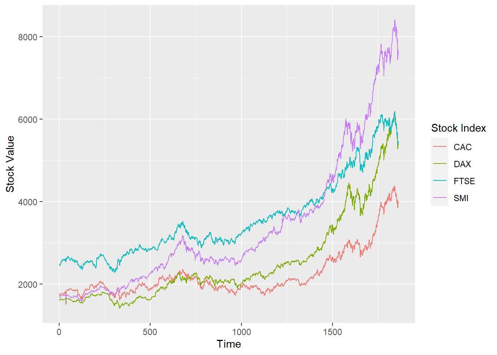
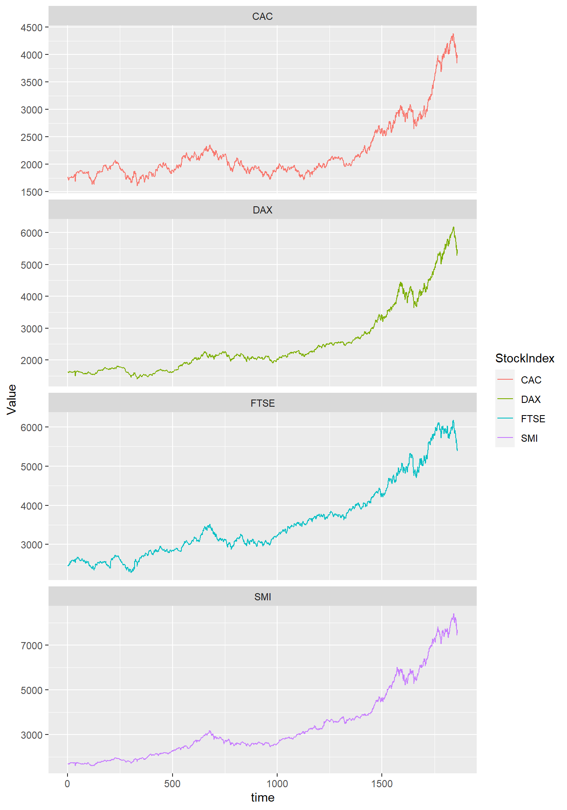

## Tidyr and ggplot


::: {.cell}

```{.r .cell-code}
here::i_am("git-r-101.Rproj")
library(here)
library(ggplot2)
library(dplyr)
library(tidyr)
```
:::


do not include the rendered doc in the Git for ensuring the compatibility forcing. The rendered version can be for online CV.

### Multiple lines on a single graph


::: {.cell}

```{.r .cell-code}
eustock <- as.data.frame(EuStockMarkets)
n <- nrow(eustock)  # get the number of rows
eustock <- eustock %>% mutate(time = 1:n)  # adding a time variable

ggplot(eustock, aes(y = DAX, x = time)) +
  geom_line()
```

::: {.cell-output-display}
{width=672}
:::
:::

Ploting the evolution of the dacs / the years

#### Wrong solution


::: {.cell}

```{.r .cell-code}
ggplot(eustock, aes(y = DAX, x = time)) +
  geom_line()+
  geom_line(mapping = aes(y=CAC), color='red')
```

::: {.cell-output-display}
{width=672}
:::
:::


The problems:
- the y axis name is wrong
- colors must be specified manually
- we miss an associations between colors and names (legend missing)

#### Tydir solution


::: {.cell}

```{.r .cell-code}
# Convert to long format
eustock_long <- eustock |> pivot_longer(
                                        cols = -time, 
                                        names_to = "StockIndex", 
                                        values_to = "Value")

# Create the plot
ggplot(eustock_long, aes(
                        x = time, 
                        y = Value, 
                        color = StockIndex,
                        group = StockIndex)) +
  geom_line() +
    labs(
        y = "Stock Value", 
        x = "Time", 
        color = "Stock Index")
```

::: {.cell-output-display}
{width=672}
:::
:::

::: {.cell}

```{.r .cell-code}
print(eustock_long)
```

::: {.cell-output .cell-output-stdout}
```
# A tibble: 7,440 × 3
    time StockIndex Value
   <int> <chr>      <dbl>
 1     1 DAX        1629.
 2     1 SMI        1678.
 3     1 CAC        1773.
 4     1 FTSE       2444.
 5     2 DAX        1614.
 6     2 SMI        1688.
 7     2 CAC        1750.
 8     2 FTSE       2460.
 9     3 DAX        1607.
10     3 SMI        1679.
# ℹ 7,430 more rows
```
:::
:::


When in the long format, whe can use other features of ggplot: 

::: {.cell}

```{.r .cell-code}
ggplot(eustock_long, aes(
                        x = time, 
                        y = Value, 
                        color = StockIndex)) +
  geom_line() +
  facet_wrap(~StockIndex, ncol = 1, scales = 'free_y')
```

::: {.cell-output-display}
{width=672}
:::
:::
